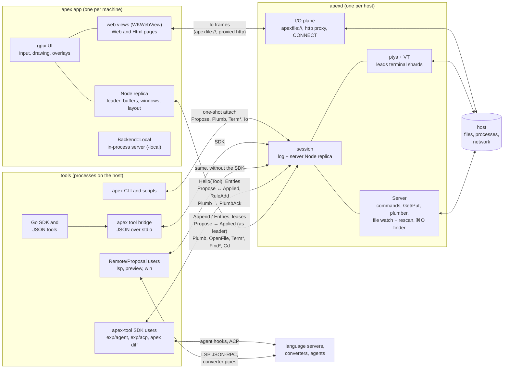
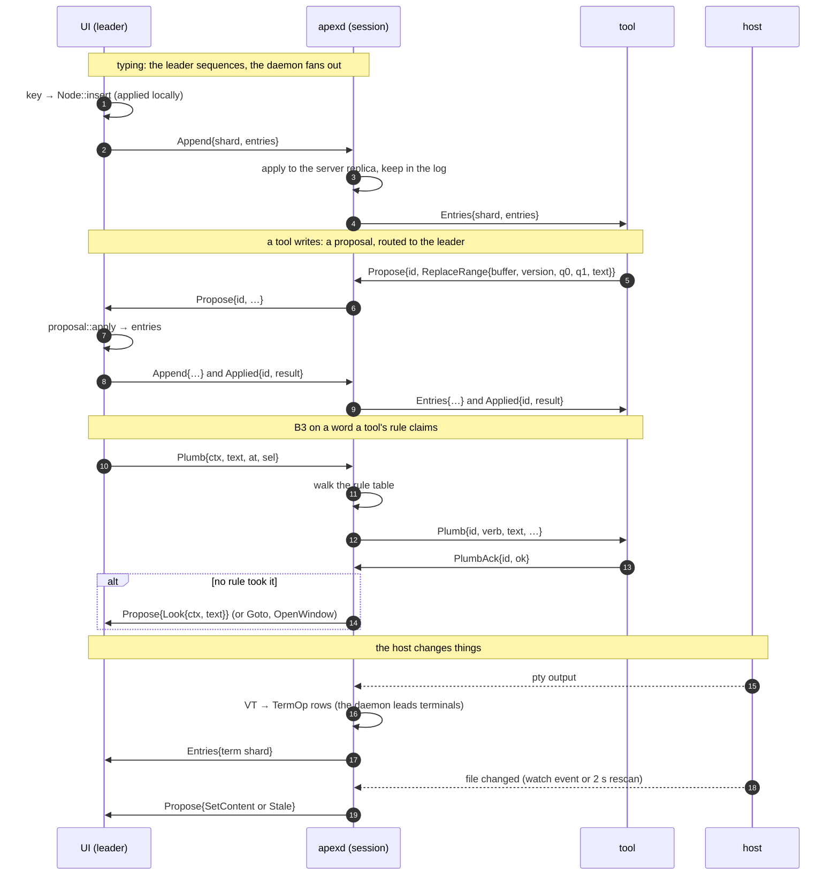

# Architecture review

October 2026. A review of apex against four goals:

1. **Minimal design**: no feature that could be a combination of other
   primitives.
2. **UI separated from the editing model**: a clean core, with UI
   affordances kept out of it.
3. **A minimal core**: anything beyond it could be a tool.
4. **Orthogonal, primitive tool APIs.**

The review read the code, not the docs: `apex-core`, `apex-server`,
`apex-client`, `apex-tool`, the bridge, the Go SDK, the CLI, and the
tools built on them (lsp, preview, win, `exp/agent`, `exp/acp`). File
and line references are as of the review; they will drift.

The short answer to all four goals is "not yet". The editing and
replication model (`ids.rs`, `entry.rs`, `state.rs::apply`, `buffer.rs`,
`log.rs`, `text.rs`) is clean, deterministic and well bounded. Around it,
the core also carries a port of acme's UI. The client re-implements
editing rules of its own. The protocol has several ways to do each
thing. The tool-facing APIs have drifted apart, and the bundled tools
bypass them.

---

## How it fits together today

Who talks to whom, and over what. One daemon runs per host and holds
many sessions. Each session is a set of logs (shards) and a replica of
their state.
- **The UI** that attaches takes the leases. It is the **leader**: it
  sequences edits to buffers, windows and the layout, and applies
  proposals.
- **The daemon** leads the shards only it can write: terminals, the
  metalog, the registry. It runs everything that needs the host.
- **Tools and the CLI** attach the same way. They keep replicas, and
  change things only by proposing.



Four flows that show the roles:



A few things in these diagrams are what the review below takes apart:
- **Pages bypass the protocol.** The web views talk to the I/O plane
  directly, beside it rather than through it (§5).
- **Three tools skip their own SDK.** lsp, preview and win use
  `Remote`/`Proposal` directly (§4).
- **The app carries a second server.** `Backend::Local` sits in the app
  as an alternative to the daemon (§3).
- **Opening goes the long way round.** It runs Plumb, then Goto, then
  OpenFile, then OpenWindow, and in step 14 a refused plumb ends as a
  proposal to the leader (§1).

---

## 0. Bugs found along the way

These were each checked against the code. Each is small, and they should
come before any restructuring.

All are fixed except the `Look` half of 4, which goes with the `Look`
proposal in the protocol collapse (Plan, step 2).

1. **A tool's write fails silently.**
   - The problem: `Proposal::ReplaceRange` on a version mismatch writes
     "pipe output not applied: buffer changed meanwhile" and the text to
     +Errors, then returns `Ok(None)` (`apex-server/src/proposal.rs:229-243`).
   - The effect: `Tool::replace` reports success and leaves a phantom
     entry in its own-edit queue (`apex-tool/src/lib.rs:613-629`).
   - Inconsistency: `Insert` returns `Err` for the same conflict
     (`proposal.rs:273`).
   - Workarounds today: preview and win each grew a retry loop.
2. **The divergence check has holes.** `State::hash`
   (`apex-core/src/state.rs`, `fn hash`) leaves out:
   - on each window: `owner`, `live`, `working`, `progress`, `diagnostic`;
   - on the layout: `covers`, `nav_back`, `nav_forward`;
   - on each terminal: links, view and progress.

   Replicas can diverge on any of these unnoticed. Hash the postcard
   encoding of each `Window`, `Layout` and `Term`, as `Meta` already is.
3. **`Indent off` is ignored.** The client computes the indent on Enter
   itself and types `"\n{indent}"` (`apex-client/src/app.rs:4985-4996`).
   The core only autoindents a bare `"\n"` and only when the window's
   `autoindent` flag is set (`apex-core/src/node.rs`, `fn insert`). In
   the GUI the core's path never runs.
4. **The `Edit` proposal behaves differently from the `Edit` command.**
   - The proposal (`proposal.rs`, `Proposal::Edit`) drops `run.warnings`
     and silently ignores `run.intents`.
   - The builtin reports the warnings and refuses the intents
     (`node.rs`, `"Edit" =>`).
   - `Proposal::Look` and the `Look` builtin have drifted the same way.
     Only the proposal handles reverse, Column/Top context, the tag's
     Look argument, and the pointer warp.
5. **Zerox breaks a selecting write.** A selecting `ReplaceRange` selects
   in `views.keys().next()`, an arbitrary view (`proposal.rs:232`). That
   is the wrong window when the buffer is shown twice.
6. **Tools can't tell a timeout from the end of the session.**
   `Tool::next_event` returns `Ok(None)` both on timeout and when the
   session has ended (`apex-tool/src/lib.rs:326-345`). Tools probe
   `windows()` and `alive()` to tell them apart.
7. **Dead code.**
   - Nothing sends `ClientMsg::Complete`, so `Server::complete` and
     `Proposal::Complete` are dead.
   - `Remote::ps` has no callers, and processes are already replicated
     in `meta.procs`.
   - The client ignores `ServerMsg::ShardReady` (`remote.rs:410`).
8. **`Kill` sleeps on the daemon's only thread.** It sleeps 100 ms to
   answer with a `Ps` snapshot (`daemon.rs:806`).

---

## 1. Minimality: features that are combinations of others

### The protocol

**Window constructors: five where one would do.** `OpenWindow`,
`NewWindow`, `TermWindow`, `OpenWeb` and `OpenHtml`
(`proposal.rs:14-47`) all end in `Node::open_window_as`. One proposal
covers them:

```
Open { body: Text{name, kind, scratch, text} | Term(id) | Web(url) | Html{path, text},
       place: Col(c) | Near(from) | Over(w) | Stash,
       label, reuse: bool, pos: Pos }
```

- `EditOver` becomes `place: Over(w)`, instead of the daemon rewriting
  the proposal (`daemon.rs:683-694`).
- `NewWindow.diagnostic` becomes `place: Stash`.

**"Go to a location": four paths.**
- The requests that start it: `ClientMsg::OpenFile`, `ClientMsg::EditOver`,
  `Plumb{edit_only}`, `Proposal::Goto` and `Proposal::Switch`.
- An open can take three round trips:
  1. `Plumb` → the server proposes `Goto`.
  2. The leader can't land it and queues it on `node.gotos`.
  3. The UI sends `OpenFile` → the server proposes `OpenWindow`.
  4. The UI lands via `pending_goto` (`app.rs:1835-1849, 4071-4101`).

Make it one request, `Goto{loc, ctx, place}`, handled by the server. It
reads the file if needed and proposes a single `Open{…, pos}` that the
leader lands in the same apply.

**Replacing text: four proposals with three conflict policies.**

| Proposal | On version conflict |
|---|---|
| `SetContent` | marks the buffer `Stale` |
| `ReplaceRange` | writes the text to +Errors and returns `Ok` |
| `Insert` | returns `Err` |
| `PutTrimmed` | silent no-op |

Replace them with one conditional edit:

```
Edit { buffer, if_version, edits: Vec<(q0, q1, text)>,
       after: { select: None | Range(ViewId) | Follow, clean: Option<Option<Hash>> },
       on_conflict: Fail | MarkStale(hash) }
```

(Rename the Edit-language proposal so the name is free, and fold it into
`Exec`.)

**Command proposals.** `Builtin`, `Edit` and `Look` are `Exec` with a
flag, and two of them have drifted (bug 4). Make them
`Exec{ctx, text, plain}`, after moving B3's Look behaviour into the
builtin.

**Window status flags.**
- `Own`, `Live`, `Working` and `Notify`/`Unnotify` are four
  attachment-scoped window flags with four paths. They already share one
  rule: valid while the attachment is attached (`node.rs:1026-1050`).
- `Notice` is the daemon's follow-up to `Notify`. The leader could react
  to the replicated notification itself.

Collapse to `Flag{window, kind: Owner | Live | Working{at} | Notify, on}`.

**Plain "append one op" proposals.** `Clean`, `Stale`, `Snarf`,
`SetLabel`, `SetPath` and `WebNavigate` (which is `SetPath` plus a
`Visit`) each append a single op under its own name
(`proposal.rs:217-345`). One allowlisted `Ops(Vec<(Shard, Op)>)` covers
them.

**Terminals.**
- `TermPaste` and `TermType` differ only in bracketing.
- `TermText` (snarf a range) and `TermRead` (read lines) are one read.

**Replies.**
- Most replies carry no request id, so `Link` keeps one "last reply" slot
  per type (`remote.rs:61-99`). Errors are matched by their text
  (`remote.rs:232, 638`).
- Use one envelope: `Req{id, body}` → `Reply{id, Result}`.

### The client

**List pickers: about nine.** The finder (⌘P), quickopen (⌘O), the
command palette, the tag path picker, the cwd picker, the session
selector, the title bar's session dropdown, ^F completion, and the B4
menu.
- They use four matchers:
  - `apex_core::fuzzy`;
  - `commands::score`;
  - substring (the session selector);
  - prefix (^F completion).
- Cursor wrapping and clamping differ between them.
- The cwd picker is nearly a copy of the tag path picker
  (`cwdbar.rs:217-374` vs `tagedit.rs:376-517, 567-673`).
- `shell::palette_*` is a partial shared primitive that only three of
  them use.

What to do:
- One `ListPicker` with an item source (static, streamed from the host,
  or a folder walk), one matcher, a row renderer, and a placement
  (centred, anchored, at the caret).
- The two folder pickers become one source with a different "pick"
  action.

**Caret blinking: 4+ copies.** They blink at 500 or 530 ms, most ignore
View ▸ Blink Cursor, and each overlay runs its own timer loop.

**Overlays: 14 separate `Option` fields** with hand-kept "is one up?"
checks that disagree:
- `overlay_up` (`app.rs:4166`);
- key routing (`app.rs:4603-4673`);
- `menu_edit`;
- `menu_command`;
- `overlay_field` (`shell.rs:1359`).

Likely consequence (not confirmed by running the app): ⌘V and ⌘C while
the tag, path or cwd field is open go to the text under the pointer.
Replace the fields with one `Option<Overlay>` (or a small stack) behind a
trait with `key`, `field`, `edit`, `render` and `bounds`.

**Navigation: four paths.**
- `Proposal::Goto` records the back stack.
- `Acme::goto` → `node.land` does not, so ⌘[ can't return from ⌘O or
  the path picker.
- `reveal_window`, `take_note` and `take_notification` repeat one body
  (`app.rs:1950-2033`).

**Transient text: five ways.** Toasts, `notice()` into +Errors, the
process hover card, and the inline notes in completion and quickopen.

**Window naming: five places that disagree.** `finder.rs:186`,
`sidebar.rs:450`, `shelf.rs:173`, `tagedit.rs:464` and `app.rs:2909`.
Add one `Node::window_title(w)` and share it with the CLI.

---

## 2. Separation of UI and editing model

### UI in the core

`lib.rs` says the core is headless. That is true of `state.rs`, but not
of `node.rs` or `tiling.rs`.

**The replicated layout is one client's pixel rendering.**
- `Slot` holds rectangles and frame measurements (`state.rs:96-128`).
- `tiling.rs` has pixel constants (`BORDER`, `SCROLLWID`, `STRIP`) and
  the `Info` trait for font and line metrics.
- The client swaps in its own measurements (`node.tiling`, `app.rs:2471`).
- Consequences:
  - A second UI with other fonts or DPI receives geometry measured by
    whichever node led last.
  - `mono`, `tabstop` and `tagexpand` have to be replicated, because they
    change line counts.

DESIGN.md chose this deliberately, after acme's `Dump`. Reversing it is
the biggest decision in this review (see the plan).

**The node queues effects for a client.**
- The fields: `warp`, `shows`, `gotos`, `page_finds`, `switches`,
  `quit_requested` (`node.rs:187-215`). The server pushes into them
  directly.
- `find_in_page` caps its queue because "a headless leader never takes
  them".
- What to do: have leader operations return an `Effects` value, or write
  to an injected sink.

**Focus is ambient and per node, but decides replicated commands.**
`seltext` and `activecol` choose:
- the buffer that Cut, Paste and Undo act on (`edit_target`, `exec_at`);
- the column for new and unstashed windows;
- `Web`'s argument.

The server keeps its own copy, so the same command can resolve
differently depending on which node runs it. Make the target view and
column explicit inputs.

**The layout API is in mouse vocabulary.**
- `grow_window(but)`, `drag_window(but, op, p)`, `drag_column` and
  `move_column_edge` take button numbers and press/release points.
- The `*_preview` functions have 5-pixel click thresholds.
- `minimize_*` is documented as "shift-B1" (`node.rs:775-959`).

Expose intent-named operations (grow, maximize, fill column, move to
column and y). Move the button mapping and the previews to the client.

**Tag chrome and UI built-ins.**
- Tag chrome:
  - the tag menu, `window_verbs`;
  - the tag's `Look` argument, `look_arg` and `set_look_arg`;
  - the default tag texts.
- Built-ins that belong to the UI:
  - `Font`;
  - `Web`, which hard-codes the client's `apexfile://` scheme
    (`node.rs:2198`);
  - `Exit`/`Quit`;
  - `ID`;
  - Look in pages.
- Hidden: the dirty check for `Get`, a server built-in, runs in core
  (`node.rs:1916`).
- Inconsistent lists: the two built-in lists (`plumb.rs::BUILTINS` and
  `Node::resolve`) are kept separately.

**Placement and attention policy in the core.**
- Diagnostic windows are made stashed (`node.rs:651`).
- `notice()` rearranges the layout so a notified window shows.
- `errors()` creates columns and windows and queues a show.
- `restash` orders the stash fan.

Keep diagnostic and notify as plain state, and let the caller choose
placement.

**Other leaks.**
- `warned` ("Del warns once") is interaction state.
- `snarf` lives on the Layout shard, so cutting a selection while typing
  needs the layout lease (`node.rs:1358`).
- `web_navigate` pushes web history onto the session's back stack, while
  `window_verbs` says a page's Back/Fwd is the client's own history.

### Editing rules in the client

**Keyboard editing.**
- `text_key` (`app.rs:4871-5056`) implements:
  - autoindent (bug 3);
  - ^A/^E;
  - Home/End through `iq1`;
  - Escape through `typed_start`;
  - tag Up/Down as `TagExpand`.
- `iq1` and `typed_start` live only in the client, so they are lost when
  the session moves to another client.
- Add `Node::key(view, Key)`, and have the client only map keystrokes to
  keys.

**Character classes are copied and inconsistent.**
- `is_alnum`, `is_file_char`, `is_exec_char` and `expand`
  (`app.rs:637-664`) copy `apex_core::expand` and `node::acme_isalnum`.
- `completion.rs:60` has a different `is_file_char` from the one
  `Acme::complete` uses.

**Commands that bypass the log.**
- `Acme::execute` (`app.rs:5109-5196`) intercepts before `node.exec`:
  - `End`;
  - `Send` for terminals;
  - page verbs parsed from the page's HTML;
  - Back/Fwd/Get on web windows;
  - `Snarf` in terminals;
  - Paste's clipboard sync.
- ⌘F/⌘G and live Look (`look.rs`) search with `text::find_match` and
  `node.select`. They make no Exec entry, so tools can't see or claim
  them.
- `find_match` and `Node::look_dir` are two literal searches with
  different reverse semantics.
- Renames apply `SetPath` directly (`tagedit.rs:270, 439`).
- What to do: register client-handled verbs as client rules (as Snarfout
  already is), and make ⌘G a `Look` exec.

**Layout policy during render.** `diagnostic_news` stashes a placed
diagnostic window. It is called from `sync()`, which render calls twice a
frame, and it copies and diffs every diagnostic window's whole text each
time (`toasts.rs:54-87`). The core already reports appended ranges
(`take_outputs`). Drive the toasts from those, and move the stash policy
to one place.

**Session history kept per machine.** Recently closed files are kept on
the machine (`finder.rs:139-168`), so a remote session's history depends
on which machine you attach from. Put them in the session.

---

## 3. A minimal core, and what could be tools

### Out of the core

| What | Where it goes |
|---|---|
| `transcript.rs` (only the client uses it) | the client |
| `preview.rs` (which converter for which file) | the preview tool |
| `fuzzy.rs` (generic) | a small crate |
| `double_click`, `acme_isalnum`, `isfilec` (in `node.rs`) | `text.rs` or a `words.rs` |
| UI built-ins (Font, Web, Exit, ID, Stash, Swap) | client or server handlers |
| Placement and attention policy | the caller |

`node.rs` (about 2,200 lines) splits naturally into:
- `replica.rs` (shards, leases);
- `windows.rs`;
- `layout_ops.rs`;
- `editing.rs`;
- `query.rs`;
- `errors.rs`;
- `nav.rs`;
- `commands.rs`.

**Kind handling.** There are two overlapping kind axes:
- `Body {Text, Term, Web, Html}`;
- `WinKind {File, Dir, Term, Errors, Web, Preview}`, which is stored on
  the buffer.

Collapse them to one body kind {Text, Term, Page}, and carry
Errors/Preview/Dir as a role. Their special cases are scattered across
`node.rs`.

### Out of the server

These need the server's privileges, so they stay:
- ptys and terminals;
- running commands, and killing process groups;
- file I/O for Get, Put and Open, including recognizing the server's own
  writes;
- `cd` and the session's environment, profile and attach scripts.

These are conveniences a tool on the host could provide:

| Feature | Where | Notes |
|---|---|---|
| ⌘O file finder | `find.rs` | a filesystem walk plus `fuzzy` |
| Folder listing for completion and pickers | `lib.rs:1219-1273` | two near-identical scans; could be `GET file:///dir/` on the I/O plane |
| The Preview, Clear and Win rules | `lib.rs:1060, 1300-1362` | hard-coded; Preview's are reinstalled on every `after()` |
| HTTP fetch in the I/O plane | `daemon.rs:937-946, 1039-1080` | `CONNECT` tunnelling already covers it |
| Providers (ssh bootstrap) | `providers.rs` | client and CLI logic in the server crate |

Most of these are blocked by one missing primitive: **a tool can't serve
requests to the app.** Tools can only propose to the leader and answer
plumbs.
- Route I/O-plane requests to tools, e.g. `apex+tool://NAME/…`.
- `ClientDo` (a call to the UI posing as a proposal, routed to the leader
  rather than the asker) moves onto the same mechanism.

**Server knowledge of particular tools and clients.**
- Hard-coded names:
  - `"profile"`/`"attach"` mark script processes;
  - `"Win"` runs `apex tool win`;
  - `"Preview"`;
  - `"Clear"`.
- The daemon sets `EDITOR` and `BROWSER` and makes symlinks beside its
  own binary.
- Tools are dispatched by attachment *name*, first match wins
  (`daemon.rs:1247`), and names aren't unique.

### A second engine in the client

`Backend::Local`, the in-process mode, is a copy of the daemon's
orchestration inside the client, and it has drifted from the daemon. It
lacks:
- tools, the profile and the environment;
- preview rules and `EDITOR`;
- the I/O plane;
- the daemon's "loop until settled" after each message.

It also accounts for about 24 Local/Remote branches across the client.
Delete it, and run the daemon in-process over a socket pair:
`Link::over_streams` already takes any byte streams.

---

## 4. Tool APIs

### Four surfaces that don't match

The Rust SDK (50 functions), the JSON bridge (36 ops), the Go SDK and the
CLI.

**In one surface but not the others.**
- `insert_following`, the call the SDK's own docs recommend for writing
  tool windows, is missing from the bridge and Go. That contradicts the
  bridge's "one for one" claim.
- Only the CLI has:
  - Edit programs and sam addresses;
  - terminal send and read;
  - the I/O plane;
  - `ps`, `kill`, `cd`, `env`;
  - the other rule actions.
- The CLI has no way to write to an existing window, and documents a
  nonexistent `apex win write`.

**The same thing under different names.**

| Concept | Rust | Bridge | Go |
|---|---|---|---|
| Write a range | `replace` | `write` | `Replace` |
| Install a rule | `offer` | `rule` | `Offer` |
| Answer a plumb | `answer` | `ack` | (automatic) |

**The same name with different meanings.**
- `open`: in the SDK it is a `Goto` (moves the user, records the back
  stack); in the CLI it is `OpenFile` into the first column.
- `notify`: the CLI's blocks until the user attends; the SDK's doesn't.

**Contract bugs between the bridge and Go.**
- The `hello` event's fields don't match: the bridge sends `{session, tool}`,
  but Go reads `attachment`, which is always 0.
- Go's `Serve`:
  - runs handlers in order and can't answer later;
  - drops an event on cancel;
  - documents a timeout that's wrong.

### The bundled tools bypass the SDK

LSP, preview and win use `Remote` and `Proposal` directly, with their own
step and propose loops. Their Cargo descriptions say they use only the
public API. The CLI, described as the stable public API, is not built on
the SDK either.

What they reach around for is the list of missing primitives:
- buffer open and close events;
- edits to every buffer, including the tool's own;
- write-and-mark-clean in one step;
- `Goto` with character or line-and-column positions;
- back/forward navigation;
- choosing the column;
- the catch-all `exec` verb.

### Not orthogonal

- **Making windows.** `new_window`, `new_scratch`, `new_diagnostic` and
  `new_page` are one call with options.
  - `diff` is a library composition, not a protocol op.
  - Every tool repeats new + set owner + set live + set tag + offer.
- **Status.** `set_live`, `set_owner`, `set_working`/`set_progress` and
  `set_clean` overlap.
  - Every tool sets owner and live together.
  - Collapse to owner and busy (none, indeterminate, or a percentage),
    with clean staying as buffer state.
- **Writing.** `replace`, `append`, `insert_following` and `set_tag` are
  one write with flags, but with different conflict behaviour.
- **Moving the user.** `open`, `bring` and `switch` are all "go to a
  location". `show` (scroll only) is distinct; keep it.
- **`notified`** exists only to be polled. Make it an `Attended` event.
- **`delete`** is `exec "Del"`: rules can intercept it, and for an
  unsaved window it warns instead. Either name it honestly or add a real
  forced delete, as acme's `ctl del`/`delete` distinguishes.

### The edit stream

**Own edits are filtered out.** A tool's own edits are removed from its
stream by matching their shape (`apex-tool/src/lib.rs:395-401`).
Consequences:
- Tools can't rebuild the order of edits.
- The LSP would desync after its own Fmt or Rename.
- agent and acp keep their own position tables and update them by hand,
  out of order.

Deliver every edit, each tagged with where it came from (acme's E/K/M).
Better still, add server-side **marks**: positions the server tracks
through edits.

### Compared with acme's file interface

| acme file | apex equivalent |
|---|---|
| `ctl` | split across about ten SDK calls; missing `dot=addr`, `addr=dot`, `mark`/`nomark` (undo grouping) and `del` vs `delete` |
| `addr` + `data` | **missing for tools**; there are only character offsets and `line(n)`, though the sam address evaluator exists (`apex_edit`, used by `apex text read -addr`) |
| `event` | rules plus answers replace B2/B3 delivery, which is a good divergence; but own edits are filtered, there's no origin, only watched windows report, and selections aren't reported |
| `index` | `windows()` lacks dirty, owner, diagnostic, working and notified; there are no create/delete events for windows that aren't the tool's own |
| `apex events` (CLI) | dumps the internal `Op` JSON, which makes the replicated-state schema public |

### Missing primitives

Without these, tools go to the filesystem or to `apex` subprocesses:
- **Terminal send and read.** The agent runs `apex term send`.
- **I/O plane get and put.** acp and the LSP use `std::fs` on their own
  host, which is wrong when the tool isn't on the session's host.
- **Reading the snarf buffer.**
- **Window and buffer lifecycle events.**
- **Back/forward navigation.**
- **An event when a setting changes.**
- **An undo-group mark.**

With these, `Send`, `ID`, `PutTrimmed`, the preview rule sync and
`apex editor` could all leave the core and the server for tools.

---

## 5. Pages: one view in the client, driven by tools

Preview, Web, diffs and the agent's pages are, today, special cases
spread over every layer:
- two body kinds and two window kinds (`Body::Web`/`Html`,
  `WinKind::Web`/`Preview`);
- three proposals: `OpenWeb`, `OpenHtml`, `WebNavigate`;
- Look in a page through `page_finds`;
- the core's `Web` built-in, with the client's URL scheme in it;
- page-verb parsing, Back/Fwd/Get interception and `ClientDo` in the
  client;
- hard-coded Preview rules in the server;
- `apex md` in the CLI.

The primitive that replaces them: **the client provides one page view and
knows nothing about what is in it; every page window is owned by a tool.**

**The client's whole job:**
- Render a URL and its subresources.
- Provide the generic affordances: scroll, select and copy, find, the
  scrollbar.
- Report what happens in the page to the window's owner.
- Carry out commands sent to the page.

### The parts

1. **One body kind, `Page { url }`.** The URL can be:
   - `http(s)://`: the open web, fetched through the session's host, as
     a terminal there would see it;
   - `apexfile://`: the host's files;
   - `apex+tool://NAME/…`: served by that tool over the I/O plane.

   This is the "a tool can serve requests" primitive that §3 found
   missing.

   A page that changes as its source is typed in (Preview) can instead
   take its HTML from a buffer the tool writes, as `Html` does now. That
   keeps the in-place update that preserves scroll position.
2. **Page events go to the owner**, as plumbs go to a rule's tool:
   - **Navigation requested** (a link, a form, a script). The tool
     answers allow, redirect, or "handled" (it opened a file in apex,
     handed the URL to the system browser).
   - **Title changed.**
   - **Loading started and ended.**
   - **A page verb run.**
3. **Commands from the owner to the page:**
   - navigate, reload, back, forward;
   - find;
   - scroll to a place (Preview following the caret);
   - run a page verb;
   - patch the content in place.

### What becomes a tool

- **Web.** A small tool on the session's host.
  - It answers the `Web` and `Newweb` commands and owns the windows they
    make.
  - It keeps their back/forward history. The page's history leaves the
    session's back stack, so `WebNavigate` and the mixed history model in
    the core go.
  - It decides that a link to the session's host opens in apex, and that
    a `mailto:` goes to the system.
- **Preview.** Already a tool. It takes over everything still elsewhere:
  - which converter runs for which file (`apex-core/src/preview.rs`);
  - its own rules (none hard-coded in the server);
  - Markdown conversion (`apex md`, out of the CLI);
  - following the caret.
- **Diff, the agent's pages, Changes.** Tools serving pages, with no
  special API. `Tool::diff` becomes library code.

### What goes elsewhere

- **Kinds and proposals.** `Body::Web`/`Html` and `WinKind::Web`/`Preview`
  collapse into one kind. `OpenWeb`, `OpenHtml` and `WebNavigate` go:
  `Open` with a `Page` body covers them (§1).
- **In the client:**
  - page-verb parsing and the Back/Fwd/Get interception in
    `Acme::execute`;
  - `ClientDo` for preview and open;
  - `page_finds` (find becomes a command to the page).

  What remains in the client is renderer code.
- **In the core:** the `Web` built-in, `web_url` (the client's
  `apexfile://` scheme) and `web_navigate`.

### Decisions

- **The open web goes through the host.**
  - For a remote session that adds latency; for a local one nothing
    changes.
  - It is also the more correct choice: the page sees the host's network,
    as a terminal there does.
- **Cookies and logins stay in the client's view.** They are per machine,
  not per session, which is right: they are the user's, not the
  session's.
- **A page whose tool has gone is inert.** Its content stays and its links
  do nothing. A built-in fallback (links open a new page) would bring
  back the policy the client is giving up.
- **Generic affordances stop at what needs no knowledge of the page.**
  Find, copy and scroll are the client's. Anything that knows what the
  page means (a table of contents, Mermaid, page verbs) comes from the
  page itself, as a script or `<meta>` the tool supplies.

---

## Plan

In order. Each step stands on its own.

1. **Fix the bugs** (§0).
2. **Collapse the protocol** (§1):
   - one `Open` with `place`;
   - one "go to" request;
   - one conditional `Edit`;
   - one window `Flag`;
   - command proposals folded into `Exec`;
   - requests and replies matched by id;
   - the dead variants deleted.

   This roughly halves the proposal and message variants, and ends the
   `Look` drift (bug 4) as a side effect.
3. **Make the tool API complete and honest** (§4):
   - every edit delivered with its origin, and server-side marks;
   - address and Edit-program calls;
   - lifecycle events;
   - terminal and I/O plane calls;
   - one window constructor with placement, and one busy flag.

   Then port LSP, preview, win and the CLI onto the SDK, and generate the
   bridge and Go surfaces from one schema, with a test that they agree.
4. **Delete `Backend::Local`.** Run the daemon in-process over a socket
   pair (§3).
5. **Pages** (§5):
   - one `Page` body;
   - tool-served URLs on the I/O plane;
   - page events to the owner and commands from it;
   - Web as a tool;
   - Preview owning its converters and rules.
6. **Move editing rules into the core and UI policy out of it** (§2):
   - `Node::key` for keyboard editing;
   - effects returned rather than queued;
   - focus as an explicit input;
   - intent-named layout operations;
   - UI built-ins to client or server handlers;
   - utilities to their crates.
7. **Decide: replicate logical layout, not pixels.**
   - Share only order, shares, and the full/stashed/cover flags.
   - Each client runs the tiling with its own metrics.
   - This removes warps, mouse vocabulary and font state from the core,
     and makes several clients consistent.
   - It reverses a deliberate choice in DESIGN.md, so it's the one
     decision here that needs a design discussion first.
8. **Client cleanups:**
   - one `ListPicker`;
   - one overlay state;
   - one blink clock;
   - one navigation path;
   - one window title;
   - split `app.rs` (5,600 lines, about 100 fields) into session, input,
     scroll, terminal, notes, client verbs, exec, view model and overlay.
