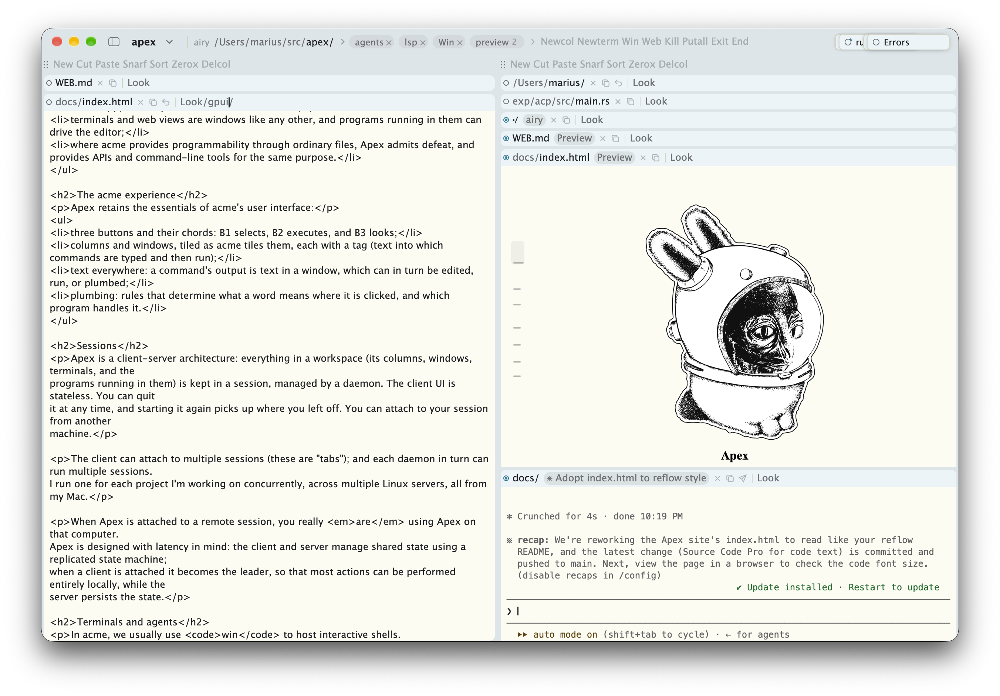

# Apex

Apex is a modernized [acme](https://en.wikipedia.org/wiki/Acme_(text_editor)):
text first, mouse oriented, with plumbing everywhere. It adopts acme's way
of working, and then adds what modern software engineering workflows
increasingly require: remoting, terminals, and web views. Apex ships as a
single Mac app; the daemon and the `apex` command also run on Linux, where
the app attaches to them over ssh.

- [mariusae.github.io/apex](https://mariusae.github.io/apex/): what Apex is, and how it differs from acme.
- [The user's guide](https://mariusae.github.io/apex/userguide.html): how to use it.
- [The design and implementation wiki](https://mariusae.github.io/apex/wiki/html/index.html): how it works.

## Building

Apex is written in Rust using [GPUI](https://gpui.rs). To build the app:

    % git clone https://github.com/mariusae/apex
    % cd apex
    % mac/build-app.sh

This produces `target/Apex.app`. Once it is running, *Apex ▸ Install apex
Command…* puts `apex` on your path.

## Further reading

- [DESIGN.md](DESIGN.md) describes how Apex is built, and why.
- [MODERN.md](MODERN.md) describes Apex as a Mac app.
- [WEB.md](WEB.md) describes web windows and Preview.
- [ARCHITECTURE.md](ARCHITECTURE.md) is a review of the architecture.

Apex is a work in progress. Alien Space Bunny is by Wilhelm Bierbaum, based
on artwork by Renée French.
