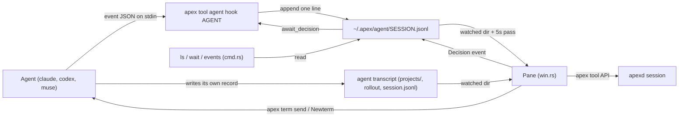
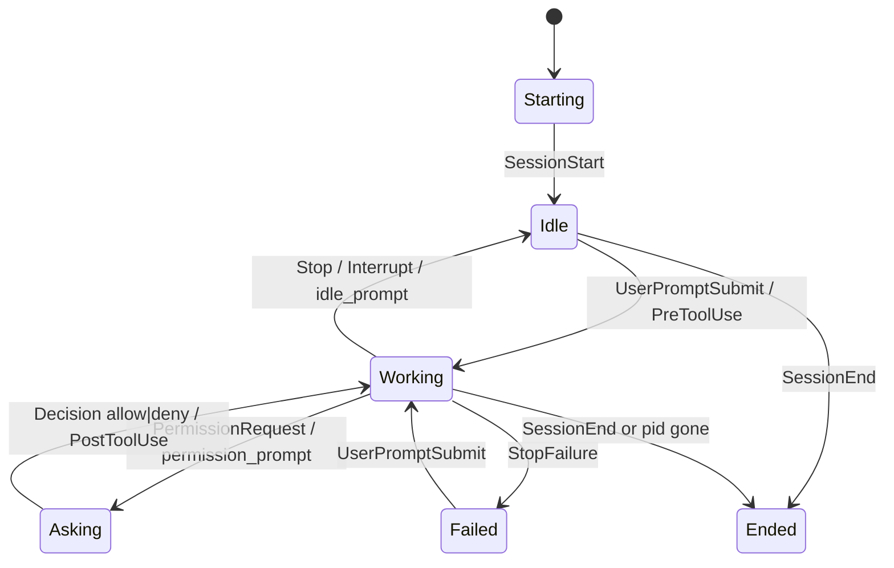
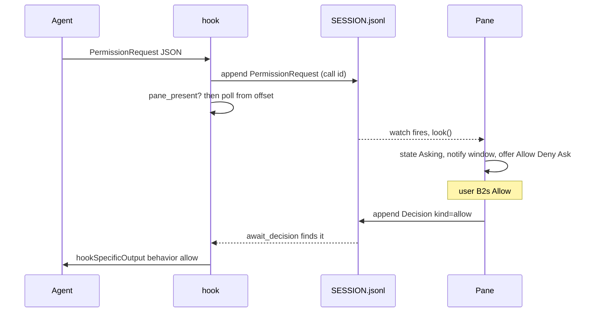

# Coding Agents: apex tool agent and apex-acp

apex hosts coding agents (Claude Code, Codex and Muse) in its [terminals](terminals.md), and `apex tool agent` is the bundled tool that serves them. For each agent it provides a transcript window, a page holding the agent's last answer, a diff of the agent's changes, `Allow`/`Deny`/`Ask` answers to permission questions, and a notification on the agent's terminal when the agent needs you. Nothing is added to the agents themselves. The tool runs on the hooks each agent already offers, and it is written only against the public [tool SDK](tool-sdk.md) (`apex-tool`), like every other bundled tool. The command line reaches it through `apex tool agent …`, which [`apex-cli`](cli.md) hands straight to `apex_tool_agent::cmd::run` ([crates/apex-cli/src/main.rs:1075](crates/apex-cli/src/main.rs#L1075)).

The page also covers `apex-acp`, an experiment in `exp/acp`. It is an [Agent Client Protocol](https://agentclientprotocol.com) client that runs the agent itself as a child process and turns an apex window into the conversation. The two take opposite approaches. `apex tool agent` watches agents you started yourself in a terminal. `apex-acp` *is* the agent's interface. The agent tool deliberately copies several of apex-acp's conventions: the `~`/`•`/`–` margins, the `Preview` page and the `-NAME` window naming. Pages are described on [The I/O Plane and Pages](io-plane-and-pages.md), and verbs and plumb rules on [Plumbing](plumbing.md).

## Architecture: hooks, logs and a reader

The design rests on one decision: **the hook and the tool share no socket and no daemon; they share files.** Each agent runs the hook command at every event. The hook appends one JSON line to `~/.apex/agent/SESSION.jsonl` and exits. The tool reads those logs and nothing else. So nothing has to be running when an agent starts, nothing is lost if the tool isn't running, a tool started late sees everything that came before, and two tools see the same thing ([crates/apex-tool-agent/src/event.rs:1-11](crates/apex-tool-agent/src/event.rs#L1-L11)).

Replies to the agent also go through channels that already exist. A permission decision is written into the agent's log as a `Decision` event, where the waiting hook reads it. A prompt is typed into the agent's terminal with `apex term send`. A new agent is started with `Newterm` ([crates/apex-tool-agent/src/win.rs:19-22](crates/apex-tool-agent/src/win.rs#L19-L22)).



| Module | Role |
|---|---|
| `hook.rs` | The hook. Reads the agent's event JSON and appends an `Event`. For permission requests it waits for a `Decision` |
| `event.rs` | The `Event` line format, log paths, the pane presence files, and `Tail`, which reads a file as it grows |
| `install.rs` | Writes the hooks into each agent's settings file, and takes them out again |
| `agent.rs` | `Agent`/`Agents`: folds events into per-agent state, and renders the overview pane's text |
| `transcript.rs` | Parsers for the three agents' own transcript formats, plus `Writer`, which renders them |
| `page.rs` | The last exchange as markdown, run through the session's `Preview.md` converter |
| `vcs.rs` | Repository detection and the diff since the session began (git, Sapling, Mercurial) |
| `history.rs` | Past sessions on disk, Muse transcript lookup, Muse parent resolution |
| `win.rs` | `Pane`: the tool proper. Windows, verbs, notifications, watches |
| `cmd.rs` | Command-line dispatch and the text commands `ls`, `wait`, `events` |

Sources: [crates/apex-tool-agent/src/lib.rs:1-67](crates/apex-tool-agent/src/lib.rs#L1-L67), [crates/apex-tool-agent/README.md:42-78](crates/apex-tool-agent/README.md#L42-L78), [crates/apex-tool-agent/src/win.rs:1-33](crates/apex-tool-agent/src/win.rs#L1-L33)

## Installing the hooks

`apex tool agent install [claude|codex|muse]...` (all three by default) writes hook entries into three files:

- Claude Code: `~/.claude/settings.json`
- Codex: `~/.codex/hooks.json`
- Muse: `$XDG_CONFIG_HOME/muse/settings.json`, or `~/.config/muse/settings.json` when that variable is unset

All three use the same `{"hooks": {EVENT: [{"hooks": [{type, command, timeout}]}]}}` shape ([crates/apex-tool-agent/src/install.rs:71-87](crates/apex-tool-agent/src/install.rs#L71-L87)). Each agent gets its own list of events:

| Agent | Events installed | Notes |
|---|---|---|
| claude | 15, including `PermissionRequest`, `PermissionDenied`, `Notification`, `StopFailure`, `PreCompact`/`PostCompact` | |
| codex | 12, including `Interrupt` | No `Notification` or `StopFailure`. Older Codex needs `codex_hooks = true` |
| muse | 14 | No `PermissionDenied` (Muse has no such event), and no `Interrupt`, because Muse wants that handler to return without waiting |

The command is written as `APEX tool agent hook AGENT`, with apex named **as it was invoked** rather than as it resolves. `invoked_as` makes a path absolute, or looks a bare name up on `PATH`, and does not follow symlinks. That way a dotslash or version-manager launcher keeps working after the cached binary behind it changes. Paths are shell-quoted when they need to be ([crates/apex-tool-agent/src/install.rs:97-126](crates/apex-tool-agent/src/install.rs#L97-L126)).

`settle` makes an install idempotent and leaves everything else in the file alone. First it removes every handler of ours from every event, whatever events an older install used. A handler counts as ours if its command contains ` tool agent hook `, or the older `apex-agent … hook`. Then it adds ours back and drops any groups and keys left empty. It writes the result through a temporary file and a rename, and only when the text actually changed. `PermissionRequest` handlers get a 120-second timeout and the rest get 5 ([crates/apex-tool-agent/src/install.rs:128-188](crates/apex-tool-agent/src/install.rs#L128-L188)). `uninstall` is the same pass with no command to add. Agents already running don't pick up new hooks until they restart.

Sources: [crates/apex-tool-agent/src/install.rs:14-212](crates/apex-tool-agent/src/install.rs#L14-L212), [crates/apex-tool-agent/src/cmd.rs:27-45](crates/apex-tool-agent/src/cmd.rs#L27-L45), [crates/apex-tool-agent/README.md:25-35](crates/apex-tool-agent/README.md#L25-L35)

## The hook and the event log

### What a line holds

An `Event` is small on purpose. The tool call's input is not kept; a `Write`'s input would be the whole file. Instead the call is summarised in words as `title`, which is what the pane shows anyway.

```rust
pub struct Event {
    pub ms: i64, pub agent: String, pub event: String, pub session: String,
    pub cwd: String, pub transcript: Option<String>, pub pid: Option<u32>,
    pub apex: Option<String>, pub win: Option<u64>, pub rev: Option<String>,
    pub sub: Option<String>, pub tool: Option<String>, pub call: Option<String>,
    pub title: Option<String>, pub text: Option<String>, pub kind: Option<String>,
    pub mode: Option<String>, pub plan: Option<(u32, u32)>,
}
```

`event_from` maps the agent's JSON onto these fields ([crates/apex-tool-agent/src/hook.rs:241-294](crates/apex-tool-agent/src/hook.rs#L241-L294)):

- **`title`** comes from `transcript::call_title`. It uses the agent's own words where it gave some (Claude's `description`), and otherwise the thing itself: the command, a path relative to `cwd`, a pattern.
- **`text`** is the prompt for `UserPromptSubmit`, or `last_assistant_message` for `Stop`. Both are kept nearly whole, cut at 64 KiB (`WHOLE`), because the page shows them. Notifications and failures are cut at 2000 characters (`LINE`).
- **`kind`** is the first field present among `notification_type`, `session_start_method`, `source`, `session_end_reason`, `reason`, `agent_type`, `subagent_id` and `trigger`.
- **`plan`** is (steps completed, total). It is taken from `TodoWrite`/`write_todos` todos or from Codex's `update_plan`.
- **`call`** is the `tool_use_id`. A Muse permission request has no id, so one is made by hashing the tool and its input (`muse-XXXXXXXX`). That lets the pane's answer find its question.

### Facts recorded once per session

When the event is `SessionStart`, or when no log exists yet for the session (the hooks were installed mid-session, or the tool cleaned the log away), the hook also records three things ([crates/apex-tool-agent/src/hook.rs:38-48](crates/apex-tool-agent/src/hook.rs#L38-L48)):

- **`pid`**: the agent's process. `agent_pid` walks up to eight ancestors. It returns the first one named after the agent (or `NAME.real`) or a JS runtime (`node`, `bun`, `deno`); failing that, it returns the nearest ancestor that isn't a shell ([crates/apex-tool-agent/src/hook.rs:365-397](crates/apex-tool-agent/src/hook.rs#L365-L397)).
- **`apex`, `win`**: the apex session and window the agent was started in, taken from the `apexsession` and `winid` variables apex puts in a command's environment. Muse doesn't pass these to its hooks, so `here` reads them from the agent process's own environment instead. On Linux that comes from `/proc/PID/environ`; elsewhere from `ps -E` or `ps eww`, which is best-effort ([crates/apex-tool-agent/src/hook.rs:321-363](crates/apex-tool-agent/src/hook.rs#L321-L363)).
- **`rev`**: where the repository stood, from `vcs::head`.

### Appending and reading

`append` serialises the event and writes it with a single `write_all` to a file opened in append mode. This keeps parallel tool calls from tearing each other's lines ([crates/apex-tool-agent/src/event.rs:127-136](crates/apex-tool-agent/src/event.rs#L127-L136)).

The log directory is `$APEX_AGENT_DIR`, or `~/.apex/agent`. An older `~/.apex/agents` directory is renamed to the new name the first time. Session ids are sanitised into file names ([crates/apex-tool-agent/src/event.rs:70-90](crates/apex-tool-agent/src/event.rs#L70-L90)).

`Tail` is the reader shared by logs and transcripts:

- It remembers the byte offset it has reached.
- It returns only whole lines, and keeps a half-written line until the rest arrives.
- If the file has shrunk, it starts again from the beginning.

Its definition is at [crates/apex-tool-agent/src/event.rs:142-190](crates/apex-tool-agent/src/event.rs#L142-L190).

### Muse subagents

Muse gives each subagent a session of its own and tells the hook nothing about the parent. `route_subsession` works out where each event belongs:

- It finds the parent on disk as the session directory with `subagent/CHILD` beneath it (`history::resolve_parent`).
- It remembers the answer in a marker file `subs/CHILD`, which holds the parent's id, `drop`, or nothing while the parent is still unknown.
- It rewrites the event onto the parent's log, with `sub` set to the child.

Muse's own observers are dropped from start to stop. These are subagents whose kind ends in `-reminder`, and calls to `submit_reminder_decision`. Markers older than a week are swept, since a session that was killed never says it stopped ([crates/apex-tool-agent/src/hook.rs:67-207](crates/apex-tool-agent/src/hook.rs#L67-L207)).

The hook always exits 0. A failing hook would be the agent's problem, so this one never fails ([crates/apex-tool-agent/src/hook.rs:1-5](crates/apex-tool-agent/src/hook.rs#L1-L5)).

Sources: [crates/apex-tool-agent/src/event.rs:18-195](crates/apex-tool-agent/src/event.rs#L18-L195), [crates/apex-tool-agent/src/hook.rs:20-65](crates/apex-tool-agent/src/hook.rs#L20-L65), [crates/apex-tool-agent/src/hook.rs:296-319](crates/apex-tool-agent/src/hook.rs#L296-L319)

## Agent state

`Agents` is a `BTreeMap` from session id to `Agent`. Every event in a log goes through `Agent::apply`, which updates its fields:

- What it was asked (`prompt`).
- The calls in flight (`running`). There can be several in parallel, and the last one started is the one shown.
- The question pending (`asked` and `asking`) and the pane's answer to it (`decided`).
- Its last word (`said`) and every finished `Exchange`, kept for the page's history.
- Why a turn failed (`why`).
- Subagents and what each one is running.
- The plan's progress.

Subagent events update only that subagent's entry ([crates/apex-tool-agent/src/agent.rs:44-269](crates/apex-tool-agent/src/agent.rs#L44-L269)).



The order of the `State` variants (`Asking`, `Failed`, `Idle`, `Working`, `Starting`, `Ended`) is also the order the pane lists agents in. Whatever needs an answer comes first. `Agents::ordered` sorts by state, then by start time, so a block keeps its place while the agent works, and it drops `Ended` agents.

Each state has a margin glyph: `?`, `✗`, `~`, `▶`, `⋯`, `–`. `doing()` produces the block's third line. For an unanswered question that line carries the words `Allow Deny Ask`, so you can B2 them where they stand ([crates/apex-tool-agent/src/agent.rs:10-26](crates/apex-tool-agent/src/agent.rs#L10-L26), [crates/apex-tool-agent/src/agent.rs:271-345](crates/apex-tool-agent/src/agent.rs#L271-L345)).

Some details of `apply`:

- A `SessionStart` that arrives mid-turn (a compaction) leaves `Working` alone.
- `PreCompact` adds a pseudo-call "compacting the context".
- A `Stop` with non-empty text records a new `Exchange`.

`agent::pane` renders the header, one block per agent, and a footer counting agents filtered out. `pane_text` joins these and returns where each block starts, measured in characters ([crates/apex-tool-agent/src/agent.rs:377-477](crates/apex-tool-agent/src/agent.rs#L377-L477)).

Sources: [crates/apex-tool-agent/src/agent.rs:1-477](crates/apex-tool-agent/src/agent.rs#L1-L477)

## The tool: `Pane`

`Pane::run` attaches to the session as the tool `agent` ([crates/apex-tool-agent/src/win.rs:226-229](crates/apex-tool-agent/src/win.rs#L226-L229)). `Pane::start` then sets up the tool's face ([crates/apex-tool-agent/src/win.rs:232-292](crates/apex-tool-agent/src/win.rs#L232-L292)):

- **With `-a` only:** the overview window `DIR/-agent`. It is owned by the tool and its tag reads `Look Open Goto Preview Changes Send Start History Ask`. `Allow`, `Deny` and `Resume` are offered as unlisted verbs, and a priority-10 plumb rule on the window opens the agent under B3.
- **Always:** a plumb rule at priority −1 for any hex word shaped like an id (`[0-9a-fA-F]{6,}(-[0-9a-fA-F]{4,})*`). B3 on a session id anywhere then opens its transcript. A word that names no session is handed back.
- **Always:** `CopyContext` on every `File`, `Dir` and `Errors` window.
- **Always:** a `notify` watcher on the logs directory, and a presence file `panes/PID`.

| Option | Field | Effect |
|---|---|---|
| `-a` | `pane` | Makes the overview window. Without it the tool has no window of its own |
| `-all` | `all` | Every agent on the machine, not only those started in this apex session |
| `-quiet` | `quiet` | No `asks:`/`failed:` notes in `+Errors` |
| `-thoughts` | `thoughts` | Transcripts include the agents' thinking as `  ·` lines |
| `-cwd DIR` | `cwd` | The pane's directory |

### The loop

`serve` polls `next_event` every 20 ms ([crates/apex-tool-agent/src/win.rs:296-385](crates/apex-tool-agent/src/win.rs#L296-L385)).

**When a watch fires, or every 5 seconds (`SLOW`),** it runs one pass:

1. `tick_details` reads the transcripts first, so that when a hook speaks of a call, the call's line is already there.
2. `look` reads the logs and applies new events.
3. `sweep` deletes the logs of ended sessions.
4. `render`, `sync_targets`, `sync_flags` and `sync_busy` update the windows.

On the 5-second pass it also runs `check_alive`, which marks an agent `Ended` once `kill(pid, 0)` says its process is gone, and it touches the presence file. With nothing new, the pane is still re-rendered every 15 seconds (`MINUTES`) so the "quiet for" times stay current ([crates/apex-tool-agent/src/win.rs:76-82](crates/apex-tool-agent/src/win.rs#L76-L82), [crates/apex-tool-agent/src/win.rs:588-702](crates/apex-tool-agent/src/win.rs#L588-L702)).

Watches are on directories, not files, because an appended file and a file renamed into place show up as different events. They are reference-counted per directory, so each open transcript keeps its own directory watched ([crates/apex-tool-agent/src/win.rs:563-586](crates/apex-tool-agent/src/win.rs#L563-L586)).

**Plumb events** are dispatched by rule, in this order:

1. A page's `Back`, `Fwd` or `Latest`.
2. A verb in an agent's own terminal, which is about that agent (`verb_for`).
3. A pane verb, applied to the agent that `meant` picks.
4. B3 in a block.
5. B3 on an id.
6. A transcript window's `Send`.

The loop ends when the pane window is deleted. Without a pane, it ends when the session is no longer alive.

`render_pane` rewrites only the blocks that changed, last first so earlier offsets stay valid, provided the set and order of blocks is unchanged. Otherwise it rewrites the whole window. The pane's handle pulses while any agent works, and the pane is marked clean when none is working ([crates/apex-tool-agent/src/win.rs:742-788](crates/apex-tool-agent/src/win.rs#L742-L788)).

The filters are applied in `render_pane` and `under()`:

- Without `-all`, inside an apex session, only agents whose recorded `apex` session is this one are shown.
- Outside an apex session, the pane's directory is the filter.
- A pane in `~` or `/` shows everything.

### On the agent's own window

`current_in_windows` finds the agents of this apex session whose recorded window still exists. If a terminal has been reused for a new agent session, the most recently active agent wins ([crates/apex-tool-agent/src/win.rs:201-217](crates/apex-tool-agent/src/win.rs#L201-L217)). Three passes use that list:

- **`sync_targets`** offers `Transcript`, `Preview` and `Changes` on the window as priority-5 window rules. While the agent is asking and nothing has been decided, it also offers `Allow`, `Deny` and `Ask`. Rules are withdrawn when the agent or the window goes ([crates/apex-tool-agent/src/win.rs:402-448](crates/apex-tool-agent/src/win.rs#L402-L448)).
- **`sync_flags`** raises a notification on the window while the agent is `Idle`, `Asking` or `Failed`, and lowers it when the agent leaves that state. `Flag` records whether the notification was ever seen raised. If it was raised and is now off, the user dismissed it, and it is not raised again until the agent has been back to work ([crates/apex-tool-agent/src/win.rs:468-513](crates/apex-tool-agent/src/win.rs#L468-L513)).
- **`sync_busy`** marks a working agent's window with `set_working`. If the plan gives a fraction, it uses `set_progress` with the percentage done ([crates/apex-tool-agent/src/win.rs:515-545](crates/apex-tool-agent/src/win.rs#L515-L545)).

Notifications and marks belong to the tool, so if the tool dies none are left behind. How notifications look in the client is covered on [Sessions, Tabs and Window Chrome](client-chrome.md).

Sources: [crates/apex-tool-agent/src/win.rs:50-385](crates/apex-tool-agent/src/win.rs#L50-L385), [crates/apex-tool-agent/src/win.rs:402-545](crates/apex-tool-agent/src/win.rs#L402-L545), [crates/apex-tool-agent/src/win.rs:588-788](crates/apex-tool-agent/src/win.rs#L588-L788)

## Answering permissions

A question is answered through the log. The hook asks only when three things are true: the event is a `PermissionRequest`, it is not a subagent's, and `pane_present` finds a presence file whose PID is alive. Without a live tool the hook doesn't wait at all.

When it does ask, it remembers the log's length before appending. `await_decision` then polls the log every 100 ms from that offset, for up to 90 seconds (`WAIT`), looking for a `Decision` with the same `call`. If the answer is `allow` or `deny`, the hook prints Claude Code's `hookSpecificOutput` decision JSON, which Codex shares. If the answer is `ask`, or the wait times out, it prints nothing, and the agent falls back to its own prompt ([crates/apex-tool-agent/src/hook.rs:50-65](crates/apex-tool-agent/src/hook.rs#L50-L65), [crates/apex-tool-agent/src/hook.rs:209-236](crates/apex-tool-agent/src/hook.rs#L209-L236), [crates/apex-tool-agent/src/event.rs:92-119](crates/apex-tool-agent/src/event.rs#L92-L119)).



`decide` picks the agent from the block that dot is in. With dot outside any block it uses the single agent that is asking, and otherwise reports in `+Errors`. `decide_for` appends the `Decision` event ([crates/apex-tool-agent/src/win.rs:887-927](crates/apex-tool-agent/src/win.rs#L887-L927)).

The same event updates the tool's own state. `allow` and `deny` return the agent to `Working`, and `ask` changes the line to "asked at the terminal". `heard` turns the transcript's glyph to `▶` or `✗`. If not `-quiet`, it also writes `KIND ID asks: …` or `failed: …` to `+Errors` when an agent enters `Asking` or `Failed` ([crates/apex-tool-agent/src/win.rs:624-660](crates/apex-tool-agent/src/win.rs#L624-L660)).

Note that the hook's 90-second wait fits inside the 120-second timeout that `install` gives the `PermissionRequest` handler.

Sources: [crates/apex-tool-agent/src/hook.rs:16-65](crates/apex-tool-agent/src/hook.rs#L16-L65), [crates/apex-tool-agent/src/hook.rs:209-236](crates/apex-tool-agent/src/hook.rs#L209-L236), [crates/apex-tool-agent/src/win.rs:887-927](crates/apex-tool-agent/src/win.rs#L887-L927), [crates/apex-tool-agent/src/install.rs:166-169](crates/apex-tool-agent/src/install.rs#L166-L169)

## Transcripts

A transcript window is a scratch window at the agent's own directory, so a `path:line` in it B3s relative to where the agent worked. Its label is `KIND SHORTID`, which is how the README's `AGENTDIR/-claude+0b1c1425` name comes about. The window is owned by the tool, set live, has `Look Send` in its tag, and is watched for edits ([crates/apex-tool-agent/src/win.rs:1202-1255](crates/apex-tool-agent/src/win.rs#L1202-L1255)).

The file comes from the hook's `transcript_path`. For Muse, `history::muse_transcript` searches `sessions/YYYY/MM/DD/ID/session.jsonl` instead ([crates/apex-tool-agent/src/win.rs:1257-1274](crates/apex-tool-agent/src/win.rs#L1257-L1274), [crates/apex-tool-agent/src/history.rs:102-121](crates/apex-tool-agent/src/history.rs#L102-L121)).

Each format has a `Parser` that turns one line into `Item`s: `User`, `Agent`, `Thought`, `Call{id,title,detail}`, `Result{id,ok,text}` or `Note` ([crates/apex-tool-agent/src/transcript.rs:15-31](crates/apex-tool-agent/src/transcript.rs#L15-L31), [crates/apex-tool-agent/src/transcript.rs:412-424](crates/apex-tool-agent/src/transcript.rs#L412-L424)):

| Parser | Source format | What it skips |
|---|---|---|
| `Claude` | `~/.claude/projects/PROJ/SESSION.jsonl`: `user`/`assistant` messages with `text`, `thinking`, `tool_use` and `tool_result` blocks; `system` `api_error` becomes a `Note` | `isSidechain` (subagents), `isMeta`, `<system-reminder>` spans, local-command and bash wrappers |
| `Codex` | rollout `response_item`s: `message`, `reasoning`, `function_call`, `custom_tool_call`, `local_shell_call` and their outputs (with exit code) | `event_msg`, `turn_context`, environment and instructions messages |
| `Muse` | `runtime.session` envelopes: run `started` (the prompt), `inbox_item_queued` from `user_steer`, `assistant_message_committed`, `reasoning_committed`, tool calls and result batches | Task and hook bookkeeping, and queued items not from the user |

`call_detail` adds lines under a call:

- the whole command when the title used the description instead;
- an edit as a trimmed `-`/`+` hunk, cut at a dozen lines a side;
- a write's line count;
- a plan as checkboxes;
- the first lines of a patch or a subagent prompt.

`brief` cuts any title to one line of 76 characters ([crates/apex-tool-agent/src/transcript.rs:48-233](crates/apex-tool-agent/src/transcript.rs#L48-L233)).

`Writer` renders the items. A prompt is `~`, a blank line, then the user's text. An agent message is `•`. A call is a status glyph and its title, with an *anchor* (the glyph's offset) remembered by call id. A result rewrites that glyph to `✓` or `✗` and adds up to 12 lines of output. Hooks often speak of a call before its line is in the transcript, so `glyph()` keeps the change pending until the call is written ([crates/apex-tool-agent/src/transcript.rs:235-404](crates/apex-tool-agent/src/transcript.rs#L235-L404)).

`Writer` emits `Op::Append` and `Op::Glyph` ops. `win::apply` applies an append with `insert_following`, so the window follows its output as `win` does, and a glyph with a one-character `replace` ([crates/apex-tool-agent/src/win.rs:1337-1346](crates/apex-tool-agent/src/win.rs#L1337-L1346)).

The user's edits arrive as `Event::Edit` and go to `Writer::shift`. An edit at or past the end is a draft, and the transcript keeps ending where it did. An edit inside moves the anchors, or drops those it covers.

`Send` in a transcript's tag reads everything after `wr.len`, types it into the agent's terminal, and then deletes it, because it comes back as the agent's own record of the prompt ([crates/apex-tool-agent/src/win.rs:1006-1024](crates/apex-tool-agent/src/win.rs#L1006-L1024)). `tick_details` marks the window clean unless a draft is being typed ([crates/apex-tool-agent/src/win.rs:1289-1317](crates/apex-tool-agent/src/win.rs#L1289-L1317)). When the agent ends, the window gets the note "the agent is gone".

Sources: [crates/apex-tool-agent/src/transcript.rs:1-745](crates/apex-tool-agent/src/transcript.rs#L1-L745), [crates/apex-tool-agent/src/win.rs:1202-1317](crates/apex-tool-agent/src/win.rs#L1202-L1317)

## Preview pages and changes

### The page

`Preview` toggles a page at the agent's directory. The page is owned by the tool, set live, has `Look Back Fwd Latest` in its tag, and has those three verbs offered on it ([crates/apex-tool-agent/src/win.rs:1055-1082](crates/apex-tool-agent/src/win.rs#L1055-L1082)).

`page::markdown` quotes the prompt with `> ` and then gives the answer. `page::render` pipes that through the session's `Preview.md` setting, or `apex md` by default, using `$SHELL -c` in the agent's directory. It writes stdin from a separate thread so a large reply can't deadlock the pipe. If the converter fails, the error and the markdown are shown escaped inside `<pre>` ([crates/apex-tool-agent/src/page.rs:11-67](crates/apex-tool-agent/src/page.rs#L11-L67)).

On each `Stop`, `show_page` moves the page to the new exchange, but only if it was showing the newest one. A page you have paged back through stays put. `navigate_page` steps through `Agent::exchanges` ([crates/apex-tool-agent/src/win.rs:1084-1126](crates/apex-tool-agent/src/win.rs#L1084-L1126)). The `Preview.md` setting is described on [Configuration](configuration.md).

### Changes

`Changes` writes a scratch window at the repository root, labelled `KIND ID diff`, and reuses it on later runs ([crates/apex-tool-agent/src/win.rs:1141-1174](crates/apex-tool-agent/src/win.rs#L1141-L1174)).

`vcs::repo` finds the nearest `.git`, `.sl` or `.hg` going up the tree; a `.git` file, as in a worktree, counts too. `vcs::head` records the base revision when the session starts, using `git rev-parse HEAD`, `sl whereami` or `hg id -i --debug`. `vcs::changes` runs the status command and then the diff against that base, so commits the agent made are included. With no base it diffs against the last commit:

- git: `git diff --no-prefix --no-color BASE`
- Sapling and Mercurial: `diff --noprefix --color=never -r BASE`

`located` follows each hunk header with `path:line` for the start of the new side, so B3 opens the file there ([crates/apex-tool-agent/src/vcs.rs:36-148](crates/apex-tool-agent/src/vcs.rs#L36-L148)).

Sources: [crates/apex-tool-agent/src/page.rs:1-67](crates/apex-tool-agent/src/page.rs#L1-L67), [crates/apex-tool-agent/src/vcs.rs:1-148](crates/apex-tool-agent/src/vcs.rs#L1-L148), [crates/apex-tool-agent/src/win.rs:1043-1174](crates/apex-tool-agent/src/win.rs#L1043-L1174)

## Pane verbs, history and reaching agents

`meant` decides which agent a pane verb is about ([crates/apex-tool-agent/src/win.rs:826-858](crates/apex-tool-agent/src/win.rs#L826-L858)):

- With an argument, the argument can be an id prefix, an agent kind, or a directory suffix.
- With no argument, it is the block that dot is in, or the only block there is.
- An ambiguous or unknown name gets a line in `+Errors`.

| Verb | Where | What it does |
|---|---|---|
| `Open` / `Transcript` | pane / agent window | Opens the transcript, or brings it forward if it is already open |
| `Goto` | pane | `t.switch(session, window)` to the recorded apex session and window. An agent started outside apex gets an error |
| `Preview`, `Changes` | both | As described above |
| `Send [ID] TEXT` | pane, transcript | `apex -session=S term send WIN "TEXT\n"`. Needs `apex` on `PATH`, beside the binary, or in `~/.apex/bin` |
| `Start [AGENT] [DIR]` | pane | `Newterm AGENT`, or `Newterm cd DIR && exec AGENT`, via `exec_in` |
| `Resume ID` | pane, history | Runs `Start` with `--resume ID` (claude) or `resume ID` (codex, muse) in the session's directory |
| `History` | pane | Toggles `DIR/-agent+history` (label `agent history`) |
| `Allow`, `Deny`, `Ask` | both | Writes a `Decision` |
| `CopyContext` | any file, dir or errors window | Snarfs `NAME:LINE:` followed by the selection fenced, or the current line when the selection is empty |

Sources for the table: [crates/apex-tool-agent/src/win.rs:860-1041](crates/apex-tool-agent/src/win.rs#L860-L1041), [crates/apex-tool-agent/src/win.rs:1348-1390](crates/apex-tool-agent/src/win.rs#L1348-L1390), [crates/apex-tool-agent/src/win.rs:450-466](crates/apex-tool-agent/src/win.rs#L450-L466).

`history::sessions` gathers past sessions for a directory from three places, newest first ([crates/apex-tool-agent/src/history.rs:47-78](crates/apex-tool-agent/src/history.rs#L47-L78)):

- Claude's project directory. Claude names it by replacing every non-alphanumeric character of the path with `-`.
- Codex `rollout-*.jsonl` files whose metadata gives that `cwd`.
- Muse `session.jsonl` logs.

B3 on an id in the listing opens the past transcript with a note at the top ([crates/apex-tool-agent/src/win.rs:1176-1200](crates/apex-tool-agent/src/win.rs#L1176-L1200), [crates/apex-tool-agent/src/win.rs:1276-1287](crates/apex-tool-agent/src/win.rs#L1276-L1287)).

Sources: [crates/apex-tool-agent/src/win.rs:826-1041](crates/apex-tool-agent/src/win.rs#L826-L1041), [crates/apex-tool-agent/src/history.rs:26-143](crates/apex-tool-agent/src/history.rs#L26-L143)

## `ls`, `wait` and `events`

These read the same logs without attaching to apex, for scripts ([crates/apex-tool-agent/src/cmd.rs:46-60](crates/apex-tool-agent/src/cmd.rs#L46-L60)):

- **`ls`** reads every log whole (`read_all`) and prints `agent::pane`'s text with no filter.
- **`wait ID`** finds the agent by unique id prefix, or by kind when exactly one agent has that kind. It applies events every 200 ms until the agent is no longer `Working` or `Starting`. The exit status gives the state. If the log disappears or the PID dies, it exits 3 ([crates/apex-tool-agent/src/cmd.rs:103-145](crates/apex-tool-agent/src/cmd.rs#L103-L145)).
- **`events [-all]`** tails every log and prints one tab-separated line per event: `ms`, short session, agent, event, and `brief` of the title, kind or text. By default it starts at the current end of each log; `-all` starts from the beginning ([crates/apex-tool-agent/src/cmd.rs:147-181](crates/apex-tool-agent/src/cmd.rs#L147-L181)).

| `wait` exit status | Meaning |
|---|---|
| 0 | `Idle`: the turn is over |
| 1 | `Asking` |
| 2 | `Failed` |
| 3 | `Ended`, or the process is gone |
| 4 | No such agent |

Sources: [crates/apex-tool-agent/src/cmd.rs:1-181](crates/apex-tool-agent/src/cmd.rs#L1-L181)

## Testing and known gaps

Unit tests sit beside each module. They cover:

- event parsing and plan counting;
- Muse subagent routing and the marker sweep;
- `await_decision`;
- idempotent install and uninstall, including replacing the older `apex-agent` hooks;
- state transitions and pane text;
- the three transcript parsers;
- the git diff end to end (skipped when `git` is absent).

`tests/pane.rs` runs a real `Daemon` on a thread and drives the pane through a `Remote`. It checks that a log becomes a block, that B3 opens the transcript, which then follows both the file and the hooks, that Muse agents work the same way, and that a ready agent raises a notification on its own window when there is no pane. Waits in these tests are shorter than the 5-second slow pass, so they prove the watches work ([crates/apex-tool-agent/tests/pane.rs:1-60](crates/apex-tool-agent/tests/pane.rs#L1-L60)).

The README lists what is not done:

- Codex, Sapling and Mercurial have been implemented from their documentation, not tested against running copies.
- Sessions that were already running when the hooks were installed are not seen until they restart.
- Muse subagents' permission questions are never put to the pane.

Sources: [crates/apex-tool-agent/README.md:309-319](crates/apex-tool-agent/README.md#L309-L319), [crates/apex-tool-agent/tests/pane.rs:1-60](crates/apex-tool-agent/tests/pane.rs#L1-L60)

## apex-acp (experimental)

`apex-acp [claude|codex|CMD] [-cwd DIR] [-thoughts] [-transcript] [-resume]` runs an ACP agent as a child process. The agent is the one argument, or `$APEX_ACP_AGENT`. The default is the Claude adapter: `claude-agent-acp` if it is installed, otherwise `npx @agentclientprotocol/claude-agent-acp@latest`. The adapter needs node 20 or newer. `npx()` passes over any node that is too old, tries `$APEX_ACP_NODE_BIN` and Zed's bundled node, and says which node it found when none will do ([exp/acp/src/main.rs:254-357](exp/acp/src/main.rs#L254-L357)).

The window is `DIR/-claude`, named for the agent by `label`, which skips runner commands such as `python3` or `npx` ([exp/acp/src/main.rs:229-252](exp/acp/src/main.rs#L229-L252)). It is written only against `apex-tool`, attaches with `Tool::attach("acp")`, and is not part of the supported surface.

### Two sides joined by channels

The tool API is synchronous and the ACP library is async, so the program runs on two threads:

- **The window side, `Win`,** runs on a thread of its own.
- **The agent side** runs on a tokio current-thread runtime on the main thread.

They exchange `Out` and `In` messages ([exp/acp/src/main.rs:71-137](exp/acp/src/main.rs#L71-L137), [exp/acp/src/main.rs:197-225](exp/acp/src/main.rs#L197-L225)).

`agent_side` registers handlers for session notifications and for the client requests. When it initializes, it declares filesystem read and write and terminal capabilities. The client requests are:

- permission;
- `fs/read_text_file` and `fs/write_text_file`;
- `terminal/create`, `output`, `wait_for_exit`, `kill` and `release`.

Each request is forwarded to the window side together with its `Responder`, so the window side does the answering. After initialization, the agent side creates a new session, or with `-resume` restores the newest one. A failed `session/new` waits for a `Login`.

The prompt loop then takes one prompt at a time:

- Prompts that arrive during a turn are queued.
- `Interrupt` sends `CancelNotification` and drops the queue.
- `Mode` and `List` requests during a turn are sent on spawned tasks.
- `Load` during a turn is refused ([exp/acp/src/main.rs:361-585](exp/acp/src/main.rs#L361-L585)).

Past sessions come from paginated `session/list` calls. `restore` uses `session/load` when the agent can replay the session, otherwise `session/resume` ([exp/acp/src/main.rs:593-663](exp/acp/src/main.rs#L593-L663)).

### The window side

`Win` keeps the conversation window minimal. `•` is the agent, `–` is apex, and `~` ends a turn; what stands under a `~` is yours. A single *action line* at the end shows the current tool call and is removed when the call finishes. The full record goes into `Trans`, the `+transcript` window. `Trans` is kept whether or not that window is open, so `Transcript` always opens on the whole conversation ([exp/acp/src/main.rs:694-878](exp/acp/src/main.rs#L694-L878)).

Verbs work as follows:

- The tools menu lists `Send`, `Interrupt`, `Preview`, `Transcript` and `Stop`.
- `Allow`, `Always`, `Deny`, `Never`, `Mode`, `Commands`, `Login` and `Resume` are unlisted.
- B3 on a hex id resumes that session.

`decide` answers the oldest pending permission with the option of the requested kind. If there is none of that kind it uses the nearest allow or reject, and if there is none at all it cancels. It then replaces the offered words with what was decided, in both windows ([exp/acp/src/main.rs:880-929](exp/acp/src/main.rs#L880-L929), [exp/acp/src/main.rs:1433-1470](exp/acp/src/main.rs#L1433-L1470)).

File requests go through apex:

- **`read_file`** returns an open window's text if there is one, so unsaved edits are included; otherwise it reads the disk.
- **`write_file`** replaces the window's body and then runs `Put`, so the change is an edit you can see and undo. With no window open it writes straight to disk ([exp/acp/src/main.rs:2456-2492](exp/acp/src/main.rs#L2456-L2492)).

Terminals (`term.rs`) are child processes with their output captured, not ptys. Their output streams into `DIR/-claude+run` ([exp/acp/src/term.rs:1-7](exp/acp/src/term.rs#L1-L7)). The README lists what is not done: images, several agents in one window, and interactive commands. `fake_agent.py` exercises every path without a real agent.

Sources: [exp/acp/README.md:1-204](exp/acp/README.md#L1-L204), [exp/acp/src/main.rs:1-46](exp/acp/src/main.rs#L1-L46), [exp/acp/src/main.rs:361-663](exp/acp/src/main.rs#L361-L663), [exp/acp/src/main.rs:729-929](exp/acp/src/main.rs#L729-L929)
