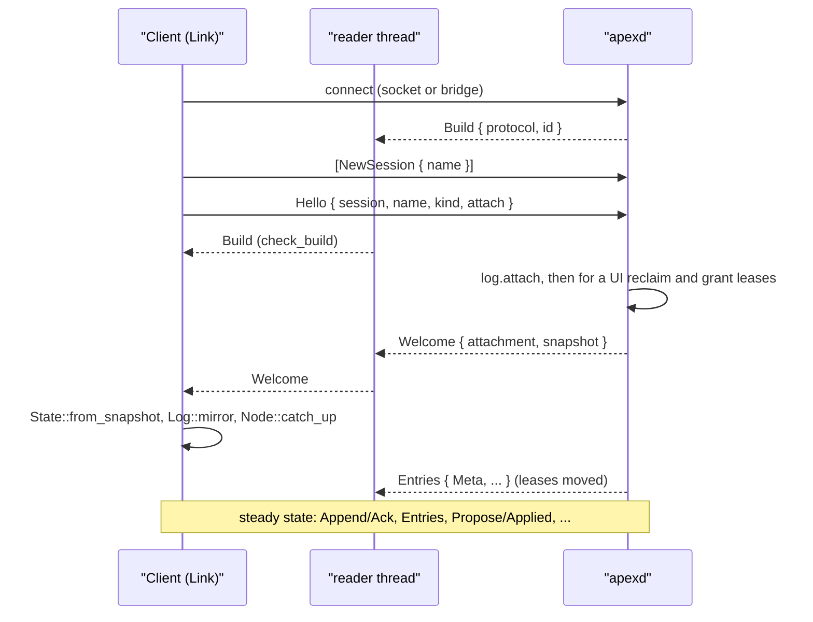
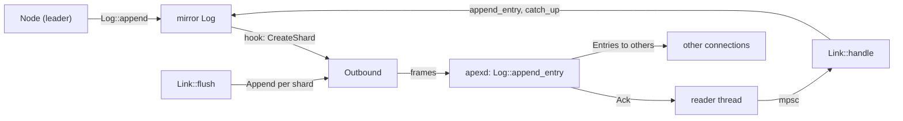
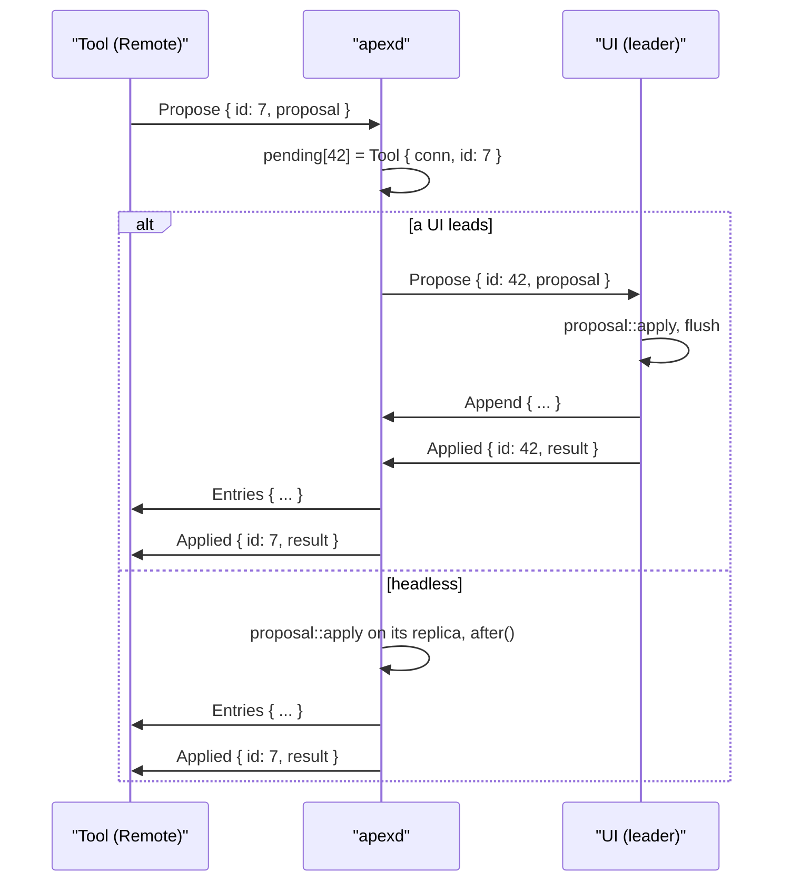

# The Attach Protocol

The attach protocol is the only wire in apex. Every client of a session talks to `apexd` over it: the gpui UI, the `apex` CLI, bundled tools such as `win` and `lsp`, and SDK tools. The client may be on the same machine, connected through a Unix socket, or on another machine, connected through `ssh host apex attach -stdio`. Over this wire, clients receive the replicated log entries of the shards they follow. A client that leads a shard ships its own entries back. A client that does not lead asks the leader for changes with proposals. Everything else also travels over it: terminal input, plumbing, questions to window owners, the ⌘O finder and the HTTP-shaped I/O plane.

The protocol has two halves. `proto.rs` defines the message types and the framing. `remote.rs` is the client side: a `Link` that drives a local `Node` over a *mirror* `Log`, and `Remote`, which bundles the three for headless clients. The daemon side is in `daemon.rs`, described on [The Daemon (apexd)](daemon.md). The replication model behind it is on [Sessions, Shards and Leadership](sessions-and-replication.md). What proposals contain and how they are applied is on [Proposals: How Others Change State](proposals.md).

## Framing and encoding

A frame is a little-endian `u32` length followed by that many bytes of [postcard](https://docs.rs/postcard)-encoded message. Every message in both directions uses this format, and two generic functions handle it:

```rust
pub fn write_frame<W: Write, T: Serialize>(w: &mut W, msg: &T) -> io::Result<()>
pub fn read_frame<R: Read, T: for<'de> Deserialize<'de>>(r: &mut R) -> io::Result<Option<T>>
```

`read_frame` returns `Ok(None)` when the stream ends cleanly before a length prefix, which is how both sides notice a hang-up. It refuses frames larger than 256 MiB with `InvalidData`. A frame that will not decode is also an `InvalidData` error. On the daemon, such an error ends the connection and is logged as `apexd: connection N: …`. One common cause is a peer built from another wire version.

Nothing in the framing assumes a socket. `Link::over_streams` takes any `Box<dyn Read + Send>` and `Box<dyn Write + Send>`. The remote story depends on this. On the host, `apex attach -stdio` copies bytes in both directions between its stdin/stdout and the daemon's socket, and never looks at the frames ([main.rs:1202-1228](crates/apex-cli/src/main.rs#L1202-L1228)). On the client, `bridge_child` runs the bridge command (`ssh …`, or a provider's equivalent) in a process group of its own. It returns the child's pipes and a closer that `killpg`s the whole group, so no half-dead ssh is left holding the far end open. See [Remote Hosts and Providers](remote-hosts.md).

Postcard is not self-describing: field names and variant names are not on the wire, only their order and types. The [Versioning](#versioning-protocol-and-the-build-id) section covers what follows from that.

Sources: [proto.rs:1-23](crates/apex-server/src/proto.rs#L1-L23), [proto.rs:358-382](crates/apex-server/src/proto.rs#L358-L382), [remote.rs:191-204](crates/apex-server/src/remote.rs#L191-L204), [remote.rs:524-550](crates/apex-server/src/remote.rs#L524-L550), [daemon.rs:465-484](crates/apex-server/src/daemon.rs#L465-L484), [main.rs:1202-1228](crates/apex-cli/src/main.rs#L1202-L1228)

## Versioning: PROTOCOL and the build id

`PROTOCOL` is a single `u32` (currently 54) that covers *everything* the wire carries:

- the messages in `proto.rs`
- the proposals
- apex-core's entries, ops, state and ids, which travel inside `Entries`, `Append` and the `Welcome` snapshot
- `TermKey` and `Running`

The module doc puts the rule plainly: any change to any of these is a new protocol, so bump `PROTOCOL` with the change. The git history follows that rule (for example "Protocol 54: a plumbing rule is only its owner's to remove").

A second identifier says *which binary* is running. `build.rs` hashes every `.rs` file under `crates/` together with `Cargo.lock`, in sorted path order, using SHA-256. It exports the first 12 hex digits as `APEX_BUILD_ID`, and `lib.rs` exposes that as `apex_server::BUILD_ID`. The same sources give the same id on every target, so a client can compare itself with the linux binary it carries for remote hosts.

The daemon says both values first on every connection. `Daemon::accept` queues `ServerMsg::Build { protocol, id }` before it reads anything. `Build` is variant 0 of `ServerMsg`, and the doc comment requires that it keep both its position and its shape. That way, a client of *any* version can decode the first frame even if every other variant has changed.

The client checks the frame with `check_build`, which compares **only the protocol**. A daemon from another build that speaks the same protocol is accepted. A daemon speaking a different protocol produces an `io::ErrorKind::Unsupported` error that tells the user what to do:

> the daemon speaks apex protocol N (build …), this is protocol M (build …); when its sessions can be let go, stop it (`apex stop` on its machine) and attach again

The UI uses that error kind to offer to restart a mismatched server (see [Sessions, Tabs and Window Chrome](client-chrome.md)). `stop_any` handles daemons of another version, which may not decode our `Stop` correctly. It first tries `list_sessions`. If that fails with `Unsupported`, it finds the process at the far end of the socket (`LOCAL_PEERPID` on macOS, `SO_PEERCRED` elsewhere) and confirms with `ps` that it is an `apex … server` on that very socket. Only then does it send `SIGTERM`, and if the process is still alive after 3 s, `SIGKILL`. A unit test with a fake "stale daemon" checks that a process which is not an apex server is left alone.

Sources: [proto.rs:21-23](crates/apex-server/src/proto.rs#L21-L23), [proto.rs:296-303](crates/apex-server/src/proto.rs#L296-L303), [build.rs:1-41](crates/apex-server/build.rs#L1-L41), [lib.rs:12](crates/apex-server/src/lib.rs#L12), [daemon.rs:456-459](crates/apex-server/src/daemon.rs#L456-L459), [remote.rs:568-632](crates/apex-server/src/remote.rs#L568-L632), [remote.rs:1084-1127](crates/apex-server/src/remote.rs#L1084-L1127), [socket.rs:290-313](crates/apex-server/tests/socket.rs#L290-L313)

## Connection lifecycle

A connection exists before it is attached. The daemon gives each accepted socket a connection id, plus two threads:

- a **reader**, which turns frames into `Event::Msg(id, msg)` on the daemon's single event channel and sends `Event::Gone(id)` when the stream ends;
- a **writer**, which drains a per-connection `Sender<ServerMsg>`, coalesces whatever is queued, and flushes once per batch.

All state lives on the one daemon thread that consumes the events.

Some messages work without attaching: `NewSession`, `ListSessions`, `RenameSession` and `EndSession` (each answered with `Sessions`, or with `Error`), `Ping` (answered with `Pong`) and `Stop`. One-shot helpers in `remote.rs` use them: `list_sessions`, `new_session`, `rename_session`, `end_session` and `stop`. Each opens a socket, sends one frame, and reads until it gets its answer, checking any `Build` frame on the way. Any other message on an unattached connection gets `Error { text: "not attached" }`.



### Hello and Welcome

`Hello { session, name, kind, attach }` names the session in one of three ways: by its id, by its label, or by a unique prefix of the id of at least four characters (`Daemon::resolve`).

The daemon records the attachment in the metalog (`log.attach`). If `kind` is `Ui`, it also runs single-player mode: for every unpinned shard whose lease is held by an attachment other than `SERVER`, it reclaims the lease, then grants every unpinned shard to the new attachment, and makes this connection the session's `leader`. A `Tool` attachment just follows.

The reply is `Welcome { attachment, snapshot }`. The snapshot is the daemon's follower replica serialised with `State::to_snapshot`, taken *after* the grants, so it already shows the new attachment holding its leases. The connection's per-shard forwarding marks start at the log's current last sequence numbers, because the snapshot covers everything before them. Two more steps follow in `Daemon::hello`. First, any work held for a tool of this name is handed over: plumbs, or page requests waiting for a tool started by a rule's `start`. Second, the client's attach script runs on the host. Finally `after` forwards the new metalog entries to everyone.

On the client, `over_streams_inner` sends `Hello` and then waits for at most 60 seconds ("no welcome from the daemon within a minute"). While waiting it handles three kinds of frame:

- `Build` goes through `check_build`.
- An `Error` starting with "no session", when the link was told to create one, triggers `NewSession` followed by a second `Hello` for the label. This is `over_streams_creating`, which the UI uses to open a session it was told to open. If the session is named by its label alone, `NewSession` is sent before the first `Hello`.
- Any other `Error` fails the connect.

When `Welcome` arrives, the link decodes the snapshot, builds the mirror log and the `Node`, and calls `catch_up`. It then sets its shipping marks to the mirror's last sequence numbers. A `Ui` link also sends the local `~/.apex/attach` as the `attach` script (`local_attach`).

### Ending

A connection ends in one of three ways:

- **The client drops.** `Link`'s `Drop` runs its closer, which shuts down the socket or kills the bridge's process group. The daemon's reader sees EOF and sends `Gone`.
- **The session ends.** Every member is sent `Ended { id, label }` and then cut off.
- **The daemon stops.** `ClientMsg::Stop` makes the main loop clear all connections and exit.

In `Daemon::gone`, the daemon removes the attachment's rules and adopted processes, appends `Detach`, and, if this connection led, reclaims its leases so that the daemon leads again. The test `a_tool_works_on_a_headless_session_and_a_ui_takes_over` checks the Layout lease returning to `SERVER` after the UI drops.

Sources: [daemon.rs:128-141](crates/apex-server/src/daemon.rs#L128-L141), [daemon.rs:247-311](crates/apex-server/src/daemon.rs#L247-L311), [daemon.rs:313-329](crates/apex-server/src/daemon.rs#L313-L329), [daemon.rs:456-642](crates/apex-server/src/daemon.rs#L456-L642), [remote.rs:148-265](crates/apex-server/src/remote.rs#L148-L265), [remote.rs:508-522](crates/apex-server/src/remote.rs#L508-L522), [remote.rs:661-720](crates/apex-server/src/remote.rs#L661-L720)

## The messages

`ClientMsg` (client to daemon) and `ServerMsg` (daemon to client) are plain enums. The tables group them by purpose. Each variant's doc comment in `proto.rs` gives the exact semantics.

### Replication

| Message | Direction | Meaning |
|---|---|---|
| `Hello` / `Welcome` | C→S / S→C | Attach, and receive the attachment id plus a state snapshot. |
| `Append { shard, entries }` | C→S | Entries this client sequenced as leader. |
| `Ack { shard, seq }` | S→C | The daemon stored this client's entries of `shard` up to `seq`. |
| `Entries { shard, entries }` | S→C | New entries of a shard (or the metalog) for this client to replay. |
| `CreateShard` / `DeleteShard` | C→S | Sent by the mirror log's hook when the leader makes or drops a shard. The daemon records the shard and grants the lease before processing the appends that follow. |
| `Propose { id, proposal }` | both | From a tool: "leader, please do this". From the daemon to the leader: "apply this" (`id` 0 means nobody waits). |
| `Applied { id, result }` | both | The leader's answer, which the daemon passes back to the tool under the tool's own id. |
| `Error { text }` | S→C | Something this connection asked for failed (a fenced append, an unknown window, a refused rule removal). |

### Plumbing and window owners

| Message | Direction | Meaning |
|---|---|---|
| `Plumb { ctx, text, dir, edit_only, dry, at, sel, alt, reverse, verb }` | C→S | B3, `apex plumb`, or a verb at the pointer. The rule table decides. |
| `PlumbTrace { lines }` | S→C | What a `dry` plumb would do, rule by rule. |
| `Plumbed { ok, why }` | S→C | A plumb this connection asked for is over. |
| `Ask { id, request }` | both | S→C: a `Request::Plumb` (a rule of yours claimed this; do you take it?) or a `Request::Navigate` (where does this link in your page go?). C→S: a leading client's `Navigate` question for a window's owner. |
| `Answer { id, answer }` / `Answered { id, answer }` | C→S / S→C | `Answer::Plumb { ok }` or `Answer::Navigate(NavAnswer)`. `Answered` carries `None` when nobody answered in time. |
| `RuleAdd` / `RuleAdded`, `RuleRm` | C↔S | Install a rule (owned by this attachment if `mine`); remove one (only its owner may). |
| `WindowEvent`, `PostToPage` | both | Page events for a window's owner; messages from the owner to the page's script, delivered by the client that leads. |

### Terminals

The `Term*` messages carry what a client cannot express as log entries: keystrokes, pastes and typed text (`TermKey`, `TermPaste`, `TermType`), size (`TermResize`), scrollback clearing, focus and the mouse wheel (`TermClear`, `TermFocus`, `TermScroll`), and reads of the terminal's history.

`TermText` asks the server to snarf a range of a terminal; the answer comes back as a `Snarf` proposal. `TermRead` is answered with `TermLines`. `TermFind` (Look in a terminal) is answered with `TermFound`. `ClientConfig { term: TermColors }` tells the daemon the UI's ink, paper and 16 ANSI colours, so that programs asking with OSC 10, 11 or 4 learn the real background. Only a `Ui` connection's colours are taken. `TermColors::LIGHT` is what a session answers when no UI is attached.

In the other direction, `Clipboard { text }` passes OSC 52 (and a tool's `Snarf`) to every UI on the session. The term shard itself is pinned and daemon-led: screen contents arrive as ordinary `Entries`. See [Terminals](terminals.md).

### Everything else

| Message | Meaning |
|---|---|
| `OpenFile`, `EditOver` | Open a file relative to a window's directory, in a column or covering a window. |
| `Env`, `EnvImport` → `Env { vars }` | Set or import session environment variables; the answer is the whole environment. |
| `Set { key, value, attachment }` | A session setting, or an attachment's setting. |
| `Notify`, `Unnotify` | Raise or lower a window's notification. |
| `Kill { targets }`, `Named { … }` | End commands; a program names itself for `ps` and the top row. |
| `Cd { dir }` | Change the session's directory. |
| `FindStart`, `FindQuery`, `FindStop` → `Found { … }` | ⌘O: walk a directory on the host and match it as the query changes, by generation. |
| `Candidates` → `Candidates(…)` | ^F path completion. |
| `Io { stream, frame: IoFrame }` | The I/O plane: `Request`, `Response`, `Body`, `End`, `Reset`. |
| `Ping`/`Pong`, `Sessions`, `Ended`, `Stop` | Liveness, session listing, session end, daemon exit. |

Many of these are answered only to the connection that asked; a reply is never a log entry. The daemon's `in_session` makes this explicit with `return` before `after` for request/answer pairs such as `TermRead`, `Answer`, `Ask`, `Io` and `Find*`.

Sources: [proto.rs:25-212](crates/apex-server/src/proto.rs#L25-L212), [proto.rs:214-246](crates/apex-server/src/proto.rs#L214-L246), [proto.rs:296-356](crates/apex-server/src/proto.rs#L296-L356), [proto.rs:402-455](crates/apex-server/src/proto.rs#L402-L455), [daemon.rs:644-963](crates/apex-server/src/daemon.rs#L644-L963)

## Replication over the wire

### The mirror log

The key idea on the client side is that the `Node` does not know it is remote. It appends to a `Log` exactly as it would in-process. That `Log` is a **mirror**, built by `Log::mirror(&state, hook)` from the snapshot:

- every shard starts at its applied sequence number, with no entries;
- leases are copied from the metalog state;
- `next_rule` is set past existing rule ids.

Because the client holds the lease, `Log::append` assigns the next sequence number locally. That is the same number the daemon will store, because the daemon's `append_entry` accepts an entry only if:

- its `attachment` and `epoch` match the lease, and
- its `seq` is exactly one past the daemon's last.

So a leader types with no round trip, and the daemon's checks fence anyone who is behind: an entry from a stale epoch or with a gap is refused with `LogError::Fenced` and reported back as `Error`.

The metalog is the exception: the daemon sequences it, and the mirror only receives it. Shard creation therefore takes a shortcut on a mirror. `create_shard` assumes the grant the daemon will make (the creator at epoch 1, or `SERVER` at epoch 0 for pinned shards). It then calls `MirrorHook::create_shard`. `remote.rs`'s `Hook` implements this by sending `ClientMsg::CreateShard` at once, so the request reaches the daemon ahead of the `Append` that `flush` sends later. The daemon runs `create_shard(shard, attachment)` on its own log, which makes `ShardNew` and `LeaseGrant` entries matching the client's assumption.



### Flush and Ack

`Link::flush(&log)` walks every shard in the mirror and sends each one's entries after the link's `sent` mark as an `Append`. It moves the mark and starts an ack timer for the shard if none is running. All the frames go out under one lock of the shared `Outbound`, followed by a single flush. The UI calls `flush` on every frame; the test `selection_and_scroll_position_survive_reattach` notes this ("what the UI does on every frame").

The daemon appends entry by entry and stops at the first error, which it reports. It then catches up its follower replica and moves *this connection's* forwarding mark to the log's end, so the appender is not sent its own entries back. It replies `Ack { shard, seq }` with the last entry stored. When a received `Ack` reaches the pending sequence number, `Link` records how long the round trip took in `ack_ms`.

The `outbound` handle (`Outbound`, an `Arc<Mutex<BufWriter<…>>>`) is shared by the owner, the mirror hook and any threads using the I/O plane. Each `send` writes one frame and flushes.

### Receiving Entries

For `ServerMsg::Entries`, `Link::handle` does four things:

1. **Records `foreign_end`.** For buffer shards, it notes where each edit by *another* attachment ended. In a `win` window this is the output point.
2. **Appends** each entry to the mirror with `append_entry`, stopping at the first error.
3. **Calls `node.catch_up(log)`.**
4. **Moves the shipping mark** past what arrived, unless this client leads the shard. Whatever the daemon handed over is the daemon's, and this step makes sure a follower never echoes it back in the next `flush`.

The daemon side of this is `Daemon::after`, which runs after nearly every message. For each connection on the session, it sends the entries of each shard after that connection's mark. It sends **the metalog first**, because `ShardNew` and lease changes must arrive before the entries they announce.

### Compaction on both sides

Neither log keeps history. The daemon compacts each shard up to the minimum of four values:

- the last sequence number;
- what its follower replica has applied;
- what the `Server`'s node has applied;
- what every connection on the session has been sent.

The mirror compacts in `compact_mirror`, run on `Entries` and on `Ack`. Its low-water mark is what the node has applied, further limited, for a shard this client leads, by what has been both sent and acked. A mirror therefore holds only what is still outstanding.

Sources: [log.rs:40-58](crates/apex-core/src/log.rs#L40-L58), [log.rs:102-148](crates/apex-core/src/log.rs#L102-L148), [log.rs:213-251](crates/apex-core/src/log.rs#L213-L251), [log.rs:380-389](crates/apex-core/src/log.rs#L380-L389), [remote.rs:21-42](crates/apex-server/src/remote.rs#L21-L42), [remote.rs:314-372](crates/apex-server/src/remote.rs#L314-L372), [remote.rs:444-480](crates/apex-server/src/remote.rs#L444-L480), [daemon.rs:650-690](crates/apex-server/src/daemon.rs#L650-L690), [daemon.rs:1510-1591](crates/apex-server/src/daemon.rs#L1510-L1591)

## Proposals and questions over the wire

A tool does not lead, so it changes state by proposal. `Link::propose(p)` assigns the next id from the link's counter, sends `Propose { id, proposal }`, and returns the id. The answer later shows up in `link.applied`.

At the daemon, each tool proposal gets a daemon-side id in `pending` that records the tool's connection and its id. `Daemon::propose` then routes the proposal:

- **A UI leads:** it is sent `ServerMsg::Propose { id: daemon_id, … }`. The UI's `Link::handle` applies it with `proposal::apply`, flushes the resulting entries, and replies `Applied { id }`. The daemon accepts `Applied` **only from the session's leader**, and maps it back through `pending` to `ServerMsg::Applied { id: tool_id }` on the tool's connection.
- **No UI is attached:** the daemon applies it to its own replica. It runs `after` *before* answering, so the tool's replica already has the window the proposal made by the time `Applied` arrives.

The `Server`'s own proposals (a command's output, a file's new content) go to the leader with `id: 0`, and nobody waits for them.



When `Link::handle` applies a proposal, it also does some bookkeeping:

- For `Insert` and non-empty `ReplaceRange`, it records the range in `outputs` (acme's scrolling rule) and in `foreign_end`.
- Windows the proposal made go to `made`.
- `Proposal::ClientDo` (a rule asking the client to do something only it can) is queued in `client_asks` for a `Ui`, to be answered by the owner once done. Any other kind of client refuses it at once.

Questions follow the same request-and-answer pattern with deadlines kept on the daemon:

- **Plumbs handed to tools.** A `Request::Plumb` is sent to the tool attached under the rule's tool name. The tool has `B3_ANSWER` (1 s) to answer a B3 and `VERB_ANSWER` (10 s) to answer a verb. After that a `PlumbTimeout` event moves the walk on.
- **Navigation questions.** A `Request::Navigate` from the leading client goes to the window's owner, with `ASK_ANSWER` (2 s) before `Answered { answer: None }`. A `Link` that has not set `answers_navigation` replies `NavAnswer::Default` immediately.

Plumbing itself is described on [Plumbing Rules and Verbs](plumbing.md).

Sources: [remote.rs:305-312](crates/apex-server/src/remote.rs#L305-L312), [remote.rs:373-430](crates/apex-server/src/remote.rs#L373-L430), [daemon.rs:190-209](crates/apex-server/src/daemon.rs#L190-L209), [daemon.rs:932-956](crates/apex-server/src/daemon.rs#L932-L956), [daemon.rs:965-979](crates/apex-server/src/daemon.rs#L965-L979), [daemon.rs:1354-1388](crates/apex-server/src/daemon.rs#L1354-L1388), [daemon.rs:1583-1587](crates/apex-server/src/daemon.rs#L1583-L1587)

## The client side: Link

`Link` is the connection, not the replica. The owner keeps the `Log` and `Node` returned by `connect` and drives them. The UI holds them inside its app; a headless client holds them in `Remote`.

| Function | What it does |
|---|---|
| `Link::connect(path, session, name, kind, wake)` | Unix socket connect, then `over`. |
| `Link::over(stream, …)` / `over_streams(reader, writer, closer, …)` | Attach over a socket or any stream pair. Returns `(Link, Log, Node)`. |
| `Link::over_streams_creating(…, session, label, …)` | Same, making the session labelled `label` if the daemon has none by that name. |
| `flush(&log)` | Ship sequenced entries as `Append`s. |
| `handle(node, log, msg)` | Apply one `ServerMsg`. Returns `false` when the connection is finished. |
| `poll(node, log)` | Drain `rx` without blocking. |
| `propose`, `ask`, `window_event`, `send` | Send messages; `propose` and `ask` return ids. |
| `io_open`, `io_plane` | Open an I/O-plane stream; get a thread-safe `IoPlane`. |
| `take_made`, `take_outputs` | Drain windows made and outputs written by proposals. |
| `close` | Run the closer (also run on `Drop`). |

A **reader thread** (`spawn_reader`) decodes frames and pushes them to the `rx` channel. After each one it calls an optional `Wake` callback, so an event loop that cannot block on `rx` (the gpui app) knows to poll; it also wakes once more when the stream ends. The thread intercepts `Io` frames for streams a thread registered through `IoPlane`: those go straight to that stream's sink, so a web view's proxy traffic never waits for the UI loop.

Stream ids handed out by `IoIds` are odd and increasing. The daemon numbers the streams it opens itself on a tool's connection (requests for pages the tool serves) from `RELAYED` = `0x8000_0000` upward, above any id a tool opens itself.

Most answers are stored in public fields for the owner to take: `applied`, `sessions`, `env`, `trace`, `plumbed`, `plumbs` (as `ToolPlumb`), `asks`, `answered`, `window_events` (kept only while `wants_window_events`), `page_posts`, `rule_added`, `io`, `term_lines`, `term_found`, `clips`, `candidates`, `found`, `last_pong`, `ended` and `error`. `handle` only records them; it does not act on them. That is why `handle` covers every `ServerMsg` variant with a single exhaustive `match`: adding a variant forces a decision here.

Sources: [remote.rs:44-146](crates/apex-server/src/remote.rs#L44-L146), [remote.rs:266-312](crates/apex-server/src/remote.rs#L266-L312), [remote.rs:339-505](crates/apex-server/src/remote.rs#L339-L505), [remote.rs:1056-1082](crates/apex-server/src/remote.rs#L1056-L1082), [plane.rs:17-79](crates/apex-server/src/plane.rs#L17-L79), [daemon.rs:171-174](crates/apex-server/src/daemon.rs#L171-L174), [app.rs:1438-1492](crates/apex-client/src/app.rs#L1438-L1492)

## Remote: headless clients

`Remote { log, node, link }` is the bundle that the CLI, the bundled tools and the integration tests use. Its constructors are:

- `connect`, which attaches as `Ui`;
- `connect_as(…, kind)`;
- `via(cmd, …)`, which runs `bridge_child(cmd)` and attaches over its pipes;
- `connect_with`, which takes an explicit attach script, for tests.

Note that plain `Remote::connect` attaches as a **UI** and so takes the leases. Tools should use `connect_as(…, AttachmentKind::Tool)`.

`Remote`'s value is its blocking helpers. Each sends a request and then calls `step(timeout)` repeatedly, handling one message at a time until a field of the link holds the answer or the deadline passes:

| Helper | Request → awaited answer |
|---|---|
| `propose(p, timeout)` | `Propose` → `applied[id]` ("timed out waiting for the leader") |
| `rule_add` | `RuleAdd` → `rule_added` |
| `plumb_dry` | `Plumb { dry: true }` → `trace` |
| `env`, `env_import` | `Env` / `EnvImport` → `env` |
| `read_file` | `GET file://…` → `Response` plus `Body`s up to `End` |
| `watch` / `io_next_file` / `unwatch` | `GET` with `Watch: 1` → the first `FileFrame`, then one per change |
| `io_open`, `io_send`, `io_end`, `io_response`, `io_collect`, `io_take` | Raw I/O-plane streams (bodies sent in 256 KiB chunks) |
| `plumb_ack`, `answer`, `announce`, `kill` | Fire-and-forget `Answer`, `Named`, `Kill` |

Because each wait handles every message that arrives meanwhile, the replica stays current while a tool blocks. When `propose` returns, the entries the proposal produced have normally already been replayed, since the daemon forwards entries before `Applied`.

Sources: [remote.rs:722-1054](crates/apex-server/src/remote.rs#L722-L1054), [remote.rs:1129-1149](crates/apex-server/src/remote.rs#L1129-L1149)

## Testing

`crates/apex-server/tests/socket.rs` runs a real `Daemon::run_with` on a thread with a fresh socket per test, and clients built from `Remote`. Its `wait` helper steps a client until a predicate holds. The tests cover the protocol's main guarantees:

- `attach_edit_ack_and_reattach`: a UI edits, flushes and is acked up to the mirror's last sequence number. A second UI attaches, sees the same text, takes the leases (the first is now fenced at the server), and edits in turn.
- `a_tool_works_on_a_headless_session_and_a_ui_takes_over`: proposals applied by the daemon as leader; a UI attaching and applying a tool's `Select`, with `Applied` coming back to the tool; leases returning to `SERVER` when the UI drops.
- `selection_and_scroll_position_survive_reattach`: view state travels in the snapshot.
- `the_daemon_says_its_build_first_and_stops_when_told`: the first frame is `Build` with this `PROTOCOL` and `BUILD_ID`, and `stop` removes the daemon.
- `sessions_are_listed_and_made`, terminals over the socket, plumbing, page owners' `Ask`/`WindowEvent`/`PostToPage` routing, and the file watcher.

`remote.rs` has unit tests for `check_build` and for `stop_any`'s refusal to signal a process that is not an apex server. `crates/apex-cli/tests/cli.rs` attaches with `Link::over_streams` through `apex attach -stdio`, exercising the bridge path.

Sources: [socket.rs:1-313](crates/apex-server/tests/socket.rs#L1-L313), [socket.rs:484-532](crates/apex-server/tests/socket.rs#L484-L532), [remote.rs:1084-1127](crates/apex-server/src/remote.rs#L1084-L1127), [cli.rs:166](crates/apex-cli/tests/cli.rs#L166)
