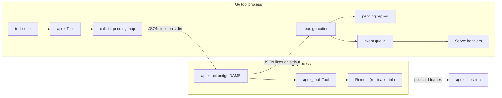
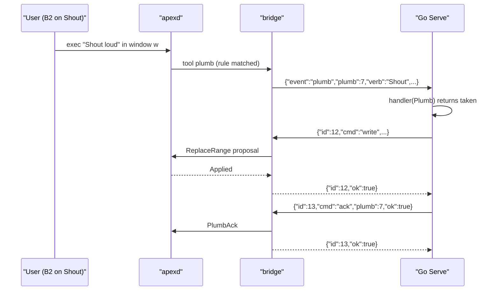

# JSON Bridge and Go SDK

apex's tool API lives in the `apex-tool` Rust crate (see [Writing Tools: the apex-tool SDK](tool-sdk.md)). That crate links against the replica, the wire protocol and the proposal machinery, so a tool written in another language cannot use it directly. The **bridge** solves this. `apex tool bridge NAME` is a small process that attaches to a session as the tool `NAME` through `apex-tool`, then exposes that crate's methods and events as JSON, one object per line, on its standard input and output. A program in any language starts the bridge as a child process and talks to it. It never sees the [attach protocol](attach-protocol.md), [proposals](proposals.md) or the replicated state.

The **Go package** `github.com/mariusae/apex/go/apex` is a client of the bridge. It starts `apex tool bridge`, matches replies to requests by id, queues events and dispatches them to handlers from a `Serve` loop. This page covers the JSON surface, the Go package built on it, the `upper` example and the tests, and ends with the places where the bridge, the Go package and the Rust SDK disagree.

## Architecture

The bridge is a thin layer and contains no state of its own beyond a table of pending HTTP-style requests. The state that matters (the tool's replica, its watched windows and the edits it expects to see come back) lives in the `apex_tool::Tool` the bridge holds. The Go side adds request/response matching, an unbounded event queue and handler tables.



The CLI wires `apex tool bridge NAME` straight to `apex_tool_bridge::run` with the socket and session it has resolved. The socket comes from `-socket`, then `$APEX_SOCKET`, then the default. The session comes from `-session`, then `$apexsession`, then `$APEX_SESSION`, then `default`. A tool started from a terminal inside a session, or from the profile, therefore lands in that session without being configured.

| Layer | Where | Responsibility |
|---|---|---|
| `apex.Tool` (Go) | `go/apex/apex.go` | Starts the bridge, numbers commands, routes replies, queues events, runs handlers |
| `Bridge` | `crates/apex-tool-bridge/src/lib.rs` | Parses command lines, calls `apex_tool::Tool`, writes replies and events |
| `apex_tool::Tool` | `crates/apex-tool/src/lib.rs` | Holds the replica through `Remote`, turns calls into proposals, synthesises events |
| `apex` CLI | `crates/apex-cli/src/main.rs` | Resolves socket and session; `tool bridge` subcommand |

Sources: [crates/apex-tool-bridge/src/lib.rs:1-119](crates/apex-tool-bridge/src/lib.rs#L1-L119), [crates/apex-cli/src/main.rs:735-742](crates/apex-cli/src/main.rs#L735-L742), [crates/apex-cli/src/main.rs:1055-1061](crates/apex-cli/src/main.rs#L1055-L1061), [go/apex/apex.go:54-136](go/apex/apex.go#L54-L136)

## The bridge process

### Start-up and the main loop

`run(socket, session, name)` calls `Tool::attach_to`. If that fails, `run` returns the error before writing anything, so the first line a client reads is either `hello` or end of file. After attaching it writes `{"event":"hello","session":…,"tool":NAME}`. A separate thread then reads stdin one line at a time into a channel, and sends `None` when it reaches EOF.

`main_loop` runs on a single thread and alternates between two steps:

1. It drains every pending tool event with `next_event(Some(Duration::ZERO))` and writes each one as a JSON event. An error here, for example the link closing, ends the loop with `Err`.
2. It waits up to 20 ms for a command line. Blank lines are skipped. A line that is not valid JSON gets `{"ok":false,"error":"not JSON: …"}`, which has no `id`. A valid line is executed and its reply written. EOF on stdin ends the loop with `Ok`.

Whichever way the loop ends, `run` writes `{"event":"bye"}` before returning. When stdin closes, the bridge exits cleanly. When the session or link ends, it exits with the error. Every write is flushed at once (`emit`), so a client sees every line immediately.

Because commands are handled one at a time, **replies come back in the order the commands were sent**. Most commands are proposals that wait for the leader's `Applied`, for up to the tool's 10-second `TIMEOUT`. While a command waits, `apex_tool::Tool` keeps stepping its link and collects any events into its own queue. The bridge writes those events after the reply, on the next pass through the loop. Events can therefore appear between replies, but never inside one, and a client has to tell them apart by whether an `id` is present.

Sources: [crates/apex-tool-bridge/src/lib.rs:87-155](crates/apex-tool-bridge/src/lib.rs#L87-L155), [crates/apex-tool/src/lib.rs:122-123](crates/apex-tool/src/lib.rs#L122-L123), [crates/apex-tool/src/lib.rs:591-608](crates/apex-tool/src/lib.rs#L591-L608)

### Command framing

A command is `{"id": N, "cmd": "...", ...arguments}`. `command` copies `id` back unchanged, so it can be any JSON value. On success it adds `"ok": true` to the result object. On failure the reply is `{"id": N, "ok": false, "error": "..."}`. A missing `cmd` gives `cmd: which command`, and an unknown one gives `NAME: no such command`. Arguments are read leniently from a `serde_json::Value`. When a required argument is missing, the error is just its name: `path`, `text`, `window: a window id`.

Offsets count characters, as they do everywhere in apex. In `write`, any `q0`/`q1` that is negative or not an integer becomes `apex_tool::END` (`usize::MAX`), and `replace` clamps it to the text length. So `{"q0":-1,"q1":-1}` appends.

Sources: [crates/apex-tool-bridge/src/lib.rs:191-209](crates/apex-tool-bridge/src/lib.rs#L191-L209), [crates/apex-tool-bridge/src/lib.rs:250-259](crates/apex-tool-bridge/src/lib.rs#L250-L259), [crates/apex-tool-bridge/src/lib.rs:440-441](crates/apex-tool-bridge/src/lib.rs#L440-L441)

## Commands

Each command maps one-to-one onto an `apex_tool::Tool` method. The table lists the arguments each command reads and the reply fields it adds. "→" marks the method it calls.

| Command | Arguments | Reply | Calls |
|---|---|---|---|
| `windows` | — | `windows: [{id,path,label,kind,scratch,live}]` | `windows()` |
| `window` | `window` | `window: {…}`; error `no such window` | `window()` |
| `new` | `path`, `scratch?`, `label?`, `diagnostic?` | `window: ID` | `new_diagnostic` / `new_scratch` / `new_window` |
| `page` | `path`, `html`, `label?` | `window` | `new_page` |
| `diff` | `text`, `dir?` | `window` | `diff` |
| `open` | `name`, `line?` | `window` | `open` |
| `read` | `window` | `text` | `read` |
| `selection` | `window` | `q0`, `q1` | `selection` |
| `write` | `window`, `q0`, `q1`, `text` | — | `replace` |
| `select` | `window`, `q0`, `q1` | — | `select` |
| `show` | `window`, `at` or `line` | — | `show` / `show_line` |
| `line` | `window`, `line` | `q0`, `q1` | `line` |
| `rename` | `window`, `path` | — | `rename` |
| `label` | `window`, `label?` | — | `set_label` |
| `tag` / `settag` | `window` (+ `text`) | `text` / — | `tag` / `set_tag` |
| `notify` / `unnotify` | `window` | — | `notify` / `unnotify` |
| `notified` | `window` | `on` | `notified` |
| `working` / `live` / `own` | `window`, `on?` (default true) | — | `set_working` / `set_live` / `set_owner` |
| `progress` | `window`, `at?` (clamped to 100) | — | `set_progress` |
| `clean` | `window` | — | `set_clean` |
| `delete` | `window` | — | `delete` (Del in the window) |
| `exec` | `window?`, `text` | — | `exec_in` (top row when `window` is null) |
| `errors` | `dir?`, `text` | — | `errors` |
| `snarf` | `text` | — | `snarf` |
| `switch` | `session`, `window?` | — | `switch` |
| `rule` | `verb?`, `text?`, `file?`, `owner?`, `kind?`, `window?`, `priority?`, `unlisted?`, `start?`, `lasting?` | `rule: ID` | `offer` / `offer_lasting` |
| `unrule` | `rule` | — | `withdraw` |
| `ack` | `plumb`, `ok?` (default true) | — | `answer` |
| `watch` / `unwatch` | `window` | — | `watch` / `unwatch` |
| `set` / `setting` | `key` (+ `value`) | — / `value` (null when unset) | `set` / `setting` |
| `respond` | `stream`, `status?` (200), `headers?`, `body` or `body64` | — | `respond` |
| `post` | `window`, `message` (any JSON) | — | `post_to_page` |
| `pages` | — | — | `handle_pages` |
| `navigation` | `navigation`, `window?`, `answer`, `url?` | — | `answer_navigation` |

A few of these do more than forward their arguments:

- **`window`** puts its result under the key `window` because the reply's own `id` is the command's id. A window's `kind` is `WinKind::name()`, which is one of `file`, `dir`, `term`, `errors` or `page`.
- **`rule`** starts from `Rule::verb(verb)`, or from `Rule::plumb()` when there is no verb, then applies each optional field in turn. `kind` goes through `WinKind::parse`, which also accepts the old names `web` and `preview` for `page`. Any other value is rejected with `kind K: file, dir, term, errors or page`. With `lasting: true` the rule is offered through `offer_lasting`, so it belongs to the session and outlives the tool. The rules themselves, priorities and `start` are covered in [Plumbing Rules and Verbs](plumbing.md).
- **`ack`** only knows the plumb's id. It builds a placeholder `Plumb` that has only that id, which works because `Tool::answer` only reads `p.id`. Leaving out `ok` means *taken*.
- **`respond`** looks up the stream in the bridge's `requests` map, which `request` events fill. An unknown stream gets `no such request`. `headers` is a list of `[name, value]` pairs, and the body is either UTF-8 `body` text or base64 `body64`.
- **`navigation`** maps `answer` strings onto `NavAnswer`: `allow`, `redirect` (which requires `url`), `handled`, and anything else as `default`.

The bridge has its own small standard base64 encoder and decoder, so it does not need another dependency. The decoder ignores whitespace and `=` padding, and a unit test checks that data survives an encode/decode round trip.

Sources: [crates/apex-tool-bridge/src/lib.rs:206-443](crates/apex-tool-bridge/src/lib.rs#L206-L443), [crates/apex-tool-bridge/src/lib.rs:454-501](crates/apex-tool-bridge/src/lib.rs#L454-L501), [crates/apex-core/src/entry.rs:464-483](crates/apex-core/src/entry.rs#L464-L483), [crates/apex-tool/src/lib.rs:586-589](crates/apex-tool/src/lib.rs#L586-L589)

## Events

Events are objects with an `event` key and no `id`. `Bridge::event` turns each `apex_tool::Event` into JSON:

| Event | Fields | Comes from |
|---|---|---|
| `hello` | `session`, `tool` | written once by `run` after attaching |
| `plumb` | `plumb` (id), `rule`, `verb`, `text`, `dir`, `window` (null from the top row), `groups`, `at`, `sel` (`{q0,q1}` or null) | `Event::Plumb`, via `plumb_json` |
| `edit` | `window`, `q0`, `nd`, `text` | `Event::Edit`, a watched window edited by someone else |
| `renamed` | `window`, `path` | `Event::Renamed` |
| `relabeled` | `window`, `label` | `Event::Relabeled` |
| `deleted` | `window` | `Event::Deleted` |
| `navigate` | `navigation`, `window`, `url` | `Event::Navigate` (only after `pages`) |
| `request` | `stream`, `method`, `url`, `path`, `headers`, `body` or `body64` | `Event::Request`; also stored for `respond` |
| `page` | `window`, `what` (`navigated`/`loading`/`title`/`message`) and its field | `Event::Page` (only after `pages`) |
| `bye` | — | written by `run` when the loop ends |

Only windows the tool made, opened or watched produce `renamed`, `relabeled` and `deleted` events, which are the windows `apex_tool::Tool` keeps in its `ours` map. A tool is not told about changes it made itself. `rename` and `set_label` update `ours` before proposing, so the change does not come back as an event. Edits work the same way: `replace` and `insert_following` remember the shape of each write to a watched window, and `before` drops a matching incoming edit instead of reporting it. That memory holds at most 256 writes. For a page's `message`, the bridge parses the script's JSON so the event carries a JSON value rather than a string. If parsing fails, the raw string is sent instead.



The plumb has to be answered before its deadline. The `apex-tool` crate documents this as one second for B3 text and ten for a verb. Silence counts as a failure, not a refusal, and a word apex has its own meaning for, such as `Put`, does not fall back to that meaning after a failure.

Sources: [crates/apex-tool-bridge/src/lib.rs:157-189](crates/apex-tool-bridge/src/lib.rs#L157-L189), [crates/apex-tool-bridge/src/lib.rs:446-452](crates/apex-tool-bridge/src/lib.rs#L446-L452), [crates/apex-tool/src/lib.rs:28-32](crates/apex-tool/src/lib.rs#L28-L32), [crates/apex-tool/src/lib.rs:343-346](crates/apex-tool/src/lib.rs#L343-L346), [crates/apex-tool/src/lib.rs:455-545](crates/apex-tool/src/lib.rs#L455-L545), [crates/apex-tool/src/lib.rs:793-816](crates/apex-tool/src/lib.rs#L793-L816), [crates/apex-tool/src/lib.rs:905-923](crates/apex-tool/src/lib.rs#L905-L923)

## The Go package

### Attaching

`Attach(name, opts)` runs `apex [-socket=S] [-session=X] tool bridge NAME`. The binary is `opts.Binary` if set, otherwise `apex` from the path. The child's stderr goes to the Go program's stderr. `Attach` starts the `read` goroutine and then waits for the first event. If the bridge exits before writing one (the daemon is down, or `apex` is missing), `Attach` returns `the bridge did not attach (is the daemon running, and apex on the path?)`. Otherwise it stores the hello's `session` field, which `Session()` returns.

```go
type Options struct {
	Socket  string // empty: apex's default ($APEX_SOCKET, ...)
	Session string // empty: the session this program was started in
	Binary  string // empty: "apex" on the path
}
```

`Close` closes the bridge's stdin and waits for it to exit. The bridge then writes `bye` and detaches, and the session removes the tool's own rules, live marks and ownership claims.

Sources: [go/apex/apex.go:41-149](go/apex/apex.go#L41-L149)

### Requests, replies and the event queue

`call(cmd, args, result)` takes the next id from `nextID` and registers a one-slot channel for it in `pending`. It then marshals `{"id", "cmd", ...args}` and writes the line while holding `writeMu`. Several goroutines can therefore make calls at once, including handlers running inside `Serve`. `call` blocks until its reply arrives. If the reply has `ok` false, the error is `apex: CMD: ERROR`. If the channel is closed because the bridge has gone, the error is `apex: the session is gone`. On success, `unmarshalAll` re-encodes the reply map and decodes it into the caller's result struct.

The `read` goroutine scans stdout with a buffer that can grow to 64 MiB, so a large `read` reply still fits. Lines it cannot parse are skipped. A line with an `id` goes to whichever caller is waiting for that id. Every other line is pushed onto `events`, an unbounded queue built from a mutex and a condition variable. When stdout ends, `read` records any scanner error, closes `done`, and closes every pending channel so no caller blocks forever. `queue.pop(done)` waits for an item, or returns `false` once `done` is closed and the queue is empty. A helper goroutine broadcasts on the condition variable when `done` closes, so a waiting `pop` wakes up.

Sources: [go/apex/apex.go:151-232](go/apex/apex.go#L151-L232), [go/apex/apex.go:1058-1104](go/apex/apex.go#L1058-L1104)

### Windows

`Window` is a lightweight handle containing an `ID` and the `Tool`. `t.Window(id)` creates one for an id the tool learned some other way. Most methods are a single `call`:

| Go | Bridge command |
|---|---|
| `t.Windows()`, `w.Info()` | `windows`, `window` |
| `t.New`, `t.NewScratch`, `t.NewDiagnostic` | `new` (with `scratch`, `diagnostic`) |
| `t.NewPage`, `t.Diff`, `t.Open` | `page`, `diff`, `open` (line sent only when > 0) |
| `w.Read`, `w.Selection`, `w.Line` | `read`, `selection`, `line` |
| `w.Replace`, `w.Append` (`Replace(End, End, s)`), `w.Select` | `write`, `select` |
| `w.Show`, `w.ShowLine` | `show` with `at` / `line` |
| `w.Rename`, `w.SetLabel` (`""` sends none) | `rename`, `label` |
| `w.Tag`, `w.SetTag` | `tag`, `settag` |
| `w.SetWorking`, `w.SetProgress` (negative: done), `w.SetLive`, `w.SetOwner`, `w.SetClean` | `working`, `progress`, `live`, `own`, `clean` |
| `w.Notify`, `w.Unnotify`, `w.Notified` | `notify`, `unnotify`, `notified` |
| `w.Delete`, `w.Exec`, `t.Exec` | `delete`, `exec` (with / without `window`) |
| `t.Snarf`, `t.Errors`, `t.Switch` | `snarf`, `errors`, `switch` |
| `t.Set`, `t.Setting` (returns value, set?, err) | `set`, `setting` |
| `w.Post`, `t.HandlePages` | `post`, `pages` |
| `w.Watch(fn)`, `w.Unwatch()` | `watch`, `unwatch` (and the `watchers` map) |

`End` is `-1`, and the bridge turns it into `END`. `WindowInfo.Label` is a `*string`, so a window with no label decodes to `nil`.

Sources: [go/apex/apex.go:234-657](go/apex/apex.go#L234-L657), [go/apex/apex.go:712-730](go/apex/apex.go#L712-L730)

### Rules: Offer, OfferLasting and HandleVerb

A Go `Rule` is a struct whose zero value matches everywhere, and each field that is set narrows it. When `Verb` is empty the rule is a plumb (B3) rule. `offer` only sends the fields that are set: non-empty strings, a non-nil `Window`, a non-zero `Priority`, and `Unlisted`, `Start` or `lasting` when true. The bridge then builds the rule from those fields.

```go
func (t *Tool) Offer(r Rule, handle func(Plumb) bool) (RuleID, error)
func (t *Tool) OfferLasting(r Rule) (RuleID, error)
func (t *Tool) HandleVerb(verb string, handle func(Plumb) bool)
```

`Offer` records the handler in `handlers` under the rule id. `OfferLasting` installs a rule that belongs to the session, and that rule usually carries `Start` so that apex starts the tool when the rule next matches. No handler is attached to it. Plumbs from such rules, and from the session's default rules that start the tool, go to the handler registered with `HandleVerb` for their verb. An empty verb is registered under `"plumb"`. `Withdraw` removes the handler and sends `unrule`.

`Plumb` mirrors the Rust struct with Go types. `Window` is a `*Window`, nil when the plumb came from the top row, and `At` and `Sel` are `*Span`. `Plumb.Range()` returns the first non-empty one of `Sel` and `At`. This is the same rule as Rust's `Plumb::range`: what B3 took if it took anything, otherwise the window's dot.

Sources: [go/apex/apex.go:732-906](go/apex/apex.go#L732-L906), [crates/apex-tool/src/lib.rs:172-178](crates/apex-tool/src/lib.rs#L172-L178)

### Serve

`Serve(ctx)` is the dispatch loop. Each time round, it pops one event in a goroutine and selects on that goroutine against `ctx.Done()`. It then switches on the event's `event` field:

| Event | What Serve does |
|---|---|
| `bye` | returns `nil` |
| `plumb` | looks up the handler by rule id, then by verb; calls it with a `Plumb`; **always** sends `ack` with whether it was taken (false when there is no handler) |
| `edit` | calls the window's `Watch` function, if any |
| `renamed`, `relabeled` | calls `OnRename` / `OnRelabel` |
| `deleted` | drops the window's watcher, then calls `OnDelete` |
| `navigate` | asks `HandlePages`'s nav function (`Default` without one) and sends `navigation` |
| `request` | decodes `body` or `body64`, asks `HandleRequests`'s function (404 `not served` without one; status 0 becomes 200), and sends `respond` with the body in base64 |
| `page` | calls `HandlePages`'s page function with a `PageEvent` |

If the queue ends without a `bye`, `Serve` returns the scanner error, which is often `nil`. If `ctx` is cancelled, it returns `ctx.Err()`.

Handlers run one at a time on the `Serve` goroutine, so a slow handler holds up every later event. That includes other plumbs, each with its own deadline. A handler may call back into the tool, because replies are routed by the `read` goroutine and not by `Serve`. When `ctx` is cancelled, the pop goroutine it started is left behind. If an event arrives later, that goroutine takes it off the queue and it is lost. A loop that cancels and then calls `Serve` again can therefore drop one event.

Sources: [go/apex/apex.go:908-1056](go/apex/apex.go#L908-L1056)

## The upper example and the tests

`go/examples/upper` is a complete tool. It attaches as `upper` and offers `Rule{Verb: "Upper", Kind: "file"}`, which puts `Upper` in the tools menu of every file window. The handler takes `p.Range()`, which for a verb from the menu is the window's dot, and refuses when there is no window or the range is empty. It reads the text, converts it to `[]rune` so that character offsets index correctly, upper-cases the range, and returns whether `Replace` succeeded. Run it from a terminal in a session and it attaches to that session.

`go/apex/apex_test.go` has two tests:

- `TestAgainstASession` is an integration test, skipped unless `APEX_SOCKET` is set. `APEX_BIN` can name the binary. It makes a window, appends text and reads it back, then owns it, cleans it, sets its tag and label and checks them through `Info`. Next it offers an unlisted `Shout` verb on that window, sets dot, runs `w.Exec("Shout loud")`, and checks that the handler receives the text `loud` and that `Range()` is the dot `0..3`.
- `TestQueueEndsWhenDone` checks that `pop` on an empty queue returns once `done` closes.

On the Rust side, `the_bridge_speaks_json_for_tools` in the CLI tests drives a real bridge against a test daemon over raw JSON. It covers `hello`, an unknown command's error, `new`/`write`/`read`/`windows`, `label` and `window`, a verb rule that shows up in `apex plumb rule ls`, a `plumb` event and its `ack`, a watched window reporting another attachment's edit as an `edit` event, `deleted` after `win del`, and `bye` once stdin is dropped.

Sources: [go/examples/upper/main.go:1-44](go/examples/upper/main.go#L1-L44), [go/apex/apex_test.go:11-98](go/apex/apex_test.go#L11-L98), [crates/apex-cli/tests/cli.rs:1229-1317](crates/apex-cli/tests/cli.rs#L1229-L1317), [go/README.md:66-73](go/README.md#L66-L73)

## Where the surfaces disagree

The bridge's doc comment and `apex-tool`'s say their commands and events are the crate's methods and events "one for one". That is nearly true. The differences a maintainer should know about:

- **`hello` fields.** The bridge's doc comment promises `hello {attachment, session}`, but `run` writes `session` and `tool`. Go decodes an `attachment` field that never arrives, so `Tool.attachment` is always 0. Nothing reads it today. Also, `session` is the string the CLI resolved (`default`, a prefix, a label or an id), not necessarily the session's id.
- **Methods the bridge leaves out.** `insert_following` is missing, so a Go tool cannot write output that the reader's dot follows, which is the behaviour [win](tool-win-and-lsp.md) relies on. Also missing are `new_web_page`, `navigate`, `reload`, `bring`, `alive`, `window_body`, `window_owner` and `meta`.
- **Window kinds.** Go's `WindowInfo.Kind` comment lists `file, dir, term, errors, web or preview`, but the bridge sends `WinKind::name()`, which returns `page` for every page. `Rule.Kind` documents the right set.
- **Deadlines.** The Go package comment says a handler answers "within a second". `Offer`'s comment, the bridge and the Rust crate all say one second for B3 text and ten for a verb.
- **Matching unowned windows.** In Rust, `.owner("")` means "a real file". Go leaves out empty strings, so it provides `NoOwner = "^$"` for the same thing.
- **Refusing.** In Rust a tool may simply never answer a plumb, which counts as a failure. Go's `Serve` always acks, with `ok:false` when there is no handler, so a Go tool can only refuse, never fail.
- **Withdrawing.** `Tool::withdraw` sends `RuleRm { session: false }`, which only removes the tool's own rules. Calling `unrule` on a rule made with `lasting` still replies `ok`, but the rule stays. The bridge does not report this.
- **The CLI's help text** for `apex tool bridge` lists only a subset of the commands and events. It points to the Go source for the full list.
- **Error types.** Rust returns `apex_tool::Error` and lets the caller check `is_closed()`. Through the bridge the session ending shows up as a `bye` event. In Go, a call made after that fails with `apex: the session is gone`.

Sources: [crates/apex-tool-bridge/src/lib.rs:69-76](crates/apex-tool-bridge/src/lib.rs#L69-L76), [crates/apex-tool-bridge/src/lib.rs:92](crates/apex-tool-bridge/src/lib.rs#L92), [go/apex/apex.go:23-25](go/apex/apex.go#L23-L25), [go/apex/apex.go:129-134](go/apex/apex.go#L129-L134), [go/apex/apex.go:252-253](go/apex/apex.go#L252-L253), [go/apex/apex.go:777-779](go/apex/apex.go#L777-L779), [go/apex/apex.go:822-837](go/apex/apex.go#L822-L837), [crates/apex-tool/src/lib.rs:62-68](crates/apex-tool/src/lib.rs#L62-L68), [crates/apex-tool/src/lib.rs:287-296](crates/apex-tool/src/lib.rs#L287-L296), [crates/apex-tool/src/lib.rs:823-844](crates/apex-tool/src/lib.rs#L823-L844), [crates/apex-tool/src/lib.rs:1107-1111](crates/apex-tool/src/lib.rs#L1107-L1111), [crates/apex-cli/src/main.rs:527-535](crates/apex-cli/src/main.rs#L527-L535)
