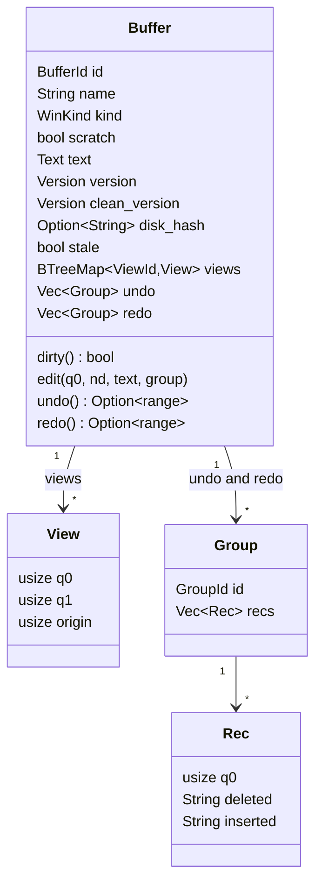
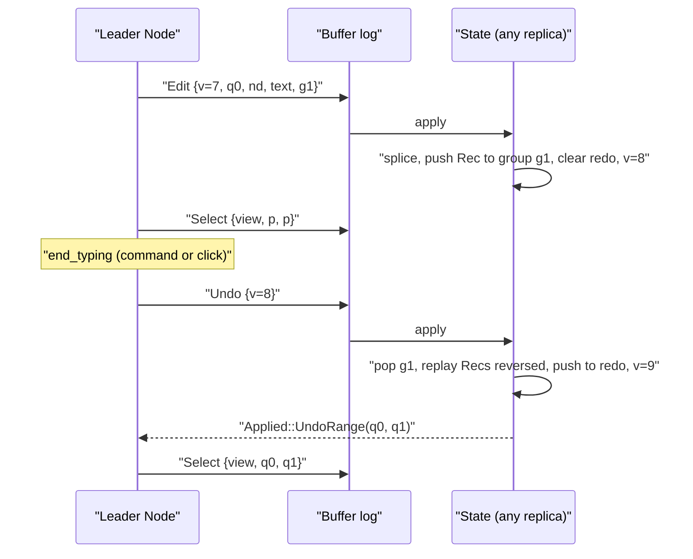
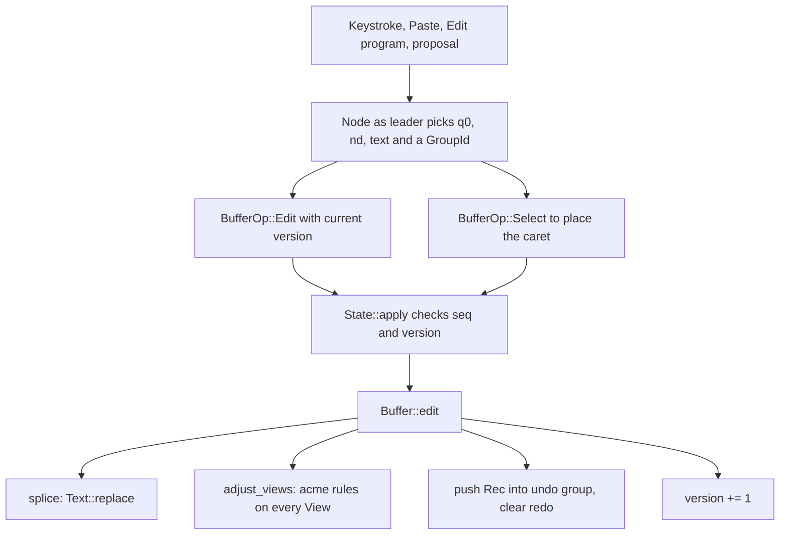

# Buffers, Views and Undo

Every piece of text in apex lives in a **buffer**: a window's body and its tag, a column's tag, and the top row. A buffer corresponds to acme's `File`. It holds the text, a version counter, the flags that say how it compares with the disk, the undo and redo history, and the **views** (selection and scroll origin) of every text that shows it. Each buffer is a shard with its own replicated log (see [Sessions, Shards and Leadership](sessions-and-replication.md)). The `BufferOp` entries in that log are applied by `State::apply` (see [Entries, State and Apply](core-state.md)). This page covers what those entries do to a buffer.

The page also covers three helpers in `apex-core` that work on text without changing it: acme's B3 expansion (`expand.rs`), the fuzzy path matcher behind the file pickers (`fuzzy.rs`), and the shell-transcript reader behind `Snarfout` (`transcript.rs`). For how a leader turns keystrokes, mouse actions and Edit programs into buffer entries, see [The Node](node.md). For the Edit language that reads buffers through `apex_edit::Text`, see [The Edit Language](edit-language.md).

## Text on a rope

`apex_core::text::Text` is a newtype over a `ropey::Rope`. Every offset in it counts **runes** (Unicode scalar values), never bytes, as in acme. Positions in entries, views, undo records and the Edit language all use this unit.

```rust
#[derive(Clone, Debug, Default)]
pub struct Text(Rope);
```

The API is small. `len`, `char_at` and `slice(q0, q1)` read the text. `replace(q0, nd, s)` is the only mutator: it removes `nd` runes at `q0` and inserts `s`, clamping both ends to the text, so an out-of-range edit cannot panic. The line helpers (`line_count`, `line_range`, `line`, `line_start`, `line_of`) follow ropey's line model, where a text ending in a newline has an empty last line. `line_range` leaves the newline out of the range it returns ([crates/apex-core/src/text.rs:9-99](crates/apex-core/src/text.rs#L9-L99)).

Hashing feeds the rope to BLAKE3 chunk by chunk. `content_hash()` returns the hex digest. The file watcher, `Put`, `Get` and `open_file` hash the bytes on disk the same way ([crates/apex-server/src/lib.rs:302](crates/apex-server/src/lib.rs#L302)), so a buffer's text and a file on disk can be compared by hash alone.

The serde impls write a `Text` as a plain string and rebuild the rope when reading it back ([crates/apex-core/src/text.rs:119-130](crates/apex-core/src/text.rs#L119-L130)). Snapshots and `BufferOp::Create` therefore carry ordinary strings.

### The `apex_edit::Text` view

`apex-edit` has no dependency on ropey. It defines its own read-only, rune-indexed trait ([crates/apex-edit/src/lib.rs:24-37](crates/apex-edit/src/lib.rs#L24-L37)), and `Text` implements it. The `read(q0, q1)` method is overridden to slice the rope rather than call `char_at` once per rune ([crates/apex-core/src/text.rs:107-117](crates/apex-core/src/text.rs#L107-L117)). When the node runs an Edit program, it clones the buffer's `Text` and passes it to `EditLang::run`. Every change the run returns becomes a `BufferOp::Edit`, and all of them share one new undo group ([crates/apex-core/src/node.rs:1766-1776](crates/apex-core/src/node.rs#L1766-L1776)).

### Free functions on text

| Function | What it does | Used by |
|---|---|---|
| `trim_trailing_blanks(text)` | acme's `trimspaces`. Removes spaces and tabs before each newline and at the end of the text. Returns the trimmed text and the removed runs, ordered from the end backwards so that deleting them in order leaves earlier offsets valid. A `\r` is not treated as a line end, so CRLF files keep their blanks. | `Put` in an autoindent window |
| `find_match(text, needle, from, reverse)` | Literal search from `from`, wrapping round. With `reverse`, it finds the last match that starts before `from`. | Client Look (`look.rs`) and terminal search |
| `find_all(text, needle)` | Every non-overlapping literal match, as rune ranges | Client Look highlighting |

Sources: [crates/apex-core/src/text.rs:1-251](crates/apex-core/src/text.rs#L1-L251), [crates/apex-edit/src/lib.rs:24-37](crates/apex-edit/src/lib.rs#L24-L37), [crates/apex-core/src/node.rs:1766-1776](crates/apex-core/src/node.rs#L1766-L1776), [crates/apex-client/src/look.rs:30](crates/apex-client/src/look.rs#L30), [crates/apex-server/src/term.rs:410](crates/apex-server/src/term.rs#L410)

## The buffer



The fields of `Buffer` ([crates/apex-core/src/buffer.rs:43-67](crates/apex-core/src/buffer.rs#L43-L67)):

| Field | Meaning |
|---|---|
| `name` | A file's or directory's path. For other kinds it is the directory an errors window belongs to, or the file a preview shows. Empty for tags. |
| `kind` | A `WinKind` (file, directory, errors, preview, and so on). |
| `scratch` | No file stands behind the buffer (a transcript, a tool's window, errors, a preview). `Put` has nothing to write and `Del` has nothing to ask about. |
| `text` | The rope. |
| `version` | The number of modifying entries applied: `Edit`, `Undo` and `Redo`. It only goes up. |
| `clean_version` | The version at the last load or `Put`. |
| `disk_hash` | The content hash of what is on disk, when known. |
| `stale` | The file changed on disk while the buffer was dirty. |
| `views` | One `View` per text showing the buffer, keyed by `ViewId`. |
| `undo`, `redo` | Stacks of `Group`s. |

`Version` is a `u64` alias described in the code as "the number of modifying entries applied" ([crates/apex-core/src/ids.rs:40-41](crates/apex-core/src/ids.rs#L40-L41)). `Edit`, `Undo` and `Redo` entries each carry the version they were made against. `apply_buffer` rejects any of them whose version differs from the buffer's with `ApplyError::Version` ([crates/apex-core/src/state.rs:582-602](crates/apex-core/src/state.rs#L582-L602)). Because a buffer has a single leader, this check should never fail on a follower; a failure means the replicas disagree. Proposals from other attachments carry a version too, and each proposal decides what to do when that version is out of date (see [Proposals](proposals.md)).

### Dirty, clean and stale

`dirty()` is computed, not stored ([crates/apex-core/src/buffer.rs:115-130](crates/apex-core/src/buffer.rs#L115-L130)). A buffer is clean when `version == clean_version`. Otherwise, with no `disk_hash`, it is dirty. With a `disk_hash`, it is dirty only if the text's hash differs from the disk's. As a result, typing something and undoing it all leaves the buffer clean again, as in acme. Acme gets this by rewinding the file's sequence number on undo. Apex's version only goes forward, so it compares the text against the disk's hash instead. Retyping the original text by hand also makes the buffer clean. Without a disk hash, any change makes it dirty, even one that is undone (see the test `typing_and_undoing_it_all_is_clean_again`, [crates/apex-core/src/buffer.rs:275-294](crates/apex-core/src/buffer.rs#L275-L294)).

Hashing a large text on every `dirty()` call would be slow, so the hash at a given version is cached in `Memo`, a mutex around `Option<(Version, String)>`. The cache is not part of the state. It is `#[serde(skip)]`, a clone starts empty, two memos always compare equal, and `hash_into` ignores it ([crates/apex-core/src/buffer.rs:69-91](crates/apex-core/src/buffer.rs#L69-L91)).

Two entries change the flags:

- `BufferOp::Clean { version, disk_hash }` sets `clean_version`, replaces `disk_hash` and clears `stale`.
- `BufferOp::Stale { disk_hash }` sets `stale` and records the new disk hash ([crates/apex-core/src/state.rs:603-613](crates/apex-core/src/state.rs#L603-L613)).

These entries come from the server's file handling. When a watched file changes and the hash is not one the server wrote itself, `content_changed` does one of three things. If the hash matches what the buffer already knows, it does nothing. If the buffer is clean, it proposes `SetContent` against the version it saw. If the buffer is dirty, it proposes `Stale` ([crates/apex-server/src/lib.rs:836-865](crates/apex-server/src/lib.rs#L836-L865)).

The leader applies `SetContent` as a whole-buffer `Edit`, made by `Node::set_content` in a new undo group, followed by `Clean`. If the buffer has been typed into since the proposed version and is dirty, the leader appends `Stale` instead ([crates/apex-server/src/proposal.rs:219-231](crates/apex-server/src/proposal.rs#L219-L231)). Since a reload is an ordinary edit, `Undo` after a reload brings back the old text.

`Put` in an autoindent window writes the trimmed text and proposes `PutTrimmed`. The leader turns that into one undo group of deletions (`Node::delete_runs`) followed by `Clean`, so the first `Undo` after a `Put` restores all the blanks at once. If the buffer moved on while the file was being written, the leader skips the trim and the buffer stays dirty ([crates/apex-server/src/lib.rs:332-346](crates/apex-server/src/lib.rs#L332-L346), [crates/apex-server/src/proposal.rs:338-348](crates/apex-server/src/proposal.rs#L338-L348), [crates/apex-core/src/node.rs:1117-1127](crates/apex-core/src/node.rs#L1117-L1127)).

### The buffer ops

| `BufferOp` | Effect |
|---|---|
| `Create { name, text, disk_hash, kind, scratch }` | The first entry of a buffer's log. Fails with `Exists` if the buffer already exists. |
| `Edit { version, q0, nd, text, group }` | `Buffer::edit`: splice, record for undo, version + 1 |
| `Undo { version }` / `Redo { version }` | `Buffer::undo` / `redo`. Returns `Applied::UndoRange`. |
| `Clean`, `Stale` | Disk-state flags, described above |
| `Rename { name }` | Sets the name |
| `ViewAdd` / `ViewDel { view }` | A text starts or stops showing the buffer |
| `Select { view, q0, q1 }` | `set_select`, clamped to the text, with `q1 >= q0` |
| `Origin { view, origin }` | `set_origin`, clamped |

Sources: [crates/apex-core/src/buffer.rs:1-265](crates/apex-core/src/buffer.rs#L1-L265), [crates/apex-core/src/entry.rs:115-142](crates/apex-core/src/entry.rs#L115-L142), [crates/apex-core/src/state.rs:508-631](crates/apex-core/src/state.rs#L508-L631), [crates/apex-server/src/lib.rs:307-355](crates/apex-server/src/lib.rs#L307-L355), [crates/apex-server/src/proposal.rs:219-235](crates/apex-server/src/proposal.rs#L219-L235)

## Views

A `View` is acme's `Text` minus the text itself: a selection `q0..q1` and a scroll `origin`, all in runes ([crates/apex-core/src/buffer.rs:11-17](crates/apex-core/src/buffer.rs#L11-L17)). `ViewId` names the text a view belongs to: `Tag(WindowId)`, `Body(WindowId)`, `ColTag(ColumnId)` or `Top` ([crates/apex-core/src/ids.rs:83-100](crates/apex-core/src/ids.rs#L83-L100)). Tags are also buffers, so they get views by the same mechanism. `make_window_shards` creates a tag buffer for each new window and appends `ViewAdd` for the tag and, when the body is text or a buffer-backed page, for the body ([crates/apex-core/src/node.rs:521-534](crates/apex-core/src/node.rs#L521-L534)).

### Why views live in the buffer

Selections and origins are stored in the buffer, and the buffer's log orders them together with the edits that move them. If a window's selection lived in some other shard, a replica could apply the window's `Select` and the buffer's `Edit` in either order and end up with a different caret. Keeping them in one log means every replica adjusts every view with the same arithmetic at the same point in the sequence. `Buffer::hash_into` hashes every view, so a disagreement shows up in `State::hash` ([crates/apex-core/src/buffer.rs:234-264](crates/apex-core/src/buffer.rs#L234-L264)).

### acme's textinsert and textdelete rules

`splice` clamps `q0` and `nd` to the text, records what was deleted, replaces the text, and calls `adjust_views(q0, nd, ni)` on every view. That function applies acme's deletion rule and then its insertion rule ([crates/apex-core/src/buffer.rs:148-187](crates/apex-core/src/buffer.rs#L148-L187)):

```rust
if nd > 0 {
    if q0 < v.q0 { v.q0 -= nd.min(v.q0 - q0); }
    if q0 < v.q1 { v.q1 -= nd.min(v.q1 - q0); }
    if q0 + nd <= v.origin { v.origin -= nd; }
    else if q0 < v.origin { v.origin = q0; }
}
if ni > 0 {
    if q0 < v.q1 { v.q1 += ni; }
    if q0 < v.q0 { v.q0 += ni; }
    if q0 < v.origin { v.origin += ni; }
}
```

The comparisons are strict, as in acme. An insertion exactly at a view's `q0` (or `q1`, or `origin`) does not move it. So when you type at a caret, the edit alone leaves the caret before the new text, and the leader moves it with an explicit `Select` after the `Edit` ([crates/apex-core/src/node.rs:1428-1430](crates/apex-core/src/node.rs#L1428-L1430)). A deletion that overlaps a selection shrinks it. A deletion that covers the origin moves the origin to the start of the deletion. The tests `views_follow_edits_like_acme` and `origin_tracks_deletions` cover these cases ([crates/apex-core/src/buffer.rs:296-338](crates/apex-core/src/buffer.rs#L296-L338)).

The node depends on views moving with the edit alone. `Node::insert_text` and `replace_text`, used by tools such as win to write a shell's output, append only the `Edit`. Every other view's selection stays wherever the shift rules put it ([crates/apex-core/src/node.rs:1105-1133](crates/apex-core/src/node.rs#L1105-L1133)).

### Zerox

Because views are keyed per text inside the buffer, acme's `Zerox` (a second window on the same file) needs no extra machinery. `Node::zerox` opens a new window whose body is `Body::Text` of the same `BufferId`, placed in the window's column as acme's `coladd` would ([crates/apex-core/src/node.rs:1276-1284](crates/apex-core/src/node.rs#L1276-L1284)). The new window has its own tag buffer and adds a `ViewId::Body` view to the shared buffer. Every edit made in either window then adjusts both windows' selections and origins through `adjust_views`. The built-in refuses directories and writes "Zerox illegal" to the errors window ([crates/apex-core/src/node.rs:2241-2249](crates/apex-core/src/node.rs#L2241-L2249)).

When a window is deleted, it appends `ViewDel` for its views. The body buffer's shard is deleted only once its `views` map is empty, that is, when the last window on the buffer goes ([crates/apex-core/src/node.rs:1290-1328](crates/apex-core/src/node.rs#L1290-L1328)).

Sources: [crates/apex-core/src/buffer.rs:11-17](crates/apex-core/src/buffer.rs#L11-L17), [crates/apex-core/src/buffer.rs:148-232](crates/apex-core/src/buffer.rs#L148-L232), [crates/apex-core/src/ids.rs:83-100](crates/apex-core/src/ids.rs#L83-L100), [crates/apex-core/src/node.rs:521-534](crates/apex-core/src/node.rs#L521-L534), [crates/apex-core/src/node.rs:1276-1328](crates/apex-core/src/node.rs#L1276-L1328), [crates/apex-core/src/node.rs:2241-2249](crates/apex-core/src/node.rs#L2241-L2249)

## Undo and redo

### Records and groups

`Buffer::edit` splices the text and records a `Rec { q0, deleted, inserted }`, which holds what was there before and what replaced it. The record goes into the group named by the entry's `GroupId`. If the top group on the undo stack has the same id, the record is appended to it. Otherwise a new group is pushed, and the oldest group is dropped once there are more than `MAX_UNDO` (1000). Every edit clears the redo stack and increments the version ([crates/apex-core/src/buffer.rs:93-146](crates/apex-core/src/buffer.rs#L93-L146)).

So "consecutive edits with the same group undo together" ([crates/apex-core/src/entry.rs:123-125](crates/apex-core/src/entry.rs#L123-L125)). The group is chosen by the leader:

- `new_group` makes `GroupId((attachment << 40) | next_group)`. Leaders on different attachments can therefore create groups without coordinating, in the same way node ids are allocated ([crates/apex-core/src/node.rs:304-315](crates/apex-core/src/node.rs#L304-L315)).
- A run of typing in one view reuses a single group (`typing_group`). Selecting, a command, cut, paste, undo and other actions call `end_typing`, so the next keystroke starts a new group ([crates/apex-core/src/node.rs:1367-1381](crates/apex-core/src/node.rs#L1367-L1381)).
- A whole Edit program, a `SetContent` reload, or a `Put` trim each takes one fresh group.

### Inverses come from the history

The `Undo` and `Redo` entries carry nothing but a version:

```rust
/// Undo the most recent group (its inverse is derived from history).
Undo { version: Version },
```

Every replica holds the same `undo` and `redo` stacks, because they are part of the state and included in `hash_into`. Each replica can therefore work out the inverse of an undo for itself, and the log never has to carry the restored text. `Buffer::undo` pops the top group and replays its records in reverse: each one replaces `inserted.len()` runes at `q0` with `deleted` and adjusts views as an ordinary edit would. It then pushes the group onto `redo` and increments the version. `redo` replays a group forwards and moves it back to `undo` ([crates/apex-core/src/buffer.rs:189-216](crates/apex-core/src/buffer.rs#L189-L216)).

Both return the range of the last record they processed. For undo, that is the earliest edit of the group, restored. For redo, it is the group's latest edit. Acme selects this range. `State::apply` passes it out as `Applied::UndoRange`, and the leader's `Node::undo` and `Node::redo` follow up with a `Select` on the view that asked ([crates/apex-core/src/node.rs:1564-1590](crates/apex-core/src/node.rs#L1564-L1590)). Undo history belongs to the buffer, not to a view. Undo in either of two Zerox windows undoes the last group made in either one.



Note what this design implies. The `Undo` entry is only meaningful against the exact history it was sequenced after, and that is why it carries a version. A redo is also an ordinary forward step: the version keeps rising, and `dirty()` relies on the disk hash rather than the version to notice that a buffer is back to its saved state. The test `undo_redo_round_trip` checks a two-record group, the ranges returned, and that the version reaches 4 after edit, edit, undo and redo ([crates/apex-core/src/buffer.rs:315-327](crates/apex-core/src/buffer.rs#L315-L327)).

Sources: [crates/apex-core/src/buffer.rs:19-41](crates/apex-core/src/buffer.rs#L19-L41), [crates/apex-core/src/buffer.rs:93-216](crates/apex-core/src/buffer.rs#L93-L216), [crates/apex-core/src/entry.rs:123-129](crates/apex-core/src/entry.rs#L123-L129), [crates/apex-core/src/state.rs:589-602](crates/apex-core/src/state.rs#L589-L602), [crates/apex-core/src/ids.rs:33-34](crates/apex-core/src/ids.rs#L33-L34), [crates/apex-core/src/node.rs:304-315](crates/apex-core/src/node.rs#L304-L315), [crates/apex-core/src/node.rs:1367-1387](crates/apex-core/src/node.rs#L1367-L1387), [crates/apex-core/src/node.rs:1564-1590](crates/apex-core/src/node.rs#L1564-L1590)

## The edit path at a glance



## B3 expansion (`expand.rs`)

`expand.rs` ports acme's `expand` and `expandfile` from `look.c` one for one. Given a buffer's `Text`, a click point (`q0 == q1`) or a sweep (`q0 < q1`), and an `is_file` predicate, `expand` returns an `Expansion`. That holds the range B3 took and, when the text names a file, the name as written together with the address text after its colon ([crates/apex-core/src/expand.rs:26-54](crates/apex-core/src/expand.rs#L26-L54)).

```rust
pub struct Expansion {
    pub q0: usize,
    pub q1: usize,
    pub file: Option<(String, String)>, // (name as written, address)
}
```

The character classes are acme's: `isfilec` is alphanumeric (by `acme_isalnum`) or one of `.-+/:@`, plus `~` so that `~/x` and backup names like `x~` are names. `isaddrc` is `0-9+-/$.#,;?`. `isregexc` is alphanumeric or one of `^+-.*?#,;[]()$` ([crates/apex-core/src/expand.rs:9-24](crates/apex-core/src/expand.rs#L9-L24), [crates/apex-core/src/node.rs:148-156](crates/apex-core/src/node.rs#L148-L156)).

`expandfile` runs first ([crates/apex-core/src/expand.rs:64-149](crates/apex-core/src/expand.rs#L64-L149)):

1. **For a click**, it scans right over file characters and stops at the first colon, unless that colon belongs to `http://` or `https://`. It then scans left over file, address and regexp characters, noting a colon it passes if none was found yet. If a colon was found, the range ends at it, or extends over the address characters that follow. The address text then runs from after the colon up to the next blank (`amax`).
2. A range starting `http://` or `https://` is taken whole, dropping a final `.` so that a URL at the end of a sentence does not swallow the full stop. It has no file part.
3. Otherwise the text is checked as a name. The first colon must be followed by an address character or be the last character. Every character before the colon must be a file character or a space. If the range has a name before its colon (so `amin != q0`), `is_file(name)` must say it exists. A bare `:12` therefore yields the name `""`, which means the window's own file.

If `expandfile` finds nothing, `expand` falls back to acme's word: a click extends over `acme_isalnum` characters on both sides, and a sweep is returned unchanged. If the result is empty (for example, a click on a blank), `expand` returns `None`.

The function does not touch the file system itself. The server calls it from the plumbing walk with an `is_file` that accepts an empty name, any window's path, or a path that exists when resolved against the window's directory (with `~/` handled by `resolve`). It then binds the expanded text, selection and `(file, addr)` for the rules. Text with no place in a buffer, such as a terminal's text or `apex plumb`'s argument, is wrapped in a temporary `Text` and expanded as one selection ([crates/apex-server/src/lib.rs:1339-1382](crates/apex-server/src/lib.rs#L1339-L1382)). See [Plumbing Rules and Verbs](plumbing.md). The client has a separate, simpler `expand` helper in `app.rs` for highlighting under the pointer. It is not this function.

The tests show the behaviour that matters. A click anywhere in `plan9port/CHANGES:123:1` (on the directory, the file name or the number) yields the same file and the address `123:1`. With no such file, the click yields the word under the pointer. URLs lose a trailing period. `~/src/x/main.rs:1-130` is a name with a line range ([crates/apex-core/src/expand.rs:151-221](crates/apex-core/src/expand.rs#L151-L221)).

Sources: [crates/apex-core/src/expand.rs:1-221](crates/apex-core/src/expand.rs#L1-L221), [crates/apex-core/src/node.rs:148-156](crates/apex-core/src/node.rs#L148-L156), [crates/apex-server/src/lib.rs:1339-1382](crates/apex-server/src/lib.rs#L1339-L1382)

## The fuzzy matcher (`fuzzy.rs`)

`fuzzy.rs` scores a query against a path in the spirit of Zed's matcher. Each query character must appear in the path in order, ignoring case. Each matched character scores according to where it falls ([crates/apex-core/src/fuzzy.rs:1-14](crates/apex-core/src/fuzzy.rs#L1-L14)):

| Position of the matched path character | Score |
|---|---|
| First character of the file name (after the last `/`) | 1.0 |
| Right after a `/` | 0.9 |
| Continues the previous character's match | 1.0 |
| Word start: after `-`, `_`, `.`, a space or a digit, or a lower-to-upper case change | 0.8 |
| Anywhere else | 0.55 |

A case mismatch halves the score, and any match inside the file name adds 0.15. The best alignment wins. The final score is the mean per query character, minus `0.0005` per path character, so shorter paths edge ahead.

The matcher is built to run against a million paths per keystroke:

- `Query::new` prepares the query once: its characters, their lower-case forms, and, for an ASCII query, lower-case bytes.
- `Query::could_match` is a single in-order subsequence pass over the path's bytes (or chars, when the path is not ASCII). Most paths fail here and cost only that pass.
- `Scorer::score` runs a dynamic program over buffers it keeps between paths (`p`, `prev`, `cur`, `best`), so no allocation happens per path. For query character *i* at path position *j*, the score is the larger of a "gap" step (this character's score plus the best score of character *i−1* anywhere before *j*) and a "consecutive" step (the score with the continuation bonus plus character *i−1*'s score at *j−1*). `best` holds the running maximum across positions for the next row ([crates/apex-core/src/fuzzy.rs:66-152](crates/apex-core/src/fuzzy.rs#L66-L152)).

`fuzzy::score(query, path)` is the one-off convenience wrapper. The test suite keeps the original recursive, memoised scorer as a reference and checks that the dynamic program agrees with it to within 1e-9 over a grid of paths and queries, including non-ASCII ones. It also checks that the quick filter never rejects a real match ([crates/apex-core/src/fuzzy.rs:159-241](crates/apex-core/src/fuzzy.rs#L159-L241)).

There are two users. The host's ⌘O find job matches its index in parallel with `Query` and `Scorer` ([crates/apex-server/src/find.rs:12-31](crates/apex-server/src/find.rs#L12-L31)). The client's finder calls `fuzzy::score` ([crates/apex-client/src/finder.rs:134](crates/apex-client/src/finder.rs#L134)). See [Pickers and Overlays](client-overlays.md).

Sources: [crates/apex-core/src/fuzzy.rs:1-241](crates/apex-core/src/fuzzy.rs#L1-L241), [crates/apex-server/src/find.rs:1-31](crates/apex-server/src/find.rs#L1-L31), [crates/apex-client/src/finder.rs:134](crates/apex-client/src/finder.rs#L134)

## Reading a shell transcript (`transcript.rs`)

`transcript::last_output(text)` implements `Snarfout`: it finds the last command in a shell transcript (a terminal's text or a win window) and what that command printed. Nothing marks prompts, so it uses a heuristic. The last non-blank line is taken to be the prompt waiting for input. Its final non-space character is the prompt marker (`%`, `$` and so on), and its first word is the prompt's head. Working backwards, the first earlier line that starts with the same head and contains `marker + " "` (or ends with the marker) is the previous prompt, and the command is whatever follows the marker on that line.

The result normalises the prompt to `$ `: it is `$ command` followed by the lines between that prompt and the current one. It returns `None` when no earlier prompt can be found, as with a lone `$ ` or an empty text. Blank rows after the prompt, as in a terminal grid, are skipped, and tabs in the output are kept ([crates/apex-core/src/transcript.rs:1-62](crates/apex-core/src/transcript.rs#L1-L62)). The client calls it for `Snarfout` and reports "no earlier prompt to tell the output by" when it returns `None` ([crates/apex-client/src/app.rs:1269](crates/apex-client/src/app.rs#L1269)). See [win and Language Servers](tool-win-and-lsp.md) and [Terminals](terminals.md).

Sources: [crates/apex-core/src/transcript.rs:1-62](crates/apex-core/src/transcript.rs#L1-L62), [crates/apex-client/src/app.rs:1269](crates/apex-client/src/app.rs#L1269)

## Working on this code

- **Changing `Buffer`'s fields** changes the snapshot format and `State::hash`. Add any new state field to `hash_into`, or divergence between replicas will go unnoticed. Anything derived and per-replica, like `Memo`, must be skipped by serde and ignored by equality and hashing.
- **Changing `adjust_views`** changes every replica's caret behaviour, and every tool that writes text, such as win, relies on it. Keep the strict comparisons unless acme's behaviour is the thing you mean to change, and extend `views_follow_edits_like_acme`.
- **New editing actions** should go through `Node::edit_op` with a deliberate choice of group. Reuse `typing_group` only for keystroke-like input. Call `end_typing` and `new_group` for anything a user would expect to undo as a unit.
- **Text offsets are runes** everywhere in the core. Convert at the boundary: the client converts for display, and the LSP tool converts to UTF-16.

Sources: [crates/apex-core/src/buffer.rs:63-91](crates/apex-core/src/buffer.rs#L63-L91), [crates/apex-core/src/buffer.rs:234-264](crates/apex-core/src/buffer.rs#L234-L264), [crates/apex-core/src/node.rs:1367-1387](crates/apex-core/src/node.rs#L1367-L1387)
