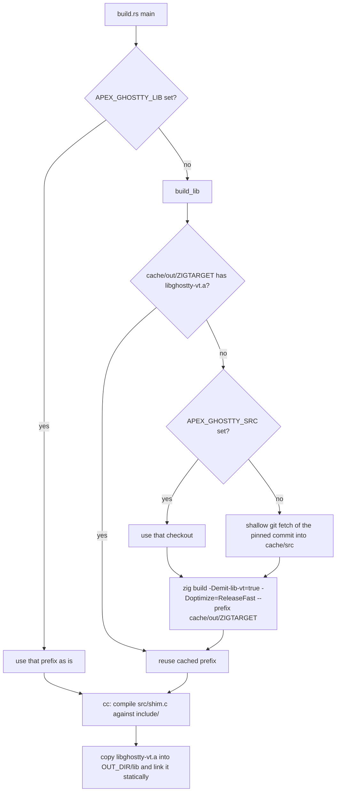
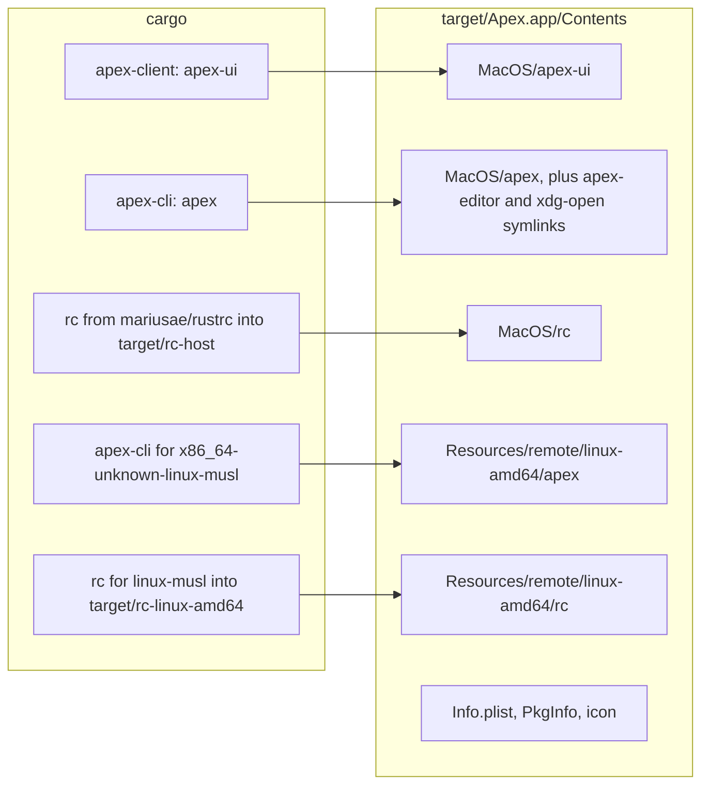

# Building, Testing and Packaging

apex is one Cargo workspace. It produces the `apex-ui` client, the `apex` command (which is also the daemon and every bundled tool), `apexd`, `apex-bench` and a few helper binaries. Everything builds with a plain `cargo build` except for one non-Rust dependency. The terminal emulator is Ghostty's `libghostty-vt`, a Zig library, so a working build needs Zig 0.16. This page covers the workspace layout and its profiles, the native and patched dependencies, the build id that clients and daemons exchange, where each crate's tests and benchmarks live, and how `mac/build-app.sh` packages `Apex.app`. The app carries a Linux `apex` and `rc` so that it can attach to hosts over ssh.

For what the crates do, see [apex Overview](overview.md). The remote-host side of packaging (how the carried binaries are found and installed) is on [Remote Hosts and Providers](remote-hosts.md). How the terminal library is used at runtime is on [Terminals](terminals.md).

## The Cargo workspace

The root `Cargo.toml` lists every member crate, sets a shared edition (2021) and version (0.1.0) that members inherit with `version.workspace = true`, patches one crates.io dependency, and tunes the dev profile:

```toml
[patch.crates-io]
pathfinder_simd = { path = "third_party/pathfinder_simd" }

[profile.dev]
opt-level = 1

[profile.dev.package."*"]
opt-level = 3
```

Debug builds compile the workspace's own crates at `opt-level = 1`, which keeps rebuilds fast. Every dependency (gpui, ropey, postcard and the rest) is compiled at `opt-level = 3`. Dependencies are rarely rebuilt, and an unoptimised gpui or rope would make a debug client sluggish. No release profile is defined, so release builds use Cargo's defaults.

| Member | Builds | Notes |
|---|---|---|
| `crates/apex-edit` | library | Edit language; criterion bench `edit` |
| `crates/apex-core` | library | state machine; criterion bench `core`; `blake3` with the `pure` feature so it cross-compiles with no C or assembly |
| `crates/apex-server` | library, `apexd`, `apex-bench` | its `build.rs` computes the build id |
| `crates/apex-client` | `apex-ui` | gpui from Zed's git `main` branch |
| `crates/apex-cli` | `apex` | the public command |
| `crates/apex-tool-*`, `apex-diff`, `apex-tool`, `apex-tool-bridge` | libraries and tools | see [Writing Tools](tool-sdk.md) |
| `crates/ghostty-vt-sys` | FFI library | builds and links libghostty-vt and a C shim |
| `exp/acp` | experimental ACP client | see [Coding Agents](agent-tools.md) |

The Go SDK under `go/` is not part of the Cargo build. It has its own `go.mod`, and its integration test runs only against a live session (see below).

Sources: [Cargo.toml:1-26](Cargo.toml#L1-L26), [crates/apex-core/Cargo.toml:12](crates/apex-core/Cargo.toml#L12), [crates/apex-server/Cargo.toml:21-30](crates/apex-server/Cargo.toml#L21-L30), [crates/apex-client/Cargo.toml:7-28](crates/apex-client/Cargo.toml#L7-L28)

## The patched pathfinder_simd

gpui pulls in `pathfinder_simd` through pathfinder's geometry crate. The upstream crate picks its backend at compile time. Its build script checks the compiler's release channel with `rustc_version` and sets the `pf_rustc_nightly` cfg on nightly. The library then uses an `arm` backend (built on nightly-only intrinsics) on aarch64 under nightly, an `x86` backend on x86, and a `scalar` backend otherwise or when the `pf-no-simd` feature is on.

apex vendors version 0.5.6 under `third_party/pathfinder_simd` (the published `Cargo.toml.orig` is kept beside the normalised manifest) and points `[patch.crates-io]` at it. In the vendored `lib.rs`, the `arm` module itself is compiled only when all three of nightly, aarch64 and the absence of `pf-no-simd` hold. On aarch64, `apex-client` depends on the crate directly with `features = ["pf-no-simd"]`, with the comment "Avoid pathfinder_simd's broken nightly-only aarch64 SIMD backend". Together these mean an Apple Silicon build uses the scalar backend whatever toolchain compiles it.

Sources: [third_party/pathfinder_simd/src/lib.rs:11-40](third_party/pathfinder_simd/src/lib.rs#L11-L40), [third_party/pathfinder_simd/build.rs:15-28](third_party/pathfinder_simd/build.rs#L15-L28), [third_party/pathfinder_simd/Cargo.toml:12-39](third_party/pathfinder_simd/Cargo.toml#L12-L39), [crates/apex-client/Cargo.toml:26-28](crates/apex-client/Cargo.toml#L26-L28)

## libghostty-vt: the Zig-built terminal library

`ghostty-vt-sys` is the one crate that does not build with Cargo alone. Ghostty's VT library is written in Zig. Its C API exists only on Ghostty's `main` branch, because tagged releases carry only the OSC and SGR parsers. The build script therefore pins a commit (`GHOSTTY_COMMIT`, main as of 2026-09-21) and builds it with Zig 0.16.



### Where it builds and caches

`build_lib` keeps everything under a cache directory: `$XDG_CACHE_HOME/apex` if that variable is set, otherwise `~/.cache/apex` (or `/tmp/.cache/apex` with no `HOME`). Inside it, `ghostty-<first 12 hex of the commit>/src` holds one shared checkout, and `out/<zig target>/` holds one installed prefix per target. The Zig build therefore runs once per commit and target, not once per `cargo build` or per `target/` directory. A fresh `CARGO_TARGET_DIR` reuses the cached library.

The checkout is fetched with `git init`, `git remote add origin`, `git fetch --depth 1 origin <commit>` and `git checkout FETCH_HEAD`. The first build therefore needs the network, and later ones do not. Zig is invoked with `-Demit-xcframework=false`, because the xcframework would need `xcodebuild` and apex only links the archive. When cargo's `TARGET` differs from `HOST`, the script also passes `-Dtarget=<zig target>`, translating cargo's triple in `zig_target`. For example, `x86_64-unknown-linux-musl` becomes `x86_64-linux-musl` and `aarch64-apple-darwin` becomes `aarch64-macos`. For a native build Zig picks the platform itself.

Once it has a prefix, the script compiles `src/shim.c` with `cc` as `apex_vt_shim`. It then copies `libghostty-vt.a` into `OUT_DIR/lib` and links it as `static=ghostty-vt`. The copy matters: if the linker were pointed at Zig's prefix it could find the dylib beside the archive and link that instead. If no archive is found under the chosen prefix, the build panics with `no libghostty-vt.a under …`.

### Environment variables

| Variable | Effect |
|---|---|
| `APEX_GHOSTTY_LIB` | A directory already holding `lib/libghostty-vt.a` and `include/`. Nothing is cloned or built. |
| `APEX_GHOSTTY_SRC` | A Ghostty checkout to build instead of fetching the pinned commit. The result still goes into the cache's `out/<target>`. |
| `ZIG` | The Zig binary to use. Otherwise `zig` on the PATH if `zig version` succeeds, otherwise the lexically last `~/.local/zig-*-0.16*/zig`. With none, the build panics with "libghostty-vt needs zig 0.16 to build". |
| `XDG_CACHE_HOME` | Moves the cache from `~/.cache/apex`. |

All three `APEX_GHOSTTY_*`/`ZIG` variables are declared with `rerun-if-env-changed`, along with `src/shim.c` and `build.rs` itself. Note one quirk: once a cached prefix exists for the target, `APEX_GHOSTTY_SRC` is no longer consulted. To rebuild from a different checkout, use `APEX_GHOSTTY_LIB` or remove the cached `out/` directory.

Sources: [crates/ghostty-vt-sys/build.rs:1-171](crates/ghostty-vt-sys/build.rs#L1-L171), [crates/ghostty-vt-sys/Cargo.toml:1-8](crates/ghostty-vt-sys/Cargo.toml#L1-L8)

## The build id

`apex-server/build.rs` hashes the source tree so that a daemon and a client can tell whether they are the same build. It walks `crates/` recursively, collects every `.rs` file and adds `Cargo.lock`, then sorts the paths. For each file it feeds SHA-256 the path relative to the workspace root, a NUL, the contents and another NUL. The first 12 hex digits become the `APEX_BUILD_ID` compile-time variable. It reruns when anything under `crates/` or `Cargo.lock` changes.

Only source paths and contents go into the hash, never the target triple or compiler flags. The Mac binary and the Linux binary it carries therefore get the same id from the same sources. Non-Rust files (such as the C shim, or the Go SDK under `go/`) are not part of the hash.

The id surfaces in a few places:

| Where | Use |
|---|---|
| `apex_server::BUILD_ID` ([lib.rs:12](crates/apex-server/src/lib.rs#L12)) | the constant everything reads |
| `ServerMsg::Build { protocol, id }` ([daemon.rs:459](crates/apex-server/src/daemon.rs#L459)) | sent by the daemon on each connection, before the welcome |
| `check_build` ([remote.rs:571-583](crates/apex-server/src/remote.rs#L571-L583)) | rejects only a different `PROTOCOL`; another build with the same protocol is accepted. The error names both builds and tells the user to `apex stop` the old daemon |
| `apex version` ([main.rs:1050-1053](crates/apex-cli/src/main.rs#L1050-L1053)) | prints `apex build ID protocol N` |

Deciding whether a remote host needs a new binary does not use the build id. `providers::deploy` compares the SHA-256 of the carried file with the one in `~/.apex/bin` on the host (see below and [Remote Hosts and Providers](remote-hosts.md)). The handshake is on [The Attach Protocol](attach-protocol.md).

Sources: [crates/apex-server/build.rs:1-41](crates/apex-server/build.rs#L1-L41), [crates/apex-server/src/lib.rs:12](crates/apex-server/src/lib.rs#L12), [crates/apex-server/src/remote.rs:568-583](crates/apex-server/src/remote.rs#L568-L583), [crates/apex-cli/src/main.rs:1050-1053](crates/apex-cli/src/main.rs#L1050-L1053)

## Cross-compiling for Linux hosts

The app carries an `apex` for `x86_64-unknown-linux-musl`, a static binary that runs on any x86-64 Linux host. Zig provides both the C compiler and the linker, configured in `.cargo/config.toml`:

```toml
[target.x86_64-unknown-linux-musl]
linker = "mac/zig-cc"
rustflags = ["-C", "link-self-contained=no"]

[env]
CC_x86_64-unknown-linux-musl = { value = "mac/zig-cc", relative = true }
AR_x86_64-unknown-linux-musl = { value = "mac/zig-ar", relative = true }
```

Two small wrapper scripts make this work:

- **`mac/zig-cc`** runs `zig cc -target x86_64-linux-musl`. It first strips any `--target=…` or `-target X` argument, because cc-rs passes Rust's triple, which Zig does not understand.
- **`mac/zig-ar`** runs `zig ar`. macOS's `ar` writes a BSD symbol table that lld cannot read, so a C library built for the target (ring's is the example given) would look empty at link time.

`link-self-contained=no` stops Rust from adding its bundled musl start files, since Zig brings its own. Both wrappers hard-code the Zig path `$HOME/.local/zig-aarch64-macos-0.16.0/zig`, so on another machine or Zig version they need editing. The ghostty build script, by contrast, searches for Zig. In a cross build, `ghostty-vt-sys` sees `TARGET != HOST` and passes `-Dtarget=x86_64-linux-musl` to Zig. The Linux command therefore links a Linux archive, not the Mac's.

Sources: [.cargo/config.toml:1-10](.cargo/config.toml#L1-L10), [mac/zig-cc:1-15](mac/zig-cc#L1-L15), [mac/zig-ar:1-5](mac/zig-ar#L1-L5), [crates/ghostty-vt-sys/build.rs:88-92](crates/ghostty-vt-sys/build.rs#L88-L92)

## Packaging Apex.app with mac/build-app.sh

`mac/build-app.sh [--debug]` builds everything the app needs and assembles `target/Apex.app`. The client and command are built with the release profile unless `--debug` is given. The Linux command is always a release build.



The script's steps, in order:

1. `cargo build $flag -p apex-client -p apex-cli` for the Mac.
2. `cargo build --release --target x86_64-unknown-linux-musl -p apex-cli` for Linux hosts, through the Zig wrappers above.
3. `cargo install --git https://github.com/mariusae/rustrc --bin rc` twice: once for the host into `target/rc-host`, and once for linux-musl into `target/rc-linux-amd64`. `cargo install` builds outside the tree, where `.cargo/config.toml` does not apply, so the script passes the linker and rustflags through `CARGO_TARGET_X86_64_UNKNOWN_LINUX_MUSL_LINKER` and `…_RUSTFLAGS`.
4. It recreates `target/Apex.app` and copies in `apex-ui`, `apex` and `rc`. It symlinks `apex-editor` and `xdg-open` to `apex` (see [The apex Command](cli.md)) and copies the Linux `apex` and `rc` into `Resources/remote/linux-amd64/`.
5. It substitutes the workspace version (the first `^version` line of `Cargo.toml`) for `VERSION` in `mac/Info.plist`, and writes `PkgInfo`.
6. It builds the icon. With Xcode, `xcrun actool` compiles the Icon Composer icon `mac/apex.icon` into `Assets.car` and `apex.icns`. Without it, the script falls back to `sips` and `iconutil`, making an `.icns` from `mac/space-bunny-1024.png` at 16–512 points, each at 1× and 2×.
7. It signs the bundle ad hoc (`codesign --force --deep --sign -`) so Gatekeeper lets a local build launch. A failure here is ignored.

`Info.plist` names `apex-ui` as the executable, sets the bundle id `org.apex.editor` and macOS 12.0 as the minimum, and allows arbitrary loads under App Transport Security. Pages on a host's own network are often plain http, and Apex shows what a browser would ([The I/O Plane and Pages](io-plane-and-pages.md)).

### How the packaged binaries are found at runtime

The bundle layout matches what the server code looks for. `command_shell` runs B2 commands with `$acmeshell` if that is set. Otherwise it uses the first `rc` it finds: beside the running executable (`Contents/MacOS/rc`), then a dev tree's `target/rc-host/bin/rc` one to three directories up, then `~/.apex/bin/rc`, then any on the PATH. Failing all of those it uses `sh`.

For other machines, `providers::bundled(target, name)` looks for `apex` and `rc` in these places, in order:

1. `$APEX_REMOTE_BINARIES/<target>/`
2. `../Resources/remote/<target>/` relative to the executable (the app bundle)
3. `remote/<target>/` beside it
4. a dev tree's `target/<triple>/release/` and `target/rc-<target>/bin/`
5. for the local machine's own kind only, the directory beside the executable

A dev tree built by `build-app.sh` can therefore attach to Linux hosts without the app bundle. `deploy` copies a carried binary to `~/.apex/bin` on the host only when its SHA-256 differs. It writes the file beside the old one and then moves it into place, so a running daemon keeps its own binary.

Sources: [mac/build-app.sh:1-60](mac/build-app.sh#L1-L60), [mac/Info.plist:1-28](mac/Info.plist#L1-L28), [crates/apex-server/src/lib.rs:1926-1955](crates/apex-server/src/lib.rs#L1926-L1955), [crates/apex-server/src/providers.rs:167-250](crates/apex-server/src/providers.rs#L167-L250)

## Tests and benchmarks

`cargo test` at the root runs every crate's unit tests (in `#[cfg(test)]` modules inside the sources) and the integration tests below. Most integration tests start a daemon on a thread of the test process and talk to it over a real Unix socket. They need no UI and no running apex.

| Crate | Test file | What it checks |
|---|---|---|
| apex-core | `tests/core.rs` | A leader node drives a session through the log store and a follower replays it; the two must agree byte for byte. Also fencing, undo, views, commands and Edit. Includes `snapshot_plus_tail_equals_replay` and a `proptest!` block where a snapshot taken partway plus the tail must equal full replay. Shrunk failures are kept in `tests/core.proptest-regressions`. |
| apex-core | `tests/tiling.rs` | acme's tiling against what plan9port's `cols.c` and `rows.c` give by hand (font height 17, border 2) |
| apex-edit | `tests/golden.rs` | Acceptance cases `(text, dot, program) → (text', dot', output)` or acme's error message, written from sam(1) and acme |
| apex-edit | `tests/sam_diff.rs` | Differential tests against plan9port's `sam -d`: a hand-written corpus, then programs and regexps generated by proptest over small random texts |
| apex-edit | `tests/debug_one.rs` | `#[ignore]`d helper: runs program `$P` over text `$T` through both sam and apex-edit and prints the two results |
| apex-server | `tests/socket.rs` | The attach protocol end to end, including the `Build` message carrying `BUILD_ID` |
| apex-server | `tests/server.rs` | The server performing execs through a leader, in process |
| apex-server | `tests/signals.rs`, `tests/home.rs` | Each is its own test binary because it changes process-wide state: an ignored SIGTERM must not reach what `Kill` kills, and `~` expands for B3 |
| apex-cli | `tests/cli.rs` | The `apex` command end to end against a daemon on a thread |
| apex-cli | `tests/ssh.rs` | Attaching over "ssh". `APEX_SSH` points at a script that runs the command locally under a scratch `HOME`, and `APEX_REMOTE_BINARIES` at a copy of the test's own `apex`. Checks deploy, update on change, daemon start and bridging through `apex attach -stdio` |
| apex-tool | `tests/tool.rs` | The tool API: windows, verbs, watches, deletion |
| apex-tool-win | `tests/win.rs` | `apex tool win` against a headless daemon |
| apex-tool-lsp | `tests/lsp.rs` | `apex tool lsp` against `tests/fake-lsp.py`, which needs `python3` |
| apex-tool-web | `tests/web.rs` | Web and Newweb, page ownership and history |
| apex-tool-agent | `tests/pane.rs` | The agent pane following an agent's log and transcript |

### The sam differential tests

`tests/common/mod.rs` runs a program through apex-edit and through `sam -d` and normalises both results to the same shape: error, text, dot, and output split into `p` text and `=` lines. It finds sam through `$SAM`, then `$PLAN9/bin/sam`, then `~/.local/plan9/bin/sam`. With no sam, each differential test prints `skipping: plan9port sam not found (set SAM or PLAN9)` and passes. A CI run or a machine without plan9port therefore does not exercise these tests. Install plan9port when working on [The Edit Language](edit-language.md).

### Benchmarks

Benchmarks use criterion with `harness = false`:

- `cargo bench -p apex-core` runs the `core` group: apply throughput, view adjustment with many windows on one buffer, hashing, snapshots and replay.
- `cargo bench -p apex-edit` runs the `edit` group: the Edit language over large texts.
- The `apex-bench` binary in apex-server measures the attach protocol itself. With no arguments it starts a daemon on its own thread. `--socket PATH` talks to a running `apexd`. `--via CMD` attaches through a command's stdin and stdout, so that `apex attach --stdio` locally stands in for the extra pipe hops of ssh. See [The Daemon](daemon.md).

### Go

`go/apex/apex_test.go` is an integration test that skips unless `APEX_SOCKET` is set. It attaches as a tool (using `apex` from the PATH or `$APEX_BIN`) and exercises windows, ownership, tags and labels against that live session. See [JSON Bridge and Go SDK](bridge-and-go.md).

Sources: [crates/apex-core/tests/core.rs:1-3](crates/apex-core/tests/core.rs#L1-L3), [crates/apex-core/tests/core.rs:275-303](crates/apex-core/tests/core.rs#L275-L303), [crates/apex-core/tests/core.rs:346-401](crates/apex-core/tests/core.rs#L346-L401), [crates/apex-edit/tests/common/mod.rs:1-74](crates/apex-edit/tests/common/mod.rs#L1-L74), [crates/apex-edit/tests/sam_diff.rs:1-21](crates/apex-edit/tests/sam_diff.rs#L1-L21), [crates/apex-edit/tests/debug_one.rs:1-10](crates/apex-edit/tests/debug_one.rs#L1-L10), [crates/apex-cli/tests/ssh.rs:1-80](crates/apex-cli/tests/ssh.rs#L1-L80), [crates/apex-tool-lsp/tests/lsp.rs:59-62](crates/apex-tool-lsp/tests/lsp.rs#L59-L62), [crates/apex-server/src/bin/apex_bench.rs:1-29](crates/apex-server/src/bin/apex_bench.rs#L1-L29), [crates/apex-edit/Cargo.toml:10-16](crates/apex-edit/Cargo.toml#L10-L16), [crates/apex-core/Cargo.toml:17-23](crates/apex-core/Cargo.toml#L17-L23), [go/apex/apex_test.go:11-22](go/apex/apex_test.go#L11-L22)

## Continuous integration

`.github/workflows/rust.yml` defines one job on `ubuntu-latest`, triggered by pushes and pull requests to `main`. It checks out the repository and runs `cargo build --verbose`, then `cargo test --verbose`. That is the whole workflow. There is no Zig setup step, no plan9port, no cache of the Ghostty build, and no Mac or cross-compile job. The Linux job builds the whole workspace, including `ghostty-vt-sys`, so it depends on the runner already having a Zig 0.16 that `build.rs` can find. The sam differential tests skip themselves there, as described above.

Sources: [.github/workflows/rust.yml:1-22](.github/workflows/rust.yml#L1-L22)

## The docs site

`docs/` holds a static, single-page site: `index.html`, a screenshot, the space-bunny image and a `.nojekyll` marker, which tells GitHub Pages to serve the files as they are. Its "Developing and building Apex" section gives the short version of this page: clone, `cd apex`, run `mac/build-app.sh`, and you get `target/Apex.app`. It notes that the app runs on macOS while the daemon and `apex` also run on Linux. It links to DESIGN.md, MODERN.md and the DeepWiki overview.

Sources: [docs/index.html:105-121](docs/index.html#L105-L121)

## Practical notes

- **First build:** have Zig 0.16 available, either on the PATH or through `ZIG`, and network access to github.com for the Ghostty fetch. After that, builds are offline and the Zig step is cached under `~/.cache/apex`.
- **Pointing at a prebuilt Ghostty:** set `APEX_GHOSTTY_LIB=/path/to/prefix` (it must contain `lib/libghostty-vt.a` and `include/`). This skips Zig entirely.
- **Rebuilding everything a client checks:** any change under `crates/**/*.rs` or to `Cargo.lock` changes `BUILD_ID`. Only a change to `PROTOCOL` makes `check_build` refuse a daemon.
- **Linux cross-builds:** check the hard-coded Zig path in `mac/zig-cc` and `mac/zig-ar` before running `build-app.sh` on a new machine.
- **Edit language work:** install plan9port so that `sam_diff.rs` actually runs. Use `T=… P=… cargo test -p apex-edit --test debug_one -- --ignored --nocapture` to compare a single case against sam.

Sources: [crates/ghostty-vt-sys/build.rs:16-20](crates/ghostty-vt-sys/build.rs#L16-L20), [crates/apex-server/build.rs:22-25](crates/apex-server/build.rs#L22-L25), [mac/zig-cc:15](mac/zig-cc#L15), [crates/apex-edit/tests/debug_one.rs:1-10](crates/apex-edit/tests/debug_one.rs#L1-L10)
