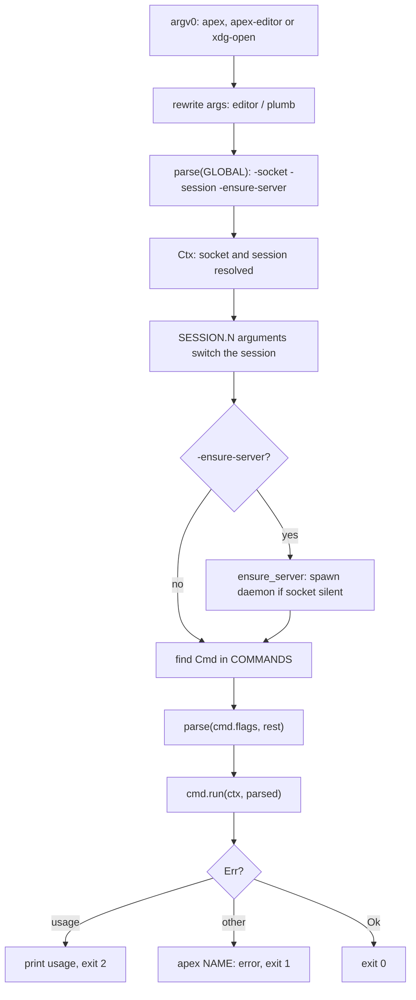
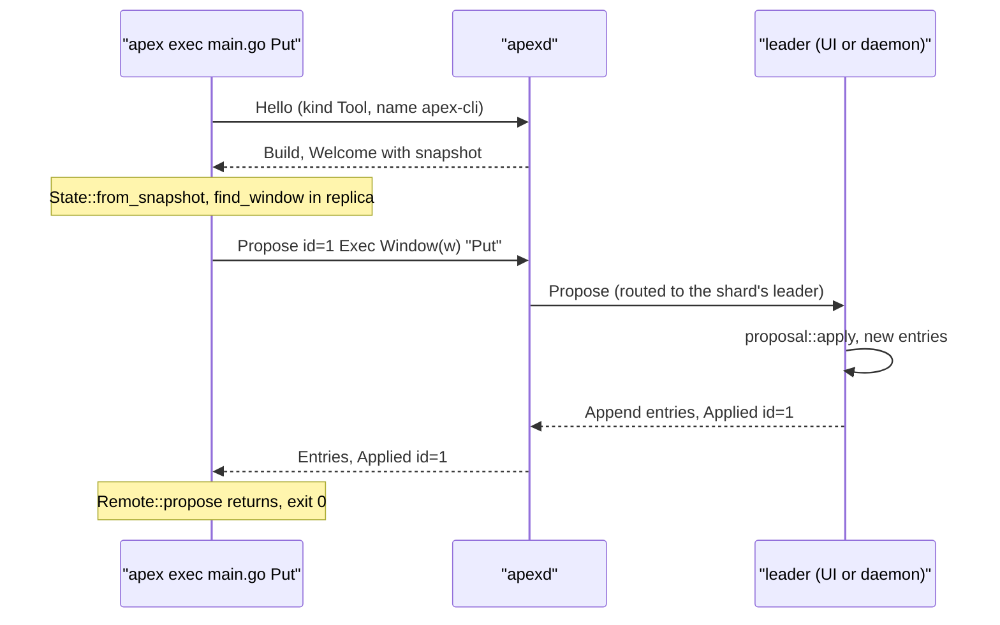

# The apex Command

`apex` (the `apex-cli` crate) is the stable public surface of apex for scripts, shells and people. Scripts and tools never see the wire: they run `apex new`, `apex edit`, `apex exec` and so on, and the command speaks the [attach protocol](attach-protocol.md) for them. The same binary is also the daemon (`apex server`, see [The Daemon (apexd)](daemon.md)), the remote bridge (`apex attach -stdio`, see [Remote Hosts and Providers](remote-hosts.md)), the launcher of the bundled tools (`apex tool …`, see [Writing Tools](tool-sdk.md)), and, under other names, `$EDITOR` and `xdg-open` inside a session.

All the subcommands share one design. Each one attaches to the session as a tool, so it has its own follower replica of the session state. It reads what it needs from that replica and sends changes as [proposals](proposals.md) to whoever leads the shard: the UI if one is attached, otherwise the daemon. That is why `apex` works with no UI running, and why a UI that attaches later finds the result. Profiles, `apex env` and `apex set` are covered in more depth on [Configuration](configuration.md).

## Architecture: one binary, a table of commands

The whole command lives in one file, `crates/apex-cli/src/main.rs`. It has four parts:

1. A small Go-style flag parser (`Flag`, `Parsed`, `parse`).
2. A static table `COMMANDS: &[Cmd]`. Each entry holds the command's name, its usage line, a one-line summary, its flags, its long help text and a `run: fn(&Ctx, &Parsed) -> R`. A second table, `TOPICS`, holds the help topics (`sessions`, `scripts`, `rules`, `windows`).
3. `main`, which resolves the socket and the session into a `Ctx`, finds the `Cmd` and calls it.
4. One function per subcommand. Most of them start with `tool(ctx)` and use `apex_server::remote::Remote`.

```rust
struct Cmd {
    name: &'static str,
    usage: &'static str,
    short: &'static str,
    flags: &'static [Flag],
    long: &'static str,
    run: fn(&Ctx, &Parsed) -> R,
}

struct Ctx {
    socket: PathBuf,
    session: String,
}
```

All help is generated from these tables. `apex` or `apex help` prints the overview (`overview`). `apex help CMD` prints the usage, the flags and the long text, and for `plumb` it also prints `RULE_FLAGS`. `apex help TOPIC` prints a topic. `apex CMD -h` prints only the usage and flags (`usage`). Because the long texts are the reference documentation, any change to a command's behaviour should update its `long` string as well.



Sources: [crates/apex-cli/src/main.rs:1-24](crates/apex-cli/src/main.rs#L1-L24), [crates/apex-cli/src/main.rs:105-148](crates/apex-cli/src/main.rs#L105-L148), [crates/apex-cli/src/main.rs:598-600](crates/apex-cli/src/main.rs#L598-L600), [crates/apex-cli/src/main.rs:713-854](crates/apex-cli/src/main.rs#L713-L854), [crates/apex-cli/README.md:1-46](crates/apex-cli/README.md#L1-L46)

## Flags, the socket and the session

### Go-style flags

`parse` follows Go's `flag` package. Flags come before the arguments. The first argument that does not start with `-` (or is `-` alone) ends the flags, and so does `--`. A flag can be written `-name=value` or as `-name value`, where the value is the next argument. A boolean flag (`switch`) is written `-name`, or `-name=true`/`-name=false`, and `false` leaves it unset. Any number of leading dashes is accepted. `-h` and `-help` return the sentinel error `"help"`, which `main` turns into the usage. An unknown flag gives `flag provided but not defined: -NAME`, as Go does. `flag_tests` checks both value forms and checks that a switch never takes the next argument.

Parsing happens in two stages. Global flags are parsed first, up to the command name. The command's own flags are parsed after it. A few subcommands parse a third time after a verb: `win list -json`, `text read -addr=…` and `plumb rule add …` each call `parse` again on the arguments after the verb.

### Global flags and environment

| Flag | Default chain | Meaning |
|---|---|---|
| `-socket=PATH` | `$APEX_SOCKET`, else `$TMPDIR/apex-$USER/main.sock` (`default_socket`) | the daemon's Unix socket |
| `-session=NAME` | `$apexsession`, then `$APEX_SESSION`, else `default` | session by id, an id prefix of four or more characters, or label |
| `-ensure-server` | off | start a daemon first if nothing answers on the socket |

The daemon puts `apexsession` (the session's id), `apexsessionlabel` and `APEX_SOCKET` into the environment of every command and terminal in a session. As a result, `apex` run inside an apex terminal works on the session it is in without any flags.

Some arguments name a window in a particular session, as `SESSION.N`, for example `3f2a.12`. `main` handles these specially. Unless the command is one that takes such names itself (`B`, `plumb`, `switch`, `attach`, the session commands, `ls`, `editor`), any argument after the command name that `apex_server::global_window` recognises switches `ctx.session` to that session and is replaced by the bare window id. `global_window` only accepts a session part made of hex digits and dashes, at least four characters long. That is how `apex text read 3f2a.12` reads window 12 of another session.

### Exit status

A command returns `R = Result<(), String>`. The error `"usage"` prints the usage and exits with status 2, and so do bad flags and unknown commands. Any other error is printed as `apex NAME: error` and exits with status 1.

Sources: [crates/apex-cli/src/main.rs:26-103](crates/apex-cli/src/main.rs#L26-L103), [crates/apex-cli/src/main.rs:121-125](crates/apex-cli/src/main.rs#L121-L125), [crates/apex-cli/src/main.rs:730-791](crates/apex-cli/src/main.rs#L730-L791), [crates/apex-cli/src/main.rs:2073-2097](crates/apex-cli/src/main.rs#L2073-L2097), [crates/apex-server/src/daemon.rs:67-79](crates/apex-server/src/daemon.rs#L67-L79), [crates/apex-server/src/daemon.rs:357-369](crates/apex-server/src/daemon.rs#L357-L369), [crates/apex-server/src/lib.rs:1680-1691](crates/apex-server/src/lib.rs#L1680-L1691)

## Every subcommand is a tool

`tool(ctx)` is the common entry point:

```rust
fn tool(ctx: &Ctx) -> Result<Remote, String> {
    Remote::connect_as(&ctx.socket, &ctx.session, "apex-cli", AttachmentKind::Tool)
        .map_err(|e| format!("{}: {e}", ctx.socket.display()))
}
```

A `Remote` (in `apex-server/src/remote.rs`) is a headless client: a `Link` plus its own mirror `Log` and `Node`. `Link::over_streams_inner` sends `Hello` and checks the daemon's `Build` message with `check_build`, so a daemon on a different `PROTOCOL` is refused with an error saying to `apex stop` it. It then waits up to a minute for `Welcome`, builds `State::from_snapshot`, and catches the node up. Once that is done, the command can read the whole session synchronously from `c.node.state`: windows, layout, buffers, terms, `meta.procs`, `meta.rules` and `meta.settings`. A spawned reader thread delivers the messages that keep the replica current, and `Remote::step` handles one of them, blocking for up to the given timeout.

The CLI changes the session in two ways:

- **Proposals.** `Remote::propose(p, timeout)` sends `ClientMsg::Propose { id, proposal }` and then calls `step` until `link.applied` holds that id. The leader applies the proposal with `proposal::apply` and replies `Applied { id, result }`. The result can carry a `WindowId` for proposals that make a window. `new`, `win`, `edit`, `sel`, `show`, `exec`, `term new`, `web`, `switch`, `preview` and `editor`'s labelling work this way.
- **Direct requests the daemon serves itself.** `OpenFile`, `Plumb`, `RuleAdd`/`RuleRm`, `Cd`, `Set`, `Env`/`EnvImport`, `Kill`, `Notify`, `EditOver`, `TermPaste`/`TermKey`/`TermClear` and `Io` are plain `ClientMsg`s. For these the command waits until the effect shows up in its replica or in a `Link` field: `link.plumbed`, `link.trace`, `link.rule_added`, `link.env`, `link.error` or `link.io`.

`wait(r, done)` in main.rs is the CLI's generic loop for the second case. It steps the `Remote` in 20 ms slices until a predicate on the replica holds, or until `TIMEOUT` (10 s) has passed. `Remote` has its own equivalent, `wait_for`, for its typed helpers (`rule_add`, `plumb_dry`, `env`, `io_response`, …).



When the process exits, the `Link` is dropped, its transport closes, and the daemon sees the attachment go. Anything the command owned goes with it, for example a rule added with `-mine`.

Sources: [crates/apex-cli/src/main.rs:856-877](crates/apex-cli/src/main.rs#L856-L877), [crates/apex-server/src/remote.rs:1-5](crates/apex-server/src/remote.rs#L1-L5), [crates/apex-server/src/remote.rs:207-265](crates/apex-server/src/remote.rs#L207-L265), [crates/apex-server/src/remote.rs:305-312](crates/apex-server/src/remote.rs#L305-L312), [crates/apex-server/src/remote.rs:373-419](crates/apex-server/src/remote.rs#L373-L419), [crates/apex-server/src/remote.rs:571-583](crates/apex-server/src/remote.rs#L571-L583), [crates/apex-server/src/remote.rs:722-805](crates/apex-server/src/remote.rs#L722-L805), [crates/apex-server/src/remote.rs:1033-1049](crates/apex-server/src/remote.rs#L1033-L1049)

## Naming windows: `find_window`

Wherever a command takes `WIN`, it goes through `find_window(c, spec)`, which resolves against the replica in this order:

1. A number is a window id. It must exist.
2. `SESSION.N` is window N, but only if `SESSION` is this session's id, a prefix of it (four or more characters) or its label. Otherwise the error says to use `-session=`.
3. An exact path. If several windows have that path, the one plain non-scratch `File` window wins, so `notes.md` means the file rather than its preview.
4. An exact label, if exactly one window has it.
5. A kind name such as `errors`, if exactly one window has that kind.
6. A unique substring of a path or label. Zero hits gives `no window matches "…"`, several gives `N windows match "…"`.

Relative paths given by the user are made absolute against the CLI's current directory with `absolute`, which keeps a trailing `/`. Exactly where a command does this is noted in the subcommand sections below.

Sources: [crates/apex-cli/src/main.rs:1232-1298](crates/apex-cli/src/main.rs#L1232-L1298)

## The subcommands

### Daemon and sessions

| Command | What it does | How |
|---|---|---|
| `server` | runs the daemon in the foreground with one first session | `Daemon::run(socket, session)` |
| `ls` | `label<TAB>id` for each session | `remote::list_sessions`, no attach |
| `stop` | ends the daemon and every session in it | `remote::stop_any` |
| `new-session NAME [DIR]` | makes a session (it is fine if it already exists) and prints its id | `valid_label`, checks that DIR is a directory, `ensure_server`, `remote::new_session` |
| `end-session [-f] [NAME]` | ends a session; refused if a window is dirty, unless `-f` | `remote::end_session` |
| `rename-session [FROM] TO` | relabels a session | `remote::rename_session` |
| `attach [-stdio] [[DEST/]SESSION \| URL] [FILE...]` | opens the app, or bridges stdio | see below |
| `version` | prints `apex build ID protocol N` | `BUILD_ID`, `proto::PROTOCOL` |

These commands use one-shot helpers in `remote.rs` that write a single frame and read until they get `Sessions` or `Error`, without attaching. Every one of those helpers checks `Build` as well.

`stop_any` deliberately does not depend on the protocol version. If `list_sessions` fails with `Unsupported`, meaning the daemon is of another protocol, it gets the socket peer's pid (`LOCAL_PEERPID` on macOS, `SO_PEERCRED` elsewhere). It then checks with `ps` that the process's command line contains `apex`, ` server` and this very socket path, sends SIGTERM, and sends SIGKILL if the process is still alive after 3 s. This is how a daemon from an old build is cleared away.

`ensure_server` starts a daemon if `UnixStream::connect` fails. The daemon's first session is the requested name if that is a valid label, otherwise `default`, since an id cannot name a session on a fresh daemon. `daemon::spawn_server` re-executes the same binary as `apex -socket=… -session=… server` under `setsid`, with stderr going to `apexd.log` beside the socket.

`attach` first decides what it is attaching to. If the first argument does not exist as a path, it is the target, otherwise the target is the current session. A session URL (`local:///`, `ssh://…`, `sprite://…`, parsed by `providers::SessionUrl`) is reduced to a session name or to `dest/session`. With `-stdio`, it calls `ensure_server` and then `bridge`, which copies bytes between the socket and stdin/stdout on two threads until either side closes. Frames pass through untouched, and this is the whole server side of [remote hosts](remote-hosts.md). Without `-stdio`, it runs `apex-ui` (found beside the `apex` binary) as `--remote DEST --session S` or `--attach SOCKET --session S`, passing on the FILE arguments.

Sources: [crates/apex-cli/src/main.rs:881-907](crates/apex-cli/src/main.rs#L881-L907), [crates/apex-cli/src/main.rs:958-961](crates/apex-cli/src/main.rs#L958-L961), [crates/apex-cli/src/main.rs:1050-1053](crates/apex-cli/src/main.rs#L1050-L1053), [crates/apex-cli/src/main.rs:1120-1228](crates/apex-cli/src/main.rs#L1120-L1228), [crates/apex-server/src/remote.rs:509-522](crates/apex-server/src/remote.rs#L509-L522), [crates/apex-server/src/remote.rs:586-720](crates/apex-server/src/remote.rs#L586-L720), [crates/apex-server/src/daemon.rs:29-79](crates/apex-server/src/daemon.rs#L29-L79)

### Windows and text

| Command | Behaviour | Mechanism |
|---|---|---|
| `new [-diagnostic] [-label=L] [PATH]` | makes a window and prints its id; if stdin is not a terminal, its contents go in | `Exec Top "New"`, waits for the new window, `ReplaceRange` at 0, `SetPath`. With `-diagnostic`: `NewWindow { scratch, diagnostic }` in the last column (`-label` is only allowed with `-diagnostic`) |
| `open FILE...` | opens files in the first column; prints `id<TAB>path` | `ClientMsg::OpenFile` per file, then waits for the window count to rise. A file that is already open adds no window |
| `win list [-json]` | `id kind marks path label`, column by column, including stashed windows | reads the layout with `tiling::stash_order`. Marks are `*` dirty, `>` live, `+` scratch, `-` none. Dirty is suppressed for scratch and live windows |
| `win del\|rename\|label\|tag` | Del as acme does it (warns once if dirty), move to another path, set label, read or replace the tag's user text | `Exec Window "Del"`, `SetPath`, `SetLabel`, `ReplaceRange` on the tag buffer |
| `text read [-addr=ADDR] WIN` | prints the body, or only what an address selects | reads the replica. `-addr` runs `apex_edit::Edit` locally with the program `ADDRp` from the window's selection |
| `edit WIN PROGRAM` | runs an [Edit](edit-language.md) program | `Proposal::Edit` |
| `sel WIN [Q0 Q1]` | reads or sets the body selection | replica, or `Proposal::Select` |
| `show WIN [Q \| :LINE]` | scrolls a place into view without moving dot | `Proposal::Show` |
| `exec [WIN] COMMAND` | runs text as B2 would, in a window's context or the top row's | `Proposal::Exec` |
| `events [-shard=S]` | streams every appended entry as JSON (`shard`, `seq`, `attachment`, `epoch`, `op`) | reads `link.rx` directly and prints `Entries` before handling them |

`text read -addr` is notable because it never touches the daemon. The address is evaluated on the CLI's own replica by the same `apex-edit` code the node uses, and the result is taken from the `p` command's output (`outcome.output_string()`).

`events` is acme's event file generalised. It prints the entries as they arrive and passes each message on to `c.handle`, so the replica keeps up. It runs until the connection ends or stdout closes.

Sources: [crates/apex-cli/src/main.rs:1300-1558](crates/apex-cli/src/main.rs#L1300-L1558), [crates/apex-cli/src/main.rs:219-288](crates/apex-cli/src/main.rs#L219-L288)

### Terminals and processes

| Command | Behaviour |
|---|---|
| `term new [CMD...]` | proposes `Exec Top "Newterm CMD…"`, waits for a new `TermId` in `state.terms` and prints it |
| `term send TERM TEXT` | sends `TermPaste` with the text. A trailing `\n` or `\r` is stripped and sent as a `TermKey` `enter` instead, because shells with bracketed paste take a pasted newline literally |
| `term read TERM` | prints the replicated grid (`state.terms[t].grid`), each row trimmed on the right |
| `term clear TERM` | `TermClear`, which drops the scrollback |
| `ps [-a]` | lists `meta.procs`: pid, name, origin (window id, `col N` or `top`), start time, directory and command. With `-a` it includes the recently ended ones and how each ended |
| `kill NAME\|PID...` | checks every target against the running records, sends `ClientMsg::Kill`, waits up to 2 s for those records to stop running, then prints what is still running |
| `cd [DIR]` | prints or changes `meta.cwd`. The path is normalised as a shell would, with a trailing `/`. Sends `ClientMsg::Cd` and waits for the replica to show it, or for `link.error` |
| `label TEXT`, `awd [LABEL]` | write escape sequences to `/dev/tty` (stdout if that fails): `ESC ] ; text BEL` for the label, and for awd an OSC 7 `file://host/pwd` followed by the label (the host name by default) |
| `shell-integration zsh\|bash` | prints hooks that emit OSC 133 prompt marks and OSC 7, active only when `TERM_PROGRAM=apex` |

A terminal's TERM argument may be a terminal id or anything `find_window` accepts that names a `Body::Term` window. `label` and `awd` neither attach nor talk to the daemon. They speak to the terminal they run in, and the [terminal](terminals.md) loop turns the sequences into the window's `DIR/-TITLE` name.

Sources: [crates/apex-cli/src/main.rs:909-1048](crates/apex-cli/src/main.rs#L909-L1048), [crates/apex-cli/src/main.rs:1560-1622](crates/apex-cli/src/main.rs#L1560-L1622), [crates/apex-cli/src/main.rs:1857-1894](crates/apex-cli/src/main.rs#L1857-L1894)

### Plumbing, B and editing in place

`plumb TEXT` sends `ClientMsg::Plumb` from the CLI's current directory, in the top-row context or, with `-win`, from a window. It waits for `link.plumbed`. If no rule took the text, the command exits non-zero with the reason, as Plan 9's `plumb` does, even though the session then falls back to Look. `-dry-run` uses `Remote::plumb_dry` and prints the trace instead. `-edit` sets `edit_only`, which tries only the rules that open in the session.

`plumb rule add|rm|ls` manages the [rule table](plumbing.md):

- `rule_of` turns `RULE_FLAGS` into a `PlumbRule`. There must be exactly one action among `-edit`, `-run`, `-tool` and `-client`. `-kind` and `-to` are validated, priority defaults to 0, and the rule's own `check()` runs last. `Remote::rule_add` then prints the new id.
- `rm` accepts ids with or without the `r` prefix.
- `ls` prints the table in the order it is tried (`plumb::ordered`), showing each rule's owner: `session`, or `name(attachment)`.

`B FILE[:LINE]...` sends an `edit_only` plumb for each argument and waits for a window to appear. `switch SESSION [WIN]` proposes `Proposal::Switch` to the window showing this session.

`editor FILE` is plan9port's editinacme:

1. It makes the path absolute and prints `editor: editing FILE` on stderr.
2. If `$winid` names a window, it sends `EditOver { under, name }` and waits for a window on the file stacked over that one. Otherwise it plumbs the path `edit_only` and waits for a `File` window with that path.
3. It labels the window `$EDITOR for PROG` (via `apex_server::waiting_program`) and steps until the window is gone.
4. On interrupt (`catch_interrupts`/`INTERRUPTED`), it restores the old label and fails.

`notify [-win=WIN]` sends `Notify` for that window (default `$winid`) and returns once `window_notified` goes false again.

Sources: [crates/apex-cli/src/main.rs:1624-1855](crates/apex-cli/src/main.rs#L1624-L1855), [crates/apex-server/src/remote.rs:790-802](crates/apex-server/src/remote.rs#L790-L802)

### Environment, settings, I/O, pages and tools

| Command | Behaviour |
|---|---|
| `env [-import] [KEY=VALUE...]` | sets session variables, or prints them all when given none. `-import` sends this process's whole environment as `EnvImport`, so the differences become the session's (the profile's exit hook uses this) |
| `set [KEY VALUE]` | sends `ClientMsg::Set`. If `$apexattachment` is set (inside an attach script), the setting belongs to that attachment. With no arguments it prints `owner key value` from `meta.settings` |
| `cat PATH` | `Remote::read_file`, a `GET file://PATH` on the [I/O plane](io-plane-and-pages.md) |
| `io [-watch] METHOD URL` | one request on the plane. A body is read from stdin for PUT, and for other non-GET/HEAD/DELETE/OPTIONS methods when stdin is not a terminal. A non-200 status prints the body and exits 1. `-watch` prints each `FileFrame` as it arrives. `CONNECT` becomes an nc-style tunnel, with a thread feeding stdin while the main loop prints the frames that come back |
| `web open URL` / `web [-label L] <HTML` | `Proposal::open_url` or `open_html` in the first column, then prints the new window's id |
| `preview FILE` | proposes `Exec Top "apex tool preview FILE"`, so the converter runs on the host as one of the session's commands |
| `diff [-C DIR] [FILE]` | reads a unified diff and calls `apex_tool::Tool::attach_to(..., "diff").diff(...)` |
| `md` | Markdown on stdin to an HTML page on stdout (`apex_tool_preview::markdown::markdown_page`); it never attaches |
| `tool win\|lsp\|preview\|web\|agent\|bridge` | calls each tool crate's `run` in-process: `apex_tool_win`, `apex_tool_lsp`, `apex_tool_preview` (with a FILE, or as the resident tool), `apex_tool_web`, `apex_tool_agent::cmd`, `apex_tool_bridge` |

The tools are covered on [win and Language Servers](tool-win-and-lsp.md), [Preview, Web and Diff Tools](tool-pages.md), [Coding Agents](agent-tools.md) and [JSON Bridge and Go SDK](bridge-and-go.md). The CLI's only job for them is to pick the socket and session and call `run`.

Sources: [crates/apex-cli/src/main.rs:1055-1118](crates/apex-cli/src/main.rs#L1055-L1118), [crates/apex-cli/src/main.rs:1896-2070](crates/apex-cli/src/main.rs#L1896-L2070), [crates/apex-server/src/remote.rs:804-1031](crates/apex-server/src/remote.rs#L804-L1031)

## apex-editor and xdg-open

`main` looks at the name the binary was run as before it parses anything:

- As `apex-editor`, it inserts `editor`, so `apex-editor FILE` behaves as `apex editor FILE`.
- As `xdg-open`, it requires exactly one argument that is not a flag and inserts `plumb`. Any program that opens a URL or a file that way (`gh`, `cargo doc --open`) gets it plumbed into the session, as B3 would.

The daemon creates these links. For every new session, `editor_command` and `link_beside` make a symlink of that name beside a binary named `apex`, if it is missing and the directory allows it. The session environment then gets `EDITOR` (the link, or `PATH/apex editor` as a two-word fallback) and `BROWSER` (the `xdg-open` link). Since the binary's directory leads the session's `PATH`, `xdg-open` there is apex's own. The link has to be one word because zsh and rc do not split `$EDITOR`. The test binary is not named `apex`, so tests see the fallback.

Sources: [crates/apex-cli/src/main.rs:713-729](crates/apex-cli/src/main.rs#L713-L729), [crates/apex-server/src/daemon.rs:357-369](crates/apex-server/src/daemon.rs#L357-L369), [crates/apex-server/src/daemon.rs:1600-1628](crates/apex-server/src/daemon.rs#L1600-L1628), [crates/apex-cli/tests/cli.rs:551-604](crates/apex-cli/tests/cli.rs#L551-L604)

## Error handling and timing

Most waits are bounded by `TIMEOUT` (10 s). `Remote::propose` reports `timed out waiting for the leader`, `wait` reports `timed out`, and a closed connection gives `connection closed`. A few commands do not wait for an acknowledgement. `term send`, `term clear`, `set` and `rule rm` send their message and give the daemon 50 ms (`c.step`) before the process exits and the link closes. Code that needs certainty should check the result afterwards, for example with `apex set` alone.

`open` and `B` ignore their wait's timeout, because opening an already-open file adds no window. Errors the daemon sends (`ServerMsg::Error`) are printed by the link as `remote: server: …` and stored in `link.error`. `cd` is the command that turns that field into its own failure.

Sources: [crates/apex-cli/src/main.rs:22](crates/apex-cli/src/main.rs#L22), [crates/apex-cli/src/main.rs:1354-1376](crates/apex-cli/src/main.rs#L1354-L1376), [crates/apex-cli/src/main.rs:1586-1619](crates/apex-cli/src/main.rs#L1586-L1619), [crates/apex-server/src/remote.rs:455-458](crates/apex-server/src/remote.rs#L455-L458), [crates/apex-server/src/remote.rs:748-765](crates/apex-server/src/remote.rs#L748-L765)

## Tests

`crates/apex-cli/tests/cli.rs` drives the real binary (`CARGO_BIN_EXE_apex`) against a `Daemon::run_with` on a thread. Each test has its own socket in the temp directory and a session named `main`. The helpers `apex`, `ok` and `labels` run one command and capture its output.

- `scripts_drive_a_headless_session` is the core end-to-end check with no UI. It runs open, list, read, read with `-addr`, an Edit, Put through `exec`, `sel`, a `|sort` pipe, a terminal round trip (`term new`/`send`/`read`), session isolation, and Del's warn-once behaviour.
- `attach_stdio_bridges_the_socket` attaches a `Link` over `apex attach -stdio`'s pipes.
- Other tests cover sessions and their ids, profiles and attach scripts, rules and tool refusal, `ps`/`kill`, `editor` (plain, over a terminal, interrupted), `io` tunnels and fetches, watches, preview, `env -import`, `notify`, `cd`, and `md`.

`tests/ssh.rs` fakes `ssh` with a script and checks the remote install-and-bridge path.

Sources: [crates/apex-cli/tests/cli.rs:1-182](crates/apex-cli/tests/cli.rs#L1-L182), [crates/apex-cli/tests/ssh.rs:1-36](crates/apex-cli/tests/ssh.rs#L1-L36)
