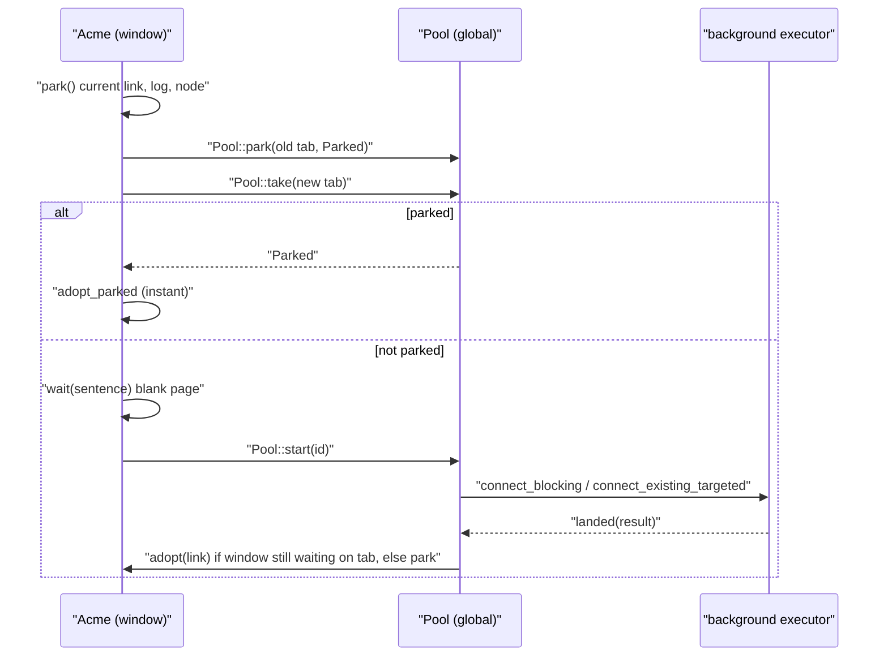
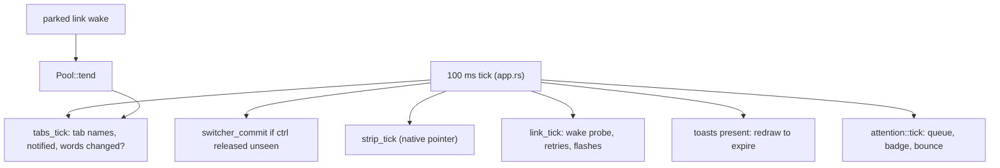

# Sessions, Tabs and Window Chrome

Everything the apex client draws *around* acme's tiled columns lives in a set of small modules in `crates/apex-client/src`. These modules cover the tabs and the pool of sessions behind them, the session picker, the sidebar and title bar, the ctrl-tab walk and the ⌘⇧\ overview, the stash shelf and column strips, window glides, notifications and the Dock, diagnostic toasts, process pills, the window's standing with its daemon, and restarting a daemon of another build. Most of these modules are `impl Acme` blocks that add methods to the one big client type described on [The UI Client (apex-ui)](client.md). A few hold app-wide state as gpui globals: `Pool` and the attention queue.

None of this chrome changes the replicated model, with two exceptions. Stashing goes through the node into the layout shard. Killing a process and taking a notification go to the server. Everything else is read from the session's replica (`Node`) every frame and painted. The tiling these pieces decorate is on [Tiling and Layout](tiling-and-layout.md). Leases, fencing and attachments, which the "standing" chip reports on, are on [Sessions, Shards and Leadership](sessions-and-replication.md). Input inside the windows is on [Mouse, Keyboard and Look](client-input.md), and the other pickers are on [Pickers and Overlays](client-overlays.md).

## Module map

| Module | What it owns |
|---|---|
| `pool.rs` | `Pool` global: the app's tabs (`TabId`, `Tab`, `State`), the parked sessions, recency order, launching links in the background |
| `app.rs` (parts) | `switch_to`, `park`, `adopt_parked`, `close_current_session`, `tab_word`, `tab_notified`, `next_notification` |
| `shell.rs` (parts) | The session picker (`Selector`, `Row`, `Host`, `Loading`), known hosts and sessions, recent sessions |
| `titlebar.rs` | Session name (click to rename), the chevron's session menu |
| `sidebar.rs` | Vertical tabs per host, the shown session's windows, stash and processes |
| `switcher.rs` | ctrl-tab walk with a slide, the ⌘⇧\ overview grid, sidebar row previews |
| `miniature.rs` | `Mini`: a session, window or column drawn small and live from a replica |
| `shelf.rs` | The stash as a fan of cards in the title bar, with a live preview |
| `strips.rs` | Stashed columns (sheet edges) and minimized columns (slim cards with handles) |
| `glide.rs` | Animating windows and columns between layout positions |
| `attention.rs` | Cross-session notification queue, Dock badge and bounce, `NSBeep` |
| `toasts.rs` | Toasts for new text in diagnostic windows |
| `procs.rs`, `titlefit.rs` | Process pills and their hover card; fitting path and pills to the bar |
| `standing.rs` | Leading / watching / stalled / offline / coming; chip, banner, card, auto-reconnect |
| `restart.rs` | Offering and doing a restart of a mismatched local server or remote daemon |

Sources: [pool.rs:1-18](crates/apex-client/src/pool.rs#L1-L18), [standing.rs:1-17](crates/apex-client/src/standing.rs#L1-L17), [switcher.rs:1-18](crates/apex-client/src/switcher.rs#L1-L18), [shelf.rs:1-10](crates/apex-client/src/shelf.rs#L1-L10), [toasts.rs:1-17](crates/apex-client/src/toasts.rs#L1-L17), [titlefit.rs:1-12](crates/apex-client/src/titlefit.rs#L1-L12)

## Tabs and the session pool

### Tabs are the app's, sessions are the host's

A session's identity cannot be relied on to name a tab. If you end a session and attach to its label again, the host makes a new session with a new id. The pool therefore gives each tab its own `TabId(u64)`, which never changes and is never reused, and keeps the session's `SessionUrl` beside it in `Tab::url`, correcting it as attaches report more. Everything in the UI (keys, clicks, notifications) refers to a tab by `TabId`. `Pool::open` is the only place a URL is turned into a tab. It is also the only caller of `one_session`, which treats two URLs as the same session when they are equal, or when they have the same provider, host argument and label (so a re-made session, or a rename one side has not heard about yet, keeps its tab).

```rust
pub struct Tab {
    pub id: TabId,
    pub url: SessionUrl,
    pub state: State,   // Coming(Why) | Up | Down(String)
}
```

`State::word` gives the short word shown after a tab's name: "connecting…" or "restoring…" for `Coming(Why::Attaching | Why::Restoring)`, "offline" for `Down`, nothing for `Up`. `Why::sentence` gives the longer line shown on the blank page while a tab waits.

Tabs persist across launches. `Pool::install` reads one URL per line from the `open-sessions` file beside the client's state file. It keeps only URLs that carry an identity, and makes each a tab in state `Down("not attached")`, so the bar is right from the first frame. `save_tabs` rewrites the file whenever the tab list or a tab's URL changes. Parked sessions do not persist: "Nothing is parked across a launch."

Sources: [pool.rs:39-117](crates/apex-client/src/pool.rs#L39-L117), [pool.rs:186-238](crates/apex-client/src/pool.rs#L186-L238), [pool.rs:269-305](crates/apex-client/src/pool.rs#L269-L305)

### Parked sessions

apex has one window. When it switches away from a session, `Acme::park` takes the remote `Link`, `Log` and `Node` off the window, puts a blank in-process stand-in in their place, and returns a `Parked`. The `Parked` holds the link, replica, URL, wake target, previews, live pages, snarfouts, a pending goto, and a `Seen` record. `Seen` stores the diagnostic text and notification times the window had already seen, so that showing the session again toasts and pings only what came in meanwhile. `Pool::park` stores the `Parked` under its tab and redirects the link's wake to the pool through `WakeTarget`: the reader thread holds a forwarding closure whose target can be swapped.

A parked session is still the leader of its shards. The pool's tending task (`Pool::tend`) runs whenever a parked link wakes it, and does the following:

- It polls each link, which applies incoming entries.
- It discards shows, and opens gotos in the first column (URLs via `Proposal::open_url`, files via `ClientMsg::OpenFile`).
- It answers the rules' client asks. Only `open` can be answered; anything else is refused with "the session is parked, nobody sees it".
- It clears pending I/O, then flushes and catches up.

After that it copies each parked session's metalog label onto its tab's URL, so a rename made elsewhere shows. A link that has ended leaves its tab in place with `Down("the link ended")`.

At most `CAP = 8` sessions stay parked. Beyond that, the least recently parked link is closed. Its tab stays, marked `Down("let go: 8 sessions are as many as stay attached")`, and showing it again attaches again. `park` also refuses to park a tab the window is already showing: a second UI attachment would take the lead (the daemon lets the latest UI lead) and leave the window fenced.

Sources: [pool.rs:119-184](crates/apex-client/src/pool.rs#L119-L184), [pool.rs:499-539](crates/apex-client/src/pool.rs#L499-L539), [pool.rs:586-659](crates/apex-client/src/pool.rs#L586-L659), [app.rs:807-853](crates/apex-client/src/app.rs#L807-L853)

### Bringing a tab up

`Pool::start` marks a tab `Coming(why)` and runs `Acme::connect_existing_targeted` (for tabs restored at launch, which must already exist) or `Acme::connect_blocking` on the background executor. A tab that is already coming is left alone. When the attempt finishes, `Pool::landed` decides where the link goes:

- **The tab was closed meanwhile.** The link is closed.
- **Success.** The session's real identity (`app::identified`) is written to the tab, which goes `Up`. If a window is sitting on that tab unconnected (`waiting_on`), the window `adopt`s the link. Otherwise the link is parked.
- **Failure.** An `ErrorKind::Unsupported` error on a local URL means the server is from another version, and the app offers a restart (see below). A waiting window shows the error. With no window waiting, a "no session…" error drops the tab, since there is nothing to come back to, and any other error marks the tab `Down(why)`.

At launch, `main.rs` opens the window and then calls `Pool::restore`, which starts every tab the window is not showing with `Why::Restoring` and `existing = true`. The exception is when the launch target is the picker; then the tabs wait in the bar.

```mermaid
stateDiagram-v2
    [*] --> Down: "install (from open-sessions) or Pool::open"
    Down --> Coming: "Pool::start"
    Coming --> Up: "landed Ok (adopted or parked)"
    Coming --> Down: "landed Err"
    Coming --> [*]: "landed Err 'no session' and no window waiting"
    Up --> Down: "link ended / evicted past CAP"
    Up --> [*]: "Pool::let_go"
    Down --> [*]: "Pool::let_go"
```

Sources: [pool.rs:307-435](crates/apex-client/src/pool.rs#L307-L435), [main.rs:845-869](crates/apex-client/src/main.rs#L845-L869)

### Switching, closing and recency

`Acme::switch_to(id)` is the single path for showing a tab. It parks the current session, sets `self.tab`, and records the tab as settled unless a ctrl-tab walk is in progress. If the pool has the session parked, `adopt_parked` swaps the link, log and node back in at once and restores `Seen`. Otherwise the window shows a blank page with the tab's `Why::sentence`, and `Pool::start` makes the link. Nothing waits on the UI thread, so moving on before the link lands loses nothing: the link parks itself when it arrives.

The pool keeps two orders. `tabs` is the order the user arranged. `settled` holds tabs the window stopped on, most recent first. `by_recency` returns every settled tab first, followed by parked or coming tabs that were never settled on, most recently parked first. `most_recent` drives ⌘⇧K (`previous_session`) and `next_tab`. `close_current_session` switches to `next_tab`, which is the most recent other tab or else a neighbour, and then calls `Pool::let_go` on the old tab. If it was the last tab, the window closes. Other keyboard paths are cmd-N (`go_to_tab`) and ⌘⇧[ / ⌘⇧] (`cycle_tab`, wrapping).



Sources: [app.rs:942-1003](crates/apex-client/src/app.rs#L942-L1003), [app.rs:1030-1129](crates/apex-client/src/app.rs#L1030-L1129), [pool.rs:541-584](crates/apex-client/src/pool.rs#L541-L584)

## The session picker

⌘T, the sidebar's "New Session" row and the title menu's "New Session…" all call `open_selector`, which calls `open_picker`. The picker's state is a `Selector` holding:

- the open tabs, and recently closed sessions not open here (from the `recent-sessions` file, one per host and label);
- the known hosts, with this Mac first (`known_hosts` reads the `known-hosts` file and adds the hosts of recent sessions);
- each host's sessions as a `Loading`: `Seeded` from the `known-sessions` cache at once, `Ready` when the host answers, `Failed(last, why)` when it does not.

Each host is asked in the background by `ask_host`. A remote host with no apex yet gets one via `providers::deploy` and is asked again. An `epoch` counter drops answers meant for an earlier opening of the picker.

`Selector::rows` builds one list filtered by the typed text, matched against label and host:

| Row | Meaning |
|---|---|
| `GoTo(TabId, url)` | A tab open here, other than the current one |
| `Open(url)` | A session a host has, or one recently closed |
| `Create(url, host)` | Make a session with the typed name, on each host that lacks one by that name (only if `valid_label` accepts it) |
| `NewHost` | The "Add a host…" form (`Connect`: a provider from `providers::available()`, and a host) |
| `Rename(name)` | Shown when opened with `open_rename` (right-click on a sidebar row) |
| `Note(text)` | Unpickable: an invalid label |

`choose` dispatches the picked row. `GoTo` calls `switch_to`, `Open` and `Create` call `switch_to_url` (and so `Pool::open`), and `Rename` calls `rename_session` for this session or `rename_other`, which runs the daemon's rename locally or `apex rename-session` remotely. `keeping` keeps the cursor on its row while answers arrive and rows move.

Sources: [shell.rs:800-1007](crates/apex-client/src/shell.rs#L800-L1007), [shell.rs:1015-1218](crates/apex-client/src/shell.rs#L1015-L1218), [shell.rs:1259-1410](crates/apex-client/src/shell.rs#L1259-L1410), [shell.rs:1648-1685](crates/apex-client/src/shell.rs#L1648-L1685)

## Title bar and sidebar

### The title bar

`title_bar` in `main.rs` builds the bar as a Mac app's. Its height is `title_h()`: the tag line height plus a border, and at least 38 px. From left to right it holds:

1. AppKit's traffic lights and the sidebar toggle.
2. The session's name and chevron, only when the sidebar is hidden.
3. The standing chip.
4. The session's directory crumbs and the process pills, both fitted by `titlefit`.
5. acme's top tag (`ViewId::Top`), still editable.
6. Room for the stash shelf at the right end.

Bare parts of the bar move the window on drag and zoom it on double-click. When the sidebar is pinned, its card extends up around the traffic lights.

`titlebar.rs` draws the session's name. Clicking it turns it into a `LineEdit` field with everything selected: return renames the session if the new name is non-empty and has no whitespace, and escape cancels. The chevron toggles a menu of every tab. The menu marks the current tab with ✓, shows a remote tab's host, shows `tab_word` (for example "watching" or "offline"), and puts the pjw glyph on other tabs with notifications. It ends with "New Session…". When another tab has notifications, pjw also appears as a badge on the chevron itself. pjw is never used for the session being shown.

Sources: [main.rs:1116-1122](crates/apex-client/src/main.rs#L1116-L1122), [main.rs:1243-1394](crates/apex-client/src/main.rs#L1243-L1394), [titlebar.rs:1-245](crates/apex-client/src/titlebar.rs#L1-L245), [app.rs:1985-2025](crates/apex-client/src/app.rs#L1985-L2025)

### The sidebar

When the sidebar is toggled on (`theme::sidebar()`), it is a 236 px column (`SIDEBAR_W`) holding a card inset 6 px. `sidebar_entries` groups rows by host: this Mac first, then known hosts, then any other host a tab is on. Under each host it lists the app's tabs (`Entry::Tab`), then that host's other sessions in a fainter style (`Entry::Known`; clicking one calls `switch_to_url`). Host headers appear only when there is more than one host, and say "unreachable" when the last ask failed. `sidebar_refresh` asks every host for its sessions in the background when the sidebar shows and again each minute.

A tab row shows an initial avatar (accent-coloured for the current tab), the name, and a second line: the tab word, or else the host for a remote session. Hovering shows an × that closes the current session or calls `Pool::let_go` on another; otherwise a notified tab shows pjw. Hovering a row also draws `session_preview`, a 320 px live miniature of a parked session beside the row. Right-click opens the rename picker.

Under the current tab, `window_rows` lists the session's windows column by column, then a "Stashed" section (latest first), then "Processes". Each window row shows the window's handle dot (`window_dot`: unsaved, live, working, progress, notification age) and names it with `sidebar::names`. That function uses the window's label, else the last part of its path, else a kind such as "Terminal", "Errors" or "X preview", and prints paths relative to the session's directory using `shown`. Clicking a row calls `reveal_window`, or `unstash` for a stashed window.

Sources: [sidebar.rs:1-296](crates/apex-client/src/sidebar.rs#L1-L296), [sidebar.rs:298-493](crates/apex-client/src/sidebar.rs#L298-L493), [sidebar.rs:577-675](crates/apex-client/src/sidebar.rs#L577-L675), [main.rs:225-238](crates/apex-client/src/main.rs#L225-L238), [switcher.rs:475-516](crates/apex-client/src/switcher.rs#L475-L516)

## ctrl-tab, the overview and miniatures

### Miniatures

`miniature::snapshot(node, theme)` turns a replica into a `Mini`, a list of coloured rectangles and text lines in the session's own pixel coordinates. It includes the top tag, each shown column's tag and body background, each visible window's tag (path, label, then dim tag text), and the window body:

- a text window's lines from its body view's origin, with tabs expanded;
- a terminal's grid, in runs of the cell colours;
- a page as plain paper with its name, since a page's native WKWebView belongs only to the shown session.

`snapshot_window` draws a single window and `snapshot_column_at` a single column. `Mini::paint` scales the result to fit a width. `paint_tilted` takes a `Tilt` that can lean a card back with a slope. Because each card is rebuilt from the replica every frame, the cards are live.

Sources: [miniature.rs:1-80](crates/apex-client/src/miniature.rs#L1-L80), [miniature.rs:82-185](crates/apex-client/src/miniature.rs#L82-L185), [miniature.rs:187-307](crates/apex-client/src/miniature.rs#L187-L307)

### The ctrl-tab walk

On the first ctrl-tab, `switcher_step` freezes an order in a `Switcher`: this tab, then `Pool::by_recency`. Each press steps the index (ctrl-shift-tab goes back) and calls `slide_to`. `slide_to` snapshots the outgoing session as a `Mini`, calls `switch_to`, and starts a 220 ms `SwitchSlide`. During the slide, the new content is offset by `dir * width * (1 - ease(t))` while the outgoing miniature slides out beside it. Because `switch_to` skips `note_settled` while a `Switcher` exists, sessions passed on the way are not counted as settled. Releasing control calls `switcher_commit`, which settles on the current tab. The 100 ms tick also commits if control has come up without gpui seeing it, for example while a page had the keys. Escape (`close_switcher`) slides back to the first entry.

### The overview (⌘⇧\)

`toggle_overview` opens an `Overview`. `overview_grid` picks the column count that gives the largest cards with the layout's aspect ratio inside 48 px padding, capped at 45% of the window's width. `overview_overlay` animates the current session's card shrinking from the full window into its grid slot over 260 ms (`OVERVIEW_RISE`) while the others fade in from 92% size. An accent ring shows the focus. Hover and the arrow keys move the focus (`overview_key`), and return or a click picks a card. Escape, a click off the cards, or ⌘⇧\ again picks the current tab. The picked card grows to fill the window over 240 ms (`OVERVIEW_PICK`), and then `overview_tick` calls `switch_to` and `note_settled`. `session_card` draws a session that is neither shown nor parked as its state word, or "not connected".

Sources: [switcher.rs:20-166](crates/apex-client/src/switcher.rs#L20-L166), [switcher.rs:168-473](crates/apex-client/src/switcher.rs#L168-L473), [app.rs:1706-1712](crates/apex-client/src/app.rs#L1706-L1712)

## Stash shelf, column strips and glides

### The stash shelf

⌘M (`stash_key`) stashes the key window, or else the window under the pointer, through `Node::stash_window`. The shelf draws the layout's `stash` at the title bar's right end, latest on top, like a hand of cards. Each card peeks 5 px out from under the one above (at most 4 do). A card whose window is working or notified slides out a further 34 px (`PULL`) over 0.3 s, tracked per window by `sync_pulls` and `shelf_pulls`.

Hovering or scrolling opens the fan (`Shelf::fan`, 160 ms, eased, reversible midway). The cards then spread leftward across at most half the bar, and the picked card's window appears below the bar as `shelf_preview`. For text and terminal windows the preview is the real `TextElement` and `TermElement`, live and editable; pages are drawn as a miniature. The preview's size is the window's stashed size, at least 480 by 320 (or 40% of the height), scaled down to fit. The fan closes `GRACE = 250 ms` after the pointer leaves both the cards and the preview, but not while a button is held. When it closes, `restack` brings windows worked in during the fan (`touched`) forward with `restash_window`. Clicking a card calls `unstash`.

`peek_errors` serves a toast's Show All. It opens the fan on a stashed window, selects the first line of what the toast said, and warps the pointer there.

Sources: [shelf.rs:24-163](crates/apex-client/src/shelf.rs#L24-L163), [shelf.rs:165-326](crates/apex-client/src/shelf.rs#L165-L326), [shelf.rs:328-590](crates/apex-client/src/shelf.rs#L328-L590)

### Column strips

A column can be shown as a strip in two ways:

- **Stashed** (B3 on its box). `strip_element` draws three sheet edges at the right of the row. Hovering it (`strip_tick`, also driven from the 100 ms tick through `native_mouse`) opens `strip_slice`: a live `snapshot_column_at` miniature at the width the column would come back to, from `restore` as a millionth of the row (default a third, clamped to 240 px up to half the row), placed on the side with more room. Clicking the slice calls `bring_back_column`. The slice closes 150 ms after the pointer leaves.
- **Minimized.** `minimized_element` draws a slim card with the column grip at the top and each window's handle dot where the window stands. Clicking a dot calls `press_handle` for that window; clicking anywhere else is the column box (`press_col_box`).

Sources: [strips.rs:1-117](crates/apex-client/src/strips.rs#L1-L117), [strips.rs:119-212](crates/apex-client/src/strips.rs#L119-L212)

### Glides

The core moves windows instantly. `glided_layout` returns a copy of the layout in which any window or column whose rectangle changed since the last frame sits partway along a 160 ms ease-out cubic (`ease`) from the old rectangle to the new. A move begun before the last one finished restarts from the last target with an 80 ms `HURRY`. A window that appears among existing ones opens down from its top edge. Resizing the window, switching tabs (`row` holds both the row rectangle and the `TabId`) or turning off View ▸ Layout Animations makes everything snap into place.

Sources: [glide.rs:1-147](crates/apex-client/src/glide.rs#L1-L147)

## Notifications, the Dock and toasts

### attention.rs

Each session's notifications are ordered by `Notification::at`, a sequence number in that session's metalog, so they cannot be compared across sessions. `attention::tick`, called at the end of every 100 ms tick, collects `(TabId, [(WindowId, Seq)])` from the parked sessions (`Pool::notifications`) and from the window's own node. `advance` then updates a global `Queue` of `Note = (TabId, WindowId, Seq)`. It drops notifications that have gone and appends new ones in the order first seen. It reports news only for tabs already in `Looked`, so a session seen for the first time brings no bounce for what it already had.

The Dock badge shows the queue length; `badge` skips the AppKit call if the label is unchanged. If news came while no app window is active, `bounce` calls `requestUserAttention:` once with the informational level. ⌘G (`next_notification`) takes the oldest note: it switches tabs if needed (deferring through `pending_note` if the tab is still attaching), then dismisses the notification, shows its window and warps the pointer to it. With nothing queued it calls `beep()`. At launch, `dock_icon` sets the running icon from `mac/space-bunny-1024.png`.

Sources: [attention.rs:1-160](crates/apex-client/src/attention.rs#L1-L160), [app.rs:2032-2065](crates/apex-client/src/app.rs#L2032-L2065), [app.rs:1741](crates/apex-client/src/app.rs#L1741)

### Toasts

Command errors go to their directory's +Errors window, and tool reports, such as LSP diagnostics, go to diagnostic windows. Neither is opened over the user's work. `diagnostic_news` runs during sync. For each window flagged `diagnostic`, it compares the text with what this client last saw (`diag_seen`). It skips windows that are laid out and showing lines (`diagnostic_seen`: `frmax > 0`). It stashes the window if it was laid out. It then appends the new text to the window's `Toast` or makes a new one. Windows that already existed when the client first looked are primed silently (`diag_primed`).

`news(old, text, typing)` takes what was appended. If the text was rewritten, it takes the lines that were not there before, counting multiplicity. Either way it drops lines about the file being typed in (`path:` prefix), whose errors come and go with each key.

Toasts stack at the lower right, newest at the bottom, and show the last 6 lines. Each stays 8 s (`STAY`) unless hovered. Any click off the toasts dismisses all of them (`toasts_click`). B1 on a toast, or its Show All, calls `toast_show_all`, which opens the stash preview (`peek_errors`) or reveals a window already in a column. The words in a toast respond as they would in the errors window: B3 or ⌘-click calls `look_in_errors` with the position of the word in the window, so `file:line` plumbs; B2 or ⌥-click executes the word in the window's context.

Sources: [toasts.rs:1-110](crates/apex-client/src/toasts.rs#L1-L110), [toasts.rs:112-316](crates/apex-client/src/toasts.rs#L112-L316), [toasts.rs:318-362](crates/apex-client/src/toasts.rs#L318-L362), [app.rs:2102-2113](crates/apex-client/src/app.rs#L2102-L2113)

## Process pills

`running_procs` returns the metalog's `procs` that are still running, excluding terminal shells (`ProcKind::Term`). `titlefit::choose` picks the richest step of a five-step `LADDER` of (`PathFit`, `ProcFit`) that leaves the top tag its room:

- `Full`: one pill per command name, with a count when several share a name.
- `Stack`: pills stacked as cards, newest on top.
- `Count`: just a number.

If anything is folded away, hovering fans every process out onto its own pill over the top row, so the bar never reflows under the pointer.

On a pill, × (B1 or B2) calls `kill_proc`, which sends `ClientMsg::Kill` with the pid, or calls `server.kill` in process. This asks the server directly rather than running a command. B1 on the name (`proc_output`) goes to the process's output: its directory's errors window (created if missing) or the window whose buffer it replaces. B3 (`proc_origin`) goes to the window it was run from. Both use `go_to_window`, a `Proposal::Goto` by window id that pushes the back stack. Hovering a pill shows `proc_card`: the full command in the mono face, the pid and directory, and when and where it was started. The sidebar's "Processes" rows offer the same actions.

Sources: [procs.rs:1-149](crates/apex-client/src/procs.rs#L1-L149), [titlefit.rs:24-72](crates/apex-client/src/titlefit.rs#L24-L72), [titlefit.rs:268-324](crates/apex-client/src/titlefit.rs#L268-L324), [sidebar.rs:348-407](crates/apex-client/src/sidebar.rs#L348-L407)

## Connection standing

`Acme::standing` classifies the window's relationship with its session:

| Standing | When | Word | Mark |
|---|---|---|---|
| `Leading` | In process, or connected and holding the layout lease | none | none |
| `Watching { leader }` | `fenced()`: the layout lease is held by another attachment or has been released | watching | eye, blue |
| `Stalled` | Remote, not connected, link still open | stalled | broken link, gold |
| `Offline { why }` | Link closed, or the tab's attach failed | offline | broken link, gold |
| `Coming` | Waiting on a tab that is coming up | connecting… | spinner |

Blue and gold are fixed values, not the palette's accent. They sit on the blue–yellow axis, which red-green colour blindness keeps apart, and were checked under a deuteranopia simulation (see [Themes, Fonts and Colour](themes-and-fonts.md)). A non-leading standing shows a chip after the session's name; clicking it opens `standing_card_panel` with the host, the state, the ping time, the retry countdown and any unconfirmed edits. A banner under the title bar explains what the standing means and offers actions. Watching offers **Take over**, which is never done automatically, and reconnects so that the daemon lets the latest UI lead. Typing while watching flashes the banner (`flash_watching`).

`link_tick` runs every 100 ms:

- A gap over 5 s between ticks (`WAKE_GAP`) means the Mac slept. The tick sends a `Ping`, and if no pong arrives within 2 s it marks the link dead and retries at once.
- A stalled link is given up on 15 s after the daemon last answered (`STALL_GIVE_UP`), but only if nothing is unconfirmed.
- Offline retries follow `BACKOFF = [1, 2, 5, 10, 20, 30]` seconds, unless `hopeless(why)`: a protocol mismatch, a tab let go, or "not attached".

`unconfirmed` counts, per shard this window leads, entries in the log beyond `link.acked`. Reconnecting would drop those edits. While the link is still open, `ask_reconnect` therefore asks first (`confirm_drop`, with "Reconnect anyway" or "Wait"). After a drop, a `lost_note` names the affected windows for 20 s.

Sources: [standing.rs:19-110](crates/apex-client/src/standing.rs#L19-L110), [standing.rs:112-273](crates/apex-client/src/standing.rs#L112-L273), [standing.rs:275-546](crates/apex-client/src/standing.rs#L275-L546), [app.rs:2279-2282](crates/apex-client/src/app.rs#L2279-L2282)

## Restarting a mismatched server

When an attach to a local URL fails with `Unsupported` (the daemon "speaks apex protocol N"), `Pool::landed` and launch both call `offer_restart`. A static `OFFERED` flag limits the offer to once per launch. The offer is a warning prompt naming the daemon's protocol (parsed by `their_protocol`) and this build's `PROTOCOL`, with Restart Server or Not Now. Apex ▸ Restart Server… (`restart_server_asked`) asks the same question at any time, and counts windows with unsaved changes across this window and parked local sessions (`local_unsaved`).

`restart_server` calls `remote::stop_any` on the default socket and then `reattach_on(None)`. That reconnects this window if its session is local, calls `Pool::start` for every other local tab not shown, and reconnects other windows on that daemon. The first attach brings up a fresh server. Tabs are kept, and each attaches to a fresh session of its name. For a remote session, the standing card's and waiting page's **Restart daemon** (`restart_daemon_asked`) runs `providers::deploy` and then `apex stop` on the destination, off the UI thread, before calling `reattach_on(Some(dest))`. See [Remote Hosts and Providers](remote-hosts.md) and [The Attach Protocol](attach-protocol.md) for the build id and protocol check.

Sources: [restart.rs:1-172](crates/apex-client/src/restart.rs#L1-L172), [pool.rs:398-410](crates/apex-client/src/pool.rs#L398-L410), [main.rs:856-858](crates/apex-client/src/main.rs#L856-L858)

## The tick that drives the chrome

Several pieces of chrome change without user input: parked links, links coming up, toasts expiring. They are re-evaluated on a 100 ms loop in `app.rs`.



`tabs_tick` compares a tuple of (id, URL, notified, word) for every tab with what was last drawn. It is the only thing that redraws the window when a parked session or a background attach changes a tab.

Sources: [app.rs:1700-1743](crates/apex-client/src/app.rs#L1700-L1743), [app.rs:1994-2007](crates/apex-client/src/app.rs#L1994-L2007), [pool.rs:189-218](crates/apex-client/src/pool.rs#L189-L218)

## Tests

The chrome's unit tests are small and pure:

- `pool.rs`: which URL pairs map to the same tab.
- `attention.rs`: queue order, first-look suppression, and re-raised notifications.
- `standing.rs`: backoff growth, `hopeless`, and that only leading says nothing.
- `restart.rs`: protocol parsing.
- `toasts.rs`: the `news` diff rules.
- `sidebar.rs`: `split_name` and `shown`.

The rendering and gpui wiring have no automated tests.

Sources: [pool.rs:662-689](crates/apex-client/src/pool.rs#L662-L689), [attention.rs:162-199](crates/apex-client/src/attention.rs#L162-L199), [standing.rs:647-671](crates/apex-client/src/standing.rs#L647-L671), [restart.rs:174-181](crates/apex-client/src/restart.rs#L174-L181), [toasts.rs:346-362](crates/apex-client/src/toasts.rs#L346-L362), [sidebar.rs:554-575](crates/apex-client/src/sidebar.rs#L554-L575)
