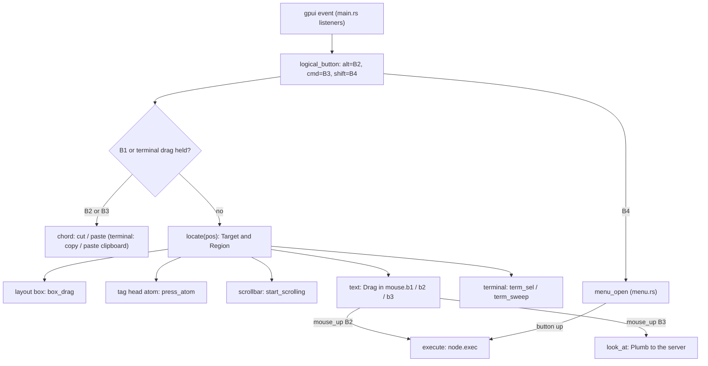
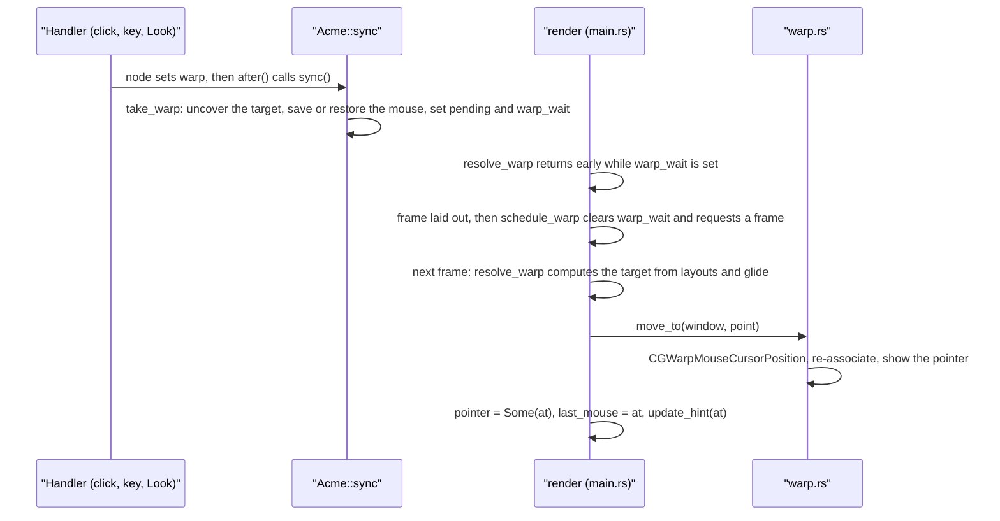
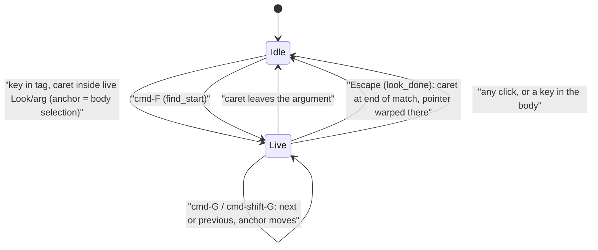

# Mouse, Keyboard and Look

apex keeps acme's interaction model. The keyboard goes to the text under the pointer. Three mouse buttons select (B1), execute (B2) and look (B3), and chords cut and paste while B1 is held. apex adds a fourth button, B4, which pops up a menu of the verbs that plumbing rules offer for the window. All of this lives in the gpui client, mostly in `Acme`'s handlers in `crates/apex-client/src/app.rs`. Every change still goes through the leader `Node` as log entries (see [The Node](node.md)). The client only decides what a gesture means. It then calls `node.select`, `node.insert`, `node.exec` and the like, or sends a plumb to the server.

This page follows input from the gpui event to the edit. It covers mapping a Mac's one button onto acme's three, sweeps and chords, the B4 menu, keyboard editing in `text_key`, the pointer warps acme makes after layout changes, how the caret and pointer are drawn, and the "look as you type" behind ⌘F/⌘G. Pickers and other overlays, which take the keys while they are open, are covered in [Pickers and Overlays](client-overlays.md). The client's overall structure is in [The UI Client](client.md), and the tiling that warps refer to is in [Tiling and Layout](tiling-and-layout.md).

## Where input arrives

`main.rs` puts all the listeners on the root element. Mouse down, up and up-outside go to `Acme::mouse_down` and `Acme::mouse_up` for Left, Middle, Right and `Navigate(Back)` (B4). A force click goes to `mouse_pressure`, B5 (`Navigate(Forward)`) to `b5_down`, moves to `mouse_move`, modifier changes to `modifiers_changed`, and keys to `key_down`. Menu-bar shortcuts (⌘F, ⌘G, ⌘⇧G, ⌘[, ⌘], Undo, Copy, and so on) arrive as gpui actions, before any key event. They are routed to `find_start`, `find_next`, `menu_command` and `menu_edit`.

Before any of this runs, the client has to know what is under the pointer. `locate` turns a point into a `Target` (a text `View`, a `Term`, or a page's `Web` scrollbar) and a `Region` (a text offset, an atom in a tag's head, the scrollbar, the layout box, a terminal cell). It reads the `TextLayout`s and `TermLayout`s that the previous frame recorded. An overlay over the point hides what is beneath it, so `locate` returns `None` there. The one exception is the stash's preview, which is a real window ([app.rs:3094-3146](crates/apex-client/src/app.rs#L3094-L3146)).

Sources: [main.rs:189-214](crates/apex-client/src/main.rs#L189-L214), [app.rs:154-173](crates/apex-client/src/app.rs#L154-L173), [app.rs:3094-3164](crates/apex-client/src/app.rs#L3094-L3164), [shell.rs:271-273](crates/apex-client/src/shell.rs#L271-L273), [shell.rs:304-305](crates/apex-client/src/shell.rs#L304-L305)

## The three-button model

### Buttons on a laptop

A Mac trackpad has one button, so `logical_button` follows plan9port's mapping. Option-click is B2, command-click is B3, and shift-click is B4 (`MouseButton::Navigate(Back)`, the tools menu). Real Middle and Right buttons pass through unchanged. The button that a left press stood for is remembered in `mouse.left_as`, so that `mouse_up` releases the same logical button ([app.rs:3269-3285](crates/apex-client/src/app.rs#L3269-L3285), [app.rs:3743](crates/apex-client/src/app.rs#L3743)). `logical_button_peek` makes the same mapping without recording it.

There are two more ways in:

- **Force click** on a trackpad (`mouse_pressure`) turns a B1 press into a B3 press at the same spot. This only happens if the B1 press has not swept anything yet. The unfinished B1 is dropped and a synthetic ⌘-click is fed back through `mouse_down` ([app.rs:4640-4671](crates/apex-client/src/app.rs#L4640-L4671)).
- **B5**, a mouse's forward button, runs `Back` in the window under the pointer, just as ⌘[ does ([app.rs:3561-3569](crates/apex-client/src/app.rs#L3561-L3569)).

### What each press records

`mouse_down` starts by clearing transient state. It makes the caret solid, ends any live look and gives keyboard focus back from a web view. A click outside the finder, quick-open, palette or session selector closes that overlay and does nothing else. While the B4 menu is up, every other press is ignored. After that, the press is dispatched on `(target, button, region)`:

| Press | Region | Effect |
|---|---|---|
| B1 | text | Select a caret, or a `double_click` expansion on a double click. Record `mouse.b1 = Drag{view, anchor}` and make this the active column. |
| B1 while B2 held | text | Set `chord_arg`, so the B2 command takes the last selection as its argument (acme's `textselect2`). |
| B2 / B3 | text | Record `mouse.b2` / `mouse.b3`. B3 also records `b3_reverse` (shift) and `b3_cmd`. |
| any | layout box | Record `box_drag`. The tiling op runs on release (acme's `coldragwin` / `rowdragcol`). |
| any | scrollbar | `start_scrolling` (acme's `textscroll`). |
| B1 | terminal cell | Start a client-side `term_sel`, or select a word on a double click. |
| B2 / B3 | terminal cell | Start a `term_sweep` and draw it as `term_hl`. |
| B1 | the top row past its text | `window.start_window_move()`, as on a title bar. |

The `Mouse` struct holds all of this per-gesture state: the three drags, `chorded`, `chord_arg`, `box_drag`, `scrolling`, `autoscroll`, `term_drag`, `term_sweep` and the modifiers ([app.rs:77-105](crates/apex-client/src/app.rs#L77-L105)).

### Sweeps

`mouse_move` extends whichever drag is live. For B1 it re-selects from the anchor to `offset_at(pos)` through `node.select`, so the selection is replicated as the user sweeps. If the pointer goes above or below the text, it starts acme's `framescroll`: a spawned task calls `autoscroll_step` every 80 ms. That scrolls by however many lines the pointer is past the edge and extends the selection to the text at that edge ([app.rs:3692-3727](crates/apex-client/src/app.rs#L3692-L3727), [app.rs:4129-4151](crates/apex-client/src/app.rs#L4129-L4151)).

B2 and B3 sweeps are not selections. They only set `self.hl = (view, lo, hi, HlKind::Exec | Look)`, which is drawn in that button's sweep colour ([app.rs:3728-3736](crates/apex-client/src/app.rs#L3728-L3736)). Scrollbar buttons repeat in the same way: one step at once, then after 200 ms one every 80 ms. Each step warps the pointer back onto the bar ([app.rs:4056-4117](crates/apex-client/src/app.rs#L4056-L4117)).

### Chords

`chord` runs on every press, before `locate`. While B1 is down, B2 cuts and B3 pastes in the view where the B1 sweep started, wherever the pointer has gone since. In a terminal, B2 copies (there is nothing to cut) and B3 types the clipboard into the shell. Setting `chorded` freezes the sweep. A press that lands outside the window still reaches `chord` through `mouse_down_out`.

On a laptop there are no extra buttons to chord with, so `modifiers_changed` does the same job. Pressing ⌥ while B1 is held cuts, and pressing ⌘ pastes ([app.rs:3520-3559](crates/apex-client/src/app.rs#L3520-L3559), [app.rs:3873-3916](crates/apex-client/src/app.rs#L3873-L3916)). Cut and paste use the system clipboard as acme's snarf buffer. A paste also appends `LayoutOp::Snarf` so that the session's snarf matches the clipboard ([app.rs:5383-5403](crates/apex-client/src/app.rs#L5383-L5403)).

### Release: what B2 runs and what B3 looks at

On release, `take_range_at` decides which text the button took:

1. **On purpose.** `explicit_range_at` takes the sweep if it is non-empty, or else the selection if the click was inside it.
2. **By expansion.** Otherwise it expands from the click. B2 uses `exec_word`, which grows over `is_exec_char` runes (file characters plus `<|>`). In a tag, a click inside a closed `Look/two words/` takes all of it. B3 uses `expand(.., is_file_char)`, acme's `isfilec`, which here also includes `~`.

For B2, the text plus any chord argument goes to `execute`. The range is stored in `self.ran`. It is drawn as B2's sweep for a moment more on the `RAN` clock: on, off for a blink at 30–60 ms, on again, then fading out from 90 ms until it is gone at 210 ms. That shows what ran. `execute` handles a few words in the client itself before calling `node.exec`:

- `End` ends the session.
- `Send` in a terminal types the selection into the shell.
- Words that a page from a buffer says it answers are run in that page.
- `Back`, `Fwd` and `Get` on an unowned URL page navigate the page.
- `Snarf` in a terminal copies.
- `Paste` syncs the clipboard into the session's snarf first.

For B3, `look_at` sends a `PlumbReq` or a `ClientMsg::Plumb`. It carries the text, `at` (the anchor as a `Span`), `sel` (only when the range was explicit), the `reverse` flag (shift-B3) and an optional verb. Command-B3 sends verb `Def` (the LSP's rule), and shift-command-B3 runs `Back`. A real B3 counts as command-B3 when ⌘ is held. A ⌘-click stand-in counts only when control is held too ([app.rs:3818-3871](crates/apex-client/src/app.rs#L3818-L3871), [app.rs:4688-4696](crates/apex-client/src/app.rs#L4688-L4696), [app.rs:5422-5555](crates/apex-client/src/app.rs#L5422-L5555)). The server does the expansion and the plumbing walk, as described in [Plumbing Rules and Verbs](plumbing.md).

Terminal sweeps end the same way, from the grid text. A B2 inside a terminal selection takes the selection. A plain B3 click prefers an OSC 8 link, then a whole `http(s)://` URL, then a file word ([app.rs:3779-3817](crates/apex-client/src/app.rs#L3779-L3817)).

### The ⌘/⌥ hint

While ⌘ alone or ⌥ alone is held over text, and no button is down, `update_hint` computes what a click would take there: B3's range for ⌘, B2's for ⌥. The rule is the same as `take_range_at`. The result is stored in `self.hint`, and the text element draws it as a pill in that button's sweep colour. The pointer turns into the pointing hand. `update_hint` runs again on every move and modifier change, and after every warp, because no event reports that a warp moved the pointer ([app.rs:4578-4607](crates/apex-client/src/app.rs#L4578-L4607), [text_element.rs:2014-2039](crates/apex-client/src/text_element.rs#L2014-L2039)).

Sources: [app.rs:684-728](crates/apex-client/src/app.rs#L684-L728), [app.rs:3269-3871](crates/apex-client/src/app.rs#L3269-L3871), [app.rs:3931-3975](crates/apex-client/src/app.rs#L3931-L3975), [app.rs:4640-4696](crates/apex-client/src/app.rs#L4640-L4696), [app.rs:5383-5555](crates/apex-client/src/app.rs#L5383-L5555)

## The B4 tools menu

B4 (a real fourth button, or shift-click) on a window opens the verbs that the plumbing rules offer that window. `menu_open` gets them from `apex_core::plumb::verbs_for(rules, path, kind, window, owner)` and opens nothing if the list is empty. B4 on a layout box does something else: it minimizes the window or column (`minimize_box`).

`menu.rs` ports libdraw's `menuhit` as the mariusae/plan9port acme uses it. `Menu::place` positions the menu so that the item chosen last is under the pointer. The client remembers that item by text in `menu_last`. The menu is centred across the pointer and kept inside acme's area. It has 26 px rows (`ROW_H`) and a minimum width of 120. Past `MAXUNSCROLL` (25) items, or more than fit on screen, it shows `NSCROLL` (20) items at a time with a scroll lane down the right. `menu_open` then warps the pointer onto the centre of that item, as menuhit's `moveto` does, so a plain B4 click repeats the last choice ([menu.rs:64-91](crates/apex-client/src/menu.rs#L64-L91), [app.rs:4698-4725](crates/apex-client/src/app.rs#L4698-L4725)).

| `Menu` function | Role |
|---|---|
| `place` | Compute `menur`, `textr`, `scrollr`, `off` and `lasti` for the items and the pointer |
| `sel(x, y)` | menusel: the drawn row under the point, or −1 outside the rows |
| `item_rect(i)` | The rectangle a row's highlight fills |
| `thumb()` | The scroll lane's thumb (menuscrollpaint) |
| `face()` | The interface font at 13.5 pt that items are drawn and measured in |

While the button is held, `mouse_move` sends every move to `menu_track`. It highlights the row under the pointer, or none outside the rows. On the lane it scrolls so that the pointer's height picks the window of items. `mouse_up` for `Navigate` calls `menu_up`. That runs the highlighted item through `execute(ExecCtx::Window(w), item)`, the same path B2 takes, and records it as `menu_last`. The menu is then kept as `menu_closing` so it can animate out.

`main.rs` draws the menu with B2's colours, because choosing an item runs it. It fades in over 90 ms. When the button comes up, the chosen row blinks on the `RAN` clock and the menu fades out. If nothing was chosen, it simply fades ([main.rs:574-595](crates/apex-client/src/main.rs#L574-L595), [main.rs:1178-1225](crates/apex-client/src/main.rs#L1178-L1225)). The tests in `menu.rs` check that the remembered item opens under the pointer, that the menu's width follows the widest item while staying on screen, and that long menus scroll.

Sources: [menu.rs:1-164](crates/apex-client/src/menu.rs#L1-L164), [app.rs:3336-3363](crates/apex-client/src/app.rs#L3336-L3363), [app.rs:4698-4758](crates/apex-client/src/app.rs#L4698-L4758), [app.rs:579-587](crates/apex-client/src/app.rs#L579-L587)

## The keyboard

### Where keys go

`key_down` first offers the key to whatever has a field open. The order is: the overview, ctrl-tab and the switcher, ^F's completion list, the finder, quick-open, a page's URL field, tag editing, the path picker, the cwd picker, the session name, the command palette, and the session selector. Each of these returns once it has handled the key.

If none of them took it, the key goes to the text under the pointer, as in acme. `self.pointer(window)` is either where a warp last put the pointer or the real pointer position. `locate` turns that point into a target. Over an overlay, the key goes to `kept_target`, wherever keys went before. Over a page's scrollbar, it goes to the last selected text (`node.seltext`). Over no window at all, it goes nowhere. A key in a window also attends to that window, which dismisses its notification ([app.rs:4893-5047](crates/apex-client/src/app.rs#L4893-L5047)).

A terminal target gets ⌘↑/⌘↓ (jump between prompt marks), ⌘⇧C (copy the last command's output), ⌘V (paste), and every un-⌘'d key encoded through `term_key`. A text target makes its column active for any key except the arrows and paging keys. It then calls `text_key`, and afterwards `live_look` for a tag. A key in a body ends any live look in that window.

### `text_key`

`text_key` follows acme's `texttype`. Each key becomes a node operation:

| Key | Effect |
|---|---|
| ⌘Z / ⌘⇧Z / ⌘Y | `node.undo` / `node.redo` |
| ⌘X ⌘C ⌘V ⌘A | cut, snarf, paste, select all |
| ^F or Insert | `complete`: file-name completion before the caret (see [Pickers and Overlays](client-overlays.md)) |
| ↑ / ↓ in a tag | Collapse the tag to one line or expand it (`WindowOp::TagExpand`, then `refit_window`) |
| ↑ / ↓ elsewhere, PgUp / PgDn | Scroll by a third, or two thirds, of the lines that fit |
| ^U ^W ^H, Backspace | `node.erase` with `Erase::Line`, `Word` or `Char` (acme's `textbswidth`) |
| ^A / ^E | Caret to the start or end of the line |
| other ^letters | Insert the control character itself (win reads ^C and ^D from the text) |
| Delete (fn-⌫) | DEL (`\x7f`) in the body of a live window, so win interrupts; otherwise `delete_forward` |
| Enter | A newline plus the previous line's leading whitespace when the window's `autoindent` is on. Ignored in column tags and the top row. |
| Escape | Select what was typed since `typed_start` (acme's Esc) |
| ← / → | Move or collapse the caret |
| Home / End | acme's Khome/Kend: bring the last insertion point (`iq1`) back into view if it has scrolled off, otherwise go to the top of the text or show its end |
| anything with `key_char` | `type_text`: `node.insert` |

`type_text` records the start of the current typing in `typed_start` so that Escape can select it. After typing or erasing, `iq1` records where the typing ended, which Home and End return to. Every handled key marks the view `want_visible`, so the next render scrolls the caret into view ([app.rs:5180-5379](crates/apex-client/src/app.rs#L5180-L5379)). `text_key` calls `flash_watching` first. When another client holds the lease, typed keys have no effect and the standing banner flashes.

The Edit menu's actions go through `menu_edit`, and its commands (Put, Get, Del, New, Select All as `Edit ,`) go through `menu_command`. Both use acme's rule: they act on the window under the pointer, or failing that on the last selected text. While an overlay is open they act on its field instead, and over a page they act on the page ([app.rs:5049-5178](crates/apex-client/src/app.rs#L5049-L5178)).

Sources: [app.rs:4893-5379](crates/apex-client/src/app.rs#L4893-L5379), [app.rs:677-681](crates/apex-client/src/app.rs#L677-L681)

## Pointer warps

acme moves the mouse after layout changes. On a new window it lands in the body near the tag (`coladd`). On a layout-box click it lands on the box (`winmousebut`, `colmousebut`). When a window closes, it moves onto the next window's Del (`colclose`'s movetodel), or returns to where it was before the closed window was made (savemouse/restoremouse). After a Look or a jump, it moves onto the selection.

The node records which of these is wanted as `node.warp: Option<tiling::Warp>`. It is replicated intent, not pixels ([tiling.rs:155-171](crates/apex-core/src/tiling.rs#L155-L171)). The client turns it into a real cursor move, but only after a frame has laid out the new geometry:

`take_warp` runs at the end of `sync`. It first calls `node.uncover`, so a window in a collapsed or hidden column is brought back before the warp lands. `Warp::NewWindow` saves the mouse position in `mouse_saved`. A `Warp::Closed` for that same window becomes `Pending::Restore` to that saved point. Otherwise it goes to the next window's Del, or nowhere if there is no next window ([app.rs:2364-2399](crates/apex-client/src/app.rs#L2364-L2399)).

`resolve_warp` runs at the top of `render`. It computes the target point:

- **New window:** in the body, just past the scrollbar and below the tag.
- **Window or column box:** the box's centre.
- **Closed:** the centre of the Del (or stacked-Del) atom in the next window's tag layout.
- **Selection:** the selection's first rune, halfway down its line, so that pressing B3 again goes to the next match. A terminal or page has no text layout, so it falls back to the top of the body.

If the target window is still gliding (see `glide.rs`), the pointer travels with it, re-warped every frame to where the window is drawn. Meanwhile `warp_onto` makes the destination own the keys and the focus ring, whatever the pointer passes over. The pending warp is only cleared once the window has landed ([app.rs:2401-2502](crates/apex-client/src/app.rs#L2401-L2502), [glide.rs:66-74](crates/apex-client/src/glide.rs#L66-L74)). Setting `APEX_DEBUG_WARP` logs each warp with its target and slot.

macOS sends no event for a warp. `warp::move_to` converts the view point to global y-down display coordinates through the NSView's window and the main screen, and calls `CGWarpMouseCursorPosition`. It then calls `CGAssociateMouseAndMouseCursorPosition(true)`, because otherwise a warp briefly freezes mouse movement. Finally it calls `setHiddenUntilMouseMoves: false`, so that a pointer moved from the keyboard (ctrl-tab, a Goto) is not left hidden ([warp.rs:36-115](crates/apex-client/src/warp.rs#L36-L115)). The client keeps the warped position in `self.pointer`. `mouse_move` drops it, along with `warp_onto`, once the real mouse moves more than a pixel away. Until then, `pointer()` and `key_view` treat the warped position as where the pointer is ([app.rs:2504-2516](crates/apex-client/src/app.rs#L2504-L2516), [app.rs:3645-3649](crates/apex-client/src/app.rs#L3645-L3649)).

The menu, the scrollbars and `scroll_step` call `move_to` directly, without going through `Warp`.

Sources: [app.rs:107-112](crates/apex-client/src/app.rs#L107-L112), [app.rs:529-532](crates/apex-client/src/app.rs#L529-L532), [app.rs:645-652](crates/apex-client/src/app.rs#L645-L652), [app.rs:1974](crates/apex-client/src/app.rs#L1974), [app.rs:2364-2516](crates/apex-client/src/app.rs#L2364-L2516), [main.rs:83-88](crates/apex-client/src/main.rs#L83-L88), [warp.rs:1-115](crates/apex-client/src/warp.rs#L1-L115), [tiling.rs:155-171](crates/apex-core/src/tiling.rs#L155-L171)

## Caret and pointer drawing

### The keys' caret

Each text draws its own selection. Only one view has the *keys' caret*: the view `key_view` names. That is the text under the pointer, or the warp's destination while it glides. There is none when apex is not in front or the pointer is over a terminal.

`caret_tick` runs on every mouse move. It updates `caret_view` and `caret_term`. When either changes, it restarts the blink: solid for 500 ms, then toggling every 530 ms. With View ▸ Blink Cursor off, the caret stays solid. A click or key also restarts it from solid. `caret_tick` returns true only when something visible changed, so frames are only redrawn when the caret changes ([app.rs:2172-2233](crates/apex-client/src/app.rs#L2172-L2233)).

`source()` passes `key_caret: Some(caret_on)` to that view's `TextElement` ([app.rs:3011-3013](crates/apex-client/src/app.rs#L3011-L3013)). The element paints the keys' caret as a 2 px accent-coloured bar as tall as the ink. Other views' carets are a thin bar in text colour. When the client is fenced (another client leads), both are drawn hollow. With View ▸ Smooth Cursor on, `glide_caret` moves the caret from where it was last drawn to its new position over 90 ms, easing out. If the text's frame or scroll changed, it jumps there at once ([text_element.rs:423-485](crates/apex-client/src/text_element.rs#L423-L485), [text_element.rs:2172-2218](crates/apex-client/src/text_element.rs#L2172-L2218)).

The same element paints the other input feedback. That includes the B2 and B3 sweep (`hl`), the fading `ran` range, the ⌘/⌥ hint pill, the faint wash over a live look's matches (`marks`), and the strike-through on a Look argument that found nothing (`strike`). These fields are documented on `Source` ([text_element.rs:1220-1248](crates/apex-client/src/text_element.rs#L1220-L1248), [text_element.rs:2003-2139](crates/apex-client/src/text_element.rs#L2003-L2139)).

### Mouse cursors

`render` chooses the system cursor for acme's area. Over text it is the arrow, not the I-beam, because a click in apex does much more than place an insertion point. It is the pointing hand while a hint is showing, and the closed hand while a layout box is dragged. A column edge being dragged gets ResizeLeftRight, and a window edge ResizeUpDown. Over a page it is `cursor::NATIVE_CURSOR` ([main.rs:300-339](crates/apex-client/src/main.rs#L300-L339)).

`cursor.rs` exists because gpui only selects system cursors by name. `install()` swaps the implementations of three `NSCursor` class methods:

- `contextualMenuCursor` returns `ApexNoCursor`, whose `set` does nothing. gpui's cursor rect over a page then stays silent and the page's own tracking areas decide the cursor.
- `dragLinkCursor` returns plan9port's big arrow, built from its Plan 9 bitmaps at 1× and 2×.
- `dragCopyCursor` returns the box cursor, built the same way.

As the file's own comment notes, this branch's render asks for system styles, so of the three only the page no-op is used. `cursor::apply` sets a system cursor directly over a page. Setting `APEX_CURSOR_DEBUG` logs every `-[NSCursor set]` with the calling frames ([cursor.rs:1-13](crates/apex-client/src/cursor.rs#L1-L13), [cursor.rs:232-308](crates/apex-client/src/cursor.rs#L232-L308), [main.rs:719](crates/apex-client/src/main.rs#L719)).

Sources: [app.rs:408-419](crates/apex-client/src/app.rs#L408-L419), [app.rs:2172-2233](crates/apex-client/src/app.rs#L2172-L2233), [app.rs:2905-3033](crates/apex-client/src/app.rs#L2905-L3033), [text_element.rs:423-485](crates/apex-client/src/text_element.rs#L423-L485), [main.rs:300-339](crates/apex-client/src/main.rs#L300-L339), [cursor.rs:1-308](crates/apex-client/src/cursor.rs#L1-L308)

## Look as you type, ⌘F and ⌘G

`look.rs` makes acme's tag `Look` behave like incremental search, while the state stays in the text. The query is the first `Look` in the window's tag. `Node::look_arg` parses it into a `LookArg` with `at`, `start`, `end`, `arg`, `live` and `closed` fields. Only an argument written `Look/word` is *live*, meaning it is searched as you type. The slash marks this in the text itself, because a word typed after a bare `Look ` could be a command. A closing slash, as in `Look/two words/`, lets the argument contain spaces ([node.rs:22-41](crates/apex-core/src/node.rs#L22-L41), [node.rs:1595-1654](crates/apex-core/src/node.rs#L1595-L1654)).

The client keeps the search session in `self.looking: Option<look::Live>`. It holds the window, the `anchor` (where the body's selection was when typing began), `term_at` for terminals, the last argument, and whether that argument `failed`.

After each key in a tag, `live_look(w)` runs. If the caret is a point inside the live argument and the argument has changed, it searches again from the anchor with `find_match`. Adding a letter therefore narrows to the same place or a later one, and deleting a letter goes back. An empty argument puts the selection back at the anchor. If nothing is found, the selection stays where it is, `failed` is set, and the argument is drawn struck through. `look_from` keeps `node.seltext` pointing at the tag, so the keys keep going into the argument, and it records `show_at` so the match scrolls into view ([look.rs:54-95](crates/apex-client/src/look.rs#L54-L95), [look.rs:176-196](crates/apex-client/src/look.rs#L176-L196)).

The two shortcuts work on the window acme would act on (`window_at_pointer`):

- **⌘F (`find_start`).** If the tag has no `Look`, it types `Look// ` at the tag's start. It then calls `node.make_look_live` to rewrite the argument as `Look/…/`, selects the argument so it can be typed over, warps the pointer onto it with `Warp::Sel(Tag)`, and starts a `Live` look.
- **⌘G / ⌘⇧G (`find_next`).** It searches for the argument again past or before the body's selection. If the argument is empty, it uses the selected text and writes it into the tag with `set_look_arg`. If a match is found, the pointer warps onto it as it does after B3. During a live look, the anchor moves to the match ([look.rs:198-269](crates/apex-client/src/look.rs#L198-L269)).

Escape in the argument calls `look_done`. The selection collapses to a caret at the end of the match, and the pointer is warped there, so the next keys edit at the match. While you are still typing, the pointer is not moved, because keys follow the pointer ([look.rs:158-174](crates/apex-client/src/look.rs#L158-L174), [app.rs:5024-5033](crates/apex-client/src/app.rs#L5024-L5033)).

`look_marks` returns every occurrence of the argument in the body, found with `find_all`. The result is cached in `look_cache` by argument and buffer version. They are washed faintly while a look is live in that window, or while the body's selection is one of them, for example after ⌘G or a B3. Otherwise they are hidden ([look.rs:271-300](crates/apex-client/src/look.rs#L271-L300)).

Pages and terminals have no buffer to search. A page is searched by its web view's own find (`webs.find_typed`, `webs.find`). A terminal's screen and history exist only on the host, so `term_look` sends `ClientMsg::TermFind`, or calls `server.term_find` when the server is local. It searches from the terminal selection, or from the top of the view. The reply comes back through `term_found`, which sets `term_sel` and the live look's `failed` flag ([look.rs:97-156](crates/apex-client/src/look.rs#L97-L156)). Terminals are covered in [Terminals](terminals.md), and pages in [The I/O Plane and Pages](io-plane-and-pages.md).

Sources: [look.rs:1-301](crates/apex-client/src/look.rs#L1-L301), [app.rs:430-433](crates/apex-client/src/app.rs#L430-L433), [app.rs:3293-3295](crates/apex-client/src/app.rs#L3293-L3295), [app.rs:5018-5042](crates/apex-client/src/app.rs#L5018-L5042), [main.rs:168-170](crates/apex-client/src/main.rs#L168-L170), [node.rs:22-59](crates/apex-core/src/node.rs#L22-L59), [node.rs:1595-1654](crates/apex-core/src/node.rs#L1595-L1654)

## Notes for working on input

- **Everything replicated goes through the node.** Selections during a sweep, cut, paste, typing and undo are all node operations. `hl`, `ran`, `hint`, `term_sel`, `looking`, the menu and `pointer` are only this client's. After a handler appends entries, it calls `after()`. That polls local execs, or flushes the link, and then calls `sync()`, which picks up gotos, notifications and the next warp ([app.rs:2795-2819](crates/apex-client/src/app.rs#L2795-L2819)).
- **Geometry comes from the previous frame.** `locate`, `offset_at`, the Del atom used by warps, and `menu_open`'s measurements all read the layouts the last render recorded. This is why warps wait one frame (`warp_wait`).
- **Stuck buttons.** A B1 press clears any earlier `b1`, `autoscroll` and `term_drag`. A release that never arrived would otherwise turn the next B2 or B3 into a chord ([app.rs:3366-3373](crates/apex-client/src/app.rs#L3366-L3373)).
- **Layout animations.** With View ▸ Layout Animations off, `glided_layout` places everything at once, so warps go straight to their targets ([glide.rs:84-98](crates/apex-client/src/glide.rs#L84-L98)).
- **Tests.** `app.rs` has unit tests for the `RAN` fade, for terminal double-click and selection hit-testing, and for scrolling. `menu.rs` tests menu placement. The live mouse and keyboard paths have no automated tests.

Sources: [app.rs:2795-2819](crates/apex-client/src/app.rs#L2795-L2819), [app.rs:3366-3373](crates/apex-client/src/app.rs#L3366-L3373), [app.rs:5718-5800](crates/apex-client/src/app.rs#L5718-L5800), [glide.rs:84-146](crates/apex-client/src/glide.rs#L84-L146)
