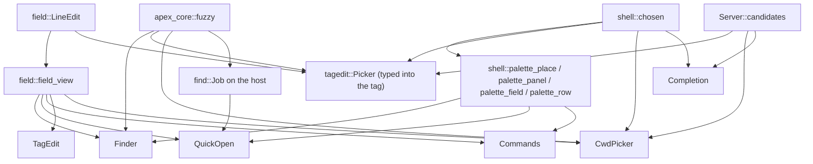
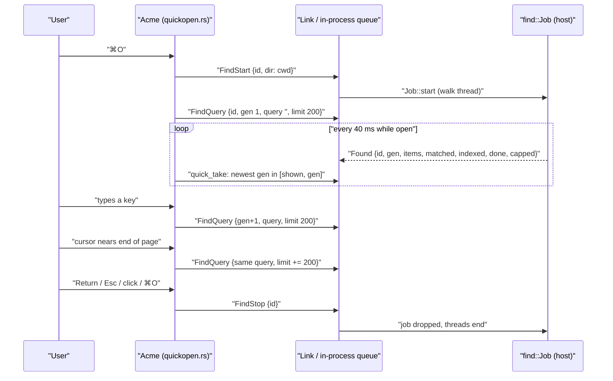
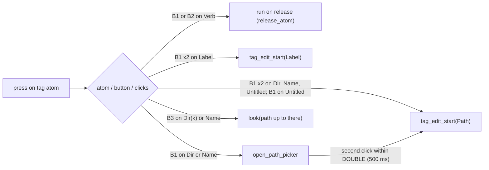

# Pickers and Overlays

Besides acme's tiled windows, the apex client draws a set of short-lived overlays. They are list pickers and one-line fields that take the keyboard for a moment and then go away. There are six of them: the ⌘P finder (and the same finder across all tabs), ⌘O quick open, the ⌘⇧P command palette, ^F inline file-name completion, the editing and folder picker on a window tag's head, and the folder picker under the title bar's working-directory crumbs. The session selector (⌘T) is built from the same parts but belongs on [Sessions, Tabs and Window Chrome](client-chrome.md).

None of these overlays is replicated state. Each is an `Option<…>` field on the `Acme` app (see [The UI Client](client.md)), and none of them shows up in the log until the user picks something. A pick then goes through the normal paths: a `Proposal::Goto`, `Acme::goto`, `Acme::execute` (B2), `apex_server::perform` with `SetPath`/`SetLabel`, or a `cd`. Some overlays get their contents from the host. Quick open streams results from a find job, and the folder pickers and ^F use the server's `candidates` listing. That way a remote session's file system is listed where it lives (see [The Server](server.md) and [The Attach Protocol](attach-protocol.md)). Mouse and keyboard handling outside the overlays is covered on [Mouse, Keyboard and Look](client-input.md).

## The overlays at a glance

| Overlay | Opened by | State field / type | Items come from | Matcher | A pick does |
|---|---|---|---|---|---|
| Finder | ⌘P (`Goto`) | `finder: Option<Finder>` | open windows in layout order, plus files closed lately | `apex_core::fuzzy` (via `finder::score`) | `Proposal::Goto` by window id or path, switching tab first if needed |
| Finder, all tabs | ⌘⇧O (`GotoAll`) | same, `all: true` | every tab's replica (the current one and parked ones) | same | as above |
| Quick open | ⌘O (`OpenPath`) | `quick: Option<QuickOpen>` | host-side `find::Job` walk of the session's cwd | `apex_core::fuzzy`, run on the host | `Acme::goto` on the file, or the folder with its slash |
| Command palette | ⌘⇧P (`Commands`) | `commands: Option<Commands>` | window verbs, tag words, rule verbs, recent execs, `plumb::BUILTINS` | `commands::score` | `Acme::execute` as B2 in the target window |
| ^F completion | ^F or Insert in text | `completion: Option<Completion>` | `Server::candidates` for the fragment | prefix (`starts_with`) | replaces the name, adding `/` after a folder or a space after a file |
| Tag field | double-click on path or label | `tag_edit: Option<TagEdit>` | none | none | `Proposal::SetPath` / `SetLabel` |
| Tag path picker | click on a folder or name in the tag | `picker: Option<tagedit::Picker>` | associated windows plus `candidates` folder listing | `apex_core::fuzzy` | goto window or entry; ⌥↩ replaces in place |
| cwd picker | click on a title-bar crumb | `cwd_picker: Option<CwdPicker>` | `candidates` listing, folders only | `apex_core::fuzzy` | `Acme::cd` |

The key bindings are in `shell::bindings`: `cmd-p` → `Goto`, `cmd-shift-o` → `GotoAll`, `cmd-o` → `OpenPath`, `cmd-shift-p` → `Commands` ([shell.rs:258-314](crates/apex-client/src/shell.rs#L258-L314)). `main.rs` connects these actions to `open_finder(false)`, `open_finder(true)`, `open_quick` and `open_commands` ([main.rs:164-173](crates/apex-client/src/main.rs#L164-L173)). The module comment at the top of `finder.rs` still calls the all-tabs finder ⌘⇧P. That comment is out of date: the binding is ⌘⇧O, and ⌘⇧P opens the command palette.

Sources: [shell.rs:258-314](crates/apex-client/src/shell.rs#L258-L314), [main.rs:164-173](crates/apex-client/src/main.rs#L164-L173), [finder.rs:1-18](crates/apex-client/src/finder.rs#L1-L18), [app.rs:4371-4375](crates/apex-client/src/app.rs#L4371-L4375)

## Shared building blocks



### The one-line field: `LineEdit`

`field::LineEdit` is the text field used by every overlay. It holds a `String`, a `cursor` and an optional `anchor` (both counted in characters, not bytes), plus an undo stack of `(text, cursor)` pairs capped at 64 ([field.rs:10-18](crates/apex-client/src/field.rs#L10-L18), [field.rs:81-86](crates/apex-client/src/field.rs#L81-L86)). Because it implements `Deref<Target = str>`, callers can use `filter.trim()` and `filter.is_empty()` directly.

`LineEdit::key(key, ch, mods) -> Edited` is the editing state machine. It handles the keys a Mac text field answers:

- arrows: shift extends the selection, ⌥ moves by words, ⌘ moves to the ends;
- home and end;
- backspace (⌥ deletes a word, ⌘ deletes to the start) and forward delete;
- the emacs control keys ^A ^E ^B ^F ^D ^H ^U ^W ^K;
- any printable character, as long as ⌘ is not held.

It returns `Changed`, `Moved` or `No` ([field.rs:202-312](crates/apex-client/src/field.rs#L202-L312)). Each overlay's key handler relies on this result: `Changed` re-filters and usually resets the cursor to 0, `Moved` only redraws, and `No` lets the key fall through. Word boundaries are alphanumerics plus `_` ([field.rs:136-164](crates/apex-client/src/field.rs#L136-L164)).

`field_view(e, caret_on, hint, active)` draws the field. It splits the text at the cursor and the selection ends, gives the selected span the `field_sel` background, puts a 1.5 px caret at the cursor, and shows the dimmed hint when the field is empty ([field.rs:315-349](crates/apex-client/src/field.rs#L315-L349)).

### The palette look and the "chosen" row

Three overlays (the finder, quick open and the command palette) plus the session selector are drawn as a palette in the style of Manifold's. `palette_place` puts the panel across a translucent scrim (`veil()`), 30% of the way down the window. `palette_panel` is a 560 px card with 12 px rounded corners. `palette_field` is a 48 px search row with a magnifying glass. `palette_row` is a 34 px row ([shell.rs:699-797](crates/apex-client/src/shell.rs#L699-L797)).

The anchored pickers (tag path, cwd and ^F) build their own panels, but all of them use `shell::chosen` to mark the selected row. `chosen` colours the row by the mouse button whose action it stands for. `Act::Exec` uses B2's sweep colours and is used by the command palette and the B4 menu. `Act::Look` uses B3's and is used by the finder, quick open and the pickers. In both cases a small bar is drawn at the row's left ([shell.rs:745-785](crates/apex-client/src/shell.rs#L745-L785)).

Every panel also adds `self.overlay_mark()`. This is a zero-size canvas that records the panel's bounds in `overlay_bounds` for the current frame ([app.rs:1131-1154](crates/apex-client/src/app.rs#L1131-L1154)). Those bounds are used for two things: cutting holes in the native web views so the overlay shows above a page, and `over_overlay`, which makes the pointer over a panel count as being on no text. Keys then go to `kept_target` instead of to whatever is under the panel ([app.rs:3140-3156](crates/apex-client/src/app.rs#L3140-L3156)).

### Blinking

Each overlay runs its own blink. The finder and the selector spawn a loop on `shell::BLINK` (500 ms). Quick open polls every 40 ms and redraws when the caret changes phase. The tag and cwd pickers loop at 530 ms. `Commands::caret_on` calculates a 530 ms phase but spawns no timer of its own, so its caret only blinks when something else causes a redraw ([finder.rs:234-257](crates/apex-client/src/finder.rs#L234-L257), [quickopen.rs:101-122](crates/apex-client/src/quickopen.rs#L101-L122), [tagedit.rs:116-118](crates/apex-client/src/tagedit.rs#L116-L118), [commands.rs:95-97](crates/apex-client/src/commands.rs#L95-L97)).

Sources: [field.rs:1-349](crates/apex-client/src/field.rs#L1-L349), [shell.rs:699-797](crates/apex-client/src/shell.rs#L699-L797), [app.rs:1131-1154](crates/apex-client/src/app.rs#L1131-L1154), [app.rs:3140-3156](crates/apex-client/src/app.rs#L3140-L3156)

## Routing keys, clicks and the Edit menu

The overlays have no common type. `Acme`'s key handler checks them one at a time, in a fixed order, and gives the key to the first one that is up ([app.rs:4918-4972](crates/apex-client/src/app.rs#L4918-L4972)):

1. `completion`, but only for keys without ⌘, and only if `completion_key` returns true;
2. `finder`;
3. `quick`, unless the key is ⌘O, which falls through so `OpenPath` can toggle the overlay closed;
4. `url_edit` (the page address bar, see [The I/O Plane and Pages](io-plane-and-pages.md));
5. `tag_edit`;
6. `picker` (the tag path picker);
7. `cwd_picker`;
8. `session_edit`, then `session_menu` (escape only);
9. `commands`;
10. `selector`.

Any key that reaches the text afterwards is followed by `completion_follow` ([app.rs:5045](crates/apex-client/src/app.rs#L5045)).

A mouse press anywhere closes them, again in a fixed order. `url_edit`, `tag_edit`, `picker`, `cwd_picker` and `completion` are dropped and the press goes on as usual. A press that closes `commands`, `finder`, `quick` or `selector` is used up by the close and does nothing else ([app.rs:3301-3335](crates/apex-client/src/app.rs#L3301-L3335)). Clicks on rows still work because each panel calls `stop_propagation` on its own mouse-down, so the press never reaches `mouse_down`.

The Edit menu's actions (⌘X ⌘C ⌘V ⌘A ⌘Z) arrive as actions before any key event. `menu_edit` sends them to `overlay_edit` when the selector, finder, url field, palette or quick open is up ([app.rs:5109-5115](crates/apex-client/src/app.rs#L5109-L5115)). `overlay_edit` asks `overlay_field()` for the field that has the keyboard. It checks the selector (or its new-host form), then `url_edit`, `commands`, `finder` and `quick`, and applies paste (first line of the clipboard, trimmed), select-all, copy, cut or undo to that field. If the text changed, it calls `overlay_changed`, which resets the list ([shell.rs:1412-1494](crates/apex-client/src/shell.rs#L1412-L1494)). The tag field and the two folder pickers are missing from both checks, which the review below points out.

Sources: [app.rs:4918-5047](crates/apex-client/src/app.rs#L4918-L5047), [app.rs:3287-3335](crates/apex-client/src/app.rs#L3287-L3335), [app.rs:5063-5115](crates/apex-client/src/app.rs#L5063-L5115), [shell.rs:1412-1494](crates/apex-client/src/shell.rs#L1412-L1494)

## ⌘P: the finder

`Finder` holds a `LineEdit` filter, a cursor, its `entries`, the `all` flag and `here`, the tab the window shows ([finder.rs:76-86](crates/apex-client/src/finder.rs#L76-L86)). Entries are gathered once, when the finder opens, by `session_entries` ([finder.rs:172-204](crates/apex-client/src/finder.rs#L172-L204)):

- The open windows come in layout order. Within each column, `tiling::stash_order` puts stashed windows where they stood, and stashed windows whose column is gone ("orphans") follow. Each window is followed by the windows it covers (`layout.stack(w)`), so picking a covered window brings it up.
- Each window gets a `label`: its own label, or `"Errors"` for an Errors window, or `"Preview"` for a page fed from a buffer. Windows with neither a name nor a label are skipped.
- Next come the session's recently closed files that are not open now.

With `all` set, `finder_entries` does the same for every tab in `Pool::tabs`. It uses this window's `node` for the current tab and the parked `Node` replica for each other tab. Every entry gets `tab: Some((TabId, label))`, and `tab_label` appends ` @ host` for remote sessions ([finder.rs:206-232](crates/apex-client/src/finder.rs#L206-L232)).

### Ranking

`Finder::picks` ([finder.rs:93-114](crates/apex-client/src/finder.rs#L93-L114)):

- With nothing typed, it shows only open windows, in gathered order. Closed files are there to be found by name, not scrolled through.
- With a query, every entry is scored by `Entry::score`. That is the best of three scores: the path alone, the label alone, and `"path label"` together, so a query like `rust-analyzer` finds a window by its label ([finder.rs:50-57](crates/apex-client/src/finder.rs#L50-L57)). Results are sorted by score, then open before closed, then this tab before others, then gathered order.

`finder::score` passes through to `apex_core::fuzzy::score`, the Zed-style scorer that the host's ⌘O listing also uses. Every query character must appear in order. Each scores 1.0 at the start of the file name or when it continues the previous match, 0.9 after `/`, 0.8 at a word start, and 0.55 otherwise. A case mismatch halves the score, and matches inside the file name get a bonus ([fuzzy.rs:1-14](crates/apex-core/src/fuzzy.rs#L1-L14), [finder.rs:125-135](crates/apex-client/src/finder.rs#L125-L135)).

↑ and ↓ wrap around (`rem_euclid`). Typing resets the cursor to 0 ([finder.rs:116-122](crates/apex-client/src/finder.rs#L116-L122), [finder.rs:264-293](crates/apex-client/src/finder.rs#L264-L293)).

### Picking

`Acme::pick` goes to an open window **by its id**, not its path, because a file and its preview share a path. If the entry is in another tab, it calls `switch_to` first. If that tab is still attaching, the `Loc` is kept in `pending_goto` and used once the tab arrives. Otherwise it applies `Proposal::Goto { loc }` through `apex_server::proposal::apply`, which records the origin on the back stack, as a jump should ([finder.rs:295-323](crates/apex-client/src/finder.rs#L295-L323); see [Proposals](proposals.md)).

### Recently closed files

`track_closed` runs on every `sync`. It compares the file windows (not scratch ones) with those seen last time. When an absolute, non-directory file window has disappeared, it calls `note_closed`. It resets its baseline whenever the window's session URL changes, so switching tabs does not count as closing ([finder.rs:325-349](crates/apex-client/src/finder.rs#L325-L349)). `note_closed` keeps the 50 most recent paths per session, newest first and without duplicates, in `~/Library/Application Support/apex/recent-files`, one `url<TAB>path` per line. That makes the list per machine, not per replica ([finder.rs:137-168](crates/apex-client/src/finder.rs#L137-L168)).

The panel marks each row: ▶ for an open terminal, ● for another open window, ○ for a closed file. It shows the label as a chip, the folder in the dim ink, "closed" for closed files, and a tab badge reading "· here" for the current tab. At most 24 rows are drawn ([finder.rs:351-433](crates/apex-client/src/finder.rs#L351-L433)).

Sources: [finder.rs:1-433](crates/apex-client/src/finder.rs#L1-L433), [fuzzy.rs:1-14](crates/apex-core/src/fuzzy.rs#L1-L14)

## ⌘O: quick open, backed by the host's find job

Quick open lists everything under the session's directory (`meta.cwd`) and matches it as the user types. The matching runs on the host, where the files are. The client only receives the best page of results.



`open_quick` toggles: if quick open is already up, it closes it. If `cwd` is empty it shows a notice and stops. Otherwise it closes the finder and palette, assigns a new request id (`next_find`), and starts the listing:

- With `Backend::Remote`, it clears `link.found` and sends `ClientMsg::FindStart`.
- With `Backend::Local`, it starts `apex_server::find::Job` in-process, with a sink that pushes into an `Arc<Mutex<Vec<ServerMsg>>>`.

It then sends the first query and spawns a 40 ms poll that calls `quick_take` and redraws when something arrived or the caret blinked ([quickopen.rs:69-124](crates/apex-client/src/quickopen.rs#L69-L124)). The daemon handles `FindStart` by starting a job whose sink writes straight to the asking connection, `FindQuery` by calling `job.query`, and `FindStop` by dropping the job ([daemon.rs:885-902](crates/apex-server/src/daemon.rs#L885-L902)).

On the host, the job walks breadth-first. It skips dot-directories, `node_modules`, `__pycache__` and `buck-out`, and does not follow directory links. It stops at `CAP` = 1,000,000 entries and reports that it did. Queries are matched with `apex_core::fuzzy` across cores, rematched as the walk adds entries, and abandoned partway through when a newer query arrives ([find.rs:1-45](crates/apex-server/src/find.rs#L1-L45)).

### Generations and pages

Each query carries a generation, `gen`. `quick_query(fresh)` increments `gen`. A fresh query resets `limit` to `PAGE` (200) and the cursor to 0. A query that is not fresh asks again with a larger limit ([quickopen.rs:126-141](crates/apex-client/src/quickopen.rs#L126-L141)).

`quick_take` accepts a `Found` message only if its id matches and `shown <= gen <= q.gen`. An answer to an older query can therefore still be shown until the newest one arrives, but never after. A larger page of the same query keeps the cursor where it is, clamped to the new length ([quickopen.rs:143-171](crates/apex-client/src/quickopen.rs#L143-L171)).

`quick_moved` asks for another page when more matches exist than have arrived, the cursor is within `ROWS` (12) of the end, and the previous page came back full ([quickopen.rs:183-192](crates/apex-client/src/quickopen.rs#L183-L192)). The cursor clamps at both ends instead of wrapping, and PageUp/PageDown move 12 rows.

`quick_pick` closes the overlay and calls `Acme::goto` with `root + rel`, adding a trailing `/` for a folder so it opens as a directory window ([quickopen.rs:231-240](crates/apex-client/src/quickopen.rs#L231-L240)). `close_quick` sends `FindStop` for a remote job; an in-process job ends when it is dropped. The footer shows "Indexing… N" or "N entries", the match count, and a note when the walk was capped ([quickopen.rs:283-306](crates/apex-client/src/quickopen.rs#L283-L306)).

Sources: [quickopen.rs:1-315](crates/apex-client/src/quickopen.rs#L1-L315), [daemon.rs:885-902](crates/apex-server/src/daemon.rs#L885-L902), [find.rs:1-45](crates/apex-server/src/find.rs#L1-L45), [remote.rs:442-443](crates/apex-server/src/remote.rs#L442-L443)

## ⌘⇧P: the command palette

`open_commands` toggles. It first finds the target window with `command_target`: the visible window under `last_mouse`, or else the window of the last selected text ([commands.rs:148-153](crates/apex-client/src/commands.rs#L148-L153)). It then gathers `(text, Origin)` items with no duplicates, skipping empty strings and `|` ([commands.rs:100-146](crates/apex-client/src/commands.rs#L100-L146)):

| Origin | Glyph | Items |
|---|---|---|
| `Tag` | › | `node.window_verbs(w)`, then each whitespace-separated word of the window's tag |
| `Tool` | ⚙ | `plumb::verbs_for(rules, path, kind, window, owner)`, the verbs the B4 menu offers (see [Plumbing](plumbing.md)) |
| `Recent` | ↺ | up to 40 exec texts from every window's `execs` and the layout's, newest first by `Seq` |
| `Apex` | ▸ | `apex_core::plumb::BUILTINS` |

`commands::score(text, q)` is a separate, simpler matcher. It matches a case-insensitive subsequence and scores +1 per character, +8 at index 0, +4 after a non-alphanumeric, and +5 for a run. The total is multiplied by 10 and reduced by `len/4` ([commands.rs:57-83](crates/apex-client/src/commands.rs#L57-L83)). `matches()` sorts by score, keeps gathering order for ties, and returns at most 12 items.

Return runs the selected item, or the typed text if nothing matches, through `Acme::execute(ctx, text)`, the same path B2 uses ([commands.rs:155-184](crates/apex-client/src/commands.rs#L155-L184)). `ctx` is `ExecCtx::Window(w)`, or `ExecCtx::Top` if there was no target. Rows are drawn with `Act::Exec` colours, and the panel has a higher deferred priority (2) than the finder's (1).

Sources: [commands.rs:1-233](crates/apex-client/src/commands.rs#L1-L233)

## ^F: inline completion

^F, or the Insert key, in a text view calls `Acme::complete(v, q0)` ([app.rs:5216-5220](crates/apex-client/src/app.rs#L5216-L5220)). This is acme's `textcomplete`. It walks back from the caret over file-name characters to find the fragment, then asks the server for candidates in the view's directory. A local backend calls `server.candidates` directly and queues the answer. A remote one sends `ClientMsg::Candidates { view, ctx, at: q0, prefix }`, and the daemon replies to that connection only ([app.rs:4760-4780](crates/apex-client/src/app.rs#L4760-L4780), [daemon.rs:925-929](crates/apex-server/src/daemon.rs#L925-L929)). `Server::candidates` lists the fragment's directory and returns names that start with the fragment's last part, sorted, each with a flag saying whether it is a directory, or an error string ([lib.rs:1235-1246](crates/apex-server/src/lib.rs#L1235-L1246)).

### Routing listings by `at`

The folder pickers use the same `Candidates` request and reply. To tell the replies apart, they put a sentinel in the `at` field. On each `sync`, the client routes replies as follows ([app.rs:1905-1914](crates/apex-client/src/app.rs#L1905-L1914)):

```rust
if c.at == crate::tagedit::LISTING {          // usize::MAX
    self.got_listing(c);                      // tag path picker
} else if c.at == crate::cwdbar::CWD_LISTING { // usize::MAX - 1
    self.got_cwd_listing(c);                  // cwd picker
} else {
    self.got_candidates(c);                   // ^F at caret offset `at`
}
```

### What happens with the answer

`got_candidates` ignores the reply if the caret has moved since the request. Otherwise ([completion.rs:64-93](crates/apex-client/src/completion.rs#L64-L93)):

- **No names:** a `Completion` with `none` set is shown as "No matches" for 1.5 s.
- **One name:** `complete_with` replaces the typed part of the name with the full name, adding `/` after a directory or a space after a file, and leaves no selection ([completion.rs:95-108](crates/apex-client/src/completion.rs#L95-L108)).
- **Several names:** the longest common prefix (`common`) is inserted immediately, and the list stays open.

While the list is up, typing still goes into the text. `completion_follow` runs after each key and narrows the list by **prefix** match on what has been typed since `start`. It closes the list when that span contains a non-name character, when the caret moves away, or when a `/` is typed. A directory's contents only come with the next ^F ([completion.rs:168-194](crates/apex-client/src/completion.rs#L168-L194)).

`completion_key` handles ↑/↓ (wrapping), Return/Tab (take the selected name) and Escape. It refuses keys while the list has not been placed on screen yet, so that Return goes to the text and does not pick a name the user never saw ([completion.rs:123-166](crates/apex-client/src/completion.rs#L123-L166)).

The list is anchored at the screen position of the name's start, taken from the previous frame's layout. `completion_anchor` retries for up to `UNPLACED` (4) frames before giving up ([completion.rs:196-222](crates/apex-client/src/completion.rs#L196-L222)). The panel uses the window's own font (mono or proportional), shows at most 8 rows around the cursor, and draws the already-typed part of each name dimmed ([completion.rs:224-298](crates/apex-client/src/completion.rs#L224-L298)).

Sources: [completion.rs:1-299](crates/apex-client/src/completion.rs#L1-L299), [app.rs:1905-1914](crates/apex-client/src/app.rs#L1905-L1914), [app.rs:4760-4780](crates/apex-client/src/app.rs#L4760-L4780), [daemon.rs:925-929](crates/apex-server/src/daemon.rs#L925-L929), [lib.rs:1235-1246](crates/apex-server/src/lib.rs#L1235-L1246)

## The tag head: path and label fields, and the path picker

A window tag's head is laid out as atoms (`text_element::Atom`): `Dir(k)` for each folder in the path, `Name`, `Untitled`, `Label`, `Verb(i)` and `Typed`. `press_atom` decides what a press on each one does ([tagedit.rs:166-199](crates/apex-client/src/tagedit.rs#L166-L199)):



### The field

`tag_edit_start` places a `TagEdit` over the bounds of the path or label. For the path, it pre-selects the file name without its extension, since that is what a rename usually changes. For the label, it selects everything ([tagedit.rs:218-254](crates/apex-client/src/tagedit.rs#L218-L254)).

When Return is pressed, `tag_edit_key` calls `apex_server::perform` with either `Proposal::SetPath { path: absolute_for(w, text) }` (an empty path does nothing) or `Proposal::SetLabel` (an empty label clears it) ([tagedit.rs:256-281](crates/apex-client/src/tagedit.rs#L256-L281)). `absolute_for` resolves what was typed the way acme resolves names: absolute paths and URLs are kept, `~/` means home, and anything else is relative to the window's own folder (a directory window's parent) or to its error directory ([tagedit.rs:283-305](crates/apex-client/src/tagedit.rs#L283-L305)).

### The path picker

A single click on a folder or the name opens a picker under it, modelled on VS Code's breadcrumbs. `folder_of(path, atom)` gives the folder to list and the entry the path passes through, so the cursor starts on that entry ([tagedit.rs:148-164](crates/apex-client/src/tagedit.rs#L148-L164)). `open_path_picker` does nothing on URL pages. It works out how many rows fit below the tag (between 3 and 12), positions the panel so its names line up with the path text, and asks the host for the listing with `list_folder_as(ViewId::Tag(w), ExecCtx::Window(w), LISTING, dir)` ([tagedit.rs:307-363](crates/apex-client/src/tagedit.rs#L307-L363)).

The picker's query is typed into the tag itself. `Head::picking` draws the folder followed by the typed text and its caret ([text_element.rs:978-985](crates/apex-client/src/text_element.rs#L978-L985)). `picker_anchor` moves the panel to follow the `Typed` atom as the user goes into or out of folders ([tagedit.rs:519-532](crates/apex-client/src/tagedit.rs#L519-L532)).

`Picker::picks` lists `Choice::Window` rows first, then `Choice::Entry` rows ([tagedit.rs:120-146](crates/apex-client/src/tagedit.rs#L120-L146)). The window rows come from `associated(dir, except)`: the windows open on that folder, or on a file directly in it, that are not a plain file or folder window. That means Errors, previews, terminals and tool panes, ranked Errors first, then previews, then the rest ([tagedit.rs:450-483](crates/apex-client/src/tagedit.rs#L450-L483)). With nothing typed, entries are sorted folders first and then case-insensitively. With a query, both groups are fuzzy-scored with `finder::score` and sorted best first.

Keys in `picker_key` ([tagedit.rs:376-406](crates/apex-client/src/tagedit.rs#L376-L406)):

- ↑/↓ move the cursor, clamped.
- → or Tab on a folder goes into it (`picker_into`).
- ← or Backspace with nothing typed goes up a folder (`picker_up`), with the cursor on the folder just left.
- Return picks. A window row is reached with `Proposal::Goto` by id. An entry is opened in a window of its own with `Acme::goto`. **⌥Return** replaces this window's contents instead: it applies `SetPath` and then `Get`, but only when the window shows the same kind of thing (a file for a file, a folder for a folder) and is not scratch or live. On an unsaved window, the first ⌥Return only sets `warned` and the footer asks for a second press ([tagedit.rs:408-448](crates/apex-client/src/tagedit.rs#L408-L448)).

Sources: [tagedit.rs:1-676](crates/apex-client/src/tagedit.rs#L1-L676), [app.rs:3404-3413](crates/apex-client/src/app.rs#L3404-L3413), [text_element.rs:978-985](crates/apex-client/src/text_element.rs#L978-L985)

## The cwd picker in the title bar

`cwd_bar` draws the session's `meta.host` (dimmed) and `meta.cwd` as crumbs. `crumbs("/a/bc/")` returns each part with its slash and the path up to and including it ([cwdbar.rs:68-83](crates/apex-client/src/cwdbar.rs#L68-L83)). `titlefit::first_crumb` shortens a long path to `…/` followed by the later crumbs ([cwdbar.rs:100-183](crates/apex-client/src/cwdbar.rs#L100-L183)). ⌘-click or B3 on a crumb plumbs the path up to that crumb, with `look(ExecCtx::Top, upto)`. A plain click opens the picker.

`CwdPicker` is close to a copy of the tag path picker, but simpler. It lists folders only (it filters `Candidates` on the directory flag), and its first row is `None`, shown as `./ this folder`, whenever nothing is typed ([cwdbar.rs:29-66](crates/apex-client/src/cwdbar.rs#L29-L66), [cwdbar.rs:211-221](crates/apex-client/src/cwdbar.rs#L211-L221)). It asks for listings with `list_folder_as(ViewId::Top, ExecCtx::Top, CWD_LISTING, dir)`. It has the same → / Tab / ← / Backspace navigation as the path picker ([cwdbar.rs:223-286](crates/apex-client/src/cwdbar.rs#L223-L286)). While it is open, the typed query appears after the crumbs.

Return calls `Acme::cd(dir)`, which works like `apex cd`. A local backend calls `server.cd` and appends the resulting meta op to the log. A remote one sends `ClientMsg::Cd` ([cwdbar.rs:86-98](crates/apex-client/src/cwdbar.rs#L86-L98), [cwdbar.rs:254-264](crates/apex-client/src/cwdbar.rs#L254-L264)).

Sources: [cwdbar.rs:1-392](crates/apex-client/src/cwdbar.rs#L1-L392)

## Edge cases and invariants

- **Stale answers are dropped.** ^F checks that the caret is still at `at`. The folder pickers check `p.dir == c.prefix` (and, for the tag picker, also the view). Quick open checks the request id and the generation window.
- **Goto by id.** The finder and the path picker go to open windows by `WindowId`, written as a string, because two windows can share a path (a file and its preview).
- **Two navigation paths.** The finder and the window rows of the path picker use `Proposal::Goto`, which pushes onto the back stack. Quick open and the path picker's entries use `Acme::goto` → `node.land`, which does not ([app.rs:4238-4248](crates/apex-client/src/app.rs#L4238-L4248)). So ⌘[ cannot go back from a ⌘O pick.
- **Cursor behaviour differs.** The finder and ^F wrap at the ends. The palette, quick open and both folder pickers clamp. Most overlays reset the cursor to 0 on `Edited::Changed`.
- **Closing only some overlays.** `open_quick` closes the finder and palette, `open_finder` closes the selector, and `open_cwd_picker` closes the tag picker and tag field. No single function closes all of them.

Sources: [completion.rs:67-71](crates/apex-client/src/completion.rs#L67-L71), [tagedit.rs:365-374](crates/apex-client/src/tagedit.rs#L365-L374), [quickopen.rs:153-157](crates/apex-client/src/quickopen.rs#L153-L157), [app.rs:4238-4248](crates/apex-client/src/app.rs#L4238-L4248)

## The review: one ListPicker, one overlay state

The client section of ARCHITECTURE.md's review counts "about nine" list pickers. These are the six on this page plus the session selector, the title bar's session dropdown and the B4 menu. It notes:

- They use **four matchers**: `apex_core::fuzzy`, `commands::score`, substring (the session selector) and prefix (^F).
- Cursor wrapping and clamping differ between them.
- The cwd picker is nearly a copy of the tag path picker.
- The `shell::palette_*` helpers are only a partial shared primitive.

Its proposal is a single `ListPicker` with:

- an item source: static, streamed from the host, or a folder walk;
- one matcher;
- a row renderer;
- a placement: centred, anchored, or at the caret.

The two folder pickers would then become one source with different pick actions ([ARCHITECTURE.md:279-301](ARCHITECTURE.md#L279-L301)).

The review also counts 14 separate `Option` overlay fields, each with hand-written "is one up?" checks that disagree with each other: `overlay_up`, the key routing, `menu_edit`, `menu_command` and `overlay_field`. It notes four or more copies of caret blinking at 500 or 530 ms, most of which ignore View ▸ Blink Cursor. A likely consequence, which the review did not confirm by running the app: ⌘C and ⌘V while the tag field, path picker or cwd picker is open go to the text under the pointer. The checks quoted above bear this out, since `menu_edit` and `overlay_field` do not list `tag_edit`, `picker` or `cwd_picker`.

The proposed fix is one `Option<Overlay>`, or a small stack of them, behind a trait with `key`, `field`, `edit`, `render` and `bounds`. Together with "one blink clock" and "one navigation path", this is part of the planned client cleanups ([ARCHITECTURE.md:303-324](ARCHITECTURE.md#L303-L324), [ARCHITECTURE.md:928-935](ARCHITECTURE.md#L928-L935)).

Sources: [ARCHITECTURE.md:279-324](ARCHITECTURE.md#L279-L324), [ARCHITECTURE.md:928-935](ARCHITECTURE.md#L928-L935), [shell.rs:1412-1439](crates/apex-client/src/shell.rs#L1412-L1439), [app.rs:5109-5115](crates/apex-client/src/app.rs#L5109-L5115)
