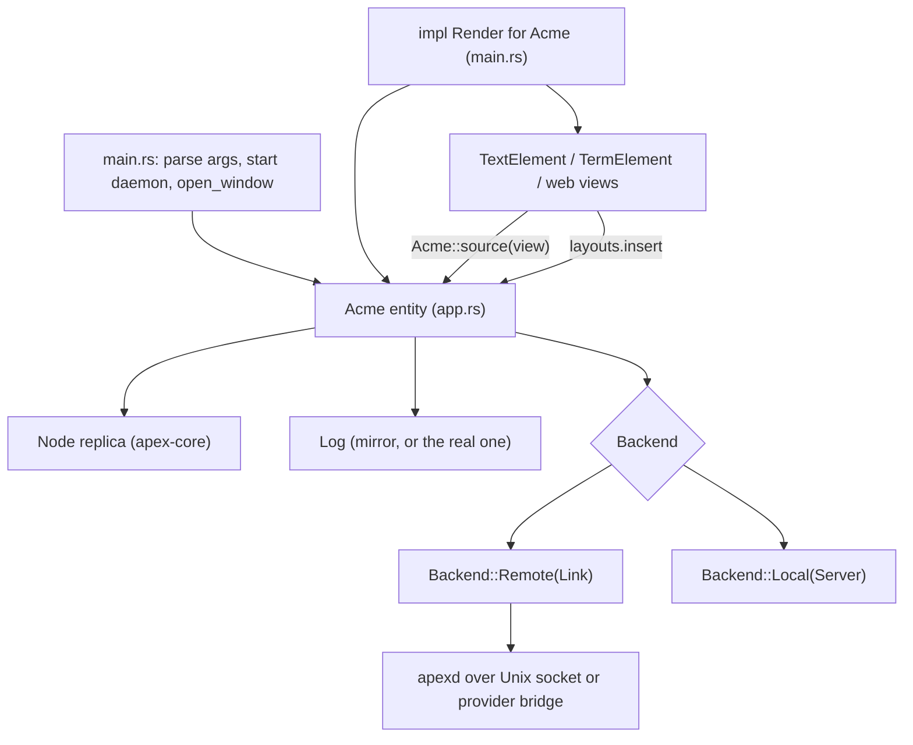
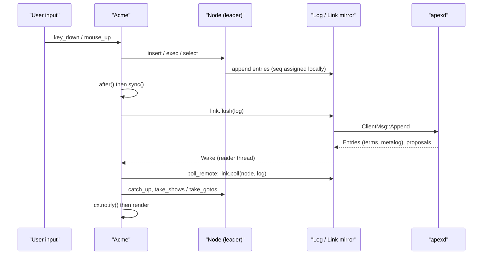
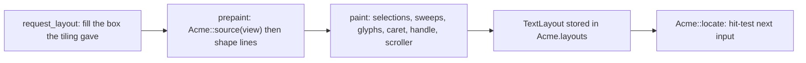

# The UI Client (apex-ui)

`apex-ui` is apex's graphical client. It is a [gpui](https://github.com/zed-industries/zed) application in the `apex-client` crate, and the app bundle runs it. It draws a session's state the way acme draws its screen: columns, windows, tags, bodies, terminals and pages. It turns the mouse and keyboard into log entries. The client is not a thin view. It runs a full `Node` replica and, once it attaches, it takes the leases and becomes the **leader** of the buffer, window and layout shards (see [Sessions, Shards and Leadership](sessions-and-replication.md)). Every edit the user makes is sequenced in the client and shipped to the daemon, not the other way round.

This page covers how the client is put together: the command line and launch in `main.rs`, the `Acme` entity in `app.rs`, the `Backend` that puts the server either behind a socket or in-process, the sync/render loop, and the `TextElement` that paints text straight from core state. Other pages cover the rest: [Mouse, Keyboard and Look](client-input.md) for input, [Pickers and Overlays](client-overlays.md) for overlays, [Sessions, Tabs and Window Chrome](client-chrome.md) for tabs, the sidebar and the title bar, and [Themes, Fonts and Colour](themes-and-fonts.md) for themes. Terminal painting is on [Terminals](terminals.md) and web views are on [The I/O Plane and Pages](io-plane-and-pages.md).

## Architecture at a glance

The crate builds one binary, `apex-ui` (`[[bin]] name = "apex-ui"`). It depends on `apex-core` for state, `Node` and tiling, `apex-server` for `Server`, `Link`, the protocol and providers, and `apex-edit`. It also pulls in gpui from Zed's tree and `wry` for native web views. `main.rs` declares about forty modules. Most of them add to the one `Acme` type with further `impl Acme` blocks.

| Module | Role |
|---|---|
| `main.rs` | Command line, app startup, `open_window`, and `impl Render for Acme`, which builds every frame's element tree |
| `app.rs` | `Acme`, the per-window entity: `Log` + `Node` + `Backend`, input handlers, sync, measurement, execute and look |
| `shell.rs` | The app shell: menus and key bindings, login-shell environment, which sessions to reopen, starting the daemon, the session selector |
| `pool.rs` | Tabs (`TabId`) and parked sessions: links kept attached while not shown |
| `text_element.rs` | `TextElement`, a custom gpui `Element` that shapes and paints a tag, top row or body from core state, and `TextLayout` for hit-testing |
| `term_element.rs` | `TermElement`, the terminal grid painter ([Terminals](terminals.md)) |
| `web.rs`, `webbar.rs` | Native WKWebView placement and page headers ([I/O plane](io-plane-and-pages.md)) |
| `menu.rs`, `look.rs`, `warp.rs`, `cursor.rs` | B4 menu, live Look, pointer warps, cursor styles ([input](client-input.md)) |
| `finder.rs`, `quickopen.rs`, `commands.rs`, `completion.rs`, `tagedit.rs`, `cwdbar.rs`, `field.rs` | Pickers and overlays ([overlays](client-overlays.md)) |
| `sidebar.rs`, `titlebar.rs`, `switcher.rs`, `miniature.rs`, `shelf.rs`, `strips.rs`, `glide.rs`, `toasts.rs`, `attention.rs`, `procs.rs`, `standing.rs`, `restart.rs` | Chrome around the tiled windows ([chrome](client-chrome.md)) |
| `theme.rs`, `fonts.rs`, `contrast.rs` | Palettes, font sets, terminal contrast ([themes](themes-and-fonts.md)) |



Sources: [crates/apex-client/Cargo.toml:1-29](crates/apex-client/Cargo.toml#L1-L29), [crates/apex-client/src/main.rs:1-60](crates/apex-client/src/main.rs#L1-L60), [crates/apex-client/src/app.rs:1-5](crates/apex-client/src/app.rs#L1-L5), [crates/apex-client/README.md:1-23](crates/apex-client/README.md#L1-L23)

## The command line and launch

`main()` parses its arguments by hand ([main.rs:680-706](crates/apex-client/src/main.rs#L680-L706)) into a `Target`, which says where the window's session lives:

| Flag | Effect | `Target` |
|---|---|---|
| *(none)* `[files]` | Attach to the local daemon, starting it if needed. Reopen the last session, else the first existing one, else make `default` | `Url` (from `shell::plan`) |
| `--session S` | That local session | `Url { SessionUrl::local(S) }` |
| `--attach [SOCKET]` | Another daemon socket. A following argument is taken only if it ends in `.sock`, else the default socket is used. Sets `APEX_SOCKET` | (affects socket) |
| `--via CMD` | Speak the protocol over CMD's stdin/stdout | `Via` |
| `--remote DEST` / `--ssh DEST` | A destination through its provider (`user@host`, `provider:name`) | `Url` with provider |
| `--url URL` | A session URL, parsed by `SessionUrl::parse`. A bad one exits with status 2 | `Url` |
| `--local` | Run the `Server` in this process | `Local` |
| `-psn_…` | Ignored (Finder passes it) | — |

A fourth variant, `Target::Choose(why)`, is used when nothing should be reopened: macOS asked not to (`ApplePersistenceIgnoreState`), or the previous launch died before it "settled". `shell::reopen_refused` detects this through a `launching` marker file next to the state file. The marker is written at launch and removed 15 seconds later or on quit ([shell.rs:459-493](crates/apex-client/src/shell.rs#L459-L493)). The window then opens on no session with the session selector up.

Before gpui starts, `shell::adopt_login_shell_environment` runs `$SHELL -l -i -c env` and adopts the result. An app launched from the Finder otherwise gets LaunchServices' bare `PATH`, and the daemon it starts would inherit that too ([shell.rs:318-345](crates/apex-client/src/shell.rs#L318-L345)). Inside `application().run`, `main` installs the Dock icon, cursors, symbol font, font sets, the tab `Pool`, the theme, the menus, the app-level actions (theme, palette, font, Quit, Install CLI) and the key bindings from `shell::bindings()`. Then it picks the target:

- **Local daemon.** `shell::ensure_daemon` lists sessions on the socket. If nothing answers, it spawns `apex` from beside the executable or from `PATH` via `daemon::spawn_server`. A daemon of another build answers with `ErrorKind::Unsupported`. In that case the window still opens and offers a restart (`offer_restart`) instead of starting a second daemon over the first's socket ([shell.rs:527-550](crates/apex-client/src/shell.rs#L527-L550)).
- **`shell::plan`** chooses the session. It takes the URL and frame remembered in `~/Library/Application Support/apex/last-sessions`, else the first session the daemon lists, else it creates `default` ([shell.rs:500-521](crates/apex-client/src/shell.rs#L500-L521)).
- **Remote sessions** are attached only after the window is open. `open_window` makes an offline window that says it is attaching, and `Pool::start` builds the link in the background, because uploading a binary or starting a remote daemon can take a while ([main.rs:845-863](crates/apex-client/src/main.rs#L845-L863)).

apex has one OS window. Every other open session is a tab in it, restored by `Pool::restore`. Quitting saves the open windows (`shell::save_open`), sets `QUITTING`, calls `close_link` on every window so bridges and daemons see the attachment leave, and closes the pool ([main.rs:755-773](crates/apex-client/src/main.rs#L755-L773)). Closing the window, through the red button, `Exit` or `CloseWindow`, *parks* the session in the pool instead of detaching it.

Sources: [crates/apex-client/src/main.rs:666-891](crates/apex-client/src/main.rs#L666-L891), [crates/apex-client/src/shell.rs:258-314](crates/apex-client/src/shell.rs#L258-L314), [crates/apex-client/src/shell.rs:349-550](crates/apex-client/src/shell.rs#L349-L550)

## Opening a window and driving it

`open_window` builds the gpui window with a transparent title bar and `app_owns_titlebar_drag`, since the title bar is apex's own. It then constructs the `Acme` entity according to the target ([main.rs:895-1067](crates/apex-client/src/main.rs#L895-L1067)). The client is woken in two different ways, depending on the backend:

- **In-process (`Target::Local`).** `Acme::new` returns an `UnboundedReceiver<ServerEvent>` along with the `Acme`. A spawned task feeds each event to `Acme::pump`, which hands it to `Server::pump`, performs the resulting proposals and syncs.
- **Over a link (`Url`, `Via`, `Choose`).** The `Link`'s reader thread calls a `Wake` closure, which sends `()` on a futures channel. A task on the UI thread waits on that channel and calls `poll_remote`. It then handles a pending session switch, tells the pool the tab is open and settled, settles the snarf buffer to the clipboard, honours `leave_requested`/`close_requested`, and calls `cx.notify()` to redraw.

`offline_window` makes an `Acme` over a blank in-process session pointed at a URL, with `connected = false` and a `waiting` message. It is used for remote targets before their link exists, for `Choose`, and when a local attach fails (`offline`). A later Reconnect (⌘⇧R) or the picker attaches it for real ([main.rs:1069-1106](crates/apex-client/src/main.rs#L1069-L1106)).

`Acme::over` is the shared constructor. Besides filling in the hundred-odd fields, it starts two timers ([app.rs:1688-1764](crates/apex-client/src/app.rs#L1688-L1764)):

- a **100 ms tick** that polls things gpui cannot report. A native web view keeps pointer moves to itself, so the tick asks the system for the pointer position, and it also checks modifiers for ending ctrl-tab. It drives the caret blink, strips, tabs, link retry (`link_tick`), toasts and the Dock (`attention::tick`), and notifies only when something changed;
- a **heartbeat** every 3 s. `heartbeat` sends `ClientMsg::Ping`. If a pong is more than 8 s overdue, the link is marked disconnected even though the socket has not closed (ssh gone quiet, for example). A pong arriving later marks it connected again and records `ping_ms` ([app.rs:1651-1686](crates/apex-client/src/app.rs#L1651-L1686)).

Sources: [crates/apex-client/src/main.rs:893-1106](crates/apex-client/src/main.rs#L893-L1106), [crates/apex-client/src/app.rs:1651-1764](crates/apex-client/src/app.rs#L1651-L1764)

## The `Acme` entity and the `Backend`

`Acme` is a gpui entity, one per OS window. Its core is three fields:

```rust
pub enum Backend {
    /// In this process, sharing the log.
    Local(Server),
    /// Behind a socket; the log is a mirror.
    Remote(Link),
}

pub struct Acme {
    pub log: Log,
    pub node: Node,
    pub backend: Backend,
    // ... about a hundred more fields of UI state
}
```

The module comment states the design: "Every change goes through the leader node as log entries. The server either runs in-process and shares the log, or sits behind a socket: the client's code path is the same, only the Backend differs." When the user types, `type_text` calls `self.node.insert(&mut self.log, v, s)`. Cut, paste and snarf call `node.cut`, `node.replace_selection` and `node.snarf`, or append `LayoutOp::Snarf` directly ([app.rs:5371-5403](crates/apex-client/src/app.rs#L5371-L5403)). The node sequences the entries into `self.log`. With `Backend::Remote` that log is the `Link`'s mirror, which assigns sequence numbers ahead of the daemon (see [The Attach Protocol](attach-protocol.md)).

| Constructor | Backend | What it does |
|---|---|---|
| `Acme::new` | `Local` | Fresh `Log`, attach as `AttachmentKind::Ui`, `init_session`, `Server::new`, default rules, open the named files (or `.`) through `server.open_file` + `perform` ([app.rs:734-756](crates/apex-client/src/app.rs#L734-L756)) |
| `Acme::attach` | `Remote` | Take a parked session from the pool if there is one, else `connect_targeted`. Files open in the last column ([app.rs:761-786](crates/apex-client/src/app.rs#L761-L786)) |
| `Acme::attach_via` | `Remote` | `--via`: `connect_via`, URL provider `"via"` ([app.rs:1496-1510](crates/apex-client/src/app.rs#L1496-L1510)) |
| `Acme::from_parked` | `Remote` | Rebuild from a `pool::Parked` (link, log, node, pending previews, snarfouts, goto) ([app.rs:790-805](crates/apex-client/src/app.rs#L790-L805)) |
| `Acme::adopt` | `Remote` | Swap a link made elsewhere (the pool's background attach) into an existing window, resetting per-session UI state ([app.rs:1515-1561](crates/apex-client/src/app.rs#L1515-L1561)) |

`connect_link` connects to the local socket with `Link::over_streams_creating`. For a destination it first runs `providers::deploy` and then bridges through the provider's attach command (`remote::bridge_child`). `connect_existing_targeted` does the same with `Link::connect` / `Link::over_streams`, which do not create a session that has gone ([app.rs:1430-1479](crates/apex-client/src/app.rs#L1430-L1479)). Every link goes through `arm`, which sends the theme's terminal colours (`ClientConfig`) and installs this client's own plumbing rules with `mine: true`, so they go when it detaches ([app.rs:1209-1242](crates/apex-client/src/app.rs#L1209-L1242)):

- `https?://\S+` → `RuleAction::Client { verb: "open" }`;
- `Snarfout` for terminals, and for file windows owned by `win-.*` → `Client { verb: "snarfout" }`.

The daemon routes such client rules back to the client as asks. `answer_asks` services them, running `open` (the platform's opener) or `preview`, and replies with `ClientMsg::Applied` ([app.rs:1281-1335](crates/apex-client/src/app.rs#L1281-L1335)).

**Wake targets and parking.** A link's reader thread holds a forwarding closure from `pool::WakeTarget`, and the target behind it can be re-pointed. While the session is shown, the wake goes to the window. `Acme::park` swaps the link, log and node out into a `Parked` value for the pool, puts a blank in-process stand-in in their place, and resets per-session UI caches ([app.rs:811-855](crates/apex-client/src/app.rs#L811-L855), [pool.rs:120-168](crates/apex-client/src/pool.rs#L120-L168)). A parked session keeps its leases. The daemon still forwards tools' proposals to it, and the pool applies them.

**Leadership and fencing.** `fenced()` is true when the backend is remote and the layout shard's lease is held by another attachment or has been released. The window title then reads "watching (another client leads)", and the top row's square shows it ([app.rs:2279-2282](crates/apex-client/src/app.rs#L2279-L2282), [app.rs:1626-1636](crates/apex-client/src/app.rs#L1626-L1636)). `in_process()` tells a real `--local` session apart from the blank stand-in an offline window holds: both are `Backend::Local`, but only the stand-in has a `wake`.

Sources: [crates/apex-client/src/app.rs:381-682](crates/apex-client/src/app.rs#L381-L682), [crates/apex-client/src/app.rs:732-856](crates/apex-client/src/app.rs#L732-L856), [crates/apex-client/src/app.rs:1170-1242](crates/apex-client/src/app.rs#L1170-L1242), [crates/apex-client/src/app.rs:1413-1611](crates/apex-client/src/app.rs#L1413-L1611), [crates/apex-client/src/pool.rs:1-20](crates/apex-client/src/pool.rs#L1-L20)

## Sync: keeping the replica and the wire in step

Three methods move data between the node, the log and the backend.

`after()` runs after a command. In-process, it lets the server do what it was handed: `server.poll_execs` → `perform`, rule walks for B2'd verbs (`plumb_local`), and `close_orphan_terms`. Over a link it only flushes. Then it calls `sync` ([app.rs:2795-2819](crates/apex-client/src/app.rs#L2795-L2819)).

`poll_remote()` handles everything the reader thread has queued ([app.rs:2694-2773](crates/apex-client/src/app.rs#L2694-L2773)):

1. `link.poll(&mut node, &mut log)` applies incoming entries and proposals. It returns false once the link is gone, which sets `link_closed`.
2. It collects OSC 52 clips, completion candidates and session switches, and follows a rename made elsewhere (the metalog's label).
3. It shows windows the link reports as made. Diagnostic windows stay stashed, and their news becomes a toast.
4. It applies acme's `xfidwrite` scroll rule to program output (`take_outputs`): a view follows output if the insertion point was on screen, showing it three quarters down. Output before `iq1` shifts it along.
5. It handles a session ended under it (`leave_requested`), runs `answer_asks` and `page_answers`, then `sync`, and turns an outside `Exit` (`node.quit_requested`) into `close_requested`.

`sync()` runs after every input handler and twice per frame. It drains the node's **effect queues** into client state: `take_shows` into `show_at`, `take_client_finds` (Look in terminals and pages), `take_gotos`, `take_switches`, and a `pending_goto` waiting for its file to open. Then it calls `link.flush(&self.log)` and `node.catch_up(&self.log)`. The comment states the guarantee: "nothing the user typed is ever more than a frame away from the daemon" ([app.rs:1897-1975](crates/apex-client/src/app.rs#L1897-L1975)).



Terminal input goes straight to the backend instead of through entries, because the daemon leads the term shard. `term_key`, `term_type`, `term_paste` and `term_wheel` call the in-process `Server` directly, or send `ClientMsg::TermKey/TermType/TermPaste/TermScroll` ([app.rs:2836-2874](crates/apex-client/src/app.rs#L2836-L2874)). Plumbing from B3 works the same way: `look_at` walks the rules locally with `plumb_local`, or sends `ClientMsg::Plumb` ([app.rs:5540-5555](crates/apex-client/src/app.rs#L5540-L5555)).

Sources: [crates/apex-client/src/app.rs:1897-1975](crates/apex-client/src/app.rs#L1897-L1975), [crates/apex-client/src/app.rs:2680-2874](crates/apex-client/src/app.rs#L2680-L2874), [crates/apex-client/src/app.rs:5533-5555](crates/apex-client/src/app.rs#L5533-L5555)

## Rendering a frame

`impl Render for Acme` lives in `main.rs`, not `app.rs`. Each frame it does the following ([main.rs:67-663](crates/apex-client/src/main.rs#L67-L663)):

1. **Housekeeping.** It advances the overview animation, handles a pending session switch, `leave_requested` and `close_requested` (parking the session and removing the window), and resolves a pending pointer warp against the previous frame's layouts.
2. **`sync(); measure(viewport); sync();`** `measure` gives the tiling this frame's metrics and the OS window's size. Syncing again picks up the entries that produced. Then `schedule_warp` and an updated window title.
3. **Reset per-frame records.** It clears `layouts`, `term_layouts`, `web_bars`, overlay bounds and title marks, then calls `sync_notes` and `sync_pulls`.
4. **The root `div`.** It binds every menu action (Undo → `menu_edit("undo")`, Put → `menu_command("Put")`, tab switching, ⌘P/⌘O/⌘⇧P, Find…) and every mouse and key handler (`key_down`, `mouse_down/up/move` for all buttons including `Navigate` for B4/B5, `mouse_pressure` for force-click B3, `scroll_wheel`).
5. **A waiting tab.** If `waiting` is set, the frame is a spinner and a message with the title bar and selector, and nothing else.
6. **The tiled area.** It walks `glided_layout()`, the replicated `Layout` with glides applied. For each column it draws the ground, the column tag (`TextElement { view: ViewId::ColTag }`), and for each window a "card" inset by `CARD_X`/`CARD_Y`: a tag `TextElement` (or `web_header` for a URL page), then a body chosen by `Body` kind. `Text` gets a `TextElement`, `Term` a `TermElement`, a page a canvas whose prepaint calls `web_place` to position the native WKWebView, and a tool page with no tool running a placeholder. Strips (minimized or stashed columns) get `strip_element`/`minimized_element`. Resize handles go on the lines between windows and between columns.
7. **Overlays.** The drag preview, strip slice, toasts, the B4 menu with its fade-in and blink-then-fade (`RAN`), then the title bar, standing banner, selector, finder, quickopen, command palette, completion, tag overlays, process card, cwd picker, overview and session preview.
8. **The cutter.** It is a deferred, zero-sized canvas painted last. It calls `webs.set_holes` with every overlay's bounds, so the native web views, which sit above everything gpui paints, get holes cut where overlays must show through.

All placement uses the integer rectangles from the replicated layout (`col.r`, `s.r`, `s.body`) through an absolute-positioning helper `at(x, y, w, h, el)`. gpui's flexbox is used only for the chrome. The tiled area is offset by `left()` (the pinned sidebar's `SIDEBAR_W`) and `top()` (`title_h()`, which is the tag line plus `BORDER`, at least 38 px) ([main.rs:1116-1122](crates/apex-client/src/main.rs#L1116-L1122), [app.rs:2652-2678](crates/apex-client/src/app.rs#L2652-L2678)).

### Measuring for the tiling

The tiling in `apex_core::tiling` asks an `Info` trait for font metrics (see [Tiling and Layout](tiling-and-layout.md)). The client supplies `ClientInfo` and installs it each frame as `node.tiling = Box::new(ClientInfo { … })` ([app.rs:114-152](crates/apex-client/src/app.rs#L114-L152), [app.rs:2568-2592](crates/apex-client/src/app.rs#L2568-L2592)). Its numbers come from the previous paint:

- `font`, `row`, `prop`, `mono` are the tag line height, the tag row height, and the proportional and mono body line heights;
- `tags` holds the wrapped line count and trailing newline of each window's tag, as `TextElement` recorded them in `tag_need`. A URL page's header, or a tag with `tagexpand` off, counts as one line;
- `bodies` holds whether each body is mono, its line count from the origin, and whether it is a terminal. Terminals always take `maxlines`.

`measure` then resizes the layout to the viewport. Rows start at `-(font + BORDER)`, because the top row is drawn in the title bar. It calls `node.refit_window` for any window whose tag now wraps to a different number of lines than its slot allows (acme's `winsettag`). If a tag grew or shrank under the pointer, it queues a `Pending::Restore` warp, as acme's `winresize` moves the mouse ([app.rs:2600-2640](crates/apex-client/src/app.rs#L2600-L2640)). The client therefore feeds pixel geometry from its own fonts into replicated `LayoutOp`s. The review's critique of this is below.

Sources: [crates/apex-client/src/main.rs:62-663](crates/apex-client/src/main.rs#L62-L663), [crates/apex-client/src/main.rs:1108-1126](crates/apex-client/src/main.rs#L1108-L1126), [crates/apex-client/src/app.rs:114-152](crates/apex-client/src/app.rs#L114-L152), [crates/apex-client/src/app.rs:2565-2678](crates/apex-client/src/app.rs#L2565-L2678)

## Painting text from core state: `TextElement`

`TextElement { acme: Entity<Acme>, view: ViewId }` is a hand-written gpui `Element`. It does not use gpui's text widgets. It reads the buffer's rope, selection and origin straight out of `node.state` each frame, so there is no separate view model to keep in step. A `ViewId` is one of `Top`, `ColTag(c)`, `Tag(w)` or `Body(w)`, which `app::Kind` mirrors as `Top`, `ColTag`, `WinTag`, `Body` ([app.rs:33-50](crates/apex-client/src/app.rs#L33-L50)).



**`request_layout`** fills the box it is given ("acme's tiling decides every rectangle"). The top row is measured instead, from its process pills plus text ([text_element.rs:1591-1643](crates/apex-client/src/text_element.rs#L1591-L1643)).

**`Acme::source(view)`** gathers everything the element needs into a `Source` ([app.rs:2878-3033](crates/apex-client/src/app.rs#L2878-L3033), [text_element.rs:1179-1249](crates/apex-client/src/text_element.rs#L1179-L1249)):

- the `Text` (a cheap rope clone), `sel` `(q0, q1)` and `origin` from the buffer's view;
- window flags: `mono`, `dirty` (`node.window_unsaved`), `stale`, `live` (a terminal, page or win window), `pulse` (a page loading, or the window "working") and `progress`;
- interaction: `hl` (a sweep in progress, B2 `Exec` or B3 `Look`), `ran` (what B2 just ran, fading per `ran_fade`), `hint` (what a ⌘/⌥-click would take), Look `marks` and `strike`, `key_caret` (the blinking blue caret of the view the keys go to), `hovered`;
- for tags, `head`: a `Head` built by `tag_head`. It is the window's path split into folder atoms and a name, an optional label, and the verbs as icons. None of it is part of the tag's text;
- scrolling: `shift` (trackpad pixel scroll from `Smooth`), `want_visible` and `show_at` (acme's `textshow`, consumed when read).

A view in a strip column gets an empty `Source`, so no text is laid out at zero width.

**`prepaint`** shapes the lines with `shape()` ([text_element.rs:1401-1570](crates/apex-client/src/text_element.rs#L1401-L1570)). `shape` expands tabs to `TABSTOP` (4), keeps a display-byte → rune map, prepends the tag head, and cuts the line into `TextRun`s wherever ink or face changes. Those changes include the sweep, the selection, head atoms, the verb icon cells (set in `.SystemUIFont` so an em is an em), and the name set in a medium weight. Then gpui's `shape_text` shapes it with an optional wrap width. The result is a `LineInfo` with its wrapped sub-rows.

- **Tags** are shaped line by line. The wrapped row count goes into `tag_need`, which `measure` reads on the next frame. A window path that alone makes a one-line tag wrap is shortened by eliding leading folders (`shortened`). The top row and column tags do not wrap. They scroll sideways to keep the caret in view (`tag_scroll`), with fades at the cut edges.
- **Bodies** follow acme's frame. Drawing starts from `origin`, which may fall mid-line: the first line is shaped whole and shifted up by the rows above the origin. Rows are added down to the bottom of the box. In a second pass, if `show_at` or `want_visible` asks for a position that is not fully on screen, `top_for` picks a new top row: the position at the top if it was above, else half-way down, or `quarters`/4 down for `show_at`. It counts wrapped rows, not lines, and the origin is written back with `set_origin`. Prepaint also records a screen of `rows` above the top so scrolling can step by visual rows, and `shown`, the rune range that sets the scrollbar thumb ([text_element.rs:1645-1861](crates/apex-client/src/text_element.rs#L1645-L1861)).

**`paint`** draws selections, sweeps, glyphs, the caret, the window's handle "dot" (dirty, stale, live, notification ping, progress) and the overlay scroller. Last, it stores a `TextLayout` in `acme.layouts[view]` ([text_element.rs:2242-2259](crates/apex-client/src/text_element.rs#L2242-L2259)).

`TextLayout` is how input finds its way back to runes. `offset_at(pos)` maps a point to a rune offset through gpui's `closest_index_for_position` and the display map. `point_of(off)` goes the other way. `row_from` steps the origin by rows, `atom_at` and `atom_bounds` hit-test the tag head, and `scrollbar`/`layout_box` are the left lane's regions ([text_element.rs:785-903](crates/apex-client/src/text_element.rs#L785-L903)). `Acme::locate(pos)` checks web scrollbars, then `term_layouts`, then `layouts`, and returns a `(Target, Region)` such as `Region::Text(offset)`, `Atom`, `Scrollbar` or `LayoutBox`. Overlays and the stash preview mask what lies under them ([app.rs:3094-3138](crates/apex-client/src/app.rs#L3094-L3138)). Input therefore always hit-tests against what was actually painted in the last frame.

Sources: [crates/apex-client/src/text_element.rs:738-903](crates/apex-client/src/text_element.rs#L738-L903), [crates/apex-client/src/text_element.rs:1150-1861](crates/apex-client/src/text_element.rs#L1150-L1861), [crates/apex-client/src/text_element.rs:2238-2261](crates/apex-client/src/text_element.rs#L2238-L2261), [crates/apex-client/src/app.rs:2876-3138](crates/apex-client/src/app.rs#L2876-L3138)

## What the client handles itself

Most commands go through `node.exec`, which makes Exec entries that the server or tools can see and claim (see [The Node](node.md)). `Acme::execute` intercepts some words first and handles them locally ([app.rs:5422-5531](crates/apex-client/src/app.rs#L5422-L5531)):

| Word | Handled by the client because… |
|---|---|
| `End` (`-f`) | Checks `node.session_clean`, then ends the session through `end_session` |
| `Send` in a terminal | The terminal selection is client-side (`term_sel`). Its text is typed into the pty |
| A page's own verbs (`page_verbs` in the HTML head, e.g. apex diff's Prev/Next) | Run inside the web view (`webs.verb`) |
| `Back`/`Fwd`/`Get` in an unowned URL page | The page's own history and reload (`page_nav`) |
| `Snarf` in a terminal | Copies the client-side terminal selection |
| `Paste` | Syncs the system clipboard into the snarf buffer before exec |

After `node.exec`, `Cut` and `Snarf` copy the snarf buffer to the system clipboard. An `Executed::Quit` quits the app in-process, or parks and closes the window over a link. Other client-side state that never reaches the log includes `iq1` and `typed_start` (Home/End and Escape targets), the terminal selection and sweeps, `Smooth` trackpad scrolling between whole lines, glides, the caret blink, hover and hint state, and the per-window seen-state for notifications and toasts. ⌘F/⌘G and live Look search locally (`look.rs`) and select through the node.

Errors go to `+Errors` windows instead of dialogs. `notice` and `report` call `node.errors` ([app.rs:5407-5420](crates/apex-client/src/app.rs#L5407-L5420)). If an attach fails, the window stays open, offline, with `connect_error`'s text, and a daemon of another build gets a "Reconnect (⌘⇧R)" hint ([app.rs:1597-1605](crates/apex-client/src/app.rs#L1597-L1605)). `reconnect` closes the stuck link and lets the pool attach again ([app.rs:1581-1595](crates/apex-client/src/app.rs#L1581-L1595)).

Sources: [crates/apex-client/src/app.rs:5405-5531](crates/apex-client/src/app.rs#L5405-L5531), [crates/apex-client/src/app.rs:1581-1605](crates/apex-client/src/app.rs#L1581-L1605), [crates/apex-client/src/app.rs:536-682](crates/apex-client/src/app.rs#L536-L682)

## The review's notes

ARCHITECTURE.md, the October 2026 review, is critical of the client's shape. Its line references predate later growth; `app.rs` is now nearly 6,000 lines.

- **`app.rs` is too big.** The review counts "5,600 lines, about 100 fields" and proposes splitting it into session, input, scroll, terminal, notes, client verbs, exec, view model and overlay modules. It also calls for one `ListPicker`, one overlay state instead of 14 `Option` fields, one blink clock, one navigation path and one window title.
- **Editing rules live in the client.** `text_key` implements autoindent, ^A/^E, Home/End via `iq1` and Escape via `typed_start`, which are lost when another client takes over. `is_alnum`/`is_file_char`/`expand` copy the core's. The review suggests a `Node::key(view, Key)`.
- **Commands bypass the log.** The intercepts in `execute`, and ⌘F/⌘G, make no Exec entry, so tools cannot see or claim them. The review suggests registering them as client rules, as `Snarfout` already is.
- **`Backend::Local` is a second engine.** It copies the daemon's orchestration, has drifted from it (it lacks tools, profile, the I/O plane, and the "loop until settled"), and accounts for about 24 Local/Remote branches. The review's plan is to delete it and run the daemon in-process over a socket pair, since `Link::over_streams` takes any byte streams.
- **Pixel layout is replicated.** Because the client installs its own `ClientInfo`, a second UI with other fonts receives geometry measured by whichever node led last. The plan's item 7 is to replicate logical layout and let each client tile with its own metrics. That reverses a deliberate choice, discussed on [Tiling and Layout](tiling-and-layout.md).
- **Layout policy runs during render.** `diagnostic_news` is called from `sync()`, twice a frame, and diffs whole diagnostic texts. The review suggests driving toasts from `take_outputs`.

Sources: [ARCHITECTURE.md:279-331](ARCHITECTURE.md#L279-L331), [ARCHITECTURE.md:342-354](ARCHITECTURE.md#L342-L354), [ARCHITECTURE.md:417-459](ARCHITECTURE.md#L417-L459), [ARCHITECTURE.md:536-548](ARCHITECTURE.md#L536-L548), [ARCHITECTURE.md:900-935](ARCHITECTURE.md#L900-L935)
