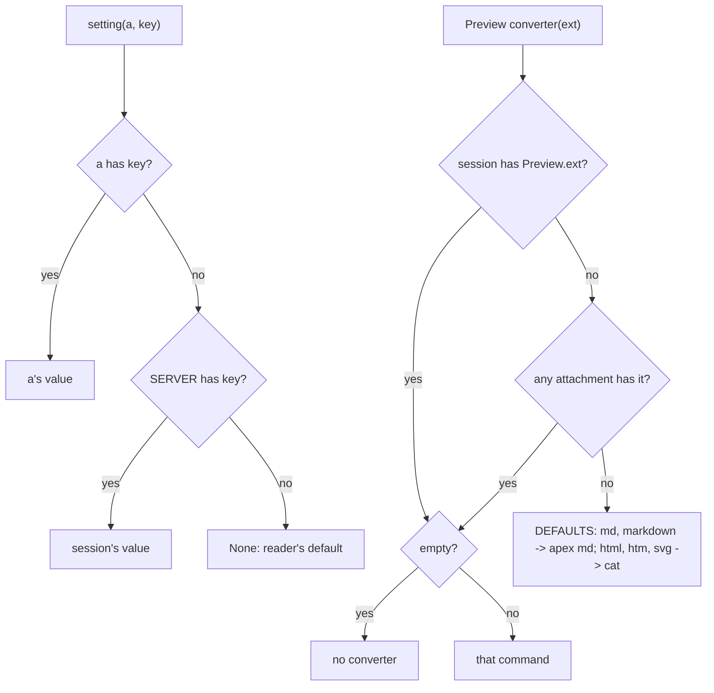

# Configuration: Profile, Attach and Settings

apex has no configuration file. Like acme, it is configured with scripts that run commands. A session is set up by a shell script on the host, the **profile**. Each UI's per-attachment changes come from a second script, the **attach** script, which also runs on the host. Both scripts use the [apex command](cli.md) to act on the session they belong to. Two commands hold the state that outlives the scripts. `apex env` keeps the **session environment**, which every later terminal and command inherits. `apex set` keeps **settings**: replicated key/value pairs owned by the session or by one attachment, read by tools such as Preview and the language-server tool.

This page covers what runs when, what each script can change, how the environment and settings are stored and looked up, and which variables apex itself puts into commands' environments. The daemon around these scripts is described on [The Daemon (apexd)](daemon.md). The rule table that profiles often fill is on [Plumbing Rules and Verbs](plumbing.md). The tools that read settings are on [Preview, Web and Diff Tools](tool-pages.md) and [win and Language Servers](tool-win-and-lsp.md).

## The two scripts

| Script | Where it lives | Where it runs | When | Runs as | Typical use |
|---|---|---|---|---|---|
| `~/.apex/profile` | the daemon's host | the host, in the session's directory | once, when a session is made | process `profile`, output to `+Errors` | `apex open`, `apex exec Newcol`, `apex plumb rule add`, `apex tool lsp &`, `apex set …`, exporting variables |
| `~/.apex/attach` | the machine running the UI | the session's host (the text is shipped) | each time that UI attaches | process `attach`, output to `+Errors`, with `$apexattachment` | `apex set` for this client only |

The `apex help scripts` topic describes the split this way: the host's profile is "the session's setup on the machine running the daemon", and the client's attach script is "its own per attachment, the UI's tweaks". When client and daemon are on the same machine, both files sit in the same `~/.apex`, and each runs once in its own role ([crates/apex-cli/src/main.rs:616-636](crates/apex-cli/src/main.rs#L616-L636)). In the app, the Profile menu action runs `New ~/.apex/profile`, which opens the host's profile, or makes it if it does not exist ([crates/apex-client/src/main.rs:162-163](crates/apex-client/src/main.rs#L162-L163)).

```mermaid
sequenceDiagram
    participant C as "apex new-session / daemon start"
    participant D as "Daemon"
    participant S as "Server (per session)"
    participant P as "rc: profile"
    participant U as "UI (apex-ui)"
    participant A as "rc: attach"
    C->>D: NewSession name, dir
    D->>S: Server::new, env = apexsession, apexsessionlabel, APEX_SOCKET, EDITOR, BROWSER
    D->>S: install_default_rules, init_session, Cwd
    D->>S: run_profile(host_profile)
    S->>P: rc -c "fn sigexit {apex env -import}; . ~/.apex/profile"
    P->>D: apex open / apex set / apex plumb rule add ...
    P-->>D: on exit: EnvImport vars
    D->>S: import_env(vars)
    U->>D: Hello kind=Ui, attach=Script(client, text of ~/.apex/attach)
    D->>U: Welcome
    D->>S: run_attach(attachment, script)
    S->>A: rc -c text, with apexattachment, apexclient
    A->>D: apex set KEY VALUE (owner = this attachment)
```

Sources: [crates/apex-cli/src/main.rs:616-636](crates/apex-cli/src/main.rs#L616-L636), [crates/apex-server/src/daemon.rs:343-401](crates/apex-server/src/daemon.rs#L343-L401), [crates/apex-server/src/daemon.rs:588-642](crates/apex-server/src/daemon.rs#L588-L642), [crates/apex-client/src/main.rs:162-163](crates/apex-client/src/main.rs#L162-L163)

## The profile

### Where it comes from

`Daemon::run` takes the profile path from `$HOME/.apex/profile` on the daemon's host. Tests call `Daemon::run_with` instead and pass a path, so the real `$HOME` is never touched ([crates/apex-server/src/daemon.rs:241-247](crates/apex-server/src/daemon.rs#L241-L247)). `new_session_in` builds the session in this order:

1. It creates the log and the `Server`, and runs `cd` to the requested directory if one was given.
2. It sets the session's base environment (see [Variables apex sets](#variables-apex-sets)).
3. It installs the default plumbing rules, lays out the session, and records the host and directory.
4. Last, it calls `s.server.run_profile(&s.view, self.host_profile.as_deref())` ([crates/apex-server/src/daemon.rs:343-401](crates/apex-server/src/daemon.rs#L343-L401)).

Because the profile runs last, everything it does (opening windows, adding rules) lands on a session that is already laid out. A UI that attaches later sees the result, even if the profile ran with no UI connected.

### How it runs

`Server::run_profile` returns at once if the file does not exist. Otherwise it builds a script that sources the profile with `. 'PATH'`. It runs that script in the session's directory through `spawn_shell_as("profile", ExecCtx::Top, …, ShellMode::Errors { dir: None }, env)`, so the profile is a process named `profile` in the top row and in `apex ps`, and its output goes to `+Errors` ([crates/apex-server/src/lib.rs:1159-1179](crates/apex-server/src/lib.rs#L1159-L1179)). The shell is `command_shell()`: `$acmeshell` if it is set; otherwise an `rc` found beside the binary, in a dev tree's `target/rc-host/bin`, or in `~/.apex/bin`; otherwise `rc` on the PATH; otherwise `sh` ([crates/apex-server/src/lib.rs:1926-1964](crates/apex-server/src/lib.rs#L1926-L1964)). This means the profile is normally an rc script, and [examples/profile](examples/profile) is written in rc.

The processes `profile` and `attach` are marked `ProcKind::Script`, and their `Running` records are flagged `script` ([crates/apex-server/src/lib.rs:1139](crates/apex-server/src/lib.rs#L1139), [crates/apex-server/src/lib.rs:2126-2127](crates/apex-server/src/lib.rs#L2126-L2127)). If a script starts a program in the background and that program announces itself (`ClientMsg::Named`), the session adopts it. `apex tool lsp &` in a profile therefore appears as `lsp` in `apex ps` once the profile has exited ([crates/apex-server/src/lib.rs:91-94](crates/apex-server/src/lib.rs#L91-L94), [crates/apex-server/src/proto.rs:199-203](crates/apex-server/src/proto.rs#L199-L203)). The process counts as finished when the shell exits, not when its pipes close, so a background child that holds the pipes does not keep `profile` alive ([crates/apex-server/src/lib.rs:2134-2136](crates/apex-server/src/lib.rs#L2134-L2136)). The test at [crates/apex-cli/tests/cli.rs:1169-1187](crates/apex-cli/tests/cli.rs#L1169-L1187) checks this.

### The profile's environment becomes the session's

Exported variables normally disappear when the script that set them exits. The profile is an exception: its environment when it ends becomes the session's. `run_profile` puts an exit hook in front of the sourced file. Under rc the hook is `fn sigexit { apex env -import }`; under any other shell it is `trap 'apex env -import' EXIT`. Before spawning, it also records the full environment the profile was given as `profile_base` ([crates/apex-server/src/lib.rs:1166-1177](crates/apex-server/src/lib.rs#L1166-L1177)).

`apex env -import` sends its whole environment as `ClientMsg::EnvImport`. The daemon passes it to `Server::import_env` ([crates/apex-server/src/daemon.rs:723-727](crates/apex-server/src/daemon.rs#L723-L727)), which compares it with the base:

```rust
pub fn import_env(&mut self, vars: Vec<(String, String)>) {
    let base = self.profile_base.take().unwrap_or_else(|| child_env(&self.env));
    for (k, v) in &vars {
        if SHELL_OWN.contains(&k.as_str()) { continue; }
        if base.iter().find(|(b, _)| b == k).map(|(_, bv)| bv) != Some(v) {
            self.set_env(k, v);
        }
    }
    for (k, _) in &base {
        if !vars.iter().any(|(n, _)| n == k) { self.env.retain(|(n, _)| n != k); }
    }
}
```

([crates/apex-server/src/lib.rs:1193-1212](crates/apex-server/src/lib.rs#L1193-L1212))

Variables that are new or changed are set. Variables in the base that the script dropped are removed from the session's additions. Variables the shell keeps for itself (`SHELL_OWN`: rc's `pid`, `status`, `path`, `prompt`, `home` and others, plus sh's `PWD`, `OLDPWD`, `SHLVL`, `_`) are ignored ([crates/apex-server/src/lib.rs:1966-1968](crates/apex-server/src/lib.rs#L1966-L1968)). rc exports its functions as `fn#NAME` variables, so a function the profile defines also reaches later commands. The test `the_profiles_environment_at_its_end_is_the_sessions` shows the whole behaviour. It uses `FOO=bar`, a list `x=(a b)` (stored as `a\u{1}b`), `fn g {…}`, and `EDITOR=()`. Afterwards `apex env` shows `FOO`, `x` and `fn#g`, shows no `EDITOR`, and a later `apex exec 'g there'` prints `hi there` ([crates/apex-cli/tests/cli.rs:1198-1227](crates/apex-cli/tests/cli.rs#L1198-L1227)).

`profile_base` is taken with `take()`, so only the first import is measured against the profile's own starting environment. Any later `apex env -import`, from a terminal for example, is compared with `child_env(&self.env)`: the daemon's process environment (minus `acmeaddr`, `winid`, `%`, `samfile`) with the session's additions on top ([crates/apex-server/src/lib.rs:1970-1981](crates/apex-server/src/lib.rs#L1970-L1981)). Everything the caller's environment has beyond that is imported, including its own `$winid`. A profile that defines its own `sigexit` replaces the hook and gives up the import. The help text warns about this ([crates/apex-cli/src/main.rs:630-631](crates/apex-cli/src/main.rs#L630-L631)).

Sources: [crates/apex-server/src/lib.rs:1159-1212](crates/apex-server/src/lib.rs#L1159-L1212), [crates/apex-server/src/lib.rs:1926-1981](crates/apex-server/src/lib.rs#L1926-L1981), [crates/apex-server/src/daemon.rs:241-247](crates/apex-server/src/daemon.rs#L241-L247), [crates/apex-server/src/daemon.rs:723-727](crates/apex-server/src/daemon.rs#L723-L727), [crates/apex-cli/tests/cli.rs:184-246](crates/apex-cli/tests/cli.rs#L184-L246), [crates/apex-cli/tests/cli.rs:1198-1227](crates/apex-cli/tests/cli.rs#L1198-L1227)

## The attach script

A UI reads its own `~/.apex/attach` through `remote::local_attach()`. The result is a `Script { client, text }`, where `client` is this machine's name (`term::sysname()`) and `text` is the file's contents. The script is sent only for `AttachmentKind::Ui` attachments; tools and CLI commands never send one ([crates/apex-server/src/remote.rs:187](crates/apex-server/src/remote.rs#L187), [crates/apex-server/src/remote.rs:202](crates/apex-server/src/remote.rs#L202), [crates/apex-server/src/remote.rs:661-671](crates/apex-server/src/remote.rs#L661-L671), [crates/apex-server/src/proto.rs:278-284](crates/apex-server/src/proto.rs#L278-L284)). The script travels in `ClientMsg::Hello`. A remote UI's attach script is therefore read on the laptop and run on the remote host.

In `Daemon::hello`, after the attachment is recorded, any leases are granted and `Welcome` has been sent, the daemon calls `run_attach` ([crates/apex-server/src/daemon.rs:635-639](crates/apex-server/src/daemon.rs#L635-L639)). `Server::run_attach` does nothing for an empty script. Otherwise it runs the text as a process named `attach` in the session's directory, with its output in `+Errors`. On top of the usual command environment it adds `apexattachment` (the attachment's id) and `apexclient` (the client's machine name) ([crates/apex-server/src/lib.rs:1214-1230](crates/apex-server/src/lib.rs#L1214-L1230)). `apex set` reads `$apexattachment`, which is how a setting from this script becomes the client's own (see the next section). The attach script gets no exit hook, so its environment is not imported into the session.

Sources: [crates/apex-server/src/remote.rs:187-203](crates/apex-server/src/remote.rs#L187-L203), [crates/apex-server/src/remote.rs:661-671](crates/apex-server/src/remote.rs#L661-L671), [crates/apex-server/src/daemon.rs:588-642](crates/apex-server/src/daemon.rs#L588-L642), [crates/apex-server/src/lib.rs:1214-1230](crates/apex-server/src/lib.rs#L1214-L1230)

## The session environment: `apex env`

The daemon holds each session's environment additions in `Server::env: Vec<(String, String)>`: "what every shell and command gets in its environment beyond acme's own" ([crates/apex-server/src/lib.rs:111-114](crates/apex-server/src/lib.rs#L111-L114)). This environment is not replicated state. It lives only in the session's `Server` in the daemon, and the only ways to reach it are two protocol messages:

| Message | Sent by | Effect | Reply |
|---|---|---|---|
| `Env { set }` | `apex env [KEY=VALUE…]` | `set_env` for each pair; an empty list only asks | `ServerMsg::Env { vars }`, the whole `Server::env` |
| `EnvImport { vars }` | `apex env -import` | `import_env(vars)`, as above | the same |

([crates/apex-server/src/proto.rs:163-170](crates/apex-server/src/proto.rs#L163-L170), [crates/apex-server/src/daemon.rs:716-727](crates/apex-server/src/daemon.rs#L716-L727))

`env_cmd` in the CLI turns each argument into a pair, and rejects an argument without `=` with "not KEY=VALUE". `-import` combined with arguments is an error. The command prints the environment only when called with no arguments and without `-import` ([crates/apex-cli/src/main.rs:1896-1921](crates/apex-cli/src/main.rs#L1896-L1921)). What it prints is the session's additions, not the daemon's whole environment. There is no `apex env` form that unsets a single variable. A variable is dropped only by an import that leaves it out.

Changes apply only to processes started afterwards: B2 commands, terminals, `Win`, and tools started by rules. Processes already running keep their environment. `set_env` replaces an existing key in place, otherwise appends ([crates/apex-server/src/lib.rs:1150-1157](crates/apex-server/src/lib.rs#L1150-L1157)). Renaming a session also updates `apexsessionlabel` this way ([crates/apex-server/src/daemon.rs:420-421](crates/apex-server/src/daemon.rs#L420-L421)).

Sources: [crates/apex-server/src/lib.rs:111-121](crates/apex-server/src/lib.rs#L111-L121), [crates/apex-server/src/lib.rs:1150-1157](crates/apex-server/src/lib.rs#L1150-L1157), [crates/apex-server/src/proto.rs:163-170](crates/apex-server/src/proto.rs#L163-L170), [crates/apex-server/src/remote.rs:1002-1011](crates/apex-server/src/remote.rs#L1002-L1011), [crates/apex-cli/src/main.rs:405-414](crates/apex-cli/src/main.rs#L405-L414), [crates/apex-cli/src/main.rs:1896-1921](crates/apex-cli/src/main.rs#L1896-L1921)

## Settings: `apex set`

### Storage

The environment lives only in the daemon. Settings, by contrast, are replicated: they are part of the metalog in `Meta`, keyed by owner ([crates/apex-core/src/state.rs:409-411](crates/apex-core/src/state.rs#L409-L411)):

```rust
/// Settings by owner: the session's under `SERVER`, an attachment's
/// under its id (gone when it detaches).
pub settings: BTreeMap<AttachmentId, BTreeMap<String, String>>,
```

Two metalog operations change them. `MetaOp::Set { owner, key, value }` inserts or overwrites. `MetaOp::Unset { owner, key }` removes a key and drops the owner's map once it is empty. `MetaOp::Detach` removes everything the detaching attachment owned ([crates/apex-core/src/state.rs:828-832](crates/apex-core/src/state.rs#L828-L832), [crates/apex-core/src/state.rs:855-857](crates/apex-core/src/state.rs#L855-L857), [crates/apex-core/src/state.rs:890-897](crates/apex-core/src/state.rs#L890-L897)). `Log::set` and `Log::unset` append them ([crates/apex-core/src/log.rs:301-307](crates/apex-core/src/log.rs#L301-L307)). Since settings are metalog entries, every replica can read them locally: the UI, each tool, each CLI command. Nobody needs to ask the daemon.

### Writing

`apex set KEY VALUE` sends `ClientMsg::Set { key, value, attachment }`. `attachment` is parsed from `$apexattachment` when that variable is set, which in practice means inside an attach script ([crates/apex-cli/src/main.rs:1923-1947](crates/apex-cli/src/main.rs#L1923-L1947)). The daemon checks that the named attachment exists and replies `set: no attachment N` if it does not. With no attachment named, the owner is `SERVER`, i.e. the session. The daemon then appends `MetaOp::Set` ([crates/apex-server/src/daemon.rs:842-853](crates/apex-server/src/daemon.rs#L842-L853)). The same command therefore records a session setting when run from the profile or a terminal, and a client setting when run from that client's attach script. Tools built on the SDK call `Tool::set`, which always writes the session's setting ([crates/apex-tool/src/lib.rs:1116-1118](crates/apex-tool/src/lib.rs#L1116-L1118)).

The CLI has no unset. `Log::unset` exists, but no `apex` subcommand calls it. To turn a converter off, set an empty value (see below).

`apex set` with no arguments reads the local replica and prints `OWNER\tKEY\tVALUE` lines. The owner is shown as `session`, or as `name(aN)` for an attachment.

### Reading

`Meta::setting(a, key)` is the lookup most readers use: the attachment's own value first, then the session's ([crates/apex-core/src/state.rs:474-479](crates/apex-core/src/state.rs#L474-L479)).



The Preview tool does not use `Meta::setting`. Its `converter` looks at the session's value first, then any attachment's in id order, so an attach script's converter works for the whole session. It falls back to `DEFAULTS` last, and an empty value at any of those levels means "no converter" ([crates/apex-tool-preview/src/converters.rs:12-37](crates/apex-tool-preview/src/converters.rs#L12-L37)). `exts` collects every extension with a converter, which is how the tool knows which files to offer Preview on.

Sources: [crates/apex-core/src/state.rs:409-411](crates/apex-core/src/state.rs#L409-L411), [crates/apex-core/src/state.rs:474-479](crates/apex-core/src/state.rs#L474-L479), [crates/apex-core/src/state.rs:828-897](crates/apex-core/src/state.rs#L828-L897), [crates/apex-core/src/log.rs:301-307](crates/apex-core/src/log.rs#L301-L307), [crates/apex-server/src/daemon.rs:842-853](crates/apex-server/src/daemon.rs#L842-L853), [crates/apex-cli/src/main.rs:1923-1947](crates/apex-cli/src/main.rs#L1923-L1947), [crates/apex-tool-preview/src/converters.rs:12-37](crates/apex-tool-preview/src/converters.rs#L12-L37)

### Settings in use

| Key | Read by | How it is looked up | Meaning and default |
|---|---|---|---|
| `Preview.EXT` | `apex tool preview` (`converters::converter`) | session, then any attachment, then defaults | A command that reads the file on stdin and writes HTML. `md`/`markdown` default to `apex md`; `html`/`htm`/`svg` to `cat`. An empty value turns one off. |
| `Preview.EXT`, then `Preview` | the UI's `preview_app`, for a rule with `-client=preview` | `Meta::setting(me, …)` | The app that previews the file on the UI's machine; with neither set, the platform's own previewer |
| `Preview.md` | `apex tool agent`'s pages | the tool's `setting` | The Markdown converter; defaults to `apex md` |
| `lsp.LANG` | `apex tool lsp` | `Meta::setting(tool, …)` | The server command for `go`, `rust`, `python`, `typescript` or `c`; defaults to `gopls`, `rust-analyzer`, `pyright-langserver --stdio`, `typescript-language-server --stdio`, `clangd` |
| `lsp.LANG.root`, then `lsp.root` | `apex tool lsp` | the same | A workspace-root marker that takes precedence over the language's built-in markers |
| `Newterm.shell` | `Newterm`, `apex term new` | the session's only (`setting(SERVER, …)`) | The shell a terminal runs; otherwise the daemon's `$SHELL`, otherwise `/bin/sh` |
| `Newterm.scrollback` | new terminals | the session's only | Lines of history kept; `DEFAULT_SCROLLBACK` is 10000 |

The `apex help set` text does not list `Newterm.scrollback`; it is documented under `apex help term`. Because both `Newterm` keys are read with `SERVER` as the attachment, setting them from an attach script has no effect.

Sources: [crates/apex-cli/src/main.rs:415-432](crates/apex-cli/src/main.rs#L415-L432), [crates/apex-cli/src/main.rs:315-325](crates/apex-cli/src/main.rs#L315-L325), [crates/apex-client/src/app.rs:1404-1411](crates/apex-client/src/app.rs#L1404-L1411), [crates/apex-tool-agent/src/page.rs:33](crates/apex-tool-agent/src/page.rs#L33), [crates/apex-tool-lsp/src/lib.rs:58-62](crates/apex-tool-lsp/src/lib.rs#L58-L62), [crates/apex-tool-lsp/src/lib.rs:458-460](crates/apex-tool-lsp/src/lib.rs#L458-L460), [crates/apex-tool-lsp/src/lib.rs:574-581](crates/apex-tool-lsp/src/lib.rs#L574-L581), [crates/apex-server/src/lib.rs:1069-1074](crates/apex-server/src/lib.rs#L1069-L1074), [crates/apex-server/src/lib.rs:1993-1999](crates/apex-server/src/lib.rs#L1993-L1999), [crates/apex-server/src/pty.rs:198-206](crates/apex-server/src/pty.rs#L198-L206)

## Variables apex sets

A command's environment is built in layers:

1. **The daemon's process environment.** At startup, `put_apex_on_path` puts `~/.apex/bin` and the binary's own directory (the app bundle's, for example) at the front of `PATH`, so that `apex` and `rc` resolve inside commands ([crates/apex-server/src/daemon.rs:81-99](crates/apex-server/src/daemon.rs#L81-L99)).
2. **acme's per-command variables** (`command_env`): `winid` (the window, or `0` in the top row) and, for a window on a file, `%` and `samfile` naming it. Before spawning, `acmeaddr`, `winid`, `%` and `samfile` are first removed from the inherited environment, as acme's `runproc` does ([crates/apex-server/src/lib.rs:2001-2027](crates/apex-server/src/lib.rs#L2001-L2027), [crates/apex-server/src/lib.rs:2094-2101](crates/apex-server/src/lib.rs#L2094-L2101)).
3. **The session's `Server::env`**, appended after those. `new_session_in` seeds it with the variables below; `apex env` and the profile's import add to it later ([crates/apex-server/src/daemon.rs:357-369](crates/apex-server/src/daemon.rs#L357-L369)).
4. **Script-only extras**: `apexattachment` and `apexclient` for the attach script.

| Variable | Set for | Value |
|---|---|---|
| `apexsession` | everything in the session | the session's identity (a UUID-like key) |
| `apexsessionlabel` | everything | its label; updated on rename |
| `APEX_SOCKET` | everything | the daemon's socket, so a bare `apex` works on this session |
| `EDITOR` | everything, unless removed | `apex-editor`, a symlink to `apex` beside the binary that runs `apex editor`; falls back to `PATH/apex editor` (two words) if the link cannot be made |
| `BROWSER` | everything, if the link exists | the `xdg-open` symlink beside the binary, which plumbs its argument |
| `winid`, `%`, `samfile` | B2 commands and scripts | acme's names for the window and its file |
| `winid` | terminals | the terminal's window ([crates/apex-server/src/lib.rs:389-393](crates/apex-server/src/lib.rs#L389-L393)) |
| `TERM`, `COLORTERM`, `TERM_PROGRAM=apex`, `TERM_FEATURES` | terminals (`pty::setup_env` also puts them in the daemon's own environment) | xterm-256color with truecolor; rc's rcmain checks `$TERM_PROGRAM` |
| `apexattachment`, `apexclient` | the attach script only | the attachment id and the client machine's name |

`editor_command` and `link_beside` create the symlinks the first time they are needed, but only when the running binary is named `apex`. A test binary's directory is left alone ([crates/apex-server/src/daemon.rs:1600-1628](crates/apex-server/src/daemon.rs#L1600-L1628)). `EDITOR` is a single word because zsh and rc do not split `$EDITOR` into words. A profile that unsets it, for example with `EDITOR=()`, removes it from the session, as the test above checks.

Terminals get the session's `env` plus `winid` on top of their own variables ([crates/apex-server/src/term.rs:253-282](crates/apex-server/src/term.rs#L253-L282)). They do not get `%` or `samfile`.

Sources: [crates/apex-server/src/daemon.rs:81-99](crates/apex-server/src/daemon.rs#L81-L99), [crates/apex-server/src/daemon.rs:357-369](crates/apex-server/src/daemon.rs#L357-L369), [crates/apex-server/src/daemon.rs:1600-1628](crates/apex-server/src/daemon.rs#L1600-L1628), [crates/apex-server/src/lib.rs:2001-2027](crates/apex-server/src/lib.rs#L2001-L2027), [crates/apex-server/src/lib.rs:2093-2101](crates/apex-server/src/lib.rs#L2093-L2101), [crates/apex-server/src/term.rs:253-282](crates/apex-server/src/term.rs#L253-L282), [crates/apex-server/src/pty.rs:190-195](crates/apex-server/src/pty.rs#L190-L195)

## The example profile

[examples/profile](examples/profile) is an rc profile meant to be copied to `~/.apex/profile` on the daemon's host. It begins with commented-out `apex set` lines for `Newterm.shell` and a few `Preview.EXT` converters (`pandoc` for `.rst`, `dot -Tsvg` for `.dot`). Its main job is to make zsh, bash and fish name their terminal window after the directory on every `cd`, as acme's win does, by calling `apex awd`. It also defines plan 9's `B` in each of them. rc needs none of this: its rcmain handles it when it sees `$TERM_PROGRAM`.

A profile cannot edit the user's shell startup files, so the example works only through environment variables, which the exit hook then exports to the session:

| Shell | Mechanism in the profile |
|---|---|
| zsh | Writes `~/.apex/shell/zsh/.zshenv`, which adds a `chpwd` hook calling `apex awd`, defines `B`, then restores `ZDOTDIR` from `APEX_USER_ZDOTDIR` (or `$HOME`) and sources the user's own `.zshenv`. The profile saves any existing `ZDOTDIR` in `APEX_USER_ZDOTDIR` and points `ZDOTDIR` at its directory. |
| bash | Sets `PROMPT_COMMAND` to call `apex awd` when `$PWD` changes and to define `B` once. A user startup file that sets its own `PROMPT_COMMAND` overrides this. |
| fish | Writes `~/.apex/shell/share/fish/vendor_conf.d/apex.fish`, which sets `fish_title` to the full `$PWD` (not fish's abbreviated form), runs `apex awd` on `PWD` changes, and defines `B`. The profile prepends `~/.apex/shell/share` to `XDG_DATA_DIRS`, defaulting the existing value to `/usr/local/share:/usr/share`. |

The last line, `dir=() xdg=()`, clears the profile's scratch variables so the import does not copy them into the session ([examples/profile:32-74](examples/profile#L32-L74)). Any profile should do the same: an rc variable left set at the end becomes part of every later command's environment. The header comment states this contract ([examples/profile:17-21](examples/profile#L17-L21)).

Sources: [examples/profile:1-74](examples/profile#L1-L74), [crates/apex-cli/src/main.rs:586-590](crates/apex-cli/src/main.rs#L586-L590), [crates/apex-cli/src/main.rs:1882-1894](crates/apex-cli/src/main.rs#L1882-L1894)

## Edge cases and where the docs differ from the code

- **No profile file.** `run_profile` returns quietly. The session still gets its default rules and base environment, but no `profile` process runs ([crates/apex-server/src/lib.rs:1163](crates/apex-server/src/lib.rs#L1163)).
- **Errors in the scripts** appear in the top-level `+Errors` window like any command's output. A failing script stops nothing: the session is already made, and an attaching UI has already been welcomed.
- **Settings outlive their writer only if the session owns them.** An attach script's settings are removed by `MetaOp::Detach` when that UI detaches, so they are reapplied on every attach. Session settings stay until overwritten.
- **Making a session that already exists** returns `false` from `new_session_in` before anything runs, so the profile runs once per session ([crates/apex-server/src/daemon.rs:346-349](crates/apex-server/src/daemon.rs#L346-L349)).
- **README vs code.** [crates/apex-cli/README.md](crates/apex-cli/README.md) says that the creator's own `~/.apex/profile` is shipped and run after the host's, that `apexclient` is set for the profile, and that "exports in it die with it". The code does none of these. `ClientMsg::NewSession` carries only `name` and `dir`, `run_profile` takes only the host's file and sets no `apexclient`, and the profile's final environment is imported ([crates/apex-server/src/proto.rs:65](crates/apex-server/src/proto.rs#L65), [crates/apex-server/src/lib.rs:1159-1179](crates/apex-server/src/lib.rs#L1159-L1179)). The test `a_new_session_runs_the_hosts_profile_then_its_creators` checks only the host's file, despite its name. The `apex help scripts` text in `main.rs` matches the code.
- **Naming leftovers.** The `Daemon::host_profile` field's doc comment still calls the file `~/.apex/init` ([crates/apex-server/src/daemon.rs:213-214](crates/apex-server/src/daemon.rs#L213-L214)).

Sources: [crates/apex-server/src/daemon.rs:213-214](crates/apex-server/src/daemon.rs#L213-L214), [crates/apex-server/src/daemon.rs:346-349](crates/apex-server/src/daemon.rs#L346-L349), [crates/apex-server/src/proto.rs:65](crates/apex-server/src/proto.rs#L65), [crates/apex-cli/README.md:72-107](crates/apex-cli/README.md#L72-L107), [crates/apex-cli/tests/cli.rs:184-246](crates/apex-cli/tests/cli.rs#L184-L246), [crates/apex-cli/tests/cli.rs:354-379](crates/apex-cli/tests/cli.rs#L354-L379)
