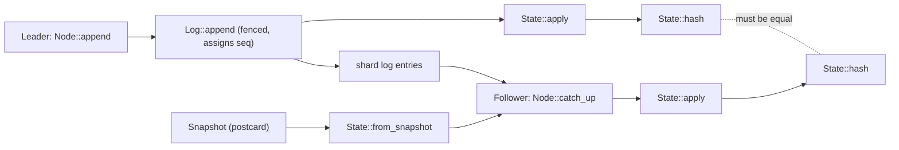
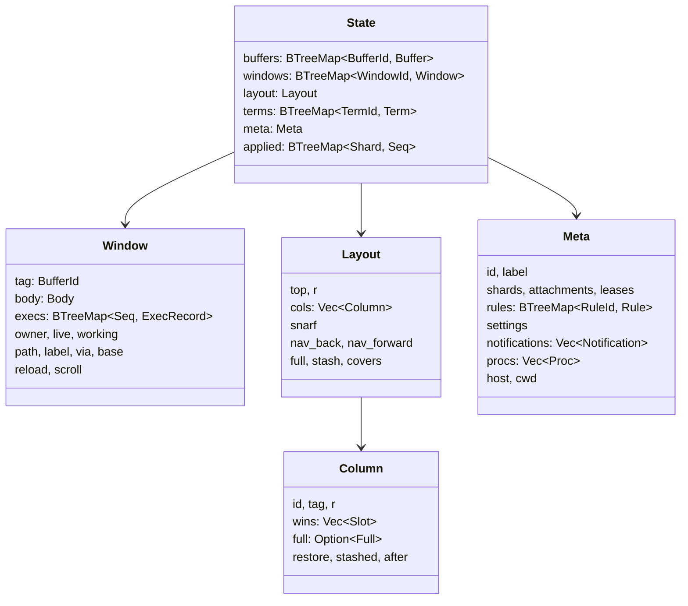
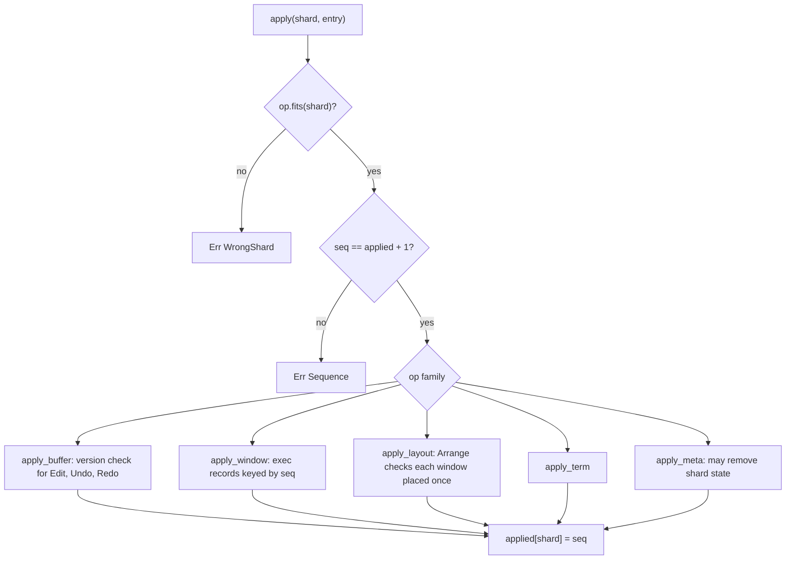

# Entries, State and Apply

apex-core is the editor's replicated state machine, and it has no UI and does no I/O. A session's state is a pure function of its shards' logs. Each shard (a buffer, a window, the layout, a terminal, the metalog) has a log of `Entry` values, and `State::apply` is the only code that turns entries into state. This page covers the entry and op types of each shard, the state structures they build, how `apply` checks and dispatches them, the hash replicas use to detect divergence, the postcard snapshots that new attachments start from, and the tests and benchmarks that hold all of this in place.

The model of sessions, shards, leases and leaders is on [Sessions, Shards and Leadership](sessions-and-replication.md). The buffer internals (rope text, views, undo history) are on [Buffers, Views and Undo](buffers-and-text.md). How a leader decides which entries to append is on [The Node: Leading and Built-in Commands](node.md), and the pixel geometry inside `LayoutOp::Arrange` is on [Tiling and Layout](tiling-and-layout.md).

## Where the state machine sits

The crate's top-level doc names the parts: `ids` and `entry` define shards and their entries, `text` and `buffer` hold rune-indexed text, `state` is "the session state and `apply`, deterministic and pure", `log` is the in-memory store with leases and fencing, and `node` is a replica that leads shards ([lib.rs:1-29](crates/apex-core/src/lib.rs#L1-L29)). The dependencies are deliberately few: `ropey` for text, `serde`/`postcard` for encoding, and `blake3` built with the `pure` feature "no C or assembly: cross-compiles anywhere" ([Cargo.toml:7-15](crates/apex-core/Cargo.toml#L7-L15)).

Every replica holds a `State` and changes it in only two ways. A follower replays entries it reads from a `Log`. A leader appends an op to the `Log` and applies the entry the log returns. Both paths end in `State::apply`:

```rust
// node.rs
pub fn append(&mut self, log: &mut Log, shard: Shard, op: Op) -> Result<(Seq, Applied)> {
    let epoch = *self.epochs.get(&shard).ok_or(CoreError::NotLeader(shard))?;
    let e = log.append(shard, self.attachment, epoch, op)?;
    let a = self.state.apply(shard, &e)?;
    Ok((e.seq, a))
}
```

`Node::catch_up` applies the metalog first and then every other shard, in each case only the entries after the state's `applied` sequence for that shard ([node.rs:323-342](crates/apex-core/src/node.rs#L323-L342)). The log, not the state, is the fencing authority: `Log::append` refuses an op whose attachment or epoch does not match the lease ([log.rs:213-227](crates/apex-core/src/log.rs#L213-L227)), so a fenced leader never reaches `apply`.



Sources: [crates/apex-core/src/lib.rs:1-29](crates/apex-core/src/lib.rs#L1-L29), [crates/apex-core/src/node.rs:323-356](crates/apex-core/src/node.rs#L323-L356), [crates/apex-core/src/log.rs:213-227](crates/apex-core/src/log.rs#L213-L227), [crates/apex-core/Cargo.toml:1-23](crates/apex-core/Cargo.toml#L1-L23)

## Identifiers and shards

All identifiers are plain `u64` newtypes made by one macro. Each displays with a one-letter prefix: `BufferId` as `b7`, `WindowId` as `w3`, and likewise `ColumnId` (`c`), `TermId` (`t`), `AttachmentId` (`a`), `RuleId` (`r`) and `GroupId` (`g`) ([ids.rs:7-34](crates/apex-core/src/ids.rs#L7-L34)). Three aliases carry the counters: `Seq` is a position in a shard's log, with the first entry at 1; `Epoch` (`u32`) is a lease's fence epoch; and `Version` is "the number of modifying entries applied" to a buffer ([ids.rs:36-41](crates/apex-core/src/ids.rs#L36-L41)). `SERVER` is `AttachmentId(0)`, the identity the server uses when it leads ([ids.rs:44](crates/apex-core/src/ids.rs#L44)).

The ids module says "uniqueness within a session is the metalog's business", but in practice a node mints ids without asking anyone. `Node::alloc` returns `(attachment << 40) | counter`, and undo groups are numbered the same way ([node.rs:304-315](crates/apex-core/src/node.rs#L304-L315)). Two attachments therefore never collide. Attachment ids and rule ids are counted by the `Log` itself ([log.rs:275-294](crates/apex-core/src/log.rs#L275-L294)).

`Shard` names one independently replicated log: `Buffer(BufferId)`, `Window(WindowId)`, `Layout`, `Term(TermId)` or `Meta`. `Shard::is_pinned` is true for `Term` and `Meta`, which the server always leads ([ids.rs:46-62](crates/apex-core/src/ids.rs#L46-L62)). A few helper types appear throughout the entries:

| Type | Meaning |
|---|---|
| `ViewId` | One text's selection and origin on a buffer: `Tag(w)`, `Body(w)`, `ColTag(c)` or `Top` ([ids.rs:83-100](crates/apex-core/src/ids.rs#L83-L100)) |
| `Part` | `Tag` or `Body`, the two texts of a window |
| `Span` | A buffer range, as a plumb reports where its text came from |
| `ExecCtx` | Where a command was executed: `Window`, `Column` or `Top` ([ids.rs:123-128](crates/apex-core/src/ids.rs#L123-L128)) |

Sources: [crates/apex-core/src/ids.rs:1-128](crates/apex-core/src/ids.rs#L1-L128), [crates/apex-core/src/node.rs:304-315](crates/apex-core/src/node.rs#L304-L315)

## Entries and ops

An `Entry` is what a log stores and replicates. It holds the sequence number, the attachment that sequenced it, the fence epoch it was sequenced under, and the operation:

```rust
pub struct Entry { pub seq: Seq, pub attachment: AttachmentId, pub epoch: Epoch, pub op: Op }
pub enum Op { Buffer(BufferOp), Window(WindowOp), Layout(LayoutOp), Term(TermOp), Meta(MetaOp) }
```

`Op::fits(shard)` pairs each op family with its shard kind. Both the log and `apply` call it before doing anything else ([entry.rs:8-41](crates/apex-core/src/entry.rs#L8-L41)). Every entry is concrete: it carries resulting values, not intentions. An `Edit` names its exact runes and offsets, and an `Arrange` carries the whole computed tiling. That is what lets `apply` be deterministic without consulting fonts, files or clocks.

### Buffer ops

`BufferOp` ([entry.rs:115-142](crates/apex-core/src/entry.rs#L115-L142)) covers a buffer's whole life:

| Op | Effect |
|---|---|
| `Create { name, text, disk_hash, kind, scratch }` | First entry. Names the buffer, says what kind of window it is for (`WinKind`), and whether it is scratch, meaning there is no file to Put and nothing for Del to ask about |
| `Edit { version, q0, nd, text, group }` | Replace `nd` runes at `q0` of the text at `version`. Consecutive edits with one `group` undo together |
| `Undo { version }` / `Redo { version }` | Undo or redo the latest group. The inverse is derived from history in the state |
| `Clean { version, disk_hash }` | The file on disk equals the text at `version` |
| `Stale { disk_hash }` | The file changed underneath a dirty buffer |
| `Rename { name }` | New name |
| `ViewAdd`, `ViewDel` | A window started or stopped viewing this buffer |
| `Select { view, q0, q1 }`, `Origin { view, origin }` | A view's selection and scroll origin |

Selections and origins live in the buffer's log, not the window's. A buffer edit adjusts every view on the buffer, so the selections must be sequenced in the same log as the edits, or replicas could interleave them differently ([README.md:18-27](crates/apex-core/README.md#L18-L27)). [Buffers, Views and Undo](buffers-and-text.md) explains how views are adjusted.

### Window ops

A window's log records its creation, its per-window settings and flags, and the commands executed in it ([entry.rs:183-254](crates/apex-core/src/entry.rs#L183-L254)). `Create` gives the tag buffer and the `Body`, the window's kind and nothing else:

```rust
pub enum Body { Text(BufferId), Term(TermId), Page(Source) }
pub enum Source { Buffer(BufferId), Url }
```

A `Page`'s document is either a buffer of HTML, edited and patched in place, or the window's `path` fetched `Via::Host`, `Via::Client` or `Via::Tool(name)` ([entry.rs:45-80](crates/apex-core/src/entry.rs#L45-L80)). `Create` also carries `path` (a terminal's directory, a page's address), an optional `label`, and a page's `via` and `base`. The remaining window ops are:

- **Page and naming:** `Path`, `Reload`, `PageScroll { scroll }` (with `Scroll::Line` or `Scroll::Fraction`), `Label`.
- **acme's per-window settings:** `Font { mono }`, `Tab { n }`, `Indent { on }`, `TagExpand { on }`.
- **Flags held by an attachment:** `Own { by }` (a tool owns the window; acme's held `event` file), `Live { by }` (a process is behind it), and `Working { by, at }` (work is under way, optionally with a percentage). Each claim ends when `by` is `None` or when the attachment goes.
- **`Diagnostic { on }`:** a report window such as +Errors, created stashed, whose news appears in toasts.
- **`Exec(ExecOp)` and `Status { exec, status }`:** a B2 command and, later, its outcome. `ExecOp` records the text, the `Handler` (`Leader`, `Server` or `Tool(name)`) and an `ExecAt`, which gives the buffer, version and range it acted on "so readers never guess at cross-shard order" ([entry.rs:146-181](crates/apex-core/src/entry.rs#L146-L181)).
- **`Delete`.**

### Layout ops

The layout shard is the row of columns ([entry.rs:258-290](crates/apex-core/src/entry.rs#L258-L290)). `Init` sets the top tag buffer and the row's rectangle. `Arrange` replaces the entire tiling after any acme layout operation: the row rectangle, every column with its slots, the column given the whole row (`full`), the stash and the covers. Its doc says it plainly: "The leader computes it; replicas just take it." `Snarf` holds the global snarf buffer. `Visit` and `NavPop` maintain the Back/Fwd stacks of `Loc`s. A `Loc` is a window name (or `<session>.<win>` id) plus a `Pos`: `Keep`, `Chars`, `Line`, or a UTF-16 `LineCol` ([entry.rs:418-444](crates/apex-core/src/entry.rs#L418-L444)). `Exec` and `Status` record commands run from column tags and the top row.

### Term ops

A terminal's shard carries the screen the daemon renders, not the bytes the program wrote ([entry.rs:294-350](crates/apex-core/src/entry.rs#L294-L350)). The ops are `Create`, `Rows { first, rows }` with `Cell`s, `Links` (OSC 8), `Cursor`, `Resize`, `Exit`, `View { top, total }` for scrollback position, `Progress` (OSC 9;4), `Marks` (OSC 133 prompt marks) and `Screen { alt }`. A `Cell` encodes its colours by top byte: `0xff` is RGB the program named, `0xfe` is an ANSI index to draw from the theme, `0xfd` is the theme's ink or paper, and 0 is the default. The pipeline that produces these is on [Terminals](terminals.md).

### Meta ops

The metalog is the session's record of itself ([entry.rs:510-556](crates/apex-core/src/entry.rs#L510-L556)):

| Group | Ops |
|---|---|
| Identity | `Init`, `Identity { id }` (a UUID minted once), `Label` |
| Shards | `ShardNew`, `ShardDel` |
| Attachments | `Attach { attachment, kind, name }` (`Ui` or `Tool`), `Detach` |
| Leases | `LeaseRequest`, `LeaseRelease`, `LeaseGrant`, `LeaseReclaim` |
| Plumbing | `PlumbRuleInstall { id, attachment, priority, rule }`, `PlumbRuleRemove` |
| Settings | `Set { owner, key, value }`, `Unset` (owner `SERVER` is the session) |
| Attention | `Notify { attachment, window }`, `Unnotify` |
| Processes | `ProcStart`, `ProcRename`, `ProcExit` |
| Place | `Cwd { host, dir }` |

A `PlumbRule` has a `verb` (`plumb` for B3; anything else is a tools-menu word), optional predicates (`owner`, `text`, `file`, `kind`, `win`, `isfile`, `isdir`), an `unlisted` flag, a `RuleAction` (`Edit`, `Run`, `Client`, `Tool`), a `RunTo`, and a `start` command for tools started on first use ([entry.rs:360-408](crates/apex-core/src/entry.rs#L360-L408), [entry.rs:486-508](crates/apex-core/src/entry.rs#L486-L508)). The metalog only stores and orders rules; matching is on [Plumbing Rules and Verbs](plumbing.md). `WinKind` (`File`, `Dir`, `Term`, `Errors`, `Page`) is "said when it is made, never read off its name". `WinKind::parse` still accepts the old names `web` and `preview` as `Page` ([entry.rs:446-484](crates/apex-core/src/entry.rs#L446-L484)).

Sources: [crates/apex-core/src/entry.rs:1-583](crates/apex-core/src/entry.rs#L1-L583), [crates/apex-core/README.md:18-32](crates/apex-core/README.md#L18-L32)

## The state structures

`State` is five collections plus a sequence map, all in `BTreeMap`s or `Vec`s so that iteration order, and therefore hashing and serialization, is deterministic ([state.rs:483-492](crates/apex-core/src/state.rs#L483-L492)).



### Window

`Window` mirrors the window ops one for one ([state.rs:46-86](crates/apex-core/src/state.rs#L46-L86)). `Create` sets the defaults: `tabstop` 4, `autoindent` on, `tagexpand` on, and no owner ([state.rs:635-643](crates/apex-core/src/state.rs#L635-L643)). `execs` maps the entry's sequence number to an `ExecRecord`, whose `ExecStatus` starts as `Pending` and is overwritten by a later `Status` entry naming that sequence ([state.rs:14-44](crates/apex-core/src/state.rs#L14-L44)). `Window::body_buffer` returns the buffer for `Text` and `Page(Source::Buffer)` bodies and `None` for terminals and URL pages, and `is_page` tells whether the body is any page ([state.rs:88-100](crates/apex-core/src/state.rs#L88-L100)).

### Layout

The layout keeps acme's geometry in integer pixels. A `Slot` is a window's place in a column: its rectangle, its body rectangle, tag lines, visible lines, acme's `frmax` and `maxlines`, the pixels trimmed to end on a whole line (`extra`), its `share` of the column in parts per million, and `premax`, the share to restore after a maximize ([state.rs:104-141](crates/apex-core/src/state.rs#L104-L141)). `Column` adds the column's own `full` window (a `Full` that remembers the rectangles to return to), a `restore` width, and the `stashed` and `after` fields for strips ([state.rs:169-225](crates/apex-core/src/state.rs#L169-L225)). The `Layout` also holds the stash of `Stashed` windows (each with its old slot, column and the window it sat under) and `covers`, the stacks of windows over one another ([state.rs:143-167](crates/apex-core/src/state.rs#L143-L167), [state.rs:227-252](crates/apex-core/src/state.rs#L227-L252)). The query helpers (`shows`, `column_of`, `place_of`, `slot`, `stack_top`, `stack`, `under`, `over`) are read-only and are used throughout the node and client ([state.rs:254-327](crates/apex-core/src/state.rs#L254-L327)). [Tiling and Layout](tiling-and-layout.md) explains what the fields mean geometrically.

### Term and Meta

`Term` is a grid of `Cell`s with its links, cursor, exit status, scrollback position (`top`, `total`), progress, prompt marks and the alternate-screen flag ([state.rs:346-371](crates/apex-core/src/state.rs#L346-L371)).

`Meta` holds the session's identity and label, the set of live shards, attachments, the lease table, rules, settings, notifications, processes, and the host and cwd ([state.rs:400-429](crates/apex-core/src/state.rs#L400-L429)). Its parts:

- **Lease** records holder, epoch, the sequence the holder leads from, a pending requester, and a released sequence ([state.rs:375-385](crates/apex-core/src/state.rs#L375-L385)).
- **Rule** wraps a `PlumbRule` with the installing attachment and its priority.
- **Settings** are keyed by owner. `Meta::setting(a, key)` returns the attachment's own value, falling back to the session's under `SERVER` ([state.rs:474-479](crates/apex-core/src/state.rs#L474-L479)). [Configuration](configuration.md) covers which settings exist.
- **Notification** names a window, the attachment that raised it, and `at`, the metalog sequence that first raised it ([state.rs:462-472](crates/apex-core/src/state.rs#L462-L472)).
- **Proc** is identified by the `ProcStart` entry's sequence, because pids get reused. It records name, command, directory, origin, `ProcKind` (`Command`, `Script`, `Adopted`, `Term`), `ProcOut`, start time and, once ended, its exit ([state.rs:431-457](crates/apex-core/src/state.rs#L431-L457)).

Sources: [crates/apex-core/src/state.rs:12-492](crates/apex-core/src/state.rs#L12-L492)

## `State::apply`

`apply(shard, entry)` makes three checks and then dispatches. It refuses an op that does not fit the shard (`WrongShard`) and an entry whose `seq` is not exactly one more than the shard's applied sequence (`Sequence`). It then matches on the (op, shard) pair, calls one of `apply_buffer`, `apply_window`, `apply_layout`, `apply_term` or `apply_meta`, and on success records `applied[shard] = seq` ([state.rs:550-569](crates/apex-core/src/state.rs#L550-L569)). If an inner apply fails, the sequence does not advance.



`ApplyError` has five variants: `WrongShard`, `Sequence`, `Version`, `Missing` and `Exists` ([state.rs:494-506](crates/apex-core/src/state.rs#L494-L506)). `Applied` is normally `Ok`; for `Undo` and `Redo` it is `UndoRange`, the range the change touched, which the node uses to place the selection ([state.rs:508-514](crates/apex-core/src/state.rs#L508-L514)).

### Per-shard rules

**Buffers.** `Create` fails with `Exists` if the id is taken. `Edit`, `Undo` and `Redo` must name the buffer's current version or fail with `Version`; this optimistic check is what catches an edit composed against stale text. `Clean` sets the clean version and disk hash and clears `stale`. `Stale` sets the flag and the new hash. View ops call `Buffer::set_select` and `set_origin` ([state.rs:571-631](crates/apex-core/src/state.rs#L571-L631)).

**Windows.** `Tab` clamps the tab stop to at least 1. `Working { by: None, .. }` clears progress whatever `at` says. `Exec` inserts a record under the entry's own sequence. `Status` fails with `Missing` if that exec does not exist. `Delete` removes the window and also calls `Layout::unplace`, so a layout never refers to a deleted window ([state.rs:633-674](crates/apex-core/src/state.rs#L633-L674)). `unplace` removes the window from every column, the stash and the cover stacks. If the window was in the middle of a stack, the window above it is joined to the one below, keeping the stack whole ([state.rs:328-341](crates/apex-core/src/state.rs#L328-L341)).

**Layout.** `Arrange` is the one op that validates its contents. A window may appear only once across all column slots, the stash and the covered windows; otherwise apply fails with `Exists("window … placed twice")`. It then replaces the columns, stash and covers wholesale, and keeps `full` only if that column is among the new columns ([state.rs:690-703](crates/apex-core/src/state.rs#L690-L703)). `Visit` pushes `from` onto the back stack, skipping it when it equals `to` or the current top, caps the stack at 50 entries, and always clears the forward stack. `NavPop` moves the current place to the other stack only if the popped stack was non-empty ([state.rs:705-723](crates/apex-core/src/state.rs#L705-L723)).

**Terms.** `Create` fills a blank grid and sets `total` to the row count. `Rows` ignores rows past the grid. `Resize` pads or truncates rows and columns with blank cells ([state.rs:728-795](crates/apex-core/src/state.rs#L728-L795)).

**Meta.** Several meta ops reach beyond `Meta` itself ([state.rs:797-900](crates/apex-core/src/state.rs#L797-L900)):

- `ShardNew` adds a lease held by `SERVER` at epoch 0.
- `ShardDel` removes the shard's lease, removes its buffer, window (with `unplace`) or terminal, and removes its entry from `applied`.
- `Detach` drops the attachment, its settings, and every notification it raised.
- `LeaseReclaim` hands the lease to `SERVER` at the new epoch but keeps any pending requester.
- `Notify` on a window that already has a notification only changes `by`, so the notification keeps its place and its `at`. `Unnotify` removes it.
- `ProcRename` and `ProcExit` act on the running process with that pid. After an exit, only the last `PROCS_ENDED` (16) ended processes are kept, dropping the oldest ([state.rs:459-460](crates/apex-core/src/state.rs#L459-L460)).
- `Unset` drops an owner's settings map once it is empty.

### Applying out of order

`apply_unsequenced` applies a metalog op without checking or advancing any sequence ([state.rs:541-548](crates/apex-core/src/state.rs#L541-L548)). It exists for one case: a client mirror deleting a shard before the server's `ShardDel` entry arrives. `Node::delete_shard` builds a seq-0 `ShardDel` entry and applies it this way ([node.rs:374-385](crates/apex-core/src/node.rs#L374-L385)). Likewise, `Node::create_shard` on a mirror inserts the shard into `meta.shards` directly so its entries can apply before the server's `ShardNew` comes back ([node.rs:358-372](crates/apex-core/src/node.rs#L358-L372)). These are the two places where state is changed other than through a sequenced `apply`. Both concern a client running ahead of the server, described on [The Attach Protocol](attach-protocol.md).

Sources: [crates/apex-core/src/state.rs:494-900](crates/apex-core/src/state.rs#L494-L900), [crates/apex-core/src/node.rs:358-385](crates/apex-core/src/node.rs#L358-L385)

## `State::hash`: divergence checks

`hash()` returns a 32-byte BLAKE3 digest of the whole state, so that two replicas can compare it ([state.rs:904-999](crates/apex-core/src/state.rs#L904-L999)). It walks each part in order:

1. Each buffer through `Buffer::hash_into`, which covers id, name, kind, scratch, text, version, clean version, stale flag, disk hash, every view, and the undo and redo stacks ([buffer.rs:234-259](crates/apex-core/src/buffer.rs#L234-L259)).
2. Each window's id, tag, body (with a discriminant byte per body kind), page fields, flags, tab stop, path, label, ownership flags and exec records.
3. The layout's top, rectangle, full column, columns and slots, stash, covers, navigation stacks, snarf and execs.
4. Each terminal's dimensions, every cell, the cursor, links, scrollback, progress, marks and exit.
5. The whole `Meta`, serialized with postcard.
6. The `applied` map.

Section tags such as `b"windows"` and `b"layout"` separate the parts. Many fields are hashed by postcard-encoding a tuple of them, so a new field is covered only when someone adds it to the hash. The test `the_hash_sees_every_replicated_window_flag_and_the_stacks` guards this for `Own`, `Live`, `Working`, `Diagnostic`, covers and visits by asserting that each one changes the hash ([tests/core.rs:974-994](crates/apex-core/tests/core.rs#L974-L994)), and `a_pages_state_is_in_the_log` does the same for page scroll and reload ([tests/core.rs:996-1029](crates/apex-core/tests/core.rs#L996-L1029)). If you add a replicated field to `Window`, `Layout` or `Term`, add it to `hash` and to one of these tests.

One detail to know: the terminal cursor is hashed as `cursor.0 as u8` and `cursor.1 as u8`, so cursor positions that differ by a multiple of 256 hash the same ([state.rs:987](crates/apex-core/src/state.rs#L987)).

Outside the core, `hash` is used in tests, for example apex-server's replay test ([crates/apex-server/tests/server.rs:279](crates/apex-server/tests/server.rs#L279)).

Sources: [crates/apex-core/src/state.rs:902-999](crates/apex-core/src/state.rs#L902-L999), [crates/apex-core/src/buffer.rs:234-259](crates/apex-core/src/buffer.rs#L234-L259), [crates/apex-core/tests/core.rs:974-1029](crates/apex-core/tests/core.rs#L974-L1029)

## Snapshots

Because `State` derives `Serialize` and `Deserialize`, a snapshot is just postcard encoding of the whole value:

```rust
pub fn to_snapshot(&self) -> Vec<u8> { postcard::to_stdvec(self).expect("state serializes") }
pub fn from_snapshot(bytes: &[u8]) -> Result<State, postcard::Error> { postcard::from_bytes(bytes) }
```

([state.rs:1001-1008](crates/apex-core/src/state.rs#L1001-L1008))

A snapshot includes `applied`, so a restored state knows where each shard's tail begins, and `catch_up` continues from there. The daemon uses this when a client attaches. It catches its follower view up, encodes it, and sends it in `ServerMsg::Welcome` ([daemon.rs:615-625](crates/apex-server/src/daemon.rs#L615-L625)). The client decodes it, builds a mirror `Log` whose shards start at the snapshot's applied sequences, installs the state into a fresh `Node`, and catches up ([remote.rs:255-259](crates/apex-server/src/remote.rs#L255-L259), [log.rs:102-121](crates/apex-core/src/log.rs#L102-L121)). `Log::compact(shard, upto)` drops entries a snapshot covers ([log.rs:380-389](crates/apex-core/src/log.rs#L380-L389)).

Postcard is not self-describing: fields are encoded in declaration order with no names. Several fields carry `#[serde(default)]`, such as `Slot::extra`, `Column::stashed`, `Meta::procs` and the `via` and `base` of `WindowOp::Create`. With postcard those attributes do not make an old encoding readable, so in practice snapshots and entries are only exchanged between matching builds. The protocol version and build id that every connection states first enforce this ([The Attach Protocol](attach-protocol.md)).

Sources: [crates/apex-core/src/state.rs:1001-1008](crates/apex-core/src/state.rs#L1001-L1008), [crates/apex-server/src/daemon.rs:615-625](crates/apex-server/src/daemon.rs#L615-L625), [crates/apex-server/src/remote.rs:255-259](crates/apex-server/src/remote.rs#L255-L259), [crates/apex-core/src/log.rs:102-121](crates/apex-core/src/log.rs#L102-L121), [crates/apex-core/src/log.rs:380-389](crates/apex-core/src/log.rs#L380-L389)

## Tests

`tests/core.rs` drives the core end to end through a real `Log` and `Node`. Its `session()` helper creates a log, attaches a UI, catches up a node and runs `init_session`. `follower()` replays the same log into a fresh node under an unrelated attachment id ([tests/core.rs:8-21](crates/apex-core/tests/core.rs#L8-L21)). Most scenario tests end by asserting that the follower's hash equals the leader's.

### Scenario tests

| Test | What it pins down |
|---|---|
| `typing_and_replication` | Typing and backspace produce the right text and caret; a follower agrees |
| `zerox_shares_the_buffer_with_independent_selections` | Two views on one buffer, selection shifting, undo from either window, buffer removed with its last window |
| `cut_snarf_paste_undo_redo`, `typing_undoes_as_one_group_until_a_mouse_action`, `undo_redo_round_trip` | Undo groups and redo |
| `edit_language_is_lowered_into_entries` | Edit programs become entries; one undo group per program |
| `commands_are_logged_with_their_handler` | Built-ins are `Leader`/`Done`; `Put` is `Deferred`/`Pending` |
| `fencing_rejects_a_stale_leader` | After a reclaim and grant the old leader's append fails with `LogError::Fenced`; it catches up as a follower; cooperative transfer back ([tests/core.rs:246-272](crates/apex-core/tests/core.rs#L246-L272)) |
| `snapshot_plus_tail_equals_replay` | A state restored from a mid-way snapshot plus the tail hashes equal to the leader, before and after compacting the log ([tests/core.rs:274-306](crates/apex-core/tests/core.rs#L274-L306)) |
| `notifications_are_a_windows_and_go_with_it` | Notification order, re-raising, lowering, and removal with a deleted window or a detached tool ([tests/core.rs:606-658](crates/apex-core/tests/core.rs#L606-L658)) |
| column, cover, stash and diagnostic tests | Layout ops replicate; `unplace` keeps stacks whole |

### Property tests

`replicas_agree` is the central invariant ([tests/core.rs:346-405](crates/apex-core/tests/core.rs#L346-L405)). Proptest generates 1 to 59 weighted `Action`s: insert, backspace, delete, select, cut, paste, undo, redo, Zerox, one of five Edit programs, new window, delete window, and errors output ([tests/core.rs:310-344](crates/apex-core/tests/core.rs#L310-L344)). Each case runs them against a leader, taking a snapshot halfway. Every action must succeed (Edit errors are allowed), and after each one every view must stay inside its buffer. At the end, a follower replaying the log must equal the leader both by hash and by `PartialEq`, and a node restored from the snapshot plus the tail must have the same hash. The suite runs 200 cases, and `core.proptest-regressions` keeps the failing seeds proptest has found.

Two smaller properties go with it. `undo_redo_round_trip` checks that n undos restore each earlier text in turn and n redos restore the later ones. `edit_lowering_matches_apex_edit` checks that running a program through the node gives the same text and dot as applying `apex_edit::Edit::run`'s changes directly ([tests/core.rs:407-453](crates/apex-core/tests/core.rs#L407-L453)); see [The Edit Language](edit-language.md). Tiling has its own suite in `tests/tiling.rs`, described on [Tiling and Layout](tiling-and-layout.md).

Sources: [crates/apex-core/tests/core.rs:1-1029](crates/apex-core/tests/core.rs#L1-L1029), [crates/apex-core/README.md:34-41](crates/apex-core/README.md#L34-L41)

## Benchmarks

`benches/core.rs` is a Criterion group, run with `cargo bench` and a sample size of 20. Each benchmark builds a session the way the tests do ([benches/core.rs:1-92](crates/apex-core/benches/core.rs#L1-L92)):

| Benchmark | Measures | README figure |
|---|---|---|
| type 10k keystrokes | `insert` appending edit and select entries | ~260 ns a keystroke |
| edit with 100 views on a 1M-rune buffer | view adjustment over 100 Zerox views | ~0.7 µs |
| hash state with a 1M-rune buffer | `State::hash` | ~0.9 ms |
| snapshot round trip, 1M-rune buffer | `to_snapshot` + `from_snapshot` | ~0.3 ms |
| replay 20k entries into a follower | `catch_up` from scratch, then hash | ~2.2 ms |
| Edit `,x/fox/ c/cat/` over 1M runes | lowering 20k changes into entries | ~50 ms |

The README gives these figures for "an Apple laptop" ([README.md:43-48](crates/apex-core/README.md#L43-L48)). They are useful mainly as relative costs. Hashing is linear in the whole state, including every terminal cell, so it is for checks and tests, not for every keystroke. Replay is cheap enough that a follower can always rebuild from the log.

Sources: [crates/apex-core/benches/core.rs:1-92](crates/apex-core/benches/core.rs#L1-L92), [crates/apex-core/README.md:43-48](crates/apex-core/README.md#L43-L48)
