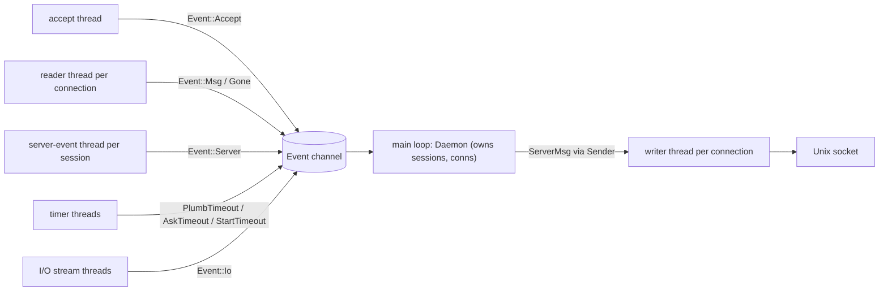
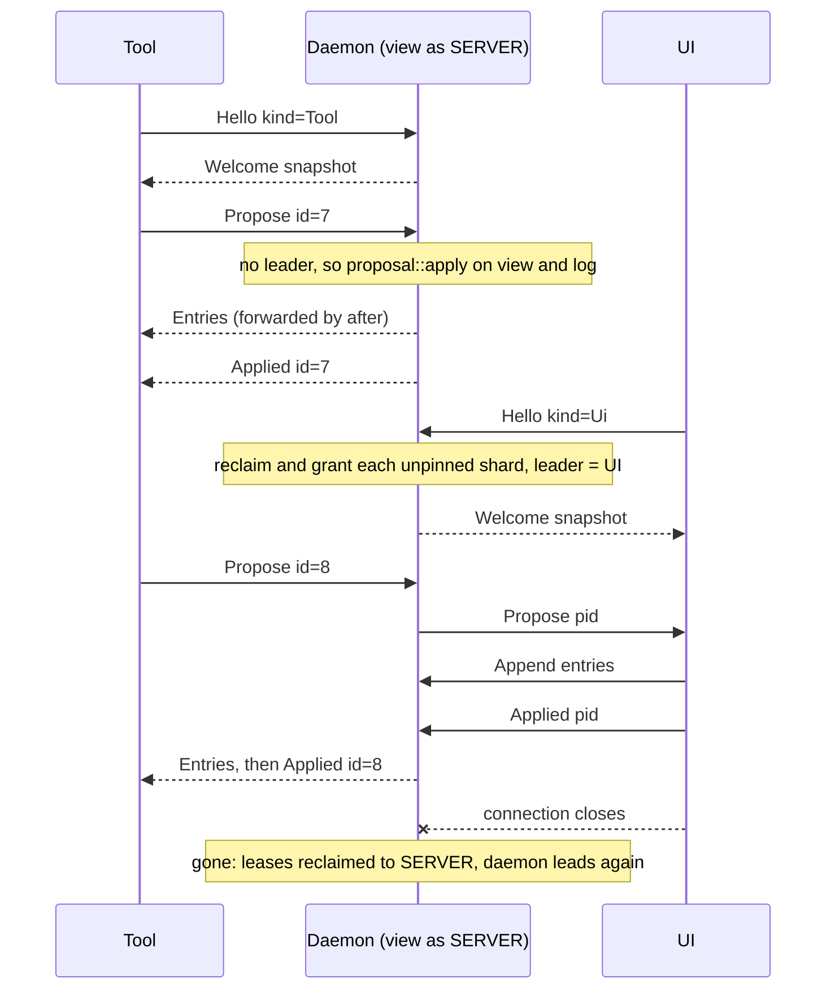

# The Daemon (apexd)

The daemon is the long-lived process on a host that owns apex sessions. It keeps each session's authoritative `Log`, the `Server` that runs commands, terminals and file I/O for it, and a follower replica of the whole session. It speaks the attach protocol to every client over a Unix socket. UIs, tools and the `apex` command all reach a session through it. When no UI is attached, the daemon leads the session itself, so tools and scripts can work on a headless session. The first UI that attaches takes over.

This page covers `crates/apex-server/src/daemon.rs`, the `apexd` binary and the `apex-bench` measurement program. The replication model it implements (shards, leases, fencing) is described in [Sessions, Shards and Leadership](sessions-and-replication.md). The message formats are on [The Attach Protocol](attach-protocol.md). What the `Server` does with commands, files and processes is on [The Server](server.md), and how proposals become entries is on [Proposals](proposals.md).

## Starting a daemon

There are three ways a daemon process starts. All of them end in `Daemon::run(socket, session)`, which binds the socket, makes one first session, and loops until told to stop.

| Entry point | Where | Notes |
|---|---|---|
| `apexd [--socket PATH] [--session NAME]` | `crates/apex-server/src/bin/apexd.rs` | Standalone binary. The session defaults to `default` and the socket to `default_socket()`. Unknown arguments exit with status 2. |
| `apex server` | `crates/apex-cli/src/main.rs:881-887` | The same call from the CLI, using the CLI's `-socket` / `-session` (see [The apex Command](cli.md)). |
| `spawn_server(exe, socket, session)` | `daemon.rs:29-62` | Used by the CLI's `ensure_server` and by the UI. It runs `exe -socket=… -session=… server` detached and waits up to 5 s for the socket to answer. |

`spawn_server` makes the child independent of whoever asked for it. In `pre_exec` it calls `setsid()`, so the end of an ssh session or a bridge's process group does not take the daemon with it. It also resets signal dispositions. Stdin and stdout are null, the working directory is `$HOME`, and stderr is appended to `apexd.log` beside the socket (`daemon_log`, `daemon.rs:1594-1598`). Everything the daemon `eprintln!`s, such as "session X made" or a connection's framing error, ends up there.

`default_socket()` returns `$APEX_SOCKET` if that is set. Otherwise it returns `$TMPDIR/apex-$USER/main.sock`. When neither `USER` nor `LOGNAME` is set, as in many container `exec`s, the numeric uid takes the user's place (`daemon.rs:64-79`).

`Daemon::run_with` does some process-wide setup before it binds:

- `put_apex_on_path()` puts `~/.apex/bin` (where a remote install puts `apex` and `rc`) and the directory of the running binary (the app bundle's) at the front of `PATH`, so a session's commands and shells find `apex` and `rc` (`daemon.rs:84-99`).
- It ignores `SIGHUP`, so the daemon survives the terminal or ssh session that started it.
- It removes a stale socket file, binds a `UnixListener`, and spawns an accept thread.

`run` gives `~/.apex/profile` as the host profile. `run_with` takes the profile as a parameter so tests can pass `None` and keep the profile out of `$HOME`. The doc comment on the `host_profile` field still says `~/.apex/init`, but the code uses `~/.apex/profile`. The socket file is removed again when the loop ends.

Sources: [crates/apex-server/src/bin/apexd.rs:1-29](crates/apex-server/src/bin/apexd.rs#L1-L29), [crates/apex-server/src/daemon.rs:25-99](crates/apex-server/src/daemon.rs#L25-L99), [crates/apex-server/src/daemon.rs:237-311](crates/apex-server/src/daemon.rs#L237-L311), [crates/apex-server/src/daemon.rs:1594-1598](crates/apex-server/src/daemon.rs#L1594-L1598), [crates/apex-cli/src/main.rs:879-900](crates/apex-cli/src/main.rs#L879-L900)

## Threads and the event loop

One thread owns all daemon state. Every other thread talks to it through a single `std::sync::mpsc` channel of `Event`s. Each connection has its own writer thread draining a private outbound queue, so a slow client never stalls the core (`daemon.rs:1-11`).



The `Event` enum lists every input to the main loop:

| Event | Sent by | Main loop action |
|---|---|---|
| `Accept(UnixStream)` | listener thread | `accept`: gives the connection the next id and starts its reader and writer |
| `Msg(conn, ClientMsg)` | connection reader | `handle`, except `ClientMsg::Stop`, which clears all connections and breaks the loop |
| `Gone(conn)` | reader, at EOF or on a bad frame | `gone`: detach, return leases, drop streams |
| `Server(session id, ServerEvent)` | per-session forwarding thread | `Server::pump`, then `after`, file-watch fan-out, and OSC 52 clipboard to UIs |
| `PlumbTimeout(id)` | sleep thread from `ask_tool` | `tool_failed`: the plumb walk moves on |
| `AskTimeout(id)` | sleep thread from `Ask` routing | `ask_over(id, None)` |
| `StartTimeout(session, tool)` | sleep thread from `hold` | `start_failed` |
| `Io(conn, stream, IoUp)` | tunnel and fetch threads | `io_up`: forward the response head, body, end or failure |

`accept` (`daemon.rs:456-510`) first queues `ServerMsg::Build { protocol, id }`, so the first frame on every connection says which apex this is. It then spawns two threads. The reader loops on `read_frame::<ClientMsg>` and posts `Event::Msg`. On EOF or a decode error (for example, a client built against another wire format) it logs the error and posts `Event::Gone`. The writer blocks on its queue, writes a frame, coalesces whatever else is already queued with `try_recv`, and flushes once. When its sender is dropped, it flushes, then calls `shutdown(Both)` on the socket so the peer sees EOF instead of hanging. A new `Conn` starts with no session or attachment and with kind `Tool` until `Hello` arrives.

`Daemon::send(id, msg)` only pushes onto that connection's channel; it never blocks on I/O. To cut a connection off, the daemon removes its `Conn` and so drops the sender. That is how `end_session` disconnects members and how `Stop` ends every connection.

The per-session `Server` produces its own events (pty output, finished shell commands, file-watch hits, periodic rescans) on a `futures` unbounded channel returned by `Server::new`. `new_session_in` spawns a thread that blocks on that stream and re-posts each item as `Event::Server(sid, ev)`. Terminal events reach the main thread the same way.

Sources: [crates/apex-server/src/daemon.rs:1-11](crates/apex-server/src/daemon.rs#L1-L11), [crates/apex-server/src/daemon.rs:101-126](crates/apex-server/src/daemon.rs#L101-L126), [crates/apex-server/src/daemon.rs:267-308](crates/apex-server/src/daemon.rs#L267-L308), [crates/apex-server/src/daemon.rs:372-384](crates/apex-server/src/daemon.rs#L372-L384), [crates/apex-server/src/daemon.rs:456-516](crates/apex-server/src/daemon.rs#L456-L516), [crates/apex-server/src/lib.rs:159-224](crates/apex-server/src/lib.rs#L159-L224)

## Key types

```rust
struct Session {
    id: u64,              // internal, stable across renames
    label: String,        // for people
    log: Log,             // authoritative
    server: Server,       // effects on the world; leads the term shards
    view: Node,           // follower of every shard; leader when no UI is attached
    leader: Option<u64>,  // the UI connection that leads (single-player)
}
```

| Type | Role |
|---|---|
| `Daemon` | All state: `sessions: BTreeMap<String, Session>` keyed by the session's identity string, `conns: HashMap<u64, Conn>`, and the in-flight tables `pending`, `tool_plumbs`, `asks`, `held` and `finds`, plus the channel ends. |
| `Session` | One session, as above. The map key is the log's identity (`log.id()`). `id` is a small internal number that events and connections use because it does not change on a rename. |
| `Conn` | One client connection: the session and `AttachmentId` it attached as, its `AttachmentKind`, its outbound `Sender<ServerMsg>`, `sent` (how far each shard has been forwarded to it), its open I/O-plane `streams`, and the pids of programs it `adopted` through `Named`. |
| `Pending` | Something waiting for the leader's `Applied`: either a tool's proposal (connection and the tool's own id) or a step of a plumb walk. |
| `Held` | Work waiting for a tool that a rule's `start` command is launching: a plumb, or a `tool://` page request. |
| `IoStream` | An open stream on the I/O plane: `Watch`, `Put`, `Tunnel`, `Fetch` or `Relay`. See [The I/O Plane and Pages](io-plane-and-pages.md). |

Each session has two replicas. `Session::view` is a `Node` running as the `SERVER` attachment that follows every shard, and it is what the daemon reads and leads with. `Server::node` is the server's own replica, which leads only the pinned terminal shards (`lib.rs:97-106`). Log compaction takes both into account (see below).

Sources: [crates/apex-server/src/daemon.rs:128-235](crates/apex-server/src/daemon.rs#L128-L235), [crates/apex-server/src/lib.rs:97-156](crates/apex-server/src/lib.rs#L97-L156)

## Sessions: the registry

A daemon holds many sessions. The `sessions` map is the registry, and `resolve(s)` finds a session by any of three names (`daemon.rs:315-329`):

1. its full identity (the map key),
2. its label,
3. a unique prefix of the identity, four characters or longer.

`infos()` lists the sessions as `SessionInfo { id, label }`, sorted by label. That is the reply to `ListSessions`, `NewSession`, `RenameSession` and `EndSession`. A failure gets `ServerMsg::Error { text }` instead.

### Creating a session

`new_session_in(label, dir)` (`daemon.rs:346-401`) does nothing and returns `Ok(false)` if the label already resolves. A `NewSession` for an existing session therefore succeeds and simply replies with the list. Otherwise it:

1. Makes a fresh `Log`, takes its identity as the key, and sets the label.
2. Makes the `Server`. If `dir` is given, it `cd`s there first; a path that is not a directory is an error and nothing is made.
3. Sets the session environment: `apexsession` (the identity), `apexsessionlabel`, `APEX_SOCKET`, `EDITOR`, and `BROWSER` when the `xdg-open` link exists. `EDITOR` is `apex-editor`, a symlink to the binary made beside it so that `$EDITOR file` works as a single word under zsh and rc. If the link cannot be made, it falls back to `PATH/apex editor` (`daemon.rs:1600-1628`). `link_beside` only makes links next to a binary named `apex`, so test binaries leave their directory alone.
4. Spawns the server-event forwarding thread.
5. Calls `server.install_default_rules(&mut log)` to install the session's low-priority plumbing rules (see [Plumbing](plumbing.md)).
6. Makes the follower `Node::new(SERVER)`, catches it up, and calls `view.init_session(&mut log)` to lay out the top row and two columns, so a tool can work before any UI attaches.
7. Records where the session is (`MetaOp::Cwd` from `server.place()`: host and directory) and catches up again.
8. Inserts the session and calls `server.run_profile(&view, host_profile)` to start the host profile.
9. Calls `after` to forward and settle.

### Renaming and ending

`rename_session` checks the new label with `providers::valid_label` and refuses a label already in use. It changes `Session::label`, appends a label entry to the metalog (which is how attached clients learn the new name), and updates `apexsessionlabel` for commands started from then on.

`end_session(name, force)` (`daemon.rs:430-454`) refuses while any absolute-path, non-scratch `File` buffer is dirty, unless `force` is set. The error text points at `-f`. Otherwise every member connection receives `ServerMsg::Ended { id, label }` and then goes through `gone`. The session is removed from the map, every running process is `kill`ed, and dropping the `Server` ends its terminals.

`ClientMsg::Stop` (`apex stop`) is handled in the run loop itself, not in `handle`: it clears all connections and leaves the loop, so every session ends together with the daemon (`daemon.rs:277-281`).

Sources: [crates/apex-server/src/daemon.rs:313-454](crates/apex-server/src/daemon.rs#L313-L454), [crates/apex-server/src/daemon.rs:555-586](crates/apex-server/src/daemon.rs#L555-L586), [crates/apex-server/src/daemon.rs:1600-1628](crates/apex-server/src/daemon.rs#L1600-L1628), [crates/apex-server/src/lib.rs:1811-1827](crates/apex-server/src/lib.rs#L1811-L1827)

## Profile and attach scripts

There is no configuration file. Two shell scripts run as commands of the session, and their output goes to `+Errors` like any command's (see [Configuration](configuration.md)):

- **Profile.** When a session is made, `Server::run_profile` sources the host's `~/.apex/profile` in one shell, named `profile` in the top row and run in the session's directory. It installs an exit hook (rc's `fn sigexit`, or `trap … EXIT` for other shells) that runs `apex env -import`. That sends the shell's final environment back as `ClientMsg::EnvImport`, and `Server::import_env` applies whatever changed relative to what the profile was given, unsetting anything the profile removed (`lib.rs:1159-1212`).
- **Attach.** A `Hello` may carry an `attach: Option<Script>`, the client's own `~/.apex/attach` text. After `Welcome` is sent, `Server::run_attach` runs it on this host with `apexattachment` (the new attachment's id) and `apexclient` set, so `apex set` inside it applies to that attachment (`lib.rs:1214-1230`). An empty script is skipped.

`ClientMsg::Env { set }` sets variables, and both `Env` and `EnvImport` reply with the full `ServerMsg::Env { vars }`. `ClientMsg::Cd` changes the session's directory and appends the new `Cwd` to the metalog.

Sources: [crates/apex-server/src/daemon.rs:396-399](crates/apex-server/src/daemon.rs#L396-L399), [crates/apex-server/src/daemon.rs:635-639](crates/apex-server/src/daemon.rs#L635-L639), [crates/apex-server/src/daemon.rs:716-727](crates/apex-server/src/daemon.rs#L716-L727), [crates/apex-server/src/daemon.rs:903-912](crates/apex-server/src/daemon.rs#L903-L912), [crates/apex-server/src/lib.rs:1159-1230](crates/apex-server/src/lib.rs#L1159-L1230)

## Attaching, leading and handing back

`hello(id, session, name, kind, attach)` (`daemon.rs:588-642`) attaches a connection to a session:

1. Resolve the session, or reply `Error "no session …"`.
2. `log.attach(kind, name)` registers the attachment in the metalog and returns its `AttachmentId`.
3. If the kind is `Ui`, take leadership in single-player mode. For every shard that is not pinned: if a holder other than `SERVER` still holds the lease and has not released it, `reclaim` it, which fences the previous UI. Then `grant` the lease to the new attachment and set `Session::leader = Some(conn)`. The previous UI stays connected but its appends are now refused.
4. Catch up `view`, take a postcard snapshot of its state, and set the connection's `sent` marks to the log's last sequence numbers, because the snapshot already covers those entries.
5. Reply `Welcome { attachment, snapshot }`.
6. If work is `held` for a tool of this name (it was just started for that work), deliver it now, in order.
7. Run the attach script, then call `after` so other connections learn from the metalog that the leases moved.

Tools and CLI commands attach with kind `Tool`. They never take leases; they change state by proposing (see [Proposals](proposals.md)).

`gone(id)` (`daemon.rs:518-553`) undoes all of this. It stops the connection's ⌘O find jobs and drops its I/O streams. It makes the server forget the processes the connection adopted, removes the plumbing rules the attachment owned, and appends a `detach`. If the connection was the leader, `leader` becomes `None` and every lease the attachment held is reclaimed to `SERVER`, so the daemon leads again until the next UI attaches. Pending tool proposals from the connection are dropped.



### Proposals and who applies them

`ClientMsg::Propose { id, proposal }` is assigned a daemon-side `pid` and recorded in `pending` as `Pending::Tool { conn, id }`. Then `propose(name, pid, p)` routes it (`daemon.rs:967-979`):

- **A UI leads.** The proposal is sent to the UI as `ServerMsg::Propose { id: pid, … }`. The UI's later `ClientMsg::Applied` is accepted only from the current leader, and `answered(pid, result)` passes it back to the tool under the tool's own id.
- **No UI.** `proposal::apply(&mut view, &mut log, p)` runs right away. The daemon calls `after` *before* answering, so the tool's replica already has, for example, the window its proposal made by the time it hears `Applied`.

There is one special case. A non-UI connection's `Proposal::Snarf` is also sent as `ServerMsg::Clipboard` to every UI on the session, as a terminal's OSC 52 is (`daemon.rs:932-944`).

### Appends from the leader

`ClientMsg::Append { shard, entries }` appends each entry with `log.append_entry`, which checks fences and sequence numbers, and stops at the first failure, replying with an `Error` that names the shard and sequence. The connection's `sent` mark for the shard is moved to the log's end, because the appender already has its own entries. The highest accepted sequence is acknowledged with `Ack`. The daemon then polls the server for execs addressed to it (`poll_execs`) and starts any verb walks those produced (`daemon.rs:650-678`). `CreateShard` and `DeleteShard` are applied directly; a created shard's `sent` mark starts at 0.

Sources: [crates/apex-server/src/daemon.rs:518-553](crates/apex-server/src/daemon.rs#L518-L553), [crates/apex-server/src/daemon.rs:588-694](crates/apex-server/src/daemon.rs#L588-L694), [crates/apex-server/src/daemon.rs:932-979](crates/apex-server/src/daemon.rs#L932-L979), [crates/apex-server/src/daemon.rs:1354-1366](crates/apex-server/src/daemon.rs#L1354-L1366), [crates/apex-server/tests/socket.rs:131-177](crates/apex-server/tests/socket.rs#L131-L177)

## `after`: settle, forward, compact

Nearly every handler ends with `after(name, props)` (`daemon.rs:1513-1591`). It is the one place where the session's state is brought to rest and shipped out:

1. **Server bookkeeping.** `flush_procs` writes process starts, renames and exits into the metalog. `close_orphan_terms` starts shells whose windows have appeared and closes terminals whose windows are gone. `sync_watches` keeps the directory watches in step with the open files. Then `view.catch_up`.
2. **Leading while headless.** If `leader` is `None`, the server's proposals are applied here. The loop also opens and lands on any `take_gotos()` locations whose windows are not open: a URL becomes a web window, anything else is opened as a file in the first column. It then polls execs again, because what the daemon just did may have handed the server more work. The loop repeats until there are no proposals left.
3. **Forwarding.** For each connection on the session and each shard, the entries after the connection's `sent` mark are sent as `ServerMsg::Entries`. The metalog goes first, because it announces shards before their entries.
4. **Compaction.** For each shard, the daemon computes the lowest of: the log's last sequence, what `view` has applied, what `server.node` has applied, and every member connection's `sent` mark. It then calls `log.compact(shard, low)`. A log grows with what is outstanding, not with how long the session has existed.
5. **Proposals to a UI leader.** If a UI leads, the server's proposals are sent to it with `id: 0`, so no answer is expected.
6. **Verbs.** If `poll_execs` queued plumb starts for verbs, `start_verbs` begins those walks.

`Event::Server` runs `Server::pump` and then `after` with the returned proposals. It also streams changed files to watch subscribers (`file_changed`) and sends each OSC 52 clipboard text to every UI connection on the session (`daemon.rs:285-303`).

Sources: [crates/apex-server/src/daemon.rs:285-303](crates/apex-server/src/daemon.rs#L285-L303), [crates/apex-server/src/daemon.rs:1510-1591](crates/apex-server/src/daemon.rs#L1510-L1591), [crates/apex-server/src/lib.rs:567-589](crates/apex-server/src/lib.rs#L567-L589)

## Other in-session messages

Every message other than the session-level ones is handled by `in_session`. If the connection has not attached yet, it gets `Error "not attached"` (`daemon.rs:578-584`). The table groups what `in_session` does.

| Messages | What the daemon does |
|---|---|
| `TermKey`, `TermPaste`, `TermType`, `TermResize`, `TermClear`, `TermFocus`, `TermScroll` | Passed to the `Server`'s terminal hosts. Their output comes back as entries on the term shard (see [Terminals](terminals.md)). |
| `TermText`, `TermFind`, `TermRead` | Selection text becomes a `Snarf` proposal. Find replies `TermFound`, and read replies `TermLines`. |
| `OpenFile`, `EditOver` | `Server::open_file` becomes an `OpenWindow` proposal (with `cover` set for `EditOver`), or an `Errors` proposal on failure. |
| `Plumb` | `plumb_start` begins a walk, then `drive` carries it out. |
| `Ask`, `Answer` | A question about a window is routed to the window's owner with a 2 s `ASK_ANSWER` timeout. Answers are matched to a `tool_plumbs` or `asks` entry. |
| `PostToPage`, `WindowEvent` | Relayed: a page owner's post goes to the leading UI, and a window event goes to the window's owner. |
| `ClientConfig` | Accepted from UIs only; sets the colours terminals report to programs. |
| `RuleAdd`, `RuleRm` | Validated. A rule is owned by its attachment (`mine`) or by `SERVER`, and only the owner may remove it; a session-owned rule is removed when the request says it is on the session's behalf. |
| `Set` | A setting for the session or for a named attachment. |
| `Notify`, `Unnotify` | Raise a notification (plus a `Notice` proposal so the leader shows the window). Only the raiser, or a UI, may lower it. |
| `Named` | `Server::name_process`. An adopted pid is remembered on the connection. |
| `FindStart`, `FindQuery`, `FindStop` | ⌘O listing jobs, keyed by `(connection, request)`, whose results go straight onto the connection's channel. |
| `Kill` | Signals the targets. The processes' exits are recorded in the metalog when they happen. |
| `Candidates` | Path completions, sent only to the asker. |
| `Io` | The I/O plane (file GET/PUT/watch, `CONNECT`, http(s) fetch, `tool://` relay). |

### Plumb walks and tool deadlines

A plumb walk is a `Server`-side state machine. The daemon's `drive` (`daemon.rs:1448-1488`) carries out each `PlumbStep`:

- `Done` or `Refused` applies the step's proposals and sends `Plumbed { ok, why }` to the asker. Asker 0, a verb the server started itself, is not told.
- `Trace` is forwarded as `PlumbTrace`.
- `Ask(proposal)` goes to the leader as a `Pending::Plumb`.
- `AskTool` finds the connection attached under the tool's name and sends it `Ask`. The deadline is `B3_ANSWER` (1 s) for a B3 plumb and `VERB_ANSWER` (10 s) for a verb, since a verb may do its work before it answers. If no such tool is attached but the rule has a `start` command, the request is `hold`ed, the tool is started once (`Server::start_tool`), and it gets `START_WAIT` (10 s) to attach. If neither applies, the walk is told `"no tool … attached"`.

Timeouts are handled by spawning a thread that sleeps for the deadline and then posts an event. The main loop discards the event if the entry has already been removed.

Sources: [crates/apex-server/src/daemon.rs:160-209](crates/apex-server/src/daemon.rs#L160-L209), [crates/apex-server/src/daemon.rs:644-963](crates/apex-server/src/daemon.rs#L644-L963), [crates/apex-server/src/daemon.rs:1368-1508](crates/apex-server/src/daemon.rs#L1368-L1508), [crates/apex-server/src/lib.rs:1181-1191](crates/apex-server/src/lib.rs#L1181-L1191)

## Error handling and edge cases

- **Bad frames** end the connection, and the reason is logged to `apexd.log`. The daemon itself keeps running.
- **Fenced appends** (from a UI that lost its leases) are refused by `Log::append_entry`, and the client gets an `Error`. Entries before the failure in the same batch stay accepted.
- **Applied from a non-leader** is ignored (`daemon.rs:952-956`).
- **Proposal errors while headless** are logged (`apexd: NAME: proposal: …`). A tool's own proposal gets its error back in `Applied`.
- **Sessions go away under pending work.** Handlers look the session up by its internal id with `name_of` and return quietly if it is gone. `plumbed` and `ask_over` check that the asker is still connected.
- **The listener thread** stops when the event channel closes. `run` returns an error only if binding fails.

Sources: [crates/apex-server/src/daemon.rs:466-483](crates/apex-server/src/daemon.rs#L466-L483), [crates/apex-server/src/daemon.rs:650-678](crates/apex-server/src/daemon.rs#L650-L678), [crates/apex-server/src/daemon.rs:1427-1497](crates/apex-server/src/daemon.rs#L1427-L1497)

## Tests

`crates/apex-server/tests/socket.rs` runs a real daemon on a thread (`Daemon::run_with(path, "main", None)`, with a socket path made unique by pid and a counter) and drives it with `Remote` clients. The tests cover:

| Test | What it checks |
|---|---|
| `attach_edit_ack_and_reattach` | Appends are acknowledged, and a second UI sees the same state, takes the leases and can edit. |
| `execs_and_terminals_over_the_socket` | `OpenFile`, `Put`, a `\|sort` pipe, and `Newterm` with keys whose output appears on the term shard. |
| `a_tool_works_on_a_headless_session_and_a_ui_takes_over` | Daemon leadership, handover to a UI, routing of proposals through the UI, and leases returning to `SERVER` when the UI drops. |
| `sessions_are_listed_and_made` | The registry, and that sessions are isolated from each other. |
| `the_watcher_reloads_clean_buffers_and_flags_dirty_ones` | File watching, stale buffers, and a `Put` that refuses once. |
| `the_daemon_says_its_build_first_and_stops_when_told` | The first frame is `Build`, and `Stop` removes the socket. |

Further tests cover B3 expansion, directory windows, links to places in other sessions, and page owners being asked about links and posting to their scripts.

Sources: [crates/apex-server/tests/socket.rs:12-313](crates/apex-server/tests/socket.rs#L12-L313)

## apex-bench measurements

`apex-bench [--socket PATH] [--via CMD]` measures the attach protocol. Without `--socket` it starts `Daemon::run` on a thread of its own process. With `--via CMD` it attaches through a command's stdin and stdout, for example `apex attach --stdio`, which stands in for the ssh path without the network. It measures, in order (`apex_bench.rs:52-170`):

1. 2000 `Ping` / `Pong` round trips.
2. 5000 single-keystroke round trips: a local insert, `flush`, then waiting for the server's `Ack`.
3. Throughput for 10 000 and 100 000 inserts in one flush.
4. Attach time (connect, snapshot, decode) as the text grows by 0, 100, 1000 and 10 000 KB. Each probe takes the leases, so the bench reconnects afterwards to take them back.
5. Terminal latency: 200 alternating `a` and backspace `TermKey`s, each timed until the term shard's next `Entries` arrives.

It reports p50, p90, p99 and max for each. The README records a run on an M-series laptop:

| what | p50 | p99 |
|---|---|---|
| ping round trip | 21 µs | 42 µs |
| keystroke → ack | 14 µs | 23 µs |
| 100 000 keystrokes in one flush | 1.8 M entries/s | |
| attach, ~120 KB text (770 KB snapshot) | 4.2 ms | |
| attach, 11.5 M runes (11.9 MB snapshot) | 34 ms | |
| terminal key → rows on the client | 180 µs | 570 µs |

The README draws two conclusions. The transport is not where time goes. The snapshot is several times larger than the text because it carries the undo history, so compacting or excluding undo would make a large session's attach cost about what its text costs. Through the stdio bridge, the numbers rise only slightly (ping 26 µs, attach +4.5 ms). The README's remark that terminal latency is dominated by "alacritty's parser" and that "the whole grid is published as `Rows` entries per wakeup" predates the current code. Terminals now use libghostty-vt (see [Terminals](terminals.md)), and `Server::publish_term` publishes only the rows that changed (`lib.rs:418-437`). macOS limits socket paths to 104 bytes, which matters for `--socket`.

Sources: [crates/apex-server/src/bin/apex_bench.rs:1-194](crates/apex-server/src/bin/apex_bench.rs#L1-L194), [crates/apex-server/README.md:26-57](crates/apex-server/README.md#L26-L57), [crates/apex-server/src/lib.rs:418-437](crates/apex-server/src/lib.rs#L418-L437)
