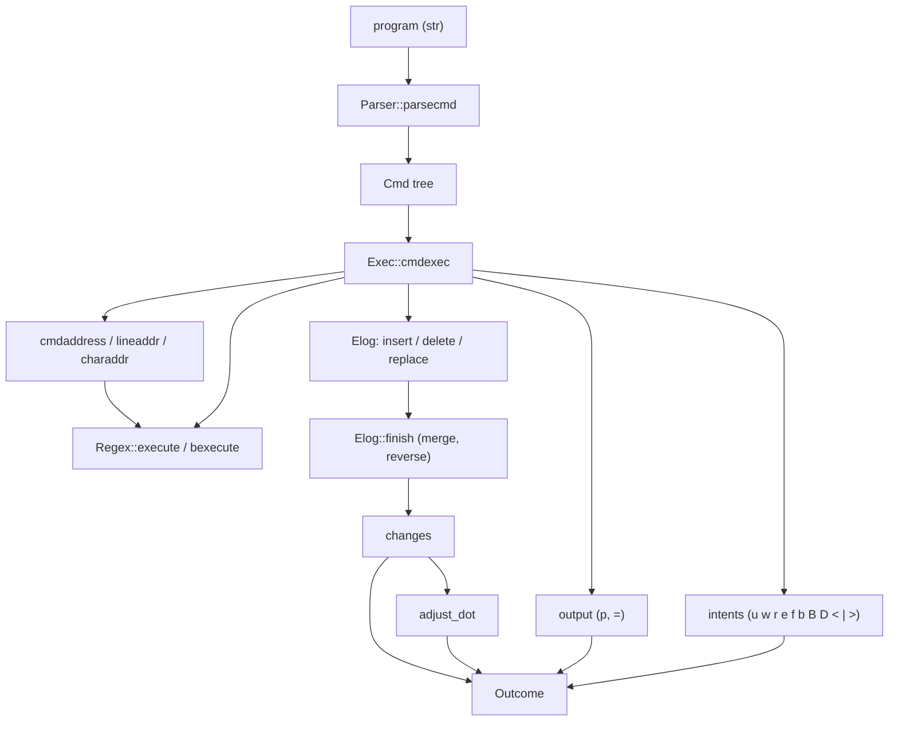
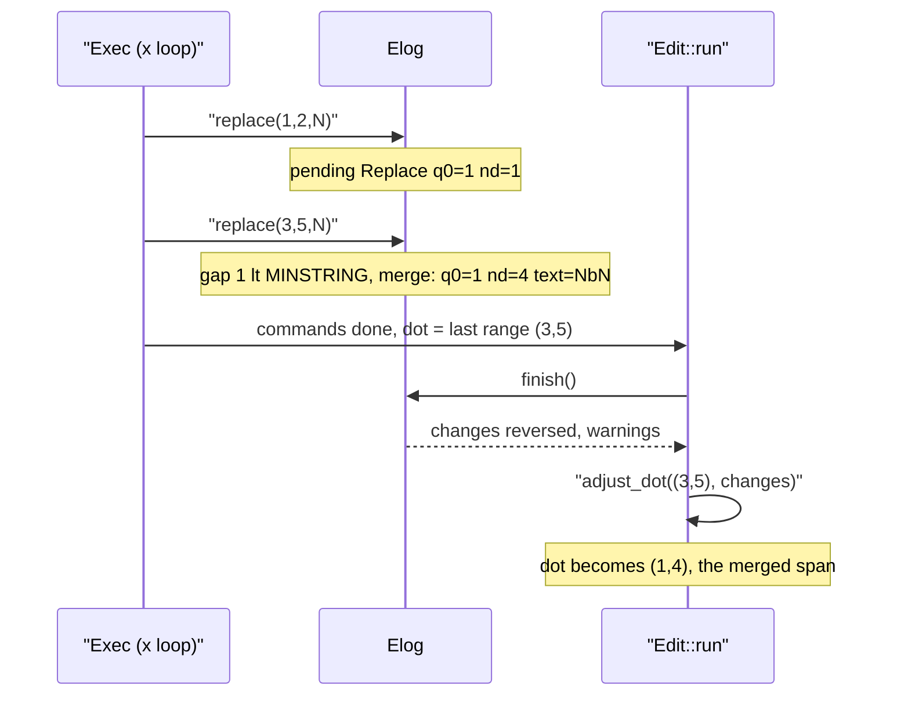

# The Edit Language (apex-edit)

`apex-edit` is apex's implementation of acme's `Edit` command: sam's structural-regular-expression command language (`,x/foo/ c/bar/`, `/re/;/re2/p`, `s/a/b/g`, `{ … }` blocks and so on), plus the Plan 9 regular expressions it uses. It is a line-by-line port of plan9port's `src/cmd/acme/{regx.c, edit.c, ecmd.c, elog.c}`. It is also a **pure** library. It reads a rune-indexed text, runs a program, and returns a description of what should happen: a list of changes in original coordinates, the new dot, the printed output, any warnings, and *intents* for commands that touch the world (files, shell pipes, undo). The caller decides how to carry those out.

The crate has no dependencies on the rest of apex (only `thiserror`), so you can test it against the reference implementation, plan9port's `sam`. Inside apex the main caller is the [node](node.md). `Node::run_edit` runs a program over a window's body and lowers the resulting changes into buffer entries in one undo group (see [Buffers, Views and Undo](buffers-and-text.md) for the rope text that implements the crate's `Text` trait). The [apex command](cli.md) also uses it directly for `apex text read -addr`.

## Architecture

The crate has four modules, one for each acme source file:

| Module | Ported from | Responsibility |
|---|---|---|
| `regx.rs` | `regx.c` | Compile a pattern into forward and backward instruction programs; run a leftmost-longest Thompson simulation with wrap-around |
| `parse.rs` | `edit.c` | The command table, addresses, text and regexp arguments, `{ }` blocks; builds a `Cmd` tree |
| `exec.rs` | `ecmd.c` | `Edit::run`, address evaluation, command semantics, loops, intents |
| `elog.rs` | `elog.c` | The change log: records changes against the original text, merges them as acme does, reverses them for application; `adjust_dot` |

Everything is measured in runes (`char`), never in bytes. `lib.rs` defines the read-only `Text` trait that the engine reads through. It has implementations for `Vec<char>` and `[char]`, and `apex-core` implements it for its rope ([crates/apex-core/src/text.rs:107-117](crates/apex-core/src/text.rs#L107-L117)). `lib.rs` also defines the `Error` type, which carries acme's message verbatim, and `apply`, which splices a list of changes into a `Vec<char>`.

```rust
pub trait Text {
    fn len(&self) -> usize;
    fn char_at(&self, i: usize) -> char;
    fn read(&self, q0: usize, q1: usize) -> Vec<char> { … }
}
```



Sources: [crates/apex-edit/README.md:1-27](crates/apex-edit/README.md#L1-L27), [crates/apex-edit/src/lib.rs:1-83](crates/apex-edit/src/lib.rs#L1-L83), [crates/apex-edit/Cargo.toml:1-16](crates/apex-edit/Cargo.toml#L1-L16)

## The `Edit::run` API

`Edit` is the interpreter. Its only state is `last_pat`, the last regular expression seen. The empty pattern `//` refers to it, and it persists from one program to the next, as it does in acme. The node keeps one `Edit` per node for this reason ([crates/apex-edit/src/exec.rs:97-137](crates/apex-edit/src/exec.rs#L97-L137)).

```rust
pub fn run(&mut self, text: &dyn Text, dot: (usize, usize),
           name: Option<&str>, program: &str) -> Result<Outcome>
```

`dot` is clamped to the text. `name` is the buffer's file name. `=` prints it as a prefix, and `w`, `r` and `e` use it as their default file. `run` parses one command at a time and executes it, then finishes the log and adjusts dot. Any error aborts the whole run with acme's message, and no changes are returned.

The `Outcome` has these fields ([crates/apex-edit/src/exec.rs:71-95](crates/apex-edit/src/exec.rs#L71-L95)):

| Field | Meaning |
|---|---|
| `changes: Vec<Change>` | Changes in **application order** (last recorded first). Each is "delete `nd` runes at `q0`, then insert `text`", in coordinates of the original text |
| `dot: (usize, usize)` | Dot after the changes are applied |
| `output: Vec<Printed>` | What `p` (`Printed::Text`) and `=` (`Printed::Address`, with a newline) printed, in order. `output_string()` concatenates them the way acme shows them in `+Errors` |
| `intents: Vec<Intent>` | Effects for the caller to carry out |
| `warnings: Vec<String>` | acme's `warning: changes out of sequence`, at most once |

Because the changes are ordered from the end of the text backwards, applying them in sequence keeps every later change's coordinates valid. `apex_edit::apply` does exactly that ([crates/apex-edit/src/lib.rs:76-83](crates/apex-edit/src/lib.rs#L76-L83)).

### Intents

Commands with effects never act. They push an `Intent` ([crates/apex-edit/src/exec.rs:39-60](crates/apex-edit/src/exec.rs#L39-L60)):

| Command | Intent | Notes |
|---|---|---|
| `u [n]` | `Undo { n }` | Negative `n` redoes. A missing count defaults to 1 |
| `w [name]` | `Write { name, q0, q1 }` | Defaults to the whole file. Errors with "can't write file with pending modifications" if the program has already changed the text |
| `r [name]` | `Read { name, q0, q1 }` | Replace the range with the file |
| `e [name]` | `Load { name }` | Replace the whole buffer |
| `f [name]` | `SetName { name }` | |
| `b name` | `Browse { name }` | |
| `B list` | `Open { list }` | |
| `D [list]` | `Delete { list }` | Empty means the current window |
| `<`, `\|`, `>` cmd | `Pipe { kind, cmd, q0, q1 }` | `PipeKind::From`, `Through` and `To`. Dot is set to the range |

`X` and `Y` (loops over files) fail with "X command is not supported". apex has no file menu.

### How the node uses a run

`Node::run_edit` reads the body's buffer, dot and name and calls `run`. It then turns each change into an `edit_op` in a fresh undo group, appends a `Select` of the new dot, and carries out `Undo` intents itself by calling `undo` or `redo` `|n|` times. The remaining intents, the output string and the warnings go back to the caller ([crates/apex-core/src/node.rs:1758-1791](crates/apex-core/src/node.rs#L1758-L1791)). The [node page](node.md) covers what happens to them next. The CLI's `apex text read -addr A WIN` runs the program `Ap` with a fresh `Edit` and prints `output_string()` ([crates/apex-cli/src/main.rs:1459-1467](crates/apex-cli/src/main.rs#L1459-L1467)).

Sources: [crates/apex-edit/src/exec.rs:28-137](crates/apex-edit/src/exec.rs#L28-L137), [crates/apex-edit/src/exec.rs:260-336](crates/apex-edit/src/exec.rs#L260-L336), [crates/apex-core/src/node.rs:1758-1791](crates/apex-core/src/node.rs#L1758-L1791), [crates/apex-cli/src/main.rs:1447-1474](crates/apex-cli/src/main.rs#L1447-L1474)

## Regular expressions (`regx.rs`)

### Compilation

`Regex::compile` takes a pattern in runes and compiles it **twice** into a single instruction vector. The first pass builds the forward program (`start`). The second sets `backwards = true` and builds the backward program (`bstart`), whose only difference is that the operands of each catenation are swapped. The backward machine can therefore read the text right to left ([crates/apex-edit/src/regx.rs:420-442](crates/apex-edit/src/regx.rs#L420-L442), [crates/apex-edit/src/regx.rs:239-247](crates/apex-edit/src/regx.rs#L239-L247)).

The compiler is the C code's operator-precedence parser. It has an operand stack (`andstack` of `{first, last}` instruction fragments) and an operator stack (`atorstack` of `(operator, subid)`). The operators have the C's precedences: `START` 0, `RBRA` 1, `LBRA` 2, `OR` 3, `CAT` 4, `STAR` 5, `PLUS` 6, `QUEST` 7. Catenation is implicit: an operand that follows an operand first pushes `CAT`. `evaluntil` reduces the stack into instructions:

- `*` becomes an `Or` that loops back.
- `+` is an operand followed by a looping `Or`.
- `?` is an `Or` and a `Nop`.
- `|` is an `Or` whose branches join at a `Nop`.
- `( )` wraps its operand in `Lbra(subid)`/`Rbra(subid)`.

`optimize` then threads every `next` past `Nop`s ([crates/apex-edit/src/regx.rs:125-288](crates/apex-edit/src/regx.rs#L125-L288)).

The lexer understands `\` escapes (`\n` is a newline; any other escaped rune is itself), `* ? + | . ( ) ^ $` and `[…]` classes ([crates/apex-edit/src/regx.rs:294-322](crates/apex-edit/src/regx.rs#L294-L322)). These details follow acme:

- A negated class `[^…]` silently includes `\n`, so it never matches a newline ([crates/apex-edit/src/regx.rs:348-378](crates/apex-edit/src/regx.rs#L348-L378)).
- `.` does not match a newline.
- `]` immediately after `[` closes an empty class, so `[]a]` matches nothing.
- Subexpressions beyond the tenth get id `-1` and are not recorded (`NRANGE` = 10: the whole match plus `\1`–`\9`).
- Compile errors carry acme's text, for example ``unmatched `('``, ``malformed `[]'`` and `missing operand for *`. The executor prefixes them with the context ("bad regexp in s command: …").

The C code's fixed tables (`NLIST`, `NPROG`, `NSTACK`) are plain `Vec`s here, so there is no "regexp list overflow" error.

### Execution: leftmost-longest with wrap-around

`execute(t, startp, eof)` searches forward. It is a Thompson simulation with two thread lists that are swapped at each rune. Each `Thread` carries an instruction index and a `Rangeset` of match and subexpression positions ([crates/apex-edit/src/regx.rs:466-619](crates/apex-edit/src/regx.rs#L466-L619)). Two rules make it leftmost-longest:

- `addinst` never adds an instruction already on the list. If a thread for that instruction exists with a *later* start, the earlier start replaces it ([crates/apex-edit/src/regx.rs:387-400](crates/apex-edit/src/regx.rs#L387-L400)).
- `newmatch` replaces the current best match if the new one starts earlier, or starts at the same place and ends later ([crates/apex-edit/src/regx.rs:402-406](crates/apex-edit/src/regx.rs#L402-L406)).

A new thread at the program start is seeded at each position only while no match has been found. The search stops once a match exists and no threads are left. If the program's first instruction is a literal character, positions that cannot start a match are skipped quickly.

The `eof` argument controls wrap-around. At the end of the range (`p >= eof` or the end of the text) the machine runs one more step with a NUL character, so that pending `$`/`End` states resolve. If nothing has matched and `eof == INFINITY`, it then clears its lists and restarts at 0, scanning up to `startp`. Address searches (`/re/`) pass `INFINITY` and wrap. Commands (`x`, `y`, `g`, `v`, `s`) pass the end of their range and do not.

`bexecute(t, startp)` is the mirror image. It runs the backward program from `startp` down to 0 and wraps to the end of the text if nothing matched. It stores start positions negated so that `addinst`'s "earlier start wins" comparison still prefers the match nearest `startp`. `bnewmatch` swaps `q0`/`q1` back when it records a match ([crates/apex-edit/src/regx.rs:408-416](crates/apex-edit/src/regx.rs#L408-L416), [crates/apex-edit/src/regx.rs:621-769](crates/apex-edit/src/regx.rs#L621-L769)). In the backward machine `^` tests the rune just read for `\n`, and `$` looks at the rune after the position.

One consequence matters for the tests: forward `$` (`Eol`) only matches when the *current* rune is `\n`. Past the end of the searched range the machine feeds NUL, so `$` never matches at the end of a range, even if a newline follows it in the text. sam behaves differently here (see below).

Sources: [crates/apex-edit/src/regx.rs:1-122](crates/apex-edit/src/regx.rs#L1-L122), [crates/apex-edit/src/regx.rs:125-442](crates/apex-edit/src/regx.rs#L125-L442), [crates/apex-edit/src/regx.rs:466-842](crates/apex-edit/src/regx.rs#L466-L842)

## The parser (`parse.rs`)

### The command table

`CMDTAB` is acme's `cmdtab`, copied verbatim. Each row says whether the command takes text, a regexp or a target address (`m`, `t`). It also gives the default sub-command (`p` for `x y g v`, `f` for `X Y`), the default address (`DefAddr::No`, `Dot` or `All`), whether the command takes a count (`1` unsigned for `s`, `2` signed for `u`), and the characters that end a token argument (`LINEX` = newline, `WORDX` = blank or newline) ([crates/apex-edit/src/parse.rs:10-92](crates/apex-edit/src/parse.rs#L10-L92)).

| Commands | Address default | Argument |
|---|---|---|
| `a i c` | dot | text: `/…/` with any non-alphanumeric delimiter, or lines ending at `.` |
| `d p` and newline | dot | none |
| `s` | dot | count, `/re/rhs/`, optional `g` |
| `m t` | dot | a target address |
| `x y g v` | dot | `/re/` (optional for `x`), then a command or `p` |
| `=` | dot | token: empty, `#` or `+` |
| `w` | whole file | file name |
| `r` | dot | file name |
| `e f b B D u X Y` | none (an address is an error) | name, list or count |
| `< \| >` | dot | shell command up to newline |

### Commands and arguments

`Parser::new` appends a newline if the program lacks one. `parsecmd` reads an optional compound address, then a command character, and fills in a `Cmd`: `addr`, `re`, `arg` (`Arg::Cmd`, `Text` or `Addr`), `next` (for `{}` chains), `num` and `flag` ([crates/apex-edit/src/parse.rs:113-151](crates/apex-edit/src/parse.rs#L113-L151), [crates/apex-edit/src/parse.rs:324-430](crates/apex-edit/src/parse.rs#L324-L430)). It returns `None` at the end of input or at a `}`. A `{` parses sub-commands until then and links them through `next`.

Some small rules come from acme:

- `cd` is rejected as "unknown command cd".
- A `x` followed by a blank or newline has no regexp (`re == None`) and loops over lines.
- `getregexp` updates the shared `lastpat` when the pattern is non-empty. With an empty pattern and no previous one it fails with "no regular expression defined" ([crates/apex-edit/src/parse.rs:432-464](crates/apex-edit/src/parse.rs#L432-L464)).
- `getrhs` turns `\n` into a newline. It leaves other backslash escapes in place so that `s` can interpret `\1`–`\9` and `\&` itself, and it allows the closing delimiter to be omitted ([crates/apex-edit/src/parse.rs:238-264](crates/apex-edit/src/parse.rs#L238-L264)).
- `collecttext` handles both the delimited form and the multi-line form (`a` followed by newline, lines until a lone `.`) ([crates/apex-edit/src/parse.rs:290-322](crates/apex-edit/src/parse.rs#L290-L322)).
- Delimiters may not be `\` or alphanumeric ("bad delimiter x").

### Addresses

An `Addr` is a linked list. `typ` is one of `# l / ? . $ + - , ; " '`, plus the internal `*` for "whole file". `next` chains simple addresses, and `left`/`next` hold the two sides of `,` and `;` ([crates/apex-edit/src/parse.rs:94-111](crates/apex-edit/src/parse.rs#L94-L111)).

`simpleaddr` parses one element and recurses. When two elements are juxtaposed, it inserts the `+` that sam implies, so `./x/` becomes `. + /x/` and `$-1` stays as written. It rejects juxtaposed forms that make no sense ("bad address syntax"). `compoundaddr` builds the right-recursive `,` and `;` nodes ([crates/apex-edit/src/parse.rs:466-533](crates/apex-edit/src/parse.rs#L466-L533)).

Sources: [crates/apex-edit/src/parse.rs:1-533](crates/apex-edit/src/parse.rs#L1-L533), [crates/apex-edit/src/parse.rs:536-622](crates/apex-edit/src/parse.rs#L536-L622)

## Command semantics (`exec.rs`)

### The key idea: everything is relative to the original text

Every command, including commands inside loops and after earlier changes, reads the **unmodified** text. Changes go only into the `Elog`. Dot (`Exec::dot`) and the current command's address (`Exec::addr`, acme's global `addr`) are tracked in original coordinates. They are translated to final coordinates only at the end, by `adjust_dot`. So `,x/a/ c/X/` can address every match in the original text even though each `c` "changes" it, and a program like `{ a/X/ ; $a/Y/ }` sees the original `$` ([crates/apex-edit/src/exec.rs:1-11](crates/apex-edit/src/exec.rs#L1-L11), [crates/apex-edit/src/exec.rs:139-152](crates/apex-edit/src/exec.rs#L139-L152)).

### Dispatch

`cmdexec` resolves the command's address before dispatching. A missing address becomes `.`, or `*` for `DefAddr::All`. The result is evaluated into `self.addr` with `cmdaddress`. A `{` evaluates its own address once, then runs each sub-command with dot reset to that range. It fails with "dot extends past end of buffer during { command" if the range has gone out of bounds ([crates/apex-edit/src/exec.rs:183-227](crates/apex-edit/src/exec.rs#L183-L227)). `dispatch` then does the following ([crates/apex-edit/src/exec.rs:229-336](crates/apex-edit/src/exec.rs#L229-L336)):

- **`a`, `i`** insert at the end or start of the address and set dot to the empty range there. **`c`** records a replace and sets dot to the address. **`d`** records a delete and leaves dot empty at the start.
- **`s`** first collects every match in the range, honouring the count (`s2/…/` starts at the second match). An empty match at the position where the previous match ended is skipped, so `s/x*/-/g` substitutes once per position. It then builds each replacement, handling `&`, `\1`–`\9` and escaped characters, and records it. Without `g` it stops after the first. "no substitution" is an error only at nesting depth 0, so `s` inside an `x` loop can quietly find nothing ([crates/apex-edit/src/exec.rs:440-507](crates/apex-edit/src/exec.rs#L440-L507)).
- **`m`** deletes and copies, in whichever order keeps the log in sequence. If the source and destination overlap it fails with "move overlaps itself", unless they are identical, in which case it does nothing. **`t`** copies. Neither changes dot ([crates/apex-edit/src/exec.rs:509-539](crates/apex-edit/src/exec.rs#L509-L539)).
- **`p`** pushes `Printed::Text` of the range and sets dot. **`=`** prints a line address (`2`, `1,3`), a rune address (`=#` gives `#3,#6`) or the mixed form (`=+` gives `2+#1`), prefixed with `name:` if there is a name ([crates/apex-edit/src/exec.rs:365-438](crates/apex-edit/src/exec.rs#L365-L438)).
- **Newline** with no address extends dot to whole lines. If dot already covers whole lines, it moves to the next line ([crates/apex-edit/src/exec.rs:349-363](crates/apex-edit/src/exec.rs#L349-L363)).
- **`g` / `v`** run their sub-command with dot set to the range if the regexp does (or, for `v`, does not) match within it ([crates/apex-edit/src/exec.rs:541-553](crates/apex-edit/src/exec.rs#L541-L553)).

### Loops

`x` and `y` with a regexp go through `looper`. It first computes **all** ranges (matches for `x`, the gaps between matches for `y`), using the same empty-match rule as `s`. Then `loopcmd` runs the sub-command once per range with dot set to it. `x` without a regexp uses `linelooper`, which walks line ranges with `lineaddr`. Both increment `nest` around the loop ([crates/apex-edit/src/exec.rs:555-637](crates/apex-edit/src/exec.rs#L555-L637)). Because the ranges are computed up front against the original text, changes made by the loop body cannot disturb the iteration. After the loop, dot is the last range, adjusted through the change log.

### Address evaluation

`cmdaddress` walks the `Addr` list ([crates/apex-edit/src/exec.rs:684-742](crates/apex-edit/src/exec.rs#L684-L742)):

- `#n` and `n` go through `charaddr` and `lineaddr`. These ports of acme's functions handle absolute positions (sign 0), forward offsets (`+`) and backward offsets (`-`). `lineaddr`'s counting rules make `+2` from the start of the file line 2, and line 0 the empty range at 0 ([crates/apex-edit/src/exec.rs:744-840](crates/apex-edit/src/exec.rs#L744-L840)).
- `/re/` and `?re?` go through `nextmatch`. It searches forward from the end of the current range with wrap-around, or backward from its start. If the match is empty and sits exactly at the start point, it searches again one rune further on, so that repeated searches make progress ([crates/apex-edit/src/exec.rs:652-682](crates/apex-edit/src/exec.rs#L652-L682)).
- A bare `+` or `-` (one followed by another `+`/`-` or by nothing) means one line.
- `a,b` evaluates both sides from the same starting dot. `a;b` sets dot to `a` before evaluating `b`. The result is `a.q0..b.q1`, or "addresses out of order".
- `"file"` addresses fail with "file addresses are not supported", and `'` fails with "can't handle '", as it does in acme.

Compiled regexps are cached by source in `Exec::re`, so a loop that applies the same pattern repeatedly does not recompile it ([crates/apex-edit/src/exec.rs:172-181](crates/apex-edit/src/exec.rs#L172-L181)).

Sources: [crates/apex-edit/src/exec.rs:139-840](crates/apex-edit/src/exec.rs#L139-L840)

## The change log (`elog.rs`)

`Elog` holds one *pending* change (`kind`: Null, Insert, Delete or Replace, with `q0`, `nd` and the runes `r`) and a list of flushed changes. Every new change is first merged into the pending one if possible. Otherwise the pending change is flushed. The merging rules are acme's, and they matter because they decide where dot ends up ([crates/apex-edit/src/elog.rs:1-158](crates/apex-edit/src/elog.rs#L1-L158)):

| Operation | Merges with a pending change when | Result |
|---|---|---|
| `replace(q0, q1, r)` | the pending change is a Replace that ends at or before `q0`, the gap is under `MINSTRING` (16) runes, and the total is under `MAXSTRING` | One Replace spanning both. The gap's **original** runes are copied into the replacement text |
| `insert(q0, r)` | the pending change is an Insert at the same `q0` and the total is under `MAXSTRING` | Text catenated. Long inserts are split into `RBUFSIZE` chunks |
| `delete(q0, q1)` | the pending change is a Delete ending exactly at `q0` | `nd` grows |

`MAXSTRING` is acme's `RBUFSIZE`, `(32*1024+24)/4` runes. For example, replacing `a` and `e` in `abcde` yields one change, `{q0: 0, nd: 5, text: "XbcdX"}` ([crates/apex-edit/src/elog.rs:208-216](crates/apex-edit/src/elog.rs#L208-L216)).

**Out of sequence.** acme expects each change to start at or after the previous one. The check is `sequence(q0, limit)`: `limit` is the pending change's `q0` for inserts and replaces, and its end for deletes. If a change starts before the limit, the log records `warning: changes out of sequence` (once), flushes the pending change and carries on. sam would refuse instead. The resulting addresses are what acme itself calls bogus. For example, `{ #4,#5d ; #1,#2d }` on `abcdef\n` deletes `b` and then `f` rather than `e`. The crate reproduces this exactly, and `apply` clamps addresses to the text ([crates/apex-edit/src/elog.rs:63-73](crates/apex-edit/src/elog.rs#L63-L73), [crates/apex-edit/tests/golden.rs:274-286](crates/apex-edit/tests/golden.rs#L274-L286)).

`finish` flushes the pending change and **reverses** the log, so it is in application order ([crates/apex-edit/src/elog.rs:152-158](crates/apex-edit/src/elog.rs#L152-L158)).

**Dot.** `adjust_dot` replays the changes against dot using acme's `textdelete`/`textinsert` rules: a deletion before an end pulls it back, and an insertion strictly before an end pushes it forward. One extra convention applies: if dot is the empty range exactly at a change's `q0`, dot grows to cover the inserted text. That is why `a/X/` selects the `X`, and why a loop whose replacements merged into one change selects the merged span. The result is clamped to the final length ([crates/apex-edit/src/elog.rs:161-198](crates/apex-edit/src/elog.rs#L161-L198)).



Sources: [crates/apex-edit/src/elog.rs:1-262](crates/apex-edit/src/elog.rs#L1-L262), [crates/apex-edit/tests/golden.rs:162-170](crates/apex-edit/tests/golden.rs#L162-L170)

## Where acme and sam differ

The crate follows **acme** wherever acme's and sam's implementations differ. The differential harness knows about each of these differences:

- **Dot after a change.** acme derives dot from the change log (the merged span is selected, and `m` and `t` don't move dot). sam sets dot per command. Dot is compared with sam only for programs that don't modify the text (`modifying` looks for `a c i d s m t r u e w < | >` anywhere in the parsed tree).
- **Changes out of sequence.** acme warns, or for some overlaps says nothing, and proceeds. sam refuses ("changes not in sequence").
- **`$` at the end of a range.** sam looks at the character just past the range. acme feeds NUL and never matches `$` there. Command regexps in the generated tests avoid `$`, and programs that combine `?` and `$` are skipped, because sam's backward machine matches `$` at the very end of the text.
- **Moving a range into itself.** acme errors unless source and destination are identical. sam only rejects a destination that ends inside the source.
- **The bare newline command** prints dot in `sam -d`; acme only selects it, so its output is not compared.

The crate also departs from acme in a few places: its tables are dynamic, `X`/`Y` are unsupported, and file addresses are errors.

Sources: [crates/apex-edit/README.md:41-71](crates/apex-edit/README.md#L41-L71), [crates/apex-edit/tests/common/mod.rs:211-309](crates/apex-edit/tests/common/mod.rs#L211-L309)

## Tests and benchmarks

**Unit tests** live beside the code. `regx.rs` checks leftmost-longest matching (`a|ab` on `xab` matches `ab`), classes and anchors, subexpressions, the backward machine and wrap-around, and compile errors. `parse.rs` checks command shapes, address juxtaposition, loops and blocks, multi-line text and parse errors. `elog.rs` checks merging, the out-of-sequence warning, reversal and `adjust_dot`.

**Golden tests** (`tests/golden.rs`) are acceptance cases written from sam(1) and acme's semantics. Each case is `(text, dot, program) → (text', dot', output)`, or an error with acme's exact message. They are grouped by feature: text commands, substitute, move and copy, addresses, loops, braces, `=`, the newline command, intents, errors, out-of-sequence behaviour, `lastpat` persisting across programs, and runes rather than bytes (`日本語`). The shared helper `common::ours` runs a program and applies its changes ([crates/apex-edit/tests/golden.rs:1-306](crates/apex-edit/tests/golden.rs#L1-L306), [crates/apex-edit/tests/common/mod.rs:26-64](crates/apex-edit/tests/common/mod.rs#L26-L64)).

**Differential tests** (`tests/sam_diff.rs`) use plan9port's `sam -d` as the oracle. `sam_binary` looks for `$SAM`, then `$PLAN9/bin/sam`, then `~/.local/plan9/bin/sam`. If none exists, the tests print a note and pass. `common::sam` writes the text to a temporary file, then pipes in the program followed by `=#` (to read back dot) and `w` (to read back the text). It separates `p` output (stdout) from `=` output and errors (stderr), and strips sam's `; #q0,#q1` suffix so `=` lines look like acme's. `compare` then matches errors by presence only (the messages differ), the text exactly, dot only for non-modifying programs, and output as a sorted multiset of lines ([crates/apex-edit/tests/common/mod.rs:66-309](crates/apex-edit/tests/common/mod.rs#L66-L309)). The suite has three tests:

- `corpus_matches_sam`: 15 texts × about 110 hand-written programs.
- `generated_programs_match_sam`: proptest, 400 cases. Random addresses and commands nested up to two levels, over 0–11-rune texts drawn from `a b c`, space and newline.
- `generated_regexps_match_sam`: random regexps checked as `,x/re/ =#` (every forward match) and `$?re?=#` (the backward machine).

`tests/debug_one.rs` is an ignored test that runs one case through both implementations from the `T` and `P` environment variables and prints both results. `SAM_DEBUG` dumps sam's raw streams ([crates/apex-edit/tests/debug_one.rs:1-10](crates/apex-edit/tests/debug_one.rs#L1-L10)).

**Benchmarks** (`cargo bench`, criterion) run over a text of about 1.1M runes (20,000 lines). They measure `,x/fox/ c/cat/`, `,s/dog/cat/g`, a line loop `,x/.*\n/ g/3$/ d`, applying 20k changes, repeated regexp search with `(quick|lazy) (brown|dog)`, and seeking to line 10000 with `10000=#` ([crates/apex-edit/benches/edit.rs:14-68](crates/apex-edit/benches/edit.rs#L14-L68)). The README says sam builds on macOS with `./INSTALL -b` and clang alone. Building sam and the rest of the workspace is covered on [Building, Testing and Packaging](build-and-test.md).

Sources: [crates/apex-edit/tests/sam_diff.rs:1-320](crates/apex-edit/tests/sam_diff.rs#L1-L320), [crates/apex-edit/tests/golden.rs:1-306](crates/apex-edit/tests/golden.rs#L1-L306), [crates/apex-edit/tests/common/mod.rs:1-309](crates/apex-edit/tests/common/mod.rs#L1-L309), [crates/apex-edit/benches/edit.rs:1-71](crates/apex-edit/benches/edit.rs#L1-L71), [crates/apex-edit/README.md:29-39](crates/apex-edit/README.md#L29-L39)
