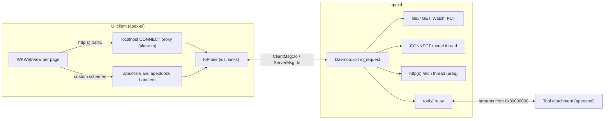
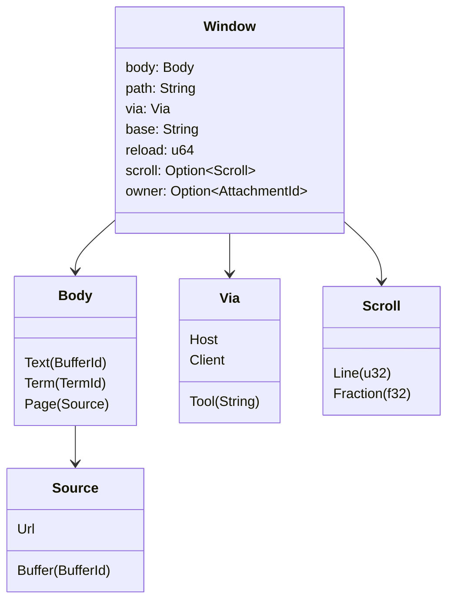
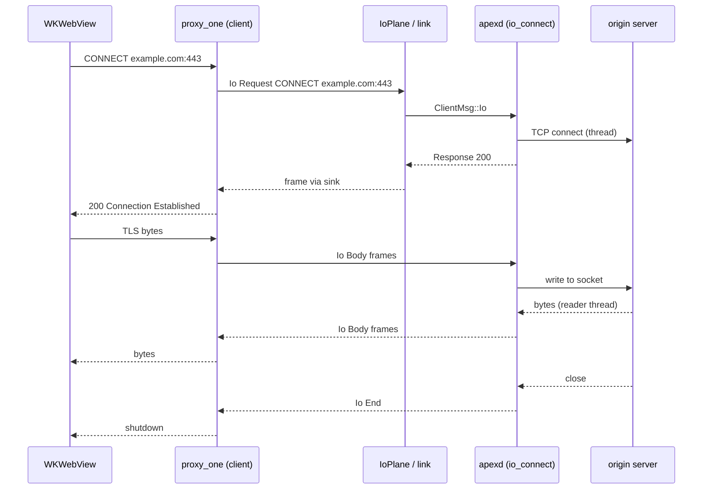
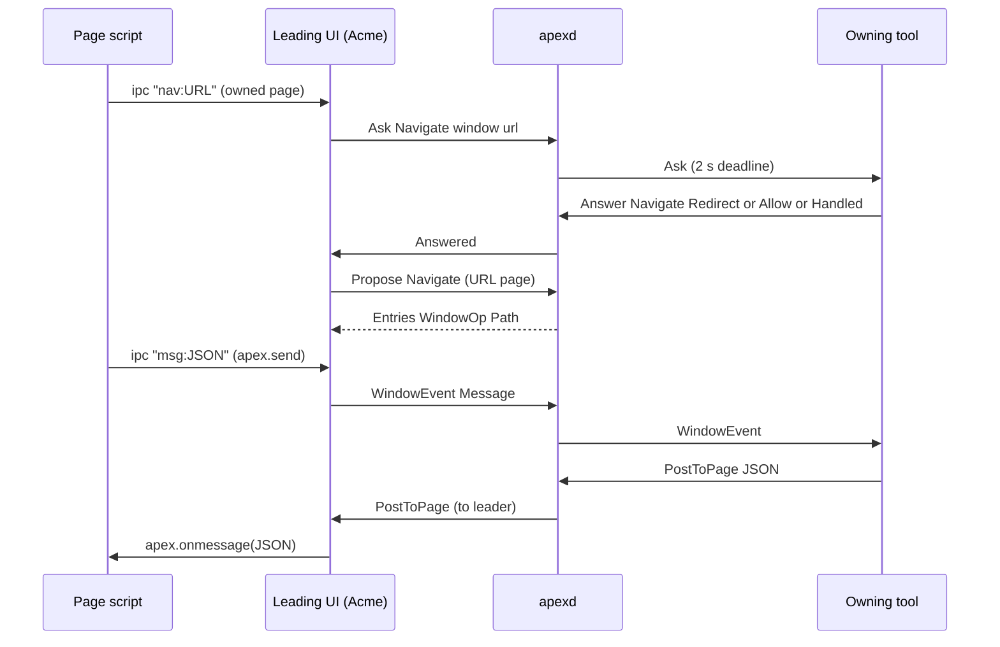

# The I/O Plane and Pages

A **page** is a window whose body the client draws as a web document instead of text or a terminal grid. Preview's rendered Markdown, `apex diff`'s side-by-side view, the agent tool's transcripts and a web browser on a URL are all pages. A page is session state like any other window. What it shows, where it has navigated to, how many times it has been reloaded and (for some pages) how far it is scrolled all live in the replicated log, so every client that attaches draws the same page. The pixels are a native `WKWebView` that each UI client places over the window's body rectangle.

Pages need things the log is not built to carry: file bytes, file watches, HTTP fetches and raw TCP tunnels. The **I/O plane** carries them. It is a second set of numbered, HTTP-shaped streams multiplexed over the same session socket as the log, and it is scoped to the connection that opens them. This page covers both halves. For the log side of the wire, see [The Attach Protocol](attach-protocol.md). For how page state changes reach a leader, see [Proposals](proposals.md). For the tools that write pages, see [Preview, Web and Diff Tools](tool-pages.md).

## Two planes on one socket

WEB.md sets out the rule that the two planes never mix. The **log plane** carries entries, leases and proposals, and everything on it is replicated. The **I/O plane** carries `Io { stream, frame }` messages in both directions. They are never logged, they belong to the connection that opened them, and they end when that connection ends. A fenced UI keeps its streams until its connection closes ([WEB.md:114-117](WEB.md#L114-L117)). The plane is "HTTP-shaped and nothing else": reading a file, watching it, fetching a URL and opening a tunnel are all requests. The frames are postcard-encoded like every other message. HTTP/1.1 text never appears on the wire.



Sources: [WEB.md:21-36](WEB.md#L21-L36), [WEB.md:59-160](WEB.md#L59-L160), [crates/apex-server/src/proto.rs:204-246](crates/apex-server/src/proto.rs#L204-L246)

## Frames and streams

`IoFrame` has five variants, and both directions use the same type:

```rust
pub enum IoFrame {
    Request { method: String, url: String, headers: Vec<(String, String)> },
    Response { status: u16, headers: Vec<(String, String)> },
    Body(Vec<u8>),
    End,
    Reset { reason: String },
}
```

A client opens a stream by sending `Request` on an id it picks itself. `IoIds` hands out odd, increasing numbers, starting at 1 and stepping by 2 ([plane.rs:17-29](crates/apex-server/src/plane.rs#L17-L29)). The server answers with `Response`, any number of `Body` frames, and `End`. Either side may send `Reset` to abort. A client never sends `Response`, and the daemon ignores one if it arrives ([daemon.rs:1048](crates/apex-server/src/daemon.rs#L1048)).

On a watch stream, each `Body` holds a postcard-encoded `FileFrame { version, path, bytes }`. The version starts at 1 and goes up by one on each change ([proto.rs:229-246](crates/apex-server/src/proto.rs#L229-L246)).

The daemon tracks each connection's open streams in `Conn::streams: HashMap<u32, IoStream>`. One enum says what each stream is:

| `IoStream` | Opened by | Held state |
|---|---|---|
| `Watch { path, version }` | `GET file://…` with header `Watch: 1` | the path and the stream's own version counter |
| `Put { path, body }` | `PUT file://…` | the body gathered so far; the file is written on `End` |
| `Tunnel { sock, pending, headed }` | `CONNECT host:port` | the socket once it connects, bytes that arrived before then, and whether the 200 has been sent |
| `Fetch { method, url, headers, body, started, headed }` | `http://` or `https://` | the request; the body is gathered until `End` |
| `Relay { conn, stream }` | `tool://NAME/…` | the other half of the relay, on the tool's connection |

Sources: [crates/apex-server/src/proto.rs:214-276](crates/apex-server/src/proto.rs#L214-L276), [crates/apex-server/src/daemon.rs:136-174](crates/apex-server/src/daemon.rs#L136-L174), [crates/apex-server/src/plane.rs:17-54](crates/apex-server/src/plane.rs#L17-L54)

## What the daemon answers

`Daemon::io` receives every client frame. It first checks whether the stream is half of a relay. If so, it forwards the frame unchanged to the other half and tears both halves down on a `Reset`, or on an `End` from the tool's side. Otherwise it dispatches on the frame type ([daemon.rs:983-1050](crates/apex-server/src/daemon.rs#L983-L1050)). `io_request` picks the handler from the method and the URL scheme ([daemon.rs:1052-1108](crates/apex-server/src/daemon.rs#L1052-L1108)):

- **`file://`**, or a bare absolute path, is resolved by `file_url_path`. It accepts `file:///p` and `file://localhost/p` and percent-decodes the result.
  - A plain `GET` reads the file and replies `200` with `Content-Length`, then sends the bytes in 256 KiB chunks and `End`.
  - A `GET` carrying a non-empty, non-`0` `Watch` header subscribes the session's `Server` file watcher to the path (`server.subscribe`). It replies `200` with `Watch: 1` and sends a first `FileFrame` with version 1. The stream then stays open.
  - A `PUT` stores a `Put` stream and writes the file when the client sends `End`.
  - Any other method gets `405`. An I/O error is mapped by `io_status` to a status code such as 404 or 403, with the message as the body.
- **`CONNECT host:port`** (a `tcp://` prefix is accepted too) is handled by `io_connect`. It spawns a thread that resolves the target and tries each address with a 15-second timeout. The thread hands a clone of the socket back to the state thread as `IoUp::Connected`, then reads from the socket and posts each chunk as `IoUp::Data`. The state thread writes everything the client sends straight into the socket. Bytes that arrive before the connection is up are kept in `pending` and flushed once it is ([daemon.rs:1110-1159](crates/apex-server/src/daemon.rs#L1110-L1159)). An `End` from the client half-closes the socket with `shutdown(Write)`. The stream ends when the far end closes.
- **`http://` and `https://`** are handled by `io_fetch`, which fetches with `ureq` on a thread and sets `http_status_as_error(false)` so that every status passes through. The `Host` and `Content-Length` headers are dropped. For `GET`, `HEAD`, `DELETE` and `OPTIONS` the fetch starts immediately. For any other method the daemon gathers the body until the client's `End` ([daemon.rs:1161-1204](crates/apex-server/src/daemon.rs#L1161-L1204)). The daemon does no TLS of its own: for `https` the host's HTTP client does it, and inside a tunnel the web view does.
- **`tool://NAME/…`** goes to `io_relay` (see below).
- Any other scheme gets `501`.

Results from the worker threads come back to the single state thread as `Event::Io(conn, stream, IoUp)`. `io_up` then forwards them, but only while the stream is still open. A failure before the response head becomes `502` with the reason as the body. A failure after the head becomes `Reset` ([daemon.rs:1206-1248](crates/apex-server/src/daemon.rs#L1206-L1248)).

### Watches as streaming responses

There is one filesystem subscription per path per session. It is shared with the watcher the server already runs for open files, and the open streams act as its reference count. When the watcher reports a change, `file_changed` reads the file once and sends a new `FileFrame` to every `Watch` stream on that path in every connection of the session. Each stream bumps its own version first ([daemon.rs:1308-1333](crates/apex-server/src/daemon.rs#L1308-L1333)). When a watch stream ends, whether by `End`, `Reset` or the connection going, `unwatch_unused` drops the subscription if no other stream still wants the path ([daemon.rs:1335-1352](crates/apex-server/src/daemon.rs#L1335-L1352)). This design replaced the older `ReadFile`, `Watch` and `Unwatch` messages along with the per-connection `watched` sets ([WEB.md:146-153](WEB.md#L146-L153)).

### Tool-served requests and the relay

A page `via` a tool loads `tool://NAME/path`. `io_relay` looks for a connection in the session whose attachment is named `NAME`. If it finds one, `relay_to` opens a stream on that connection, numbered from `RELAYED = 0x8000_0000` upward so that it cannot collide with the odd ids the tool picks for itself. It records each half as the other's `Relay` and forwards the `Request` ([daemon.rs:1251-1281](crates/apex-server/src/daemon.rs#L1251-L1281)).

If no such tool is attached but a rule whose action is `Tool(NAME)` has a `start` command, the request is held as `Held::Stream` and the command is run. When the tool says hello, the held request is relayed to it ([daemon.rs:631](crates/apex-server/src/daemon.rs#L631)). If the tool does not attach within `START_WAIT` (10 s), the request gets `503`. With no rule to start the tool, it gets `503` straight away ([daemon.rs:1393-1425](crates/apex-server/src/daemon.rs#L1393-L1425)). See [Plumbing](plumbing.md) for `start`.

On the tool's side, `apex-tool` treats incoming streams at or above `0x8000_0000` as requests. It gathers each one's body until `End` and then emits `Event::Request(Served)`. The tool answers with `Tool::respond(req, status, headers, body)`, which sends `Response`, the body in chunks, and `End` ([apex-tool/src/lib.rs:214-230](crates/apex-tool/src/lib.rs#L214-L230), [lib.rs:474-503](crates/apex-tool/src/lib.rs#L474-L503), [lib.rs:547-559](crates/apex-tool/src/lib.rs#L547-L559)).

Sources: [crates/apex-server/src/daemon.rs:983-1352](crates/apex-server/src/daemon.rs#L983-L1352), [crates/apex-server/src/daemon.rs:1393-1425](crates/apex-server/src/daemon.rs#L1393-L1425), [crates/apex-tool/src/lib.rs:474-559](crates/apex-tool/src/lib.rs#L474-L559)

## The plane from a client's side

A program has two ways to use the plane.

**Pumped by the owner.** `Remote` exposes `io_open`, `io_send`, `io_end`, `io_take`, `io_response`, `io_collect` and `io_next_file`, plus the helpers `read_file` and `watch`. These read frames from `link.io` as the owner steps the link. The CLI's `apex io` is built this way ([remote.rs:804-925](crates/apex-server/src/remote.rs#L804-L925)).

**From threads.** `IoPlane` (in `plane.rs`) is a cloneable handle made of the link's `Outbound` sender, the shared `IoIds`, and an `IoSinks` registry that maps a stream to an mpsc `Sender`. `IoPlane::open` registers a sink before it sends the request. The link's reader thread (`spawn_reader`) offers every `ServerMsg::Io` to the sinks first, so frames for a stream that a thread is waiting on go straight to that thread and never reach the UI's queue ([remote.rs:1056-1082](crates/apex-server/src/remote.rs#L1056-L1082)). `IoPlane::fetch` performs one whole request with a timeout. It sends `End` after the body, or with no body for `http*` and `tool://` URLs. For a plain `GET file://` the daemon needs no `End`. The result is `(status, headers, body)`, or an error such as "timed out waiting for the host" ([plane.rs:56-138](crates/apex-server/src/plane.rs#L56-L138)).

`apex io [-watch] METHOD URL` drives the plane from a shell: `GET` and `PUT` on files, a watch, `GET` on a URL fetched by the host, and `CONNECT HOST:PORT` acting as `nc` ([apex-cli/src/main.rs:436-449](crates/apex-cli/src/main.rs#L436-L449)). These integration tests exercise the plane: `a_watched_file_streams_its_changes_until_unwatched`, `tunnels_and_fetches_go_through_the_host` and `a_web_views_proxy_and_files_ride_the_plane` in [crates/apex-cli/tests/cli.rs](crates/apex-cli/tests/cli.rs#L397).

Sources: [crates/apex-server/src/plane.rs:56-138](crates/apex-server/src/plane.rs#L56-L138), [crates/apex-server/src/remote.rs:804-925](crates/apex-server/src/remote.rs#L804-L925), [crates/apex-server/src/remote.rs:1056-1140](crates/apex-server/src/remote.rs#L1056-L1140)

## The Page kind in the core

A window's body is one of `Text`, `Term` or `Page(Source)` ([entry.rs:45-56](crates/apex-core/src/entry.rs#L45-L56)). A page's state is split between the body and fields that every `Window` carries:

| Piece | Where | Meaning |
|---|---|---|
| `Source::Buffer(id)` | `Body::Page` | The document is a buffer's HTML. It is written with ordinary edits, replicated, and patched in place on change. Used by Preview, diffs and the agent's pages. |
| `Source::Url` | `Body::Page` | The document is at `Window::path`. |
| `Via::Host` (the default) | `Window::via` | The document and its resources are fetched through the session's host: its network, and its files as `file:///…`. |
| `Via::Client` | `Window::via` | Fetched by the machine showing the window. Only the user makes these, never a tool. |
| `Via::Tool(name)` | `Window::via` | Served by that tool over the plane (`tool://name/…`). |
| `base` | `Window::base` | Where relative addresses resolve. If empty for a buffer page, the folder of the buffer's name is used. |
| `reload` | `Window::reload` | A counter. Each client loads the page again when it moves. |
| `scroll` | `Window::scroll` | Buffer pages only: `Scroll::Line(n)` (the last `data-line` marker at or before source line n) or `Scroll::Fraction(f)`. |

`WindowOp::Create` carries `via` and `base` alongside the body and path. Three window ops change a page afterwards. `Path` records a navigation, `Reload` bumps the counter, and `PageScroll` sets the scroll. `State::apply` handles them in [state.rs:641-646](crates/apex-core/src/state.rs#L641-L646). `State::hash` includes `via`, `base`, `reload` and `scroll`, so replicas that diverge on page state are detected ([state.rs:923-932](crates/apex-core/src/state.rs#L923-L932)).

On the leader, `Node::open_page` turns a `NewPage { content, via, base, label }` into entries. For `NewContent::Html`, it creates a scratch buffer of `WinKind::Page`, then the window. For `NewContent::Url`, it creates a window whose path is the URL. `reload_page` refuses a window that is not a page. `scroll_page` refuses anything but a buffer page, because a URL page scrolls on the client, and it appends nothing if the scroll value is unchanged. `web_navigate` accepts only `Source::Url` pages and appends `WindowOp::Path` when the URL differs. A page's link history deliberately stays off the session's navigation stack: "its history is its tool's" ([node.rs:620-724](crates/apex-core/src/node.rs#L620-L724)). Other attachments reach these through `Proposal::OpenPage`, `Navigate`, `Reload` and `PageScroll` ([proposal.rs:43-55](crates/apex-server/src/proposal.rs#L43-L55), [proposal.rs:202-218](crates/apex-server/src/proposal.rs#L202-L218)). The SDK wraps them as `Tool::new_page`, `new_web_page`, `navigate` and `reload` ([apex-tool/src/lib.rs:661-707](crates/apex-tool/src/lib.rs#L661-L707)).



Sources: [crates/apex-core/src/entry.rs:45-113](crates/apex-core/src/entry.rs#L45-L113), [crates/apex-core/src/entry.rs:184-208](crates/apex-core/src/entry.rs#L184-L208), [crates/apex-core/src/state.rs:46-100](crates/apex-core/src/state.rs#L46-L100), [crates/apex-core/src/node.rs:620-724](crates/apex-core/src/node.rs#L620-L724), [ARCHITECTURE.md:705-751](ARCHITECTURE.md#L705-L751)

## Drawing pages on the client: `web.rs`

`Webs` owns one `WebHost` per page window. A `WebHost` wraps a `wry::WebView` built as a child of gpui's window with `build_as_child`, which on macOS is a `WKWebView`. `Webs` also owns the shared event channel, the session's `IoPlane`, and the port of the `CONNECT` proxy. `Acme::io_plane` returns a plane only when the backend is a remote link. An in-process `Backend::Local` has none, and its views use their own network and read files from disk directly ([app.rs:4361-4368](crates/apex-client/src/app.rs#L4361-L4368)).

### Placement every frame

The body element calls `Acme::web_place(w, bounds)` each time it is laid out ([app.rs:4273-4327](crates/apex-client/src/app.rs#L4273-L4327)). It creates `Webs` with a plane the first time a view is wanted. It then branches on the body:

- **Buffer page.** The client reads the buffer's text and version and works out the directory: `base`, or else the buffer name's folder. It calls `Webs::place_html`. On first use, `build` loads the HTML after `dress` has rewritten it. `dress` turns `file://` links in `href`, `src`, `srcset`, `poster`, `action` and CSS `url()` into `apexfile://localhost…`, adds `<base href="apexfile://localhost DIR/">` unless the page brings its own, and puts a `<style id="apex-theme">` with the `--apex-*` colours at the start of the head ([web.rs:1848-1938](crates/apex-client/src/web.rs#L1848-L1938)). When the version changes, the page is not reloaded. Instead, `morph_script` patches the DOM in place by matching nodes by position and name. Scroll position and page state survive the patch, and a drawn Mermaid diagram is kept while its source is unchanged ([web.rs:1940-1974](crates/apex-client/src/web.rs#L1940-L1974)). If `Window::scroll` is set, `Webs::follow` applies it once per new value: to a `data-line` marker a quarter of the way down the view, or to a fraction of the page ([web.rs:1461-1498](crates/apex-client/src/web.rs#L1461-L1498)).
- **URL page.** If `page_orphaned` finds that the page's `Via::Tool` has no attachment, the client draws a placeholder rather than a page ([app.rs:4353-4359](crates/apex-client/src/app.rs#L4353-L4359)). Otherwise `Webs::place` builds the view on `webkit_url(path)`. If the window's path later differs from the URL the view last loaded or reported, the state has moved the page (a Goto, another client, a tool's `navigate`), and the view loads the new path ([web.rs:1071-1087](crates/apex-client/src/web.rs#L1071-L1087)). `set_owned` tells the page through `window.__apexOwned` whether a tool owns it.
- **Both.** `Webs::reloads(w, win.reload)` reloads the view when the logged counter moves. It ignores the counter's first value ([web.rs:1500-1525](crates/apex-client/src/web.rs#L1500-L1525)).

After layout, `Webs::settle` hides views for windows the layout does not draw and drops views for windows that are gone. A view that had the keyboard hands it back to gpui first ([web.rs:1272-1296](crates/apex-client/src/web.rs#L1272-L1296)).

### What a view is built with

`build` installs a set of initialization scripts and handlers ([web.rs:1106-1270](crates/apex-client/src/web.rs#L1106-L1270)):

| Piece | Purpose |
|---|---|
| `CURSOR_SCRIPT` | Reports the CSS cursor under the pointer (`cursor:`) and button presses (`down:`). WebKit's own cursor never reaches the screen inside this window. |
| `KEEP_SCRIPT` | Keeps the page's selection painted while the keyboard is elsewhere (`__apexAway`/`__apexBack`). |
| `SCROLL_SCRIPT` | Hides the page's own scrollbar with a constructed stylesheet and reports `scroll:top,height,view` once per frame when it changes, for acme's scrollbar drawn beside the view. |
| `NAV_SCRIPT` | On a page a tool owns, intercepts plain left-clicks on links in the main document and posts `nav:URL` instead of following them. |
| `BRIDGE_SCRIPT` | Defines `window.apex.send` and `apex.onmessage`, except in an `http:` or `https:` document. |
| `FILE_SCRIPT`, `ANCHOR_SCRIPT`, `COPY_SCRIPT`, `MERMAID_SCRIPT`, `TOC_SCRIPT` | Installed for buffer pages only: file links made by scripts, anchors, copy handles on code blocks, Mermaid on request, and the table of contents. |
| Page-load handler | `Loading(started)` events. For URL pages it also reports `Navigated(apex_url(url))` from the main frame's URL, ignoring `about:` pages. |
| Navigation handler | File links with a line, or to files a view does not show itself, become `Open(path, line)`. In buffer pages every link becomes `Link`. `file://` and bare-loopback links are rerouted. Everything else proceeds. |
| Proxy config | For any page that is not `Via::Client`, `wry::ProxyConfig::Http` pointing at the local `CONNECT` proxy. |
| `apexfile` and `apextool` protocols | Asynchronous custom-scheme handlers, each request served on its own thread by `Fetcher`. |

### URL forms

The session and WebKit spell some URLs differently. `webkit_url` and `apex_url` convert between the two forms, and the session only ever sees its own ([web.rs:1998-2030](crates/apex-client/src/web.rs#L1998-L2030)):

| Session form | View form | Why |
|---|---|---|
| `tool://NAME/p` | `apextool://NAME/p` | WKWebView can only intercept custom schemes. |
| `apexfile:///p` | `apexfile://localhost/p` | WebKit dispatches a custom scheme only when the URL has a host. |
| `http://127.0.0.1:N/…` | `http://127-0-0-1.apex-host:N/…` | A web view never sends a loopback name through a proxy, so the host's loopback travels under an alias that the proxy undoes. |
| `http://localhost/…` | `http://localhost.apex-host/…` | Same reason. |

Sources: [crates/apex-client/src/web.rs:1-66](crates/apex-client/src/web.rs#L1-L66), [crates/apex-client/src/web.rs:529-564](crates/apex-client/src/web.rs#L529-L564), [crates/apex-client/src/web.rs:611-728](crates/apex-client/src/web.rs#L611-L728), [crates/apex-client/src/web.rs:1071-1270](crates/apex-client/src/web.rs#L1071-L1270), [crates/apex-client/src/app.rs:4273-4327](crates/apex-client/src/app.rs#L4273-L4327)

## Network through the host: the CONNECT proxy

`WKWebView` cannot intercept `http` or `https` with a scheme handler, but on macOS 14 and later it accepts a proxy configuration per data store ([WEB.md:353-369](WEB.md#L353-L369)). `start_connect_proxy(plane)` binds `127.0.0.1:0` and accepts connections, each handled on its own thread by `proxy_one` ([plane.rs:198-296](crates/apex-server/src/plane.rs#L198-L296)). For each connection, `proxy_one`:

1. Reads the request head byte by byte up to the blank line, with a 64 KiB cap. Anything other than `CONNECT` gets `405`.
2. Undoes the loopback alias in the target host (`unalias_host`).
3. Opens a `CONNECT` stream on the plane and waits up to 30 s for the answer. A non-200 answer becomes `502 Bad Gateway`, with the plane's status in `X-Apex-Status`. No answer becomes `504`.
4. Replies `200 Connection Established`. It then pumps the socket into the stream on one thread, sending `End` when the socket closes, and pumps the stream's `Body` frames into the socket until `End` or `Reset`.

TLS runs between the page and the origin, end to end through the tunnel. The page therefore sees the host's network: on a remote session, an internal dashboard on the remote machine loads as it would there. The alias has known gaps. Absolute loopback URLs in a page's own resources still go to the client's loopback, and the page's server sees the alias in its `Host` header ([WEB.md:334-351](WEB.md#L334-L351)). `APEX_WEB_DEBUG` in the environment makes the proxy and the views log what they do.



Sources: [crates/apex-server/src/plane.rs:140-296](crates/apex-server/src/plane.rs#L140-L296), [crates/apex-client/src/web.rs:771-787](crates/apex-client/src/web.rs#L771-L787), [WEB.md:332-369](WEB.md#L332-L369)

## `apexfile://` and `apextool://`

`Fetcher::serve` answers `apexfile://` requests ([web.rs:1546-1620](crates/apex-client/src/web.rs#L1546-L1620)). It serves the bundled fonts first, from the client itself (`fonts::serve`). Otherwise it strips `localhost` (and the alias, if present), decodes the path, and fetches it with `plane.fetch("GET", file_url(path))`, or reads the disk when there is no plane. The content type comes from `mime_for` on the extension ([plane.rs:298-321](crates/apex-server/src/plane.rs#L298-L321)). Every response carries `Access-Control-Allow-Origin: *`.

After a successful fetch, `Fetcher::watch` opens a `Watch: 1` stream on the path. There is at most one such stream per path per page, and at most 200 per page. The first frame is skipped because it holds the file the page already has. Each later `FileFrame` sends `WebEvent::Reload`. The watches end when the `WebHost` is dropped ([web.rs:1622-1659](crates/apex-client/src/web.rs#L1622-L1659), [web.rs:582-592](crates/apex-client/src/web.rs#L582-L592)). Editing an image or stylesheet on the host therefore reloads the page that uses it. For a buffer page, a reload marks its version stale (`u64::MAX`), and the next placement morphs it.

`Fetcher::serve_tool` turns `apextool://NAME/…` into `tool://NAME/…` and passes the method and body through with `plane.fetch`. It takes the content type from the tool's `Content-Type` header, or else from the extension. With no plane it answers `503`, because an in-process session has no tools to ask.

Sources: [crates/apex-client/src/web.rs:1546-1659](crates/apex-client/src/web.rs#L1546-L1659), [crates/apex-server/src/plane.rs:298-321](crates/apex-server/src/plane.rs#L298-L321)

## Page events, owners and the script bridge

Views report into `Webs`' channel. `Acme::web_events` drains it each sync and acts on each event ([app.rs:4414-4475](crates/apex-client/src/app.rs#L4414-L4475)):

- `Navigated(url)` records the URL in the host, so that the window's name following it is not mistaken for a move to load. It tells the owner, and proposes `Navigate` if the window's path differs. Only the client that leads proposes; a watching client follows the log.
- `Ask(url)`, and `Link(url)` on an owned page, become `ClientMsg::Ask { Request::Navigate }`. The daemon forwards the ask to the window's owner and gives it `ASK_ANSWER` (2 s) to reply. If nobody owns the window, or the owner does not answer in time, the asker receives `Answered { answer: None }` ([daemon.rs:768-791](crates/apex-server/src/daemon.rs#L768-L791), [daemon.rs:209](crates/apex-server/src/daemon.rs#L209)). `page_answers` carries out the reply. `Handled` does nothing. `Redirect(u)` goes to `u`. `Allow`, `Default` or no answer go to the original URL. For a URL page this is a `Navigate` proposal when the target is `http(s)`, `apexfile`, `file` or `tool`; any other target is passed to the system's `open`. For a buffer page the link is followed with `follow_link`: an off-host `http(s)` link goes to the system browser, and anything else becomes a `Goto` ([app.rs:4477-4559](crates/apex-client/src/app.rs#L4477-L4559)).
- `Title`, `Loading` and `Message` are sent to the owner as `ClientMsg::WindowEvent`, which the daemon delivers only to the owner's connection ([daemon.rs:801-809](crates/apex-server/src/daemon.rs#L801-L809)). `Message` is forwarded only if `bridged(w)` holds: the page is a buffer page, or a `Via::Tool` page at a `tool://` path. A page fetched from the web never speaks to an owner, even if it fakes `window.ipc` ([app.rs:4497-4506](crates/apex-client/src/app.rs#L4497-L4506)).
- `Copy` puts a code block's text into the snarf buffer (`LayoutOp::Snarf`) and onto the clipboard. `Scroll` updates the scrollbar thumb, `Cursor` updates the pointer, `Reroute` loads an aliased or `apexfile` URL and proposes the new path, and `Open` becomes a `Goto` at a line.

`page_owned(w)` holds only for a remote, unfenced client showing a page owned by an attachment other than its own. This is how "only the leading client reports what happens in a page" is enforced ([app.rs:4491-4495](crates/apex-client/src/app.rs#L4491-L4495)).

The bridge also runs the other way. A tool calls `Tool::post_to_page(w, json)`, which sends `ClientMsg::PostToPage`. The daemon accepts it only from the window's owner and forwards it to the session's leader, which queues it in `link.page_posts`. `page_answers` hands it to `Webs::post`, and that calls `window.apex.onmessage(json)` in the page. Posted messages are never logged ([daemon.rs:792-800](crates/apex-server/src/daemon.rs#L792-L800), [web.rs:1433-1439](crates/apex-client/src/web.rs#L1433-L1439)). A tool opts into navigation questions and page events with `Tool::handle_pages` ([apex-tool/src/lib.rs:561-583](crates/apex-tool/src/lib.rs#L561-L583)).



Sources: [crates/apex-client/src/app.rs:4414-4559](crates/apex-client/src/app.rs#L4414-L4559), [crates/apex-server/src/daemon.rs:768-809](crates/apex-server/src/daemon.rs#L768-L809), [crates/apex-server/src/proto.rs:132-143](crates/apex-server/src/proto.rs#L132-L143), [crates/apex-server/src/proto.rs:404-449](crates/apex-server/src/proto.rs#L404-L449), [ARCHITECTURE.md:753-773](ARCHITECTURE.md#L753-L773)

## Back, Fwd, Get and the web header

A URL page has no tag text. `webbar.rs` draws a header in the tag's place instead ([webbar.rs:86-177](crates/apex-client/src/webbar.rs#L86-L177)). It holds the window's handle, which moves, resizes and minimizes the window like any other, plus back and forward buttons and an address pill. Clicking the pill starts a `UrlEdit` on a `LineEdit` pre-filled with the window path. Enter passes the typed text through `address()` and calls `node.web_navigate`. `address()` keeps any text with a scheme, `about:` or `data:` as it is. Text starting with `/` or `~` becomes `file://…`. Text starting with `localhost` or `127.0.0.1` becomes `http://…`, and anything else becomes `https://…` ([webbar.rs:33-84](crates/apex-client/src/webbar.rs#L33-L84)). While an address is being typed, `overlay_up` is true, which keeps the keyboard away from the pages.

`Acme::page_nav` handles the buttons and the tag words Back, Fwd and Get. On a page a tool owns, it proposes `Exec` of the word in the window, so the tool, which keeps the page's history, answers. On any other page, Get proposes `Reload`, so every client loads the page again, and Back and Fwd use the view's own WebKit history (`Webs::go`) ([app.rs:4329-4351](crates/apex-client/src/app.rs#L4329-L4351)).

A buffer page can declare words of its own with `<meta name="apex-verbs" content="Prev Next">`. `page_verbs` parses them from the first 8 KiB of the HTML, and B2 on one of those words runs `window.apexVerb(word)` in the page (`Webs::verb`). `apex diff`'s Prev and Next work this way ([web.rs:2032-2048](crates/apex-client/src/web.rs#L2032-L2048), [web.rs:1339-1345](crates/apex-client/src/web.rs#L1339-L1345)).

Sources: [crates/apex-client/src/webbar.rs:1-192](crates/apex-client/src/webbar.rs#L1-L192), [crates/apex-client/src/app.rs:4329-4351](crates/apex-client/src/app.rs#L4329-L4351), [crates/apex-client/src/web.rs:1010-1019](crates/apex-client/src/web.rs#L1010-L1019)

## Living with a native view

A `WKWebView` draws above everything gpui paints and keeps pointer events to itself. The client works around this in four ways.

- **Holes for overlays.** As each overlay (picker, finder, tools menu, toast) is laid out, it records its bounds. `Webs::set_holes` then masks each view's layer with a `CAShapeLayer`: the view's rectangle minus the overlays' (even-odd fill), widened by each panel's shadow margin. The overlay shows through and the page stays live around it. The same rectangles, without the margins, go to a hit-test override, so clicks inside an overlay belong to the overlay. With no overlay over a view, the mask is removed ([web.rs:834-932](crates/apex-client/src/web.rs#L834-L932)).
- **The veil.** While a dialog dims the window, `set_veil` adds a `CALayer` of the veil's colour inside each page's own layer, at a high z-position, so the same holes cut it ([web.rs:934-997](crates/apex-client/src/web.rs#L934-L997)).
- **Keys follow the pointer.** `focus_tick` runs on a timer. It asks AppKit where the pointer is (`native_mouse`) and gives the keyboard to the page under it, or back to gpui's view (`focus_ui`) when the pointer is elsewhere, saving and restoring the page's selection as it goes ([web.rs:1021-1062](crates/apex-client/src/web.rs#L1021-L1062)). With the pointer over a page, the Edit menu's Copy, Cut, Paste and Select All go to WebKit's own selectors (`Webs::edit`).
- **Find in a page.** Look in a page's tag runs `LOOK_SCRIPT`. It uses `window.find` and marks matches with CSS custom highlights, so a morph neither drops the marks nor diffs against them ([web.rs:1347-1374](crates/apex-client/src/web.rs#L1347-L1374)). See [Mouse, Keyboard and Look](client-input.md).

Linux (WebKitGTK) placement and its proxy configuration are open questions. Most of the AppKit-specific code above is compiled out or stubbed off macOS.

Sources: [crates/apex-client/src/web.rs:789-1062](crates/apex-client/src/web.rs#L789-L1062), [WEB.md:38-51](WEB.md#L38-L51), [WEB.md:653-661](WEB.md#L653-L661)

## Design status and what remains

ARCHITECTURE.md §5's note dated October 2026 lists what is built: the Page kind (`Body::Page`, `Source`, `Via`), its state in the log, the request and event framework (`Ask`/`Answer`, `WindowEvent`, `PostToPage`), tool-served pages, the script bridge, and Preview and Web as tools started when first wanted. Three special cases from before remain. Page verbs are still parsed from HTML (`apex diff` has no tool to answer them), Look in a page still goes through `Node`'s `page_finds` queue, and `ClientDo` is still used for things other than pages ([ARCHITECTURE.md:685-696](ARCHITECTURE.md#L685-L696)).

Older sections of WEB.md describe `Body::Web`, `Body::Html`, `OpenWeb`, `OpenHtml` and `WebNavigate`. Those names are gone; where WEB.md and ARCHITECTURE.md §5 disagree, §5 describes what runs. The review in ARCHITECTURE.md also notes that the daemon's own HTTP fetch overlaps with `CONNECT` tunnelling, and that folder listings could become `GET file:///dir/` on the plane ([ARCHITECTURE.md:513-521](ARCHITECTURE.md#L513-L521)).

Sources: [ARCHITECTURE.md:670-869](ARCHITECTURE.md#L670-L869), [WEB.md:11-17](WEB.md#L11-L17)
