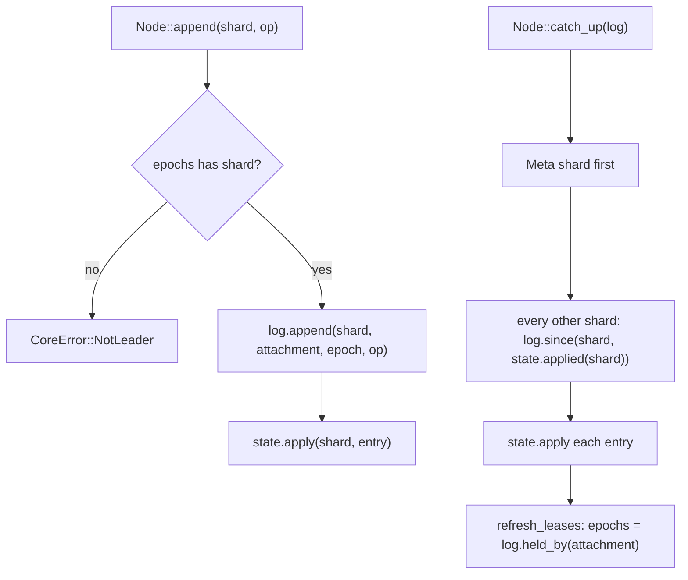
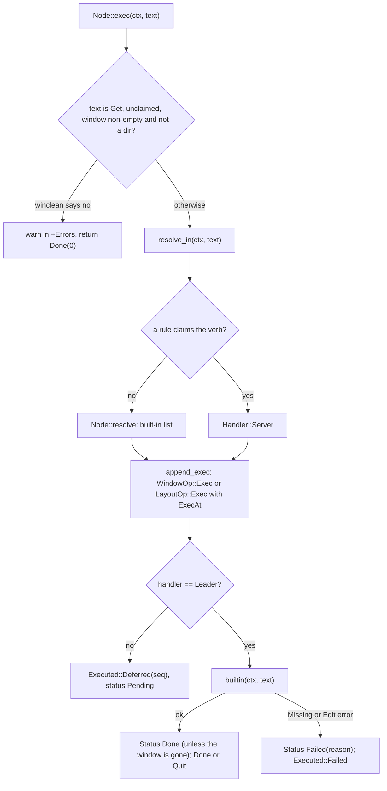
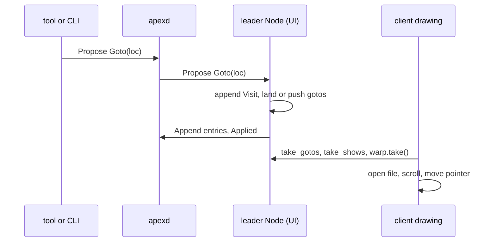

# The Node: Leading and Built-in Commands

`Node` (in `crates/apex-core/src/node.rs`) is a replica of a session. It is the one object that both the gpui client and the daemon use to read and change session state. Every node holds a full `State` and keeps it current by replaying the log. For the shards it holds a lease on, it is also the **leader**: it turns user actions into entries, appends them to the log and applies them. Those actions are typing, selecting, cut and paste, undo, Look, running an Edit program, and the built-in commands such as `New`, `Del`, `Zerox` and `Sort`. The module's own summary says it: "As leader of a shard a node performs the built-in commands, types, selects, and lowers Edit programs into entries; as follower it catches up." ([node.rs:1-4](crates/apex-core/src/node.rs#L1-L4))

This page sits between three others. [Sessions, Shards and Leadership](sessions-and-replication.md) explains leases and shards. [Entries, State and Apply](core-state.md) describes the entries a node writes and how `State::apply` interprets them. [Buffers, Views and Undo](buffers-and-text.md) explains what an edit entry does to a buffer. Pixel geometry is covered on [Tiling and Layout](tiling-and-layout.md) and the Edit language on [The Edit Language](edit-language.md). Changes made by others reach a node as proposals, described in [Proposals](proposals.md).

## Who runs a Node

The UI client and the daemon both build nodes with `Node::new(attachment)`. Tools and the CLI build them through `Remote`.

| Where | Attachment | Role |
|---|---|---|
| `apex-client` `Acme` ([app.rs:737](crates/apex-client/src/app.rs#L737), [app.rs:819](crates/apex-client/src/app.rs#L819)) | the UI's own | Leads buffers, windows and layout once it takes the leases; supplies real font metrics through `node.tiling` ([app.rs:2592](crates/apex-client/src/app.rs#L2592)) |
| `apexd` session view ([daemon.rs:386](crates/apex-server/src/daemon.rs#L386)) | `SERVER` | Always a follower of UI-led shards; leads them itself while no UI is attached, applying proposals as a headless leader |
| `Server` in `apex-server` ([lib.rs:178](crates/apex-server/src/lib.rs#L178)) | `SERVER` | The replica the server reads from |
| `Remote` for tools and the CLI ([remote.rs:257](crates/apex-server/src/remote.rs#L257)) | the tool's | Follower only; changes things by proposing |

Many methods are written for any leader to call. A headless leader uses the default `tiling::Headless` metrics. Its effect queues (below) are drained by the daemon or simply capped.

Sources: [crates/apex-core/src/node.rs:1-4](crates/apex-core/src/node.rs#L1-L4), [crates/apex-core/src/node.rs:267-288](crates/apex-core/src/node.rs#L267-L288), [crates/apex-server/src/daemon.rs:1522-1549](crates/apex-server/src/daemon.rs#L1522-L1549), [ARCHITECTURE.md:27-38](ARCHITECTURE.md#L27-L38)

## The Node struct

```rust
pub struct Node {
    pub state: State,
    pub attachment: AttachmentId,
    epochs: BTreeMap<Shard, Epoch>,      // leases this node believes it holds
    next_id: u64,
    next_group: u64,
    typing: Option<(ViewId, GroupId)>,   // the run of typing and its undo group
    pub seltext: Option<ViewId>,         // acme's seltext
    pub shows: Vec<(ViewId, usize)>,
    pub gotos: Vec<Loc>,
    pub client_finds: Vec<(WindowId, String, bool)>,
    pub switches: Vec<Loc>,
    pub quit_requested: bool,
    warned: BTreeMap<WindowId, Version>, // Del's warn-once memory
    edit: EditLang,                      // the Edit interpreter (remembers the last regexp)
    pub tiling: Box<dyn tiling::Info + Send + Sync>,
    pub warp: Option<Warp>,
    pub activecol: Option<ColumnId>,     // acme's activecol
}
```

Only `state` is replicated. Everything else belongs to this node alone:

- **Interaction state:** `typing`, `seltext`, `activecol` and `warned`. These follow acme's globals of the same names.
- **Effect queues:** `warp`, `shows`, `gotos`, `client_finds`, `switches` and `quit_requested`. They record what a client showing this replica should do next.

The [architecture review](#the-reviews-view) singles out both groups as UI concerns that leak into the core.

Sources: [crates/apex-core/src/node.rs:221-261](crates/apex-core/src/node.rs#L221-L261)

## Replication: following and leading



**Catching up.** `catch_up` applies, shard by shard, every entry the state has not yet seen. The metalog comes first, so shard creations and leases are known before the entries that depend on them ([node.rs:323-342](crates/apex-core/src/node.rs#L323-L342)). It then refreshes `epochs` from the log store rather than from state: "the log store is the fencing authority (a mirror knows the leases the server will honour)" ([node.rs:344-348](crates/apex-core/src/node.rs#L344-L348)).

**Leading.** `leads(shard)` is just `epochs.contains_key(&shard)`. `append` looks up the epoch it holds for the shard, has the log sequence and fence the entry, and applies the result locally. It returns the entry's `Seq` and the `Applied` value from `State::apply`; `undo` uses that value to learn what range to select ([node.rs:350-356](crates/apex-core/src/node.rs#L350-L356)). Every leader operation on this page eventually goes through `append`.

**Shards and leases.**
- `create_shard` catches up first, appends the metalog entries the log store makes, and applies them. On a mirror log (a client's copy, with a hook to the server) the server's metalog entry arrives later. Until then the node inserts the shard into `state.meta.shards` so entries for it can apply ([node.rs:358-372](crates/apex-core/src/node.rs#L358-L372)).
- `delete_shard` does the mirror case the other way round. It applies a fake, unsequenced `ShardDel` through `State::apply_unsequenced` ([node.rs:374-385](crates/apex-core/src/node.rs#L374-L385), [state.rs:541-546](crates/apex-core/src/state.rs#L541-L546)).
- `take_lease` and `release_lease` wrap the log's `grant` and `release` ([node.rs:387-403](crates/apex-core/src/node.rs#L387-L403)).

**Ids without coordination.** `alloc` puts the attachment id in the top bits and a per-node counter in the low 40 bits. Undo groups are built the same way (`new_group`). Two leaders can therefore never mint the same `BufferId`, `WindowId`, `ColumnId` or `GroupId` ([node.rs:304-315](crates/apex-core/src/node.rs#L304-L315)).

The tests rely on one property throughout: after any sequence of leader operations, a fresh follower that replays the log reaches the same `State::hash` ([tests/core.rs:17-21](crates/apex-core/tests/core.rs#L17-L21), [tests/core.rs:32-47](crates/apex-core/tests/core.rs#L32-L47)).

Sources: [crates/apex-core/src/node.rs:290-403](crates/apex-core/src/node.rs#L290-L403), [crates/apex-core/src/log.rs:267-273](crates/apex-core/src/log.rs#L267-L273), [crates/apex-core/tests/core.rs:8-47](crates/apex-core/tests/core.rs#L8-L47)

## Making buffers, windows and columns

A buffer is its own shard. `create_buffer_as` allocates a `BufferId`, creates `Shard::Buffer(id)` and appends `BufferOp::Create` with name, text, disk hash, `WinKind` and the scratch flag ([node.rs:412-418](crates/apex-core/src/node.rs#L412-L418)).

`init_session` sets up a new session:
1. It makes the top row's tag buffer, holding `TOP_TAG` (`"Newcol Newterm Win Web Kill Putall Exit End "`).
2. It creates the layout shard with `LayoutOp::Init` and a guessed 1100×700 rectangle.
3. It makes two columns, as acme's `-c 2` does, and returns the last one ([node.rs:420-432](crates/apex-core/src/node.rs#L420-L432)).

Each column gets a tag buffer holding `COL_TAG` (`"New Cut Paste Snarf Sort Zerox Delcol "`).

A window is three things ([node.rs:518-534](crates/apex-core/src/node.rs#L518-L534)):
- a tag buffer holding only `WIN_TAG` (`"Look "`);
- a `Shard::Window` whose first entry is `WindowOp::Create { tag, body, path, label, via, base }`;
- a view (`ViewAdd`) on the tag buffer and, for text or buffer-page bodies, on the body buffer.

The rest of a tag (the path, the label and apex's own words) is not text in the tag. It is computed from state by `window_verbs`.

`place` then lays the window out with `tiling::coladd` and appends the whole new layout as one `LayoutOp::Arrange` ([node.rs:728-757](crates/apex-core/src/node.rs#L728-L757)). It redirects a window meant for a hidden or stripped column to the nearest open one, and puts a *diagnostic* window straight into the stash. Every layout change in the node works this way: clone `state.layout`, run a function from `tiling`, and `arrange` the result ([node.rs:290-294](crates/apex-core/src/node.rs#L290-L294)).

Other constructors follow the same pattern:

| Function | What it makes |
|---|---|
| `new_window`, `new_window_as(spec)` | A window on a new buffer; `Spec` gives kind, scratch, label and diagnostic |
| `open_window`, `open_window_at` | A window on an existing buffer |
| `make_window` | acme's `makenewwindow`: picks `activecol`, else the column of `seltext`, else of `from`, else a fallback; un-fulls the column; picks a y; grows the window if it has fewer than two lines |
| `open_term_window` | A `Body::Term` window |
| `open_page`, `open_web_window`, `open_html_window` | `Body::Page` windows (see [The I/O Plane and Pages](io-plane-and-pages.md)) |
| `cover_window`, `swap_window`, `raise_window` | Window stacks: one window over another in the same place |
| `zerox` | Another window on the same body buffer, keeping its label |
| `delete_window` | Drops views, restacks, closes or unstashes, deletes the window and tag shards, and deletes the body shard with its last view |

`delete_window` sets `warp` to `Warp::Closed { window, next }` so the client can move the pointer as acme's `colclose` does. It also clears `seltext` and `warned` for the window ([node.rs:1286-1334](crates/apex-core/src/node.rs#L1286-L1334)).

Sources: [crates/apex-core/src/node.rs:405-640](crates/apex-core/src/node.rs#L405-L640), [crates/apex-core/src/node.rs:726-757](crates/apex-core/src/node.rs#L726-L757), [crates/apex-core/src/node.rs:1276-1334](crates/apex-core/src/node.rs#L1276-L1334)

## Editing as leader

All text changes go through one private helper:

```rust
fn edit_op(&mut self, log: &mut Log, buffer: BufferId, q0: usize, nd: usize, text: &str, group: GroupId) -> Result<()> {
    let version = self.state.buffer(buffer)?.version;
    self.append(log, Shard::Buffer(buffer), Op::Buffer(BufferOp::Edit { version, q0, nd, text: text.into(), group }))?;
    Ok(())
}
```

Each edit carries the buffer's current version and an undo `GroupId`. Selections are separate `BufferOp::Select` entries, sequenced in the same shard so every replica agrees on where each view's dot is ([node.rs:1383-1396](crates/apex-core/src/node.rs#L1383-L1396)).

**Typing groups.** `typing` remembers the view being typed into and its group. `typing_group(view)` reuses that group for consecutive keystrokes in the same view, so a run of typing undoes as one step. A mouse selection, a command, `set_content`, `cut`, `undo` and the other non-typing operations call `end_typing()` to start a new group ([node.rs:1367-1381](crates/apex-core/src/node.rs#L1367-L1381)). The test `typing_undoes_as_one_group_until_a_mouse_action` checks exactly this ([tests/core.rs:101-117](crates/apex-core/tests/core.rs#L101-L117)).

| Operation | What it appends |
|---|---|
| `insert(view, text)` | Edit replacing the selection, then Select at its end. A newline in a body with `autoindent` copies the previous line's leading blanks. |
| `erase(view, Erase::{Char,Line,Word})` | acme's ^H/^U/^W. A non-empty selection is snarfed and cut first; the width comes from `bswidth` (acme's `textbswidth`) and never erases before the view's origin. |
| `backspace`, `delete_forward` | One rune either side, or the selection |
| `replace_selection` | Edit in a fresh group, then select the inserted text (acme's Paste) |
| `snarf`, `cut`, `paste` | `LayoutOp::Snarf` (the snarf buffer lives in the layout shard), plus the edit |
| `undo`, `redo` | `BufferOp::Undo`/`Redo { version }`; if apply returns `Applied::UndoRange(Some(..))`, a Select of that range. Returns `false` when the stack is empty. |
| `set_content` | The whole text replaced in one group (Get, watcher reload) |
| `insert_text`, `replace_text`, `delete_runs` | Edits at an address without touching dots beyond the shift (for tools, and Put's trim) |
| `select`, `set_origin` | `Select` (also sets `seltext`), `Origin` |

Sources: [crates/apex-core/src/node.rs:1096-1133](crates/apex-core/src/node.rs#L1096-L1133), [crates/apex-core/src/node.rs:1365-1590](crates/apex-core/src/node.rs#L1365-L1590), [crates/apex-core/tests/core.rs:77-117](crates/apex-core/tests/core.rs#L77-L117)

## Look

`look_dir(view, needle, reverse)` is acme's `search`: a literal search over the buffer's runes, with the hit becoming the view's selection.
- **Forward**, it searches from the selection's end to the end of the text, then wraps from 0.
- **Backward** (shift-B3), it takes the last match ending at or before the selection's start, then wraps from the end.

It returns whether anything was found ([node.rs:1656-1696](crates/apex-core/src/node.rs#L1656-L1696), tested in [tests/core.rs:559-585](crates/apex-core/tests/core.rs#L559-L585)).

The tag's `Look` word has its own helpers:
- `look_arg(w)` finds the first `Look` in a window's tag and parses its argument into a `LookArg`. The argument is the word after `Look`; `Look/word` marks it as *live* (searched for as it is typed); a closing slash lets it hold spaces, as in `Look/two words/` ([node.rs:1592-1618](crates/apex-core/src/node.rs#L1592-L1618)).
- `set_look_arg` rewrites that argument as `/arg/` after a B3 look ([node.rs:1620-1637](crates/apex-core/src/node.rs#L1620-L1637)).
- `make_look_live` adds the slashes ([node.rs:1639-1654](crates/apex-core/src/node.rs#L1639-L1654)).
- `look_spaced` normalises `Look/x/` to `Look x` before commands are resolved ([node.rs:51-64](crates/apex-core/src/node.rs#L51-L64)).

Pages and terminals have no buffer to search. For these, `found_by_client(ctx)` returns the window, and the `Look` is queued with `find_in_client`, which keeps at most 8 because "a leader with no screen never takes them" ([node.rs:1884-1905](crates/apex-core/src/node.rs#L1884-L1905)). The B3 path is `Proposal::Look` in the server's `proposal::apply` ([proposal.rs:365-405](crates/apex-server/src/proposal.rs#L365-L405)). It calls `look_dir`, then `reveal`, sets `warp = Warp::Sel(v)`, and records the word with `set_look_arg`.

`double_click` and `acme_isalnum` are acme's `textdoubleclick` and `isalnum`, also in this module ([node.rs:103-187](crates/apex-core/src/node.rs#L103-L187)).

Sources: [crates/apex-core/src/node.rs:17-64](crates/apex-core/src/node.rs#L17-L64), [crates/apex-core/src/node.rs:1592-1696](crates/apex-core/src/node.rs#L1592-L1696), [crates/apex-server/src/proposal.rs:365-405](crates/apex-server/src/proposal.rs#L365-L405)

## Lowering Edit programs

`run_edit(window, program)` runs a sam-style Edit program against a snapshot of the body's text, dot and name, using the node's own `apex_edit::Edit` instance. That instance remembers the last regexp across programs. It then lowers the result ([node.rs:1758-1791](crates/apex-core/src/node.rs#L1758-L1791)):

1. Every change becomes an `edit_op` in **one** new undo group, so the whole program undoes at once.
2. The resulting dot becomes a `Select`.
3. `Intent::Undo { n }` is performed here as `n` undos, or `-n` redos.
4. Every other intent, along with the output and warnings, is returned in `EditRun`.

The `Edit` built-in appends the output and each warning to the window's +Errors. It then fails with "file and pipe commands are not supported here yet" if any intents remain ([node.rs:2155-2168](crates/apex-core/src/node.rs#L2155-L2168)). The changes are applied before that error is raised. Errors from the Edit language come back as `CoreError::Edit`. See [tests/core.rs:119-140](crates/apex-core/tests/core.rs#L119-L140).

Sources: [crates/apex-core/src/node.rs:213-219](crates/apex-core/src/node.rs#L213-L219), [crates/apex-core/src/node.rs:1758-1791](crates/apex-core/src/node.rs#L1758-L1791), [crates/apex-core/tests/core.rs:119-140](crates/apex-core/tests/core.rs#L119-L140)

## Commands: exec entries, handlers and statuses

Every B2 command, whether from a tag, the body, the CLI or `apex exec`, becomes an **exec entry** before anything runs. This makes the command visible to every replica, and lets the server or a tool perform it.



### Types

| Type | Defined in | Meaning |
|---|---|---|
| `ExecCtx` | [ids.rs:124-128](crates/apex-core/src/ids.rs#L124-L128) | Where B2 happened: `Window(w)`, `Column(c)`, or `Top` |
| `Handler` | [entry.rs:146-155](crates/apex-core/src/entry.rs#L146-L155) | `Leader` (built-ins), `Server` (files, processes, terminals, the plumber), `Tool(name)` |
| `ExecAt` | [entry.rs:157-164](crates/apex-core/src/entry.rs#L157-L164) | The target buffer, its version and the selection at the time, "so readers never guess at cross-shard order" |
| `ExecOp` | [entry.rs:166-172](crates/apex-core/src/entry.rs#L166-L172) | `text`, `handler`, `at` |
| `ExecStatusOp` | [entry.rs:174-181](crates/apex-core/src/entry.rs#L174-L181) | `Done`, `Failed(reason)`, `Unknown` (the performer died before reporting) |
| `ExecRecord`, `ExecStatus` | [state.rs:15-44](crates/apex-core/src/state.rs#L15-L44) | The applied record; status starts `Pending` |
| `Executed` | [node.rs:200-211](crates/apex-core/src/node.rs#L200-L211) | `Done(seq)`, `Deferred(seq)`, `Failed(seq, reason)`, `Quit(seq)` |

A window's execs are stored in its window shard (`WindowOp::Exec` and `WindowOp::Status`), keyed by the exec entry's sequence number. Execs from a column tag or the top row go in the layout shard (`LayoutOp::Exec { ctx, op }` and `LayoutOp::Status`) ([node.rs:1995-2013](crates/apex-core/src/node.rs#L1995-L2013), [state.rs:660-685](crates/apex-core/src/state.rs#L660-L685)). `ExecAt` is filled from `edit_target(ctx)`. In a window, that is `seltext` if it is a non-empty selection in the same window, and otherwise the window's body. Elsewhere it is `seltext` ([node.rs:1971-1993](crates/apex-core/src/node.rs#L1971-L1993)).

### Resolution

`Node::resolve(text)` is a static list ([node.rs:2015-2027](crates/apex-core/src/node.rs#L2015-L2027)):
- Text starting with `|`, `<` or `>` goes to the server.
- These first words are `Leader`: `Cut Paste Snarf Undo Redo Look Edit Newcol Delcol Del Delete Zerox Stash Swap Font Sort Exit Tab Indent ID Send`. So is `New` with no argument.
- Everything else is `Server`, including `Get`, `Put`, `Kill`, `New name` and external commands.

`resolve_in` asks the replicated rule table first. If a plumbing rule restricted to some windows claims the verb (`claimed`, which calls `plumb::claims_verb`), the handler is `Server`, and the server walks the rules ([node.rs:2029-2049](crates/apex-core/src/node.rs#L2029-L2049)). `Send` in a terminal window is also forced to `Server` so the shell receives it. If a claiming tool declines, the server sends `Proposal::Builtin`, which calls `run_builtin`. That runs apex's own meaning without appending another status, because the walk owns the exec entry ([node.rs:2107-2116](crates/apex-core/src/node.rs#L2107-L2116)).

Execs deferred to the server are picked up by `Server::poll_execs`. It scans every window's and the layout's execs for `Handler::Server` with status `Pending`, performs each one once, and answers with proposals that end in a `Proposal::Status` ([lib.rs:957-993](crates/apex-server/src/lib.rs#L957-L993)). See [The Server](server.md).

### The built-ins

`builtin` returns `Ok(true)` only for `Exit` ([node.rs:2118-2286](crates/apex-core/src/node.rs#L2118-L2286)). If a built-in returns `CoreError::Missing`, its message becomes the `Failed` reason.

| Command | Behaviour |
|---|---|
| `Cut` `Paste` `Snarf` `Undo` `Redo` | On `edit_target(ctx)`; nothing if there is none |
| `Look [text]` | Searches the body for the text, or for the body's selection; in pages and terminals, queued for the client |
| `Edit prog` | `run_edit`; output and warnings go to +Errors |
| `New` | A new empty buffer in a window placed by `make_window`; makes a column if there are none; sets `seltext` to it |
| `Newcol` | A new column with one empty window |
| `Delcol` | `colclean` (warn once per dirty window), then deletes every window and the column |
| `Del` / `Delete` | `Delete` forces. `Del` closes at once if another body view of the buffer remains, or `winclean` allows it |
| `Stash`, `Swap` | `stash_window`, `swap_window` |
| `Zerox` | `zerox`; on a directory, an error ("is a directory; Zerox illegal") |
| `Tab n` / `Tab` | `WindowOp::Tab`; with no number, reports the tab stop in +Errors |
| `Indent on/off` | `WindowOp::Indent` |
| `ID` | The window id, written to +Errors |
| `Send` | On a text window: the selection, or else the snarf buffer, appended to the body with a newline |
| `Font` | Toggles `WindowOp::Font { mono }` |
| `Sort` | `sort_column`, sorting windows by path |
| `Exit` | Sets `quit_requested`; returns `Executed::Quit` |

After a successful built-in, `exec` appends `Done` unless the window no longer exists. `Del` removes the window's log, and in that case "the metalog's ShardDel is the record" ([node.rs:2078-2090](crates/apex-core/src/node.rs#L2078-L2090)).

Sources: [crates/apex-core/src/node.rs:1969-2286](crates/apex-core/src/node.rs#L1969-L2286), [crates/apex-core/src/entry.rs:146-181](crates/apex-core/src/entry.rs#L146-L181), [crates/apex-core/src/state.rs:15-44](crates/apex-core/src/state.rs#L15-L44), [crates/apex-server/src/lib.rs:957-993](crates/apex-server/src/lib.rs#L957-L993), [crates/apex-core/tests/core.rs:142-244](crates/apex-core/tests/core.rs#L142-L244)

## Dirty checks: Del, Get, Delcol and End

`window_unsaved(w)` decides whether a window holds edits a file has not had. It is false for scratch windows, directories, windows owned by a tool and live windows. Otherwise it is the body buffer's `dirty()` ([node.rs:2288-2299](crates/apex-core/src/node.rs#L2288-L2299)).

`winclean(w)` is acme's warn-once rule, with these cases ([node.rs:1698-1726](crates/apex-core/src/node.rs#L1698-L1726)):
- If the window is unsaved, it writes `NAME modified` (or `unnamed file modified`) to the window's +Errors and returns `false`.
- It records the buffer's version in `warned`. Asked again at the same version, it returns `true`.
- Any edit after the warning bumps the version, so the next request warns again.
- An unnamed buffer shorter than 100 runes is never warned about.

`winclean` is used by:
- `Del`;
- `Delcol` through `colclean`;
- `End` through `session_clean`, which asks once per buffer rather than once per window ([node.rs:1728-1746](crates/apex-core/src/node.rs#L1728-L1746));
- **`Get`'s dirty check**. Before resolving `Get` (when no rule claims it), `exec` calls `winclean` on a non-empty, non-directory window. If that refuses, it returns `Executed::Done(0)` without appending an exec entry, so the server never reloads over unsaved edits until the user asks a second time ([node.rs:2053-2062](crates/apex-core/src/node.rs#L2053-L2062)).

`window_verbs(w)` computes the words drawn before the tag's text, as acme's `winsettag1` does ([node.rs:1229-1274](crates/apex-core/src/node.rs#L1229-L1274)):
- always `Del` and `Snarf`;
- for a file window with a file menu: `Undo` and `Redo` when their stacks are non-empty, `Put` when the buffer is dirty, named, not a directory and not live, and `Get` only when the buffer is stale;
- `Swap` when the window covers another;
- `Back Fwd Get` on URL pages;
- `Send` on terminals.

Sources: [crates/apex-core/src/node.rs:1229-1274](crates/apex-core/src/node.rs#L1229-L1274), [crates/apex-core/src/node.rs:1698-1756](crates/apex-core/src/node.rs#L1698-L1756), [crates/apex-core/src/node.rs:2053-2062](crates/apex-core/src/node.rs#L2053-L2062), [crates/apex-core/src/node.rs:2288-2312](crates/apex-core/src/node.rs#L2288-L2312), [crates/apex-core/tests/core.rs:174-216](crates/apex-core/tests/core.rs#L174-L216), [crates/apex-core/tests/core.rs:490-558](crates/apex-core/tests/core.rs#L490-L558)

## +Errors windows

`error_dir(w)` is acme's `errorwin`: the directory a window's errors belong to ([node.rs:1793-1810](crates/apex-core/src/node.rs#L1793-L1810)):
- a file window's parent directory;
- the path itself for a directory, an errors window or a terminal;
- `None` for unnamed windows and URL pages, which use the session's errors window.

`errors_path(dir)` turns the directory into the window's path, with a trailing slash, or the empty string for the session's own ([node.rs:2315-2322](crates/apex-core/src/node.rs#L2315-L2322)).

`errors(dir, text)` is acme's `errorwin1` ([node.rs:1825-1850](crates/apex-core/src/node.rs#L1825-L1850)):
1. It finds the `WinKind::Errors` window at that path, or makes one in the last column (creating a column if there is none). A new one is scratch and diagnostic, so `place` creates it already stashed.
2. It appends the text at the end in its own undo group.
3. It selects the new text.
4. It pushes `(view, q0)` onto `shows` so the client can bring the start of the new text into view.

The client does not show a diagnostic window it has not opened. It reports the news in a toast instead ([app.rs:1917-1926](crates/apex-client/src/app.rs#L1917-L1926)). Server-side command output reaches +Errors through `Proposal::Errors`.

Sources: [crates/apex-core/src/node.rs:1793-1850](crates/apex-core/src/node.rs#L1793-L1850), [crates/apex-core/src/node.rs:2315-2322](crates/apex-core/src/node.rs#L2315-L2322), [crates/apex-core/tests/core.rs:456-484](crates/apex-core/tests/core.rs#L456-L484)

## Window flags and notifications

The node provides read-only views over replicated window flags ([node.rs:1135-1227](crates/apex-core/src/node.rs#L1135-L1227)):

| Function | Meaning |
|---|---|
| `window_owner(w)` | The owning tool's attachment name (`WindowOp::Own`), while that attachment is still attached |
| `window_live(w)` | A terminal whose program has not exited, or a text window kept live (`WindowOp::Live`) by an attachment still here |
| `window_working(w)`, `window_progress(w)` | `WindowOp::Working`, held while the attachment that set it remains. `SERVER` always counts as present. |
| `window_diagnostic(w)` | `WindowOp::Diagnostic` |
| `window_kind`, `window_path`, `window_label`, `window_scratch` | What the window is, where, and whether a file is behind it |

Notifications are metalog state (`MetaOp::Notify` and `Unnotify`, [entry.rs:536-543](crates/apex-core/src/entry.rs#L536-L543)). The metalog is pinned to the daemon, so a node never raises them itself. `notifications()` lists them oldest first, skipping any whose window is gone, and `window_notified(w)` asks about one window ([node.rs:1178-1188](crates/apex-core/src/node.rs#L1178-L1188)). The one leader-side policy is `notice(w)`, applied through `Proposal::Notice`. It rearranges the layout just enough that a notified window is not hidden behind a maximised column or window ([node.rs:832-866](crates/apex-core/src/node.rs#L832-L866)). Behaviour is covered by `notifications_are_a_windows_and_go_with_it` and `a_notified_window_is_not_left_hidden` ([tests/core.rs:606-658](crates/apex-core/tests/core.rs#L606-L658), [tests/core.rs:798](crates/apex-core/tests/core.rs#L798)).

Sources: [crates/apex-core/src/node.rs:832-866](crates/apex-core/src/node.rs#L832-L866), [crates/apex-core/src/node.rs:1135-1227](crates/apex-core/src/node.rs#L1135-L1227), [crates/apex-core/src/entry.rs:536-543](crates/apex-core/src/entry.rs#L536-L543), [crates/apex-core/tests/core.rs:606-658](crates/apex-core/tests/core.rs#L606-L658)

## Navigation stacks

The session's back and forward stacks are in the layout shard (`layout.nav_back` and `layout.nav_forward`), so a session re-attached elsewhere keeps its history. Their elements are `Loc { session, name, pos }`, where `Pos` is `Keep`, `Chars(q0, q1)`, `Line(n)` (1-based) or `LineCol(line, col)` (0-based, UTF-16 columns as language servers count them) ([entry.rs:418-444](crates/apex-core/src/entry.rs#L418-L444)).

Two entries change the stacks ([state.rs:705-723](crates/apex-core/src/state.rs#L705-L723)):
- `LayoutOp::Visit { from, to }` pushes `from` onto the back stack and clears the forward stack. It skips duplicates and caps the stack at 50.
- `LayoutOp::NavPop { back, at }` pops one stack and pushes `at` onto the other.

The proposals `Goto` and `Nav` write them ([proposal.rs:304-337](crates/apex-server/src/proposal.rs#L304-L337)). They use these Node helpers:

| Helper | Role |
|---|---|
| `current_loc()` | Where the user is: `seltext`'s window and its dot, with the session id |
| `elsewhere(loc)` | Whether the place names another session (by id, id prefix or label) |
| `window_named(name)` | A window by numeric id or by path, preferring the file's own window over its errors window or page |
| `loc_range(w, pos)` | A `Pos` resolved to a rune range; a `Line` includes its newline, as acme's address does |
| `land(loc)` | Select, `reveal`, set `seltext` and `warp = Warp::Sel` |

`web_navigate` deliberately does not touch these stacks. A page's link history belongs to its tool ([node.rs:710-724](crates/apex-core/src/node.rs#L710-L724)).

Sources: [crates/apex-core/src/node.rs:1852-1960](crates/apex-core/src/node.rs#L1852-L1960), [crates/apex-core/src/state.rs:705-723](crates/apex-core/src/state.rs#L705-L723), [crates/apex-core/src/entry.rs:281-286](crates/apex-core/src/entry.rs#L281-L286), [crates/apex-server/src/proposal.rs:304-337](crates/apex-server/src/proposal.rs#L304-L337)

## Effect queues for the client

Some consequences of a leader operation are not state but instructions to whoever is drawing. The node collects them in fields that the owner drains:

| Field / taker | Filled by | Drained by |
|---|---|---|
| `warp: Option<Warp>` | `place`, `delete_window`, `grow_window`, drags, `land`, Look | The client moves the pointer as acme would ([app.rs:2366](crates/apex-client/src/app.rs#L2366)); variants `NewWindow`, `WinButton`, `Closed`, `ColButton`, `Sel` ([tiling.rs:157-171](crates/apex-core/src/tiling.rs#L157-L171)) |
| `shows` / `take_shows` | `errors`, `Proposal::Show` | The client scrolls the view to the position |
| `gotos` / `take_gotos` | `Goto` and `Nav` whose window is not open | The client opens the file and lands; with no UI, the daemon opens and lands itself ([daemon.rs:1530-1542](crates/apex-server/src/daemon.rs#L1530-L1542)) |
| `client_finds` / `take_client_finds` | Look in a page or terminal | The client finds in the web view or the terminal's history; capped at 8 |
| `switches` / `take_switches` | Goto, Nav or `Switch` naming another session | The UI switches sessions |
| `quit_requested` | `Exit` | The client closes its window after flushing ([app.rs:2768](crates/apex-client/src/app.rs#L2768)) |

The client's `sync` drains these after catching up ([app.rs:1917-1949](crates/apex-client/src/app.rs#L1917-L1949)).



Sources: [crates/apex-core/src/node.rs:228-260](crates/apex-core/src/node.rs#L228-L260), [crates/apex-core/src/tiling.rs:157-171](crates/apex-core/src/tiling.rs#L157-L171), [crates/apex-client/src/app.rs:1917-1949](crates/apex-client/src/app.rs#L1917-L1949), [crates/apex-server/src/daemon.rs:1522-1549](crates/apex-server/src/daemon.rs#L1522-L1549)

## Errors

Node operations return `Result<T, CoreError>` ([node.rs:87-101](crates/apex-core/src/node.rs#L87-L101)):

| Variant | Raised when |
|---|---|
| `Log(LogError)` | The log store rejects an append (fencing, wrong shard, missing shard) |
| `Apply(ApplyError)` | `State::apply` rejects the entry |
| `NotLeader(shard)` | `append` is called on a shard this node holds no lease on |
| `Missing(String)` | A user-level failure: "column not empty", "Del needs a window", "x: not a built-in", and similar |
| `Edit(apex_edit::Error)` | The Edit program fails |

`exec` turns `Missing` and `Edit` into a `Failed` status and `Executed::Failed`. All other errors propagate. `fencing_rejects_a_stale_leader` shows a node whose lease was taken failing to append ([tests/core.rs:246](crates/apex-core/tests/core.rs#L246)).

Sources: [crates/apex-core/src/node.rs:87-101](crates/apex-core/src/node.rs#L87-L101), [crates/apex-core/src/node.rs:2078-2096](crates/apex-core/src/node.rs#L2078-L2096)

## The review's view

ARCHITECTURE.md §2, "UI in the core", criticises `node.rs`:
- The effect queues should become a returned `Effects` value or an injected sink.
- `seltext` and `activecol` are per-node focus, yet they decide the targets of replicated commands, so the same command can resolve differently on the server and on the UI.
- The layout API is in mouse vocabulary (button numbers, 5-pixel preview thresholds).
- Tag chrome (`window_verbs`, `look_arg`), UI built-ins (`Font`, `Exit`, `ID`, Look in pages) and `Get`'s dirty check sit in the core.
- `Node::resolve` keeps its own built-in list, separate from `plumb.rs::BUILTINS`.
- Placement policy, such as diagnostic windows made stashed and `notice`, belongs to the caller.

Some details of the review predate the current code. It names `page_finds` and `find_in_page`, which are now `client_finds` and `find_in_client`. It mentions a `Web` built-in in the core, but `Web` is no longer in `Node::resolve`. It says `web_navigate` pushes onto the back stack, but the code now says it does not. Its line numbers are also stale.

Sources: [ARCHITECTURE.md:335-415](ARCHITECTURE.md#L335-L415), [crates/apex-core/src/node.rs:2015-2027](crates/apex-core/src/node.rs#L2015-L2027), [crates/apex-core/src/node.rs:710-724](crates/apex-core/src/node.rs#L710-L724)
