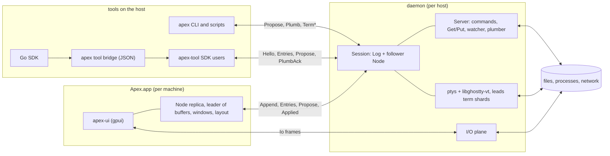
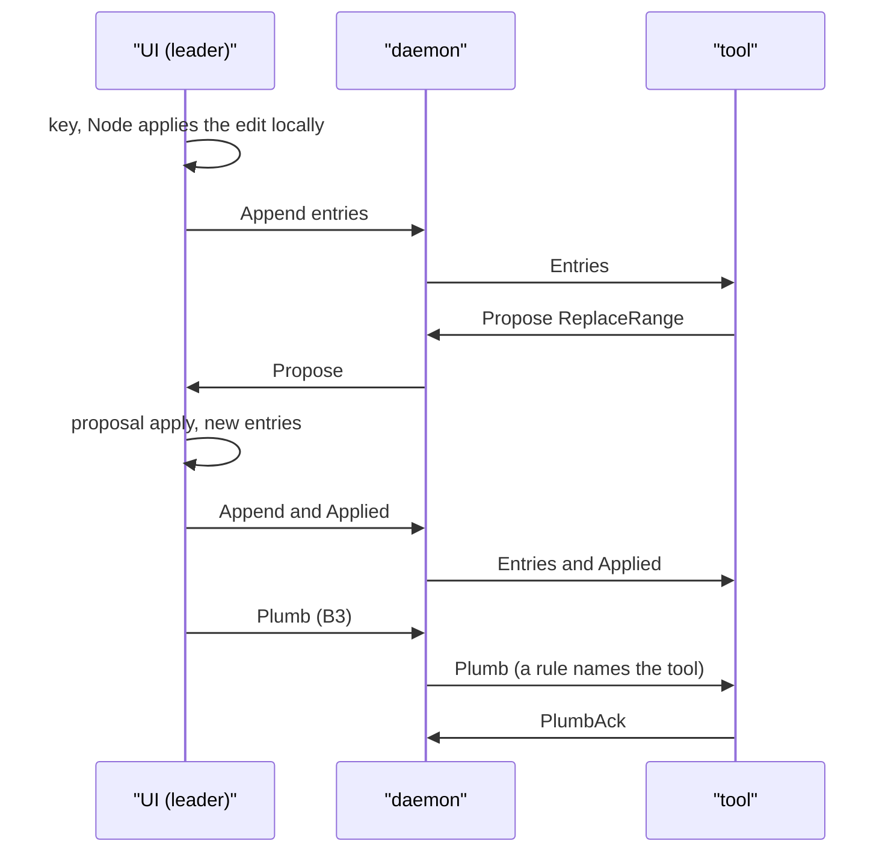

# apex Overview

apex is a modernised acme. It keeps acme's way of working: a three-button mouse, tags that are text you type into, columns of tiled windows, B2 to execute, B3 to look, chords, plumbing, and everything as text. To that it adds what acme lacks for today's work. A client–server split lets the UI detach and re-attach, locally or over ssh. Terminals are embedded as first-class windows so coding agents can run inside the editor. And there is a tool API that does not depend on 9P or a mounted file system ([DESIGN.md:1-7](DESIGN.md#L1-L7)).

This page gives the big picture: the goals, the three kinds of process, how they talk, and where each part lives in the repository. The pages after it cover each part in depth, starting with the replication model ([Sessions, Shards and Leadership](sessions-and-replication.md)) and the deterministic core ([Entries, State and Apply](core-state.md)).

## What apex is for

DESIGN.md lists the goals, and most of the code follows from them:

- **The acme experience.** Colours, fonts and geometry follow plan9port. Local editing has no noticeable latency.
- **All state on the server.** The UI renders and takes input. A client can detach at any time and re-attach with nothing lost.
- **Remotable.** `apex attach host` over ssh is how you work on another machine. Files stay where the server runs, and nothing is synchronised.
- **Agents.** Terminal windows are first-class. An agent runs in one and drives the editor through the same CLI a shell script would use.
- **Extensibility at least as good as acme's**, with few concepts, exposed through the `apex` command and a typed protocol.

It has no plugin language and no configuration language. Configuration is a script of `apex` commands (see [Configuration](configuration.md)). "Single player mode" is deliberate: one UI attachment leads a session at a time ([DESIGN.md:15-36](DESIGN.md#L15-L36)).

Two principles run through the code. **Nothing is ever lost**: anything set aside is kept and shown, and silent discard counts as a bug. **State on the server, rendering on the client**: the client is a renderer and input device that holds a replica ([DESIGN.md:48-57](DESIGN.md#L48-L57)).

### Features at a glance

| Feature | Where it is covered |
|---|---|
| acme's tiling, tags, columns, B1/B2/B3 and chords | [Tiling and Layout](tiling-and-layout.md), [Mouse, Keyboard and Look](client-input.md) |
| The sam/acme `Edit` language and Plan 9 regexps | [The Edit Language](edit-language.md) |
| B2 commands run through `rc`, with `$winid` and `$samfile` | [The Server](server.md) |
| Plumbing as a replicated rule table that tools extend | [Plumbing Rules and Verbs](plumbing.md) |
| Hosted terminals (pty + libghostty-vt) | [Terminals](terminals.md) |
| Pages (HTML windows) and an HTTP-shaped I/O plane | [The I/O Plane and Pages](io-plane-and-pages.md) |
| Sessions on other hosts through ssh or other providers | [Remote Hosts and Providers](remote-hosts.md) |
| A tool SDK in Rust, a JSON bridge and a Go package | [Writing Tools](tool-sdk.md), [JSON Bridge and Go SDK](bridge-and-go.md) |
| Bundled tools: win, lsp, preview, web, agent | [win and Language Servers](tool-win-and-lsp.md), [Preview, Web and Diff Tools](tool-pages.md), [Coding Agents](agent-tools.md) |

Sources: [DESIGN.md:1-57](DESIGN.md#L1-L57), [crates/apex-cli/README.md:1-46](crates/apex-cli/README.md#L1-L46)

## The model in one paragraph

A **session** (as in tmux) is a whole workspace living on one daemon, which hosts many. A client that joins a session gets an **attachment**, a fenced identity, over a **connection** (a socket that may drop and resume). The session's state is split into **shards**. Each shard is an independently replicated log with its own lease. Every shard has exactly one **leader**, which sequences entries into the log; everyone else replays them as a **follower**. A follower that wants a change **proposes** it to the leader ([DESIGN.md:38-46](DESIGN.md#L38-L46), [DESIGN.md:122-155](DESIGN.md#L122-L155)).

In code, the shard is `apex_core::Shard`:

```rust
pub enum Shard {
    Buffer(BufferId),
    Window(WindowId),
    Layout,
    Term(TermId),
    /// The session's metalog: shards, attachments, leases, plumb rules.
    Meta,
}
```

`Term` and `Meta` are *pinned*: the server always leads them. Buffers, windows and the layout are *leasable*, so a UI that attaches takes their leases and edits with no round trip ([crates/apex-core/src/ids.rs:46-62](crates/apex-core/src/ids.rs#L46-L62)). DESIGN.md's table also lists a server-wide `registry` shard, but the code has no such shard: the daemon keeps its sessions in a map ([crates/apex-server/src/daemon.rs:211-235](crates/apex-server/src/daemon.rs#L211-L235)).

State changes in one way only. `State::apply` is deterministic and pure: no clock, no randomness, no I/O. So a replica that replays the same log ends up with byte-identical state. Anything with an effect on the world is an **exec entry** naming its handler. The node that matches the handler carries out the effect and reports the outcome as further entries ([DESIGN.md:157-187](DESIGN.md#L157-L187)).

Ids need no coordination. Each attachment allocates from its own range, `attachment << 40 | counter` ([crates/apex-core/src/node.rs:306](crates/apex-core/src/node.rs#L306), [crates/apex-core/src/node.rs:312](crates/apex-core/src/node.rs#L312)).

Sources: [crates/apex-core/src/ids.rs:1-62](crates/apex-core/src/ids.rs#L1-L62), [crates/apex-core/src/entry.rs:1-56](crates/apex-core/src/entry.rs#L1-L56), [crates/apex-core/README.md:18-32](crates/apex-core/README.md#L18-L32), [DESIGN.md:100-187](DESIGN.md#L100-L187)

## Three kinds of process

DESIGN.md names three kinds of process, and the code keeps the split ([DESIGN.md:79-96](DESIGN.md#L79-L96)):

| Process | Binary | Role |
|---|---|---|
| **Daemon** | `apex server` (or `apexd`) | One per host, many sessions. Owns each session's authoritative `Log`, runs ptys and external commands, watches files, hosts the plumber and the I/O plane. Leads the pinned shards, and leads everything when no UI is attached. |
| **UI client** | `apex-ui` (inside `Apex.app`) | gpui app. Mirrors each session it shows, renders it, and while attached *leads* buffers, windows and the layout, so typing never waits on the network. |
| **Tools and the CLI** | `apex <subcommand>`, `apex tool …`, third-party tools | Attach as followers with their own replicas. They read locally and change things only by proposing. |

### The daemon

`Daemon` holds a map of `Session`s. Each session has its `Log`, a `Server`, and a follower `Node` replica called `view`, plus the connection that currently leads it ([crates/apex-server/src/daemon.rs:176-188](crates/apex-server/src/daemon.rs#L176-L188)). One thread owns all state. Connection readers and terminal events feed it through a channel, and each connection has a writer thread so a slow client never stalls the core. When no UI is attached, the daemon leads the session itself as the `SERVER` attachment, so scripts work headless and a UI that attaches later takes over ([crates/apex-server/src/daemon.rs:1-11](crates/apex-server/src/daemon.rs#L1-L11)).

The socket defaults to `$TMPDIR/apex-$USER/main.sock`, overridden by `APEX_SOCKET` ([crates/apex-server/src/daemon.rs:64-79](crates/apex-server/src/daemon.rs#L64-L79)). `apex server` runs the daemon in the foreground ([crates/apex-cli/src/main.rs:881-887](crates/apex-cli/src/main.rs#L881-L887)). `apex attach`, and `-ensure-server` on any command, start one in the background when the socket does not answer ([crates/apex-cli/src/main.rs:889-900](crates/apex-cli/src/main.rs#L889-L900)). `apexd` is a thin standalone entry point to the same `Daemon::run` ([crates/apex-server/src/bin/apexd.rs:1-29](crates/apex-server/src/bin/apexd.rs#L1-L29)). See [The Daemon](daemon.md).

### The UI client

`apex-ui` attaches to the local daemon, starting it if needed, and reopens the sessions it had last time. Flags choose another daemon (`--attach`), a pipe (`--via CMD`), a remote destination (`--remote DEST`), or an in-process server (`--local`) ([crates/apex-client/src/main.rs:1-12](crates/apex-client/src/main.rs#L1-L12)).

Its central type is `Acme`. It holds a `Log`, a `Node`, and a `Backend` that is either `Local(Server)` in the same process or `Remote(Link)` behind a socket ([crates/apex-client/src/app.rs:381-392](crates/apex-client/src/app.rs#L381-L392)). Each frame, `render` syncs the node with the backend, measures the layout and paints straight from core state ([crates/apex-client/src/main.rs:67-89](crates/apex-client/src/main.rs#L67-L89)). See [The UI Client](client.md).

### Tools and the CLI

Every `apex` subcommand attaches to the session as a tool. It receives the same snapshot a UI would, reads from its own replica, and proposes to the leader ([crates/apex-cli/src/main.rs:1-7](crates/apex-cli/src/main.rs#L1-L7)). So this works with no UI running, and a UI that attaches later finds the result:

```sh
apex new notes.txt
apex edit notes.txt ',x/TODO/ c/DONE/'
apex exec notes.txt Put
```

The bundled tools are subcommands of the same binary: `apex tool win | lsp | preview | web | agent | bridge NAME` ([crates/apex-cli/src/main.rs:1055-1078](crates/apex-cli/src/main.rs#L1055-L1078)). Each attaches through the same protocol as any other tool, with no special privileges ([crates/apex-cli/src/main.rs:496-499](crates/apex-cli/src/main.rs#L496-L499)).

Sources: [DESIGN.md:61-96](DESIGN.md#L61-L96), [crates/apex-server/src/daemon.rs:1-79](crates/apex-server/src/daemon.rs#L1-L79), [crates/apex-server/src/daemon.rs:176-235](crates/apex-server/src/daemon.rs#L176-L235), [crates/apex-client/src/app.rs:381-392](crates/apex-client/src/app.rs#L381-L392), [crates/apex-cli/src/main.rs:713-791](crates/apex-cli/src/main.rs#L713-L791)

## How they talk

All three kinds of process use one wire. It is postcard messages in `u32` little-endian length-prefixed frames, over a Unix socket or any byte stream (such as ssh's stdio). On every connection the daemon first sends its `PROTOCOL` number and build id. The protocol number is bumped by hand with every wire change and currently stands at 54. A client of another protocol version stops at that first frame with an error saying what to do ([crates/apex-server/src/proto.rs:23](crates/apex-server/src/proto.rs#L23), [DESIGN.md:606-620](DESIGN.md#L606-L620)).

The client side runs its `Node` over a *mirror* `Log`. The mirror assigns the same sequence numbers the server will store, so the UI leads with no wait and ships its entries on `flush` ([crates/apex-server/README.md:8-24](crates/apex-server/README.md#L8-L24)). The details are on [The Attach Protocol](attach-protocol.md) and [Proposals](proposals.md).



Some typical flows, as ARCHITECTURE.md traces them:



Sources: [ARCHITECTURE.md:27-126](ARCHITECTURE.md#L27-L126), [crates/apex-server/README.md:1-24](crates/apex-server/README.md#L1-L24), [crates/apex-server/src/proto.rs:23](crates/apex-server/src/proto.rs#L23)

## Map of the repository

### Workspace crates

The Cargo workspace members are listed in [Cargo.toml:1-13](Cargo.toml#L1-L13).

| Crate | Builds | What it holds |
|---|---|---|
| `crates/apex-edit` | lib | The sam/acme Edit language and Plan 9 regexps, ported from plan9port (`regx.rs`, `parse.rs`, `exec.rs`, `elog.rs`). No dependencies on the rest. |
| `crates/apex-core` | lib | The headless replicated state machine: `ids`, `entry`, `text`, `buffer`, `state`, `log`, `node`, plus `tiling`, `plumb`, `expand`, `fuzzy` and `transcript` ([crates/apex-core/src/lib.rs:1-29](crates/apex-core/src/lib.rs#L1-L29)). Depends on apex-edit. |
| `crates/apex-server` | lib; `apexd`, `apex-bench` | Everything with an effect: `Server` (lib.rs), `daemon`, `proto`, `proposal`, `remote` (client side of the wire), `pty`/`term`/`term_loop`, `watch`, `find`, `plane`, `providers` ([crates/apex-server/src/lib.rs:1-24](crates/apex-server/src/lib.rs#L1-L24)). |
| `crates/ghostty-vt-sys` | lib | FFI to libghostty-vt with a C shim (`shim.c`) that walks the grid into term-shard cells ([crates/ghostty-vt-sys/src/lib.rs:1-18](crates/ghostty-vt-sys/src/lib.rs#L1-L18)). |
| `crates/apex-client` | `apex-ui` | The gpui client: `app.rs` (`Acme`), `text_element.rs`, `term_element.rs`, `web.rs`, pickers, menus, themes, fonts. |
| `crates/apex-cli` | `apex` | The command, and the host of every bundled tool. |
| `crates/apex-tool` | lib | The Rust tool SDK: `Tool::attach`, windows, `offer`, `next_event`, `answer` ([crates/apex-tool/src/lib.rs:1-39](crates/apex-tool/src/lib.rs#L1-L39)). |
| `crates/apex-tool-bridge` | lib | `apex tool bridge NAME`: a tool attachment driven by JSON lines on stdio. |
| `crates/apex-tool-win` | lib | `apex tool win`: acme's win, a shell in a text window. |
| `crates/apex-tool-lsp` | lib | `apex tool lsp`: language servers, one per workspace root. |
| `crates/apex-tool-preview` | lib | `apex tool preview`: a buffer through a converter, shown as a page. |
| `crates/apex-tool-web` | lib | `apex tool web`: web pages and their history. |
| `crates/apex-tool-agent` | lib | `apex tool agent`: Claude Code, Codex and Muse in apex terminals, fed by their hooks ([crates/apex-tool-agent/README.md:1-23](crates/apex-tool-agent/README.md#L1-L23)). |
| `crates/apex-diff` | lib | Unified diffs laid out side by side as a page. Used by apex-tool. |
| `exp/acp` | `apex-acp` | Experimental Agent Client Protocol client, built on apex-tool only. |

The dependency order is simple: `apex-edit` ← `apex-core` ← `apex-server` ← everything else. The client and the CLI both link `apex-server`, because its `remote.rs` is the client side of the wire. The CLI also links every bundled tool crate ([crates/apex-cli/Cargo.toml:11-22](crates/apex-cli/Cargo.toml#L11-L22)).

The bundled tools are not all built the same way. `lsp` and `win` use `apex-server`'s `Remote` and `Proposal` directly. `agent`, `preview`, `web` and `exp/acp` depend on the SDK, `apex-tool`. The architecture review counts this among the API gaps (see [Writing Tools](tool-sdk.md)).

### Outside the crates

| Path | What |
|---|---|
| `go/apex`, `go/examples/upper` | The Go SDK. It starts `apex tool bridge NAME` and talks JSON to it, offering `Attach`, `Offer` and `Serve` ([go/README.md:1-28](go/README.md#L1-L28)). |
| `providers/` | Example `apex-remote-<provider>` scripts (sprite, devserver, x2p). A provider is called as `apex-remote-<provider> DESTINATION COMMAND`, and ssh is built in ([providers/README.md:1-31](providers/README.md#L1-L31)). |
| `mac/` | `build-app.sh` builds `target/Apex.app`. The bundle contains `apex-ui`, `apex`, the `apex-editor` and `xdg-open` links to `apex`, `rc` (mariusae/rustrc), and a `linux-amd64` `apex` and `rc` cross-linked with Zig (`zig-cc`, `zig-ar`) for remote hosts ([mac/build-app.sh:1-32](mac/build-app.sh#L1-L32)). |
| `examples/profile` | An example `~/.apex/profile` for zsh, bash and fish. |
| `third_party/pathfinder_simd` | A patched crate, substituted through `[patch.crates-io]` ([Cargo.toml:19-20](Cargo.toml#L19-L20)). |
| `docs/` | The project's web page. |
| `.github/workflows/rust.yml` | CI. |

Sources: [Cargo.toml:1-26](Cargo.toml#L1-L26), [crates/apex-core/src/lib.rs:1-29](crates/apex-core/src/lib.rs#L1-L29), [crates/apex-server/src/lib.rs:1-24](crates/apex-server/src/lib.rs#L1-L24), [crates/apex-cli/Cargo.toml:1-22](crates/apex-cli/Cargo.toml#L1-L22), [mac/build-app.sh:1-32](mac/build-app.sh#L1-L32), [go/README.md:1-73](go/README.md#L1-L73), [providers/README.md:1-31](providers/README.md#L1-L31)

## Sessions, URLs and remote hosts

Every session is a URL. `local:///name` is on this machine's daemon, `ssh://user@host/name` is reached over ssh, and `sprite://box/name` goes through a provider script. A daemon's first session is `default`.

For a remote target, `apex attach` launches `apex-ui --remote DEST --session S`. The UI installs the right `apex` and `rc` into `~/.apex/bin` on the destination when its hash differs, then runs `apex attach -stdio` there. That command starts the destination's daemon if needed and copies bytes between its stdio and the daemon's socket. The bridge knows nothing of frames ([crates/apex-cli/src/main.rs:1165-1190](crates/apex-cli/src/main.rs#L1165-L1190), [DESIGN.md:724-768](DESIGN.md#L724-L768)).

Inside a session, commands and terminals get `apexsession` and `APEX_SOCKET`. So `apex` run from an apex terminal acts on the session it is in ([crates/apex-cli/src/main.rs:735-742](crates/apex-cli/src/main.rs#L735-L742)). The binary also answers to the names `apex-editor` (`$EDITOR`) and `xdg-open` (`$BROWSER`), which become `apex editor` and `apex plumb` ([crates/apex-cli/src/main.rs:713-729](crates/apex-cli/src/main.rs#L713-L729)). See [Remote Hosts and Providers](remote-hosts.md) and [The apex Command](cli.md).

Sources: [crates/apex-cli/README.md:20-56](crates/apex-cli/README.md#L20-L56), [crates/apex-cli/src/main.rs:713-791](crates/apex-cli/src/main.rs#L713-L791), [crates/apex-cli/src/main.rs:1165-1190](crates/apex-cli/src/main.rs#L1165-L1190), [DESIGN.md:724-768](DESIGN.md#L724-L768)

## Window kinds

A window's body says what its content is, and nothing else:

```rust
pub enum Body {
    Text(BufferId),
    Term(TermId),
    Page(Source),   // Source::Buffer(id) | Source::Url, fetched via Host | Client | Tool(name)
}
```

**Text** windows show a buffer: acme's File, with its views, undo and dirty state. **Term** windows show a grid that the daemon writes as `TermOp` rows into a pinned term shard. **Page** windows are HTML drawn by the client in a WKWebView. A page's content is either a buffer written by a tool or a URL fetched through the host, the client, or a tool ([crates/apex-core/src/entry.rs:45-80](crates/apex-core/src/entry.rs#L45-L80)).

Status, owner, live and working flags, and notifications are common to every kind. See [Buffers, Views and Undo](buffers-and-text.md), [Terminals](terminals.md) and [The I/O Plane and Pages](io-plane-and-pages.md).

Sources: [crates/apex-core/src/entry.rs:45-80](crates/apex-core/src/entry.rs#L45-L80), [ARCHITECTURE.md:698-730](ARCHITECTURE.md#L698-L730)

## The design documents

Four documents at the root explain why the code is shaped as it is. Their *As built* notes describe what actually runs.

| Document | What it is |
|---|---|
| `DESIGN.md` | The source of truth for the architecture: goals, the model (nouns, shards, the state machine), leadership and fencing, proposals and commands, the protocol as built, the `apex` command, extensibility and plumbing, the Edit language, files, terminals, the client, logs and compaction, measurements, and open questions such as agents over ACP ([DESIGN.md:1-11](DESIGN.md#L1-L11)). |
| `ARCHITECTURE.md` | An October 2026 review against four goals: a minimal design, the UI separated from the editing model, a minimal core, and orthogonal tool APIs. It lists bugs (now mostly fixed), duplication in the protocol and the client, UI policy leaking into the core, divergent tool surfaces, the Page design (§5, built), and an ordered plan ([ARCHITECTURE.md:1-23](ARCHITECTURE.md#L1-L23), [ARCHITECTURE.md:873-935](ARCHITECTURE.md#L873-L935)). |
| `WEB.md` | The I/O plane multiplexed over the session socket, web windows rendered on the client, and Preview as a live pipe through a converter. Where its Page details differ from ARCHITECTURE.md §5, §5 is what runs ([WEB.md:1-17](WEB.md#L1-L17)). |
| `MODERN.md` | The modern-Mac look: six palettes, font sets, tags as title bars, handles as document dots, the caret, scrollers, cards and the title bar. acme's tiling and interaction model are left untouched ([MODERN.md:1-10](MODERN.md#L1-L10)). |

Read the docs with some care, because the code has moved on in places. DESIGN.md's shard table lists a `registry` shard that the code does not have. apex-server's README credits alacritty's parser for terminal latency, but terminals now use libghostty-vt ([crates/apex-server/src/term.rs:1-3](crates/apex-server/src/term.rs#L1-L3)). ARCHITECTURE.md warns that its own file and line references will drift.

Sources: [DESIGN.md:1-11](DESIGN.md#L1-L11), [ARCHITECTURE.md:1-23](ARCHITECTURE.md#L1-L23), [WEB.md:1-17](WEB.md#L1-L17), [MODERN.md:1-10](MODERN.md#L1-L10), [crates/apex-server/README.md:42-50](crates/apex-server/README.md#L42-L50), [crates/apex-server/src/term.rs:1-3](crates/apex-server/src/term.rs#L1-L3)

## Where to go next

- To understand any change to state, read [Sessions, Shards and Leadership](sessions-and-replication.md), then [Entries, State and Apply](core-state.md) and [The Node](node.md).
- To work on what touches the host (commands, files, terminals), read [The Server](server.md), [The Daemon](daemon.md) and [Terminals](terminals.md).
- To work on the app, read [The UI Client](client.md) and its child pages.
- To extend apex, read [Writing Tools](tool-sdk.md), [Plumbing Rules and Verbs](plumbing.md) and [The apex Command](cli.md).
- To build it, read [Building, Testing and Packaging](build-and-test.md).
