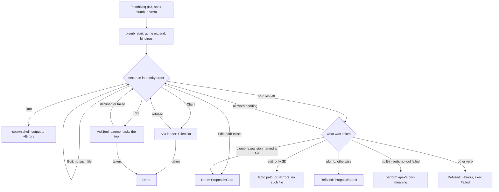
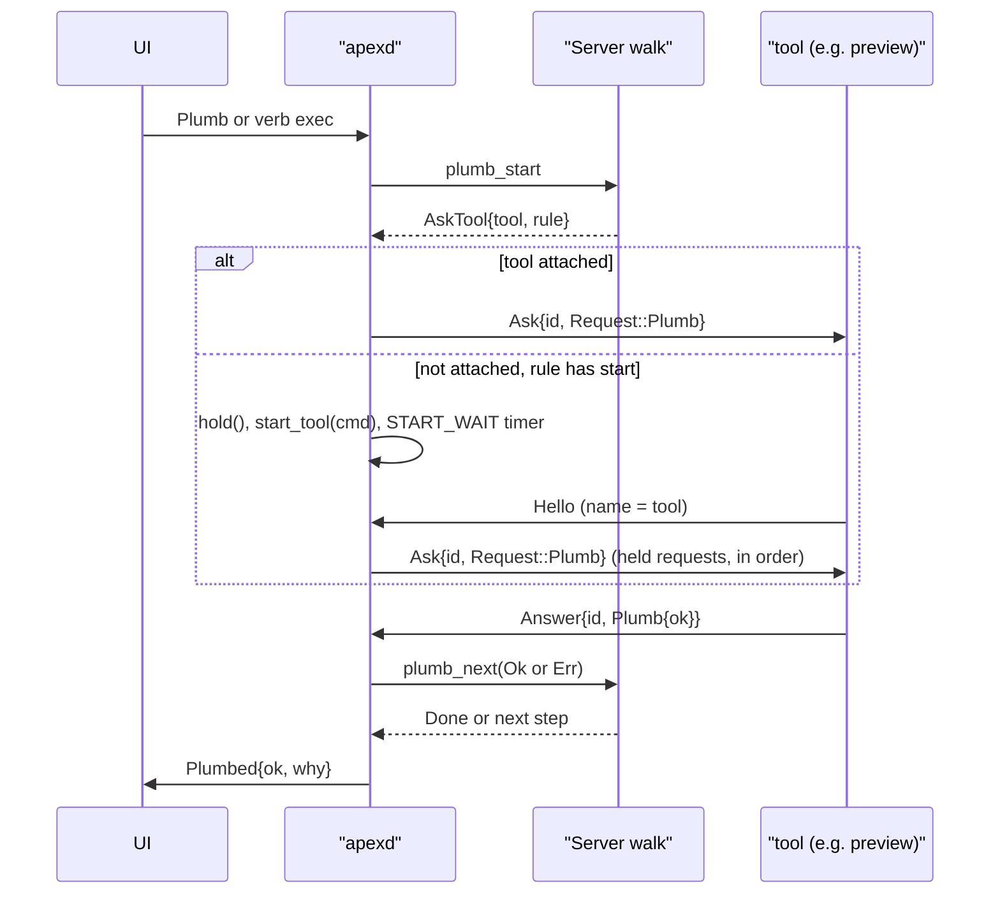

# Plumbing Rules and Verbs

apex's plumber works like Plan 9's, adapted to a session. It decides what happens when someone clicks B3 on a piece of text, runs `apex plumb TEXT`, or executes a word that a rule offers, such as `Preview`, `Clear` or an lsp tool's `Def`. The plumber is a **rule table** kept in the session's metalog. Each rule has a predicate (which text, which window) and an action (open something, run a command, ask the UI, ask a tool). When a plumb or a verb arrives, the server in the daemon walks the table in priority order. The first rule that matches and is *taken* ends the walk. If nothing takes a B3, the text is looked for instead, as acme's Look does.

Because the table is replicated state, every replica gives the same answer to "which verbs does this window offer?" and "has a tool claimed this word here?". That includes the UI that draws the tools menu and the CLI that lists rules. Only the server performs the walk, since actions touch the host's files and processes. For the replication model see [Sessions, Shards and Leadership](sessions-and-replication.md). For the server around the walk see [The Server: Commands, Files and Processes](server.md). Tools answer rules through the SDK described in [Writing Tools: the apex-tool SDK](tool-sdk.md).

## The rule table in the metalog

A rule is a `PlumbRule` (`crates/apex-core/src/entry.rs:363-408`). The metalog doesn't interpret rules; it only stores and orders them. Two meta ops change the table:

```rust
PlumbRuleInstall { id: RuleId, attachment: AttachmentId, priority: i32, rule: PlumbRule },
PlumbRuleRemove { id: RuleId },
```

`State::apply` inserts into or removes from `Meta::rules`, a `BTreeMap<RuleId, Rule>`. `Rule` holds the owning attachment, the priority and the `PlumbRule` (`crates/apex-core/src/state.rs:394-398`, `849-854`). `Log::install_rule` allocates the next `RuleId` and pushes the entry (`crates/apex-core/src/log.rs:287-298`). Only the daemon's authoritative log installs rules. Clients ask for one with `ClientMsg::RuleAdd` and remove one with `ClientMsg::RuleRm`.

Every rule has an **owner**:

- **`SERVER`, the session.** The session's rules stay until someone removes them. Rules from `apex plumb rule add` (without `-mine`) and the default rules belong to the session.
- **An attachment.** These rules come from `RuleAdd { mine: true }`, which a tool's `Tool::offer` sends, and they are removed when the attachment detaches. The daemon walks `plumb::owned_by` and removes each rule when a connection goes (`crates/apex-server/src/daemon.rs:531-534`).

Only a rule's owner may remove it (protocol 54). An attachment may remove its own rules. The session's rules can be removed only by a `RuleRm` with `session: true`, which is what `apex plumb rule rm` sends on the user's behalf. Any other removal is refused with an `Error` naming the owner (`daemon.rs:826-841`). `RuleAdd` runs `PlumbRule::check` before installing and answers with `RuleAdded { id }` (`daemon.rs:816-825`).

Sources: [crates/apex-core/src/entry.rs:360-408](crates/apex-core/src/entry.rs#L360-L408), [crates/apex-core/src/entry.rs:530-531](crates/apex-core/src/entry.rs#L530-L531), [crates/apex-core/src/state.rs:394-398](crates/apex-core/src/state.rs#L394-L398), [crates/apex-core/src/state.rs:849-854](crates/apex-core/src/state.rs#L849-L854), [crates/apex-core/src/log.rs:287-298](crates/apex-core/src/log.rs#L287-L298), [crates/apex-server/src/daemon.rs:816-841](crates/apex-server/src/daemon.rs#L816-L841), [crates/apex-server/src/proto.rs:144-156](crates/apex-server/src/proto.rs#L144-L156)

## Anatomy of a rule

### Verb

`verb` names the command the rule answers.

- **`plumb`** (`plumb::PLUMB`) is B3. These rules are asked who wants a piece of text.
- **Any other word** becomes a verb. It appears in the tools menu (B4) of every window the rule applies to, unless the rule is `unlisted`. B2 on the word runs it wherever it is written: in the tag, in the body, or through `apex exec`.
- **`exec`** (`plumb::EXEC`) is special. It takes every B2 command in a window that nothing else took. win uses it so that B2 on an old command line types that line to the shell. It never appears in a menu.

### Predicates

All predicates must hold. The window predicates are checked by `PlumbRule::applies_to`, the text predicate by `match_text`, and the filesystem checks by the walk itself.

| Field (flag) | Meaning | Checked by |
|---|---|---|
| `text` (`-text`) | The plumbed text (or a verb's arguments) must match this regexp **whole**. It is anchored as `^(?:RE)$`, as Plan 9's `matches` is. Groups 0–9 bind `$0`..`$9`. With no `text`, any text matches and is bound as `$0`. | `match_text` |
| `file` (`-file`) | The window's name must match this regexp. It is unanchored, an `is_match` search. | `applies_to` |
| `kind` (`-kind`) | The window's `WinKind`: `file`, `dir`, `term`, `errors` or `page` (`web` and `preview` are accepted as old names for `page`). | `applies_to` |
| `win` (`-win`) | This one window. Window ids are never reused, so the rule can't come to mean a different window. | `applies_to` |
| `owner` (`-owner`) | The tool that owns the window (`WindowOp::Own`) must match this regexp, anchored whole. A window that no tool owns has the empty owner name, so `-owner=''` means "a real file, not a tool's window". | `applies_to` |
| `isfile` (`-isfile`) | This template, expanded and resolved against the window's directory, must be a file. | the walk |
| `isdir` (`-isdir`) | The same, but it must be a directory. | the walk |

A bad regexp never matches. `whole()` returns `None` for it, and in `applies_to` a `file` pattern that fails to compile rejects the window (`crates/apex-core/src/plumb.rs:75-129`). `check()` refuses bad `text` and `file` patterns when a rule is added, so bad patterns normally never reach the table.

### Actions

| `RuleAction` | Flag | What the walk does |
|---|---|---|
| `Edit(tmpl)` | `-edit` | Expands to `name` or `name:line`, resolves it against the directory, and proposes `Goto` if the path exists. If it doesn't exist, the walk goes on to the next rule. |
| `Run(tmpl)` | `-run` | Runs the expanded command through the shell in the window's directory, with the selection on stdin and output to `dir/+Errors`. Running the command counts as taking the plumb. |
| `Client { verb, args }` | `-client -args` | Asks the leading UI to do `verb` with the expanded `args`, for example `open` a URL. The UI may refuse. |
| `Tool(name)` | `-tool` | Asks the tool attached under `name`. The tool takes or declines within a deadline. |

Two more fields matter for particular actions. `start` is valid only with `Tool` and gives the command that starts the tool when it isn't attached (see below). `to` (`-to=errors|window`) is stored, shown by `to_flags` and parsed by the CLI, but nothing in the server reads it yet: a `Run` rule's output always goes to `+Errors` (`crates/apex-server/src/lib.rs:1513-1529`).

### Validation

`PlumbRule::check` (`plumb.rs:132-151`) rejects:

- a regexp that doesn't compile;
- an empty verb, or a verb containing whitespace;
- a rule for a **built-in word** (`plumb::BUILTINS`, such as `Put`, `Get` or `Undo`) that doesn't say where it applies with `-win`, `-file` or `-kind`. Such a rule would never fire, so it is refused instead of being installed quietly;
- `start` on anything other than a `Tool` rule.

Sources: [crates/apex-core/src/entry.rs:360-508](crates/apex-core/src/entry.rs#L360-L508), [crates/apex-core/src/plumb.rs:73-152](crates/apex-core/src/plumb.rs#L73-L152), [crates/apex-core/src/plumb.rs:221-243](crates/apex-core/src/plumb.rs#L221-L243)

## Templates and bindings

Actions and the `isfile`/`isdir` predicates are templates. `plumb::expand` substitutes values from `Bindings` (`crates/apex-core/src/plumb.rs:13-71`):

| Name | Value in the server's walk |
|---|---|
| `$0`..`$9` | The text match and its groups. With no `text` predicate, `$0` is the whole text. |
| `$file` | The context window's name (empty outside a window). |
| `$dir` | The directory of the walk: the request's `dir` if given (a terminal's cwd, `apex plumb`'s cwd), else the context's directory. |
| `$win` | The context window's id. |
| `$sel` | The leader's last selected text (`Node::seltext`). |
| `$line` | Accepted by `expand`, but the walk always binds it to the empty string (`lib.rs:1384-1391`). |
| `$$` | A literal `$`. |

Anything else after `$` is left as written, so `$nope` stays `$nope`. A missing group expands to nothing.

Sources: [crates/apex-core/src/plumb.rs:13-71](crates/apex-core/src/plumb.rs#L13-L71), [crates/apex-server/src/lib.rs:1383-1391](crates/apex-server/src/lib.rs#L1383-L1391)

## Priorities and order

`plumb::ordered` sorts the table by priority, highest first, then by `RuleId`, which is the order rules were installed (`plumb.rs:213-219`). The walk, `apex plumb rule ls` and `verbs_for` all use this order. Priorities in use:

| Priority | Rules |
|---|---|
| 0 | Default for `apex plumb rule add` and for tools unless they say otherwise. |
| −10 | The session's `Clear`, `Preview`, `Web` and `Newweb` rules; the UI's URL and `Snarfout` rules. |
| −100 | The session's three path rules, so that anything installed later wins. |

Sources: [crates/apex-core/src/plumb.rs:213-219](crates/apex-core/src/plumb.rs#L213-L219), [crates/apex-server/src/lib.rs:1256-1323](crates/apex-server/src/lib.rs#L1256-L1323), [crates/apex-client/src/app.rs:1206-1242](crates/apex-client/src/app.rs#L1206-L1242), [crates/apex-cli/src/main.rs:1832-1835](crates/apex-cli/src/main.rs#L1832-L1835)

## The walk

### Where walks begin

A walk starts from a `PlumbReq` (`crates/apex-server/src/lib.rs:1700-1725`). The request carries:

- the context;
- the text;
- an optional directory;
- the verb;
- `edit_only`, which is Plan 9's `B`: only `Edit` rules apply;
- `dry`, which only reports what would happen;
- the exec entry the request came from;
- `at` and `sel`, where the pointer or dot was and what was swept;
- `alt`, the word to try if the longer text finds nothing;
- `reverse`, for shift-B3.

Requests come from three places:

1. **`ClientMsg::Plumb`**, sent by a UI's B3, by `apex plumb`, `apex B` and `apex editor`, or by cmd-B3 with a verb. The daemon builds the request and calls `plumb_start`. The connection that sent the message is the asker (`daemon.rs:751-756`).
2. **A verb executed with B2.** `Server::perform` handles pending server execs. When a rule offers the word in that window, `verb_request` builds a request and queues it on `plumb_starts` (`lib.rs:1102-1107`). If no rule offers the word but an `exec` rule applies, the whole line goes to that rule (`lib.rs:1631-1659`). The daemon's `start_verbs` drains the queue with asker 0, which means nobody waits on the answer (`daemon.rs:1499-1508`).
3. **A claimed built-in.** `Node::claimed` asks `plumb::claims_verb` whether a *scoped* rule (one with `win`, `file`, `kind` or `owner`) takes a word in this window (`crates/apex-core/src/node.rs:2029-2039`). Because the table is replicated, the leader resolves a claimed word to the server even when it is a leader built-in such as `Undo`. The server then sends it through the rules first (`lib.rs:1022-1030`).

### Expansion before matching

For a B3 with a place (`at`), `plumb_start` runs acme's expansion `apex_core::expand::expand` on the buffer, as described in [Buffers, Views and Undo](buffers-and-text.md). The expansion starts from the click, or from the swept range. A name counts as a file if a window is called that or the path exists from the directory; a leading `~/` means the home directory. The rules see the expanded text. When the expansion names a file, the resolved name and its address are kept as `file`, so they can be opened if no rule takes the text (acme's look3). When the plumbed text has no place, as with a terminal's text or `apex plumb`, it is read as acme reads a selection, looking for a file name and an address. If there is nothing at the pointer, the walk ends at once (`lib.rs:1339-1396`).

### Stepping through the rules

`plumb_advance` takes the remaining rules in order and skips a rule when:

- its verb differs from the request's;
- `edit_only` is set and the rule isn't an `Edit` rule;
- `applies_to` fails, judged on the context window's name, kind, id and owner;
- the text doesn't match;
- an `isfile` or `isdir` check fails.

The first rule that survives runs its action. Each decision is pushed onto a trace, such as `"r3 (session, p-100): text does not match"`. A dry run (`apex plumb -dry-run`) returns that trace as `PlumbTrace` instead of acting (`lib.rs:1450-1549`).

The walk is a small state machine. The server returns one `PlumbStep` at a time, and the host carries it out:

```rust
pub enum PlumbStep {
    Done(Vec<Proposal>),
    Refused { props: Vec<Proposal>, why: String },
    Ask(Proposal),                 // ClientDo, to the leader
    AskTool { tool, rule, ctx, verb, text, dir, groups, at, sel },
    Trace(Vec<String>),
}
```

Answers come back through `plumb_next(id, Ok | Err)`, meaning taken or refused, or through `plumb_failed(id, why)`, meaning there was no answer at all. Both continue the walk from the next rule (`lib.rs:1402-1428`). In the daemon, `drive` carries out each step (`daemon.rs:1447-1488`). In-process, `plumb_local` in the client does the same and treats any `AskTool` as a failure, because there are no tools without a daemon (`crates/apex-client/src/app.rs:5674-5691`).



### When no rule takes it

The fallbacks at the end of `plumb_advance` (`lib.rs:1550-1622`) are tried in order:

1. **The word.** If `alt` is set, the walk restarts with that word. acme's expand tries the file-name expansion first and the word second.
2. **`B` (edit only).** A window named in any session (`session.N[:line]`, parsed by `global_window`) is opened. Otherwise the text is opened as a path if it exists, and if not, `"no such file"` goes to `+Errors`.
3. **B3.** If the expansion named a file, that file is opened at its address. `address_pos` understands `12` and `#12`, and leaves the selection as it is for anything else. Otherwise the walk answers `Refused` with a `Proposal::Look`, carrying `reverse` for shift-B3, and the asker hears `"no rule takes …: looked for it instead"`. One exception: B3 on a terminal's or a page's own grid, with no span, is refused without a Look, because there is no text there to search.
4. **A built-in verb.** If every rule declined a word apex has its own meaning for, that meaning runs last: the exec is put in `plain` and taken off `performed`, so the next poll performs it plainly (§6.2 in ARCHITECTURE.md). This does **not** happen if any step `failed`, meaning a tool was absent or silent. Silence is not a decision. Without this rule, for example, `Get` would reload a generated window over a tool that had merely died.
5. **Any other verb.** The walk writes `"VERB: no rule takes it here"` to `+Errors` and marks the exec `Failed`.

When the walk ends, `plumbed` sends `ServerMsg::Plumbed { ok, why }` to the asker. `apex plumb` exits non-zero on `ok: false`, as Plan 9's plumb does when the plumber refuses (`crates/apex-cli/src/main.rs:1645-1654`). A verb's exec gets its `Done` status from `plumb_finish`. For `Run`, the shell reports the status when it exits.

Sources: [crates/apex-server/src/lib.rs:1022-1030](crates/apex-server/src/lib.rs#L1022-L1030), [crates/apex-server/src/lib.rs:1102-1107](crates/apex-server/src/lib.rs#L1102-L1107), [crates/apex-server/src/lib.rs:1325-1675](crates/apex-server/src/lib.rs#L1325-L1675), [crates/apex-server/src/lib.rs:1700-1758](crates/apex-server/src/lib.rs#L1700-L1758), [crates/apex-server/src/daemon.rs:751-756](crates/apex-server/src/daemon.rs#L751-L756), [crates/apex-server/src/daemon.rs:1447-1508](crates/apex-server/src/daemon.rs#L1447-L1508), [crates/apex-core/src/expand.rs:26-54](crates/apex-core/src/expand.rs#L26-L54), [crates/apex-core/src/node.rs:2029-2039](crates/apex-core/src/node.rs#L2029-L2039), [crates/apex-client/src/app.rs:5674-5691](crates/apex-client/src/app.rs#L5674-L5691)

## Verbs in the tools menu

`plumb::verbs_for` lists the words a window's tools menu shows. It includes every rule that applies to the window, in walk order and without duplicates, leaving out `plumb`, `exec` and `unlisted` rules (`plumb.rs:263-275`). The UI calls it for the B4 menu (`crates/apex-client/src/app.rs:4705`) and for the command palette (`crates/apex-client/src/commands.rs:130`). `offers_verb` is the matching test the server uses when a word is B2'd. Because both read the replicated table, the menu and the server always agree. Choosing a menu word executes it, so it reaches the server as a verb exec, as described above.

Sources: [crates/apex-core/src/plumb.rs:245-275](crates/apex-core/src/plumb.rs#L245-L275), [crates/apex-server/src/lib.rs:1629-1659](crates/apex-server/src/lib.rs#L1629-L1659)

## Tool rules: asking, answering, deadlines

On an `AskTool` step, the daemon looks for a connection in the same session whose attachment has the tool's name (`daemon.rs:1467-1486`). If it finds one, `ask_tool` sends `ServerMsg::Ask { id, request: Request::Plumb { rule, ctx, verb, text, dir, groups, at, sel } }` and starts a timer thread. The tool answers with `ClientMsg::Answer { id, answer: Answer::Plumb { ok } }`. In the SDK that is `Tool::answer(&plumb, taken)`, which sends it through `Remote::plumb_ack`. The protocol was once a dedicated `PlumbAck` message; it is now one kind of `Ask`/`Answer` request, the same framework that page navigation questions use (`proto.rs:404-421`).

Deadlines depend on what was asked (`daemon.rs:198-206`):

| Constant | Duration | Applies to |
|---|---|---|
| `B3_ANSWER` | 1 s | B3 (`plumb`). It is a search, it shouldn't keep the user waiting, and a refusal costs nothing. |
| `VERB_ANSWER` | 10 s | A verb. The tool may do the work before answering, for example a formatter reshaping a buffer before `Put` writes it. |
| `START_WAIT` | 10 s | A tool started by a rule's `start`, to attach. |

A timeout arrives as `Event::PlumbTimeout` and becomes `tool_failed` → `plumb_failed("no answer in time")` (`daemon.rs:304`, `1437-1445`). A late answer finds no entry in `tool_plumbs` and is ignored. A declined answer becomes `plumb_next(Err("refused"))`. Both continue the walk, but only the failure blocks the built-in fallback. Two pieces of text haven't caught up with this. The `AskTool` doc comment in `lib.rs` says the tool has "a second of silence". The CLI README says a tool "answers within a second". Both are true only for B3.



Sources: [crates/apex-server/src/daemon.rs:160-209](crates/apex-server/src/daemon.rs#L160-L209), [crates/apex-server/src/daemon.rs:757-767](crates/apex-server/src/daemon.rs#L757-L767), [crates/apex-server/src/daemon.rs:1368-1445](crates/apex-server/src/daemon.rs#L1368-L1445), [crates/apex-server/src/daemon.rs:1467-1486](crates/apex-server/src/daemon.rs#L1467-L1486), [crates/apex-server/src/proto.rs:404-421](crates/apex-server/src/proto.rs#L404-L421), [crates/apex-tool/src/lib.rs:585-589](crates/apex-tool/src/lib.rs#L585-L589)

## Tools started when first wanted (`start`)

Plan 9's `plumb client CMD` starts a program when no program has the port open. In apex, a `Tool(name)` rule with `start` does the same, with tools in place of ports (ARCHITECTURE.md §5). If the matched tool isn't attached and the rule carries `start`, `Daemon::hold` queues the request under `(session, tool)`. The first request held for that pair also runs `Server::start_tool` and arms a `START_WAIT` timer (`daemon.rs:1390-1408`).

`start_tool` runs the command as one of the session's processes, named after the tool, in the session's directory. A leading `apex ` is replaced with the daemon's own `apex` executable, so the right binary runs (`lib.rs:1181-1191`). Two kinds of request can be held:

- a plumb (`Held::Plumb`);
- a request on the I/O plane for a page the tool serves (`Held::Stream`, for `tool://NAME/...`; see [The I/O Plane and Pages](io-plane-and-pages.md)).

When an attachment of that name sends `Hello`, everything held is delivered in order (`daemon.rs:626-634`). If none arrives in time, `start_failed` resumes each held plumb as a failure (`"tool NAME did not start"`) and answers each held stream with a 503 (`daemon.rs:1410-1425`). A `Tool` rule with no `start` and no attached tool fails at once with `"no tool NAME attached"`.

The rules that start tools belong to the session, so they exist whether or not the tool runs. A tool can add more of them while it runs with `Tool::offer_lasting`, which sends `RuleAdd { mine: false }`, keeping the same `start`. Its ordinary `offer` rules are owned by the tool and disappear when it detaches (`crates/apex-tool/src/lib.rs:1073-1111`). Stopping tools when idle is the tools' own business; see [Preview, Web and Diff Tools](tool-pages.md).

Sources: [crates/apex-server/src/daemon.rs:160-169](crates/apex-server/src/daemon.rs#L160-L169), [crates/apex-server/src/daemon.rs:626-634](crates/apex-server/src/daemon.rs#L626-L634), [crates/apex-server/src/daemon.rs:1390-1425](crates/apex-server/src/daemon.rs#L1390-L1425), [crates/apex-server/src/lib.rs:1181-1191](crates/apex-server/src/lib.rs#L1181-L1191), [crates/apex-tool/src/lib.rs:1073-1111](crates/apex-tool/src/lib.rs#L1073-L1111), [ARCHITECTURE.md:801-834](ARCHITECTURE.md#L801-L834)

## The session's default rules and the UI's rules

`Server::install_default_rules` installs the rules a new session starts with, all owned by the session (`lib.rs:1256-1323`):

| Verb | Predicate | Action | Priority |
|---|---|---|---|
| `plumb` | `-text='(\S+?):(\d+)(:\d+)?[.,;:)]*' -isfile='$1'` | `-edit='$1:$2'` | −100 |
| `plumb` | `-text='(\S+?)[.,;:)]*' -isfile='$1'` | `-edit='$1'` | −100 |
| `plumb` | `-text='(\S+?)[.,;:)]*' -isdir='$1'` | `-edit='$1'` | −100 |
| `Clear` | `-kind=term` | `-run='apex term clear $win'` | −10 |
| `Preview` | `-file=PREVIEWED -kind=file` | `-tool=preview -start='apex tool preview'` | −10 |
| `Web` | `-unlisted` | `-tool=web -start='apex tool web'` | −10 |
| `Newweb` | `-unlisted` | `-tool=web -start='apex tool web'` | −10 |

The three path rules reproduce what B3 did before there were rules. They accept trailing `.,;:)` after a name. `PREVIEWED` is `(?i)\.(md|markdown|html?|svg)$` (`lib.rs:104`).

A UI adds its own rules when it attaches (`Acme::arm`, `crates/apex-client/src/app.rs:1206-1242`), each owned by the UI with `mine: true` at priority −10:

- B3 on `https?://\S+` → `-client=open -args='$0'`, which opens the URL the way the platform does;
- `Snarfout` in terminals, and in File windows owned by `win-.*` → `-client=snarfout -args='$win'`.

A `ClientDo` step is proposed to the session's leader. A UI's `Link` queues it for the app, which answers when it has done the work. A non-UI client, or the daemon leading on its own, refuses with "cannot VERB", and the walk goes on (`crates/apex-server/src/remote.rs:389-397`, `crates/apex-server/src/proposal.rs:289`).

Sources: [crates/apex-server/src/lib.rs:104](crates/apex-server/src/lib.rs#L104), [crates/apex-server/src/lib.rs:1256-1323](crates/apex-server/src/lib.rs#L1256-L1323), [crates/apex-client/src/app.rs:1206-1242](crates/apex-client/src/app.rs#L1206-L1242), [crates/apex-server/src/remote.rs:389-397](crates/apex-server/src/remote.rs#L389-L397), [crates/apex-server/src/proposal.rs:289](crates/apex-server/src/proposal.rs#L289)

## `apex plumb` and `apex plumb rule`

From a shell, the rule table is programmed through the CLI, typically in a profile (see [Configuration: Profile, Attach and Settings](configuration.md) and [The apex Command](cli.md)).

| Command | What it does |
|---|---|
| `apex plumb [-win=W] TEXT` | Plumbs TEXT from the current directory. Exits non-zero if no rule took it. |
| `apex plumb -dry-run TEXT` | Prints the walk's trace: each rule and why it did or didn't act. |
| `apex plumb -edit TEXT` / `apex B FILE...` | Plan 9's `B`: only `Edit` rules apply, else the text is opened as a path. |
| `apex plumb rule add FLAGS` | Builds a `PlumbRule` from the flags, runs `check()`, sends `RuleAdd`, and prints the new id. |
| `apex plumb rule rm ID...` | Removes rules (`r3` or `3`), sent with `session: true`. |
| `apex plumb rule ls` | Lists rules in walk order: id, owner, priority, and the flags that would recreate the rule (`PlumbRule::to_flags`). |

The flags of `rule add` are listed in `RULE_FLAGS` (`crates/apex-cli/src/main.rs:127-146`). They are `-verb`, `-unlisted`, `-text`, `-file`, `-owner`, `-win`, `-kind`, `-isfile`, `-isdir`, exactly one of `-edit`, `-run`, `-client` (with `-args`) or `-tool`, then `-start`, `-to`, `-priority` and `-mine`. `rule_of` enforces the "exactly one action" requirement (`main.rs:1802-1855`). For example:

```sh
apex plumb rule add -verb=Preview -file='\.md$' -run='open -a Marked $file' -priority=10
```

Because each CLI invocation attaches as its own tool, a rule added with `-mine` is owned by that short-lived attachment and disappears as soon as the command exits. Rules from the CLI are therefore normally the session's.

Sources: [crates/apex-cli/src/main.rs:127-146](crates/apex-cli/src/main.rs#L127-L146), [crates/apex-cli/src/main.rs:1624-1681](crates/apex-cli/src/main.rs#L1624-L1681), [crates/apex-cli/src/main.rs:1761-1855](crates/apex-cli/src/main.rs#L1761-L1855), [crates/apex-core/src/plumb.rs:154-211](crates/apex-core/src/plumb.rs#L154-L211), [crates/apex-cli/README.md:121-157](crates/apex-cli/README.md#L121-L157)

## Known rough edges

- **`-to` is ignored.** `RunTo` is stored and listed, but `Run` output always goes to `+Errors`.
- **`$line` is always empty** in the server's bindings.
- **Stale deadline text.** The CLI README and the `AskTool` doc comment describe a one-second deadline for every tool answer; verbs actually get ten seconds.
- **Incomplete error message.** The CLI's `-kind` error lists `file, dir, term or errors`, though `page` (and its old names) parse too.
- **Two built-in lists.** The review notes the lists of built-in words are kept twice: `plumb.rs::BUILTINS` and the leader's `Node::resolve` match (`crates/apex-core/src/node.rs:2021-2026`). They must be kept in step by hand.
- **Planned change.** ARCHITECTURE.md plans to make plumbing one kind of request in a general window-event framework rather than a mechanism of its own. The `Ask`/`Answer` messages are the first step toward that.

Sources: [crates/apex-server/src/lib.rs:1513-1529](crates/apex-server/src/lib.rs#L1513-L1529), [crates/apex-server/src/lib.rs:1736-1740](crates/apex-server/src/lib.rs#L1736-L1740), [crates/apex-cli/src/main.rs:1822-1825](crates/apex-cli/src/main.rs#L1822-L1825), [crates/apex-core/src/node.rs:2021-2026](crates/apex-core/src/node.rs#L2021-L2026), [ARCHITECTURE.md:753-766](ARCHITECTURE.md#L753-L766)
