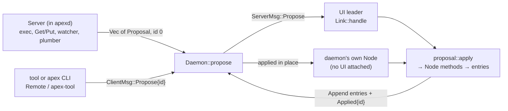
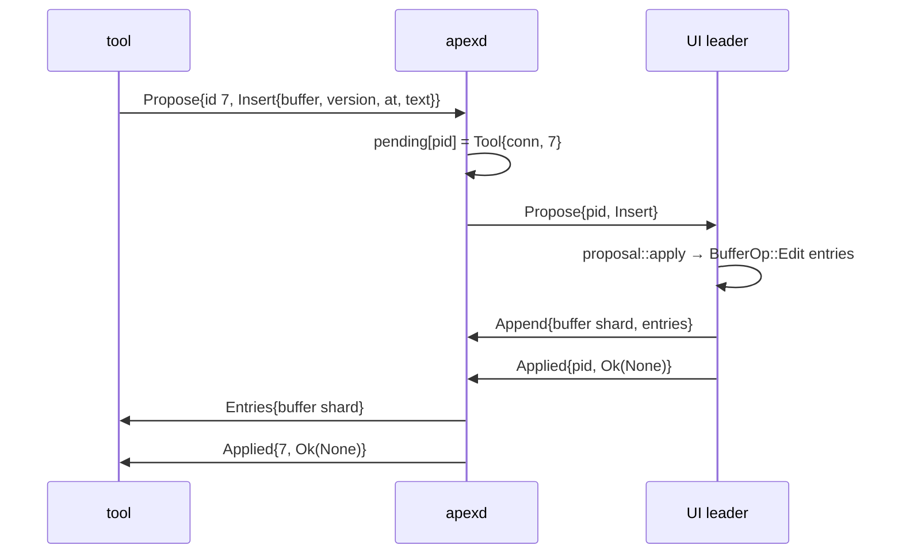

# Proposals: How Others Change State

In apex, only a shard's leader appends entries to that shard (see [Sessions, Shards and Leadership](sessions-and-replication.md)). When a UI is attached, it holds the leases on the buffer, window and layout shards. The daemon's `Server`, tools and the `apex` command all keep replicas of those shards, but they cannot write them. To change something they don't lead, they send a **proposal**: a request, as a value, that the leader turns into entries of its own. The server's own documentation states the rule: "The server never writes a shard it does not lead: everything it wants done to buffers, windows or the layout is a `Proposal` for the leader" ([crates/apex-server/src/lib.rs:5-8](crates/apex-server/src/lib.rs#L5-L8)).

This page covers the `Proposal` enum, how proposals reach the leader, how `proposal::apply` lowers each one into the leader's entries, the `Applied` reply, and the different ways proposals handle a buffer that has changed under them. It ends with the architecture review's critique and the planned collapse. The messages that carry proposals are described on [The Attach Protocol](attach-protocol.md). The node methods that `apply` calls are on [The Node: Leading and Built-in Commands](node.md). The server that produces most proposals is on [The Server: Commands, Files and Processes](server.md).

## Where proposals come from and where they go

Proposals have three kinds of sender:

- **The server.** It answers the leader's B2 execs (`poll_execs`), reports command output (`ReplaceRange`, `Errors`, `Status`), answers Get and Put (`SetContent`, `Clean`, `PutTrimmed`, `SetPath`), reports file-watch events (`SetContent` or `Stale`) and finishes plumb walks (`Goto`, `Look`, `ClientDo`).
- **Tools and the CLI.** A tool sends `ClientMsg::Propose { id, proposal }`, and the SDK's calls are built on these messages.
- **The UI itself.** When it already leads, the UI applies proposals in place with `perform`. This is how the finder, the tag editor and page navigation reuse `Goto`, `SetPath` and `Navigate` ([crates/apex-client/src/app.rs:4340-4346](crates/apex-client/src/app.rs#L4340-L4346), [crates/apex-client/src/tagedit.rs:439](crates/apex-client/src/tagedit.rs#L439)).

The proposal always ends up at one leader, and that leader runs the same function, `proposal::apply`.



Sources: [crates/apex-server/src/lib.rs:1-8](crates/apex-server/src/lib.rs#L1-L8), [crates/apex-server/src/lib.rs:1763-1774](crates/apex-server/src/lib.rs#L1763-L1774), [crates/apex-server/src/daemon.rs:932-979](crates/apex-server/src/daemon.rs#L932-L979), [crates/apex-server/src/proposal.rs:1-3](crates/apex-server/src/proposal.rs#L1-L3)

## The `Proposal` enum

`Proposal` is a serde enum in `apex-server/src/proposal.rs`. It travels as postcard inside `ClientMsg::Propose` and `ServerMsg::Propose`. Any change to it is a wire change, which needs a bump of `PROTOCOL` in `proto.rs`. A comment at line 89 splits the variants into two groups: those the server produces, and those intended for tools ("from tools (the control protocol)"). In practice both groups are open to anyone who can send `Propose`.

### Windows and pages

| Variant | What it asks for | Lowered to |
|---|---|---|
| `OpenWindow { col, from, name, kind, text, hash, select_line, cover }` | Show a file or directory listing. If one is open, reuse it; otherwise make a buffer and a window (acme's `makenewwindow`). With `cover`, put a window of its own over another window. | `window_of`, then `reveal` + select + warp; or `create_buffer_as` + `make_window`; or `cover_window` |
| `NewWindow { col, name, label, scratch, diagnostic }` | An empty buffer at a path, which may be a scratch buffer. With `diagnostic`, the window is made in the stash. | `new_window_as` with a `Spec` |
| `TermWindow { col, dir, label, term }` | A window on a terminal the server has created | `open_term_window` |
| `OpenPage { col, page }` | A page window, whose content is HTML from a buffer or a URL | `open_page` |
| `Navigate`, `Reload`, `PageScroll` | Page navigation state: the URL now, the reload counter, a buffer page's scroll position | `web_navigate`, `reload_page`, `scroll_page` |
| `SetPath`, `SetLabel` | Rename a window, or set or clear its label | `set_window_path`, `set_window_label` |

`Proposal::open_url` and `Proposal::open_html` are helper constructors that build `OpenPage` with `Via::Host` ([proposal.rs:143-154](crates/apex-server/src/proposal.rs#L143-L154)). Page semantics are described on [The I/O Plane and Pages](io-plane-and-pages.md).

### Text and buffers

| Variant | What it asks for | Version check |
|---|---|---|
| `SetContent { buffer, version, text, hash }` | Replace the whole buffer and mark it clean against `hash`. With `version: None`, the replace is unconditional (Get). | Optional, see below |
| `Clean { buffer, version, hash }` | Put wrote the buffer as it stood at `version` | Implicit, through `clean_version` |
| `PutTrimmed { buffer, version, runs, hash }` | Put in an autoindent window: delete the trailing blanks in `runs` as one undo step, then mark the buffer clean | Required |
| `ReplaceRange { select, dir, buffer, version, q0, q1, text }` | Pipe output (`select: true`), or a tool's write | Required |
| `Insert { buffer, version, at, text, follow }` | Insert at an offset and leave the selection alone. With `follow`, views whose caret sits at `at` move past the inserted text. | Required |
| `Stale { buffer, hash }` | The file on disk changed under a dirty buffer | None |
| `Errors { dir, text }` | Append to `dir`'s `+Errors`, or to the session's | None |
| `Snarf { text }` | Set the snarf buffer | None |

### Commands and navigation

| Variant | What it asks for |
|---|---|
| `Exec { ctx, text }` | Run `text` as if B2 had been clicked on it in `ctx`, through `Node::exec` |
| `Edit { window, program }` | Run `Edit program` in the window's context, also through `Node::exec` |
| `Builtin { ctx, text }` | Apex's own meaning of a word, without consulting the rules. A claimed word ends up here when its tool declines it. |
| `Look { ctx, text, reverse }` | Search, after B3 found no file. The text may be in a page or a terminal, which only a client can search. |
| `Status { ctx, exec, status }` | The outcome of an exec entry, skipped if its window is gone |
| `Goto { loc }`, `Nav { back }` | Move the user to a place, recording the back stack, or pop the back or forward stack |
| `Switch { session, window }` | Show another session; a UI does the switch |
| `Select { view, q0, q1 }`, `Show { view, at }` | Move dot without scrolling or focusing; or bring an offset on screen without moving dot |
| `ClientDo { verb, args }` | Something only a UI can do, such as `open` a URL, run the system previewer, or `snarfout` |

### Window flags and notifications

`Own`, `Live` and `Working` each append one `WindowOp` to the window's shard. `Own` says a tool owns the window. `Live` says a tool's process is behind it. `Working` says work is in progress, optionally with a percentage. Each carries `by: Option<AttachmentId>`, and `None` clears the flag. `Notice { window }` calls `Node::notice` so a notified window isn't left hidden. The daemon proposes it right after it records a `ClientMsg::Notify` in the metalog ([daemon.rs:854-864](crates/apex-server/src/daemon.rs#L854-L864)).

Sources: [crates/apex-server/src/proposal.rs:9-154](crates/apex-server/src/proposal.rs#L9-L154), [crates/apex-server/src/proto.rs:157-160](crates/apex-server/src/proto.rs#L157-L160), [crates/apex-server/src/proto.rs:309-313](crates/apex-server/src/proto.rs#L309-L313)

## Routing to the leader

### In the daemon

Each daemon session records which UI connection leads it, as `leader: Option<u64>`. It is set when a UI says hello and takes the leases, and cleared when that UI disconnects and the leases are reclaimed ([daemon.rs:596-614](crates/apex-server/src/daemon.rs#L596-L614), [daemon.rs:537-550](crates/apex-server/src/daemon.rs#L537-L550)). A tool's `Propose` gets a daemon-wide pending id. The daemon records who is waiting and passes the proposal on:

```rust
enum Pending {
    /// A tool's proposal: (tool connection, tool's id).
    Tool { conn: u64, id: u64 },
    /// A plumb walk's `Ask`: (session id, plumb id, who asked).
    Plumb { session: u64, plumb: u64, asker: u64 },
}
```

`Daemon::propose` then makes one of two choices ([daemon.rs:965-979](crates/apex-server/src/daemon.rs#L965-L979)):

- **A UI leads.** The daemon sends it `ServerMsg::Propose { id: pid, proposal }`.
- **No UI is attached.** The daemon leads the session itself and calls `proposal::apply` on its own replica (`s.view`) and log. It then runs `after()` before answering, so the entries the proposal made reach every connection before the `Applied` reply does. A tool that waited for a new window therefore already has that window in its replica.

When the leader sends back `ClientMsg::Applied { id, result }`, the daemon accepts it only from the current leader (`if is_leader`). It then calls `answered`. For a `Pending::Tool`, that relays `ServerMsg::Applied` to the tool under the tool's own id. For a `Pending::Plumb`, the plumb walk continues with `plumb_next`. This is how a refused `ClientDo` or `Goto` makes the walk try the next rule ([daemon.rs:1354-1366](crates/apex-server/src/daemon.rs#L1354-L1366)).

The server's own proposals don't wait for anyone. `after()` collects what the `Server` returned (`poll_execs`, `open_file`, the watcher) and handles it in one of two ways. If a UI leads, each proposal goes out as `Propose { id: 0 }`, which means "nobody waits". If no UI leads, the daemon applies them in a loop: apply, open any `gotos` whose windows were missing, poll the server again, and stop when no new proposals come back ([daemon.rs:1513-1591](crates/apex-server/src/daemon.rs#L1513-L1591)).

Two daemon messages build their proposals before routing them. `OpenFile` becomes `server.open_file(...)`, which yields an `OpenWindow` or, on failure, an `Errors`. `EditOver` produces the same `OpenWindow` and then rewrites its `cover` to `Some(under)` ([daemon.rs:728-750](crates/apex-server/src/daemon.rs#L728-L750)). `Snarf` from a non-UI attachment also sends `ServerMsg::Clipboard` to every UI on the session before routing ([daemon.rs:932-944](crates/apex-server/src/daemon.rs#L932-L944)).

### On the leading client

`Link::handle` in `remote.rs` receives `ServerMsg::Propose` ([remote.rs:373-408](crates/apex-server/src/remote.rs#L373-L408)):

1. For `Insert` and non-empty `ReplaceRange`, it records where the foreign text ends (`foreign_end`, `outputs`). The client uses this to keep win's output point.
2. A `ClientDo` on a UI attachment is queued in `client_asks` and is **not** answered yet. The UI's `answer_asks` carries out `open`, `preview` or `snarfout`, then sends `Applied` itself, possibly much later, after an I/O-plane fetch ([crates/apex-client/src/app.rs:1281-1316](crates/apex-client/src/app.rs#L1281-L1316)). A non-UI leader refuses `ClientDo` at once.
3. Every other variant goes to `proposal::apply(node, log, p)`. A window it returns is pushed onto `made`.
4. `flush(log)` ships the new entries as `Append`. **Only after that**, and only if `id != 0`, does the leader send `Applied { id, result }`.

The daemon processes one connection's messages in order, and it forwards `Append` entries to every other connection in `after()` before it handles the next message. So a tool always sees the entries before it sees the `Applied` for them.



### The proposer's side

`Link::propose` assigns a per-link id, sends the message and returns the id. Replies land in the `applied` map ([remote.rs:305-312](crates/apex-server/src/remote.rs#L305-L312), [remote.rs:409-411](crates/apex-server/src/remote.rs#L409-L411)). `Remote::propose` blocks: it steps the link until its id shows up, until the timeout passes ("timed out waiting for the leader"), or until the connection closes ([remote.rs:747-765](crates/apex-server/src/remote.rs#L747-L765)). The SDK's private `Tool::propose` does the same with a 10-second `TIMEOUT` ([crates/apex-tool/src/lib.rs:123](crates/apex-tool/src/lib.rs#L123), [crates/apex-tool/src/lib.rs:593-599](crates/apex-tool/src/lib.rs#L593-L599)).

Some cases have no reply path:

- **The proposer disconnects.** The daemon drops its `Pending::Tool` entries ([daemon.rs:551](crates/apex-server/src/daemon.rs#L551)).
- **The leader disconnects with a proposal in flight.** The daemon has no code that resends that proposal to the next leader. The tool gets no answer and eventually hits its own timeout.

Sources: [crates/apex-server/src/daemon.rs:190-196](crates/apex-server/src/daemon.rs#L190-L196), [crates/apex-server/src/daemon.rs:932-979](crates/apex-server/src/daemon.rs#L932-L979), [crates/apex-server/src/daemon.rs:1354-1366](crates/apex-server/src/daemon.rs#L1354-L1366), [crates/apex-server/src/daemon.rs:1513-1591](crates/apex-server/src/daemon.rs#L1513-L1591), [crates/apex-server/src/remote.rs:305-411](crates/apex-server/src/remote.rs#L305-L411), [crates/apex-server/src/remote.rs:747-765](crates/apex-server/src/remote.rs#L747-L765)

## `proposal::apply`: lowering into entries

```rust
pub fn apply(node: &mut Node, log: &mut Log, p: Proposal) -> Result<Option<WindowId>, CoreError>
```

`apply` is one big `match`, and nearly every arm calls a `Node` method or `node.append`. Those calls take the leader's epoch for the shard. If the caller does not hold the lease, `Node::append` fails with `CoreError::NotLeader` ([crates/apex-core/src/node.rs:350-356](crates/apex-core/src/node.rs#L350-L356)). So `apply` can only succeed on the leader. The leader then replicates the resulting entries like any other entries; to followers there is nothing special about them, because the proposal itself is never logged.

The `Ok` value is "the window it opened or searched in". The UI uses it to focus or reveal the window. A tool uses it as the id of the window it just made.

Some arms also put work on the node's effect queues for the client. These queues are described on the [node page](node.md):

| Queue | Filled by | Meaning |
|---|---|---|
| `node.seltext` | `OpenWindow`, `NewWindow` (unless diagnostic) | Where typing goes |
| `node.warp` | `OpenWindow` on an open window, `Look` | Where the pointer should move |
| `node.gotos` | `Goto`, `Nav` when `land` can't find the window | A window to open first. In the daemon's loop this is `take_gotos` → `open_file` → `land`. |
| `node.switches` | `Goto`/`Nav` to another session, `Switch` | A UI switches sessions |
| `node.shows` | `Show` | Bring an offset on screen |
| `node.client_finds` | `Look` in a page or terminal | The client searches what it displays |

Several arms are more than one call:

- **`OpenWindow`.** With `cover` naming a live window, it reuses the file's buffer if one is open and calls `cover_window`. Otherwise, if a window on that name and kind exists, it reveals it, selects `select_line` and warps (acme's `openfile`). Otherwise it creates a buffer and a window. The private `select` helper converts a 1-based line number into a selection that includes the newline ([proposal.rs:160-188](crates/apex-server/src/proposal.rs#L160-L188), [proposal.rs:451-460](crates/apex-server/src/proposal.rs#L451-L460)).
- **`Goto`.** It always appends `LayoutOp::Visit { from, to }`, so the back stack is recorded even if the place is in another session or not yet open. `Nav` appends `LayoutOp::NavPop` and then lands the same way ([proposal.rs:304-337](crates/apex-server/src/proposal.rs#L304-L337)).
- **`Look`.** This follows acme's `look3`. It searches the body of the window B3 was in, not `seltext`. For column and top-row contexts it falls back to `seltext`. A window found by the client goes to `find_in_client`. On a hit it reveals the window, unless the window is stashed and only being previewed. It also warps, and sets the tag's Look argument when the search ran in the window's own body ([proposal.rs:365-405](crates/apex-server/src/proposal.rs#L365-L405)).
- **`Exec` and `Edit`.** Both go through `Node::exec`, so the `Edit` proposal has exactly the meaning of the `Edit` command. `Executed::Failed` becomes an `Err`. `Exec` in a window the command just stashed returns `None`, so the client doesn't bring that window back ([proposal.rs:410-428](crates/apex-server/src/proposal.rs#L410-L428)).
- **`Status`.** Skipped if the window is gone, for example after `Del`; the metalog keeps the record ([proposal.rs:278-288](crates/apex-server/src/proposal.rs#L278-L288)).
- **`TermWindow` and `OpenPage`.** Both call `node.catch_up(log)` first. The terminal or page they refer to may have been announced in entries the leader hasn't applied yet.

Sources: [crates/apex-server/src/proposal.rs:156-460](crates/apex-server/src/proposal.rs#L156-L460), [crates/apex-core/src/node.rs:228-258](crates/apex-core/src/node.rs#L228-L258), [crates/apex-core/src/node.rs:350-356](crates/apex-core/src/node.rs#L350-L356)

## Version conflicts

A proposal is made against the proposer's replica, which may be behind the leader. Every proposal that rewrites a buffer carries the `Version` the proposer saw, but the variants handle a mismatch in different ways:

| Proposal | Who sends it | If the buffer has moved past `version` |
|---|---|---|
| `SetContent` with `Some(version)` | The file watcher, for a clean buffer | If the buffer is **dirty**, it is marked `Stale` (once), and the call returns `Ok(None)`. If the buffer is clean, the content is replaced anyway. |
| `SetContent` with `None` | `Get` | No check: the content is replaced and marked clean |
| `ReplaceRange` | Pipe output, tool writes | Returns `Err("buffer … changed meanwhile: at version …, the write was for …")`. When `dir` is set (pipe output), it also writes `pipe output not applied: buffer changed meanwhile` and the text to that directory's `+Errors`. |
| `Insert` | win, tools appending output | Returns `Err("buffer changed meanwhile")` |
| `PutTrimmed` | `Put` in an autoindent window | `Ok(None)` and nothing happens. The file on disk no longer matches the buffer, so the buffer stays dirty. |
| `Clean` | `Put` | Appended as is. `BufferOp::Clean` sets `clean_version`, and `Buffer::dirty()` compares it with the current version, so a buffer typed into since then simply stays dirty. |

The watcher half of this lives in the server. `content_changed` proposes `Stale` for a dirty buffer and a versioned `SetContent` for a clean one. The comment explains why: if the leader has typed since, "it flags the buffer stale instead". It also skips files whose hash matches the server's own last write ([crates/apex-server/src/lib.rs:836-865](crates/apex-server/src/lib.rs#L836-L865)). `Put` chooses between `Clean` and `PutTrimmed` according to whether trimming removed anything ([lib.rs:332-346](crates/apex-server/src/lib.rs#L332-L346)).

A test checks the `ReplaceRange` behaviour. A write at an old version is an error, the tool's text doesn't end up in `+Errors`, and a selecting write selects in the view last selected in (`node.seltext`), even when that is a Zerox twin ([crates/apex-server/tests/server.rs:1351-1372](crates/apex-server/tests/server.rs#L1351-L1372)). With `select: true`, a `ReplaceRange` chooses its view in this order: `seltext` if it is on this buffer, else a body view, else any view. It then calls `select` + `replace_selection`, so the output is left selected, as with acme's `|`. Without a selecting view it calls `replace_text`, which leaves dot alone, as acme's `data` file does.

Sources: [crates/apex-server/src/proposal.rs:219-348](crates/apex-server/src/proposal.rs#L219-L348), [crates/apex-server/src/lib.rs:332-354](crates/apex-server/src/lib.rs#L332-L354), [crates/apex-server/src/lib.rs:720-746](crates/apex-server/src/lib.rs#L720-L746), [crates/apex-server/src/lib.rs:836-865](crates/apex-server/src/lib.rs#L836-L865), [crates/apex-core/src/state.rs:603-612](crates/apex-core/src/state.rs#L603-L612), [crates/apex-core/src/buffer.rs:120-123](crates/apex-core/src/buffer.rs#L120-L123), [crates/apex-server/tests/server.rs:1351-1372](crates/apex-server/tests/server.rs#L1351-L1372)

## Errors and the `Applied` result

`apply` returns `CoreError`. The wire carries `Result<Option<WindowId>, String>`, using the error's `to_string()`. What happens to a failure depends on where the proposal came from:

- A **tool's** proposal sends the error back in `Applied`. The SDK turns it into its `Error`.
- A **server** proposal routed with id 0 has nobody to tell. The leading `Link` logs `remote: proposal: …` to stderr. The daemon's own loop logs `apexd: NAME: proposal: …`. In-process callers go through `perform`, which logs `proposal: …` and keeps the last window made ([lib.rs:1763-1774](crates/apex-server/src/lib.rs#L1763-L1774)).
- A **plumb walk's** proposal (`PlumbStep::Ask`) feeds the result back into the walk. An `Err` from `ClientDo` or `Goto` lets the next rule try ([daemon.rs:1461-1466](crates/apex-server/src/daemon.rs#L1461-L1466)). A headless leader refuses `ClientDo` with "no client here can VERB" ([proposal.rs:289](crates/apex-server/src/proposal.rs#L289)). This is how a URL rule that only a UI can satisfy falls through when no UI is attached. See [Plumbing Rules and Verbs](plumbing.md).

Sources: [crates/apex-server/src/daemon.rs:1354-1366](crates/apex-server/src/daemon.rs#L1354-L1366), [crates/apex-server/src/daemon.rs:1447-1488](crates/apex-server/src/daemon.rs#L1447-L1488), [crates/apex-server/src/remote.rs:389-407](crates/apex-server/src/remote.rs#L389-L407), [crates/apex-server/src/lib.rs:1763-1774](crates/apex-server/src/lib.rs#L1763-L1774)

## The review's critique and the planned collapse

The October 2026 architecture review (ARCHITECTURE.md) treats the proposal set as its main example of non-minimal design. Some of what it describes has been fixed since; this section reports the current state.

**Bugs it found.** All are fixed except the `Look` half of bug 4, which waits for the protocol collapse ([ARCHITECTURE.md:141-147](ARCHITECTURE.md#L141-L147)):

- Bug 1: `ReplaceRange` used to report success on a version conflict. It now returns `Err`.
- Bug 5: a selecting `ReplaceRange` used to select in an arbitrary view. It now prefers `seltext`.
- Bug 4, `Edit` half: `Proposal::Edit` used to drop warnings and ignore intents. It now routes through `Node::exec("Edit …")`.
- Bug 7: `Proposal::Complete` was dead code and no longer exists.
- The review's `OpenWeb`, `OpenHtml` and `WebNavigate` have been replaced by `OpenPage` and `Navigate`.

The `Look` half of bug 4 remains: `Proposal::Look` still handles reverse search, column and top-row contexts, the tag's Look argument and the warp, while the `Look` built-in does not.

**The proposed collapse.** The review groups the variants by what they actually do and suggests one form for each group ([ARCHITECTURE.md:197-267](ARCHITECTURE.md#L197-L267)):

| Today | Proposed |
|---|---|
| `OpenWindow`, `NewWindow`, `TermWindow`, page opens, the daemon's `EditOver` rewrite, `NewWindow.diagnostic` | One `Open { body, place: Col/Near/Over/Stash, label, reuse, pos }` |
| `OpenFile`, `EditOver`, `Plumb{edit_only}`, `Goto`, `Switch`, which can take three round trips through `node.gotos` | One server-handled `Goto{loc, ctx, place}` that proposes a single `Open{…, pos}` |
| `SetContent`, `ReplaceRange`, `Insert`, `PutTrimmed`, with different conflict policies | One conditional edit: `Edit { buffer, if_version, edits, after: {select, clean}, on_conflict: Fail \| MarkStale(hash) }` |
| `Exec`, `Builtin`, `Edit`, `Look` | `Exec{ctx, text, plain}`, after B3's Look behaviour moves into the built-in |
| `Own`, `Live`, `Working`, plus `Notify`/`Notice` | `Flag{window, kind: Owner \| Live \| Working{at} \| Notify, on}` |
| `Clean`, `Stale`, `Snarf`, `SetLabel`, `SetPath` | One allowlisted `Ops(Vec<(Shard, Op)>)` |

The review also proposes replacing per-type reply slots with one `Req{id, body}` → `Reply{id, Result}` envelope. It moves `ClientDo` ("a call to the UI posing as a proposal, routed to the leader rather than the asker") onto a mechanism where tools and clients can serve requests ([ARCHITECTURE.md:518-523](ARCHITECTURE.md#L518-L523)). Step 2 of the plan is "Collapse the protocol", which "roughly halves the proposal and message variants, and ends the `Look` drift" ([ARCHITECTURE.md:878-888](ARCHITECTURE.md#L878-L888)).

The review's conflict table is out of date in one respect: `ReplaceRange` no longer "writes the text to +Errors and returns `Ok`". Its main point still holds. Four proposals handle a version conflict in four ways (mark stale, fail with an `+Errors` note, fail, or do nothing silently), and a caller has to know which one it is using. That is why the review says preview and win each grew a retry loop. On the tool side, the review notes that the SDK's `replace`, `append`, `insert_following` and `set_tag` are "one write with flags, but with different conflict behaviour". It also notes that lsp, preview and win use `Remote` and `Proposal` directly instead of the SDK ([ARCHITECTURE.md:593-627](ARCHITECTURE.md#L593-L627)). See [Writing Tools: the apex-tool SDK](tool-sdk.md) and [win and Language Servers](tool-win-and-lsp.md).

Sources: [ARCHITECTURE.md:27-137](ARCHITECTURE.md#L27-L137), [ARCHITECTURE.md:141-193](ARCHITECTURE.md#L141-L193), [ARCHITECTURE.md:197-277](ARCHITECTURE.md#L197-L277), [ARCHITECTURE.md:518-523](ARCHITECTURE.md#L518-L523), [ARCHITECTURE.md:873-888](ARCHITECTURE.md#L873-L888)
