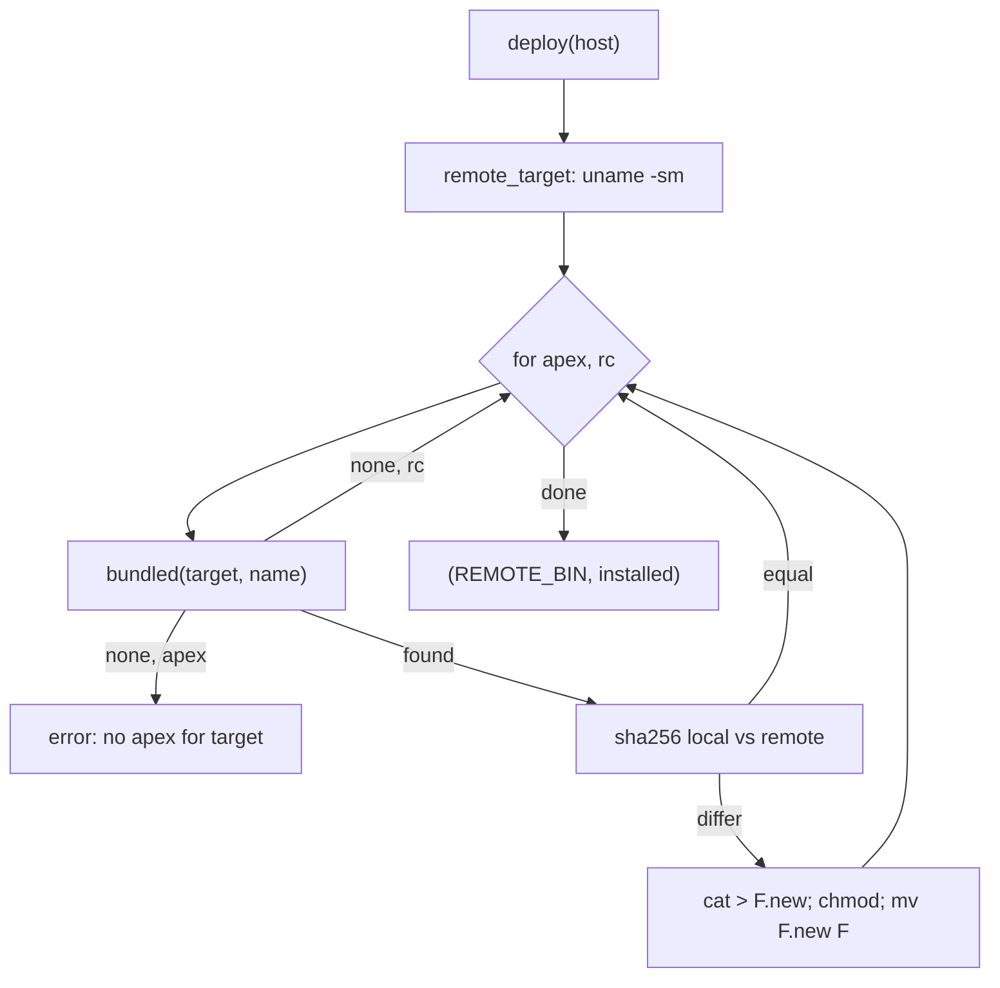

# Remote Hosts and Providers

apex can attach to a session whose daemon runs on another machine. The UI on your Mac then edits files and runs terminals on that machine. The design keeps the remote side small. The only requirement on the destination is a way to run one shell command there with stdin and stdout connected, which is exactly what `ssh HOST COMMAND` does. apex copies its own `apex` binary (and `rc`) to the destination. It then runs `apex attach -stdio` there, which starts the daemon if needed and copies bytes between its stdio and the daemon's Unix socket. The client speaks the ordinary [attach protocol](attach-protocol.md) over the child process's pipes, just as it would over a local socket.

Most of the code is in one module, `crates/apex-server/src/providers.rs`. The bridge is in `apex-cli` (`attach -stdio`), and the child-process plumbing is in `apex-server`'s `remote.rs`. The client calls all of these when it opens a tab on a remote session (see [The UI Client](client.md) and [Sessions, Tabs and Window Chrome](client-chrome.md)). The daemon on the far end is the same `apexd` code described in [The Daemon](daemon.md).

## Providers

A *provider* is a program that runs a command on a destination. It is called as

```text
apex-remote-<provider> DESTINATION COMMAND
```

COMMAND is **one argument**: a shell command line for the destination. It uses `&&`, redirections and the destination's `$HOME`, so it must reach a shell over there. The provider has to run it with stdin and stdout connected and exit with the command's status. This is ssh's own calling convention, which is why `ssh` is the built-in provider and needs no script. There is no configuration file; the provider script is the whole configuration ([providers.rs:1-25](crates/apex-server/src/providers.rs#L1-L25), [providers/README.md](providers/README.md)).

### Destinations: `Dest`

A destination is written `provider:name`, or a bare `name` for ssh (`user@host`). `Dest::parse` splits on the first `:`. It treats the split as a provider only when both sides are non-empty and the left side contains nothing but ASCII alphanumerics, `_` and `-`; anything else is an ssh destination. `Dest::spec` writes the destination back the way a user types it, with ssh destinations bare ([providers.rs:34-59](crates/apex-server/src/providers.rs#L34-L59)).

`Dest::program` chooses the executable to run, trying in this order ([providers.rs:61-82](crates/apex-server/src/providers.rs#L61-L82)):

| Order | Source | Notes |
|---|---|---|
| 1 | `APEX_PROVIDER_<NAME>` | Provider name upper-cased, with `-` replaced by `_` |
| 2 | `APEX_SSH` | Only for the `ssh` provider |
| 3 | `apex-remote-<provider>` on `PATH` | Found by `on_path`, which requires a regular file |
| 4 | `ssh` | Only for the `ssh` provider |
| — | `NotFound` error | "no apex-remote-X command on the PATH for provider X" |

So an `apex-remote-ssh` on the PATH overrides the real `ssh`. The tests use the environment variables to point at a fake host script.

`available()` lists the providers a session can be reached through. It returns `local` and `ssh` first, then every `apex-remote-NAME` file in the `PATH` directories, without duplicates. The client's "Remote…" form in the session selector (`Connect::new` in [shell.rs:968-986](crates/apex-client/src/shell.rs#L968-L986)) offers this list, minus `local` ([providers.rs:85-104](crates/apex-server/src/providers.rs#L85-L104)).

### Running a command: `run`

`run(spec, cmd, stdin)` is the single primitive everything else is built from. It spawns `program DESTINATION CMD`. When `stdin` is given it pipes those bytes to the child and closes the pipe; otherwise stdin is `/dev/null`. It collects stdout. On a non-zero exit it returns an error carrying the trimmed stderr, or `"{host}: {cmd}: {status}"` if stderr was empty ([providers.rs:111-133](crates/apex-server/src/providers.rs#L111-L133)).

### The example providers

The `providers/` directory has two example scripts. Neither is installed automatically; you put one on your PATH under its name.

| Script | Wraps | How the command is run |
|---|---|---|
| `apex-remote-sprite` | `sprite exec` | `exec sprite exec -s "$1" -- sh -c "$2"`, an argv-style tool wrapped in `sh -c` |
| `apex-remote-devserver` | `execdev` | Checks for exactly two arguments (exit 64 otherwise). Finds `execdev` via `$APEX_EXECDEV`, the PATH or a fixed fallback path (exit 127 if none). Runs `execdev "$dest" -- /bin/bash -l -c "$remote_cmd"` so a login shell picks up `/etc/profile.d` |

Both show the general recipe: a tool that takes an argv vector must run `$2` through a shell on the far side ([providers/apex-remote-sprite:1-9](providers/apex-remote-sprite#L1-L9), [providers/apex-remote-devserver:1-33](providers/apex-remote-devserver#L1-L33)).

Sources: [crates/apex-server/src/providers.rs:1-133](crates/apex-server/src/providers.rs#L1-L133), [providers/README.md:1-31](providers/README.md#L1-L31), [providers/apex-remote-sprite:1-9](providers/apex-remote-sprite#L1-L9), [providers/apex-remote-devserver:1-33](providers/apex-remote-devserver#L1-L33), [crates/apex-client/src/shell.rs:968-986](crates/apex-client/src/shell.rs#L968-L986)

## Session URLs

A session anywhere is named by a `SessionUrl`. The scheme is the provider, the authority is the provider's argument, and the path is the session label. Examples are `local:///notes`, `ssh://me@box/dev` and `sprite://box/dev`. `local` is a pseudo-provider that means this machine's daemon and takes no argument. An optional `#id` suffix carries the session's identity (a UUID) once it is known ([providers.rs:306-320](crates/apex-server/src/providers.rs#L306-L320)).

```rust
pub struct SessionUrl {
    pub provider: String,
    pub arg: String,
    pub session: String,     // the label
    pub id: Option<String>,  // the identity, written `#id`
}
```

`SessionUrl::parse` strips a trailing `#id` and then accepts several spellings ([providers.rs:363-406](crates/apex-server/src/providers.rs#L363-L406)):

| Written | Parsed as |
|---|---|
| `scheme://arg/session` | That provider, argument and session. An empty session means `default`. Rejected if the scheme has characters other than alphanumerics, `-` and `_`, if a non-local scheme has an empty argument, or if the session contains `/` |
| `dest/session` (e.g. `me@host/dev`, `sprite:box/dev`) | Destination through `Dest::parse`, via `split_spec` |
| A bare destination containing `@` or `:` (`sprite:box`) | That destination's `default` session |
| Anything else (`work`) | `SessionUrl::local("work")` |

Equality is by identity when both sides know it, and by label otherwise. Provider and argument must match either way. `Hash` covers only provider and argument, which keeps it consistent with that equality ([providers.rs:322-344](crates/apex-server/src/providers.rs#L322-L344)). `session_ref()` gives what to send the daemon: the id if known, otherwise the label. `dest()` turns the URL back into a destination spec for the functions in `providers.rs`, and returns `None` for local. `describe()` gives the human form: `notes (blah.host.com)`, just the host for a `default` session, `notes` for a local one, or `local`.

Session labels are checked by `valid_label`. A label starts with a lowercase letter, continues with lowercase letters, digits and `-`, and does not end in `-`. Because a label starts with a letter, it is never mistaken for a prefix of a UUID. `DEFAULT_SESSION` is `"default"` ([providers.rs:288-304](crates/apex-server/src/providers.rs#L288-L304)).

Sources: [crates/apex-server/src/providers.rs:278-449](crates/apex-server/src/providers.rs#L278-L449), [crates/apex-server/src/providers.rs:478-528](crates/apex-server/src/providers.rs#L478-L528)

## Putting apex on the destination

### Choosing a binary

`remote_target(host)` runs `uname -sm` on the destination and maps the result to apex's naming: `Linux`/`Darwin` become `linux`/`darwin`, and `x86_64`/`amd64` or `aarch64`/`arm64` become `amd64` or `arm64`. Any other OS or architecture is an error. `local_target()` names this machine the same way, from `std::env::consts` ([providers.rs:135-165](crates/apex-server/src/providers.rs#L135-L165)).

apex carries two programs for other machines, `CARRIED = ["apex", "rc"]`. `bundled(target, name)` looks for them relative to the running executable (`crate::self_exe()`) and returns the first candidate that is a file ([providers.rs:167-209](crates/apex-server/src/providers.rs#L167-L209)):

1. `$APEX_REMOTE_BINARIES/<target>/<name>`
2. `../Resources/remote/<target>/<name>`, inside `Apex.app`
3. `remote/<target>/<name>` beside the executable
4. In a dev tree, under `target/`: `<triple>/release/<name>` for `linux-amd64` (`x86_64-unknown-linux-musl`) and `linux-arm64` (`aarch64-unknown-linux-musl`), and `rc-<target>/bin/<name>`
5. For this machine's own kind only: `target/rc-host/bin/<name>`, then the executable's own directory

`mac/build-app.sh` fills case 2. It cross-builds `apex` for `x86_64-unknown-linux-musl`, installs `rc` for that target into `target/rc-linux-amd64`, and copies both into `Contents/Resources/remote/linux-amd64/` ([mac/build-app.sh:17-29](mac/build-app.sh#L17-L29)). A Mac destination can use the app's own `apex` via case 5. See [Building, Testing and Packaging](build-and-test.md).

### `deploy`

`deploy(host)` makes sure `~/.apex/bin/apex` and `~/.apex/bin/rc` on the destination match the local copies byte for byte. It returns the remote path (`REMOTE_BIN`, the literal `$HOME/.apex/bin/apex`) and whether anything was installed ([providers.rs:219-250](crates/apex-server/src/providers.rs#L219-L250)). For each carried program it does the following:

1. Find the local binary with `bundled`. A missing `apex` is an error ("no apex for {target} in this build"). A missing `rc` is skipped, because commands on the host then fall back to `sh`.
2. Compute the local sha256 with `shasum -a 256` (`sha256_of`).
3. Ask the destination for its hash: `(sha256sum F || shasum -a 256 F) | cut -c1-64`. A failure counts as an empty hash.
4. If the hashes differ, send the bytes on the provider's stdin and run `mkdir -p $HOME/.apex/bin && cat > F.new && chmod +x F.new && mv F.new F`.

Writing to `.new` and renaming means a daemon still running the old binary keeps its open file. **What decides whether to update is the content hash of the binary, not the build id or the protocol.** Any rebuild that changes the bytes is pushed on the next attach.



Sources: [crates/apex-server/src/providers.rs:135-250](crates/apex-server/src/providers.rs#L135-L250), [mac/build-app.sh:17-29](mac/build-app.sh#L17-L29), [DESIGN.md:737-768](DESIGN.md#L737-L768)

## Attaching: `apex attach -stdio` and the bridge

### The command line

`attach_command(spec, session)` builds the local shell command whose stdin and stdout carry frames:

```text
<program> <dest-name> '$HOME/.apex/bin/apex -session=<session> attach -stdio'
```

The program and the destination name pass through `shell_quote`, which leaves strings of alphanumerics and `-_.@:/` bare and single-quotes everything else. The remote command is a single single-quoted word, so `$HOME` expands on the destination rather than locally. The session is filtered down to ASCII alphanumerics and `-_.` before it is spliced in ([providers.rs:252-261](crates/apex-server/src/providers.rs#L252-L261), [providers.rs:451-457](crates/apex-server/src/providers.rs#L451-L457)).

### The far end: `attach -stdio`

On the destination, `apex attach -stdio` calls `ensure_server` and then `bridge` ([apex-cli main.rs:1174-1177](crates/apex-cli/src/main.rs#L1174-L1177)). `ensure_server` tries to connect to the socket. If nothing answers, it spawns a daemon whose first session is the requested label, or `default` when what was asked for is not a valid label (an id from a daemon that is gone) ([main.rs:889-900](crates/apex-cli/src/main.rs#L889-L900)). `bridge` connects to the Unix socket and copies bytes both ways. One thread copies stdin to the socket and then shuts down the socket's write half. The main thread copies the socket to stdout in 64 KiB reads, flushing each one. The bridge returns when the socket side closes, even if stdin is still open. It never looks at frames: "this is the whole remote story on the server side" ([main.rs:1199-1228](crates/apex-cli/src/main.rs#L1199-L1228)).

Listing sessions on a host does not attach. `providers::list_sessions(host)` runs `$HOME/.apex/bin/apex -ensure-server ls`. The global `-ensure-server` flag starts the daemon first ([main.rs:758-762](crates/apex-cli/src/main.rs#L758-L762)). The function parses each `label<TAB>id` line into a `SessionInfo`, and accepts a bare label from an older apex ([providers.rs:263-276](crates/apex-server/src/providers.rs#L263-L276), [main.rs:902-907](crates/apex-cli/src/main.rs#L902-L907)).

### The near end: `bridge_child`

`remote::bridge_child(cmd)` runs `sh -c cmd` with piped stdin and stdout, in a process group of its own (`process_group(0)`). It returns the two pipes and a closer. The closer sends `SIGTERM` to the whole group, then kills and reaps the child. The group matters because a bridge left behind keeps the far end open, and some providers only tear down cleanly when it goes ([remote.rs:524-550](crates/apex-server/src/remote.rs#L524-L550)). The pipes are handed to `Link::over_streams`, or `over_streams_creating`, which makes the session if the daemon answers "no session". From then on, the link behaves exactly as it does over a socket ([remote.rs:225-254](crates/apex-server/src/remote.rs#L225-L254)). Headless clients use `Remote::via(cmd, session, name, kind)` ([remote.rs:739-745](crates/apex-server/src/remote.rs#L739-L745)).

```mermaid
sequenceDiagram
    participant UI as "apex-ui (Mac)"
    participant P as "provider (ssh)"
    participant B as "apex attach -stdio (host)"
    participant D as "apex daemon (host)"
    UI->>P: "uname -sm; sha256 check; cat > apex.new"
    UI->>P: "sh -c: ssh host '...apex -session=S attach -stdio'"
    P->>B: "start over ssh"
    B->>D: "ensure_server: spawn if socket silent"
    B->>D: "connect Unix socket"
    D-->>UI: "Build { protocol, id } (via bridge)"
    UI->>D: "Hello { session, ... } (via bridge)"
    D-->>UI: "Welcome { attachment, snapshot }"
    UI->>D: "Append / Propose ..."
    D-->>UI: "Entries / Applied ..."
```

### Where the client uses it

| Caller | What it does |
|---|---|
| `Acme::connect_link` ([app.rs:1430-1457](crates/apex-client/src/app.rs#L1430-L1457)) | For a URL with a `dest()`: `deploy`, then `attach_command` with `session_ref()`, then `connect_via_link` (creating the session if missing) |
| `Acme::connect_existing_targeted` ([app.rs:1461-1479](crates/apex-client/src/app.rs#L1461-L1479)) | Same, for a tab from last time, with `Link::over_streams` so nothing is created |
| `Acme::attach_via` ([app.rs:1496-1510](crates/apex-client/src/app.rs#L1496-L1510)) | `--via CMD`: any command at all, recorded with provider `via` |
| `ask_host` in the session selector ([shell.rs:1362-1380](crates/apex-client/src/shell.rs#L1362-L1380)) | `list_sessions`; if that fails, `deploy` and try again (a newly added host has no apex yet) |
| `restart_daemon` ([restart.rs:95-132](crates/apex-client/src/restart.rs#L95-L132)) | `deploy`, then run `$HOME/.apex/bin/apex stop` on the host, then reattach every tab on that destination |
| Ending and renaming remote sessions ([app.rs:870](crates/apex-client/src/app.rs#L870), [shell.rs:1288](crates/apex-client/src/shell.rs#L1288), [shell.rs:1588](crates/apex-client/src/shell.rs#L1588)) | `providers::run` with `REMOTE_BIN end-session …` or `rename-session …` |

On the command line, `apex attach [DEST/]SESSION | URL` normalises a URL to `dest/session`. For a remote target it launches `apex-ui --remote HOST --session SESS`, and the UI turns that into a `SessionUrl` ([main.rs:1165-1197](crates/apex-cli/src/main.rs#L1165-L1197), [apex-client main.rs:804-818](crates/apex-client/src/main.rs#L804-L818)). For a remote session, the client opens the window first and attaches afterwards ([apex-client main.rs:845-849](crates/apex-client/src/main.rs#L845-L849)).

Sources: [crates/apex-server/src/providers.rs:252-276](crates/apex-server/src/providers.rs#L252-L276), [crates/apex-cli/src/main.rs:208-218](crates/apex-cli/src/main.rs#L208-L218), [crates/apex-cli/src/main.rs:889-907](crates/apex-cli/src/main.rs#L889-L907), [crates/apex-cli/src/main.rs:1165-1228](crates/apex-cli/src/main.rs#L1165-L1228), [crates/apex-server/src/remote.rs:524-550](crates/apex-server/src/remote.rs#L524-L550), [crates/apex-server/src/remote.rs:739-745](crates/apex-server/src/remote.rs#L739-L745), [crates/apex-client/src/app.rs:1430-1510](crates/apex-client/src/app.rs#L1430-L1510), [crates/apex-client/src/restart.rs:95-132](crates/apex-client/src/restart.rs#L95-L132)

## The build id and version mismatches

`apex-server/build.rs` computes the build id. It walks every `.rs` file under `crates/`, adds `Cargo.lock`, and sorts the list. It hashes each file's workspace-relative path and contents, each followed by a NUL, with SHA-256. The first 12 hex digits become `APEX_BUILD_ID`, exposed as `apex_server::BUILD_ID` ([build.rs:1-41](crates/apex-server/build.rs#L1-L41), [lib.rs:12](crates/apex-server/src/lib.rs#L12)). The hash depends only on the sources, so the macOS binary and the cross-built `linux-amd64` binary in the same app get the same id. `apex version` prints it with the protocol number ([main.rs:1050-1053](crates/apex-cli/src/main.rs#L1050-L1053)).

The daemon sends `ServerMsg::Build { protocol, id }` first on every connection ([daemon.rs:459](crates/apex-server/src/daemon.rs#L459)). Over a bridge, this frame comes from the *remote* daemon. `check_build` refuses only on a **protocol** mismatch, returning an `Unsupported` error that tells the user to stop the old daemon. A different build id with the same protocol is accepted ([remote.rs:568-583](crates/apex-server/src/remote.rs#L568-L583)). Note that `apex help version` says that a client of another build "refuses to go on", which is stricter than what the code does.

Two things therefore keep a remote host current. `deploy`'s sha256 comparison replaces the binary on disk whenever the local build differs. A daemon already running the old binary keeps running it, though. If it speaks another protocol, the attach fails with `Unsupported`, and the client offers "Restart Daemon" for that host. That runs `deploy` and then `apex stop` there, and attaching again starts a fresh daemon from the new binary ([restart.rs:76-132](crates/apex-client/src/restart.rs#L76-L132)).

Sources: [crates/apex-server/build.rs:1-41](crates/apex-server/build.rs#L1-L41), [crates/apex-server/src/lib.rs:12](crates/apex-server/src/lib.rs#L12), [crates/apex-server/src/remote.rs:568-583](crates/apex-server/src/remote.rs#L568-L583), [crates/apex-server/src/daemon.rs:459](crates/apex-server/src/daemon.rs#L459), [crates/apex-cli/src/main.rs:591-594](crates/apex-cli/src/main.rs#L591-L594), [crates/apex-client/src/restart.rs:76-132](crates/apex-client/src/restart.rs#L76-L132)

## The ssh test: a fake host

`crates/apex-cli/tests/ssh.rs` tests the whole path without a second machine. `fake_host()` creates a scratch `HOME` and a socket path, and writes a `fake-ssh` script there:

```sh
#!/bin/sh
# $1 is the host; the rest is the command
shift
export HOME=<scratch>
export APEX_SOCKET=<scratch>.sock
exec sh -c "$*"
```

`binaries()` builds an `APEX_REMOTE_BINARIES` tree for `local_target()`. It holds a copy of the test's own `apex` (`CARGO_BIN_EXE_apex`) and a trivial `rc` script. Every test changes process-wide environment variables, so all of them hold the `ONE_AT_A_TIME` mutex. `stop_host` kills the daemon by its unique `-socket=` argument with `pkill -f` ([ssh.rs:13-55](crates/apex-cli/tests/ssh.rs#L13-L55)).

| Test | Checks |
|---|---|
| `deploy_installs_and_updates_our_binary_on_the_host` | `remote_target` equals `local_target`. The first `deploy` installs `apex` and `rc` under the scratch `~/.apex/bin`. A second `deploy` installs nothing. After a byte is appended to the local binary, `deploy` installs again |
| `attaching_over_ssh_bridges_to_a_daemon_on_the_host` | `list_sessions` starts the daemon and lists `default`. The `attach_command` starts with the script path and `box`. A `Remote::via` UI client makes a window, flushes and waits until the buffer shard is acked through the bridge. A second client attached through a new bridge sees the window `remote-notes` |
| `a_provider_is_a_command_named_apex_provider_on_the_path` | Copies the script to `apex-remote-sprite` on the PATH and clears `APEX_SSH`. Checks `Dest::parse`, `program`, `spec` and `split_spec`, and that an unknown provider is an error. Then runs `deploy`, `list_sessions` and `Remote::via` against `sprite:box`, and the new session has two columns |
| `session_urls_name_a_provider_an_argument_and_a_session` | URL parsing and printing, `dest()`, the older spellings, and the rejection of `sprite:///nothing` and `""` |

The unit tests in `providers.rs` cover `available()` with an `apex-remote-zed` put on the PATH, `describe()`, identity-based equality, and label validation ([providers.rs:459-528](crates/apex-server/src/providers.rs#L459-L528)).

Sources: [crates/apex-cli/tests/ssh.rs:1-166](crates/apex-cli/tests/ssh.rs#L1-L166), [crates/apex-server/src/providers.rs:459-528](crates/apex-server/src/providers.rs#L459-L528)

## Edge cases and errors

- **Unsupported hosts.** `remote_target` fails on any OS other than Linux or Darwin, and on any architecture other than amd64 or arm64. `deploy` fails if the build carries no `apex` for the target. The Mac app carries only `linux-amd64` besides its own kind.
- **No `rc` on the host.** This is not an error. Commands run with `sh` instead.
- **First contact.** The session selector deploys and retries when `list_sessions` fails. If the deploy also fails, it reports the *first* error.
- **Hash probe failures.** These are treated as "different", so the binary is reinstalled rather than the attach failing.
- **Stray bridges.** The closer from `bridge_child` kills the whole process group, so a provider's helper processes don't keep the remote end alive.
- **`$HOME`.** Remote paths are always written with a literal `$HOME` inside single quotes, so they expand on the destination.

Sources: [crates/apex-server/src/providers.rs:135-261](crates/apex-server/src/providers.rs#L135-L261), [crates/apex-server/src/remote.rs:524-550](crates/apex-server/src/remote.rs#L524-L550), [crates/apex-client/src/shell.rs:1362-1380](crates/apex-client/src/shell.rs#L1362-L1380)
