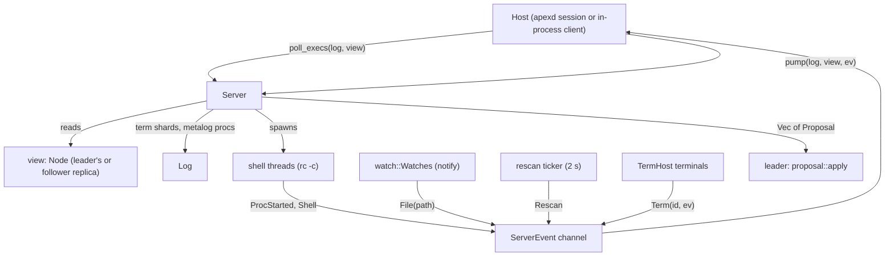
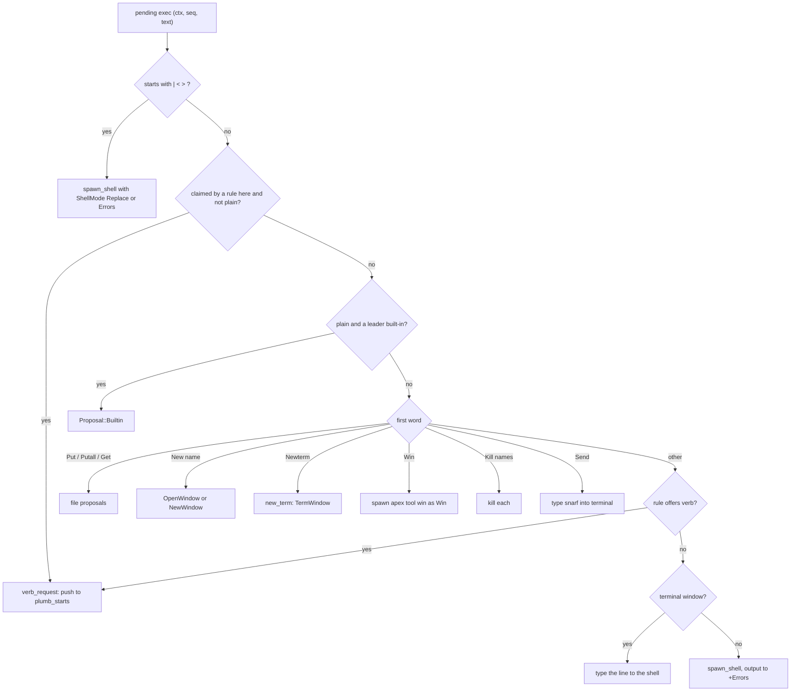
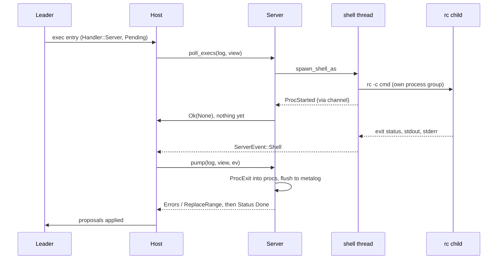
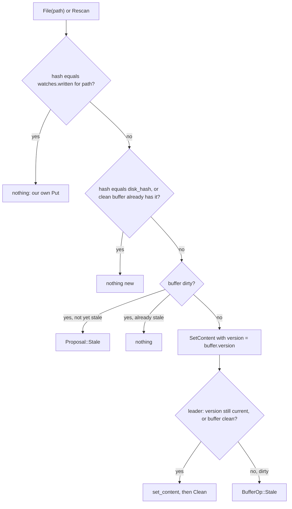

# The Server: Commands, Files and Processes

`apex-server`'s `Server` is the part of apex that touches the world. It runs B2 commands and pipes, reads and writes files, watches them for outside changes, hosts terminals, keeps the session's record of running processes, walks the plumbing rules, and holds the session's current directory and environment. Two kinds of host drive it. The [daemon](daemon.md) keeps one `Server` per session. A client running in-process owns the log itself and keeps a `Server` alongside it.

One rule governs everything the server does: **it never writes a shard it does not lead.** Its own replica, `node`, runs as the `SERVER` attachment and leads only the pinned terminal shards. Anything it wants done to buffers, windows or the layout comes back as a `Proposal`. The caller applies proposals at once (in-process, `apex_server::perform`) or sends them to the session's leader. Proposals are described on [Proposals](proposals.md), terminals on [Terminals](terminals.md), and the plumbing walk on [Plumbing Rules and Verbs](plumbing.md). This page covers commands, files, processes, the ⌘O finder walk, `cd` and the environment.

## Architecture and responsibilities

The server is a passive object. It owns no thread of its own, so the host must call it. Background work runs on threads the server spawns: the shell commands, the file watcher, a rescan ticker and terminal readers. All of it reports back through one unbounded channel of `ServerEvent`s, which `Server::new` returns to the caller. The host drains that channel into `Server::pump`, and after each client message or log change it calls `poll_execs` to find the execs addressed to the server.



The server reads the rest of the session through a `view: &Node` that the caller passes to almost every method. In-process this is the client's own node. In the daemon it is a follower replica kept up to date. Writes the server does make directly go to the log in three ways: term-shard entries through its own `node`, `MetaOp::ProcStart`/`ProcRename`/`ProcExit` appended to the metalog by `flush_procs`, and the default rules installed at session creation.

| `ServerEvent` | Sent by | `pump` turns it into |
|---|---|---|
| `Term(id, ev)` | terminal reader, forwarded by a thread in `Server::new` | term-shard entries; `SetPath`/`SetLabel`/`Snarf`/`Working` proposals |
| `ProcStarted { pid, … }` | a shell thread, once the child has a pid | a `MetaOp::ProcStart` |
| `Shell { out, err, exit, mode, … }` | a shell thread, when the child exits | `Errors`, `ReplaceRange`, `Status` proposals and a `ProcExit` |
| `File(path)` | the `notify` watcher | `SetContent` or `Stale`; a directory relisted |
| `Rescan` | a thread that ticks every `RESCAN` (2 s) | the same, for changes no watcher reported |

Sources: [crates/apex-server/src/lib.rs:1-63](crates/apex-server/src/lib.rs#L1-L63), [crates/apex-server/src/lib.rs:97-224](crates/apex-server/src/lib.rs#L97-L224), [crates/apex-server/README.md:1-21](crates/apex-server/README.md#L1-L21)

## Key state in `Server`

| Field | Purpose |
|---|---|
| `node` | The `SERVER` replica; leads the term shards only |
| `terms`, `pending_terms`, `windowed` | Live terminals, terminals waiting for their window, terminals whose window has been seen |
| `env` | Variables every command and terminal gets on top of acme's (`apexsession`, `apexsessionlabel`, `APEX_SOCKET`, `EDITOR`, `BROWSER` in the daemon) |
| `cwd` | The session's current directory, where top-row commands run |
| `performed`, `plain` | Execs already done (so a rescan of the state does not repeat them); execs to perform without consulting the rules |
| `running` | `Arc<Mutex<Vec<Running>>>`, the commands started and not yet finished, shared with shell threads |
| `procs` | Pending `MetaOp`s for the metalog's process record |
| `watches`, `subscribed`, `stamps`, `changed` | The directory watcher, extra files clients subscribed to, the rescan's last look at each file, and subscribed files that changed |
| `put_warned` | Stale buffers that `Put` has already refused once |
| `plumbs`, `plumb_starts` | Plumb walks in progress; verb execs waiting for the host to start their walk |

Sources: [crates/apex-server/src/lib.rs:106-156](crates/apex-server/src/lib.rs#L106-L156)

## Execs: from B2 to a command

When a user B2s a word, the leader's `Node::exec` resolves it. Leader built-ins (Cut, Undo, Del, Zerox, Look, Edit and so on) run on the leader. Everything else is recorded as an exec entry whose handler is `Handler::Server` and whose status is `Pending`. That includes pipes (`|`, `<`, `>`), `Put`, `Get`, `New name`, `Kill`, `Newterm`, `Win` and any unknown word. `Send` goes to the server only in a terminal window. A word that a rule has *claimed* in that window also goes to the server, because the rule walk runs there ([crates/apex-core/src/node.rs:2016-2049](crates/apex-core/src/node.rs#L2016-L2049), [crates/apex-core/src/node.rs:2066-2070](crates/apex-core/src/node.rs#L2066-L2070)).

`poll_execs` scans the view for such execs, in each window's `execs` and in the layout's `execs` (the top row and column tags). It skips any `(ctx, seq)` already in `performed` and hands the rest to `perform`. `perform` returns one of three things:

- `Ok(Some(props))`: done now. `poll_execs` appends `Status { Done }`.
- `Ok(None)`: asynchronous. The status arrives later with a `ServerEvent::Shell` or at the end of a plumb walk.
- `Err(reason)`: the reason goes to the directory's `+Errors`, plus `Status { Failed(reason) }`.

The first thing `poll_execs` does is `sync_watches`, so the watched directories follow the open buffers after every message the host handles.



A few cases need more explanation:

- **Pipes.** The input is the exec's recorded span (`ExecAt`: buffer, `q0..q1`, version) read from the view. `|` and `<` replace that range with the output: `ShellMode::Replace` produces a `ReplaceRange { select: true, version }` that is valid only at the recorded version. `>` sends the output to `+Errors`. `<` gets no stdin, and a pipe with no buffer also sends its output to `+Errors`.
- **Words in a terminal.** In a terminal window, a word that nothing else took is typed into the running shell with a trailing newline. No second shell is started beside it. The test `b2_in_a_terminal_types_the_text_to_the_program_there` checks this, and also that a rule's verb in a terminal still goes to the rules.
- **`Win`.** This runs `apex tool win …` (see [win and Language Servers](tool-win-and-lsp.md)) under the name `Win`, so `Kill Win` ends it.
- **Claimed words that fall through.** A tool may claim a built-in word and then decline it. If the walk ends with every rule declining, the server puts `(ctx, seq)` in `plain` and removes it from `performed`, so the next `poll_execs` performs it again, this time with apex's own meaning. If the word is a leader built-in, that meaning is `Proposal::Builtin`. A tool that never answered sets `failed`, and the word does not fall through. The test `timed_out_get_rule_fails_without_reloading_generated_content` checks that a dead tool does not trigger a reload by `Get`.

Sources: [crates/apex-server/src/lib.rs:957-1125](crates/apex-server/src/lib.rs#L957-L1125), [crates/apex-server/src/lib.rs:1604-1622](crates/apex-server/src/lib.rs#L1604-L1622), [crates/apex-server/src/lib.rs:1629-1659](crates/apex-server/src/lib.rs#L1629-L1659), [crates/apex-server/tests/server.rs:1020-1065](crates/apex-server/tests/server.rs#L1020-L1065), [crates/apex-server/tests/server.rs:215-254](crates/apex-server/tests/server.rs#L215-L254)

## Running commands through rc

### The shell and the directory

Commands run the way acme's `runproc` runs them: `SHELL -c command`. `command_shell` picks `$acmeshell` if it is set. Otherwise it uses the bundled `rc` ([mariusae/rustrc](build-and-test.md)), looking beside the executable, at `target/rc-host/bin/rc` one to three directories up (a development tree), in `~/.apex/bin/rc`, and then on `PATH`. The last fallback is `sh`. The test `commands_run_in_rc_with_acmes_environment` checks rc syntax (`for(i in a b) …`) when an rc is present.

`dir_of(view, ctx)` gives the working directory:

- a terminal window: the terminal's current directory, which OSC 7 keeps up to date;
- a URL page: the session `cwd`;
- a window whose name ends in `/`, or whose kind is `Dir` or `Errors`, and which names an existing directory: that directory;
- otherwise: the parent of the window's path if it exists, else the session `cwd`.

`a_window_at_a_directory_is_in_it` checks the scratch-window-at-a-directory case, which win's shells and tool panes rely on.

### The environment

`command_env(view, ctx)` builds acme's variables. `winid` is the window's id; for the top row or a column tag it is the window holding the last selected text, or `0`. If the window has a path, `%` and `samfile` both name it. `Server::command_env` adds the session's `env` on top. `shell_in_started` first removes any inherited `acmeaddr`, `winid`, `%` and `samfile`, then sets these. A terminal's shell gets `env` plus `winid`, so a terminal does not start until its window exists (`spawn_pending`).

### Spawning and waiting

`spawn_shell_as` runs each command on a thread of its own, through `shell_in_started`:

```rust
let child = command
    .arg("-c")
    .arg(cmd)
    .process_group(0) // its own group, so Kill reaches what the shell started
    .current_dir(dir)
    .stdin(if input.is_some() { Stdio::piped() } else { Stdio::null() })
    .stdout(Stdio::piped())
    .stderr(Stdio::piped())
    .spawn();
```

Before `exec`, `default_signals` resets every common signal to its default disposition and clears the signal mask. An ignored disposition survives `exec`. A daemon started with SIGTERM ignored used to pass that on to everything it ran, so `Kill` ended nothing. The test `signals.rs` runs in a binary of its own and checks this.

Once the child has a pid, a `started` callback sends `ServerEvent::ProcStarted`, so the metalog records the process before it can end. The process also goes into `running`, marked `script` if its name is `profile` or `attach`. Two more threads read stdout and stderr. If there is input, a third thread writes it to stdin. The command is over when the child **exits**, not when its pipes close: a background program such as `apex tool lsp &` in a profile can hold the pipes open. After the child exits, the reader threads get up to 300 ms to drain. The exit string follows acme's wait message: empty for status 0, otherwise the code or `signal N`. The command's name is read back from `running` at the end, because a program may have renamed itself in the meantime.



When `pump` handles a `Shell` event, it records `ProcExit`. A non-empty exit adds `"{name}: exit {exit}\n"` to `+Errors`. Output goes to `+Errors` or replaces the range, stderr goes to `+Errors`, and a final `Status { Done }` closes the exec.

Sources: [crates/apex-server/src/lib.rs:238-266](crates/apex-server/src/lib.rs#L238-L266), [crates/apex-server/src/lib.rs:720-746](crates/apex-server/src/lib.rs#L720-L746), [crates/apex-server/src/lib.rs:1127-1148](crates/apex-server/src/lib.rs#L1127-L1148), [crates/apex-server/src/lib.rs:1926-1964](crates/apex-server/src/lib.rs#L1926-L1964), [crates/apex-server/src/lib.rs:2001-2034](crates/apex-server/src/lib.rs#L2001-L2034), [crates/apex-server/src/lib.rs:2072-2188](crates/apex-server/src/lib.rs#L2072-L2188), [crates/apex-server/tests/server.rs:377-396](crates/apex-server/tests/server.rs#L377-L396), [crates/apex-server/tests/signals.rs:1-46](crates/apex-server/tests/signals.rs#L1-L46)

## Processes, Kill and process groups

The server tracks running commands in two places. `running` is a live list behind a mutex, and the shell threads keep it up to date. The metalog has `meta.procs`, the replicated record that UIs draw as the top row and the process pills. Changes are queued in `procs` as `MetaOp`s and written by `flush_procs`, in the order they happened. `pump` and `poll_execs` call `flush_procs` as they go. The daemon calls it in `after`, for renames and ended adoptions.

`Running` holds the pid (which is also the process-group id, because of `process_group(0)`), its `name`, the full `cmd`, `dir`, the originating `ctx`, the `started` time, and two flags:

- `adopted`: a program that announced itself with `ClientMsg::Named` but was not started by the server. It is killed by pid, not by group, and is forgotten when its connection goes (`forget_process`).
- `script`: started by the `profile` or `attach` script. A program such a script starts in the background and that names itself is adopted as its own entry instead of renaming the script.

`command_name` gives a command's name: the first word without its directory, as in acme. `name_process` lets a program rename the entry of its group, but only when that entry still has the default name (the first word of its command). A name the server chose on purpose, such as `Win`, stays.

`kill(target)` is acme's `xkill`. It sends SIGTERM to every running command whose name *or pid* equals `target`. For a command the server started, the signal goes to `-(pid)`, the whole group, so it reaches rc and everything rc started. For an adopted program it goes to the pid alone. Terminal shells with a matching name or pid get SIGHUP instead, as if the window had closed. `kill` only sends signals. The ending is recorded when the process actually exits. The `Kill` command, the UI's pills (by pid) and `apex kill` (`ClientMsg::Kill`) all come here. `processes()` returns the running commands together with the live terminal shells, sorted by start time.

Sources: [crates/apex-server/src/lib.rs:73-95](crates/apex-server/src/lib.rs#L73-L95), [crates/apex-server/src/lib.rs:867-955](crates/apex-server/src/lib.rs#L867-L955), [crates/apex-server/tests/server.rs:323-375](crates/apex-server/tests/server.rs#L323-L375), [crates/apex-server/src/daemon.rs:878-884](crates/apex-server/src/daemon.rs#L878-L884), [crates/apex-server/src/daemon.rs:913-920](crates/apex-server/src/daemon.rs#L913-L920)

## Files: reading, Get and Put

### Reading and folder listings

`read_path` returns a display name and a text. For a file, the text is the bytes decoded as lossy UTF-8. For a directory, it is the listing: entry names sorted, directories with a trailing `/`, one per line, and the display name gets a trailing slash too. `open_file(col, from, dir, name, select_line)` resolves the name and reads it. It hashes the text with `Text::content_hash` and proposes `OpenWindow` with kind `Dir` or `File`. The leader reuses a window already showing that path. `resolve(dir, name)` expands `~/` from `$HOME`, joins relative names to `dir`, and normalises `.` and `..` lexically.

### Get

`Get` re-reads the window's file and proposes `SetContent { version: None, … }`, an unconditional replace that the leader follows with `Clean` at the new version. The dirty-window check ("asked once before reloading") happens in the leader's `Node::exec` before the exec ever reaches the server (see [The Node](node.md)).

### Put

`put` writes the window's buffer:

1. A scratch buffer (errors, a preview, a transcript) or a non-file kind cannot be written unless a name is given: `Put: no file name`.
2. The target is the argument, or the buffer's name. Either is resolved against `dir_of` if relative, so `Put` on a window renamed `notes.txt` writes `dir/notes.txt` and the window takes the absolute path (`SetPath`).
3. For a **stale** buffer, a `Put` with no argument fails the first time with `NAME: modified since last read` and records the buffer in `put_warned`. A second `Put` writes, as in acme.
4. In an **autoindent** window, trailing blanks are removed first (acme's `trimspaces`, `apex_core::text::trim_trailing_blanks`). The server then proposes `PutTrimmed { runs, version, hash }`. The leader deletes those runs as one undo step and marks the buffer clean, unless the buffer has moved past `version`, in which case it stays dirty. With nothing to trim, the proposal is a plain `Clean { version, hash }`.
5. The written content's hash is stored in `watches.written[path]` so the watcher can recognise the server's own write (below).

`Putall` runs `put` for every dirty, named, non-scratch file window.

Sources: [crates/apex-server/src/lib.rs:268-355](crates/apex-server/src/lib.rs#L268-L355), [crates/apex-server/src/lib.rs:1041-1059](crates/apex-server/src/lib.rs#L1041-L1059), [crates/apex-server/src/lib.rs:1899-1918](crates/apex-server/src/lib.rs#L1899-L1918), [crates/apex-server/src/proposal.rs:56-63](crates/apex-server/src/proposal.rs#L56-L63), [crates/apex-server/src/proposal.rs:116-121](crates/apex-server/src/proposal.rs#L116-L121), [crates/apex-server/src/proposal.rs:338-347](crates/apex-server/src/proposal.rs#L338-L347), [crates/apex-server/tests/server.rs:87-125](crates/apex-server/tests/server.rs#L87-L125), [crates/apex-server/tests/server.rs:617-640](crates/apex-server/tests/server.rs#L617-L640), [crates/apex-server/tests/server.rs:1067-1115](crates/apex-server/tests/server.rs#L1067-L1115)

## Watching files

### Parent directories, not files

`watch::Watches` wraps a `notify` watcher. It watches the **parent directories** of open files, non-recursively, plus the directories that directory windows show. It does not watch the files themselves, because editors and `git checkout` replace files by rename, and that breaks per-file watches. `sync(files, dirs)` computes the set of directories asked for. If the set is the same as last time, it returns without touching the disk, which matters because the daemon calls it after every message. Otherwise it watches the directories that exist and unwatches the ones no longer wanted. It also records a map from canonical path to named path, because FSEvents reports `/private/var/...` for a file opened as `/var/...`. `as_named` maps an event's path back to the name the buffer uses. `is_change` drops `Access` and `Other` events: on Linux every open of a watched file is an event, including the server's own reads, and forwarding those caused a re-read loop.

`Server::sync_watches` feeds `sync` with every buffer of kind `File` that is not scratch and has an absolute name, plus `subscribed` paths (files a client asked to watch with `subscribe`, used for the I/O plane's file watches, see [The I/O Plane and Pages](io-plane-and-pages.md)), plus the directories of `Dir` buffers.

### Deciding what a change means

Events only name paths. The server decides what they mean by hashing the content:



`file_changed` maps the path to its named form and runs `path_changed`. That function finds the clean, non-scratch file buffer with this name, reads the file and hashes it. If the hash matches `watches.written`, the change is the server's own write and nothing happens. Otherwise it calls `content_changed`. Separately, a `Dir` window on the path's parent is relisted and passed through `content_changed` too, so a new file appears in its directory's window.

`content_changed` holds the rule for both:

- nothing new if the hash equals `buf.disk_hash`, or the buffer is clean and its text already hashes the same;
- for a dirty buffer, `Stale { buffer, hash }`, unless it is already stale; this puts `Get` in the tag;
- for a clean buffer, `SetContent { version: Some(buf.version), … }`.

The `version` on that `SetContent` is what makes this safe. It is the version **this replica** saw. When the leader applies it, it checks: if the version has moved on and the buffer is dirty, the leader appends `BufferOp::Stale` and does not overwrite anything. A lagging follower in the daemon therefore never discards the user's typing.

### Rescans

The watcher cannot see everything. EdenFS under Sapling changes files without inotify events, a directory may be created after it was asked for, and events get lost. So a thread sends `ServerEvent::Rescan` every two seconds. `rescan` calls `watches.recheck()` (forget the last request, so the next `sync` looks again for directories that now exist). It then relists every `Dir` window, and for every watched file compares `(mtime, len)` with the previous look in `stamps`. Only a file whose stamp moved goes through `path_changed`, and even then the content hash decides, so an unchanged file produces nothing. The first look at a file only records its stamp. A changed subscribed file goes into `changed`, which the daemon collects with `take_changed`. `a_rescan_finds_changes_no_watcher_reported` tests the whole path.

Sources: [crates/apex-server/src/watch.rs:1-112](crates/apex-server/src/watch.rs#L1-L112), [crates/apex-server/src/lib.rs:752-865](crates/apex-server/src/lib.rs#L752-L865), [crates/apex-server/src/proposal.rs:219-231](crates/apex-server/src/proposal.rs#L219-L231), [crates/apex-server/src/proposal.rs:406-407](crates/apex-server/src/proposal.rs#L406-L407), [crates/apex-server/tests/server.rs:1309-1334](crates/apex-server/tests/server.rs#L1309-L1334), [crates/apex-server/README.md:66-71](crates/apex-server/README.md#L66-L71)

## The ⌘O finder walk

`find.rs` serves the client's ⌘O quick-open (see [Pickers and Overlays](client-overlays.md)) on the host where the files are. The daemon starts a `find::Job` for `ClientMsg::FindStart { id, dir }`, passes it `FindQuery { gen, query, limit }`, and drops it on `FindStop` or when the connection goes. Each job runs two named threads.

**The walk** (`apex-find-walk`) goes breadth first from the root, so entries near the root come first. Within a directory it sorts entries by name, in batches of `CHUNK` (4096) entries, so a huge directory shows up while it is still being read. It does not descend into directories whose names start with `.` or are `node_modules`, `__pycache__` or `buck-out`, although those directories are still listed. It lists links but does not follow them. It publishes entries to the shared `Index` in chunks of up to 4096 entries, or every `FLUSH` (50 ms), so a reader can snapshot the chunk list without blocking the walk. It stops at `CAP` (1,000,000) entries and sets `capped`. An error reading the root is kept and reported.

**The matcher** (`apex-find-match`) waits on a condvar for a new query generation, or for the index to have grown since the last answer, re-matching at most every `TICK` (120 ms) while the walk continues. With an empty query it sends the first `limit` entries in walk order. Otherwise it scores candidates with `apex_core::fuzzy` in parallel with rayon, in slices of 16384 with a `Scorer` per worker, and keeps a bounded heap of the best `limit`. Ties go to the earlier entry. When a query only extends the previous one, only the previous matches plus the entries indexed since are re-scored. A newer generation, or cancellation, abandons the work part way. The answer is a `ServerMsg::Found { id, gen, items, matched, indexed, done, capped, error }` sent directly to the asking connection's writer.

Dropping a `Job` sets `cancel` and wakes both threads, so neither the walk nor the matching ever holds up the daemon's main thread.

Sources: [crates/apex-server/src/find.rs:1-124](crates/apex-server/src/find.rs#L1-L124), [crates/apex-server/src/find.rs:126-199](crates/apex-server/src/find.rs#L126-L199), [crates/apex-server/src/find.rs:234-335](crates/apex-server/src/find.rs#L234-L335), [crates/apex-server/src/daemon.rs:885-902](crates/apex-server/src/daemon.rs#L885-L902)

## Path completion

`candidates(dir, prefix)` is the file-system half of acme's `textcomplete`, used by ^F completion. It splits the fragment at its last `/` and lists that directory (resolved against `dir`). It keeps names that start with the last part, sorts them, and marks directories. Dot files are included only if the fragment's last part starts with a dot. The daemon answers `ClientMsg::Candidates` with it, using `dir_of` for the directory.

Sources: [crates/apex-server/src/lib.rs:1232-1254](crates/apex-server/src/lib.rs#L1232-L1254), [crates/apex-server/src/daemon.rs:925-931](crates/apex-server/src/daemon.rs#L925-L931), [crates/apex-server/tests/server.rs:1252-1269](crates/apex-server/tests/server.rs#L1252-L1269)

## cd and the session environment

### Current directory

`cwd` starts as the process's directory. `cd(dir)` resolves `dir` against the current `cwd` and refuses anything that is not a directory (`cd: PATH: not a directory`). It then updates `cwd` and returns a `MetaOp::Cwd { host, dir }` (directory with a trailing slash) for the host to append to the metalog, so every replica knows where the session is. `place()` returns the same record for a new session. The daemon uses `cd` for `ClientMsg::Cd` and when a session is created in a given directory. `cwd` is where top-row commands, the profile, attach scripts and started tools run.

### Environment

`env` is a list of variables layered over the server's own environment for every command and terminal. The daemon fills it when a session is made: `apexsession` (the session id), `apexsessionlabel`, `APEX_SOCKET`, and, where available, `EDITOR` (so `$EDITOR` opens in the session) and `BROWSER`. `set_env` updates or adds one variable. `apex env` (`ClientMsg::Env`) calls it and replies with the whole list. A rename of the session updates `apexsessionlabel`.

The profile can change the environment. `run_profile` sources the host's profile (normally `~/.apex/profile`) in one shell named `profile`, run from `cwd` with its output going to `+Errors`. Before that it saves `profile_base`, the full environment the script will start with (`child_env`). The script is prefixed with an exit hook, `fn sigexit { apex env -import }` under rc or `trap 'apex env -import' EXIT` under sh, so the profile's final environment comes back as `ClientMsg::EnvImport`. `import_env` then compares it against the base. Variables that differ are set, variables the script dropped are unset, and the shell's own bookkeeping (`SHELL_OWN`: `status`, `pid`, `path`, `PWD`, `SHLVL` and others) is ignored. An import from anywhere other than the profile is compared against the environment a command would get at that moment.

`run_attach` runs a client's `~/.apex/attach` script on this host each time the client attaches, with `apexattachment` and `apexclient` added so `apex set` inside it applies to that attachment. `start_tool` starts a tool a rule asked for (`start`). It replaces a leading `apex ` with this daemon's own binary (`apex_command`) and runs the command from `cwd`, named after the tool. [Configuration](configuration.md) covers both scripts from the user's side.

Sources: [crates/apex-server/src/lib.rs:1150-1230](crates/apex-server/src/lib.rs#L1150-L1230), [crates/apex-server/src/lib.rs:1811-1828](crates/apex-server/src/lib.rs#L1811-L1828), [crates/apex-server/src/lib.rs:1966-1981](crates/apex-server/src/lib.rs#L1966-L1981), [crates/apex-server/src/daemon.rs:346-400](crates/apex-server/src/daemon.rs#L346-L400), [crates/apex-server/src/daemon.rs:716-727](crates/apex-server/src/daemon.rs#L716-L727), [crates/apex-server/src/daemon.rs:903-912](crates/apex-server/src/daemon.rs#L903-L912)

## Other duties, briefly

- **Terminals.** `new_term` creates a pinned `Term` shard led by the server's node and proposes a `TermWindow`. The shell starts in `spawn_pending` once the window exists. `close_orphan_terms` hangs up terminals whose windows are gone. `pump` turns terminal events (titles, OSC 7 directories, OSC 52, OSC 9;4 progress, OSC 133 marks, exit) into term-shard entries and proposals. See [Terminals](terminals.md).
- **Default rules.** `install_default_rules` installs, owned by the session: the B3 rules for `name:line`, file and directory names (priority −100); `Clear` for terminals; and tool rules for `Preview` (files matching `PREVIEWED`), `Web` and `Newweb`, which start their tool on first use (priority −10). See [Plumbing Rules and Verbs](plumbing.md).
- **Plumb walks.** `plumb_start`, `plumb_next`, `plumb_failed` and the `PlumbStep` they return (`Done`, `Refused`, `Ask`, `AskTool`, `Trace`) also live here, because a walk needs the file system: acme's `expand`, `isfile`/`isdir`, and running `Run` actions as shell commands.

Sources: [crates/apex-server/src/lib.rs:357-589](crates/apex-server/src/lib.rs#L357-L589), [crates/apex-server/src/lib.rs:1256-1323](crates/apex-server/src/lib.rs#L1256-L1323), [crates/apex-server/src/lib.rs:1325-1428](crates/apex-server/src/lib.rs#L1325-L1428), [crates/apex-server/src/lib.rs:1700-1743](crates/apex-server/src/lib.rs#L1700-L1743)

## How the hosts drive it

In the daemon, each session's server events reach the single state-owning thread as `Event::Server(sid, ev)`. The thread calls `pump`, collects `take_changed` and `take_clips`, and passes the proposals to `after`. `after` flushes the process record, closes orphaned terminals, syncs watches and catches the follower view up. If no UI leads, the daemon applies the proposals itself and repeats, calling `poll_execs` again until no new proposals appear. Otherwise the proposals are sent to the leader. Appends from a client also end in `poll_execs`. In-process, the tests do the same by hand: `poll_execs`, `perform`, `close_orphan_terms`, and `pump` for each event (see `poll` and `pump_until` in `tests/server.rs`). The daemon's loop is described on [The Daemon](daemon.md).

## Testing

The integration tests drive a real `Server` against an in-process `Log` and `Node`. They set `SHELL=/bin/sh` so terminal tests do not depend on the login shell of whoever runs them.

| Test file | What it covers |
|---|---|
| `tests/server.rs` | Put/Get and listings; pipes; rc and acme's environment; Kill by name and by pid; the process record; Put to a name typed in the tag; Put's trimming and its undo; rescans; completion candidates; `dir_of`; rule-claimed `Get`; many terminal behaviours |
| `tests/signals.rs` | A server with SIGTERM ignored still kills its children (`default_signals`) |
| `tests/home.rs` | B3 on `~/…:1-130` opens the file under `$HOME` at line 1; a non-file is refused. A binary of its own because it sets `HOME` |
| `find.rs` unit tests | Breadth-first order and skipped directories; best-first matching that narrows; a dropped job sends nothing more; an ignored `large` benchmark on a real tree |
| `watch.rs` unit tests | Reads are not changes |

Sources: [crates/apex-server/tests/server.rs:1-85](crates/apex-server/tests/server.rs#L1-L85), [crates/apex-server/tests/home.rs:1-52](crates/apex-server/tests/home.rs#L1-L52), [crates/apex-server/tests/signals.rs:1-46](crates/apex-server/tests/signals.rs#L1-L46), [crates/apex-server/src/find.rs:337-474](crates/apex-server/src/find.rs#L337-L474), [crates/apex-server/src/watch.rs:78-94](crates/apex-server/src/watch.rs#L78-L94), [crates/apex-server/src/daemon.rs:285-303](crates/apex-server/src/daemon.rs#L285-L303), [crates/apex-server/src/daemon.rs:1513-1551](crates/apex-server/src/daemon.rs#L1513-L1551)
