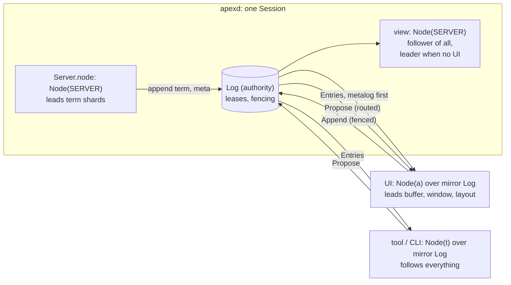
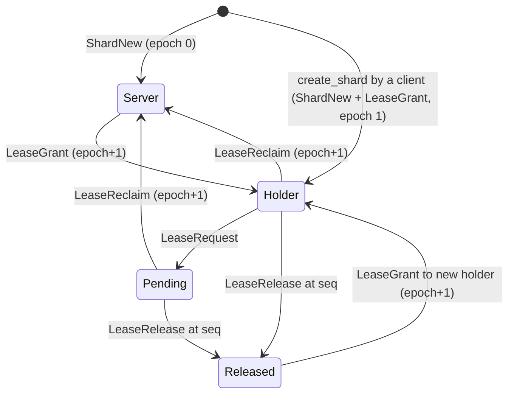
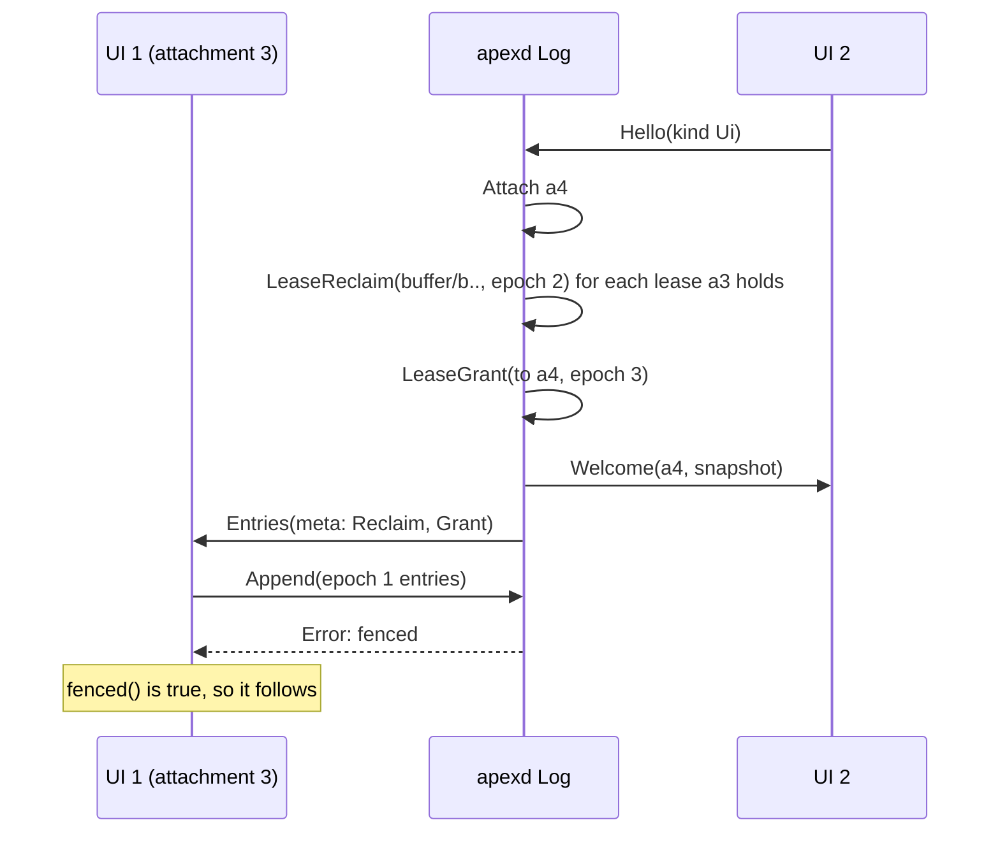

# Sessions, Shards and Leadership

Every part of apex — the daemon, the UI, tools and the `apex` command — holds a copy of the same state and agrees on it in the same way. A **session** is a set of append-only logs called **shards**. Each shard has exactly one **leader**, the only party allowed to append to it. Everyone else is a **follower**: they replay the shard's entries through the same deterministic `apply` and reach identical state. This page describes that model: what a session, an attachment and a connection are, how state is split into shards, who leads each one, and how leadership moves through leases with fence epochs. It also explains two design decisions that follow from the model: views live in the buffer shard, and ids need no coordination.

The entry types and `State::apply` itself are covered in [Entries, State and Apply](core-state.md). The `Node` that leads and follows is covered in [The Node: Leading and Built-in Commands](node.md). The messages that carry entries between processes are covered in [The Attach Protocol](attach-protocol.md), and the way non-leaders ask for changes is covered in [Proposals: How Others Change State](proposals.md).

## Sessions, attachments and connections

DESIGN.md defines three terms, and the code keeps them apart:

| Term | What it is | Where it lives in code |
|---|---|---|
| **Session** | A whole workspace (shards, layout, windows, terminals) on one host. One daemon holds many. | `daemon.rs`'s `Session { id, label, log, server, view, leader }`, keyed by the session's identity |
| **Attachment** | The fenced identity a client gets when it joins a session. Leases are granted to attachments, never to sockets. | `AttachmentId(u64)`, recorded by `MetaOp::Attach { attachment, kind, name }` |
| **Connection** | A socket (or any byte stream) carrying framed messages. | `Conn { session, attachment, kind, out, sent, … }` in the daemon |

A session's identity is a random UUID minted with the log (`new_session_id`, [crates/apex-core/src/log.rs:401-404](crates/apex-core/src/log.rs#L401-L404)). It is the metalog's second entry, `MetaOp::Identity`, and it never changes. The human label is a separate `MetaOp::Label` that a rename appends again.

Attachments come in two kinds, `AttachmentKind::Ui` and `AttachmentKind::Tool` ([crates/apex-core/src/entry.rs:354-358](crates/apex-core/src/entry.rs#L354-L358)). The log issues attachment ids in increasing order from 1 (`Log::attach`). `AttachmentId(0)` is reserved as `SERVER`, the identity the daemon uses when it leads a shard itself ([crates/apex-core/src/ids.rs:43-44](crates/apex-core/src/ids.rs#L43-L44)).

DESIGN.md §4.1 describes connections that drop and resume without ending the attachment. The daemon does not work that way. `Hello` carries no attachment id to resume. When a connection goes, `Daemon::gone` removes the rules the attachment owned, appends `Detach`, and, if it was the leading UI, reclaims every lease it held so the server leads again ([crates/apex-server/src/daemon.rs:518-553](crates/apex-server/src/daemon.rs#L518-L553)). A client that reconnects comes back as a new attachment with a fresh snapshot.

Sources: [DESIGN.md:38-46](DESIGN.md#L38-L46), [crates/apex-core/src/ids.rs:29-44](crates/apex-core/src/ids.rs#L29-L44), [crates/apex-core/src/log.rs:72-100](crates/apex-core/src/log.rs#L72-L100), [crates/apex-server/src/daemon.rs:176-188](crates/apex-server/src/daemon.rs#L176-L188), [crates/apex-server/src/daemon.rs:518-553](crates/apex-server/src/daemon.rs#L518-L553)

## Shards

A shard is one independently replicated log together with the part of the state it drives. `Shard` is a small enum ([crates/apex-core/src/ids.rs:46-62](crates/apex-core/src/ids.rs#L46-L62)):

```rust
pub enum Shard {
    Buffer(BufferId),
    Window(WindowId),
    Layout,
    Term(TermId),
    /// The session's metalog: shards, attachments, leases, plumb rules.
    Meta,
}

impl Shard {
    /// Pinned shards never lease out; the server always leads them.
    pub fn is_pinned(&self) -> bool {
        matches!(self, Shard::Term(_) | Shard::Meta)
    }
}
```

Each shard kind has its own op type. `Op::fits` checks that an op belongs on the shard it is being appended to, and both the log store and `apply` reject a mismatch ([crates/apex-core/src/entry.rs:19-41](crates/apex-core/src/entry.rs#L19-L41)).

| Shard | One per | Holds | Leasable? | Usual leader |
|---|---|---|---|---|
| `buffer/bN` | buffer (a file, a tag, `+Errors`…) | text, version, undo history, dirty/stale state, **views** | leasable | the UI, else the daemon |
| `window/wN` | window | tag and body ids, body kind (Text, Term, Page), font, execs and statuses, flags | leasable | the UI, else the daemon |
| `layout` | session | columns, window placement in pixels, stash, navigation stacks, snarf | leasable | the UI, else the daemon |
| `term/tN` | terminal | grid rows, cursor, modes, size | **pinned** | always the daemon |
| `meta` | session | shards, attachments, leases, plumb rules, settings, notifications, processes, cwd | **pinned** | always the daemon |

DESIGN.md's table also lists a server-wide `registry` shard with `SessionNew/Del/Rename` entries. That shard is not built. The daemon keeps its sessions in an ordinary map, and a client learns about sessions from `ServerMsg::Sessions` listings, not from a replicated log.

### Why split the state into shards

Each shard has its own sequence numbers, so leadership can be decided shard by shard. The two pinned shards hold what only the host can produce. A terminal's grid comes from a pty and a VT parser that run where the daemon runs (see [Terminals](terminals.md)). The metalog is the record of who leads what, so it cannot itself be leased. The leasable shards hold everything the user edits directly. Those go to the UI, so typing, selecting and rearranging never wait on a round trip.

Shards have no atomicity between them. A cross-shard operation is several entries in several logs, and readers must tolerate seeing them in either order. Two things keep this workable. First, the metalog is replayed first: both `Node::catch_up` and the daemon's fan-out in `after` put `Shard::Meta` ahead of the others, so a shard's `ShardNew` arrives before its entries. Second, exec entries name what they act on (`ExecAt { buffer, version, q0, q1 }`), so readers do not have to guess at cross-shard order.

### Why views live in the buffer shard

A *view* is one text's selection and scroll origin: acme's `Text`. `ViewId` names a window's tag, a window's body, a column's tag, or the top row ([crates/apex-core/src/ids.rs:83-100](crates/apex-core/src/ids.rs#L83-L100)). It would be natural to keep a window's selection in that window's shard. apex keeps it in the buffer instead: `Buffer::views: BTreeMap<ViewId, View>`, changed by `BufferOp::ViewAdd`, `ViewDel`, `Select` and `Origin`.

The reason is that an edit moves every selection on the buffer. `Buffer::splice` calls `adjust_views`, which applies acme's `textdelete`/`textinsert` rules to every view ([crates/apex-core/src/buffer.rs:148-179](crates/apex-core/src/buffer.rs#L148-L179)). If `Select` lived in a separate log from `Edit`, two replicas could interleave a selection and an edit differently and end with different selections. Putting both in one shard gives them one sequence. This matters most for Zerox, where two windows show one buffer with independent selections.

Sources: [crates/apex-core/src/ids.rs:46-111](crates/apex-core/src/ids.rs#L46-L111), [crates/apex-core/src/entry.rs:115-142](crates/apex-core/src/entry.rs#L115-L142), [crates/apex-core/src/buffer.rs:148-179](crates/apex-core/src/buffer.rs#L148-L179), [DESIGN.md:122-155](DESIGN.md#L122-L155), [crates/apex-core/src/node.rs:323-342](crates/apex-core/src/node.rs#L323-L342)

## The replicated state machine

Every entry carries its sequence number and its provenance ([crates/apex-core/src/entry.rs:8-17](crates/apex-core/src/entry.rs#L8-L17)):

```rust
pub struct Entry {
    pub seq: Seq,                 // 1-based, per shard
    pub attachment: AttachmentId, // who sequenced it
    pub epoch: Epoch,             // under which fence epoch
    pub op: Op,
}
```

`State` holds the buffers, windows, layout, terminals and `Meta`, plus `applied: BTreeMap<Shard, Seq>`, the last sequence applied on each shard. `State::apply(shard, e)` rejects an op that does not fit the shard. It also rejects an entry whose `seq` is not exactly `applied + 1`, so a follower cannot skip or repeat an entry ([crates/apex-core/src/state.rs:550-569](crates/apex-core/src/state.rs#L550-L569)). `apply` is pure: no clock, no randomness, no I/O. That is why a leader that appends and applies, and a follower that only applies, end with equal state.

Any replica can take a snapshot of the whole `State` as postcard bytes (`to_snapshot`/`from_snapshot`). `applied` is part of the state, so a snapshot records exactly which prefix of each log it covers. A new attachment starts from the daemon's snapshot in `Welcome` and then applies entries after those marks. `State::hash` is a blake3 hash over the whole state, `applied` included, meant for detecting divergence. In the current code only the test suites and benchmarks call it. Those tests check that a follower replaying the log, and a node restored from a mid-way snapshot plus the tail, both equal the leader.

Because a snapshot carries the state, logs need not grow forever. `Log::compact(shard, upto)` drops a prefix and moves the log's `base`. After each fan-out the daemon compacts every shard up to the lowest point that both its replicas and every connection have passed ([crates/apex-server/src/daemon.rs:1570-1582](crates/apex-server/src/daemon.rs#L1570-L1582)). A client's mirror does the same in `compact_mirror`. For a shard the client leads, it also waits until the entries have been shipped and acked.

Sources: [crates/apex-core/src/entry.rs:8-17](crates/apex-core/src/entry.rs#L8-L17), [crates/apex-core/src/state.rs:483-569](crates/apex-core/src/state.rs#L483-L569), [crates/apex-core/src/state.rs:904-1008](crates/apex-core/src/state.rs#L904-L1008), [crates/apex-core/src/log.rs:380-389](crates/apex-core/src/log.rs#L380-L389), [crates/apex-server/src/remote.rs:467-480](crates/apex-server/src/remote.rs#L467-L480), [DESIGN.md:157-187](DESIGN.md#L157-L187)

## The log store: authority and mirror

`Log` in `log.rs` is the in-memory store of one session. It keeps one `ShardLog { entries, base }` per shard and a lease table of `LeaseState { holder, epoch, released }`. It is the **fencing authority**: every append is checked against the lease table. The same type plays two roles:

- **On the daemon it is the authority.** It sequences the metalog itself (`push_meta`, always as `SERVER` at epoch 0). It accepts other leaders' entries through `append_entry`, which requires the entry's `(attachment, epoch)` to match the current lease and its `seq` to be the next one. It updates its lease table directly when it grants, reclaims or releases.
- **On a client it is a mirror** (`Log::mirror(state, hook)`), built from the welcome snapshot. The mirror assigns the *same* sequence numbers the daemon will store, so the client can lead without waiting. The mirror never writes metalog entries of its own. When the client creates or deletes a shard, the `MirrorHook` sends `CreateShard`/`DeleteShard` to the daemon, and the mirror assumes the grant the daemon will make. When metalog entries arrive from the daemon, `append_entry` passes them through `note_meta` to keep the mirror's lease table in step.

`Node` reads its leases from the log, not from `State`. `refresh_leases` sets `epochs = log.held_by(self.attachment)`, the shards whose lease this attachment holds and has not released. The node can only append where it holds a lease: `Node::append` looks up its epoch for the shard, fails with `CoreError::NotLeader` if it has none, and passes the epoch to `Log::append`. `Log::append` fences again against the store ([crates/apex-core/src/node.rs:344-356](crates/apex-core/src/node.rs#L344-L356)).

| `LogError` | Meaning |
|---|---|
| `Fenced { shard, holder, epoch }` | Wrong holder or epoch, lease released, or (in `append_entry`) a sequence gap |
| `NoShard` / `ShardExists` | Unknown shard, or it already exists |
| `WrongShard` | The op does not fit the shard |
| `Pinned` | Tried to request, grant, reclaim or delete a pinned lease or the metalog |
| `NotReleased` | Tried to grant while another attachment still holds the lease |

Sources: [crates/apex-core/src/log.rs:10-148](crates/apex-core/src/log.rs#L10-L148), [crates/apex-core/src/log.rs:213-264](crates/apex-core/src/log.rs#L213-L264), [crates/apex-core/src/node.rs:344-403](crates/apex-core/src/node.rs#L344-L403), [crates/apex-server/src/remote.rs:33-42](crates/apex-server/src/remote.rs#L33-L42)

## Leaders and followers in a running session



The daemon keeps two `SERVER` nodes per session. `Session::view` replays every shard, and when no UI is attached it leads the leasable shards itself. In that case `Daemon::propose` applies tool proposals straight into it ([crates/apex-server/src/daemon.rs:967-979](crates/apex-server/src/daemon.rs#L967-L979)). `Server::node` is the node that creates and appends to terminal shards and records processes. When a session is made, `view` lays out the session (`init_session`) before any UI exists, so tools can work in a session nobody is looking at.

When a UI attaches, it leads `layout`, every `window` and every `buffer`. It types and edits by appending to its mirror and applying locally, then `Link::flush` ships each led shard's new entries as `Append`. The daemon checks them with `append_entry`, has `view` catch up, acks, and sends the entries to every other connection, metalog first ([crates/apex-server/src/daemon.rs:1553-1569](crates/apex-server/src/daemon.rs#L1553-L1569)). Tools and the CLI never lead. They follow and propose, and the daemon forwards each proposal to the leading UI's connection, whose `proposal::apply` turns it into the leader's own entries.

Sources: [crates/apex-server/src/daemon.rs:176-188](crates/apex-server/src/daemon.rs#L176-L188), [crates/apex-server/src/daemon.rs:386-394](crates/apex-server/src/daemon.rs#L386-L394), [crates/apex-server/src/daemon.rs:650-678](crates/apex-server/src/daemon.rs#L650-L678), [crates/apex-server/src/daemon.rs:932-979](crates/apex-server/src/daemon.rs#L932-L979), [crates/apex-server/src/lib.rs:359-370](crates/apex-server/src/lib.rs#L359-L370), [crates/apex-server/src/remote.rs:314-372](crates/apex-server/src/remote.rs#L314-L372), [ARCHITECTURE.md:27-38](ARCHITECTURE.md#L27-L38)

## Leases, fence epochs, transfer and reclaim

A lease is a `(holder, epoch)` pair per shard. The metalog records every change to it, and `Meta::leases` holds the replicated view: `Lease { holder, epoch, seq, pending, released }` ([crates/apex-core/src/state.rs:375-385](crates/apex-core/src/state.rs#L375-L385)). Every grant and every reclaim bumps the **fence epoch**. Since the log store refuses any append whose epoch is not the current one, a client that still believes it leads cannot write anything once it has lost the lease.



The operations on `Log`:

| Method | Metalog entry | Rule |
|---|---|---|
| `create_shard(shard, creator)` | `ShardNew`, then `LeaseGrant` | A leasable shard goes to its creator at epoch 1. A pinned shard, or one the server creates, stays with `SERVER` at epoch 0. |
| `request(shard, to)` | `LeaseRequest` | Refused for pinned shards. `apply` records the waiting attachment in `pending`. |
| `release(shard, from, seq)` | `LeaseRelease` | Only the holder may release. It records the last sequence flushed, and further appends are fenced. |
| `grant(shard, to)` | `LeaseGrant { epoch+1, seq }` | Allowed only if the server holds the lease or the holder has released. Otherwise `NotReleased`. |
| `reclaim(shard)` | `LeaseReclaim { from, epoch+1, seq }` | Takes the lease back to `SERVER` whether or not the holder answers. The old epoch is dead from then on. |

**Transfer** is cooperative: request, then the holder flushes and releases, then grant. Nothing is lost. **Reclaim** is the fallback for a holder that does not answer. It is safe because the old leader's unflushed entries can no longer be appended, so a reclaim can lose entries but can never let two leaders write the same shard.

### Single-player mode as built

DESIGN.md (§4.4) says a new UI tries transfer first and reclaims only after a deadline. The daemon is simpler: one UI leads a session at a time, and a new UI takes over at once. In `Daemon::hello`, for a `Ui` attachment, the daemon goes over every non-pinned shard, reclaims any lease held by an attachment that has not released, and grants the lease to the newcomer ([crates/apex-server/src/daemon.rs:596-614](crates/apex-server/src/daemon.rs#L596-L614)). It then records the newcomer's connection as `Session::leader`. The request/release path exists in `Log` and `Node` (`take_lease`, `release_lease`), and the core test `fencing_rejects_a_stale_leader` exercises it. The daemon does not use it yet.

The UI that was displaced keeps following. It finds out from the metalog it replays: `Acme::fenced` is true when the mirror's `layout` lease is no longer held by this attachment ([crates/apex-client/src/app.rs:2279-2282](crates/apex-client/src/app.rs#L2279-L2282)). The client then shows the session as fenced, or "watching". The recovery path DESIGN.md describes, which re-submits an unflushed tail as base-versioned proposals into a `+Recovered` buffer, is not implemented. Tool-held buffer leases with a TTL are design intent too. Today tools only propose.



Sources: [crates/apex-core/src/log.rs:229-378](crates/apex-core/src/log.rs#L229-L378), [crates/apex-core/src/state.rs:797-848](crates/apex-core/src/state.rs#L797-L848), [crates/apex-server/src/daemon.rs:588-642](crates/apex-server/src/daemon.rs#L588-L642), [crates/apex-core/tests/core.rs:246-272](crates/apex-core/tests/core.rs#L246-L272), [crates/apex-client/src/app.rs:2279-2282](crates/apex-client/src/app.rs#L2279-L2282), [DESIGN.md:311-365](DESIGN.md#L311-L365)

## Creating shards from a client

When a UI makes a new buffer, `Node::create_buffer_as` allocates a `BufferId`, calls `Node::create_shard`, and appends `BufferOp::Create`, all without waiting. On a mirror, `Log::create_shard` inserts the shard, assumes the lease `(creator, epoch 1)`, and sends `CreateShard` through the hook. Because the mirror writes no metalog entry of its own, `Node::create_shard` inserts the shard into `state.meta.shards` directly so that the entries that follow will apply ([crates/apex-core/src/node.rs:358-372](crates/apex-core/src/node.rs#L358-L372)).

The order on the wire is what makes this correct. The hook's `CreateShard` goes out on the same writer before the `Append` that `flush` sends later. So the daemon has already run `create_shard`, appending `ShardNew` and then `LeaseGrant` to the creator at epoch 1, by the time the entries arrive and pass the fence. Deleting works the same way in reverse. On a mirror, `Node::delete_shard` drops the shard's state at once with `apply_unsequenced` (a `ShardDel` that does not advance any sequence), and the daemon's `ShardDel` follows later.

Sources: [crates/apex-core/src/log.rs:229-264](crates/apex-core/src/log.rs#L229-L264), [crates/apex-core/src/node.rs:358-418](crates/apex-core/src/node.rs#L358-L418), [crates/apex-core/src/state.rs:541-548](crates/apex-core/src/state.rs#L541-L548), [crates/apex-server/src/daemon.rs:679-694](crates/apex-server/src/daemon.rs#L679-L694)

## Ids without coordination

All ids are plain `u64` newtypes: `BufferId`, `WindowId`, `ColumnId`, `TermId`, `AttachmentId`, `RuleId`, `GroupId`. Whoever creates a thing issues its id ([crates/apex-core/src/ids.rs:1-34](crates/apex-core/src/ids.rs#L1-L34)). A leader cannot ask the daemon for an id without waiting a round trip, so each `Node` takes ids from a range of its own:

```rust
/// Ids are unique per attachment without coordination.
fn alloc(&mut self) -> u64 {
    let id = (self.attachment.0 << 40) | self.next_id;
    self.next_id += 1;
    id
}
```

Undo groups use the same scheme with a separate counter (`new_group`). The attachment id fills the top 24 bits and a per-node counter the low 40 ([crates/apex-core/src/node.rs:304-315](crates/apex-core/src/node.rs#L304-L315)). Attachment ids are never reused within a session, so two attachments can never issue the same buffer, window or column id. The daemon's `SERVER` node allocates from prefix 0. The other ids come from the single place that sequences them:

- `AttachmentId` comes from the authoritative log's `next_attachment`.
- `RuleId` comes from the log's `next_rule`. A mirror starts its counter past the highest rule in its snapshot.
- `TermId` comes from the `Server`'s own `next_term`, since only the daemon creates terminals.

Sources: [crates/apex-core/src/ids.rs:1-44](crates/apex-core/src/ids.rs#L1-L44), [crates/apex-core/src/node.rs:304-315](crates/apex-core/src/node.rs#L304-L315), [crates/apex-core/src/log.rs:102-121](crates/apex-core/src/log.rs#L102-L121), [crates/apex-core/src/log.rs:275-298](crates/apex-core/src/log.rs#L275-L298), [crates/apex-server/src/lib.rs:364-367](crates/apex-server/src/lib.rs#L364-L367), [crates/apex-core/README.md:18-32](crates/apex-core/README.md#L18-L32)

## The metalog

Everything *about* the shards is in the metalog, rather than in the shards themselves. It is the session's authority, and the daemon always leads it. Its entries (`MetaOp`) fall into a few groups:

| Group | Entries | Effect in `Meta` |
|---|---|---|
| Session | `Init`, `Identity`, `Label`, `Cwd` | `id`, `label`, `host`, `cwd` |
| Shards | `ShardNew`, `ShardDel` | `shards`, and the default lease (`SERVER`, epoch 0). `ShardDel` also drops the buffer, window (and its layout place) or terminal, and the shard's `applied` mark. |
| Attachments | `Attach`, `Detach` | `attachments`. `Detach` also drops that attachment's settings and the notifications it raised. |
| Leases | `LeaseRequest`, `LeaseRelease`, `LeaseGrant`, `LeaseReclaim` | `leases` |
| Plumbing | `PlumbRuleInstall`, `PlumbRuleRemove` | `rules` (see [Plumbing Rules and Verbs](plumbing.md)) |
| Settings | `Set`, `Unset` | `settings`, per owner (see [Configuration](configuration.md)) |
| Attention | `Notify`, `Unnotify` | `notifications`, oldest first, at most one per window |
| Processes | `ProcStart`, `ProcRename`, `ProcExit` | `procs`, running ones plus the last 16 that ended |

Notifications and processes are in the metalog, not in window shards, because they are the daemon's to order and need no lease. Notifications follow the same rule as settings: a tool's notifications go when it detaches.

Sources: [crates/apex-core/src/entry.rs:510-556](crates/apex-core/src/entry.rs#L510-L556), [crates/apex-core/src/state.rs:400-429](crates/apex-core/src/state.rs#L400-L429), [crates/apex-core/src/state.rs:797-900](crates/apex-core/src/state.rs#L797-L900), [DESIGN.md:138-145](DESIGN.md#L138-L145)

## Design and code: what differs

DESIGN.md describes intent, and parts of this model are only partly built. In summary:

| DESIGN.md says | The code does |
|---|---|
| A `registry` shard lists sessions | The daemon keeps a `sessions` map. There is no registry shard. |
| Connections resume under the same attachment | A dropped connection detaches. Reconnecting gives a new attachment. |
| Transfer first, reclaim after a deadline | A new UI reclaims and grants at once in `hello` |
| Fenced tails are recovered into `+Recovered` | Not implemented |
| Tools may take buffer leases with a TTL | Tools only propose |
| Nodes compare hashes at attach and periodically | `State::hash` is used only in tests and benchmarks |

Everything else on this page — shards with fenced logs, pinned versus leasable shards, epoch-bumping grants and reclaims, the client mirror that sequences ahead of the daemon, views sequenced with edits, and attachment-prefixed ids — is what the code does today.

Sources: [DESIGN.md:122-145](DESIGN.md#L122-L145), [DESIGN.md:193-216](DESIGN.md#L193-L216), [DESIGN.md:311-365](DESIGN.md#L311-L365), [crates/apex-server/src/daemon.rs:518-642](crates/apex-server/src/daemon.rs#L518-L642)
