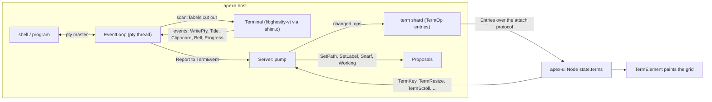
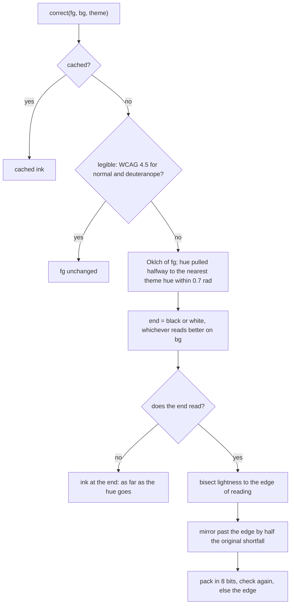

# Terminals

A terminal window in apex is a window whose body is `Body::Term`. Its contents are a grid of cells kept in a **term shard**. The shell runs on the host that owns the session, on a pseudoterminal that the server opens itself. Ghostty's VT library (libghostty-vt) parses the program's output into a screen. A loop then turns that screen into `TermOp` entries, which the daemon appends to the term shard as its leader. Every client replays those entries like any other shard (see [Sessions, Shards and Leadership](sessions-and-replication.md)) and paints the grid straight from core state. Keystrokes go the other way, as messages to the daemon. The daemon encodes them for the program, because the encoding depends on terminal modes that only the server knows.

The pipeline has four layers. `pty.rs` owns the pty and the child process. `ghostty-vt-sys` is the FFI crate and C shim over libghostty-vt. `term_loop.rs` and `term.rs` hold the pty thread and the `TermHost`. On the client, `term_element.rs` draws the grid and `contrast.rs` corrects colours. This page follows the bytes through each layer. The `win` tool, which runs a shell in an editable *text* window instead of a grid, is covered in [win and Language Servers](tool-win-and-lsp.md). The surrounding `Server` and daemon are covered in [The Server](server.md) and [The Daemon](daemon.md).

## Architecture at a glance



Each terminal has three threads of control. The **pty thread** (`EventLoop::run`) reads the master fd and feeds the parser. The `Server`'s forwarding thread moves `(TermId, TermEvent)` pairs into the single server event channel ([crates/apex-server/src/lib.rs:161-177](crates/apex-server/src/lib.rs#L161-L177)). The **daemon's state thread** calls `Server::pump`, which reads the screen under the `Terminal` mutex and appends ops. The `Terminal` is shared between the pty thread and the server as `Arc<Mutex<Terminal>>`. The pty thread holds the lock while it writes bytes into the parser, and the server holds it while it snapshots.

Sources: [crates/apex-server/src/term.rs:1-15](crates/apex-server/src/term.rs#L1-L15), [crates/apex-server/src/term_loop.rs:1-9](crates/apex-server/src/term_loop.rs#L1-L9), [crates/apex-server/src/lib.rs:161-177](crates/apex-server/src/lib.rs#L161-L177), [crates/apex-server/src/daemon.rs:285-303](crates/apex-server/src/daemon.rs#L285-L303)

## The pty and the child (`pty.rs`)

libghostty-vt opens no pty and starts no threads, so apex does both itself, following alacritty's `tty` module. `Pty::spawn` works in this order:

1. It calls `notify_ready()` first. On macOS, a fork that happens while another thread is setting up libnotify can leave the child half-initialised, and the child is then killed by SIGKILL before exec. Registering and cancelling a notification once, under a `Once`, makes sure setup is finished before any fork. On other platforms the function is a no-op ([crates/apex-server/src/pty.rs:135-162](crates/apex-server/src/pty.rs#L135-L162)).
2. It opens a pty with `rustix_openpty`, makes the master non-blocking (the loop polls and drains it), and sets the window size with `TIOCSWINSZ`. The size includes pixels at 8×16 per cell, which matches `CELL_W`/`CELL_H` in `term.rs`.
3. It spawns the program with the slave as stdin, stdout and stderr, and removes `XDG_ACTIVATION_TOKEN` and `DESKTOP_STARTUP_ID` from the environment. In `pre_exec` the child calls `setsid()`, takes the slave as its controlling terminal with `TIOCSCTTY`, and resets SIGCHLD, SIGHUP, SIGINT, SIGQUIT, SIGTERM and SIGPIPE to their defaults so that job control and ^C reach the shell.
4. It drops the parent's copy of the slave, so the slave is closed once the child closes it.

`Pty::exit` polls `try_wait` and caches the status. A death by signal is reported as `128 + signal`, the way a shell reports it. `hangup` kills and reaps the child, which is what closing the window does.

| Function | Role |
|---|---|
| `Pty::spawn(opts, cols, rows)` | Open the pty and start the program in its own session |
| `read` / `write` | Raw `libc::read`/`write` on the master; `Ok(0)` at EOF |
| `resize` | `TIOCSWINSZ` |
| `exit` / `hangup` | Exit status once ended / kill and wait |
| `setup_env` | Sets `TERM=xterm-256color`, `COLORTERM=truecolor`, `TERM_PROGRAM=apex`, `TERM_FEATURES=T3UBCwHP` in the process environment |
| `shell_path(shell)` | The `Newterm.shell` setting, else `$SHELL`, else `/bin/sh` |

Sources: [crates/apex-server/src/pty.rs:17-132](crates/apex-server/src/pty.rs#L17-L132), [crates/apex-server/src/pty.rs:177-211](crates/apex-server/src/pty.rs#L177-L211)

## libghostty-vt through `ghostty-vt-sys`

### Why a C shim

The VT library's API uses C enums, sized structs and tagged unions, and it is not yet stable. `shim.c` compiles against `<ghostty/vt.h>`, so those types are read from the real headers at compile time instead of being copied into Rust by hand. The shim walks the render state's rows and cells and returns exactly what the term shard needs: an `ApexCell` with a character, foreground, background, flags and link index. The Rust side (`lib.rs`) declares about fifteen `apex_vt_*` functions and wraps them in a safe `Terminal`.

```rust
#[repr(C)]
pub struct Cell { pub ch: u32, pub fg: u32, pub bg: u32, pub flags: u8, pub link: u16 }

pub struct Terminal { vt: *mut ApexVt, cells: Vec<Cell>, cols: u16, rows: u16 }
unsafe impl Send for Terminal {}
```

`Terminal` is `Send` because the library keeps no global state and starts no threads. Every call takes the handle.

### What the shim exposes

| C function | Rust wrapper | What it does |
|---|---|---|
| `apex_vt_new` / `apex_vt_free` | `Terminal::new`, `Drop` | Create the terminal, render state and row/cell iterators; set the scrollback limit and the callbacks |
| `apex_vt_write` | `write` | Feed bytes to the parser; afterwards, if the title callback fired, read the title and queue a title event |
| `apex_vt_resize`, `apex_vt_scroll`, `apex_vt_scroll_bottom` | `resize`, `scroll`, `scroll_to_bottom` | Resize the grid and move the viewport through the history |
| `apex_vt_snapshot` | `screen()` | Fill `cols*rows` cells, the cursor, the viewport's `top` line and the link table |
| `apex_vt_link` | (inside `screen()`) | URI of a 1-based link index, valid until the next snapshot |
| `apex_vt_size` | `size()` | `(scrollback rows, total rows, at_bottom)` |
| `apex_vt_text` | `text(from, to)` | Plain text between two screen points, wrapped lines joined; returns `-len` if the buffer is too small |
| `apex_vt_mode` | `mode(Mode)` | DECCKM, bracketed paste, focus events, alternate screen, any mouse mode, SGR mouse, alternate scroll |
| `apex_vt_set_colors` | `set_colors` | Default fg/bg and a 256-entry palette (the 16 given, plus the xterm cube and grey ramp) |
| `apex_vt_next_event` | `events()` | Pop queued events |

`Terminal::screen` calls the snapshot up to twice. If the program resized the grid itself (DECCOLM), the shim returns `-1`, and the wrapper grows its buffer and asks again ([crates/ghostty-vt-sys/src/lib.rs:186-213](crates/ghostty-vt-sys/src/lib.rs#L186-L213)).

### Colour packing

The shim packs colours the way `apex_core::Cell` documents them:

| Top byte | Meaning |
|---|---|
| `0x00` (whole value 0) | Theme default: ink for `fg`, no background for `bg` |
| `0xff` | An exact RGB colour the program named, including palette indices 16–255, which are resolved through the palette |
| `0xfe` | One of the 16 ANSI colours by index, left for the client's theme to colour |
| `0xfd` | The theme's own ink (`…00`) or paper (`…01`); appears where a cell is inverse and a default colour swaps sides |

`pack_color` keeps indices below 16 symbolic and resolves everything else. Three details in `apex_vt_snapshot` matter for full-screen programs:

- **Background-only cells.** An erase while a background is set leaves cells whose content tag is `BG_COLOR_PALETTE` or `BG_COLOR_RGB`. Their colour is stored in the cell, not in its style, so the shim reads it from the cell. Otherwise the colour would show only under text.
- **Inverse video.** Inverse swaps fg and bg, and a default side becomes `APEX_DEFAULT_FG`/`APEX_DEFAULT_BG`.
- **Faint.** Faint text gets a fixed grey ink (`0xff777777`).

Wide-character spacer cells are skipped and left blank, and invisible text becomes a space.

### Hyperlinks and events

OSC 8 links are interned per snapshot: `link_of` looks up the cell's URI in `vt->links` and returns a 1-based index. The table is cleared at the start of each snapshot.

The library's callbacks push to a linked list of `ApexEvent`s:

| Event | Source |
|---|---|
| `WritePty` | Answers to queries such as DSR |
| `Bell` | BEL |
| `Clipboard` | OSC 52; the first content, decoded |
| `Progress` | OSC 9;4; the state byte and a percentage, or `0xff` for none |
| `Title` | Read after the write, because the title is only available once the callback has returned |

`apex_vt_next_event` hands out each event's bytes borrowed until the next call. It keeps the last event in a thread-local and frees it on the following call. `Terminal::events` copies the bytes out immediately.

Sources: [crates/ghostty-vt-sys/src/lib.rs:1-273](crates/ghostty-vt-sys/src/lib.rs#L1-L273), [crates/ghostty-vt-sys/src/shim.c:1-142](crates/ghostty-vt-sys/src/shim.c#L1-L142), [crates/ghostty-vt-sys/src/shim.c:146-196](crates/ghostty-vt-sys/src/shim.c#L146-L196), [crates/ghostty-vt-sys/src/shim.c:215-415](crates/ghostty-vt-sys/src/shim.c#L215-L415), [crates/ghostty-vt-sys/src/shim.c:427-502](crates/ghostty-vt-sys/src/shim.c#L427-L502), [crates/apex-core/src/entry.rs:294-309](crates/apex-core/src/entry.rs#L294-L309)

### Building the library

libghostty-vt is Zig, and its C API exists only on Ghostty's main branch. `build.rs` therefore pins a commit (`GHOSTTY_COMMIT`) and builds that commit with Zig 0.16:

```
zig build -Demit-lib-vt=true -Demit-xcframework=false -Doptimize=ReleaseFast --prefix <cache>
```

When cross-compiling, it adds `-Dtarget=<zig triple>`; `zig_target` maps cargo triples to Zig's. The source checkout and the built libraries live under `$XDG_CACHE_HOME/apex` or `~/.cache/apex`, keyed by commit and target, so the build happens once per commit and target. The shim is compiled with `cc`, and only the static archive is copied into `OUT_DIR`, so the linker cannot pick up a dylib instead.

| Variable | Effect |
|---|---|
| `APEX_GHOSTTY_SRC` | Build from this checkout instead of cloning |
| `APEX_GHOSTTY_LIB` | Use a prebuilt directory holding `lib/libghostty-vt.a` and `include`; nothing is fetched or built |
| `ZIG` | The Zig to use; otherwise `zig` on PATH, otherwise the newest `~/.local/zig-*-0.16*/zig` |

More on the build is in [Building, Testing and Packaging](build-and-test.md).

Sources: [crates/ghostty-vt-sys/build.rs:1-95](crates/ghostty-vt-sys/build.rs#L1-L95), [crates/ghostty-vt-sys/build.rs:137-164](crates/ghostty-vt-sys/build.rs#L137-L164)

## The pty event loop (`term_loop.rs`)

`EventLoop` owns the `Pty`, a clone of the `Arc<Mutex<Terminal>>`, an `mpsc` receiver of `Msg` (`Input`, `Resize`, `Shutdown`), a self-pipe `Waker`, and a `report` callback. `spawn` runs it on a thread named `pty`. `Notifier` is the sending half. Each send also writes a byte to the waker pipe, so a message interrupts the `poll` even when the pty has been silent for hours.

```mermaid
sequenceDiagram
    participant P as Program
    participant L as EventLoop (pty thread)
    participant T as Terminal (mutex)
    participant S as Server::pump
    L->>L: messages() drains Input, Resize, Shutdown
    L->>P: flush pending input (as much as the pty takes)
    L->>L: poll(pty POLLIN or POLLOUT, waker, 1s)
    P-->>L: bytes
    L->>L: scan() cuts out OSC ;label, OSC 7, OSC 133
    L->>T: write(bytes), events()
    T-->>L: WritePty answers, Title, Clipboard, Bell, Progress
    L->>P: answers written back
    L-->>S: Report as TermEvent (Label, Mark, Title, ..., Wakeup)
    S->>T: changed_ops() snapshot and diff
    S->>S: append TermOps to the term shard
```

Each turn of `run` does the following. It drains messages: `Resize` resizes the pty and the `Terminal` together, so the program never reads a size the screen does not have, and then reports a `Wakeup`. It flushes pending input. It polls the pty, with `POLLOUT` only when input is pending, together with the waker, using a one-second timeout. When the pty is readable it calls `read`. Once the child has exited, the loop does one more read to drain what the program wrote last, reports `Exit(status)`, and returns. A `Shutdown` message, sent by `TermHost`'s `Drop`, or a disconnected channel makes the loop hang up the child.

### The label scan

plan9port's `win` watches its shell's output for `ESC ] ; label BEL`, which is what its `label` and `awd` commands emit. apex does the same, and also takes OSC 7 (the working directory) and OSC 133 (semantic prompt marks). These sequences are for apex, not for the parser, so `scan` removes them from the stream before Ghostty sees it:

- `ESC ] ; text` is a `Label::Name`.
- `ESC ] 7; url` is a `Label::Cwd`.
- `ESC ] 133; K[;status]` is a `Label::Mark(K, status)`.
- Every other OSC passes through untouched.

An OSC ends at BEL or `ESC \`, and an ESC followed by anything else aborts it. An unterminated OSC of up to `MAX_LABEL` (4096) bytes is held in `carry`, so a label split across reads is still one label. A lone trailing ESC is also carried. Each label records the offset where it fell in the output.

`read` uses those offsets for OSC 133. It writes bytes into the terminal only up to each mark, then records the cursor's history line at that moment (`scrollback + cursor.y`) in `Report::Mark`. That way a mark refers to the line where the prompt actually is. Parser events are collected; `WritePty` answers are written back to the pty, and the rest become reports. A `Wakeup` follows any read that returned data.

Sources: [crates/apex-server/src/term_loop.rs:20-115](crates/apex-server/src/term_loop.rs#L20-L115), [crates/apex-server/src/term_loop.rs:117-375](crates/apex-server/src/term_loop.rs#L117-L375)

## `TermHost`: one hosted terminal (`term.rs`)

`TermHost::spawn` sets up one terminal:

- It starts the shell as a **login shell**: `-l`, or `-l -c CMD` for `Newterm cmd`.
- The environment holds the `TERM*` variables listed above plus `extra`, which is the session environment and `winid`.
- It creates a `Terminal` with `scrollback` lines; the `Newterm.scrollback` setting defaults to 10000.
- Its `report` closure maps each `Report` to a `TermEvent` and sends it on the server's channel.

A `Progress` report becomes `Working(true, …)` only for the states `At` and `Unknown`. Failed, paused or removed all mean "no longer working".

The host also records what it needs for `ps`/`kill`: the pid, the name (the command's or the shell's), the command line and the start time. It keeps `dir` (where B2/B3 resolve names; updated from OSC 7 only when the path is a directory), `cwd` and `title` as reported, `initial_dir` and `label`, the working/progress state, and the prompt marks.

| Method | Behaviour |
|---|---|
| `write` | Queue bytes via the `Notifier` |
| `resize` | Ignored if unchanged; otherwise `Msg::Resize` |
| `key(&TermKey)` | `encode_key` with the current DECCKM mode |
| `paste` | Bracketed (`ESC[200~ … ESC[201~`) if the program asked; otherwise newlines become CR |
| `type_in` | Newlines become CR and nothing is bracketed, so the text runs (`Send`, B2) |
| `focus(on)` | `CSI I` / `CSI O` if DECSET 1004 is on |
| `wheel(delta, at)` | With mouse reporting on: SGR or X10 wheel buttons 64/65, one per line. On the alternate screen with alternate scroll: up/down arrows. Otherwise `false`, meaning the display scrolls instead |
| `page(delta)` | On the alternate screen only, a scrollbar click sends one PageUp/PageDown |
| `text(p0, p1)` | Text between `(col, history line)` positions with the end exclusive, clamped to the screen |
| `find(needle, from, reverse)` | Look over history and screen, wrapping, using `apex_core::text::find_match` row by row; scrolls the viewport so the match sits a third of the way down if it is out of view |
| `clear_history` | Writes `ESC[3J` into the parser |
| `set_colors` | Passes a client's `TermColors` to the parser if they changed |

### Key encoding

`encode_key` produces xterm sequences with **Option as Meta**: ESC followed by the unmodified key, so opt-b sends `ESC b` and not the `∫` the macOS option layer composes. Opt-left/right send `ESC b`/`ESC f`, Terminal.app's defaults and what shells bind, instead of xterm's modified arrows. Other modified cursor and editing keys use xterm's `CSI 1;m X` or `CSI n;m ~` forms, where `m = 1 + shift + 2·alt + 4·ctrl`. Unmodified arrows honour application cursor mode (`ESC O A`). Control letters map to `c & 0x1f`, and the usual punctuation aliases cover `^[ ^\ ^] ^^ ^_ ^? ^@`. Shift-Tab is `ESC[Z` and F1–F4 are SS3. The unit tests in `key_tests` pin these down.

Sources: [crates/apex-server/src/term.rs:17-53](crates/apex-server/src/term.rs#L17-L53), [crates/apex-server/src/term.rs:180-521](crates/apex-server/src/term.rs#L180-L521), [crates/apex-server/src/term.rs:523-669](crates/apex-server/src/term.rs#L523-L669)

## From screen to the term shard

### The ops and the state

A terminal's shard is **pinned to the daemon**, which is the only replica that can see the pty. `Server::new_term` creates `Shard::Term(id)`, appends `TermOp::Create { cols: 80, rows: 24 }`, and proposes a `TermWindow` for a leader to open (`Node::open_term_window`). The shell itself is not started yet. It is recorded as a `PendingTerm`, and `spawn_pending` starts it once the window appears in the state, with `winid` set in its environment as acme's win does. If the client sends a size before then, the size is stored in the pending entry and the shell starts at that size. If spawning fails, the server appends `Exit { status: 1 }` and writes the error to `+Errors`.

| `TermOp` | Applied to `state::Term` |
|---|---|
| `Create { cols, rows }` | New blank grid |
| `Rows { first, rows }` | Replace viewport rows starting at `first` |
| `Links { links }` | The OSC 8 URIs that cells index |
| `Cursor { col, row, visible }` | Cursor position and visibility |
| `Resize { cols, rows }` | Grid resized, padded with blanks |
| `View { top, total }` | History line of the viewport's first row; rows in history plus screen |
| `Progress { going, at }` | OSC 9;4 state |
| `Marks { marks }` | All OSC 133 `PromptMark`s (prompt, output, end, exit) |
| `Screen { alt }` | Whether the alternate screen is active |
| `Exit { status }` | The program ended |

### Publishing only what changed

The pty wakes often, so the shard must grow with the output, not with the number of wakeups. `publish_term` calls `TermHost::changed_ops`. That function takes a full `snapshot_ops` (`View`, `Links`, all `Rows`, `Cursor`, `Screen`) and compares it with the last `Published` snapshot. If the shape is the same, it emits only a `View` if top or total moved, `Links` if they differ, one `Rows` op per **run of consecutive differing rows**, `Cursor` if it moved, and `Screen` if alt changed. On the first publish, or after a resize, it emits everything. Nothing is appended when nothing changed.

### Resizing while scrolled back

`term_resize` resizes immediately only when the terminal is at the bottom. If the user has scrolled back into the history, the new size is kept in `held_size` and applied by the next `publish_term` after the view returns to the bottom. The reason is that a resize makes a program redraw, and a coding agent's redraw can clear the scrollback, which would move the text the user is reading. Keys, typing and pastes call `scroll_to_bottom` first, so input always goes to the live screen.

Sources: [crates/apex-server/src/lib.rs:357-470](crates/apex-server/src/lib.rs#L357-L470), [crates/apex-server/src/lib.rs:492-589](crates/apex-server/src/lib.rs#L492-L589), [crates/apex-server/src/term.rs:671-783](crates/apex-server/src/term.rs#L671-L783), [crates/apex-core/src/entry.rs:311-350](crates/apex-core/src/entry.rs#L311-L350), [crates/apex-core/src/state.rs:346-371](crates/apex-core/src/state.rs#L346-L371), [crates/apex-core/src/state.rs:728-795](crates/apex-core/src/state.rs#L728-L795), [crates/apex-core/src/node.rs:616-618](crates/apex-core/src/node.rs#L616-L618)

## What the program says: titles, directories, clipboard, progress

`Server::pump` handles each `TermEvent`, and then always calls `publish_term`. It also gives every terminal the current client colours on each pump; it does this first.

| Event | Effect |
|---|---|
| `Wakeup`, `Bell` | Nothing beyond the publish |
| `Title(t)` (OSC 0/2) and `Name(t)` (`ESC ] ; t BEL`) | `h.title = Some(t)` |
| `Cwd(s)` (OSC 7) | `cwd_path` parses a `file://host/path` URL (percent-decoded) or a bare path, expanding `~` and `~/` to `$HOME`; sets `cwd`, and also `dir` if the path is a directory |
| `Clipboard(text)` (OSC 52) | Non-empty text goes into the snarf buffer via `Proposal::Snarf`, and into `clips`, which the daemon sends as `ServerMsg::Clipboard` to every UI on the session |
| `Working(on, at)` (OSC 9;4) | On change: append `TermOp::Progress`, and propose `Working` on the window so its handle pulses |
| `Mark(kind, line, exit)` (OSC 133) | `A` starts a mark (the list is capped at the latest 1000), `C` sets its output line, `D` sets its end and exit once; append `Marks` when the list changed |
| `Exit(status)` | Record the process exit, clear any working state, append `TermOp::Exit` |

### Window naming: `DIR/-TITLE`

A terminal window carries a `path` and a `label`, and its tag reads as acme's win names it: the directory, then the label. `term::place` computes the pair:

```rust
pub fn place(cwd: Option<&Path>, title: Option<&str>, initial_dir: &Path, initial_label: &str) -> (String, String)
```

The **path** is the OSC 7 directory once one has been reported, and after that nothing else ever sets it. Until then it is the directory the terminal started in. It always ends with a slash. The **label** is the title (an xterm title or a plan9port label), trimmed only at its ends. A coding agent's title, spinner and bars included, is kept as written. Without a title, the label is the starting label: the command's name for `Newterm cmd`, otherwise `sysname()` (`$sysname`, else the hostname up to the first dot, else `gnot`, as in win.c).

`pump` computes `window_place()` before and after each event. If the path changed it proposes `SetPath`, and if the label changed it proposes `SetLabel`. So `apex label TEXT` and `apex awd`, which only write these escape sequences to their terminal (see [The apex Command](cli.md)), rename the window through this path.

`crates/apex-cli/README.md` says that with no directory reported the name is `-TITLE`. The code instead falls back to the starting directory, as the `name_tests` test checks.

Sources: [crates/apex-server/src/lib.rs:596-716](crates/apex-server/src/lib.rs#L596-L716), [crates/apex-server/src/term.rs:55-139](crates/apex-server/src/term.rs#L55-L139), [crates/apex-server/src/term.rs:867-882](crates/apex-server/src/term.rs#L867-L882), [crates/apex-cli/README.md:58-70](crates/apex-cli/README.md#L58-L70), [crates/apex-server/src/daemon.rs:285-303](crates/apex-server/src/daemon.rs#L285-L303)

## Client messages

The client never writes to a term shard. It sends these `ClientMsg`s, which the daemon routes to `Server` methods ([crates/apex-server/src/daemon.rs:695-715](crates/apex-server/src/daemon.rs#L695-L715)):

| Message | Server method |
|---|---|
| `TermKey { term, key: TermKey }` | `term_key`; a `TermKey` is a gpui-style key name, its text, and shift/control/alt |
| `TermPaste`, `TermType` | `term_paste`, `term_type` |
| `TermResize` | `term_resize`, sent from the client's prepaint when the cell grid size changes |
| `TermScroll { delta, at }` | `term_wheel`: with a cell, the wheel; without one, the scrollbar |
| `TermText`, `TermRead` | Text of a selection (answered with a `Snarf` proposal) or of history lines |
| `TermFind` | Look in the terminal; answered by `TermFound` |
| `TermFocus`, `TermClear` | Focus reports; `Clear` drops the scrollback and the marks |
| `ClientConfig { term: TermColors }` | From a UI only: the ink, paper and 16 ANSI colours that OSC 4/10/11 queries are answered from |

Sources: [crates/apex-server/src/proto.rs:25-37](crates/apex-server/src/proto.rs#L25-L37), [crates/apex-server/src/proto.rs:79-113](crates/apex-server/src/proto.rs#L79-L113), [crates/apex-server/src/daemon.rs:695-715](crates/apex-server/src/daemon.rs#L695-L715), [crates/apex-server/src/daemon.rs:810-815](crates/apex-server/src/daemon.rs#L810-L815)

## Painting the grid (`term_element.rs`)

`TermElement` is a gpui `Element` that fills the rectangle the tiling gives it. In **prepaint** it does the following:

1. It measures the monospace cell width by shaping `"M"`, and derives `cols` and `rows` from the bounds. It calls `acme.term_resize`, which is how a window's size reaches the daemon.
2. It reads `node.state.terms[term]`. For each cell it resolves colours with `color_rgb`: `0xfe` maps to `theme.ansi[i]`, `0xfd` to the theme's text or body background, and anything else is RGB.
3. If contrast correction is on, it corrects the ink of every cell that has a colour of its own (`fg != 0 || bg != 0`); see below.
4. It overlays highlights. A B2/B3 sweep in the button's colour (`term_hl`) wins over the selection (`term_sel`, acme's yellow `body_sel`). Where neither applies, the fading "what B2 just ran" blend (`term_ran`) is drawn.
5. It builds a `RowDraw` per row. Background runs are merged per colour. Text runs are split by ink and bold. Each byte maps to its column, and underline stretches cover underlined cells and OSC 8 links.
6. It collects prompt marks with a non-zero exit that are in view, the progress bar, the cursor, and the scroller state.

In **paint**, each row is shaped as a single line, so font fallback still works. Glyphs are then placed **cell by cell** at `origin.x + cell_w * col`, so a glyph wider than a cell, such as a Nerd Font icon or a CJK ideograph, cannot push the rest of the row along. Emoji are painted with `paint_emoji`.

On top of the text the element draws:

- a red gutter mark beside failed commands' prompts;
- a 2-px progress bar across the top, full width when no percentage was given;
- the cursor: the accent caret, blinking and optionally gliding, when keys go to this terminal; a thin dark caret otherwise; a hollow box once the program has exited;
- the overlay scroller, which measures `top` and `rows` against `total`.

Finally it stores a `TermLayout` (bounds, origin, cell width, line height, row text) in `acme.term_layouts`. Mouse handling uses that layout to map points to cells (`cell_at`), as described in [Mouse, Keyboard and Look](client-input.md).

Sources: [crates/apex-client/src/term_element.rs:15-238](crates/apex-client/src/term_element.rs#L15-L238), [crates/apex-client/src/term_element.rs:240-362](crates/apex-client/src/term_element.rs#L240-L362)

## Contrast correction (`contrast.rs`)

Programs pick colours for a dark terminal and name them outright. On light paper, `ls` then shows pale yellow, and the reverse happens on dark paper. `contrast::correct(fg, bg, theme)` checks each ink against the paper behind it and, where the pair does not read, moves **only the ink's lightness** until it does:



Details of the algorithm:

- "Reads" means a WCAG contrast ratio of at least 4.5. The check runs twice, once for a normal viewer and once through the Machado–Oliveira–Fernandes deuteranopia matrix, and the worse result counts. The reason is that a red can pass for a normal viewer and fail for a deuteranope. The colour choices were checked with the colour-blind user in mind; see [Themes, Fonts and Colour](themes-and-fonts.md).
- Lightness moves in **Oklab**, so a step looks the same size on any hue. The chroma is kept where sRGB allows; otherwise `fit` bisects down to the largest chroma that is in gamut. Greys (chroma < 0.04) are not given a hue, and harmonisation only considers the twelve chromatic ANSI entries of the theme.
- Each ink is **mirrored** about the edge instead of being placed on it (`MIRROR = 0.5`). Shades a program uses to tell things apart therefore stay apart, and a dark theme's bright red becomes a light theme's deeper red.
- Results are cached in a thread-local `HashMap` keyed by `(fg, bg, dark)` and capped at 8192 entries. The cache is cleared when full, so a cell costs one lookup.

The theme's own ink on the theme's own paper skips the check entirely. Correction is a View-menu setting, on by default and saved in the `contrast` state file.

Sources: [crates/apex-client/src/contrast.rs:1-235](crates/apex-client/src/contrast.rs#L1-L235), [crates/apex-client/src/theme.rs:578-596](crates/apex-client/src/theme.rs#L578-L596), [crates/apex-client/src/term_element.rs:186-192](crates/apex-client/src/term_element.rs#L186-L192)

## Tests and edge cases

- `ghostty-vt-sys` tests cover how the shard sees the screen: colour packing, background-only erased cells, scrollback and viewport movement, `text` from anywhere in the history, the seven modes, query answers, OSC 52, OSC 9;4 states, and link interning.
- `term_loop` tests check that labels leave the stream, that other OSCs pass through, that a label split across reads stays one label, and that an aborting ESC lets the whole sequence through.
- `term.rs` tests cover `cwd_path`, `place`, key encoding, and `scrolled_back_does_not_follow_output`, which spawns a real `sh` and checks that a scrolled-back view stays put while output continues.
- `contrast.rs` tests check, over a grid of RGB colours, papers and both themes, that every answer reads to both viewers or is pure black or white. They also check hue preservation and that distinguishable shades stay distinguishable.

One edge case is visible in the code. The `Report::Label(Label::Mark …)` arm in `TermHost::spawn` maps to line 0, but `EventLoop::read` always turns marks into `Report::Mark` with the real line, so that arm is not reached in practice.

Sources: [crates/ghostty-vt-sys/src/lib.rs:275-424](crates/ghostty-vt-sys/src/lib.rs#L275-L424), [crates/apex-server/src/term_loop.rs:378-422](crates/apex-server/src/term_loop.rs#L378-L422), [crates/apex-server/src/term.rs:141-173](crates/apex-server/src/term.rs#L141-L173), [crates/apex-server/src/term.rs:837-865](crates/apex-server/src/term.rs#L837-L865), [crates/apex-server/src/term.rs:293-309](crates/apex-server/src/term.rs#L293-L309), [crates/apex-client/src/contrast.rs:237-397](crates/apex-client/src/contrast.rs#L237-L397)
