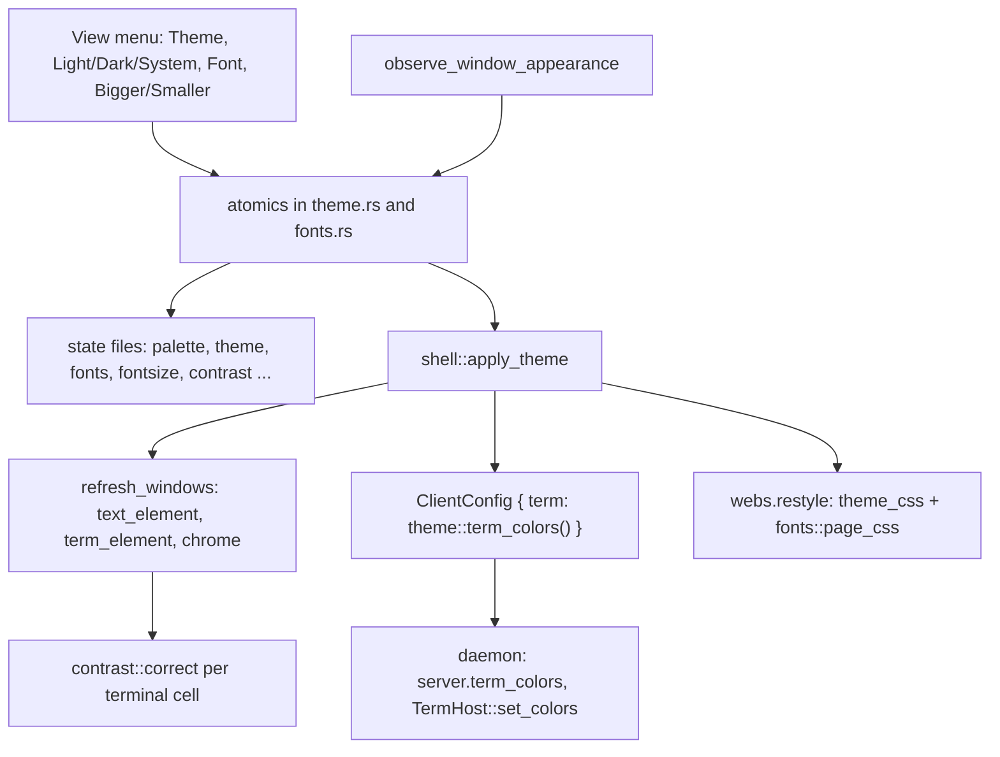
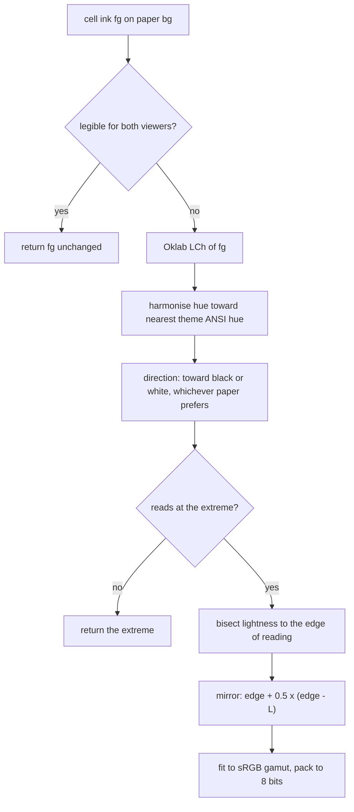

# Themes, Fonts and Colour

apex's UI client draws acme's tiling as a modern Mac app would. This page covers that look: the colour palettes, the font sets, and the colour checks that keep things readable for a reader with red-green colour blindness. This is all **client-side presentation**. None of it is in the replicated log. The choices are plain files beside the client's other state, and they change nothing about the rectangles that [Tiling and Layout](tiling-and-layout.md) computes. The client also feeds the choices to three other places: the daemon, so programs in terminals can ask what colours they are drawn in; pages, as CSS variables and `@font-face` rules; and the terminal painter, which corrects contrast cell by cell.

The rationale is in `MODERN.md`, the design notes for the `modern-mac` branch. It describes what changed from acme's look and why: palettes built from a few key colours, orange for red and blue for green wherever the difference matters, and B2's and B3's sweeps kept distinct under a deuteranopia simulation. The code is in four client modules: `theme.rs`, `fonts.rs`, `contrast.rs` and `titlefit.rs`. Small helpers live in `text_element.rs`. For how the client paints with these values, see [The UI Client](client.md) and [Sessions, Tabs and Window Chrome](client-chrome.md). For terminals end to end, see [Terminals](terminals.md).

## Where the choices live and how they spread

Every choice is a process-wide atomic: `PALETTE`, `MODE`, `SYSTEM_DARK` in `theme.rs`, and `SET`, `STEP` in `fonts.rs`. Each is persisted as a one-word file next to `~/Library/Application Support/apex/last-sessions` (`shell::state_file`). At launch, `main.rs` runs these in order: `text_element::install_symbols()`, `fonts::load()`, `fonts::install(cx)`, then `theme::load()`. After that, `theme::theme()` and `fonts::text()`/`mono()`/`ui()` are pure reads of those atomics, and every painter calls them at draw time.

A change from the View menu goes through `shell::set_palette`, `set_theme`, `set_fonts` or `resize_fonts`. Each stores the new choice and calls `shell::apply_theme`. That function remakes the menus so the check mark moves, then defers a pass over every window. The pass calls `send_config()` so the daemon learns the new terminal colours, restyles pages rendered from buffers, has `Pool::send_config` tell parked sessions, and refreshes all windows. A font change also re-lays out every window, because the tiling counts in line heights. The system appearance is watched with `observe_window_appearance`. Under `Mode::System` it sets `SYSTEM_DARK` and re-applies the theme.



| State file | Holds | Default | Module |
|---|---|---|---|
| `palette` | `alabaster`, `xcode`, `classic`, `github`, `nova`, `rsms` (an old `system` is read as `xcode`) | GitHub (`PALETTE` starts at 3) | `theme.rs` |
| `theme` | `light`, `dark`, `system` | light | `theme.rs` |
| `fonts` | a set's word (`system`, `go`, `hco`, …) | System | `fonts.rs` |
| `fontsize` | the ⌘+/⌘− step, clamped to −5..14 | 0 | `fonts.rs` |
| `contrast` | `on`/`off`: View ▸ Correct Terminal Contrast | on | `theme.rs` |
| `blink`, `smoothcaret`, `layoutanim`, `sidebar` | other View toggles kept beside these | on, off, on, shown | `theme.rs` |

Sources: [crates/apex-client/src/main.rs:720-724](crates/apex-client/src/main.rs#L720-L724), [crates/apex-client/src/main.rs:1022-1034](crates/apex-client/src/main.rs#L1022-L1034), [crates/apex-client/src/shell.rs:27-116](crates/apex-client/src/shell.rs#L27-L116), [crates/apex-client/src/shell.rs:349-352](crates/apex-client/src/shell.rs#L349-L352), [crates/apex-client/src/theme.rs:392-445](crates/apex-client/src/theme.rs#L392-L445), [crates/apex-client/src/theme.rs:500-623](crates/apex-client/src/theme.rs#L500-L623), [crates/apex-client/src/fonts.rs:86-130](crates/apex-client/src/fonts.rs#L86-L130)

## Palettes

### The `Theme` struct

A `Theme` is a flat struct of packed `0xRRGGBB` values. The layout is the same for every palette:

- **acme's texts:** paper and selection for bodies (`body_bg`, `body_sel`, `body_border`) and for tags (`tag_bg`, `tag_sel`, `tag_border`).
- **ink:** `text` is the primary ink and `text_dim` the secondary.
- **accent:** `accent` marks what is live, chosen or focused.
- **borders and columns:** `border` replaces acme's black borders, and `column` is the colour of a column where no window is.
- **handle colours:** `dirty`, `stale`, `fenced` and `progress`.
- **sweep colours:** `exec_hl` for B2 and `look_hl` for B3.
- **chrome:** `strip` for the title bar and sidebar, and the overlays' `panel_*` and `field_sel`.
- **terminal and diff colours:** the terminal's sixteen ANSI colours (`ansi`), and apex diff's line tints (`diff_add`, `diff_del`).

### Building a palette with `make`

There are six palettes (`Palette`), each with a light and a dark variant, so twelve `Theme` constants. `theme()` picks one from `(palette(), is_dark())`. GitHub's pair, `LIGHT` (GitHub Light Colorblind lifted off white) and `DARK` (GitHub Dark Dimmed), are written out field by field. The other ten are built by the `const fn make(Keys)`, so a palette is "a handful of key colours from which the rest follows":

```rust
const fn make(k: Keys) -> Theme {
    Theme {
        body_bg: k.paper, body_sel: k.sel, body_border: k.thumb,
        tag_bg: k.header, tag_sel: k.header_sel, tag_border: k.line,
        text: k.ink, text_dim: k.dim, accent: k.accent, border: k.line,
        progress: k.accent, exec_hl: k.exec, look_hl: k.look, strip: k.sidebar,
        panel_bg: k.popover, panel_border: k.line, panel_text: k.ink, panel_dim: k.faint,
        panel_chosen_bg: k.chosen, panel_chosen_text: 0xFFFFFF, field_sel: k.sel, /* … */
    }
}
```

Most derived colours are not stored at all. They are computed from the theme with `text_element::mix`, a per-channel linear blend of packed RGB:

| Derived value | How it is computed | Used for |
|---|---|---|
| `ground(t)` | dark: paper mixed 28% toward black; light: header mixed 7% toward ink | what shows between the window cards, under column tags and the top row |
| `theme::step(base, n)` | `base` moved 4.5% × n toward white (dark) or black (light) | hover and press states in the sidebar, title bar, pickers, web bar ("ghostty's way with its tabs") |
| `Theme::sweep(exec)` | light: wash = paper mixed 12% toward the button colour, ink = the colour deepened 20% toward black; dark: wash 36%, ink lightened 62% toward white | B2/B3 sweeps, ⌘/⌥ pills, the B4 menu's chosen row, page links |
| `Theme::look_mark()` | paper mixed 7% (light) or 17% (dark) toward `look_hl` | the faint wash on every match during a live Look |

### The six palettes

Each palette constant's doc comment records where its colours came from:

| Palette | Light | Dark | Notes from the source |
|---|---|---|---|
| Alabaster | tonsky's #f7f7f7 paper, black ink, #007acc accent | #0e1415 paper, amber #cd974b accent | red for B2, blue for B3 |
| Xcode | Default Light, system blue #007aff | Default Dark #1f1f24, #0a84ff | |
| Classic | acme's cream paper, pale blue tags, yellow selection, in go.dev playground hues | go.dev's #202224, link blue #50b7e0 | B2 burnt orange, B3 deeper blue: Go's fuchsia and teal were 46 apart under a deuteranopia simulation, these 114 |
| GitHub | Light Colorblind, canvas.subtle paper | Dark Dimmed | orange for red, blue for green, including the terminal's ANSI colours |
| Nova | Panic's Bright, sampled from Panic's preview | Panic's Dark, #1b1c1d editor | |
| rsms | rsms's bright Sublime scheme over Adaptive UI | dark mono, pink caret #f76ec9 | B2's grey or pink was 34 and 23 apart from B3's blue under deuteranopia; the chosen brown-orange is 84 |

Two smaller details:

- **Terminal colours:** every palette except GitHub's uses `ANSI_LIGHT`/`ANSI_DARK` for its terminal. Those are GitHub's colour-blind sixteen ("since the reader is colour-blind whatever the paper"), and their values are identical to `LIGHT.ansi` and `DARK.ansi`.
- **A stale comment:** the module doc at the top of `theme.rs` still says "four palettes" even though it lists six.

Sources: [crates/apex-client/src/theme.rs:1-72](crates/apex-client/src/theme.rs#L1-L72), [crates/apex-client/src/theme.rs:84-160](crates/apex-client/src/theme.rs#L84-L160), [crates/apex-client/src/theme.rs:166-353](crates/apex-client/src/theme.rs#L166-L353), [crates/apex-client/src/theme.rs:357-396](crates/apex-client/src/theme.rs#L357-L396), [crates/apex-client/src/theme.rs:430-487](crates/apex-client/src/theme.rs#L430-L487), [crates/apex-client/src/text_element.rs:57-64](crates/apex-client/src/text_element.rs#L57-L64), [crates/apex-client/src/text_element.rs:173-179](crates/apex-client/src/text_element.rs#L173-L179), [MODERN.md:14-28](MODERN.md#L14-L28)

## Colour for a colour-blind reader

The look is designed for deuteranopia (red-green colour blindness). This shows up in three places.

**The palettes avoid red-against-green distinctions.** `MODERN.md` states the rule: every palette "keeps orange-for-red and blue-for-green where it matters (the terminal's ANSI, apex diff's lines) and B2's and B3's sweeps apart under a deuteranopia simulation." The doc comments on `CLASSIC_LIGHT` and `RSMS_DARK_MONO` record the CIELAB distances that were measured under simulation when choosing the sweep colours. `Theme::progress` was likewise "chosen under a deuteranopia simulation to stand apart from every handle colour it can sit beside." A stale handle is gold in every palette. A lost link's chip is also gold, and a watching one blue (see [Sessions, Tabs and Window Chrome](client-chrome.md)).

**Pages get the same rule.** In `web.rs`, `theme_css` uses orange rather than red for a diff's removed lines. Its comment gives the simulated distances (14 and 16 apart in CIELAB from the added lines). Links in a page are drawn as B3's sweep is drawn.

**Terminal ink is checked for both viewers.** Contrast is checked for a normal viewer and for a deuteranope. `contrast.rs` carries the Machado, Oliveira and Fernandes (2009) full-severity deuteranopia matrix, applied in linear RGB. A colour pair only counts as readable if it passes for both (next section).

Sources: [MODERN.md:24-28](MODERN.md#L24-L28), [crates/apex-client/src/theme.rs:43-49](crates/apex-client/src/theme.rs#L43-L49), [crates/apex-client/src/theme.rs:273-284](crates/apex-client/src/theme.rs#L273-L284), [crates/apex-client/src/theme.rs:337-353](crates/apex-client/src/theme.rs#L337-L353), [crates/apex-client/src/web.rs:70-100](crates/apex-client/src/web.rs#L70-L100), [crates/apex-client/src/contrast.rs:77-93](crates/apex-client/src/contrast.rs#L77-L93)

## Terminal contrast correction (Oklab)

### Why it is needed

Programs in a terminal pick their colours for a dark background and name them outright, as a 256-colour index or a truecolor triple. On light paper an `ls` comes out pale yellow. A few programs pick for light paper and do the reverse on dark.

`term_element.rs` resolves each cell's colours with `color_rgb`. A packed cell colour is one of:

- `0xfe…`: an index into `theme.ansi`
- `0xfd…`: the theme's ink or paper
- anything else: a literal RGB value

Unless both foreground and background are the theme's defaults (0), the cell's ink goes through `contrast::correct(fg, bg_or_paper, theme)` while View ▸ Correct Terminal Contrast is on. Only the ink is ever moved, never the background.

### The algorithm

`compute` works as follows:

1. **Already readable:** if `legible(fg, bg)` holds, the ink is returned unchanged. `legible` means a WCAG contrast of at least 4.5 (`TARGET`), taking the worse of the normal viewer's and the deuteranope's (`contrast_for_all`).
2. **Convert:** convert the ink to Oklab LCh (`oklch`), after Ottosson (2020). Oklab is used because there a step in lightness looks the same size on any hue.
3. **Harmonise the hue:** if the ink has chroma (≥ `GREY`, 0.04), find the nearest hue among the theme's twelve chromatic ANSI colours (indices 0, 7, 8 and 15 are greys and are skipped). If that hue is within `HARMONY_REACH` (0.7 rad), turn the ink's hue `HARMONY_PULL` (half) of the way toward it. Corrected colours then sit with the theme's own, but two of a program's colours do not collapse into one.
4. **Pick a direction:** go toward black or white, whichever the paper reads better against. That is down on light paper and up on dark, "whatever the theme": ink on a program's own dark block goes light even in a light theme.
5. **Find the edge:** bisect lightness for 20 iterations to find the edge of readability. Each candidate is judged after packing to 8 bits, so rounding cannot push it just below the target. `fit` keeps the hue and chroma, reducing the chroma by bisection when sRGB cannot hold it.
6. **Mirror past the edge:** move the ink past the edge by `MIRROR` (0.5) times how far it started beyond it. An ink that was slightly unreadable lands slightly inside; one far off lands deep. The shades a program uses to tell things apart stay apart, and a dark terminal's "bright" colour becomes a light terminal's deeper one.
7. **Hue unreachable:** if even full black or white of that hue does not read, return that extreme.



### Caching

Results are cached in a thread-local `HashMap`, so each cell costs one lookup. The cache is cleared wholesale when it reaches `CACHE_CAP` (8192). The key is `(fg, bg, dark)`, where `dark` comes from comparing the theme's address with GitHub's `DARK` constant. The other dark palettes therefore key as not dark, and the cache is not cleared when the theme changes. In practice this only matters when two themes with different ANSI colours see the same ink on the same paper.

### Tests

The tests pin down the behaviour. Ink that already reads is untouched. A dark terminal's yellow deepens on light paper and stays a yellow. Navy lifts on dark paper. A red that passes for a normal viewer but not a deuteranope is still corrected. xterm's red and yellow stay apart in lightness. The theme pulls a near hue partway toward its own, but not onto it. Greys gain no hue. An exhaustive sweep over a 6×6×6 RGB grid, on eight papers and both GitHub themes, checks that every answer reads or is an extreme.

### Telling the daemon

`theme::term_colors()` packages the theme's ink, paper and sixteen colours as a `TermColors`. The client sends this in `ClientMsg::ClientConfig` on attach and on every theme change. The daemon accepts it only from UI attachments. It stores the colours as `server.term_colors` and passes them to `TermHost::set_colors`, which answers programs' OSC 4, 10 and 11 queries. A session with no UI attached answers with `TermColors::LIGHT`: acme's paper with xterm's sixteen. See [The Attach Protocol](attach-protocol.md).

Sources: [crates/apex-client/src/contrast.rs:1-235](crates/apex-client/src/contrast.rs#L1-L235), [crates/apex-client/src/contrast.rs:237-397](crates/apex-client/src/contrast.rs#L237-L397), [crates/apex-client/src/term_element.rs:34-40](crates/apex-client/src/term_element.rs#L34-L40), [crates/apex-client/src/term_element.rs:145-190](crates/apex-client/src/term_element.rs#L145-L190), [crates/apex-client/src/theme.rs:489-494](crates/apex-client/src/theme.rs#L489-L494), [crates/apex-client/src/theme.rs:518-589](crates/apex-client/src/theme.rs#L518-L589), [crates/apex-server/src/proto.rs:25-54](crates/apex-server/src/proto.rs#L25-L54), [crates/apex-server/src/proto.rs:85-90](crates/apex-server/src/proto.rs#L85-L90), [crates/apex-server/src/daemon.rs:810-815](crates/apex-server/src/daemon.rs#L810-L815), [crates/apex-server/src/term.rs:763-776](crates/apex-server/src/term.rs#L763-L776)

## Font sets

One View ▸ Font choice (`fonts::Set`) decides four faces:

- `text()`: text windows and tags
- `mono()`: mono windows and terminals
- `ui()`: the sidebar, sheets, menus, palettes and title bar
- the `--apex-font` / `--apex-mono` CSS variables for pages

`text()` and `mono()` return a `Spec`: family, size, line height, weight and extra OpenType features. Line heights are whole pixels, "acme's tiling counts in them". `text_element::font_for(mono)` turns a `Spec` into a gpui `Font` in three steps:

1. It applies `fonts::weight`.
2. It adds the bundled symbols font as a fallback (`with_symbols`).
3. It runs `unjoined`, which turns off `liga`, `clig` and `calt` so every character has its own glyph and a click can land between the letters of `ff`. It also turns on a slashed `zero`, then layers the set's own features over these.

| Set | Text (size/line) | Mono (12/16) | UI | Bundled? |
|---|---|---|---|---|
| System | `.SystemUIFont` 14/20, `ss06` + `tnum` | Terminal.app's SF Mono at Medium, else `.SF NS Mono`, else Menlo | `.AppleSystemUIFont` | no (SF Mono read from Terminal.app at launch) |
| Classic | Lucida Grande 13/17 | Menlo | Lucida Grande | no |
| Go | Go 14/20 | Go Mono | Go | yes |
| Mona | Mona Sans 15/21 | Monaspace Xenon with `calt`, `ss02`, `ss03`, `ss07`, `ss08` | Mona Sans | yes |
| Nova | SF 14/20, `ss06` + `tnum` | Menlo | `.AppleSystemUIFont` | no |
| H&Co | Ideal Sans SSm 14/20 | Operator Mono SSm | Ideal Sans SSm | no (installed) |
| Inter | Inter 14/20 | JetBrains Mono | Inter | yes |
| Geist | Geist 14/20 | Geist Mono | Geist | yes |
| Styrene | Styrene B LC 14/20 | JetBrains Mono | Styrene B LC | no (installed); JetBrains Mono bundled |
| Lucida | Lucida Grande 13/17 | installed Lucida Grande Mono (W1G cut first), else Menlo | Lucida Grande | no |

`MODERN.md` lists nine sets; the code has a tenth, Lucida.

### Sizes and weights

⌘+ and ⌘− call `fonts::resize(±1)`, which moves `STEP` and saves it. ⌘0 resets it to 0. `sized` scales a face by `k = (text_size + step) / text_size`, with a floor of 6 px on the new text size. The text grows one pixel per step, the mono face in proportion. Sizes are rounded to the half pixel and line heights to whole pixels.

`fonts::weight` is a workaround for H&Co's faces. Their weights are typographic, so asking for 400 gave the Bold. For that set it maps requested weights onto the 305–400 band where Core Text puts their cuts. Every other set passes weights through unchanged, so chrome code always asks through `fonts::weight(...)`.

### Loading the faces

`fonts::install` hands the bundled faces in `FACES` to gpui. It skips Radon's italics, which are only for pages. It then looks for Terminal.app's `SF-Mono-*` files, falling back to `/System/Library/Fonts/SFNSMono.ttf`, and records which one loaded. It also finds an installed Lucida Grande Mono by name.

Pages run in a separate web-view process, so they get the fonts differently. `page_css` emits an `@font-face` for each bundled face at `apexfile://localhost/.apex-font/FILE`. For H&Co it also adds `local()` faces by PostScript name. It sets the `--apex-font`, `--apex-mono` and `--apex-*-features` variables. The page's scheme handler in `web.rs` answers those URLs from the bytes compiled into the binary through `fonts::serve`. `serve` only returns a face listed in `FACES`. Pages also receive the theme's colours as `--apex-bg`, `--apex-fg`, `--apex-accent` and the rest (see [The I/O Plane and Pages](io-plane-and-pages.md)).

Sources: [crates/apex-client/src/fonts.rs:1-84](crates/apex-client/src/fonts.rs#L1-L84), [crates/apex-client/src/fonts.rs:112-271](crates/apex-client/src/fonts.rs#L112-L271), [crates/apex-client/src/fonts.rs:273-418](crates/apex-client/src/fonts.rs#L273-L418), [crates/apex-client/src/fonts.rs:424-436](crates/apex-client/src/fonts.rs#L424-L436), [crates/apex-client/src/text_element.rs:507-557](crates/apex-client/src/text_element.rs#L507-L557), [crates/apex-client/src/web.rs:1565-1567](crates/apex-client/src/web.rs#L1565-L1567), [MODERN.md:29-46](MODERN.md#L29-L46)

## Fitting the title bar (`titlefit.rs`)

The title bar must share its width with the top row's editable tag. `titlefit.rs` decides how much of two other things fits beside it: the session's directory and its running processes. Each has graded forms:

- **Directory (`PathFit`):** Full is the host and every crumb. Short is the host, `…/` and the last two crumbs. Last is the last crumb alone.
- **Processes (`ProcFit`):** Full is a pill per name, counted when there are several (`Win 5`). Stack is pills stacked as cards. Count is a bare number.

`LADDER` orders the combinations from richest to poorest. The directory gives way first, since process names say more than the folders above the session's own. `choose` returns the first step where directory, processes and the top row's needed width all fit in the room, or the last step if none do. The top row needs its full text while its caret is in it, and otherwise at most `TEXT_MIN` (200 px).

```rust
pub fn choose(room: f32, text: f32, path: impl Fn(PathFit) -> f32, procs: impl Fn(ProcFit) -> f32) -> (PathFit, ProcFit) {
    LADDER.iter().copied().find(|&(a, b)| path(a) + procs(b) + text <= room).unwrap_or(LADDER[LADDER.len() - 1])
}
```

`Acme::title_fit` measures every candidate width by shaping text in the `fonts::ui()` face. `title_room_mark` records the room the bar actually had in the last frame and calls `notify` when it changes by more than half a pixel, so the next frame refits.

Anything shortened fans out under the pointer as an anchored, deferred card over the bar, so the bar never reflows under the pointer. The full path comes up in `path_strip`; every process gets a pill with its own × in `procs_fan`. `Marks` records where each part was drawn so `title_fan_at` and `pill_at` can hit-test. The pill colours come from the theme: the wash is `mix(text_dim, ground, 0.9)`, and the Count badge has an accent dot. Tests cover the ladder order, grouping processes by name in first-run order, and crumb indices.

Sources: [crates/apex-client/src/titlefit.rs:1-99](crates/apex-client/src/titlefit.rs#L1-L99), [crates/apex-client/src/titlefit.rs:147-247](crates/apex-client/src/titlefit.rs#L147-L247), [crates/apex-client/src/titlefit.rs:249-449](crates/apex-client/src/titlefit.rs#L249-L449), [crates/apex-client/src/titlefit.rs:466-504](crates/apex-client/src/titlefit.rs#L466-L504), [MODERN.md:371-380](MODERN.md#L371-L380)

## The assets directory

`crates/apex-client/assets/` holds what the client compiles in with `include_bytes!`. `README.md` there records each file's version, licence and how to update it, with SHA-256 hashes where it gives them.

| Asset | Used by | Notes |
|---|---|---|
| `SymbolsNerdFontMono-Regular.ttf` | `text_element::install_symbols` | Nerd Fonts 3.5.1 symbols-only, MIT. Registered with CoreText for this process only (`CTFontManagerRegisterGraphicsFont`) and named as every font's fallback (`SYMBOLS`), so icons and powerline arrows draw without a patched font. It goes to CoreText rather than gpui because gpui will not load a family with no `m`. |
| `fonts/go`, `mona`, `monaspace` | `fonts::FACES` | Copied from Manifold's `Frameworks/`; BSD and OFL licences beside them |
| `fonts/inter`, `jetbrains`, `geist` | `fonts::FACES` | Bundled with their licence files, though the README does not list them yet |
| `pjw.svg` | `shell::pjw` | Peter Weinberger's face from plan9port's PostScript prologue, filled even-odd; marks another session wanting the user |
| `mermaid.min.js.gz` | `web.rs` | Mermaid 12.0.0, gzipped; given to pages that have mermaid blocks |
| `glass.svg`, `space-bunny.svg` | — | Present in the directory but not described in the README |

To add a bundled face, put the file under `assets/fonts/DIR/`, add a `face!` line to `FACES` with its family, weight and italic flag, and point a `Set`'s `text_as_set`/`mono_as_set`/`ui`/`page_css` at the family. The `every_face_a_page_asks_for_is_served_and_named` test checks that each listed face is served and is larger than 10 kB.

Sources: [crates/apex-client/assets/README.md:1-52](crates/apex-client/assets/README.md#L1-L52), [crates/apex-client/src/fonts.rs:283-330](crates/apex-client/src/fonts.rs#L283-L330), [crates/apex-client/src/text_element.rs:547-607](crates/apex-client/src/text_element.rs#L547-L607)
