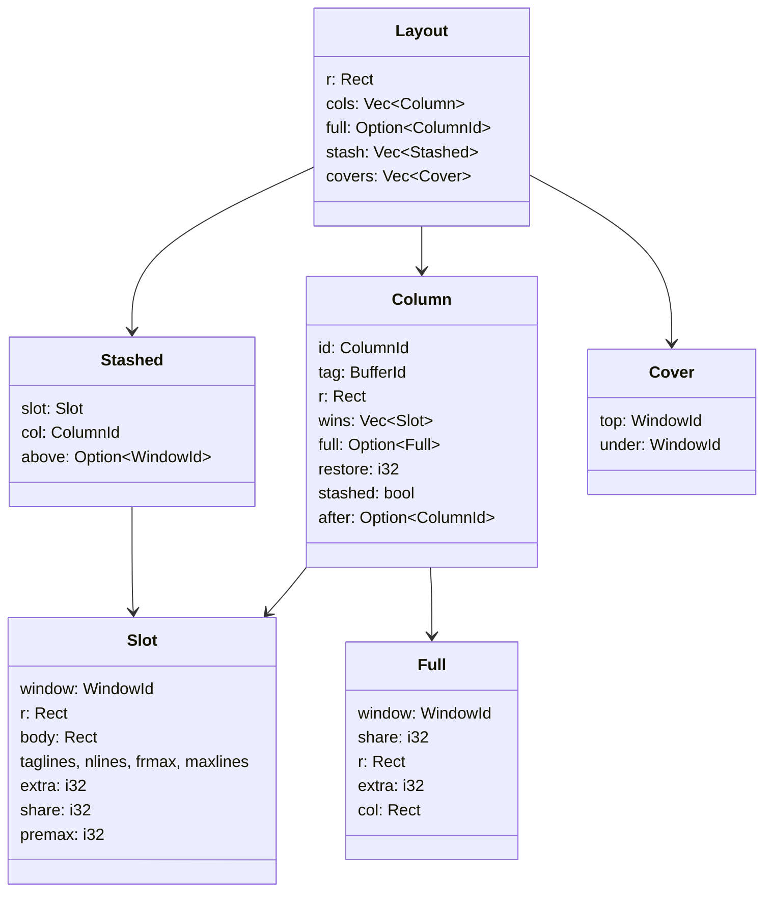
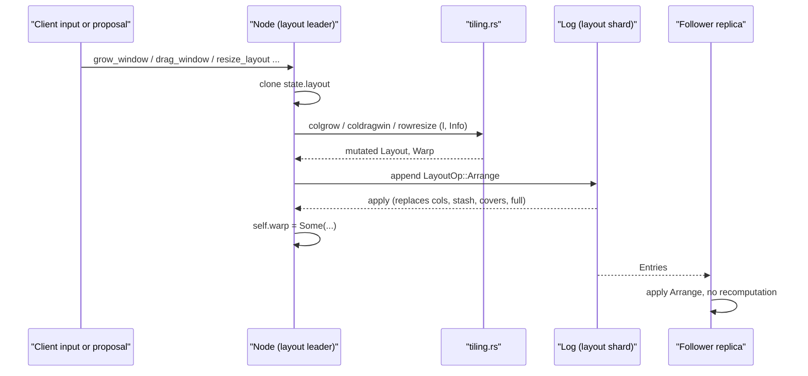
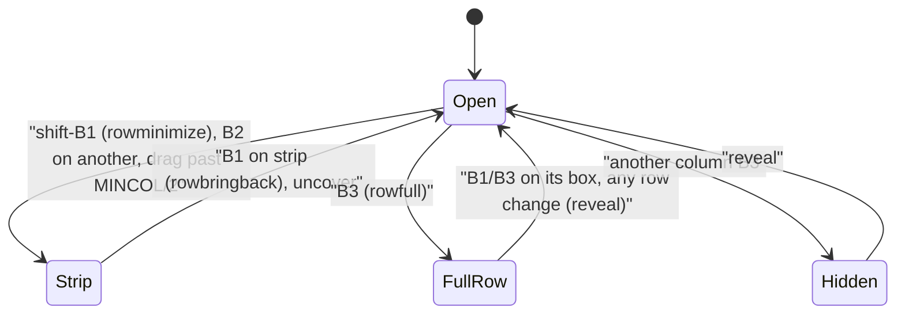

# Tiling and Layout

apex lays out its windows the way acme does. A row holds columns, and each column holds windows stacked top to bottom. Each window is a tag line (or several) above a body. A new window takes the lower half of the last window in its column, and clicking or dragging a window's layout box grows or moves it. `crates/apex-core/src/tiling.rs` is a port of the geometry in plan9port's `cols.c`, `rows.c` and the `winresize` half of `wind.c`, with the drawing taken out. Its functions and variables keep acme's names (`coladd`, `colgrow`, `rowdragcol`, `nl`, `onl`, `buggered`), so you can read the two side by side. apex also adds features acme lacks: columns that grow the way windows do, strips, minimizing, a session-wide stash, covered windows, and dropping a window near a column's edge to split off a new column.

The tiling is part of the replicated state. Whichever node leads the layout shard runs these algorithms on a copy of the `Layout` and appends the result as a single `LayoutOp::Arrange` entry. Replicas apply the rectangles they receive and never recompute them. This page covers the data model, the algorithms, the `Info` trait that supplies font metrics, and the open question of whether pixels should be replicated at all. Shards and leadership are explained in [Sessions, Shards and Leadership](sessions-and-replication.md), entry application in [Entries, State and Apply](core-state.md), and the node methods that call into the tiling in [The Node](node.md). How the client draws and animates the layout is covered on [The UI Client](client.md), [Mouse, Keyboard and Look](client-input.md) and [Sessions, Tabs and Window Chrome](client-chrome.md).

## The layout as data

The layout shard's state is `state::Layout`. Every coordinate in it is an integer pixel in the row's coordinate space, as in acme. The row has a rectangle `r`, and its first line is the top tag. Each column has a rectangle, and its first line is the column tag. A window's place in a column is a `Slot`, which records acme's per-window frame measurements along with apex's extra bookkeeping.



| Field | Meaning |
|---|---|
| `Slot::r`, `Slot::body` | The window's rectangle, with its bottom trimmed to whole body lines, and the body's rectangle below the tag and a 1-pixel line. |
| `Slot::taglines`, `nlines`, `frmax`, `maxlines` | The number of lines the tag wraps to; the lines of text the body shows; acme's `body.fr.maxlines` (whole lines that fit, zero while hidden behind a full window); and acme's `w->maxlines`, which `colgrow` treats as the window's natural size. |
| `Slot::extra` | The pixels the body gave up so that it ends on a whole line. A window's allocation is `r.dy() + extra`. |
| `Slot::share` | The window's share of its column's window space, in parts per million (`SHARE_UNIT`). Zero means "read it off the rectangles at the next resize". |
| `Slot::premax` | The share the window had before B2 maximized a window in its column. B1 restores it. |
| `Column::full` | The window grown to the whole column with B3, with its previous rectangle, share and the column's rectangle at that time. |
| `Column::restore` | The width the column had when it last became a strip, kept as a share of the row so it survives a window resize. |
| `Column::stashed`, `after` | A column put away at the row's right by an older apex. No current code sets `stashed`, but `rowbringback` and `back_at` still handle it. |
| `Layout::full` | The column given the whole row with B3. The other columns' rectangles go stale while it is set. |
| `Layout::stash` | Windows put away (⌘M, `Stash`), in the order they went. |
| `Layout::covers` | Window stacks: a window opened over another (for example, `apex editor` from a terminal). |

`Layout` has helpers that the tiling and the node rely on: `shows`, `full_index`, `column_of`, `stashed_of`, `stack_top`/`stack`, `place_of` and `slot` ([state.rs:254-327](crates/apex-core/src/state.rs#L254-L327)). Note that `rowwhichcol` ignores columns that are hidden behind a full column, because their stale rectangles may lie under the full one ([tiling.rs:1124-1128](crates/apex-core/src/tiling.rs#L1124-L1128)).

Sources: [crates/apex-core/src/state.rs:102-252](crates/apex-core/src/state.rs#L102-L252), [crates/apex-core/src/tiling.rs:1-63](crates/apex-core/src/tiling.rs#L1-L63)

## How a layout change is replicated

Layout operations never change `state.layout` in place. Each `Node` method follows the same pattern:

1. Clone the current layout.
2. Run a tiling function on the clone with `&*self.tiling` as the `Info`.
3. Append the whole result with `Node::arrange`, often only if it changed.
4. Set `self.warp` to where acme would move the mouse.

```rust
fn arrange(&mut self, log: &mut Log, l: &Layout) -> Result<()> {
    self.append(log, Shard::Layout, Op::Layout(LayoutOp::Arrange { r: l.r, cols: l.cols.clone(), full: l.full, stash: l.stash.clone(), covers: l.covers.clone() }))?;
    Ok(())
}
```

`State::apply_layout` checks that no window appears twice across the columns, the stash and the covered windows, and rejects the entry with `ApplyError::Exists` if one does. Otherwise it replaces `r`, `cols`, `stash` and `covers` wholesale and keeps `full` only if that column still exists. `LayoutOp::Init` sets the top tag buffer and the starting rectangle; `init_session` uses 1100×700 and then adds two columns, as acme's `-c 2` does.



`arrange_dropping` is used after drags. It also deletes the tag buffer shards of any columns that disappeared, such as a column left empty by dragging its last window out. The test `arrange_entries_replay_identically` checks that a follower replaying the log ends with the same `State::hash` and the same layout as the leader.

Sources: [crates/apex-core/src/node.rs:290-294](crates/apex-core/src/node.rs#L290-L294), [crates/apex-core/src/node.rs:425-461](crates/apex-core/src/node.rs#L425-L461), [crates/apex-core/src/entry.rs:256-278](crates/apex-core/src/entry.rs#L256-L278), [crates/apex-core/src/state.rs:676-703](crates/apex-core/src/state.rs#L676-L703), [crates/apex-core/tests/tiling.rs:534-552](crates/apex-core/tests/tiling.rs#L534-L552)

## The `Info` trait: what the tiling asks about text

acme reads tag line counts and body line counts off its frames. The tiling gets the same information through a trait:

```rust
pub trait Info {
    fn font_height(&self) -> i32;
    fn tag_row(&self) -> i32 { self.font_height() }
    fn taglines(&self, w: WindowId, width: i32, maxlines: i32) -> i32;
    fn body_font_height(&self, w: WindowId) -> i32;
    fn body_nlines(&self, w: WindowId, width: i32, maxlines: i32) -> i32;
}
```

`font_height` is the height of a one-line tag. It is also the height of a column tag and of the top row. `tag_row` is how much each additional tag line adds. The two differ in the client because a tag's padding is added once for the whole tag, not once per line: `tag_height(info, n) = font_height + (n-1) * tag_row`, and `tag_lines_fit` is its inverse rounded down. `taglines_rule` is the tail of acme's `wintaglines` with `tagexpand` on. It caps the count at `maxlines`, adds a line for a trailing newline, and never returns zero ([tiling.rs:115-153](crates/apex-core/src/tiling.rs#L115-L153)).

There are two implementations:

| Implementation | Where | Behaviour |
|---|---|---|
| `Headless` | [tiling.rs:86-113](crates/apex-core/src/tiling.rs#L86-L113) | The default in `Node::new`, used by a daemon leading with no screen. Tag and body fonts are both 17 pixels, every tag is one line, and every body is full (`body_nlines` returns `maxlines`). |
| `ClientInfo` | [app.rs:114-152](crates/apex-client/src/app.rs#L114-L152) | Built by the UI's `measure` each frame from the last frame's layouts. It records the tag line height, the row height, proportional and mono line heights, each tag's wrapped line count and trailing newline, and each body's line count from its origin. Terminal bodies are always full. |

`App::measure` installs a new `ClientInfo` into `node.tiling` on every frame. It then calls `resize_layout` if the OS window's size changed. The row's `y0` is set to `-(font + BORDER)`, so the top tag's line lies above the drawn area, where the title bar draws it instead. Finally, `measure` calls `refit_window` for each visible window whose tag now wraps to a different number of lines than its slot allows. This is acme's `winsettag` → `winresize`.

Sources: [crates/apex-core/src/tiling.rs:65-153](crates/apex-core/src/tiling.rs#L65-L153), [crates/apex-core/src/node.rs:252-260](crates/apex-core/src/node.rs#L252-L260), [crates/apex-client/src/app.rs:2565-2620](crates/apex-client/src/app.rs#L2565-L2620), [crates/apex-core/src/node.rs:759-785](crates/apex-core/src/node.rs#L759-L785)

## Window geometry: `winresize`, whole lines and shares

`winresize(l, ci, wi, r, keepextra, info)` places one window in rectangle `r`, and every other function builds on it. It works out how many tag lines fit in `r`, then asks `Info::taglines`. In a strip it asks nothing: the tag is just its box, one line, because no text is drawn there to measure. If there is room for at least one body line, the body starts one pixel below the tag; otherwise the body is empty. Unless `keepextra` is set, the body is trimmed to a whole number of body-font lines, and the remainder is recorded in `Slot::extra`. The function then sets `frmax`, `nlines` and `maxlines`, and returns the window's new bottom edge. Callers pass `keepextra = true` for the last window in a column, so that window reaches the column's foot.

The public `winresize` also clears `Slot::share`. Every caller except `colresize` is acting for the user, so shares are read again from the rectangles at the next resize. `colresize` calls the internal `winresize_in` instead and leaves the shares alone. This fixes a drift problem in acme's own `colresize`. acme scales each window's last height and trims it to whole lines, so the remainders were passed down the column on every resize, and dragging a window back and forth slowly gave the bottom window the whole column. apex sizes each window by its share of `space = column height − column tag − n × BORDER`, gives the last window whatever is left, and computes shares from `r.dy() + extra` in `sync_shares`. The test `resizing_back_and_forth_keeps_the_windows_proportions` resizes 200 times and checks that every window stays within one line of its starting height.

Sources: [crates/apex-core/src/tiling.rs:173-265](crates/apex-core/src/tiling.rs#L173-L265), [crates/apex-core/src/tiling.rs:397-439](crates/apex-core/src/tiling.rs#L397-L439), [DESIGN.md:1904-1915](DESIGN.md#L1904-L1915), [crates/apex-core/tests/tiling.rs:597-615](crates/apex-core/tests/tiling.rs#L597-L615)

## Column operations (acme's `cols.c`)

| Function | acme | What it does |
|---|---|---|
| `coladd` | `coladd` | Adds a window at height `y`. With no `y`, it takes the lower half of the last window's body. It finds the window `v` it lands on and grows `v` with `colgrow(…,1)` up to 10 times if `v` is too small. It then splits `v` at `y`, clamped so `y` falls below `v`'s first tag line and leaves room for a minimal window. If it gives up ("buggered"), it re-runs `colresize` on the whole column. Accepts `Adding::New` (a fresh `Slot`, acme's `wininit`) or `Adding::Existing` (a moved slot). |
| `colclose` | `colclose` | Removes a window. The next window extends up into its space, or if it was the last, the previous window extends down. Returns the removed slot and, when the next window moved up, that window's id, so acme can warp the mouse onto its `Del`. |
| `colresize` | `colresize` | Gives the column a new rectangle and sizes its windows by their shares. A window grown to the whole column stays that way. |
| `colgrow` | `colgrow` | Button 1 grows by a few lines, taken from neighbours (later windows first, then earlier ones, each giving up to half). Button 2 makes the window as big as possible. Button 3 calls `colfull`. Button −1 just refits the window in its own space. Follows acme's `nl`/`onl`/`dnl` arithmetic and packs the windows above and below. |
| `colsort` | `colsort` | Sorts windows by name and keeps their heights. |
| `coldragwin` | `coldragwin` | Handles a press and release on a window's box. Under 5 pixels of movement counts as a click, which grows the window. A flick to the right, under 10 pixels vertically and more than 30 across, tosses the window into the next column. A drop in another column moves it there. A drop above the previous window or below its own bottom shuffles it within the column. Otherwise it calls `colmovewin`. |
| `colmovewin` | `coldragwin`'s resize | Moves the line above window `wi` to `y`. Only the window above and this window change height. The window above keeps at least its first tag line, and the line is snapped to whole lines of the upper window's body. |
| `newwindow_y` | `makenewwindow` | Decides where `New` and plumbed files go. If the largest empty area at the bottom of a body is more than 15 lines, or more than 3 lines and more than half the biggest window, the new window goes there. Otherwise it splits the originating window if that window is no less than two-thirds the size of the biggest one, and splits the biggest window if not. |

A click on a window's box dispatches the same way in `coldragwin` and in `Node::grow_window`:

- **B2** calls `colmaximize`. It records every window's share in `premax` and then runs `colgrow(…,2)`, which reduces the other windows to their tags.
- **B3** calls `colfull`. The window takes the whole column below its tag, keeping its place in the order. The other windows get `frmax = 0` and their rectangles go stale. `Full` records enough to put everything back exactly.
- **B1** undoes the previous action when there is one: `unfull` if a window is full, `colunmaximize` if this is the maximized window (it restores the `premax` shares). Otherwise it calls `colgrow(…,1)`.
- **Shift-B1** reaches `colminimize` through `Node::minimize_window`. The window shrinks to its tag where it stands. The window below takes its body space, or, if it was the last window, its tag moves to the column's foot and the window above extends down to it.

Any operation that changes the column first calls `unfull`, so no algorithm ever works on stale rectangles. If the column was resized while one window was full, `unfull` rebuilds the shares with `whole_shares` and runs `colresize`. Otherwise every window returns to exactly the rectangle it had.

Sources: [crates/apex-core/src/tiling.rs:267-734](crates/apex-core/src/tiling.rs#L267-L734), [crates/apex-core/src/tiling.rs:877-903](crates/apex-core/src/tiling.rs#L877-L903), [crates/apex-core/src/tiling.rs:987-1120](crates/apex-core/src/tiling.rs#L987-L1120), [crates/apex-core/src/node.rs:868-949](crates/apex-core/src/node.rs#L868-L949), [crates/apex-core/tests/tiling.rs:117-143](crates/apex-core/tests/tiling.rs#L117-L143)

## Row operations (acme's `rows.c`, and columns that grow)

| Function | What it does |
|---|---|
| `rowadd` | acme's `rowadd`. Adds a column at `x`, or by default at 60% of the last column, which takes 40% of its width. If the last column is narrower than 100 pixels (a strip always is), the widest column gives the width instead. Returns `None` when the column to split is under 100 pixels wide. |
| `rowresize` | acme's `rowresize`. Columns keep their proportions. If some columns are strips, the strips keep `STRIP` width and the columns with room share the rest in their previous proportions. If a column is full, it simply takes the new row. |
| `rowclose` | acme's `rowclose`. Removes a column and gives its width to the next column, or to the previous one if it was last. |
| `rowdragcol` | acme's `rowdragcol`. A click calls `rowgrow`. A drag past a neighbour shuffles the column with `rowclose` and `rowadd`. Otherwise it calls `rowmovecol`. |
| `rowmovecol` | Moves the line between column `ci` and its left neighbour. Each side keeps at least `MINCOL` (80 + `SCROLLWID`) pixels. A drag past half of that minimizes the side to a strip and remembers its width. |
| `rowgrow` | `colgrow` turned on its side; acme has no equivalent. Button 1 widens the column by a fifth of its width or a twelfth of the row, whichever is more, with each neighbour giving at most a third of what it has beyond a strip. On a strip, button 1 brings the column back instead. Button 2 calls `rowmaximize`, button 3 calls `rowfull`, and button 4 does nothing. |
| `rowmaximize` / `rowunmaximize` | Make every other column a strip while remembering widths, and restore them (`rowrestore_all`). |
| `rowminimize` | Shift-B1 on a column's box. The column becomes a strip where it stands, and its width goes to the nearest column with room, looking right first. The last column with room cannot be minimized. |
| `rowfull` / `reveal` | B3 gives one column the whole row by setting `Layout::full`. `reveal` lays the row out again with each column where it stood. Every other row operation calls it first. |
| `rowbringback`, `restore_one` | Return a strip to its remembered width (`natural`, or a fifth of the row if none), taking width from the nearest columns with room. Columns that are holding a strip's width give theirs back first. |
| `uncover` | Makes column `ci` visible because the user is being taken to a window in it: reveals a hidden row and brings back a strip. |

A **strip** is a column `STRIP = SCROLLWID + BORDER = 14` pixels wide (`is_strip`): a squeezed window's tag turned on its side. The client draws no text, body, terminal or page inside one. A click on the box of a window in a strip only brings the column back; the next click grows the window. `nearest_open` exists so that `Node::place` never puts a new window into a strip: the window goes to the nearest column with room instead.

`rowpack` is the shared final step for most row operations. It lays columns out left to right at given widths and gives any leftover to the last column with room. `settle` clears `restore` on the columns with room after a manual change, so they no longer hold width for a strip.

The current code differs from DESIGN.md's account in one place. DESIGN.md describes B4 on a column's box collapsing it into its side, but `rowgrow` returns without doing anything for button 4, and the test `button_4_on_a_columns_box_does_nothing` checks that. Minimizing is now shift-B1 (`rowminimize`).



Sources: [crates/apex-core/src/tiling.rs:1122-1797](crates/apex-core/src/tiling.rs#L1122-L1797), [crates/apex-core/src/tiling.rs:20-40](crates/apex-core/src/tiling.rs#L20-L40), [crates/apex-core/src/node.rs:726-757](crates/apex-core/src/node.rs#L726-L757), [DESIGN.md:1833-1898](DESIGN.md#L1833-L1898), [crates/apex-core/tests/tiling.rs:806-812](crates/apex-core/tests/tiling.rs#L806-L812)

## Splitting a column by dropping a window at its edge

`split_at` decides whether dragging a window's box should create a new column, as editor splits do in VS Code and Zed. It does so when the window is released within the outer eighth of a column (clamped to 16–48 pixels) at its left or right edge. Three restrictions apply:

- At its own column's left edge, the pointer has to be on the edge itself (within 2 pixels), so that a vertical drag drifting left does not split.
- At its own column's right edge, the pointer has to have moved more than 30 pixels to the right.
- A column narrower than 200 pixels, a strip, or the window's own column when it is the only window there, is never split.

`coldragsplit` halves the target column with `rowadd` and swaps the two halves for a left drop. It then moves the window into the new column and closes the column the window came from if the drag left it empty (`close_if_left_empty`). A column made empty with Newcol stays. `Node::drag_window` allocates the new column's id and tag buffer, and deletes the tag buffer again if the split fails.

`Node::dragged` runs the same code with placeholder ids (`u64::MAX`). This is how `drag_window_preview`, `drag_column_preview`, `column_edge_preview` and `window_edge_preview` show where a drop would land without appending anything to the log.

Sources: [crates/apex-core/src/tiling.rs:909-985](crates/apex-core/src/tiling.rs#L909-L985), [crates/apex-core/src/node.rs:951-1061](crates/apex-core/src/node.rs#L951-L1061)

## The stash and covered windows

The stash belongs to the session, not to a column. `stash` removes a window with `colclose` and pushes a `Stashed` record holding its slot (with a fresh share), its column, and `above`, the window just above it in the column's order. `stash_order` reconstructs a column's full order with stashed windows put back into it. `recall` returns a stashed window under the nearest laid-out window above it, following the `above` chain through other stashed windows. If the window's column is gone, it goes to the foot of the column `or`. The window gets back its old share, and the other windows give up space in proportion. A window with fewer than `FEW_LINES` (5) lines gets at least an even share; this applies to `+Errors` windows, which start out stashed. `left` passes a departing window's `above` on to the windows stashed beneath it. `restash` moves a record to the end of the stash so it shows first among the stash's cards, and `unstash` removes a record permanently when its window is closed.

Diagnostic windows are placed and stashed in a single `Arrange` (`Node::place`). `Node::reveal` and `grow_window` on a stashed window call `unstash_window`, so going to a stashed window always brings it back.

Covered windows are a separate mechanism. `restack(l, top, stack, info)` puts `stack[0]` into `top`'s slot in its column or in the stash, refits it with `colgrow(…,-1)`, hands on stash `above` links, and rewrites `covers` as consecutive pairs. `cover_window`, `swap_window`, `raise_window` and `delete_window` in the node all use it.

Sources: [crates/apex-core/src/tiling.rs:648-674](crates/apex-core/src/tiling.rs#L648-L674), [crates/apex-core/src/tiling.rs:736-875](crates/apex-core/src/tiling.rs#L736-L875), [crates/apex-core/src/node.rs:536-582](crates/apex-core/src/node.rs#L536-L582), [crates/apex-core/src/node.rs:892-924](crates/apex-core/src/node.rs#L892-L924), [crates/apex-core/src/node.rs:1286-1322](crates/apex-core/src/node.rs#L1286-L1322)

## Mouse warps and node-level policy

Many tiling functions return a `Warp`, which the node stores in `self.warp` for the client to act on:

| Warp | Meaning |
|---|---|
| `NewWindow(w)` | Into the new window's body, near its box. |
| `WinButton(w)` | The middle of the window's layout box. |
| `Closed { window, next }` | Onto the `Del` of the window that took the closed window's place. |
| `ColButton(c)` | The column's box. |
| `Sel(view)` | The start of a selection. |

A click that turns a column into a strip returns no warp, because warping onto the strip would bring the column straight back out.

The node adds placement policy on top of the tiling:

- **`make_window`** picks the column. It uses `activecol` first, then the column holding the last selected text, then the column of `from`. It also calls `unfull` on a column with a full window, so the new window lands among the others.
- **`notice`** handles a window that raises a notification while it is hidden. It turns the B3 that hides it into a B2, so the window shows as a tag or strip.
- **`reveal`** grows a window that shows no lines.

Sources: [crates/apex-core/src/tiling.rs:155-171](crates/apex-core/src/tiling.rs#L155-L171), [crates/apex-core/src/tiling.rs:1707-1748](crates/apex-core/src/tiling.rs#L1707-L1748), [crates/apex-core/src/node.rs:584-612](crates/apex-core/src/node.rs#L584-L612), [crates/apex-core/src/node.rs:787-866](crates/apex-core/src/node.rs#L787-L866)

## Pixels in the log: the choice and the critique

DESIGN.md chose to replicate pixel geometry on purpose, after acme's `Dump`. The layout shard stores every column and window rectangle, body rectangles, tag lines, lines shown and `maxlines`. Each operation is computed once by the leader and appended as a single `Arrange`, so replicas take the geometry and never recompute it. Borders are 2 logical pixels. The client paints any device pixels beyond acme's border width in the neighbour's colour.

ARCHITECTURE.md's review argues that this puts one client's rendering into the core:

- `Slot` holds frame measurements, and `tiling.rs` holds pixel constants and the `Info` trait.
- A second UI with different fonts or DPI would receive geometry measured by whichever node led last.
- `mono`, `tabstop` and `tagexpand` have to be replicated because they change line counts.
- The layout API is in mouse terms: `grow_window(but)` and `drag_window(but, op, p)` take button numbers and points, and the previews have 5-pixel click thresholds.

The review proposes intent-named operations (grow, maximize, fill column, move to column and y) and, as plan item 7, replicating only the logical layout: order, shares, and the full, stashed and cover flags. Each client would run the tiling with its own metrics. That would remove warps, mouse terms and font state from the core and keep several clients consistent. The review notes that this reverses a deliberate design decision and needs discussion first. The shares (`Slot::share`, `Column::restore`) already store proportions independently of pixels, and they would be the natural core of a logical layout.

Sources: [DESIGN.md:1806-1831](DESIGN.md#L1806-L1831), [DESIGN.md:1917-1924](DESIGN.md#L1917-L1924), [ARCHITECTURE.md:339-353](ARCHITECTURE.md#L339-L353), [ARCHITECTURE.md:375-382](ARCHITECTURE.md#L375-L382), [ARCHITECTURE.md:921-927](ARCHITECTURE.md#L921-L927)

## Tests

`crates/apex-core/tests/tiling.rs` checks the port against what plan9port's `cols.c` and `rows.c` produce by hand for the same inputs, using `Headless` with font height 17 and border 2. Its helpers include:

- `row()`: one 1000×700 column.
- `three()`: three columns, each with a window.
- `tiles()`: asserts that columns span the row with exactly one border between neighbours and that windows are as wide as their column.

The tests cover:

- `coladd` taking the lower half of the last window, landing after the window under `y`, and `colclose` naming the next window for the mouse warp.
- B1, B2 and B3 on window and column boxes, and their undo.
- Stash, recall order, recalls that happen out of order, the stash being per session, and handing on `above`.
- Row resize keeping both proportions and strips.
- Column-edge and window-edge drags, including that previews match drops.
- Edge splits, and the empty-column rule.
- Tag padding (`Padded`) and sparse bodies (`Sparse`) through custom `Info` implementations.
- Replay of `Arrange` entries.

Sources: [crates/apex-core/tests/tiling.rs:1-28](crates/apex-core/tests/tiling.rs#L1-L28), [crates/apex-core/tests/tiling.rs:648-662](crates/apex-core/tests/tiling.rs#L648-L662), [crates/apex-core/tests/tiling.rs:1125-1160](crates/apex-core/tests/tiling.rs#L1125-L1160), [crates/apex-core/tests/tiling.rs:1162-1199](crates/apex-core/tests/tiling.rs#L1162-L1199)
