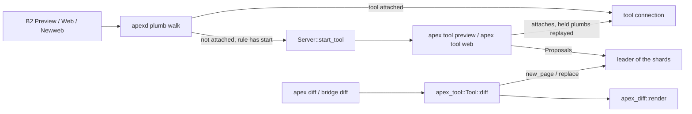
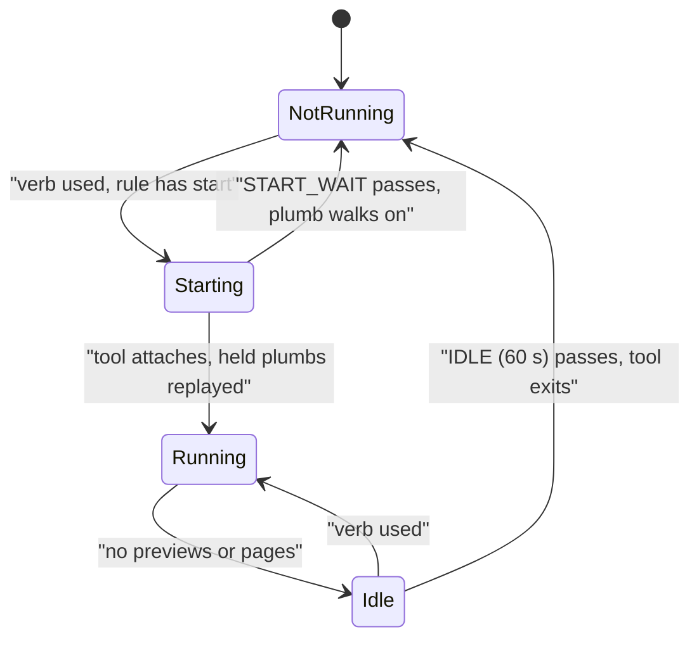
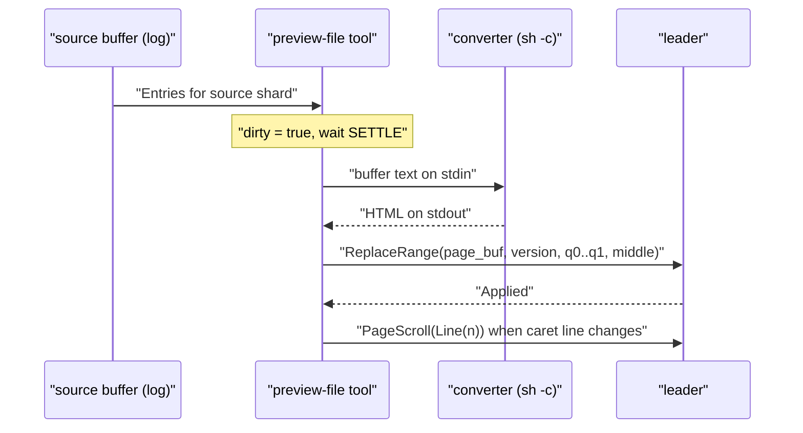
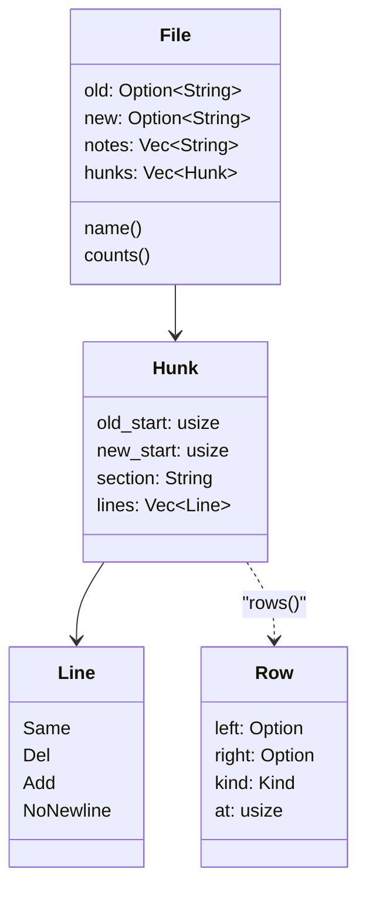

# Preview, Web and Diff Tools

Three bundled programs show HTML in apex's Page windows. None of them gets special treatment. Each attaches to a session as a tool, reads state from its own replica and changes it through [proposals](proposals.md), just as a third-party tool built on the [apex-tool SDK](tool-sdk.md) would:

- **`apex tool preview`** pipes a file's buffer through a converter and writes the HTML into a page beside the file. It re-renders as the buffer changes and scrolls the page to follow the file's caret. The converter for an extension is named by a `Preview.EXT` setting; Markdown uses `apex md` by default.
- **`apex tool web`** answers the `Web` and `Newweb` verbs by opening pages at URLs. It owns those pages and keeps each one's Back/Fwd history itself, because the log only records where a page currently is.
- **apex-diff** is a library. It lays out a unified diff side by side, and every line number links into the file. It is reached through `apex diff`, the SDK's `Tool::diff` and the JSON bridge's `diff` command.

Preview and Web are not resident by default. The session's default rules name them with a `start` command, so the daemon launches each one the first time its verb is used. Each exits again after a minute with nothing to do. How Page windows, `apexfile://` and the I/O plane work is covered on [The I/O Plane and Pages](io-plane-and-pages.md).



## Starting on first use and stopping when idle

`Server::install_default_rules` sets up three tool rules at priority −10. All three have `start: Some("apex tool NAME")`:

| Verb | `file` predicate | `kind` | unlisted | Tool |
|---|---|---|---|---|
| `Preview` | `PREVIEWED` = `(?i)\.(md\|markdown\|html?\|svg)$` | `File` | no | `preview` |
| `Web` | — | — | yes | `web` |
| `Newweb` | — | — | yes | `web` |

([crates/apex-server/src/lib.rs:1298-1322](crates/apex-server/src/lib.rs#L1298-L1322), [lib.rs:101-104](crates/apex-server/src/lib.rs#L101-L104)). "Unlisted" means `Web` and `Newweb` work anywhere they are B2'd, but they do not clutter every window's B4 tools menu.

When the plumb walk reaches a `RuleAction::Tool` rule, the daemon looks for a connection whose attachment has that tool's name. If there is none and the rule has a `start`, it calls `hold`. The plumb is queued under `(session, tool)`, and on the first queued item the daemon runs `Server::start_tool` and arms a timer of `START_WAIT` (10 s). `start_tool` replaces a leading `apex ` with the daemon's own `apex` executable. It then runs the command as a session process named after the tool, in the session's directory, with errors going to the `+Errors` window ([daemon.rs:1467-1486](crates/apex-server/src/daemon.rs#L1467-L1486), [daemon.rs:1393-1408](crates/apex-server/src/daemon.rs#L1393-L1408), [lib.rs:1181-1191](crates/apex-server/src/lib.rs#L1181-L1191)).

When an attachment with that name sends its Hello, the daemon replays everything held for it, in order ([daemon.rs:626-634](crates/apex-server/src/daemon.rs#L626-L634)). If the timer fires first, `start_failed` lets each held plumb walk on to the next rule ("tool … did not start"). Held I/O streams get a 503 instead ([daemon.rs:1410-1425](crates/apex-server/src/daemon.rs#L1410-L1425)). Requests for `tool://` pages use the same mechanism through `io_relay` ([daemon.rs:1254-1267](crates/apex-server/src/daemon.rs#L1254-L1267)).

Both tools exit on their own using the same idle-timer pattern. The resident Preview counts the previews it has open in an `AtomicUsize`, and Web watches its `pages` map. When the count reaches zero, `idle_since` is set. Once it is older than `IDLE` (60 s), the loop returns. Any activity clears the timer. The rule is still in the session's table, so the next use starts the tool again.



Sources: [crates/apex-server/src/lib.rs:1298-1322](crates/apex-server/src/lib.rs#L1298-L1322), [crates/apex-server/src/lib.rs:1181-1191](crates/apex-server/src/lib.rs#L1181-L1191), [crates/apex-server/src/daemon.rs:169](crates/apex-server/src/daemon.rs#L169), [crates/apex-server/src/daemon.rs:1393-1425](crates/apex-server/src/daemon.rs#L1393-L1425), [crates/apex-tool-preview/src/lib.rs:336-348](crates/apex-tool-preview/src/lib.rs#L336-L348), [crates/apex-tool-web/src/lib.rs:116-146](crates/apex-tool-web/src/lib.rs#L116-L146)

## Preview

### Two entry points

`apex tool preview` has two modes, chosen in `tool_cmd` ([crates/apex-cli/src/main.rs:1066-1073](crates/apex-cli/src/main.rs#L1066-L1073)):

| Command | Function | What it does |
|---|---|---|
| `apex tool preview` | `run_resident` | The resident tool the default rule starts. It attaches as `preview`, answers `Preview` plumbs and runs one file preview per use, each on its own thread. |
| `apex tool preview FILE` | `run` | Previews one file. It attaches as `preview-file`, announces itself as `preview`, and lives as long as both windows do. |
| `apex preview FILE` | `preview_cmd` | Makes the path absolute and proposes `Exec` of `apex tool preview FILE` in the top row, so the preview runs on the host as a session command ([main.rs:1080-1089](crates/apex-cli/src/main.rs#L1080-L1089)). |

The resident tool gets a `Plumb` event and finds the path of the window it came from. It declines the plumb (`answer(&p, false)`, so the next rule is tried) when there is no path or `converters::converter` finds nothing for the extension. Otherwise it accepts the plumb and spawns a thread that calls `run(socket, session, file)`. The single-file run uses its own attachment name for a reason. The Preview rules route to the attachment named `preview`, and a plumb has to reach that one alone ([lib.rs:44-46](crates/apex-tool-preview/src/lib.rs#L44-L46), [lib.rs:304-345](crates/apex-tool-preview/src/lib.rs#L304-L345)).

### Converters and `Preview.EXT`

A converter is any shell command that reads the source on stdin and writes HTML on stdout. `converters::converter(meta, ext)` looks for the setting key `Preview.<ext lowercased>` in this order:

1. the session's settings (those owned by `SERVER`);
2. any attachment's settings, such as one an attach script set;
3. the built-in `DEFAULTS`.

A setting that is empty or all whitespace switches the extension off and returns `None` ([converters.rs:18-27](crates/apex-tool-preview/src/converters.rs#L18-L27)).

```rust
pub const DEFAULTS: &[(&str, &str)] = &[("md", "apex md"), ("markdown", "apex md"),
    ("html", "cat"), ("htm", "cat"), ("svg", "cat")];
```

`exts(meta)` returns the default extensions plus every extension named by a `Preview.*` key, minus those switched off. This is the set of extensions Preview should be offered on ([converters.rs:30-37](crates/apex-tool-preview/src/converters.rs#L30-L37)). See [Configuration](configuration.md) for `apex set`.

### Lasting rules for extra extensions

The default rule only matches `PREVIEWED`. Before each event, the resident tool calls `lasting_rules` to cover any other extension a setting adds. For each wanted extension that is not in `DEFAULTS`, it checks whether a Preview rule already exists. It recovers each existing rule's extension from its `file` pattern with `ext_of_pattern`, which only understands the exact form `pattern_of_ext` writes, `(?i)\.EXT$`.

If no rule exists, it installs one with `offer_lasting`: `Rule::verb("Preview").file(pattern).kind(File).priority(-10).start("apex tool preview")`. `offer_lasting` makes the rule the **session's** rather than the tool's ([crates/apex-tool/src/lib.rs:1081-1086](crates/apex-tool/src/lib.rs#L1081-L1086)). That gives two properties:

- The rule survives the tool's idle exit, so it can start the tool again.
- The rule also survives removal of the setting. In that case Preview simply declines the file. Removing the rule is left to `apex plumb rule rm`, because no tool removes a rule it does not own.

The `offered` set prevents asking twice before the log has caught up ([lib.rs:350-383](crates/apex-tool-preview/src/lib.rs#L350-L383), [converters.rs:39-75](crates/apex-tool-preview/src/converters.rs#L39-L75)).

### Setting up a preview

`run` works out the converter first. If there is none, it fails with a message that tells the user how to set one: `apex set Preview.EXT CMD`. `Tool::start` then does the following ([lib.rs:130-176](crates/apex-tool-preview/src/lib.rs#L130-L176)):

1. **Find the source window.** It looks for a window at the file's path whose kind is not `Page`. If none is open, it proposes `Goto` and waits up to `TIMEOUT` (10 s) for the window to appear in the replica.
2. **Defer to a live preview.** If a Page window already exists at that path and is `live` (another tool process is behind it), it proposes `Goto` to show that page and returns `Err("shown")`. Both the CLI and the resident thread treat that error as success.
3. **Open the page beside the source.** It uses the column after the source's column, or the source's own column if it is the last. The page comes from `Proposal::open_html(col, &file, "", None)`, a Page window whose document is an HTML buffer named after the file. A dead preview left from an earlier run is reused.
4. **Mark the page live.** It proposes `Live { window: page, by: Some(me) }`, then does the first render.

### The main loop: render on settle, follow the caret

`step` takes one server message and passes it through `before` before `Remote::handle` applies it. `before` notices `Entries` for the source buffer's shard and sets `dirty` and `last_edit` ([lib.rs:83-93](crates/apex-tool-preview/src/lib.rs#L83-L93), [lib.rs:218-227](crates/apex-tool-preview/src/lib.rs#L218-L227)).

The text comes from the replicated buffer, not the file, so unsaved edits show in the preview. Each pass of `main_loop` does the following ([lib.rs:178-202](crates/apex-tool-preview/src/lib.rs#L178-L202)):

- If either window is gone, it clears the page's `Live` mark (if the page is still there) and returns.
- If the source is dirty and has been quiet for `SETTLE` (250 ms), it renders.
- It calls `follow`, which reads the source body's selection, converts `q0` to a 1-based line and proposes `PageScroll { scroll: Some(Scroll::Line(line)) }` when the line has changed. The scroll is a proposal, so every client showing the page scrolls with it. The page finds the line through the `data-line` markers the converter writes ([lib.rs:204-216](crates/apex-tool-preview/src/lib.rs#L204-L216)).



### Rendering as a minimal edit

`convert` runs the converter through `apex_server::command_shell() -c CONVERTER`, in the file's directory. The text is written to stdin on a separate thread so that a large document cannot deadlock against stdout. A non-zero exit becomes an error carrying the converter's stderr ([lib.rs:274-298](crates/apex-tool-preview/src/lib.rs#L274-L298)).

`render` compares the new HTML with `rendered`, the last HTML it wrote. If the two are equal, it does nothing. Otherwise it computes the common prefix and suffix in chars and proposes a single `ReplaceRange` of the changed middle, against the page buffer's current `version`. If that proposal is refused, it assumes someone else edited the page and replaces the whole buffer instead. It makes up to five attempts before giving up ([lib.rs:240-271](crates/apex-tool-preview/src/lib.rs#L240-L271)).

Errors never stop the preview. `render_or_say` reports a failure through `Proposal::Errors` into the errors window for the file's directory, which is diagnostic and shows as a toast. The page keeps its last good render, and the next edit triggers another try ([lib.rs:229-238](crates/apex-tool-preview/src/lib.rs#L229-L238)).

Setting the environment variable `APEX_PREVIEW_DEBUG` traces start-up to stderr.

Sources: [crates/apex-tool-preview/src/lib.rs:1-383](crates/apex-tool-preview/src/lib.rs#L1-L383), [crates/apex-tool-preview/src/converters.rs:1-75](crates/apex-tool-preview/src/converters.rs#L1-L75), [crates/apex-cli/src/main.rs:1055-1089](crates/apex-cli/src/main.rs#L1055-L1089), [crates/apex-server/src/proposal.rs:51-55](crates/apex-server/src/proposal.rs#L51-L55), [crates/apex-server/src/proposal.rs:104-106](crates/apex-server/src/proposal.rs#L104-L106)

## `apex md`: the Markdown converter

`apex md` reads Markdown on stdin and writes `markdown::markdown_page(text)` on stdout ([main.rs:1112-1118](crates/apex-cli/src/main.rs#L1112-L1118)). `markdown_page` uses pulldown-cmark with tables, footnotes, strikethrough, task lists and heading attributes enabled. It then rewrites the event stream in three ways ([markdown.rs:33-76](crates/apex-tool-preview/src/markdown.rs#L33-L76)):

- **Line markers.** Before the start of every paragraph, heading, block quote, code block, list item, table or HTML block, it inserts `<span class="apex-line" data-line="N"></span>`. `N` is the 1-based source line. The source offset is mapped to a line by binary search over a table of line starts. Preview's caret following depends on these markers.
- **Front matter.** `front_matter_len` measures a leading `---` (YAML) or `+++` (TOML) block, and parsing starts after it. The skipped length is added back when lines are numbered, so the markers still match the file. An unclosed block, or a fence line with text after it, is not front matter ([markdown.rs:8-30](crates/apex-tool-preview/src/markdown.rs#L8-L30)).
- **Mermaid.** A fenced block whose info string starts with `mermaid` becomes `<pre class="mermaid">…</pre>` with its text escaped, and the client draws it as a diagram. Other fences stay as `<pre><code class="language-…">`.

`heading_ids` gives each heading without an explicit `{#id}` a GitHub-style slug: lowercased, spaces turned into `-`, only alphanumerics, `-` and `_` kept. Repeated slugs get `-1`, `-2` and so on, so `#anchor` links work ([markdown.rs:78-119](crates/apex-tool-preview/src/markdown.rs#L78-L119)).

The page embeds `apex-markdown.css`, the editor's own look. Colours are `--apex-*` custom properties with acme's light palette as fallbacks (`--apex-bg: #FFFFEA`, and so on). The client overrides them with the theme ([Themes, Fonts and Colour](themes-and-fonts.md)). Fonts come from `--apex-font` and `--apex-mono`, falling back to Lucida Grande and Menlo. Links are drawn as pale rounded chips, and those leading off the host (`http:`, `https:`) get a link glyph through a CSS mask ([apex-markdown.css:1-40](crates/apex-tool-preview/src/apex-markdown.css#L1-L40)).

Sources: [crates/apex-tool-preview/src/markdown.rs:1-158](crates/apex-tool-preview/src/markdown.rs#L1-L158), [crates/apex-tool-preview/src/apex-markdown.css:1-40](crates/apex-tool-preview/src/apex-markdown.css#L1-L40), [crates/apex-cli/src/main.rs:1112-1118](crates/apex-cli/src/main.rs#L1112-L1118)

## Web

### Rules and ownership

`apex_tool_web::run` attaches as `web` and calls `handle_pages`. That sets `answers_navigation` and `wants_window_events` on the link, so links followed in the pages it owns come to it as `Event::Navigate`, and page events come as `Event::Page` ([crates/apex-tool/src/lib.rs:561-568](crates/apex-tool/src/lib.rs#L561-L568)). It then offers these rules:

| Verb | Rule | Answered by |
|---|---|---|
| `Web`, `Newweb` | `Rule::verb(v).unlisted()`, but only if the session's rules don't already send `v` to `web` (the defaults do) | `verb`: open a page |
| `Back`, `Fwd` | `owner("^web$")`, `kind(Page)` | step the page's `History` and `navigate` |
| `Get` | `owner("^web$")`, `kind(Page)` | `reload` (a `Proposal::Reload` every client follows) |

([crates/apex-tool-web/src/lib.rs:94-113](crates/apex-tool-web/src/lib.rs#L94-L113), [lib.rs:165-207](crates/apex-tool-web/src/lib.rs#L165-L207))

Because the `Get` rule is restricted to pages owned by `web`, B2 on `Get` in a web page's tag reloads it. In a text window, `Get` keeps its built-in meaning.

On every pass of the loop, `adopt` claims each Page window whose body is `Body::Page(Source::Url)` and which has no owner. It uses `set_owner(w, true)` and starts that page's history at its current URL. In practice this picks up pages left behind by an earlier run of the tool, and pages opened another way, for example with `Proposal::open_url` ([lib.rs:148-163](crates/apex-tool-web/src/lib.rs#L148-L163)).

### Opening a page

For `Web`, the target is the argument text. If there is no argument, it is the selection in the window the verb ran in, read with `t.read(w)` and sliced at `p.at`. `Newweb` requires an argument and otherwise writes "Newweb needs a URL" to the errors window. An empty target from `Web` opens a blank page whose address the user can type.

`web_url(target, dir)` turns the target into an address ([lib.rs:64-80](crates/apex-tool-web/src/lib.rs#L64-L80)):

- a `file://` URL (with an optional `localhost`) becomes `apexfile://PATH`;
- anything `apex_core::is_url` accepts is used unchanged;
- an absolute path becomes `apexfile://PATH`;
- a relative path is resolved against the plumb's `dir`.

`Tool::new_web_page` proposes `open_url` in the column of the originating window (else the last column), takes ownership of the page and remembers it ([crates/apex-tool/src/lib.rs:684-695](crates/apex-tool/src/lib.rs#L684-L695)).

### History

The log holds only a page's current location, so history is the tool's own state, a `BTreeMap<WindowId, History>`:

```rust
pub struct History {
    pub places: Vec<String>,
    pub at: usize,
    stepping: Option<String>,
}
```

- `Event::Page { event: PageEvent::Navigated { url } }` calls `arrived(url)`. If the URL is the target of the tool's own Back/Fwd (`stepping`), arriving there completes the step and adds nothing. A re-arrival at the current place is ignored. Anything else drops the places ahead of `at`, as a browser does, and pushes the new URL.
- `step(-1 | +1)` moves `at`, records `stepping` and returns the URL to navigate to. It returns `None` at either end.
- `Event::Deleted` drops a window's history.

([lib.rs:22-62](crates/apex-tool-web/src/lib.rs#L22-L62), [lib.rs:126-142](crates/apex-tool-web/src/lib.rs#L126-L142))

### Followed links

`where_to(url)` answers each `Navigate` event. For `http://`, `https://`, `apexfile://`, `file://`, `tool://` and `about:` it answers `NavAnswer::Allow`: the link goes where it points, including the host's own files. Any other scheme, such as `mailto:`, gets `NavAnswer::Default`, which leaves it to the client's usual handling ([lib.rs:82-91](crates/apex-tool-web/src/lib.rs#L82-L91)).

### Tests

The unit tests cover `History`, `web_url` and `where_to` ([lib.rs:209-245](crates/apex-tool-web/src/lib.rs#L209-L245)). `tests/web.rs` runs an in-process `Daemon` with the tool attached and a client `Remote`. It checks three things:

- `Web` with a URL, `Web` on a selected relative path (which becomes `apexfile://DIR/doc.html`) and `Newweb` all open owned pages.
- Back, Fwd and Get work. The test simulates the client's `WindowEvent::Navigated` and checks that `reload` increments.
- A page opened with `open_url` and no owner is adopted by the tool.

([crates/apex-tool-web/tests/web.rs:56-110](crates/apex-tool-web/tests/web.rs#L56-L110))

Sources: [crates/apex-tool-web/src/lib.rs:1-245](crates/apex-tool-web/src/lib.rs#L1-L245), [crates/apex-tool-web/tests/web.rs:1-110](crates/apex-tool-web/tests/web.rs#L1-L110), [crates/apex-tool/src/lib.rs:561-589](crates/apex-tool/src/lib.rs#L561-L589), [crates/apex-tool/src/lib.rs:684-707](crates/apex-tool/src/lib.rs#L684-L707)

## apex-diff: unified diffs side by side

apex-diff is a pure library and never touches the filesystem. Paths are resolved against a base directory the caller provides. The entry point is `render(text, base) = page(&parse(text), base)` ([crates/apex-diff/src/lib.rs:522-525](crates/apex-diff/src/lib.rs#L522-L525)).

### Where it is used

`apex_tool::Tool::diff(text, dir)` renders the diff with `dir` as the base, defaulting to the tool's working directory. It then looks for an existing Page window whose path is `DIR/` and whose label is `Diff`:

- If one exists, it overwrites the page's text and proposes `Show` to bring it into view.
- Otherwise it makes a new page with `new_page`.

Either way, if the tag lacks `Next`, it writes `Prev Next` at the front of the tag, keeping whatever the user wrote after it ([crates/apex-tool/src/lib.rs:709-737](crates/apex-tool/src/lib.rs#L709-L737)).

`Tool::diff` has two callers:

- `apex diff [FILE|-] [-C DIR]` reads the diff from the file or stdin, attaches as `diff` and calls it ([main.rs:1091-1110](crates/apex-cli/src/main.rs#L1091-L1110)).
- The JSON bridge's `diff` command takes `text` and `dir` and calls it ([crates/apex-tool-bridge/src/lib.rs:235-239](crates/apex-tool-bridge/src/lib.rs#L235-L239)). See [JSON Bridge and Go SDK](bridge-and-go.md).

### Parsing



`parse` walks the diff line by line ([lib.rs:79-192](crates/apex-diff/src/lib.rs#L79-L192)):

- **Hunk length.** A hunk header `@@ -a,b +c,d @@ section` sets counters for the old-side and new-side lines still to come. A missing length counts as 1 (`hunk_header`). Until both counters reach zero, each line is a hunk line: ` ` (or an empty line, which is context whose leading space an editor stripped), `-`, `+` or `\`. Because of this, a removed line that happens to read `--- x` is never mistaken for the next file's header. Any other line ends the hunk early.
- **File start.** A `diff --git` line starts a git file. It provides fallback names (`split_git_names` splits at ` b/`) for entries that have no `---`/`+++`, such as mode changes, renames and binary files. Outside git, a `---` line immediately followed by a `+++` line starts a file.
- **Name cleaning.** `clean` drops a tab-separated timestamp, undoes git's C-style quoting (`unquote` handles `\n`, `\t` and octal UTF-8 bytes), strips `a/` and `b/` in git diffs, and maps `/dev/null` to `None`.
- **Notes.** Before a file's first hunk, lines such as `new file mode`, `deleted file mode`, `rename from/to`, `similarity index` and `Binary files` are recorded as notes. `new file mode` clears `old`, and `deleted file mode` clears `new`.
- **Skipped text.** Anything before the first file, such as a commit message or `git show`'s header, is ignored.

### Pairing rows

`rows(hunk)` builds the side-by-side table ([lib.rs:293-341](crates/apex-diff/src/lib.rs#L293-L341)):

- A context line becomes a `Same` row, numbered on both sides.
- A run of `Del` lines followed by a run of `Add` lines is paired off row by row as `Changed`. Whichever run is longer leaves the rest of its lines as `Removed` or `Added`, against an empty side.
- Each row's `at` is the line of the **new** file that its links open. A removed line points to where the new file carries on (`n + adds.len()`).

### The page

`page(files, base)` produces a self-contained HTML document ([lib.rs:376-444](crates/apex-diff/src/lib.rs#L376-L444)). It starts with a summary of files changed and lines added and removed. Each file then gets:

- a sticky `<h2>` heading with the name, `from OLD` for a rename, its +/− counts and any notes;
- two tables built from the same `Cells`: `split`, with old and new side by side (`split_rows`), and `inline`, with removed lines then added lines as `diff -u` shows them (`inline_rows`).

The tables share their cells, and CSS picks which one to show. Below 1100 px of page width, `split` is hidden and `inline` is shown, so a page narrowed by its column switches layout without a re-render.

Every line number, and each file name (at the file's first hunk), links to `file_url(base, path, line)`, which has the form `apexfile://localhost/ABS/PATH?line=N`. Bytes outside `[A-Za-z0-9/-._~]` are percent-encoded. The scheme is `apexfile://` and not `file://` because WebKit refuses navigation from a buffer page to a `file:` URL before apex ever sees it ([lib.rs:343-360](crates/apex-diff/src/lib.rs#L343-L360)). Deleted files have no links. The code text itself is not a link, so clicking in it places nothing and dragging selects text.

The stylesheet (`STYLE`) uses `--apex-*` theme variables, falling back to acme's light colours. Added lines get a pale green tint (`#D8F0DC`) and removed lines a pale orange (`#FFECC8`). Orange was chosen over Gerrit's red because red and green run together under deuteranopia ([lib.rs:1-18](crates/apex-diff/src/lib.rs#L1-L18), [lib.rs:527-573](crates/apex-diff/src/lib.rs#L527-L573)).

### Prev and Next

The page declares `<meta name="apex-verbs" content="Prev Next">` and defines `window.apexVerb`. B2 on Prev or Next in the tag therefore runs in the page's script. A "chunk" is a run of consecutive visible `tr.chg` rows.

Each step normally moves on from the chunk the previous step landed on. If the user has scrolled that chunk out of view, Next goes to the first chunk at or below the top of the view, and Prev goes to the last chunk above it. `land` marks the chunk with a `cursor` bar and scrolls it to just below the file's sticky header, leaving up to ten lines of lead-in (or a third of the window) above it. A chunk already in that band is not scrolled ([lib.rs:575-642](crates/apex-diff/src/lib.rs#L575-L642)).

### Tests

The unit tests check:

- parsing a git diff that includes a commit message, a new file and a deleted file with `\ No newline`;
- plain `diff -u` with timestamps, and a `--- x` line inside a hunk;
- row pairing and `at` values;
- tint classes on each kind of row;
- that both layouts and the media query are present;
- the Prev/Next markers;
- link targets, HTML escaping and URL encoding.

([lib.rs:644-801](crates/apex-diff/src/lib.rs#L644-L801))

Sources: [crates/apex-diff/src/lib.rs:1-801](crates/apex-diff/src/lib.rs#L1-L801), [crates/apex-tool/src/lib.rs:709-737](crates/apex-tool/src/lib.rs#L709-L737), [crates/apex-cli/src/main.rs:1091-1110](crates/apex-cli/src/main.rs#L1091-L1110), [crates/apex-tool-bridge/src/lib.rs:235-239](crates/apex-tool-bridge/src/lib.rs#L235-L239)

## How the three compare

| | Preview | Web | Diff |
|---|---|---|---|
| Page source | buffer of HTML (`open_html`) named after the file | URL (`open_url`) fetched through the host | buffer of HTML (`new_page`) at `DIR/`, labelled `Diff` |
| Process | resident `preview`, plus a `preview-file` attachment per preview | resident `web` | none: whoever calls `Tool::diff` |
| Started by | default rule `start`, or lasting rules for extra extensions | default rule `start` | the caller |
| Keeps state | last HTML, followed line | per-page `History` | none (later diffs overwrite the page) |
| Page's own words | — | `Back`, `Fwd`, `Get` (tool rules) | `Prev`, `Next` (`apexVerb` in the page script) |
| Ends | when the source or page window goes; resident after 60 s idle | after 60 s with no pages | — |

Sources: [crates/apex-tool-preview/src/lib.rs:130-176](crates/apex-tool-preview/src/lib.rs#L130-L176), [crates/apex-tool-web/src/lib.rs:94-146](crates/apex-tool-web/src/lib.rs#L94-L146), [crates/apex-tool/src/lib.rs:684-737](crates/apex-tool/src/lib.rs#L684-L737), [crates/apex-diff/src/lib.rs:380-444](crates/apex-diff/src/lib.rs#L380-L444)
