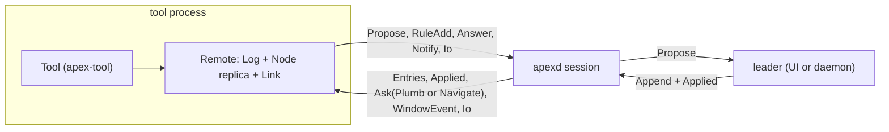
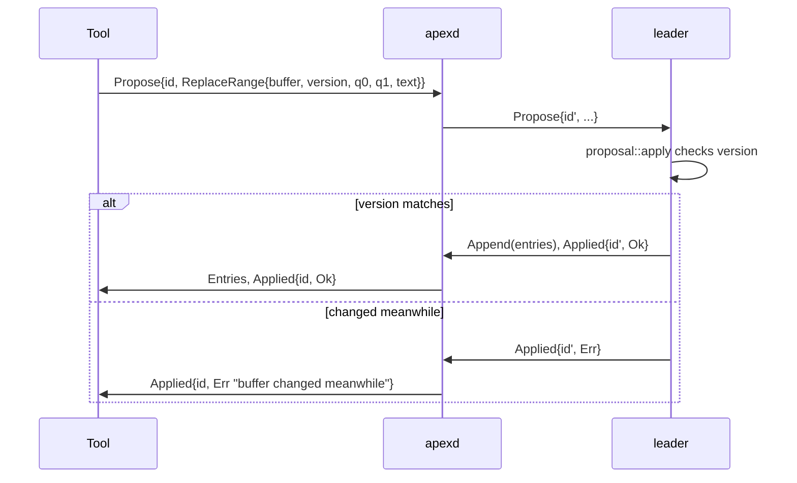
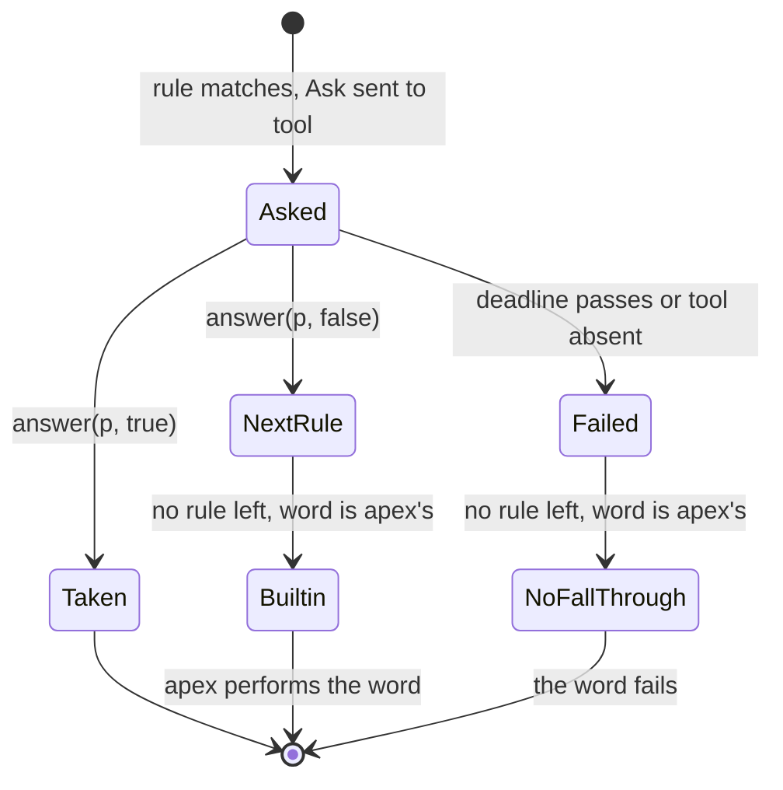

# Writing Tools: the apex-tool SDK

`apex-tool` is the extension point of apex. A tool is an ordinary program, usually started by a session (so `APEX_SOCKET` and `apexsession` are in its environment). It joins that session under a name and then takes part in it as the user does. It can make and write windows, put words in their tools menus, answer those words when B2 runs them or B3 plumbs text to them, follow what others type in a window, claim a window as its own, ask for the user's attention, and make and serve pages. The crate is a thin, synchronous layer over `apex_server::remote::Remote`, the headless client described on [The Attach Protocol](attach-protocol.md). Its stated aim is that "nothing of the wire protocol or the replicated state shows through" ([crates/apex-tool/src/lib.rs:65-68](crates/apex-tool/src/lib.rs#L65-L68)).

Several things are built on the crate: the JSON bridge (`apex tool bridge`) and the Go SDK on top of it ([JSON Bridge and Go SDK](bridge-and-go.md)), the Preview and Web tools ([Preview, Web and Diff Tools](tool-pages.md)), the agent tool ([Coding Agents](agent-tools.md)) and `exp/acp`. Three bundled tools (`win`, `lsp` and, in part, preview) reach past it to `Remote` and `Proposal` directly ([win and Language Servers](tool-win-and-lsp.md)). The review in ARCHITECTURE.md explains this by the primitives the SDK lacks, which are listed at the end of this page. How a tool's requests turn into state changes is covered on [Proposals](proposals.md), and the rule table its verbs live in on [Plumbing Rules and Verbs](plumbing.md).

## Where a tool sits

A `Tool` wraps one `Remote`. The `Remote` holds a mirror `Log`, a full `Node` replica of the session and the `Link` to the daemon ([crates/apex-server/src/remote.rs:722-727](crates/apex-server/src/remote.rs#L722-L727)). The tool attaches as `AttachmentKind::Tool`, so it never leads a shard. Its writes are therefore **proposals**: they are routed through the daemon to whoever leads (the UI, or the daemon itself when no UI is attached), lowered there into entries, and answered with `Applied`. Reads such as `read`, `selection`, `windows` and `tag` never go over the wire. They look at the tool's own replica, which catches up as `Entries` arrive.



The `Tool` struct keeps only a few pieces of state of its own beyond the `Remote` ([crates/apex-tool/src/lib.rs:334-349](crates/apex-tool/src/lib.rs#L334-L349)):

| Field | Purpose |
|---|---|
| `watched` | windows whose body edits by others become `Event::Edit` |
| `ours` | windows the tool made, opened or watches, with the path and label last seen, so renames, relabels and deletions can be reported |
| `events` | the queue `next_event` hands out |
| `own` | the shape of the tool's own pending writes to watched windows, so they can be filtered out of the edit stream |
| `incoming` | requests for pages the tool serves, gathered frame by frame until they are complete |

Sources: [crates/apex-tool/src/lib.rs:1-80](crates/apex-tool/src/lib.rs#L1-L80), [crates/apex-tool/src/lib.rs:334-366](crates/apex-tool/src/lib.rs#L334-L366), [crates/apex-server/src/remote.rs:44-126](crates/apex-server/src/remote.rs#L44-L126), [crates/apex-server/src/remote.rs:722-769](crates/apex-server/src/remote.rs#L722-L769), [ARCHITECTURE.md:27-86](ARCHITECTURE.md#L27-L86)

## Attaching

`Tool::attach(name)` finds the session the same way any command does. The socket comes from `apex_server::daemon::default_socket()`. The session comes from `apexsession`, then `APEX_SESSION`, and falls back to the default session name. `attach` then calls `attach_to(socket, session, name)` ([crates/apex-tool/src/lib.rs:352-358](crates/apex-tool/src/lib.rs#L352-L358)). `attach_to` connects with `Remote::connect_as(..., AttachmentKind::Tool)` and calls `announce(name)`. Announcing sends `ClientMsg::Named` with the process group, pid and command line, so the tool shows under its own name in the top row and in `apex ps`, and `Kill` can find it ([crates/apex-server/src/remote.rs:891-899](crates/apex-server/src/remote.rs#L891-L899)).

The name matters beyond display. A rule's action is `RuleAction::Tool(name)`, and the daemon dispatches a plumb to the first connection in the session whose attachment carries that name ([crates/apex-server/src/daemon.rs:1467-1486](crates/apex-server/src/daemon.rs#L1467-L1486)). Names are not unique, which the review lists as a weakness.

A few accessors describe the attachment itself:

- `session()` returns the session's id and label.
- `name()` returns the attachment's name as recorded in the metalog.
- `socket()` returns the daemon's socket, for a tool that starts others.
- `meta()` exposes the replica's `Meta` (settings, rules, attachments).
- `setting(key)` returns the tool's own setting, else the session's.
- `set(key, value)` records a setting that is dropped when the tool detaches.

Sources: [crates/apex-tool/src/lib.rs:351-385](crates/apex-tool/src/lib.rs#L351-L385), [crates/apex-tool/src/lib.rs:1113-1129](crates/apex-tool/src/lib.rs#L1113-L1129), [crates/apex-server/src/remote.rs:891-899](crates/apex-server/src/remote.rs#L891-L899)

## The event loop: `next_event`

A tool is a loop around `next_event(timeout)`. The method returns:

- `Ok(Some(ev))` when there is something to handle;
- `Ok(None)` when the wait ran out;
- an `Error` whose `is_closed()` holds once the session is over.

Earlier, a timeout and the end of the session both returned `Ok(None)`. The review recorded this as bug 6, and it has since been fixed with the `CLOSED` error ([crates/apex-tool/src/lib.rs:108-117](crates/apex-tool/src/lib.rs#L108-L117)). The test `next_event_tells_a_wait_run_out_from_the_session_ending` pins the fix ([crates/apex-tool/tests/tool.rs:402-419](crates/apex-tool/tests/tool.rs#L402-L419)).

```rust
pub fn next_event(&mut self, timeout: Option<Duration>) -> Result<Option<Event>>
```

Internally the method alternates two steps ([crates/apex-tool/src/lib.rs:392-453](crates/apex-tool/src/lib.rs#L392-L453)):

- `drain` handles every message already queued on the link without blocking.
- `step` blocks for up to 100 ms (or what is left of the deadline) for one more message.

Each message goes through `before` (for `Entries` only), then `Remote::handle`, which appends to the mirror log and catches the node up, then `after`. The two hooks turn what arrived into events:

- **`before`** sees buffer entries *before* they land in the replica. If the buffer is a watched window's body, each `BufferOp::Edit` becomes an `Event::Edit { window, q0, nd, text }`, unless it matches an entry in `own` ([crates/apex-tool/src/lib.rs:455-470](crates/apex-tool/src/lib.rs#L455-L470)).
- **`after`** collects everything the link stored ([crates/apex-tool/src/lib.rs:472-545](crates/apex-tool/src/lib.rs#L472-L545)):
  - I/O frames on daemon-opened streams (numbered from `0x8000_0000`), assembled into `Event::Request`;
  - navigation questions, which become `Event::Navigate`;
  - window events, which become `Event::Page`;
  - tool plumbs (`ToolPlumb`), which become `Event::Plumb`.

  It then compares every window in `ours` against the replica and emits `Renamed`, `Relabeled` or `Deleted`.

| `Event` | When it comes |
|---|---|
| `Plumb(Plumb)` | a rule of the tool's matched; answer it |
| `Edit(Edit)` | someone else edited a watched window's body |
| `Renamed { window, path }` | a window in `ours` has a new path (a Put under a new name, a shell's `cd`), not by the tool's own `rename` |
| `Relabeled { window, label }` | its label changed (a terminal's title) |
| `Deleted { window }` | it is gone; it also leaves `ours` and `watched` |
| `Navigate(Navigation)` | a link was followed in a page the tool owns (after `handle_pages`) |
| `Page { window, event }` | a page event: navigated, loaded, title, a script message (after `handle_pages`) |
| `Request(Served)` | a complete request for `tool://NAME/...`; answer with `respond` |

`alive()` drains the link and reports whether it is still open. It is meant for tools that have no window of their own whose deletion would tell them the session ended ([crates/apex-tool/src/lib.rs:951-958](crates/apex-tool/src/lib.rs#L951-L958)).

Sources: [crates/apex-tool/src/lib.rs:191-243](crates/apex-tool/src/lib.rs#L191-L243), [crates/apex-tool/src/lib.rs:387-545](crates/apex-tool/src/lib.rs#L387-L545), [crates/apex-server/src/remote.rs:341-465](crates/apex-server/src/remote.rs#L341-L465), [crates/apex-tool/tests/tool.rs:402-419](crates/apex-tool/tests/tool.rs#L402-L419)

## Proposing, and what can go wrong

Every write goes through the private `propose`. It sends the proposal over the link with a fresh id. It then steps the link in slices of up to 50 ms, so events that arrive meanwhile are still collected, until `link.applied` has the answer or `TIMEOUT` (10 s) passes ([crates/apex-tool/src/lib.rs:591-608](crates/apex-tool/src/lib.rs#L591-L608)). It returns three kinds of error:

- the leader's own refusal (`Applied{Err}`), passed through as text;
- `"timed out waiting for the session"`;
- `"the session is gone"`.

The `Ok` value is the window a proposal made, if it made one.

`Error` is a plain `String` newtype. There is no error enum, so beyond `is_closed` a tool can only show or log the message ([crates/apex-tool/src/lib.rs:82-117](crates/apex-tool/src/lib.rs#L82-L117)).

Some calls do not wait for an answer. They send a bare `ClientMsg`: `notify`, `unnotify`, `withdraw`, `set`, `answer`, `answer_navigation`, `post_to_page` and `respond`. Those calls always return `Ok`.



Sources: [crates/apex-tool/src/lib.rs:82-123](crates/apex-tool/src/lib.rs#L82-L123), [crates/apex-tool/src/lib.rs:585-608](crates/apex-tool/src/lib.rs#L585-L608), [crates/apex-server/src/proposal.rs:244-303](crates/apex-server/src/proposal.rs#L244-L303), [ARCHITECTURE.md:104-110](ARCHITECTURE.md#L104-L110)

## Making windows

Every constructor proposes in the **last column** of the layout, and adds the window it gets back to `ours` (`remember`) so that its renames and deletion are reported.

| Call | Proposal | What it makes |
|---|---|---|
| `new_window(path)` | `NewWindow{scratch: false}` | an empty window for a file at `path` |
| `new_scratch(path, label)` | `NewWindow{scratch: true}` | no file behind it (a transcript, a report) |
| `new_diagnostic(path, label)` | `NewWindow{scratch, diagnostic}` | made stashed, like `+Errors`; new text is shown in a toast, and progress on its stash card |
| `new_page(path, label, html)` | `Proposal::open_html` | a buffer-backed page whose body is the HTML; `replace` rewrites it in place |
| `new_web_page(url, near)` | `Proposal::open_url`, then `Own` | a page at an address, in `near`'s column if given, owned by the tool |
| `diff(text, dir)` | `new_page` or `replace` + `Show` | `dir`'s page labelled "Diff", rendered by `apex_diff::render`, with `Prev Next` added to the tag once |
| `open(name, line)` | `Goto` | the file shown (opened if needed); then waits up to 10 s for a window of that name |

`open` is a `Goto`, which moves the user and records the back stack. The review notes that the CLI's `open` is something else (an `OpenFile`) ([ARCHITECTURE.md:580-583](ARCHITECTURE.md#L580-L583)). `bring(w)` and `switch(session, window)` are the other two ways of moving the user. `show(w, at)` and `show_line(w, n)` only scroll, and only when needed; they leave dot, the mouse and the back stack alone. The review keeps `show` distinct from the rest.

The query side reads the replica:

- `windows()` and `window(w)` return a `WindowInfo` with the path, label, kind, `scratch` and `live`.
- `window_body` returns the `Body`.
- `window_owner` returns the owning attachment.
- `read`, `selection`, `line(w, n)` and `tag(w)` return text and positions.

All offsets count characters, as apex does everywhere ([crates/apex-tool/src/lib.rs:61](crates/apex-tool/src/lib.rs#L61)).

Sources: [crates/apex-tool/src/lib.rs:125-147](crates/apex-tool/src/lib.rs#L125-L147), [crates/apex-tool/src/lib.rs:610-786](crates/apex-tool/src/lib.rs#L610-L786), [crates/apex-tool/src/lib.rs:852-880](crates/apex-tool/src/lib.rs#L852-L880), [crates/apex-tool/tests/tool.rs:179-192](crates/apex-tool/tests/tool.rs#L179-L192)

## Writing text: `replace`, `append`, `insert_following`, `set_tag`

`replace(w, q0, q1, text)` takes the body buffer's current length and `version` from the replica, clamps both ends (the constant `END = usize::MAX` means the end of the text), and proposes `ReplaceRange { select: false, version, .. }`. If the user typed in the meantime, the leader's version differs, the proposal fails, and **nothing is written**. The caller is expected to read again and retry ([crates/apex-tool/src/lib.rs:788-816](crates/apex-tool/src/lib.rs#L788-L816)).

This used to be a silent failure. `ReplaceRange` used to return `Ok(None)` on a conflict, which left a phantom entry in the tool's own-edit queue (bug 1 in the review). It now returns `Err` ([crates/apex-server/src/proposal.rs:259-267](crates/apex-server/src/proposal.rs#L259-L267)), and `replace` pops the remembered shape again when the proposal fails. `replace` never moves dot. `append(w, text)` is `replace(w, END, END, text)`.

`insert_following(w, at, text)` is the call for windows a program writes. It proposes `Insert { follow: true }`. The leader collects every view whose dot is exactly the empty range at `at`, inserts the text, and moves those dots to its end, all in the same round trip ([crates/apex-server/src/proposal.rs:290-303](crates/apex-server/src/proposal.rs#L290-L303)). A dot sitting at the output point is carried along, so the user can keep typing at the end. A dot anywhere else, such as in a draft being typed, stays where the edit leaves it. The test `output_carries_the_dot_along_but_leaves_a_draft_alone` shows both cases: three writes carry the dot from 0 to 4 to 8, and then an insert before a draft at 13 shifts the draft's cursor to 19 without collapsing it ([crates/apex-tool/tests/tool.rs:26-53](crates/apex-tool/tests/tool.rs#L26-L53)). `Insert` also refuses a stale `version`.

`set_tag(w, text)` replaces the whole tag text with `text.trim()` plus a trailing space. apex's own tag words (`Del Snarf Undo Put` and so on) and the window's path and label are window state, not tag text. A tool that furnishes a tag therefore writes all of its words, `Look` included. A fresh window's tag reads `"Look "` ([crates/apex-tool/tests/tool.rs:194-220](crates/apex-tool/tests/tool.rs#L194-L220)).

Two further writes:

- `select(w, q0, q1)` sets the selection.
- `rename` and `set_label` change the window's path and label. Both update `ours` *before* proposing, so the tool's own change is never reported back as an event.

Sources: [crates/apex-tool/src/lib.rs:788-923](crates/apex-tool/src/lib.rs#L788-L923), [crates/apex-server/src/proposal.rs:244-303](crates/apex-server/src/proposal.rs#L244-L303), [crates/apex-tool/tests/tool.rs:26-53](crates/apex-tool/tests/tool.rs#L26-L53), [crates/apex-tool/tests/tool.rs:194-220](crates/apex-tool/tests/tool.rs#L194-L220)

## Offering verbs through rules

A tool offers a verb by installing a plumbing rule whose action is itself. `Rule` is a builder:

```rust
let shout = t.offer(Rule::verb("Shout").window(w))?;
let look  = t.offer(Rule::plumb().text(r"#(\d+)").file(r"\.go$").priority(5))?;
```

| Builder | Rule field | Meaning |
|---|---|---|
| `Rule::verb(v)` | `verb` | a word in the tools menu of matching windows, run wherever B2 finds it |
| `Rule::plumb()` | `verb = "plumb"` | B3 on matching text goes to the tool |
| `.text(re)` | `text` | the plumbed text, or the verb's arguments, must match whole; the groups arrive in `Plumb::groups` |
| `.file(re)` | `file` | the window's name must match |
| `.kind(k)` | `kind` | the window kind |
| `.window(w)` | `win` | this one window (ids are never reused) |
| `.owner(re)` | `owner` | the owning tool's name must match; `""` means no owner, i.e. a real file |
| `.unlisted()` | `unlisted` | runs by B2 but is left out of the menu |
| `.priority(p)` | — | higher goes first; 0 is usual |
| `.start(cmd)` | `start` | how to start the tool if the rule matches while it is not attached |

`offer_as` turns the builder into a `PlumbRule` with `action: RuleAction::Tool(self.name())`, checks it locally, and calls `Remote::rule_add`. That sends `ClientMsg::RuleAdd` and blocks until `RuleAdded{id}` arrives ([crates/apex-tool/src/lib.rs:1088-1105](crates/apex-tool/src/lib.rs#L1088-L1105), [crates/apex-server/src/remote.rs:790-795](crates/apex-server/src/remote.rs#L790-L795)). The `mine` flag decides who owns the rule:

- **`offer`** installs the rule as the tool's own. When the connection goes, the daemon removes every rule owned by the attachment and then detaches it ([crates/apex-server/src/daemon.rs:518-536](crates/apex-server/src/daemon.rs#L518-L536)).
- **`offer_lasting`** installs the rule as the session's (`SERVER`), so it outlives the tool. Together with `.start(cmd)` it is how a tool such as Preview or Web is started on first use; see [Plumbing Rules and Verbs](plumbing.md).

`withdraw(id)` sends `RuleRm{session: false}`. The daemon only removes a rule its owner asks to remove, so `withdraw` cannot remove a lasting rule ([crates/apex-server/src/daemon.rs:826-833](crates/apex-server/src/daemon.rs#L826-L833)).

`Rule::owner` is how a rule targets one tool's windows without guessing from their names. The test `a_rule_may_name_the_tool_that_owns_the_window` offers `Snarfout` with `owner("win-.*")`. The word appears in win's window and not in the agent's window, even though both are named `/tmp/proj/-…`. It also offers `Back` with `owner("")`, which appears only on a real file ([crates/apex-tool/tests/tool.rs:54-86](crates/apex-tool/tests/tool.rs#L54-L86)). Unlisted verbs are tested the same way: `Allow` is not in the menu, but B2 on `Allow once` still reaches the tool with `text == "once"` ([crates/apex-tool/tests/tool.rs:87-110](crates/apex-tool/tests/tool.rs#L87-L110)).

Sources: [crates/apex-tool/src/lib.rs:245-332](crates/apex-tool/src/lib.rs#L245-L332), [crates/apex-tool/src/lib.rs:1073-1111](crates/apex-tool/src/lib.rs#L1073-L1111), [crates/apex-core/src/plumb.rs:131-151](crates/apex-core/src/plumb.rs#L131-L151), [crates/apex-server/src/daemon.rs:816-833](crates/apex-server/src/daemon.rs#L816-L833)

## Answering plumbs within their deadlines

When a rule of the tool's matches, the server's plumb walk produces an `AskTool` step. The daemon finds the tool's connection, sends `Ask { request: Request::Plumb {...} }`, and starts a timer. The deadline depends on the verb ([crates/apex-server/src/daemon.rs:198-206](crates/apex-server/src/daemon.rs#L198-L206)):

| Kind | Constant | Wait | Reason |
|---|---|---|---|
| B3 (`verb == "plumb"`) | `B3_ANSWER` | 1 s | a search; it should not keep the user waiting, and a refusal costs nothing |
| any verb | `VERB_ANSWER` | 10 s | the tool may do the work before answering, e.g. a formatter reshaping a buffer before letting Put write it |
| a tool being started (`start`) | `START_WAIT` | 10 s to attach | then the plumb is handed to it with its usual wait |

The tool receives an `Event::Plumb` with these fields:

- `id` and `rule`: the matching rule, which tells a tool with several rules apart.
- `verb` and `text`: the arguments, or the plumbed text.
- `dir`: where relative names resolve.
- `window`: `None` when the word came from the top row.
- `groups`: the text regexp's groups, `$0` first.
- `at` and `sel`.

For a verb, `at` is the window's dot. For B3, `at` is the pointer and `sel` is what was swept or expanded. `Plumb::range()` picks the first non-empty one of `sel` and `at` ([crates/apex-tool/src/lib.rs:149-178](crates/apex-tool/src/lib.rs#L149-L178)).

`answer(&p, taken)` sends `Answer::Plumb { ok }` ([crates/apex-server/src/remote.rs:992-995](crates/apex-server/src/remote.rs#L992-L995)), and the walk continues:

- **Taken** finishes the walk.
- **Refused** goes on to the next rule (`Server::plumb_next`).
- **No answer in time**, or no such tool attached, also goes on (`plumb_failed`), but the plumb is marked `failed`.

The `failed` mark matters for words apex knows itself ([crates/apex-server/src/lib.rs:1402-1428](crates/apex-server/src/lib.rs#L1402-L1428)).



## Claiming built-in words such as Put

A rule may take a word apex has its own meaning for. The list is `apex_core::plumb::BUILTINS`: the leader's built-ins (`Cut`, `Paste`, `Undo`, `Del`, `Look`, `Edit`, ...) and the server's (`Put`, `Get`, `New`, `Win`, `Kill`, ...) ([crates/apex-core/src/plumb.rs:230-243](crates/apex-core/src/plumb.rs#L230-L243)).

Such a rule must say where it applies, with `.window`, `.file` or `.kind`. `PlumbRule::check` refuses an unscoped claim, so `offer(Rule::verb("Put"))` returns `Err` ([crates/apex-core/src/plumb.rs:141-146](crates/apex-core/src/plumb.rs#L141-L146)).

What happens next depends on the answer:

- **Taken:** the word meant what the tool said, and nothing else happens.
- **Refused:** the word is handed back, and apex does what it always does. The crate docs describe a formatter as the typical case: it claims `Put`, tidies the buffer and refuses, so the ordinary `Put` writes the tidy text.
- **Never answered:** this decides nothing. The word *fails* rather than falling through, so a dead tool cannot let `Get` reload a generated window ([crates/apex-tool/src/lib.rs:52-61](crates/apex-tool/src/lib.rs#L52-L61)).

`a_tool_takes_a_word_apex_knows_and_can_hand_it_back` covers each case ([crates/apex-tool/tests/tool.rs:246-323](crates/apex-tool/tests/tool.rs#L246-L323)):

- a taken `Put` leaves the file on disk unchanged;
- a refused `Put` writes it;
- an unscoped rule for `Put` is refused;
- a `Put` rule scoped to another file pattern does not intercept;
- `Del`, which the leader rather than the server performs, keeps the window when taken and closes it when refused.

Sources: [crates/apex-server/src/daemon.rs:160-209](crates/apex-server/src/daemon.rs#L160-L209), [crates/apex-server/src/daemon.rs:1385-1488](crates/apex-server/src/daemon.rs#L1385-L1488), [crates/apex-server/src/lib.rs:1402-1428](crates/apex-server/src/lib.rs#L1402-L1428), [crates/apex-core/src/plumb.rs:131-151](crates/apex-core/src/plumb.rs#L131-L151), [crates/apex-core/src/plumb.rs:221-243](crates/apex-core/src/plumb.rs#L221-L243), [crates/apex-tool/src/lib.rs:585-589](crates/apex-tool/src/lib.rs#L585-L589), [crates/apex-tool/tests/tool.rs:111-134](crates/apex-tool/tests/tool.rs#L111-L134), [crates/apex-tool/tests/tool.rs:246-323](crates/apex-tool/tests/tool.rs#L246-L323)

## Watching other windows' edits

`watch(w)` adds a text window to `watched` (and to `ours`). `unwatch(w)` removes it. From then on, `before` compares every incoming buffer entry against the watched windows' body buffers and turns each `BufferOp::Edit` into an `Event::Edit`. The offsets are in the text as the tool last saw it: `nd` characters deleted at `q0`, and `text` inserted there.

The proposals are applied by the leader as itself, so an entry does not say which attachment asked for it. The SDK therefore **recognises its own edits by their shape**. `replace` and `insert_following` push `(buffer, q0, nd, text)` onto `own`, capped at 256 entries, and `before` drops the first incoming edit that matches exactly ([crates/apex-tool/src/lib.rs:343-346](crates/apex-tool/src/lib.rs#L343-L346), [crates/apex-tool/src/lib.rs:801-808](crates/apex-tool/src/lib.rs#L801-L808)). The main test checks both sides: the tool's own `append` produces no event, and another attachment's `ReplaceRange` produces `Edit { q0: 16, nd: 0, text: "typed\n" }` ([crates/apex-tool/tests/tool.rs:141-157](crates/apex-tool/tests/tool.rs#L141-L157)).

Sources: [crates/apex-tool/src/lib.rs:180-189](crates/apex-tool/src/lib.rs#L180-L189), [crates/apex-tool/src/lib.rs:455-470](crates/apex-tool/src/lib.rs#L455-L470), [crates/apex-tool/src/lib.rs:1056-1071](crates/apex-tool/src/lib.rs#L1056-L1071), [crates/apex-tool/tests/tool.rs:141-177](crates/apex-tool/tests/tool.rs#L141-L177)

## Owning windows and showing status

Four calls mark a window as the tool's, each a proposal carrying the tool's attachment id (or `None` to clear it):

| Call | Proposal | Effect | Ends |
|---|---|---|---|
| `set_owner(w, on)` | `Own` | content is the tool's doing: the tag loses its file menu (`Undo Redo Put Get`), `Del` asks nothing, `Rule::owner` can match it | on `false` or detach |
| `set_live(w, on)` | `Live` | the handle shows a process behind it; `Del` does not ask about unsaved text | on `false` or detach |
| `set_working(w, on)` | `Working{at: None}` | the handle pulses | on `false` or detach |
| `set_progress(w, Some(p))` | `Working{at: Some(p≤100)}` | the circle round the handle filled to `p`% | on `None` or detach |
| `set_clean(w)` | `Clean{version}` | the body is what it should be; dirtiness stops showing, as acme's `ctl clean` | when the user types again |

`work_behind_a_window_shows_while_the_tool_is_there` checks that dropping the `Tool` stops the pulsing ([crates/apex-tool/tests/tool.rs:221-244](crates/apex-tool/tests/tool.rs#L221-L244)).

Owning a page also matters for navigation. After `handle_pages()`, links followed in the tool's pages come to it as `Event::Navigate`, and it answers with `answer_navigation(n, NavAnswer)`. Page events arrive as `Event::Page`, and `post_to_page` speaks to the page's script. A tool that has not called `handle_pages` has every link answered `Default` at once by its own link ([crates/apex-server/src/remote.rs:421-429](crates/apex-server/src/remote.rs#L421-L429)). Requests for `tool://NAME/...` arrive as `Event::Request`, and `respond` sends the response head, the body in 256 KiB chunks, and `End`. With no tool of that name attached, the request gets 503 ([crates/apex-tool/tests/tool.rs:460-487](crates/apex-tool/tests/tool.rs#L460-L487)). Pages themselves are described on [The I/O Plane and Pages](io-plane-and-pages.md).

Sources: [crates/apex-tool/src/lib.rs:547-583](crates/apex-tool/src/lib.rs#L547-L583), [crates/apex-tool/src/lib.rs:960-1016](crates/apex-tool/src/lib.rs#L960-L1016), [crates/apex-tool/tests/tool.rs:221-244](crates/apex-tool/tests/tool.rs#L221-L244), [crates/apex-tool/tests/tool.rs:421-487](crates/apex-tool/tests/tool.rs#L421-L487)

## Notifications, errors, snarf and commands

`notify(w)` sends `ClientMsg::Notify` and raises the window's notification. The notification shows on the window's handle, on the session's handle, and on the app tab; a click on the session's handle goes to the oldest one. A window has one notification at a time, and raising it again keeps its place in the queue. The notification goes away when:

- the tool calls `unnotify`;
- the user takes it or uses the window;
- the window goes;
- the tool detaches. `MetaOp::Detach` drops the attachment's notifications ([crates/apex-core/src/state.rs:828-832](crates/apex-core/src/state.rs#L828-L832)).

`notified(w)` asks the replica whether it is still up. One tool cannot lower another's notification. The test also checks the oldest-first queue across two tools ([crates/apex-tool/tests/tool.rs:325-381](crates/apex-tool/tests/tool.rs#L325-L381)).

The remaining calls are small:

- `errors(dir, text)` appends to `+Errors` for `dir` or the session.
- `snarf(text)` sets the snarf buffer and the clipboard of every UI ([crates/apex-tool/tests/tool.rs:383-400](crates/apex-tool/tests/tool.rs#L383-L400)).
- `exec_in(w, text)` and `exec(text)` run `text` as B2 would, as `Proposal::Exec`.
- `delete(w)` is just `exec_in(Some(w), "Del")`.

Because `delete` is an exec, rules can intercept it, and an unsaved window gets a warning instead. The review criticises this.

Sources: [crates/apex-tool/src/lib.rs:925-958](crates/apex-tool/src/lib.rs#L925-L958), [crates/apex-tool/src/lib.rs:1018-1054](crates/apex-tool/src/lib.rs#L1018-L1054), [crates/apex-tool/tests/tool.rs:325-400](crates/apex-tool/tests/tool.rs#L325-L400)

## Testing

`crates/apex-tool/tests/tool.rs` runs a real `Daemon::run_with` on a thread, on a fresh socket in the temp directory, for each test ([crates/apex-tool/tests/tool.rs:13-24](crates/apex-tool/tests/tool.rs#L13-L24)). The tests attach `Tool`s, plus bare `Remote`s that play "another attachment" or a UI. A `Remote` attached as `AttachmentKind::Ui` takes the lead, which the snarf test uses to check that a tool waits on a UI leader to apply its proposal. Most assertions wait on a replica with a deadline rather than sleeping, because every write is applied by the leader and only later replicated.

Sources: [crates/apex-tool/tests/tool.rs:1-24](crates/apex-tool/tests/tool.rs#L1-L24), [crates/apex-tool/tests/tool.rs:383-400](crates/apex-tool/tests/tool.rs#L383-L400)

## Known gaps

ARCHITECTURE.md §4 reviews the tool APIs and finds them neither complete nor orthogonal. The points that bear on this crate:

- **Own edits are filtered, by shape.** Because a tool never sees its own edits in order, it cannot reconstruct the sequence of changes to a buffer. Per the review, the LSP would desync after its own Fmt or Rename, and agent and acp keep hand-updated position tables. Matching by shape is also only a heuristic: an identical edit by someone else could be swallowed. The review proposes delivering every edit tagged with its origin (acme's E/K/M), or server-side marks.
- **Only watched windows report**, selections are never reported, and there are no create or delete events for windows that are not the tool's own. `windows()` lacks dirty, owner, diagnostic, working and notified.
- **Missing primitives** that send tools to the filesystem or to `apex` subprocesses:
  - terminal send and read;
  - I/O-plane get and put for files on the session's host;
  - reading the snarf buffer;
  - window and buffer lifecycle events;
  - back and forward navigation;
  - an event when a setting changes;
  - an undo-group mark;
  - sam addresses (`addr`/`data`), though `apex_edit` has the evaluator.
- **Overlapping calls.** The four `new_*` constructors are one call with options. Owner, live, working and progress overlap. `replace`, `append`, `insert_following` and `set_tag` are one write with flags. `open`, `bring` and `switch` all mean "go to". `notified` exists only to be polled.
- **Surfaces disagree.** `insert_following` is missing from the bridge and Go, despite the crate's "one for one" claim; see [JSON Bridge and Go SDK](bridge-and-go.md).

Two of the review's bugs about this crate are already fixed in the code: the silent `ReplaceRange` conflict and the ambiguous `Ok(None)` from `next_event`. The review's line numbers for `apex-tool/src/lib.rs` predate later changes; the shape filter is now at [crates/apex-tool/src/lib.rs:455-470](crates/apex-tool/src/lib.rs#L455-L470).

Sources: [ARCHITECTURE.md:141-194](ARCHITECTURE.md#L141-L194), [ARCHITECTURE.md:552-666](ARCHITECTURE.md#L552-L666)
