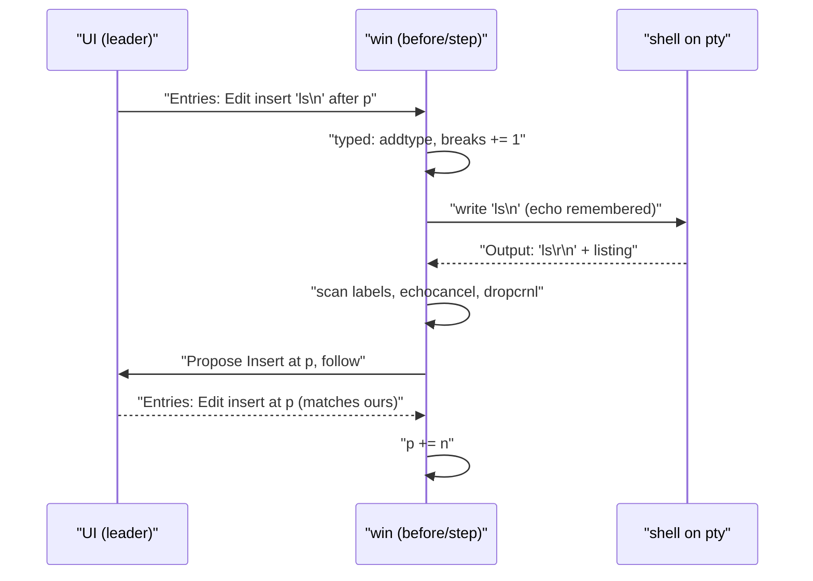
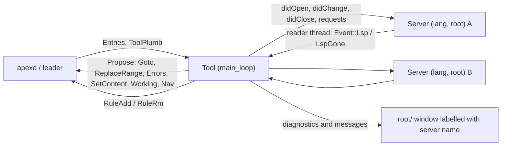
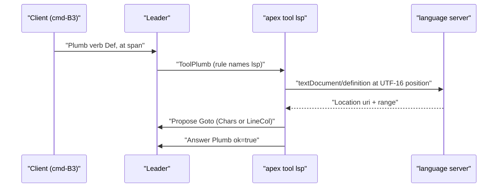

# win and Language Servers

apex ships two tools that are larger than the others and that predate, or sit beside, the [apex-tool SDK](tool-sdk.md). `apex tool win` is a port of plan9port's `win` (`src/cmd/9term/win.c`): it runs a shell on a pty and makes an ordinary editable text window its transcript, so the shell's output lands at an *output point* and whatever is typed after that point is sent to the shell a line at a time. `apex tool lsp` connects apex to language servers. It runs one server per language and workspace root, feeds each server edits taken from the replicated entry stream, writes diagnostics into a per-server window at `root/`, and offers the verbs `Def Refs Type Hov Sig Fmt Rn` in the tools menu of source windows.

Neither tool is privileged. Each attaches to a session like any tool (see [The Attach Protocol](attach-protocol.md)), keeps its own replica through a `Remote`, installs [plumbing rules](plumbing.md) that name its attachment, and changes state only through [proposals](proposals.md). Both work with `Remote` and `Proposal` directly rather than through `apex_tool::Tool`, because both need to see each buffer entry *before* the replica applies it. The CLI starts them from `tool_cmd`: `apex tool win [cmd...]` runs in the current directory, and `apex tool lsp [-v]` runs until the link ends ([crates/apex-cli/src/main.rs:1055-1065](crates/apex-cli/src/main.rs#L1055-L1065)).

## A shared pattern: seeing entries before they land

Both tools have the same small core loop, copied in each crate. `Remote::step` and `Remote::propose` take a `ServerMsg` from the link and apply it to the replica straight away ([crates/apex-server/src/remote.rs:748-765](crates/apex-server/src/remote.rs#L748-L765), [crates/apex-server/src/remote.rs:1041-1049](crates/apex-server/src/remote.rs#L1041-L1049)). That ordering suits most tools. These two need the text as it was *before* each edit: win, to tell which region an edit touched relative to its output point, and lsp, to turn char offsets into LSP line/column positions against the pre-edit text. So each tool defines its own `step` and `propose`. These read `remote.link.rx` themselves, pass every message to `before(&m)`, and only then call `remote.handle(m)`:

```rust
fn step(&mut self, timeout: Duration) -> bool {
    match self.remote.link.rx.recv_timeout(timeout) {
        Ok(m) => {
            self.before(&m);
            let alive = self.remote.handle(m);
            self.settle();
            alive
        }
        ...
```

The local `propose` sends with `link.propose`, then calls this `step` until `link.applied` holds the answer, so messages that arrive while it waits still go through `before`. The comment on both copies says why: "Remote::propose would apply them behind our back". Each main loop follows the same shape. It drains the link through `before`/`handle`, takes `remote.link.plumbs` (the `ToolPlumb`s its rules caught), drains its own event channel (pty output, or language-server messages), and sleeps 10 ms when nothing happened.

`ToolPlumb` carries the plumb `id` to acknowledge, the matching `rule`, the `ctx`, `verb`, `text`, `dir`, regexp `groups`, and the pointer and selection spans `at` and `sel` ([crates/apex-server/src/remote.rs:552-566](crates/apex-server/src/remote.rs#L552-L566)). Each tool answers with `Remote::plumb_ack(id, ok)` ([crates/apex-server/src/remote.rs:992-995](crates/apex-server/src/remote.rs#L992-L995)).

Sources: [crates/apex-tool-win/src/lib.rs:263-360](crates/apex-tool-win/src/lib.rs#L263-L360), [crates/apex-tool-lsp/src/lib.rs:428-532](crates/apex-tool-lsp/src/lib.rs#L428-L532), [crates/apex-server/src/remote.rs:729-795](crates/apex-server/src/remote.rs#L729-L795)

## apex tool win

### Setup

`run(socket, session, dir, cmd)` makes the window, starts the shell and installs the rules ([crates/apex-tool-win/src/lib.rs:214-261](crates/apex-tool-win/src/lib.rs#L214-L261)):

1. It attaches as a `Tool` named `win-PID` and announces itself as `win`, which is the name shown in the top row and in `ps`.
2. It names the window with the terminals' rule, `apex_server::term::place`: the path is the directory with a trailing slash, and the label is the command's name (`command_name`) or, with no command, the host name (`term::sysname`, plan9port's `sysname`) ([crates/apex-server/src/term.rs:55-87](crates/apex-server/src/term.rs#L55-L87)).
3. It proposes `NewWindow { scratch: true, diagnostic: false }` in the last column and steps until the window appears in the replica. It then proposes `Own { by: me }`, so the window counts as a tool's transcript and not a file, and so a rule with `owner` `^win` matches it.
4. It spawns the shell. With no command given, this is `command_shell()` with `-i`: `$acmeshell`, else apex's `rc`, else `sh` ([crates/apex-server/src/lib.rs:1926-1934](crates/apex-server/src/lib.rs#L1926-L1934)). The environment includes `winid`.
5. It adds three rules for this window alone (`win_rules`): `Interrupt`, `EOF` and `apex_core::plumb::EXEC`, each with `win: Some(window)` and `RuleAction::Tool(name)`. Because the rules key on the window id and not its path, they survive renames (the shell's `awd` on `cd`), and two wins never take each other's plumbs ([crates/apex-tool-win/src/lib.rs:191-212](crates/apex-tool-win/src/lib.rs#L191-L212)). `EXEC` is the catch-all verb for "every B2 command in a window that nothing else took" and never appears in the menu ([crates/apex-core/src/plumb.rs:225-228](crates/apex-core/src/plumb.rs#L225-L228)).
6. It proposes `Live { by: me }` so the handle shows a live process and `Del` does not ask. When the shell exits, it clears `Live` again, if the window still exists.

The loop ends when the link ends, the window is deleted, or the shell exits.

### The shell on its pty

`Shell::spawn` opens a pty with `openpty`. In `pre_exec` it calls `setsid`, makes the slave the controlling tty, and sets the termios as win's `stty` does: `ICANON | ECHO` on, `ONLCR` off, erase `^H`, intr DEL (0x7f). It also sets `TERM=dumb`, `termprog=win` and `TERM_PROGRAM=apex`. A reader thread forwards master output as `Event::Output(bytes)` and sends `Event::Exited` at EOF. The slave descriptor stays open in the `Shell` because only the slave's termios tells whether a program turned echo off: `echoing()` is win's `isecho`, and `intr()` reads the current interrupt character. Dropping the `Shell` sends `SIGHUP` to the child ([crates/apex-tool-win/src/lib.rs:38-154](crates/apex-tool-win/src/lib.rs#L38-L154)).

### The window's state

| Field | Meaning |
|---|---|
| `p` | The output point in chars. Shell output is inserted here and typing lives after it. |
| `typing`, `breaks` | Text typed after `p` and not yet sent, and the count of newlines and `^D` in it. |
| `echo` | Bytes sent to the shell that the pty will echo back, kept so they can be cancelled. |
| `ours` | The tool's own inserts `(q0, text)` still on their way through the leader. |
| `carry` | A partial OSC label held over between reads. |
| `cook` | Set once a newline has been typed (win's `cook`). |
| `to_remove` | Ranges to delete once the current entries have landed (raw keys, DEL). |
| `cwd`, `title`, `initial_dir`, `label` | Input to `term::place` for the window's path and label. |

Sources: [crates/apex-tool-win/src/lib.rs:156-189](crates/apex-tool-win/src/lib.rs#L156-L189)

### Edits to the buffer: `before`

`before` is win's event loop. It reads the window buffer's `BufferOp::Edit { q0, nd, text }` entries before they are applied ([crates/apex-tool-win/src/lib.rs:362-411](crates/apex-tool-win/src/lib.rs#L362-L411)):

- **Our own output.** For a pure insert whose `(q0, text)` equals the front of `ours`, the entry is popped and `p` advances by the insert's length. This is win's `'E'` event.
- **Deletes.** `delete(q0, q0+nd)` removes the overlapping part of `typing`, adjusts `breaks`, and returns how far `p` moves back. Deletes wholly before `p` move it by their full length ([crates/apex-tool-win/src/lib.rs:484-502](crates/apex-tool-win/src/lib.rs#L484-L502)). In raw mode, a delete that reaches into the typing also sends that many backspaces to the shell.
- **A lone DEL** (`"\u{7f}"`). The range is queued in `to_remove` and the shell's interrupt character is written. This is how fn-backspace interrupts a running command, as the test `del_typed_in_the_window_interrupts_what_the_shell_runs` checks.
- **Other inserts.** An insert before `p` shifts `p`. An insert inside the typing region (`q0 <= p + typing.len()`) goes to `typed`.

The deletions are deferred because `before` runs ahead of the replica. Once `handle` has applied the message, `settle` proposes a `ReplaceRange` with empty text for each pending range, in reverse order ([crates/apex-tool-win/src/lib.rs:279-285](crates/apex-tool-win/src/lib.rs#L279-L285), [crates/apex-tool-win/src/lib.rs:601-607](crates/apex-tool-win/src/lib.rs#L601-L607)).

### Typing, line by line

`typed` → `addtype` → `sendtype` follow win.c ([crates/apex-tool-win/src/lib.rs:413-482](crates/apex-tool-win/src/lib.rs#L413-L482)):

- `addtype` inserts the text into `typing` at the char offset. If the text contains `^C` or DEL, it writes the interrupt character instead, moves `p` past all the typing and drops it.
- `sendtype` sends each complete line, through its `\n` or `^D`, to the shell. It records the bytes in `echo` (cooked mode only) and moves `p` past them. Text without a break stays in `typing` until a newline arrives.
- In raw mode (`raw()` is true whenever the slave's echo is off, for example at a password prompt), every key is sent at once. The typed range is then queued for removal and `p` is moved back, so the program alone decides what appears.

### Shell output

`main_loop` gathers all the pty output that is waiting into one buffer before acting on it. Each insert is a round trip to the leader, and a program that prints line by line would otherwise cost one round trip per line, which is costly when the leader is a far-away UI. `output` then processes the batch ([crates/apex-tool-win/src/lib.rs:508-544](crates/apex-tool-win/src/lib.rs#L508-L544)):

1. `term_loop::scan` cuts OSC labels out of the stream ([crates/apex-server/src/term_loop.rs:25-41](crates/apex-server/src/term_loop.rs#L25-L41)). `Label::Name` becomes the title, `Label::Cwd` (OSC 7) becomes `cwd` through `term::cwd_path`, and OSC 133 marks are ignored because a text window has no prompts to mark. If the result of `term::place` changes, win proposes `SetPath` and/or `SetLabel`. In effect the window is named `DIR/` with the title as label, as for [terminals](terminals.md).
2. `echocancel` drops the leading bytes that match `echo`. It lets a CR stand for an expected LF and skips backspace-space-backspace runs. On the first mismatch it clears the whole expected echo ([crates/apex-tool-win/src/lib.rs:552-576](crates/apex-tool-win/src/lib.rs#L552-L576)).
3. `dropcrnl` removes the CR from CR LF pairs and removes backspace runs ([crates/apex-tool-win/src/lib.rs:658-678](crates/apex-tool-win/src/lib.rs#L658-L678)).
4. `insert_output` pushes `(p, text)` onto `ours` and proposes `Insert { at: p, version, follow: true }`. With `follow`, the leader moves any empty dot sitting at `at` past the new text in the same round trip, so the caret stays after the output ([crates/apex-server/src/proposal.rs:133-138](crates/apex-server/src/proposal.rs#L133-L138)). If the proposal fails, usually because the buffer's version moved when the user typed, the attempt is popped from `ours`, the tool steps once and tries again, up to 20 times. The entries that arrived in the meantime have already gone through `before` and moved `p` ([crates/apex-tool-win/src/lib.rs:578-599](crates/apex-tool-win/src/lib.rs#L578-L599)).



### Plumbs: Interrupt, EOF and B2

`on_plumb` refuses any plumb whose context is not its own window. Of the rest, `Interrupt` writes the interrupt character, `EOF` writes `^D`, and `EXEC` (any B2 command in the window that no builtin or verb took) is acknowledged and passed to `send_command`. That is win's `sende`: it inserts the text plus a newline at the end of the typing, with `follow: false`, then proposes a `Select` after it. The insert goes through `before` like any typing, so the line is sent to the shell ([crates/apex-tool-win/src/lib.rs:609-655](crates/apex-tool-win/src/lib.rs#L609-L655)). This is how B2 on an old command line runs it again. The test checks it still works after `SetPath` renames the window.

### Send and Snarfout

Neither word is implemented in win. Both work in win's window because they act on its text:

- **Send** is a leader builtin. It takes the selection, or the snarf buffer if nothing is selected, appends a newline, and writes it at the end of the body, leaving dot after it ([crates/apex-core/src/node.rs:2251-2272](crates/apex-core/src/node.rs#L2251-L2272)). In a win window that is typing like any other, so `before` sends it. Only in a `Body::Term` window is `Send` routed to the server instead ([crates/apex-core/src/node.rs:2066-2072](crates/apex-core/src/node.rs#L2066-L2072)).
- **Snarfout** is a client rule at priority -10 for `WinKind::Term` windows and for file windows whose owner matches `win-.*`. That match works because win proposes `Own` with its `win-PID` attachment. The client reads the window's text and uses `transcript::last_output` to take the last command and its output, guessing prompts from the shape of the final line, and puts the result in the snarf buffer ([crates/apex-client/src/app.rs:1224-1275](crates/apex-client/src/app.rs#L1224-L1275), [crates/apex-core/src/transcript.rs:1-41](crates/apex-core/src/transcript.rs#L1-L41)).

### Debugging and tests

Setting `APEX_WIN_DEBUG` prints every edit win sees, every line it sends and all raw output to stderr. `crates/apex-tool-win/tests/win.rs` runs a headless `Daemon` with win around `/bin/sh` and acts as a second tool attachment. The tests check that:

- typed lines reach the shell, and their output follows them exactly once;
- the window is live and dirty while the shell runs;
- the menu offers exactly `Interrupt` and `EOF`, and only for that window id;
- B2 `Exec` runs a command again, both before and after a rename;
- DEL interrupts a running `sleep`;
- B3 finds files in the window's directory.

Sources: [crates/apex-tool-win/src/lib.rs:1-679](crates/apex-tool-win/src/lib.rs#L1-L679), [crates/apex-tool-win/tests/win.rs:37-152](crates/apex-tool-win/tests/win.rs#L37-L152), [crates/apex-core/src/node.rs:2251-2272](crates/apex-core/src/node.rs#L2251-L2272), [crates/apex-client/src/app.rs:1224-1275](crates/apex-client/src/app.rs#L1224-L1275)

## apex tool lsp

### Structure



`Tool` holds the following ([crates/apex-tool-lsp/src/lib.rs:356-371](crates/apex-tool-lsp/src/lib.rs#L356-L371)):

| Field | Holds |
|---|---|
| `servers` | Running `Server`s, keyed by `(language id, root)`. |
| `docs` | For each buffer it has told a server about, the server key and the uri. |
| `waiting` | Outstanding requests by `(key, id)`. Each is `Waiting::Initialize` or `Waiting::Plumb { plumb, verb, buffer, ctx, dir }`. |
| `rules` | Verb rule ids installed per language. |
| `failed` | Keys whose servers failed to start or died. These are not retried. |

`run` attaches as `lsp`, announces itself, installs the navigation rules and enters `main_loop` ([crates/apex-tool-lsp/src/lib.rs:373-384](crates/apex-tool-lsp/src/lib.rs#L373-L384)).

### Languages, commands and roots

`LANGUAGES` lists the languages the tool knows, with their extensions, default server command and root markers ([crates/apex-tool-lsp/src/lib.rs:47-63](crates/apex-tool-lsp/src/lib.rs#L47-L63)):

| id | Extensions | Default server | Root markers |
|---|---|---|---|
| go | go | `gopls` | go.work, go.mod |
| rust | rs | `rust-analyzer` | Cargo.toml |
| python | py, pyi | `pyright-langserver --stdio` | pyproject.toml, setup.py, requirements.txt |
| typescript | ts, tsx, js, jsx | `typescript-language-server --stdio` | package.json |
| c | c, h, cc, cpp, cxx, hh, hpp, hxx | `clangd` | compile_commands.json, Makefile |

Session settings (see [Configuration](configuration.md)) are read through `meta.setting(attachment, key)`:

- `lsp.LANG` replaces the server command, for example `lsp.go gopls`.
- `lsp.LANG.root`, or failing that `lsp.root`, names a marker file or directory that overrides root discovery.

`root_of_with_marker` finds the root in this order:

1. The nearest directory upward that contains the configured marker.
2. The nearest directory upward that contains a language marker. Rust is the exception: it keeps climbing to a `Cargo.toml` that contains `[workspace]`, and falls back to the nearest crate if it finds none.
3. The nearest `.git`.
4. The file's own directory.

The unit test shows a `.hg` marker overriding a nested crate ([crates/apex-tool-lsp/src/lib.rs:70-151](crates/apex-tool-lsp/src/lib.rs#L70-L151)).

### Server processes and JSON-RPC

`Server::spawn` splits the command on whitespace and runs it in the root, with stdin and stdout piped. Its stderr is discarded unless `APEX_LSP_DEBUG` is set. A reader thread parses `Content-Length` framed messages (`read_message`) into `Event::Lsp(key, value)` and sends `Event::LspGone(key)` at EOF. `notify` queues every notification except `initialized` until the server has answered `initialize` ([crates/apex-tool-lsp/src/lib.rs:155-301](crates/apex-tool-lsp/src/lib.rs#L155-L301)).

`server_name` decides what a server is called in the session. It is the base name of the command, or the base name of the script when the command is an interpreter such as `python3`, `node`, `env` or `npx`. For example, `python3 x/fake-lsp.py` is called `fake-lsp.py`. `uri_of` and `path_of_uri` convert between paths and percent-encoded `file://` uris ([crates/apex-tool-lsp/src/lib.rs:257-340](crates/apex-tool-lsp/src/lib.rs#L257-L340)).

Requests that come from the server get minimal replies. `workspace/configuration` gets an array of nulls, one per item, and every other request gets `null` ([crates/apex-tool-lsp/src/lib.rs:639-653](crates/apex-tool-lsp/src/lib.rs#L639-L653)).

### Document sync

On each pass, `sync_docs` looks at the replica's buffers with absolute names ([crates/apex-tool-lsp/src/lib.rs:564-631](crates/apex-tool-lsp/src/lib.rs#L564-L631)):

- **New buffers of a known language.** If the `(lang, root)` key has no server and has not failed, it spawns one. It sends `initialize` with `rootUri`, `workspaceFolders`, and capabilities for hover formats, `publishDiagnostics` and `workDoneProgress`, and records `Waiting::Initialize`. It then writes and marks working the server's window. Finally it sends `didOpen` with version 1 and the full text. Spawn failures are logged, added to `failed`, and reported in the root's `+Errors` window.
- **Buffers that have disappeared.** These get `didClose`.

Edits are sent incrementally from `before`, before the replica changes ([crates/apex-tool-lsp/src/lib.rs:534-562](crates/apex-tool-lsp/src/lib.rs#L534-L562)). One `Entries` message can hold several edits, and each must be measured against the text left by the one before. So `before` clones the buffer's text into a *shadow*. For each `Edit { q0, nd, text }` it computes start and end positions in the shadow, applies the edit to the shadow, bumps the uri's version, and sends a `didChange` with a single ranged `contentChanges` element.

### UTF-16 positions (`pos.rs`)

apex addresses text by char (rune) offset (see [Buffers, Views and Undo](buffers-and-text.md)). LSP addresses it by line and UTF-16 code unit. `pos.rs` converts between the two ([crates/apex-tool-lsp/src/pos.rs:7-47](crates/apex-tool-lsp/src/pos.rs#L7-L47)):

| Function | Does |
|---|---|
| `position(t, q)` | Converts char offset `q` (clamped to the text) to `{line, character}`, counting UTF-16 units from the line start. |
| `offset(t, p)` | Converts an LSP position back to a char offset. A line past the end gives `t.len()`, and a column past the end of the line clamps to the line's end. |
| `apply_edits(t, edits)` | Applies `TextEdit`s from the end backwards, so earlier offsets stay valid, and returns the new string. |

The unit tests check that a 😀 (one char, two UTF-16 units) shifts the column by two, and that edits apply from the end.

### Verbs and navigation rules

When the tool starts, `install_rules` adds `Back` and `Fwd` rules at priority -1, so the menu lists them after the language verbs. These rules have `kind: File` and `owner: Some("")`; the code comment says they are for "a file window and one no tool owns", which leaves out terminals, agent windows and wins. They need no server: `on_plumb` proposes `Nav { back }` ([crates/apex-tool-lsp/src/lib.rs:462-477](crates/apex-tool-lsp/src/lib.rs#L462-L477)).

The language verbs are added only once a server of that language has answered `initialize`. `install_verbs` adds one rule per verb with `file: \.(ext|...)$` and `kind: File` at priority 0. When a language's last server dies, `remove_verbs` sends `RuleRm` for them. The appearance of the verbs in the menu is therefore the user's sign that a server is ready ([crates/apex-tool-lsp/src/lib.rs:399-426](crates/apex-tool-lsp/src/lib.rs#L399-L426)). The code comments say cmd-B3 on an identifier is `Def` at the pointer, while plain B3 stays acme's Look.

`on_plumb` works out the position and the request ([crates/apex-tool-lsp/src/lib.rs:842-907](crates/apex-tool-lsp/src/lib.rs#L842-L907)):

1. It takes the position from `p.at`, falling back to `p.sel`. If the buffer is not yet in `docs`, it runs `sync_docs` once, to cover a rule that becomes visible just before the first sync.
2. It maps the verb to an LSP method:

| Verb | Request | What the answer does |
|---|---|---|
| `Def` (also `plumb`) | `textDocument/definition` | `open_at` the first location (`Location` or `LocationLink`'s `targetSelectionRange`). |
| `Type` | `textDocument/typeDefinition` | Same as `Def`. |
| `Refs` | `textDocument/references` (`includeDeclaration`) | Writes `path:line:col` lines to the `+Errors` window for `dir`. |
| `Hov` | `textDocument/hover` | Writes the hover text (string, `MarkupContent` or array) to `+Errors`. |
| `Sig` | `textDocument/signatureHelp` | Writes signature labels to `+Errors`. |
| `Fmt` | `textDocument/formatting` (tabSize 8, tabs) | Applies the edits and proposes one whole-buffer `ReplaceRange` at the buffer's version. |
| `Rn NAME` | `textDocument/rename` | Applies the edits from `changes` and `documentChanges`. Open buffers get a `ReplaceRange`; other files are rewritten on disk. A `PATH: renamed` report goes to `+Errors`. |

3. If the server is still initializing, the plumb is acknowledged as handled and a "still initializing" note goes to `+Errors`. `Rn` with no argument is refused with a usage note. Otherwise the request is sent and `Waiting::Plumb` records it. When the answer arrives, `answer` runs ([crates/apex-tool-lsp/src/lib.rs:909-1019](crates/apex-tool-lsp/src/lib.rs#L909-L1019)) and the plumb is acknowledged with its result. A null result means "nothing" and is acknowledged as `false`.

`open_at` proposes a single `Goto`, which records the origin on the session's back stack so that `Back` returns to it. If the target buffer is open in the replica, the range becomes `Pos::Chars(q0, q1)` through `pos::offset`; otherwise it becomes `Pos::LineCol`, and the leader opens the file ([crates/apex-tool-lsp/src/lib.rs:1021-1037](crates/apex-tool-lsp/src/lib.rs#L1021-L1037)).



Sources: [crates/apex-tool-lsp/src/lib.rs:399-477](crates/apex-tool-lsp/src/lib.rs#L399-L477), [crates/apex-tool-lsp/src/lib.rs:842-1037](crates/apex-tool-lsp/src/lib.rs#L842-L1037), [crates/apex-tool-lsp/src/pos.rs:1-75](crates/apex-tool-lsp/src/pos.rs#L1-L75)

## Diagnostics, messages and progress

Each server has its own diagnostic window. Its path is `root/`, its label is the server's name, and it is a scratch window with `diagnostic: true`. `server_window` first looks for an existing window that matches all three, so a restarted tool finds its old window again. Only if there is none does it propose `NewWindow` and wait for it to appear ([crates/apex-tool-lsp/src/lib.rs:772-800](crates/apex-tool-lsp/src/lib.rs#L772-L800)). The test checks that the window is made stashed.

`textDocument/publishDiagnostics` turns each diagnostic into `path:line:col: severity: first line of message`, using 1-based line and column numbers and severities error, warning, info or hint. It stores the lines per path in `diagnostics` and stamps `unsettled`. Nothing is written yet: the main loop copies `diagnostics` to `settled` only once `SETTLE` (1.5 s) has passed since the last publish, because "a line being typed has errors that go with the next key, and would be a toast each" ([crates/apex-tool-lsp/src/lib.rs:34-40](crates/apex-tool-lsp/src/lib.rs#L34-L40), [crates/apex-tool-lsp/src/lib.rs:517-526](crates/apex-tool-lsp/src/lib.rs#L517-L526), [crates/apex-tool-lsp/src/lib.rs:736-767](crates/apex-tool-lsp/src/lib.rs#L736-L767)).

`write_window` writes the settled diagnostics, ordered by path because they are kept in a `BTreeMap`, followed by a blank line and the server's messages. The messages are the first line of each `window/showMessage` and a note when the server exits, capped at `MESSAGES` (20). It proposes a `SetContent` only if the text changed, and the client shows what is new as a toast ([crates/apex-tool-lsp/src/lib.rs:802-821](crates/apex-tool-lsp/src/lib.rs#L802-L821)).

`say_progress` drives the window's working indicator. The window is working from spawn until `initialize` is answered, and afterwards while any `$/progress` token is open. The percentage shown is the lowest any open token reports. It proposes `Working { by, at }` only when this differs from what it last said ([crates/apex-tool-lsp/src/lib.rs:823-840](crates/apex-tool-lsp/src/lib.rs#L823-L840), [crates/apex-tool-lsp/src/lib.rs:684-719](crates/apex-tool-lsp/src/lib.rs#L684-L719)).

When a server dies (`LspGone`), the tool:

- clears its progress;
- notes the exit in its window;
- forgets its documents;
- adds the key to `failed` so it is not restarted;
- removes the language's verbs if no other server of that language is still running.

Dropping the `Tool` kills every server child ([crates/apex-tool-lsp/src/lib.rs:499-514](crates/apex-tool-lsp/src/lib.rs#L499-L514), [crates/apex-tool-lsp/src/lib.rs:1040-1046](crates/apex-tool-lsp/src/lib.rs#L1040-L1046)).

On stderr, `log` always reports servers starting, becoming ready (with the number of queued notifications flushed), progress beginning and ending, and exiting. `-v` adds requests, answers, intermediate progress and diagnostic counts through `vlog`, and `APEX_LSP_DEBUG` adds the raw JSON-RPC traffic and the servers' stderr.

Sources: [crates/apex-tool-lsp/src/lib.rs:479-840](crates/apex-tool-lsp/src/lib.rs#L479-L840)

## Testing the lsp tool

`crates/apex-tool-lsp/tests/lsp.rs` starts a headless daemon. A test attachment sets `lsp.go` to `python3 tests/fake-lsp.py --delay-initialize --hold-indexing`, opens a `main.go` under a `go.mod`, and then starts the tool. `fake-lsp.py` speaks just enough JSON-RPC for the test:

- it delays `initialize` by 2 s;
- it reports an `indexing` progress at 30% and a `fake ready` message;
- each `didOpen` and `didChange` publishes a single warning whose message is `len=N first=WORD`, where N is the document's length after the edit, so the test can see that incremental sync rebuilt the text correctly;
- it gives a fixed definition at line 1, columns 5 to 6, a plaintext hover, and a whole-file formatting edit ([crates/apex-tool-lsp/tests/fake-lsp.py:26-81](crates/apex-tool-lsp/tests/fake-lsp.py#L26-L81)).

The test then checks, in order:

1. `Back` is installed before `Fmt`, and `Fmt` appears only after `initialize` has been answered.
2. The diagnostic window, labelled `fake-lsp.py`, is stashed, working at 30%, and then done.
3. The window shows the message and `len=25`, then `len=33` after an 8-char insert.
4. `Def` selects the definition.
5. `Hov` writes to `+Errors`.
6. `Fmt` rewrites the buffer.
7. The menu for the window is exactly `VERBS` followed by `NAV_VERBS`.
8. `Back` returns to where the second `Def` started.

The unit tests in `lib.rs` and `pos.rs` cover root discovery, extension lookup, `server_name`, and the UTF-16 conversions.

Sources: [crates/apex-tool-lsp/tests/lsp.rs:51-122](crates/apex-tool-lsp/tests/lsp.rs#L51-L122), [crates/apex-tool-lsp/tests/fake-lsp.py:1-82](crates/apex-tool-lsp/tests/fake-lsp.py#L1-L82), [crates/apex-tool-lsp/src/lib.rs:125-151](crates/apex-tool-lsp/src/lib.rs#L125-L151), [crates/apex-tool-lsp/src/lib.rs:273-280](crates/apex-tool-lsp/src/lib.rs#L273-L280)

## Things to know when changing these tools

- **Do not call `Remote::propose` or `Remote::step` here.** Use the tool's own `propose` or `step`. Anything applied without passing through `before` breaks win's output point and lsp's `didChange` stream.
- **win depends on recognising its own inserts.** `ours` is matched only against its front, by exact `(q0, text)`. If the leader changed the text or the position of an insert, `p` would drift.
- **The two tools use different version policies.** win's `Insert` and `ReplaceRange` carry the buffer version and retry on conflict. lsp's `SetContent` carries `version: None`, so it overwrites unconditionally. `Fmt` and `Rn` propose once at the version they read and do not retry.
- **`raw()` reduces to `!echoing()`.** It is written as `!self.cook && !echoing || !echoing`, which is true exactly when echo is off, so `cook` does not currently change the result.
- **Root discovery is per file.** Opening files under two different roots runs two servers of the same language, each with its own diagnostic window.

Sources: [crates/apex-tool-win/src/lib.rs:362-411](crates/apex-tool-win/src/lib.rs#L362-L411), [crates/apex-tool-win/src/lib.rs:504-506](crates/apex-tool-win/src/lib.rs#L504-L506), [crates/apex-tool-win/src/lib.rs:578-607](crates/apex-tool-win/src/lib.rs#L578-L607), [crates/apex-tool-lsp/src/lib.rs:802-821](crates/apex-tool-lsp/src/lib.rs#L802-L821), [crates/apex-tool-lsp/src/lib.rs:964-1003](crates/apex-tool-lsp/src/lib.rs#L964-L1003)
